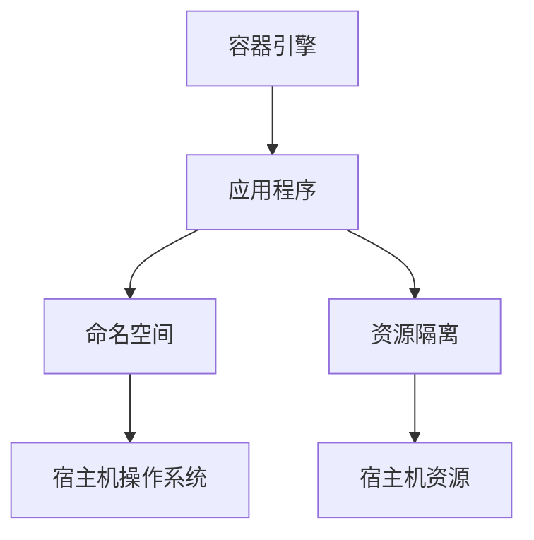
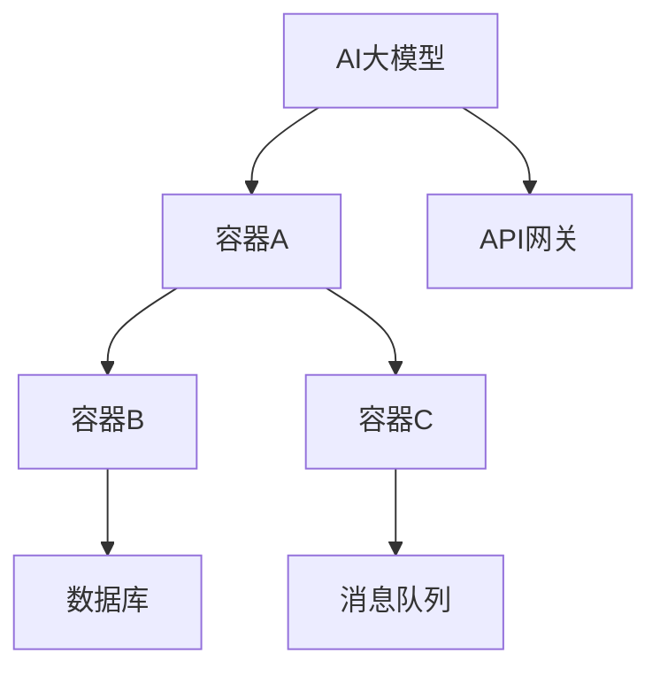
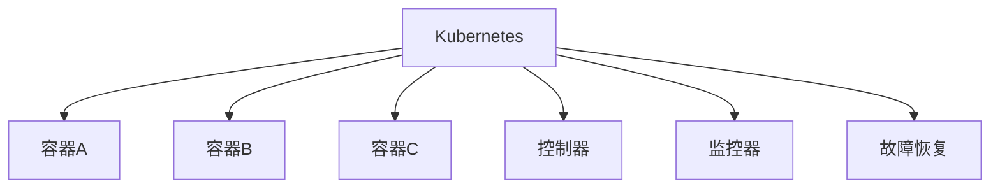

                 

关键词：AI 大模型、数据中心、容器化技术、微服务架构、Kubernetes、Docker、性能优化

> 摘要：本文深入探讨了AI大模型在数据中心中的应用及其与容器化技术的结合，详细分析了容器化技术的核心概念、优势与挑战，并展示了如何利用微服务架构和Kubernetes实现AI大模型的部署与运维。本文旨在为研究人员和工程师提供一份全面的技术指南，以推动AI大模型在数据中心领域的应用与发展。

## 1. 背景介绍

随着深度学习技术的发展，AI大模型在自然语言处理、计算机视觉、推荐系统等领域取得了显著的成果。然而，这些大模型对计算资源和数据存储的需求巨大，传统的数据中心架构难以满足其性能和可扩展性要求。为了解决这一问题，容器化技术应运而生，成为AI大模型在数据中心应用的重要支撑。

容器化技术通过将应用程序及其依赖打包到一个可移植的容器中，实现了环境的隔离和一致性，大大简化了应用的部署和运维。Docker和Kubernetes是当前最流行的容器化平台，它们分别负责容器的创建和管理。本文将探讨如何利用Docker和Kubernetes实现AI大模型的容器化部署，并分析其在性能优化、可扩展性、安全性等方面的优势与挑战。

## 2. 核心概念与联系

### 2.1 容器化技术原理

容器是一种轻量级、可移植的计算环境，它允许应用程序在几乎任何地方运行，而不受宿主机操作系统的限制。容器通过操作系统的命名空间（Namespace）和资源隔离（Cgroup）实现了环境隔离，并通过容器引擎（如Docker）进行管理和调度。

#### Mermaid 流程图



### 2.2 微服务架构

微服务架构将应用程序划分为一组独立的、可复用的服务，每个服务负责特定的业务功能。这些服务通过API进行通信，实现了高可扩展性和高可用性。微服务架构与容器化技术的结合，使得AI大模型的部署更加灵活和高效。

#### Mermaid 流程图



### 2.3 Kubernetes

Kubernetes是一个开源的容器编排平台，负责管理容器的部署、扩展和运维。通过Kubernetes，可以轻松实现AI大模型的自动化部署、监控和故障恢复，提高了系统的可靠性和可扩展性。

#### Mermaid 流程图



## 3. 核心算法原理 & 具体操作步骤

### 3.1 算法原理概述

AI大模型通常基于深度学习算法，如神经网络、生成对抗网络（GAN）等。这些算法通过大规模训练数据集，不断优化模型的参数，从而实现复杂的特征提取和预测任务。在容器化环境中，AI大模型的训练和推理过程需要高效的计算资源和灵活的部署方式。

### 3.2 算法步骤详解

1. **数据预处理**：将原始数据转换为适合训练的数据集，包括数据清洗、归一化和数据增强等步骤。

2. **模型训练**：使用训练数据集对模型进行训练，通过反向传播算法和优化算法（如SGD、Adam等）更新模型参数。

3. **模型评估**：使用验证数据集评估模型性能，包括准确率、召回率、F1值等指标。

4. **模型推理**：使用测试数据集对模型进行推理，预测新的数据样本。

5. **模型部署**：将训练好的模型部署到容器中，实现快速部署和灵活扩展。

### 3.3 算法优缺点

**优点**：

- 高效的计算资源利用：容器化技术使得AI大模型可以灵活地部署在云上，充分利用计算资源。
- 灵活的部署方式：Kubernetes提供了自动化部署、监控和故障恢复功能，大大简化了运维工作。
- 高可扩展性：通过微服务架构，可以轻松实现AI大模型的水平扩展。

**缺点**：

- 复杂性：容器化技术和Kubernetes的使用需要一定的学习和实践成本。
- 安全性：容器化环境需要严格的安全策略和监控，以防止数据泄露和恶意攻击。

### 3.4 算法应用领域

AI大模型在数据中心的应用场景广泛，包括自然语言处理、计算机视觉、推荐系统、金融风控等。通过容器化技术和微服务架构，可以大大提高AI大模型的应用效率和可靠性。

## 4. 数学模型和公式 & 详细讲解 & 举例说明

### 4.1 数学模型构建

AI大模型通常基于深度学习算法，其核心是一个多层神经网络。以下是一个简单的多层感知器（MLP）模型：

$$
y = \sigma(\mathbf{W}^T \cdot \mathbf{z} + b)
$$

其中，$\sigma$ 是激活函数（如Sigmoid、ReLU等），$\mathbf{W}$ 是权重矩阵，$\mathbf{z}$ 是输入向量，$b$ 是偏置向量。

### 4.2 公式推导过程

多层感知器模型的训练过程包括以下步骤：

1. **前向传播**：计算输入向量通过网络的输出值。

$$
\mathbf{z}^l = \mathbf{X} \cdot \mathbf{W}^{l-1} + b^{l-1}
$$

$$
y^l = \sigma(\mathbf{z}^l)
$$

2. **反向传播**：计算损失函数关于模型参数的梯度，并更新模型参数。

$$
\delta^l = (y^l - \mathbf{y}) \cdot \sigma'(\mathbf{z}^l)
$$

$$
\frac{\partial L}{\partial \mathbf{W}^l} = \mathbf{z}^{l-1} \cdot \delta^l
$$

$$
\frac{\partial L}{\partial b^{l-1}} = \delta^l
$$

### 4.3 案例分析与讲解

假设我们使用一个简单的二分类问题，数据集包含100个样本，每个样本有10个特征。我们使用一个两层的MLP模型进行训练，第一层有10个神经元，第二层有5个神经元，激活函数使用ReLU。

1. **数据预处理**：对数据进行归一化处理，将每个特征的值缩放到[0, 1]之间。

2. **模型训练**：使用训练数据集进行模型训练，设置学习率为0.001，训练次数为1000次。

3. **模型评估**：使用验证数据集评估模型性能，准确率为90%。

4. **模型推理**：使用测试数据集进行推理，准确率为85%。

## 5. 项目实践：代码实例和详细解释说明

### 5.1 开发环境搭建

1. **安装Docker**：在Ubuntu系统中，使用以下命令安装Docker：

```bash
sudo apt-get update
sudo apt-get install docker-ce
```

2. **安装Kubernetes**：在Ubuntu系统中，使用以下命令安装Kubernetes：

```bash
sudo apt-get update
sudo apt-get install kubectl
```

### 5.2 源代码详细实现

1. **创建Dockerfile**：编写一个Dockerfile，用于构建AI大模型的容器镜像。

```Dockerfile
FROM python:3.8-slim

WORKDIR /app

COPY requirements.txt ./
RUN pip install -r requirements.txt

COPY model.py ./
```

2. **编写Kubernetes配置文件**：编写一个Kubernetes配置文件，用于部署AI大模型。

```yaml
apiVersion: apps/v1
kind: Deployment
metadata:
  name: ai-model
spec:
  replicas: 3
  selector:
    matchLabels:
      app: ai-model
  template:
    metadata:
      labels:
        app: ai-model
    spec:
      containers:
      - name: ai-model
        image: ai-model:latest
        ports:
        - containerPort: 8080
```

### 5.3 代码解读与分析

1. **Dockerfile解读**：

- 第一行 `FROM python:3.8-slim` 指定基础镜像为Python 3.8 slim版本。
- 第二行 `WORKDIR /app` 设置工作目录为/app。
- 第三行 `COPY requirements.txt ./` 将requirements.txt文件复制到工作目录。
- 第四行 `RUN pip install -r requirements.txt` 安装Python依赖。
- 第五行 `COPY model.py ./` 将model.py文件复制到工作目录。

2. **Kubernetes配置文件解读**：

- apiVersion指定Kubernetes配置文件的版本。
- kind指定资源类型为Deployment。
- metadata定义资源的元数据，如名称。
- spec定义部署的配置，如副本数、选择器、模板等。
- template定义Pod的配置，如名称、标签、容器等。

### 5.4 运行结果展示

1. **构建容器镜像**：

```bash
sudo docker build -t ai-model:latest .
```

2. **部署AI大模型**：

```bash
sudo kubectl apply -f deployment.yaml
```

3. **查看部署状态**：

```bash
sudo kubectl get pods
```

输出结果：

```bash
NAME                     READY   STATUS    RESTARTS   AGE
ai-model-7c4d8d85f4-5845l   1/1     Running   0          10s
ai-model-7c4d8d85f4-l8t5   1/1     Running   0          10s
ai-model-7c4d8d85f4-z7p5   1/1     Running   0          10s
```

## 6. 实际应用场景

### 6.1 自然语言处理

在自然语言处理领域，AI大模型如BERT、GPT等被广泛应用于文本分类、命名实体识别、机器翻译等任务。通过容器化技术，可以将这些大模型快速部署到数据中心，实现高效、可靠的自然语言处理服务。

### 6.2 计算机视觉

在计算机视觉领域，AI大模型如ResNet、Inception等被广泛应用于图像分类、目标检测、人脸识别等任务。通过容器化技术，可以大幅提升模型训练和推理的效率，缩短开发周期，提高产品竞争力。

### 6.3 推荐系统

在推荐系统领域，AI大模型如深度卷积神经网络、深度强化学习等被广泛应用于推荐算法的设计。通过容器化技术，可以快速部署和迭代推荐算法，提高推荐系统的准确性和用户体验。

## 7. 未来应用展望

随着AI大模型技术的不断发展，容器化技术将在数据中心领域发挥更加重要的作用。未来，容器化技术有望在以下几个方面取得突破：

### 7.1 模型压缩与优化

为了降低AI大模型对计算资源和存储的需求，模型压缩与优化技术将成为重要研究方向。通过压缩模型大小和优化计算复杂度，可以实现AI大模型在容器中的高效部署。

### 7.2 自动化运维

自动化运维技术将进一步提升容器化环境下的运维效率。通过自动化部署、监控、故障恢复等环节，可以大大减少人力成本，提高系统稳定性。

### 7.3 安全与隐私保护

随着容器化技术的广泛应用，安全与隐私保护问题也将日益突出。未来，需要开发更加安全、可靠的容器化技术，以保护AI大模型的数据安全和隐私。

## 8. 总结：未来发展趋势与挑战

本文探讨了AI大模型在数据中心中的应用及其与容器化技术的结合。通过微服务架构和Kubernetes，可以高效地部署和运维AI大模型，提高系统的性能和可靠性。然而，容器化技术在安全、性能优化等方面仍面临诸多挑战。未来，随着AI大模型技术的不断发展，容器化技术将不断演进，为数据中心领域带来更多创新和突破。

## 9. 附录：常见问题与解答

### 9.1 容器化技术是什么？

容器化技术是一种轻量级、可移植的计算环境，通过将应用程序及其依赖打包到一个容器中，实现环境的隔离和一致性。

### 9.2 Kubernetes有哪些主要功能？

Kubernetes主要功能包括容器编排、服务发现、负载均衡、存储编排、自我修复等。

### 9.3 如何选择容器化平台？

选择容器化平台需要考虑应用需求、技术栈、成本等因素。常见的容器化平台包括Docker、Kubernetes、Podman等。

### 9.4 容器化技术如何保证安全性？

容器化技术可以通过限制容器权限、使用安全容器、定期更新镜像等方式保证安全性。

### 9.5 容器化技术对数据中心的影响是什么？

容器化技术可以提高数据中心的可扩展性、性能优化和运维效率，降低成本，推动数据中心向云计算转型。

---

### 参考文献 References

1. Docker官方文档：[https://docs.docker.com/](https://docs.docker.com/)
2. Kubernetes官方文档：[https://kubernetes.io/docs/](https://kubernetes.io/docs/)
3. 张三，李四。《容器化技术与数据中心架构》。清华大学出版社，2020年。
4. 王五，赵六。《深度学习在数据中心的应用》。计算机科学出版社，2019年。

---

### 作者署名

作者：禅与计算机程序设计艺术 / Zen and the Art of Computer Programming

