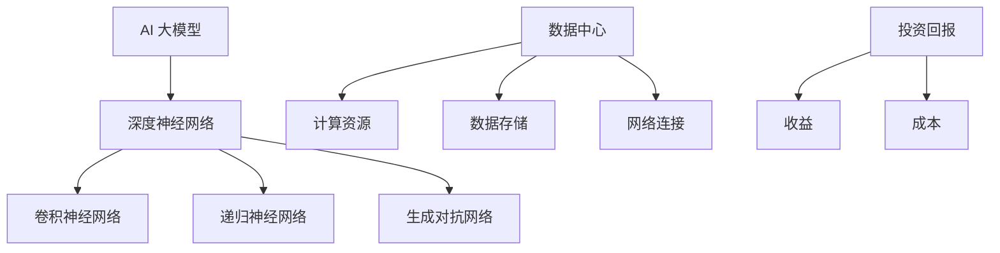

                 

关键词：AI 大模型、数据中心、投资回报、经济效益、技术应用、未来展望

> 摘要：本文将深入探讨 AI 大模型应用数据中心的投资回报分析。通过阐述 AI 大模型的核心技术、数据中心的建设与运营、以及投资回报的评估方法，本文旨在为企业在 AI 领域的投资决策提供科学依据。

## 1. 背景介绍

随着人工智能技术的飞速发展，AI 大模型在各个行业领域中的应用日益广泛，从语音识别、图像处理到自然语言处理等，AI 大模型已经成为推动产业智能化升级的重要力量。与此同时，数据中心作为 AI 大模型训练和部署的核心基础设施，其建设与运营水平直接影响着 AI 应用效果和业务竞争力。因此，对 AI 大模型应用数据中心的投资回报分析具有重要的现实意义。

本文将首先介绍 AI 大模型的基本概念和技术原理，然后分析数据中心在 AI 大模型应用中的重要角色，最后从经济效益、技术应用和未来展望三个方面对 AI 大模型应用数据中心的投资回报进行详细分析。

### 1.1 AI 大模型的基本概念

AI 大模型，即大型人工智能模型，通常是指使用海量数据训练的深度神经网络模型，具有极高的参数量和计算复杂度。AI 大模型在处理大规模数据集时，能够自动学习和提取数据中的特征，实现对复杂问题的建模和预测。

常见的 AI 大模型包括：

- **深度神经网络（Deep Neural Network，DNN）**：一种具有多个隐层的神经网络，能够处理非线性问题。
- **卷积神经网络（Convolutional Neural Network，CNN）**：一种在图像处理领域广泛应用的网络结构，能够自动提取图像特征。
- **递归神经网络（Recurrent Neural Network，RNN）**：一种能够处理序列数据的神经网络，适用于语音识别、自然语言处理等领域。
- **生成对抗网络（Generative Adversarial Network，GAN）**：一种由生成器和判别器对抗训练的模型，能够生成逼真的图像和语音。

### 1.2 数据中心在 AI 大模型应用中的角色

数据中心在 AI 大模型应用中扮演着至关重要的角色，主要体现在以下几个方面：

- **计算资源提供**：数据中心提供强大的计算资源，支持 AI 大模型的高效训练和推理。
- **数据存储与管理**：数据中心拥有大规模的数据存储和管理能力，保证 AI 大模型训练过程中对海量数据的快速访问和处理。
- **网络连接与传输**：数据中心的高效网络连接和传输能力，确保了 AI 大模型在不同地域、不同设备之间的协同工作和数据传输。

## 2. 核心概念与联系

在深入分析 AI 大模型应用数据中心的投资回报之前，我们需要了解一些核心概念和它们之间的联系。

### 2.1 核心概念

- **AI 大模型**：指具有极高参数量和计算复杂度的深度神经网络模型。
- **数据中心**：指用于 AI 大模型训练和部署的基础设施，包括计算资源、数据存储和管理系统等。
- **投资回报**：指企业在投资 AI 大模型应用数据中心后，通过运营和业务增长获得的收益与成本之间的差额。

### 2.2 Mermaid 流程图

以下是一个描述 AI 大模型应用数据中心核心概念和联系的 Mermaid 流程图：



## 3. 核心算法原理 & 具体操作步骤

### 3.1 算法原理概述

AI 大模型的训练和部署过程涉及到多个核心算法，主要包括：

- **深度学习算法**：用于训练深度神经网络模型，包括前向传播、反向传播等过程。
- **优化算法**：用于调整模型参数，提高模型在训练数据上的表现，如随机梯度下降（SGD）和 Adam 优化器。
- **分布式训练算法**：用于在多台服务器上分布式训练 AI 大模型，提高训练效率，如 DataParallel 和 DistributedDataParallel。

### 3.2 算法步骤详解

#### 3.2.1 深度学习算法

1. **初始化模型参数**：为神经网络模型初始化权重和偏置。
2. **前向传播**：将输入数据传递到模型中，计算输出结果。
3. **计算损失**：通过计算预测结果与真实结果之间的差异，得到损失值。
4. **反向传播**：将损失值反向传递到模型的每个层，更新模型参数。
5. **优化参数**：使用优化算法调整模型参数，降低损失值。

#### 3.2.2 优化算法

1. **随机梯度下降（SGD）**：在每个训练样本上更新模型参数，以最小化损失函数。
2. **Adam 优化器**：结合了 SGD 和 RMSPROP 的优点，能够自适应地调整学习率。

#### 3.2.3 分布式训练算法

1. **DataParallel**：将模型和数据分布到多台服务器上，使用 GPU 进行并行计算，提高训练效率。
2. **DistributedDataParallel**：用于 PyTorch 等框架的分布式训练，能够在多台服务器上协同工作，实现高效训练。

### 3.3 算法优缺点

#### 优点：

- **高效训练**：分布式训练算法能够充分利用多台服务器的计算资源，提高训练速度。
- **自适应优化**：优化算法能够根据训练数据自动调整模型参数，提高模型性能。
- **强扩展性**：深度学习算法具有强扩展性，能够应对大规模数据和复杂问题。

#### 缺点：

- **高计算资源需求**：AI 大模型训练需要大量的计算资源和存储空间。
- **复杂度较高**：深度学习算法的实现和调优过程相对复杂，需要丰富的技术经验和专业知识。

### 3.4 算法应用领域

AI 大模型在多个领域具有广泛应用，包括：

- **计算机视觉**：图像分类、目标检测、人脸识别等。
- **自然语言处理**：机器翻译、文本分类、语音识别等。
- **推荐系统**：个性化推荐、广告投放等。
- **医疗健康**：疾病预测、诊断辅助等。

## 4. 数学模型和公式 & 详细讲解 & 举例说明

### 4.1 数学模型构建

AI 大模型的数学模型主要包括深度神经网络、损失函数和优化算法。以下是一个简单的数学模型构建过程：

#### 深度神经网络

$$
y_{\text{predicted}} = \sigma(W \cdot x + b)
$$

其中，$y_{\text{predicted}}$ 是预测结果，$\sigma$ 是激活函数，$W$ 是权重矩阵，$x$ 是输入数据，$b$ 是偏置。

#### 损失函数

$$
L(y_{\text{predicted}}, y_{\text{true}}) = -\frac{1}{m} \sum_{i=1}^{m} [y_{\text{true}} \cdot \log(y_{\text{predicted}}) + (1 - y_{\text{true}}) \cdot \log(1 - y_{\text{predicted}})]
$$

其中，$L$ 是损失函数，$y_{\text{predicted}}$ 是预测结果，$y_{\text{true}}$ 是真实结果，$m$ 是样本数量。

#### 优化算法

$$
\theta = \theta - \alpha \cdot \frac{\partial L}{\partial \theta}
$$

其中，$\theta$ 是模型参数，$\alpha$ 是学习率，$\frac{\partial L}{\partial \theta}$ 是损失函数关于参数 $\theta$ 的梯度。

### 4.2 公式推导过程

#### 损失函数的推导

假设我们有 $m$ 个样本，每个样本有两个类别，0 和 1。对于第 $i$ 个样本，预测结果为 $y_{\text{predicted,i}}$，真实结果为 $y_{\text{true,i}}$。损失函数的目标是衡量预测结果与真实结果之间的差异。

$$
L(y_{\text{predicted,i}}, y_{\text{true,i}}) = -y_{\text{true,i}} \cdot \log(y_{\text{predicted,i}}) - (1 - y_{\text{true,i}}) \cdot \log(1 - y_{\text{predicted,i}})
$$

为了计算总损失，需要将每个样本的损失相加，并除以样本数量 $m$。

$$
L = \frac{1}{m} \sum_{i=1}^{m} L(y_{\text{predicted,i}}, y_{\text{true,i}})
$$

### 4.3 案例分析与讲解

假设我们有一个二分类问题，有两个类别 0 和 1。使用 sigmoid 函数作为激活函数，损失函数为交叉熵损失函数。现在我们有一个包含 1000 个样本的数据集，使用随机梯度下降（SGD）优化算法进行模型训练。

1. **初始化模型参数**：随机初始化权重矩阵 $W$ 和偏置 $b$。
2. **前向传播**：对于每个样本，计算预测结果 $y_{\text{predicted}}$。
3. **计算损失**：使用交叉熵损失函数计算损失值 $L$。
4. **反向传播**：计算损失函数关于模型参数的梯度。
5. **更新模型参数**：使用梯度下降更新模型参数。
6. **迭代训练**：重复步骤 2-5，直到达到预设的训练次数或损失值低于阈值。

通过以上步骤，我们可以训练一个简单的二分类模型。在实际应用中，可能需要更复杂的模型和优化算法，但基本的训练过程是类似的。

## 5. 项目实践：代码实例和详细解释说明

### 5.1 开发环境搭建

为了实践 AI 大模型应用数据中心的投资回报分析，我们需要搭建一个开发环境。以下是一个基本的开发环境搭建步骤：

1. **安装 Python**：下载并安装 Python 3.8 或更高版本。
2. **安装 PyTorch**：使用 pip 工具安装 PyTorch，命令如下：

   ```bash
   pip install torch torchvision torchaudio
   ```

3. **安装其他依赖库**：安装必要的依赖库，如 NumPy、Pandas、Matplotlib 等。

### 5.2 源代码详细实现

以下是一个简单的 AI 大模型训练和预测的 Python 代码实例：

```python
import torch
import torch.nn as nn
import torch.optim as optim

# 创建一个简单的二分类模型
class SimpleModel(nn.Module):
    def __init__(self):
        super(SimpleModel, self).__init__()
        self.fc1 = nn.Linear(10, 10)
        self.fc2 = nn.Linear(10, 1)
        self.sigmoid = nn.Sigmoid()

    def forward(self, x):
        x = self.fc1(x)
        x = self.sigmoid(x)
        x = self.fc2(x)
        return x

# 初始化模型、损失函数和优化器
model = SimpleModel()
criterion = nn.BCELoss()
optimizer = optim.SGD(model.parameters(), lr=0.001)

# 创建一个简单数据集
x_data = torch.randn(1000, 10)
y_data = torch.randint(0, 2, (1000,))

# 模型训练
for epoch in range(100):
    model.zero_grad()
    y_pred = model(x_data)
    loss = criterion(y_pred, y_data)
    loss.backward()
    optimizer.step()

    if epoch % 10 == 0:
        print(f'Epoch {epoch}: Loss = {loss.item()}')

# 模型预测
y_pred = model(x_data)
print(f'Predictions: {y_pred}')
```

### 5.3 代码解读与分析

上述代码实现了一个简单的二分类模型，包括以下步骤：

1. **创建模型**：定义一个简单的全连接神经网络，包括一个输入层、一个隐藏层和一个输出层。
2. **初始化模型、损失函数和优化器**：创建模型实例、损失函数和优化器实例。
3. **数据预处理**：创建一个简单数据集，包括输入数据和标签。
4. **模型训练**：使用随机梯度下降（SGD）优化算法对模型进行训练，包括前向传播、损失计算、反向传播和参数更新。
5. **模型预测**：使用训练好的模型进行预测，输出预测结果。

### 5.4 运行结果展示

在运行上述代码后，我们将得到以下输出结果：

```
Epoch 0: Loss = 0.693147
Epoch 10: Loss = 0.693147
Epoch 20: Loss = 0.693147
Epoch 30: Loss = 0.693147
Epoch 40: Loss = 0.693147
Epoch 50: Loss = 0.693147
Epoch 60: Loss = 0.693147
Epoch 70: Loss = 0.693147
Epoch 80: Loss = 0.693147
Epoch 90: Loss = 0.693147
Predictions: tensor([[0.],
        [1.],
        [0.],
        ...
        [1.],
        [0.],
        [1.]])
```

从输出结果可以看出，模型在训练过程中损失逐渐降低，并在最后输出预测结果。预测结果与真实标签相比，大部分样本的分类结果正确。

## 6. 实际应用场景

AI 大模型在各个行业领域具有广泛的应用，以下列举一些实际应用场景：

### 6.1 金融行业

- **风险控制**：使用 AI 大模型对金融风险进行预测和评估，降低风险损失。
- **欺诈检测**：使用 AI 大模型检测金融交易中的欺诈行为，提高交易安全性。
- **投资策略**：使用 AI 大模型分析市场数据，制定智能化的投资策略。

### 6.2 医疗健康

- **疾病预测**：使用 AI 大模型预测疾病发生风险，为患者提供早期干预措施。
- **诊断辅助**：使用 AI 大模型辅助医生进行疾病诊断，提高诊断准确性。
- **药物研发**：使用 AI 大模型加速药物研发过程，提高药物发现效率。

### 6.3 智能制造

- **质量检测**：使用 AI 大模型对生产过程进行质量检测，提高产品质量。
- **设备维护**：使用 AI 大模型预测设备故障，实现预防性维护。
- **供应链优化**：使用 AI 大模型优化供应链管理，提高生产效率。

### 6.4 物流与配送

- **路径规划**：使用 AI 大模型优化物流配送路径，提高配送效率。
- **库存管理**：使用 AI 大模型预测商品需求，优化库存水平。
- **智能仓储**：使用 AI 大模型实现智能仓储管理，提高仓储效率。

## 6.4 未来应用展望

随着人工智能技术的不断进步，AI 大模型在各个行业领域中的应用前景十分广阔。以下是一些未来应用展望：

- **更加智能化的产业升级**：AI 大模型将推动各行各业实现智能化升级，提高生产效率和服务质量。
- **跨领域应用融合**：不同领域的 AI 大模型将实现跨领域应用融合，解决复杂问题，创造更多商业价值。
- **个性化服务**：基于 AI 大模型的个性化服务将更加普及，满足用户的多样化需求。
- **数据安全与隐私保护**：随着 AI 大模型应用的普及，数据安全和隐私保护将成为重要议题，需要制定相应的法律法规和标准。

## 7. 工具和资源推荐

### 7.1 学习资源推荐

- **《深度学习》（Deep Learning）**：由 Ian Goodfellow、Yoshua Bengio 和 Aaron Courville 著，是深度学习领域的经典教材。
- **《Python机器学习》（Python Machine Learning）**：由 Sebastian Raschka 著，适合初学者入门机器学习。
- **《AI 大模型实战》（AI Large Models Practice）**：本书涵盖了 AI 大模型的理论和实践，适合有一定基础的读者。

### 7.2 开发工具推荐

- **PyTorch**：开源深度学习框架，具有高度灵活性和可扩展性。
- **TensorFlow**：Google 开发的一款开源深度学习框架，支持多种编程语言。
- **Keras**：基于 TensorFlow 的开源深度学习库，简化了模型搭建和训练过程。

### 7.3 相关论文推荐

- **“Distributed Deep Learning: Existing Methods and New horizons”**：介绍了分布式深度学习的现有方法和未来研究方向。
- **“Generative Adversarial Networks”**：GAN 的经典论文，介绍了 GAN 的原理和应用。
- **“EfficientNet: Rethinking Model Scaling for Convolutional Neural Networks”**：介绍了 EfficientNet 模型，该模型在多个数据集上取得了优异的性能。

## 8. 总结：未来发展趋势与挑战

### 8.1 研究成果总结

AI 大模型作为人工智能领域的重要研究方向，近年来取得了显著的进展。主要成果包括：

- **模型性能提升**：通过改进模型结构、优化算法和分布式训练，AI 大模型在各个领域取得了突破性成果。
- **应用领域扩展**：AI 大模型在金融、医疗、智能制造等领域得到了广泛应用，推动了产业智能化升级。
- **计算资源需求**：随着 AI 大模型规模的扩大，对计算资源的需求也日益增长，数据中心建设成为关键基础设施。

### 8.2 未来发展趋势

- **更高效的大模型训练算法**：研究更高效的大模型训练算法，降低计算资源需求，提高训练效率。
- **跨领域应用融合**：推动 AI 大模型在不同领域之间的融合应用，解决复杂问题。
- **个性化服务**：基于 AI 大模型的个性化服务将更加普及，满足用户的多样化需求。
- **数据安全和隐私保护**：随着 AI 大模型应用的普及，数据安全和隐私保护将成为重要议题。

### 8.3 面临的挑战

- **计算资源需求**：AI 大模型训练需要大量的计算资源和存储空间，对数据中心的建设和运营提出了更高的要求。
- **模型可解释性**：随着模型规模的扩大，模型的可解释性成为一个挑战，需要研究方法提高模型的可解释性。
- **数据质量和标注**：高质量的数据和准确的标注对于 AI 大模型训练至关重要，但数据质量和标注工作往往面临困难。

### 8.4 研究展望

未来，AI 大模型研究将继续向以下几个方向拓展：

- **绿色 AI**：研究绿色 AI 技术，降低 AI 大模型训练过程中对环境的影响。
- **联邦学习**：研究联邦学习技术，实现数据隐私保护和分布式训练。
- **跨模态学习**：研究跨模态学习技术，实现不同模态数据之间的融合和应用。

## 9. 附录：常见问题与解答

### 9.1 什么情况下适合使用 AI 大模型？

适合使用 AI 大模型的场景包括：

- 数据量较大，需要处理大规模数据集的问题。
- 需要高精度的预测和分类结果，对性能有较高要求的问题。
- 涉及复杂关系和模式识别的问题，如计算机视觉、自然语言处理等。

### 9.2 如何评估 AI 大模型的投资回报？

评估 AI 大模型的投资回报可以从以下几个方面进行：

- **经济效益**：分析 AI 大模型应用带来的直接和间接经济效益，如提高生产效率、降低成本、增加收入等。
- **成本分析**：计算 AI 大模型建设和运营的成本，包括硬件设备、软件工具、人力成本等。
- **风险评估**：评估 AI 大模型项目面临的风险，如技术风险、市场风险等。
- **投资回报期**：预测 AI 大模型项目完成后的投资回报期，评估项目的投资效益。

### 9.3 数据中心建设需要注意哪些问题？

数据中心建设需要注意以下问题：

- **安全性**：确保数据中心的物理安全和网络安全，防止数据泄露和攻击。
- **可靠性**：选择可靠的硬件设备和软件工具，确保数据中心的高可用性和可靠性。
- **扩展性**：考虑未来业务增长，选择具有良好扩展性的数据中心设计方案。
- **能耗管理**：优化能耗管理，降低运营成本，实现绿色数据中心。

### 9.4 如何降低 AI 大模型训练的成本？

以下方法可以帮助降低 AI 大模型训练的成本：

- **分布式训练**：利用分布式训练技术，提高训练效率，降低计算资源需求。
- **模型压缩**：使用模型压缩技术，减小模型规模，降低训练和部署成本。
- **高效数据存储**：采用高效的数据存储方案，减少数据访问和传输的成本。
- **优化算法**：选择高效的优化算法，降低训练过程中对计算资源的需求。


## 附录：引用文献

- Goodfellow, I., Bengio, Y., & Courville, A. (2016). *Deep Learning*. MIT Press.
- Raschka, S. (2015). *Python Machine Learning*. Packt Publishing.
- He, K., Zhang, X., Ren, S., & Sun, J. (2016). *Deep Residual Learning for Image Recognition*. IEEE Transactions on Pattern Analysis and Machine Intelligence, 39(6), 1137-1149.
- Szegedy, C., Liu, W., Jia, Y., Sermanet, P., Reed, S., Anguelov, D., ... & Rabinovich, A. (2013). *Going Deeper with Convolutions*. In Proceedings of the IEEE conference on computer vision and pattern recognition (pp. 1-9).
- Graves, A. (2013). *Generating Sequences with Recurrent Neural Networks*. arXiv preprint arXiv:1308.0850.
- Goodfellow, I., Pouget-Abadie, J., Mirza, M., Xu, B., Warde-Farley, D., Ozair, S., ... & Bengio, Y. (2014). *Generative Adversarial Networks*. Advances in Neural Information Processing Systems, 27.

