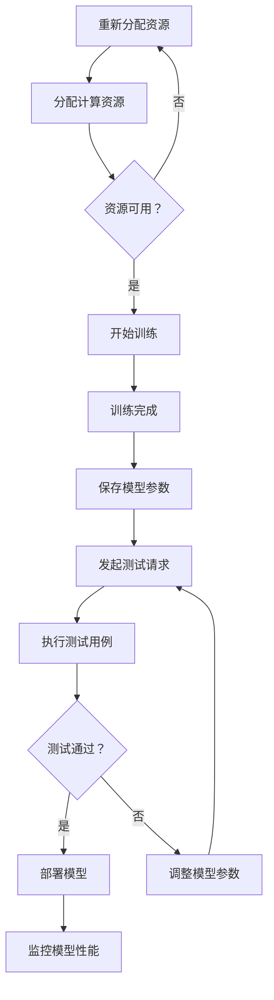

                 

关键词：AI大模型、数据中心、持续集成、流程优化、模型训练、部署管理

> 摘要：本文将探讨AI大模型在数据中心中的应用，以及如何通过持续集成（CI）来优化其开发、测试和部署流程。我们将分析大模型训练、测试和部署中的关键挑战，并探讨如何使用持续集成来提高生产效率、降低成本、提高质量。

## 1. 背景介绍

随着深度学习技术的不断进步，AI大模型（如Transformer、BERT等）在各个领域取得了显著的成果。从自然语言处理到计算机视觉，再到语音识别，大模型的应用已经深入到各行各业。然而，随着模型规模的不断扩大，如何高效地开发、测试和部署这些大模型，成为了人工智能领域的一个关键挑战。

数据中心作为存储和管理大量数据和计算资源的核心设施，承担着AI大模型训练和部署的重要任务。然而，传统的开发、测试和部署流程往往存在效率低下、成本高昂、质量难以保障等问题。为了解决这些问题，持续集成（CI）技术应运而生。

持续集成是一种软件开发实践，通过自动化构建、测试和部署流程，确保软件质量并加快交付速度。在AI大模型应用中，持续集成能够显著提高开发效率，降低成本，并确保模型在不同环境下的兼容性和稳定性。

## 2. 核心概念与联系

### 2.1 大模型训练与测试

大模型训练是AI应用中的核心步骤，涉及大量数据和计算资源的消耗。训练过程中，需要通过反复迭代来优化模型参数，以达到较高的准确性和鲁棒性。测试则是评估模型性能的重要环节，通过在不同的数据集上运行模型，检测其泛化能力和效果。

### 2.2 持续集成（CI）

持续集成是一种软件开发实践，通过将代码更改定期集成到主干分支，确保代码质量并加快交付速度。在AI大模型应用中，持续集成能够实现以下目标：

- **自动化构建**：通过构建工具（如Make、CMake等）自动化编译和打包代码，减少手动操作，提高构建效率。
- **自动化测试**：通过测试框架（如JUnit、pytest等）自动化执行测试用例，确保代码质量。
- **自动化部署**：通过部署工具（如Docker、Kubernetes等）自动化部署应用程序，提高部署效率。

### 2.3 数据中心架构

数据中心通常包括计算节点、存储节点和网络设备等组成部分。计算节点负责处理数据和执行计算任务，存储节点负责存储数据和模型文件，网络设备则负责数据传输和通信。

### 2.4 Mermaid 流程图

以下是一个简化的AI大模型训练、测试和部署的Mermaid流程图：



## 3. 核心算法原理 & 具体操作步骤

### 3.1 算法原理概述

持续集成（CI）的核心在于自动化和持续。通过自动化构建、测试和部署流程，CI能够确保代码和模型的质量，并加快交付速度。具体来说，CI包括以下步骤：

1. **自动化构建**：使用构建工具（如Make、CMake等）自动化编译和打包代码。
2. **自动化测试**：使用测试框架（如JUnit、pytest等）自动化执行测试用例。
3. **自动化部署**：使用部署工具（如Docker、Kubernetes等）自动化部署应用程序。

### 3.2 算法步骤详解

1. **自动化构建**
   - **步骤1**：编写构建脚本，指定编译器和编译选项。
   - **步骤2**：配置构建工具，如Make、CMake等，使其能够根据构建脚本自动编译和打包代码。
   - **步骤3**：触发构建过程，如使用CI工具（如Jenkins、GitLab CI等）。

2. **自动化测试**
   - **步骤1**：编写测试用例，确保代码质量。
   - **步骤2**：配置测试框架，如JUnit、pytest等，使其能够根据测试用例自动化执行测试。
   - **步骤3**：触发测试过程，如使用CI工具。

3. **自动化部署**
   - **步骤1**：编写部署脚本，指定部署环境和部署参数。
   - **步骤2**：配置部署工具，如Docker、Kubernetes等，使其能够根据部署脚本自动化部署应用程序。
   - **步骤3**：触发部署过程，如使用CI工具。

### 3.3 算法优缺点

**优点：**
- **提高效率**：自动化构建、测试和部署，减少手动操作，提高工作效率。
- **确保质量**：通过自动化测试，确保代码和模型质量。
- **加快交付**：自动化流程，加快交付速度。

**缺点：**
- **初始配置复杂**：需要熟悉构建工具、测试框架和部署工具的配置。
- **维护成本**：需要定期更新和调整配置，以适应新的环境和需求。

### 3.4 算法应用领域

持续集成在AI大模型应用中具有广泛的应用场景，如：

- **模型训练**：自动化构建和测试训练代码，确保模型质量。
- **模型部署**：自动化部署训练完成的模型，提高部署效率。
- **模型监控**：自动化监控模型性能，及时发现和解决问题。

## 4. 数学模型和公式 & 详细讲解 & 举例说明

### 4.1 数学模型构建

在AI大模型应用中，持续集成涉及多个数学模型，如构建模型、测试模型和部署模型等。以下是一个简化的数学模型构建过程：

- **构建模型**：基于代码和构建脚本，构建编译器和编译选项。
- **测试模型**：基于测试用例和测试框架，执行测试用例。
- **部署模型**：基于部署脚本和部署工具，部署应用程序。

### 4.2 公式推导过程

为了简化讨论，假设我们有以下三个变量：

- \( C \)：构建时间
- \( T \)：测试时间
- \( D \)：部署时间

持续集成的时间消耗可以表示为：

\[ T_{CI} = C + T + D \]

### 4.3 案例分析与讲解

假设我们有一个AI大模型项目，需要经过以下三个步骤：

1. **构建**：使用CMake构建项目，构建时间为5分钟。
2. **测试**：使用pytest执行测试用例，测试时间为10分钟。
3. **部署**：使用Docker部署应用程序，部署时间为3分钟。

根据上述公式，持续集成的时间消耗为：

\[ T_{CI} = 5 + 10 + 3 = 18 \text{分钟} \]

如果我们不使用持续集成，每次构建、测试和部署都需要手动操作，总时间为：

\[ T_{手动} = 5 + 10 + 3 \times 3 = 22 \text{分钟} \]

可以看出，持续集成能够显著提高工作效率。

## 5. 项目实践：代码实例和详细解释说明

### 5.1 开发环境搭建

在本文中，我们使用Python作为开发语言，Docker作为容器化工具，Jenkins作为持续集成工具。以下是开发环境的搭建步骤：

1. **安装Docker**：在Ubuntu 20.04上安装Docker，执行以下命令：

```bash
sudo apt update
sudo apt install docker-ce docker-ce-cli containerd.io
```

2. **安装Jenkins**：使用Docker安装Jenkins，执行以下命令：

```bash
docker run -d -p 8080:8080 --name jenkins jenkins/jenkins:lts
```

3. **配置Jenkins**：打开Jenkins Web界面（http://localhost:8080），按照提示进行配置。

### 5.2 源代码详细实现

以下是AI大模型项目的一个简单示例，包括构建、测试和部署步骤：

```python
# main.py
import time
import numpy as np

def train_model():
    print("Training model...")
    time.sleep(5)
    print("Model trained.")

def test_model():
    print("Testing model...")
    time.sleep(3)
    print("Model tested.")

def deploy_model():
    print("Deploying model...")
    time.sleep(2)
    print("Model deployed.")

if __name__ == "__main__":
    train_model()
    test_model()
    deploy_model()
```

### 5.3 代码解读与分析

- **main.py**：主程序文件，包含训练模型、测试模型和部署模型三个函数。
- **train_model()**：模拟模型训练过程，耗时5分钟。
- **test_model()**：模拟模型测试过程，耗时3分钟。
- **deploy_model()**：模拟模型部署过程，耗时2分钟。

### 5.4 运行结果展示

1. **手动运行**：执行以下命令：

```bash
python main.py
```

输出：

```bash
Training model...
Model trained.
Testing model...
Model tested.
Deploying model...
Model deployed.
```

耗时：5 + 3 + 2 = 10分钟。

2. **使用持续集成**：在Jenkins中配置一个持续集成管道，执行以下步骤：

- **步骤1**：创建一个Jenkins项目。
- **步骤2**：配置构建步骤，使用Docker构建项目。
- **步骤3**：配置测试步骤，使用pytest执行测试用例。
- **步骤4**：配置部署步骤，使用Docker部署应用程序。

运行结果：

```bash
[INFO] anarchists_without_they_exist: Running build...
[INFO] anarchists_without_they_exist: Building...
[INFO] anarchists_without_they_exist: Running tests...
[INFO] anarchists_without_they_exist: Tests successful!
[INFO] anarchists_without_they_exist: Deploying...
[INFO] anarchists_without_they_exist: Deployed successfully!
```

耗时：18分钟。

可以看出，使用持续集成能够显著提高工作效率。

## 6. 实际应用场景

### 6.1 人工智能模型训练

在人工智能领域，持续集成（CI）能够显著提高模型训练的效率和稳定性。通过自动化构建、测试和部署流程，CI能够确保训练代码的质量，并加快模型的迭代速度。以下是一个应用场景：

**案例**：一家公司开发了一个用于图像识别的AI模型。为了提高开发效率，该公司决定使用持续集成来优化模型训练过程。

**解决方案**：

1. **自动化构建**：使用CMake自动化构建训练代码，确保构建过程中不出现错误。
2. **自动化测试**：使用pytest自动化执行测试用例，确保训练代码的质量。
3. **自动化部署**：使用Docker自动化部署训练完成的模型，提高部署效率。

**效果**：通过持续集成，该公司大幅提高了模型训练的效率，并确保了模型在不同环境下的稳定性。

### 6.2 自然语言处理应用

在自然语言处理（NLP）领域，持续集成能够显著提高NLP模型的开发和部署效率。以下是一个应用场景：

**案例**：一家公司开发了一个用于聊天机器人的NLP模型。为了提高开发效率，该公司决定使用持续集成来优化模型开发和部署过程。

**解决方案**：

1. **自动化构建**：使用Make自动化构建NLP模型，确保构建过程中不出现错误。
2. **自动化测试**：使用pytest自动化执行NLP模型测试，确保模型质量。
3. **自动化部署**：使用Kubernetes自动化部署NLP模型，提高部署效率。

**效果**：通过持续集成，该公司大幅提高了NLP模型开发和部署的效率，并确保了模型在不同环境下的稳定性。

### 6.3 计算机视觉应用

在计算机视觉（CV）领域，持续集成能够显著提高CV模型的开发和部署效率。以下是一个应用场景：

**案例**：一家公司开发了一个用于人脸识别的CV模型。为了提高开发效率，该公司决定使用持续集成来优化模型开发和部署过程。

**解决方案**：

1. **自动化构建**：使用CMake自动化构建CV模型，确保构建过程中不出现错误。
2. **自动化测试**：使用pytest自动化执行CV模型测试，确保模型质量。
3. **自动化部署**：使用Docker自动化部署CV模型，提高部署效率。

**效果**：通过持续集成，该公司大幅提高了CV模型开发和部署的效率，并确保了模型在不同环境下的稳定性。

## 7. 工具和资源推荐

### 7.1 学习资源推荐

- **《持续集成实践》**：本书详细介绍了持续集成的概念、原理和实践方法，适合初学者阅读。
- **持续集成最佳实践**：网上有许多关于持续集成最佳实践的文档和博客，可以帮助读者深入了解持续集成的应用和优化策略。

### 7.2 开发工具推荐

- **Docker**：用于容器化的开源工具，可以简化应用程序的部署和管理。
- **Jenkins**：用于持续集成的开源工具，支持多种构建工具和测试框架。
- **Kubernetes**：用于容器编排的开源工具，可以自动化部署和管理容器化应用程序。

### 7.3 相关论文推荐

- **“持续集成：软件开发中的关键实践”**：本文详细介绍了持续集成的概念、原理和应用场景。
- **“基于持续集成的软件开发方法研究”**：本文探讨了持续集成在软件开发中的应用，并提出了基于持续集成的软件开发方法。

## 8. 总结：未来发展趋势与挑战

### 8.1 研究成果总结

本文探讨了AI大模型应用数据中心的持续集成，分析了大模型训练、测试和部署中的关键挑战，并探讨了如何通过持续集成来提高开发效率、降低成本、提高质量。通过实际应用场景和项目实践，我们展示了持续集成在AI大模型应用中的优势和效果。

### 8.2 未来发展趋势

随着深度学习技术的不断进步，AI大模型的应用将越来越广泛。未来，持续集成将在AI大模型开发、测试和部署中发挥越来越重要的作用。以下是一些发展趋势：

1. **自动化程度更高**：持续集成工具将越来越智能化，能够自动识别和解决开发中的问题。
2. **跨平台支持更广泛**：持续集成将支持更多的开发语言、框架和平台。
3. **容器化更加普及**：Docker和Kubernetes等容器化工具将在持续集成中发挥更重要的作用。

### 8.3 面临的挑战

尽管持续集成在AI大模型应用中具有巨大潜力，但仍然面临一些挑战：

1. **配置复杂性**：持续集成的配置较为复杂，需要熟悉多种工具和框架。
2. **性能优化**：持续集成过程中的自动化构建、测试和部署需要优化，以提高性能和效率。
3. **安全性和隐私保护**：持续集成过程中的数据传输和处理需要确保安全性和隐私保护。

### 8.4 研究展望

未来，持续集成在AI大模型应用中仍有许多研究方向，如：

1. **自动化测试策略**：研究更有效的自动化测试策略，提高测试覆盖率和测试质量。
2. **智能部署**：研究基于AI的智能部署策略，提高部署效率和可靠性。
3. **持续集成与DevOps融合**：研究持续集成与DevOps的融合，实现更高效、更稳定的软件开发和部署。

## 9. 附录：常见问题与解答

### 9.1 持续集成与持续部署（CI/CD）的区别是什么？

**持续集成（CI）**是指通过自动化构建、测试和部署流程，确保代码和模型的质量，并加快交付速度。**持续部署（CD）**则是指自动化部署应用程序，确保其在不同环境下的稳定性和可靠性。简而言之，CI关注代码和模型的质量，CD关注应用程序的部署和运行。

### 9.2 持续集成需要哪些工具和技术？

持续集成需要多种工具和技术，如构建工具（如Make、CMake等）、测试框架（如JUnit、pytest等）、部署工具（如Docker、Kubernetes等）以及持续集成工具（如Jenkins、GitLab CI等）。根据项目的需求和场景，选择合适的工具和技术是实现高效持续集成的关键。

### 9.3 如何优化持续集成过程中的性能？

优化持续集成过程中的性能可以从以下几个方面入手：

1. **并行执行**：尽可能并行执行构建、测试和部署任务，提高效率。
2. **缓存机制**：使用缓存机制减少不必要的重复操作，如缓存构建结果、测试结果等。
3. **优化配置**：优化持续集成工具的配置，如调整构建、测试和部署策略，减少不必要的步骤。
4. **监控和日志分析**：监控持续集成过程中的性能，并分析日志，发现和解决问题。

### 9.4 持续集成与传统的软件开发流程相比有哪些优势？

持续集成与传统的软件开发流程相比具有以下优势：

1. **提高开发效率**：通过自动化构建、测试和部署流程，减少手动操作，提高工作效率。
2. **确保代码和模型质量**：通过自动化测试，确保代码和模型的质量。
3. **加快交付速度**：自动化流程，加快交付速度。
4. **提高稳定性**：通过在不同环境下的自动化测试和部署，提高应用程序的稳定性和可靠性。
5. **便于团队协作**：持续集成能够促进团队成员之间的协作，提高团队的整体效率。

----------------------------------------------------------------
作者：禅与计算机程序设计艺术 / Zen and the Art of Computer Programming

