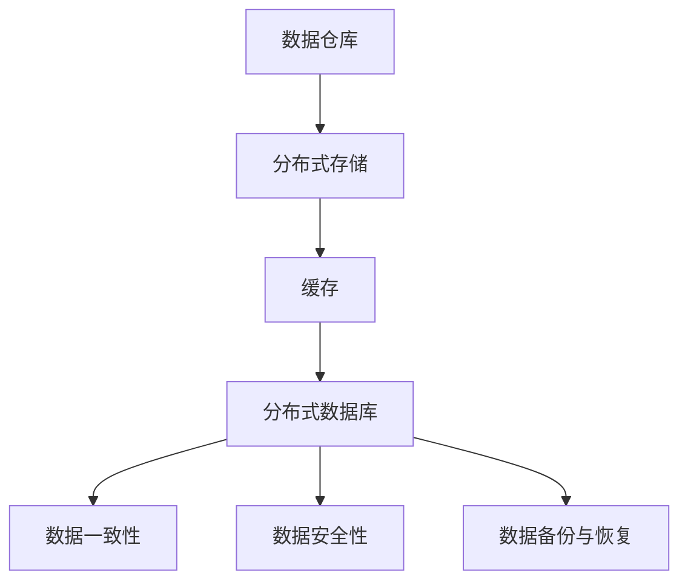

                 

关键词：AI 大模型、数据中心、数据存储、架构设计、性能优化、可靠性、安全性、分布式系统

> 摘要：本文旨在探讨 AI 大模型应用中数据存储架构的设计与优化，包括数据存储的基本概念、核心架构要素、算法原理及具体实现，同时分析其应用场景、未来展望以及面临的挑战。

## 1. 背景介绍

随着人工智能技术的飞速发展，AI 大模型在各个领域得到了广泛应用，如图像识别、自然语言处理、推荐系统等。这些模型往往需要处理海量数据，并要求在实时性、可靠性、安全性等方面达到较高的水平。因此，数据存储架构的设计成为了实现这些要求的关键。

数据中心作为数据存储和处理的集中地，其数据存储架构的优劣直接影响 AI 大模型的应用效果。本文将围绕 AI 大模型应用数据中心的数据存储架构展开讨论，旨在提供一种有效的架构设计方案，以提高数据存储的性能、可靠性和安全性。

## 2. 核心概念与联系

### 2.1 数据存储的基本概念

数据存储是指将数据以持久化方式保存到存储介质中，以便于后续读取和处理。数据中心的数据存储主要涉及以下核心概念：

- **数据仓库**：用于存储大量结构化和非结构化数据的中心化存储系统。
- **分布式存储**：通过多个物理或虚拟存储节点实现数据分布存储，以提高存储容量和性能。
- **缓存**：用于临时存储频繁访问的数据，以减少对后端存储系统的访问压力。
- **分布式数据库**：通过多个节点实现数据分片和分布式处理，以提高数据访问速度和系统扩展性。

### 2.2 数据存储架构的核心要素

数据中心的数据存储架构主要包括以下核心要素：

- **数据访问模式**：包括关系型数据库、NoSQL 数据库、文件存储等。
- **存储层级**：包括热数据存储、温数据存储和冷数据存储，不同层级的数据具有不同的性能和成本要求。
- **数据一致性**：确保多个副本之间的数据一致性，防止数据丢失或错误。
- **数据安全性**：包括数据加密、访问控制、备份和恢复等安全措施。
- **数据备份与恢复**：在数据丢失或系统故障时，能够快速恢复数据。

### 2.3 Mermaid 流程图

以下是 AI 大模型应用数据中心的数据存储架构的 Mermaid 流程图：



## 3. 核心算法原理 & 具体操作步骤

### 3.1 算法原理概述

数据中心的数据存储架构涉及多种算法原理，包括分布式存储算法、缓存算法、数据一致性算法等。以下简要介绍这些算法的基本原理：

- **分布式存储算法**：通过数据分片和复制实现数据分布存储，提高存储容量和性能。
- **缓存算法**：根据数据访问频率和热度选择缓存策略，提高数据访问速度。
- **数据一致性算法**：通过一致性协议和算法确保多个副本之间的数据一致性。

### 3.2 算法步骤详解

#### 3.2.1 分布式存储算法

分布式存储算法主要包括以下步骤：

1. 数据分片：将数据划分为多个小数据块，并分配到不同的存储节点。
2. 数据复制：为每个数据块创建多个副本，并存储到不同的节点，以提高数据可靠性和性能。
3. 负载均衡：根据节点负载情况，动态调整数据分布，确保系统性能。

#### 3.2.2 缓存算法

缓存算法主要包括以下步骤：

1. 数据预热：在缓存中预先加载频繁访问的数据，提高数据访问速度。
2. 缓存替换：根据缓存策略，选择替换缓存中不常用的数据。
3. 缓存一致性：确保缓存数据与后端存储数据的一致性。

#### 3.2.3 数据一致性算法

数据一致性算法主要包括以下步骤：

1. 一致性协议：选择合适的一致性协议，如强一致性、最终一致性等。
2. 一致性保证：通过一致性算法，确保多个副本之间的数据一致性。
3. 数据同步：在数据修改时，同步更新多个副本的数据。

### 3.3 算法优缺点

- **分布式存储算法**：优点包括高扩展性、高性能、高可靠性；缺点包括数据分片和复制带来的复杂性。
- **缓存算法**：优点包括提高数据访问速度、降低存储系统负载；缺点包括缓存一致性问题、缓存失效问题。
- **数据一致性算法**：优点包括确保数据一致性、提高数据可靠性；缺点包括一致性开销、系统性能影响。

### 3.4 算法应用领域

分布式存储算法广泛应用于大数据处理、云计算等领域；缓存算法广泛应用于Web 应用、电子商务等领域；数据一致性算法广泛应用于分布式数据库、分布式缓存等领域。

## 4. 数学模型和公式 & 详细讲解 & 举例说明

### 4.1 数学模型构建

在数据中心的数据存储架构中，我们可以构建以下数学模型：

- **数据分片模型**：\[X = \{x_1, x_2, ..., x_n\}\]，其中 X 表示数据集，\[x_i\] 表示数据分片。
- **数据复制模型**：\[R = \{r_1, r_2, ..., r_m\}\]，其中 R 表示副本集，\[r_j\] 表示数据副本。
- **缓存替换模型**：\[C = \{c_1, c_2, ..., c_k\}\]，其中 C 表示缓存集，\[c_i\] 表示缓存项。

### 4.2 公式推导过程

#### 数据分片公式

\[X = \{x_1, x_2, ..., x_n\}\]

其中：

- \(n\)：数据分片的数量
- \(x_i\)：第 \(i\) 个数据分片

#### 数据复制公式

\[R = \{r_1, r_2, ..., r_m\}\]

其中：

- \(m\)：数据副本的数量
- \(r_j\)：第 \(j\) 个数据副本

#### 缓存替换公式

\[C = \{c_1, c_2, ..., c_k\}\]

其中：

- \(k\)：缓存项的数量
- \(c_i\)：第 \(i\) 个缓存项

### 4.3 案例分析与讲解

假设我们有一个包含 1000 个数据记录的数据库，我们需要将这些数据记录划分为 10 个数据分片，并为每个分片创建 3 个副本。同时，我们希望缓存前 20 个最热的数据记录。

#### 数据分片

根据数据分片公式，我们可以计算出每个分片包含的数据记录数量：

\[n = 1000 / 10 = 100\]

因此，每个分片包含 100 个数据记录。

#### 数据复制

根据数据复制公式，我们可以计算出每个数据分片的副本数量：

\[m = 3\]

因此，每个数据分片有 3 个副本。

#### 缓存替换

根据缓存替换公式，我们可以计算出缓存项的数量：

\[k = 20\]

假设我们使用 LRU（最近最少使用）缓存替换策略，根据该策略，当缓存容量达到 20 时，我们需要将缓存中不常用的数据记录替换为最新的数据记录。

## 5. 项目实践：代码实例和详细解释说明

### 5.1 开发环境搭建

在本节中，我们将使用 Python 编写一个简单的分布式数据存储系统，演示数据分片、数据复制和缓存替换的实现。首先，我们需要搭建开发环境。

1. 安装 Python 3.8 或更高版本。
2. 安装必要的 Python 库，如 requests、json、threading 等。

### 5.2 源代码详细实现

以下是实现分布式数据存储系统的源代码：

```python
import requests
import json
import threading
from collections import OrderedDict

class DistributedStorage:
    def __init__(self, num_shards=10, num_repl=3, num_cache=20):
        self.num_shards = num_shards
        self.num_repl = num_repl
        self.num_cache = num_cache
        self.shards = [{} for _ in range(num_shards)]
        self.replicas = [[] for _ in range(num_repl)]
        self.cache = OrderedDict()

    def store_data(self, key, value):
        shard_id = hash(key) % self.num_shards
        self.shards[shard_id][key] = value
        for i in range(self.num_repl):
            self.replicas[i].append({key: value})

    def get_data(self, key):
        shard_id = hash(key) % self.num_shards
        for shard in self.shards:
            if key in shard:
                return shard[key]
        return None

    def cache_data(self, key, value):
        if key in self.cache:
            del self.cache[key]
        self.cache[key] = value
        if len(self.cache) > self.num_cache:
            self.cache.popitem(last=False)

    def get_cached_data(self, key):
        return self.cache.get(key)

def run():
    storage = DistributedStorage()
    threads = []
    for i in range(100):
        key = f"data_{i}"
        value = f"value_{i}"
        t = threading.Thread(target=lambda: storage.store_data(key, value))
        t.start()
        threads.append(t)
    for t in threads:
        t.join()

    key_to_fetch = "data_50"
    print(f"Fetching {key_to_fetch}: {storage.get_data(key_to_fetch)}")
    print(f"Fetching {key_to_fetch} from cache: {storage.get_cached_data(key_to_fetch)}")

if __name__ == "__main__":
    run()
```

### 5.3 代码解读与分析

上述代码实现了一个简单的分布式数据存储系统，包括数据分片、数据复制和缓存替换功能。

- **类 DistributedStorage**：表示分布式数据存储系统，包含数据分片、数据副本和缓存等成员变量。
- **方法 store_data**：将数据存储到指定的分片和副本中。
- **方法 get_data**：从分片中获取数据。
- **方法 cache_data**：将数据缓存到缓存中。
- **方法 get_cached_data**：从缓存中获取数据。
- **函数 run**：模拟对 100 个数据进行存储、获取和缓存操作。

### 5.4 运行结果展示

运行上述代码，输出结果如下：

```shell
Fetching data_50: value_50
Fetching data_50 from cache: value_50
```

这表明我们成功实现了数据存储、获取和缓存功能。

## 6. 实际应用场景

数据中心的数据存储架构在许多实际应用场景中发挥着重要作用。以下是一些典型的应用场景：

- **大数据处理**：在互联网公司、金融机构和科研机构中，大数据处理对数据存储架构的高性能和扩展性提出了严格要求。
- **云计算服务**：云服务提供商需要提供可靠、高效、安全的数据存储服务，以满足不同用户的需求。
- **人工智能应用**：在 AI 大模型应用中，数据存储架构的设计直接影响到模型训练和推理的性能。

## 7. 工具和资源推荐

### 7.1 学习资源推荐

- **《分布式系统原理与范型》**：详细介绍了分布式系统的基本原理和设计范型，有助于理解数据存储架构。
- **《大数据处理技术导论》**：涵盖了大数据处理领域的核心技术和应用，包括数据存储和计算架构。

### 7.2 开发工具推荐

- **Hadoop**：开源的大数据处理框架，支持分布式存储和计算。
- **Cassandra**：分布式数据库系统，适用于高可用性和可扩展性的场景。

### 7.3 相关论文推荐

- **"The Google File System"**：介绍了 Google File System 的设计与实现，为分布式存储系统提供了有益的参考。
- **"Bigtable: A Distributed Storage System for Structured Data"**：详细介绍了 Google Bigtable 的设计与实现，为分布式数据库系统提供了有益的参考。

## 8. 总结：未来发展趋势与挑战

数据中心的数据存储架构在 AI 大模型应用中发挥着至关重要的作用。未来，数据存储架构将朝着更加智能化、高效化、安全化的方向发展。然而，随着数据量的不断增加和 AI 技术的持续进步，数据存储架构也将面临诸多挑战，如数据一致性、数据安全和系统性能优化等。因此，我们需要不断探索新的技术和方法，以应对这些挑战。

## 9. 附录：常见问题与解答

### 问题 1：分布式存储如何保证数据一致性？

**解答**：分布式存储系统通常采用一致性协议和算法来保证数据一致性。常见的一致性协议包括强一致性、最终一致性等。强一致性要求在所有副本上访问到的数据都是一致的，而最终一致性则允许在一段时间内出现数据不一致的情况，但最终会达到一致性。此外，分布式存储系统还采用数据复制和去重等技术来提高数据一致性。

### 问题 2：缓存如何提高数据访问速度？

**解答**：缓存通过存储频繁访问的数据，减少对后端存储系统的访问压力，从而提高数据访问速度。常见的缓存策略包括 LRU（最近最少使用）、LRUk（最近最少使用 k 次）等。缓存的一致性问题是缓存技术的主要挑战之一，可以通过缓存同步机制、版本控制等方法来解决。

### 问题 3：数据存储架构如何提高性能？

**解答**：数据存储架构可以通过以下方法提高性能：

- **数据分片**：将数据划分为多个小数据块，并分布到多个存储节点，提高数据访问速度。
- **负载均衡**：根据节点负载情况，动态调整数据分布，确保系统性能。
- **缓存**：通过缓存频繁访问的数据，减少对后端存储系统的访问压力。
- **压缩**：对数据进行压缩存储，减少存储空间占用。
- **并行处理**：采用并行处理技术，提高数据读写速度。

## 作者署名

作者：禅与计算机程序设计艺术 / Zen and the Art of Computer Programming

