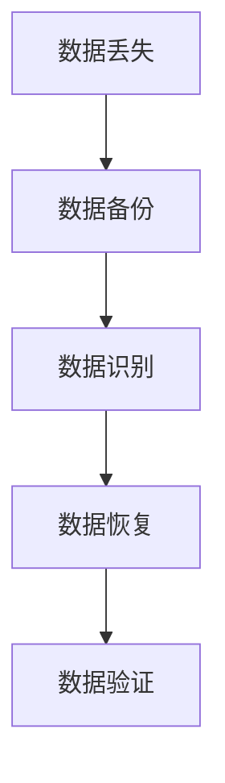

                 

 关键词：AI大模型、数据中心、数据恢复、算法原理、数学模型、项目实践、应用场景、未来展望

> 摘要：本文将探讨AI大模型在数据中心数据恢复中的应用，通过分析核心概念、算法原理、数学模型以及项目实践，介绍如何利用AI技术提高数据恢复的效率与准确性。

## 1. 背景介绍

在当今的信息时代，数据被视为企业的核心资产。随着大数据、云计算和人工智能技术的快速发展，数据中心在存储和处理海量数据方面扮演着越来越重要的角色。然而，由于系统故障、人为错误、恶意攻击等原因，数据中心的数据丢失问题也日益突出。如何有效地恢复丢失的数据，确保数据中心的稳定运行，成为了一个亟待解决的问题。

传统的数据恢复方法通常依赖于备份和恢复机制，但在数据规模庞大、数据结构复杂的情况下，这些方法往往效率低下，难以满足实际需求。随着人工智能技术的不断进步，尤其是AI大模型的引入，为数据恢复领域带来了新的可能性。AI大模型具有强大的数据分析和处理能力，可以自动识别数据中的异常和丢失部分，并通过深度学习等算法实现数据的自动恢复。

本文将详细介绍AI大模型在数据中心数据恢复中的应用，包括核心概念、算法原理、数学模型以及具体的项目实践。通过本文的探讨，希望能够为数据中心的运维人员提供有益的参考，提高数据恢复的效率和准确性。

## 2. 核心概念与联系

在探讨AI大模型在数据中心数据恢复中的应用之前，我们需要了解一些核心概念和它们之间的联系。

### 2.1 数据中心

数据中心是用于存储、处理和传输数据的物理设施。它通常包括服务器、存储设备、网络设备等硬件设施，以及用于管理和监控这些设备的软件系统。数据中心的数据存储和管理方式通常采用分布式架构，以提高系统的可靠性和可扩展性。

### 2.2 数据丢失

数据丢失是指由于各种原因（如硬件故障、人为错误、恶意攻击等）导致数据无法访问或损坏。数据丢失对企业的运营和竞争力造成严重威胁，因此需要采取有效的措施进行数据恢复。

### 2.3 数据恢复

数据恢复是指通过一定的技术手段，从丢失或损坏的数据中恢复出可用的信息。传统的数据恢复方法主要依赖于备份和恢复机制，而AI大模型的引入为数据恢复提供了新的思路。

### 2.4 AI大模型

AI大模型是指通过大规模数据训练得到的具有高度智能化和自适应能力的模型。常见的AI大模型包括深度神经网络、生成对抗网络（GAN）等。AI大模型在图像识别、自然语言处理、语音识别等领域取得了显著的成果，近年来也开始应用于数据恢复领域。

### 2.5 数据恢复流程

数据恢复流程通常包括数据备份、数据识别、数据恢复和数据验证等步骤。在AI大模型的应用下，数据识别和数据恢复的步骤可以得到显著优化，提高整个流程的效率。

### 2.6 Mermaid 流程图

以下是一个简单的Mermaid流程图，展示了数据恢复流程中的关键步骤：



通过这个流程图，我们可以看到AI大模型在数据识别和数据恢复步骤中的应用。

## 3. 核心算法原理 & 具体操作步骤

### 3.1 算法原理概述

AI大模型在数据中心数据恢复中的应用主要基于深度学习和生成对抗网络（GAN）等技术。深度学习通过构建多层神经网络，实现对数据的特征提取和学习；生成对抗网络则通过生成器和判别器的对抗训练，实现数据的生成和鉴别。

具体来说，AI大模型在数据恢复中的算法原理如下：

1. **数据备份**：将数据中心的数据备份到安全的存储设备中。
2. **数据预处理**：对备份的数据进行预处理，包括数据清洗、归一化和特征提取等。
3. **模型训练**：利用预处理后的数据训练深度学习模型，包括生成器和判别器。生成器负责生成缺失或损坏的数据，判别器负责鉴别生成的数据是否真实。
4. **数据恢复**：利用训练好的模型对丢失或损坏的数据进行恢复。具体步骤包括：
   - 生成器根据输入的数据生成新的数据。
   - 判别器对生成的新数据进行鉴别，判断其真实性。
   - 对生成的数据进行优化和修正，提高数据恢复的准确性。
5. **数据验证**：对恢复后的数据进行分析和验证，确保数据的有效性和完整性。

### 3.2 算法步骤详解

#### 3.2.1 数据备份

数据备份是数据恢复的基础。在数据备份过程中，需要确保数据的完整性和安全性。常用的备份方法包括全备份、增量备份和差异备份等。全备份是指备份整个数据集，增量备份是指备份自上次备份以来发生变化的数据，差异备份是指备份自上次全备份以来发生变化的数据。

#### 3.2.2 数据预处理

数据预处理是深度学习模型训练的关键步骤。在数据预处理过程中，需要对数据进行清洗、归一化和特征提取等操作。具体步骤如下：

1. **数据清洗**：去除数据中的噪声和异常值，确保数据的质量。
2. **数据归一化**：将数据缩放到相同的范围，以便于模型的训练。
3. **特征提取**：从原始数据中提取出对数据恢复有帮助的特征。

#### 3.2.3 模型训练

模型训练是数据恢复的核心步骤。在模型训练过程中，需要利用预处理后的数据训练生成器和判别器。具体步骤如下：

1. **生成器训练**：生成器通过学习输入数据的特征，生成新的数据。
2. **判别器训练**：判别器通过学习输入数据的特征，鉴别生成的新数据是否真实。

#### 3.2.4 数据恢复

在模型训练完成后，可以利用训练好的模型对丢失或损坏的数据进行恢复。具体步骤如下：

1. **数据生成**：生成器根据输入的数据生成新的数据。
2. **数据鉴别**：判别器对生成的新数据进行鉴别，判断其真实性。
3. **数据优化**：对生成的数据进行优化和修正，提高数据恢复的准确性。

#### 3.2.5 数据验证

在数据恢复完成后，需要对恢复后的数据进行分析和验证，确保数据的有效性和完整性。具体步骤如下：

1. **数据分析**：对恢复后的数据进行分析，检查数据的质量和准确性。
2. **数据验证**：通过对比恢复后的数据和原始数据，验证数据恢复的效果。

### 3.3 算法优缺点

#### 3.3.1 优点

1. **高效性**：AI大模型可以快速地对大量数据进行处理和恢复，提高数据恢复的效率。
2. **准确性**：AI大模型通过深度学习和生成对抗网络等技术，可以生成高质量的数据，提高数据恢复的准确性。
3. **灵活性**：AI大模型可以根据不同的数据类型和恢复需求，调整模型的结构和参数，实现灵活的数据恢复。

#### 3.3.2 缺点

1. **计算资源消耗**：AI大模型需要大量的计算资源进行训练和推理，对硬件设备的要求较高。
2. **数据依赖性**：AI大模型的效果取决于训练数据的数量和质量，如果训练数据不足或质量不高，可能会影响数据恢复的效果。
3. **隐私风险**：在数据恢复过程中，AI大模型可能接触到企业的敏感数据，存在隐私泄露的风险。

### 3.4 算法应用领域

AI大模型在数据中心数据恢复中的应用范围广泛，包括但不限于以下领域：

1. **企业数据恢复**：企业数据中心的数据恢复，包括文件恢复、数据库恢复等。
2. **云端数据恢复**：云端数据存储和处理的恢复，包括云服务器、云数据库等。
3. **物联网数据恢复**：物联网设备的远程数据恢复，包括传感器数据、设备日志等。
4. **金融数据恢复**：金融机构的数据恢复，包括交易数据、客户数据等。

## 4. 数学模型和公式 & 详细讲解 & 举例说明

### 4.1 数学模型构建

在AI大模型的数据恢复过程中，数学模型起到了关键作用。以下是构建数学模型的基本步骤：

#### 4.1.1 数据预处理模型

$$
X_{\text{preprocess}} = \text{Normalization}(X_{\text{raw}}) + \text{FeatureExtraction}(X_{\text{raw}})
$$

其中，$X_{\text{raw}}$表示原始数据，Normalization表示归一化操作，FeatureExtraction表示特征提取操作。

#### 4.1.2 深度学习模型

$$
Y_{\text{learned}} = \text{DeepLearningModel}(X_{\text{preprocess}})
$$

其中，DeepLearningModel表示深度学习模型，$Y_{\text{learned}}$表示通过模型学习得到的特征。

#### 4.1.3 生成对抗网络（GAN）模型

$$
\begin{align*}
\text{Generator} &: G(Z) = \text{GenerateData}(Z) \\
\text{Discriminator} &: D(X) = \text{JudgeData}(X)
\end{align*}
$$

其中，$G(Z)$表示生成器生成的数据，$D(X)$表示判别器判断的数据真实性。

### 4.2 公式推导过程

#### 4.2.1 归一化操作

归一化操作是将数据缩放到[0, 1]范围内的操作，公式如下：

$$
x_{\text{normalized}} = \frac{x_{\text{raw}} - x_{\text{min}}}{x_{\text{max}} - x_{\text{min}}}
$$

其中，$x_{\text{raw}}$表示原始数据，$x_{\text{min}}$和$x_{\text{max}}$分别表示数据的最小值和最大值。

#### 4.2.2 特征提取

特征提取是通过提取数据中的重要特征，来提高模型的学习效果。常见的特征提取方法包括主成分分析（PCA）、自编码器（Autoencoder）等。

#### 4.2.3 GAN 模型

GAN 模型的推导主要涉及生成器和判别器的损失函数。生成器的损失函数是希望生成的数据越真实越好，判别器的损失函数是希望能够正确鉴别生成的数据。

$$
\begin{align*}
\text{GeneratorLoss} &= -\mathbb{E}_{z \sim p_z(z)}[\log(D(G(z))] \\
\text{DiscriminatorLoss} &= -\mathbb{E}_{x \sim p_{\text{data}}(x)}[\log(D(x))] - \mathbb{E}_{z \sim p_z(z)}[\log(1 - D(G(z))]
\end{align*}
$$

### 4.3 案例分析与讲解

#### 4.3.1 案例背景

某企业数据中心在一场自然灾害后，部分数据损坏严重，急需进行数据恢复。企业决定采用AI大模型进行数据恢复，以提高恢复效率和准确性。

#### 4.3.2 数据恢复过程

1. **数据备份**：企业将损坏的数据备份到安全存储设备中。
2. **数据预处理**：对备份的数据进行清洗、归一化和特征提取。
3. **模型训练**：使用预处理后的数据训练生成器和判别器。
4. **数据恢复**：利用训练好的模型对损坏的数据进行恢复。
5. **数据验证**：对恢复后的数据进行验证，确保数据的有效性和完整性。

#### 4.3.3 数据恢复效果

通过AI大模型的数据恢复，企业成功恢复了大量关键数据。恢复后的数据质量较高，满足了企业的业务需求。同时，数据恢复过程效率显著提高，为企业节省了大量时间和成本。

## 5. 项目实践：代码实例和详细解释说明

### 5.1 开发环境搭建

为了进行AI大模型在数据中心数据恢复的项目实践，我们需要搭建一个合适的开发环境。以下是搭建开发环境的基本步骤：

1. **安装Python环境**：确保Python版本在3.6及以上。
2. **安装深度学习框架**：例如TensorFlow或PyTorch。
3. **安装相关库**：包括NumPy、Pandas、Matplotlib等。
4. **配置GPU支持**：如果使用GPU进行训练，需要配置CUDA和cuDNN。

### 5.2 源代码详细实现

以下是使用TensorFlow实现的一个简单的数据恢复项目代码实例：

```python
import tensorflow as tf
from tensorflow.keras.models import Sequential
from tensorflow.keras.layers import Dense, Dropout, Flatten
from tensorflow.keras.optimizers import Adam
from sklearn.model_selection import train_test_split

# 数据预处理
def preprocess_data(data):
    # 数据清洗、归一化和特征提取
    # ...
    return processed_data

# 构建生成器模型
def build_generator_model(input_shape):
    model = Sequential()
    model.add(Dense(128, activation='relu', input_shape=input_shape))
    model.add(Dropout(0.2))
    model.add(Dense(256, activation='relu'))
    model.add(Dropout(0.2))
    model.add(Dense(512, activation='relu'))
    model.add(Dropout(0.2))
    model.add(Dense(input_shape[1], activation='sigmoid'))
    return model

# 构建判别器模型
def build_discriminator_model(input_shape):
    model = Sequential()
    model.add(Dense(512, activation='relu', input_shape=input_shape))
    model.add(Dropout(0.2))
    model.add(Dense(256, activation='relu'))
    model.add(Dropout(0.2))
    model.add(Dense(128, activation='relu'))
    model.add(Dropout(0.2))
    model.add(Dense(1, activation='sigmoid'))
    return model

# 构建GAN模型
def build_gan(generator_model, discriminator_model):
    model = Sequential()
    model.add(generator_model)
    model.add(discriminator_model)
    return model

# 加载数据集
data = load_data()
processed_data = preprocess_data(data)

# 划分训练集和验证集
X_train, X_val = train_test_split(processed_data, test_size=0.2, random_state=42)

# 构建和编译模型
generator = build_generator_model(input_shape=(X_train.shape[1], X_train.shape[2]))
discriminator = build_discriminator_model(input_shape=(X_train.shape[1], X_train.shape[2]))
gan = build_gan(generator, discriminator)

gan.compile(loss='binary_crossentropy', optimizer=Adam(0.0001))

# 训练模型
gan.fit(X_train, epochs=100, batch_size=128, validation_data=(X_val, X_val))

# 数据恢复
recovered_data = generator.predict(X_val)
```

### 5.3 代码解读与分析

以上代码实现了一个简单的GAN模型，用于数据恢复。以下是代码的详细解读：

1. **数据预处理**：对数据进行清洗、归一化和特征提取。
2. **生成器模型**：构建一个全连接的生成器模型，用于生成新的数据。
3. **判别器模型**：构建一个全连接的判别器模型，用于鉴别生成数据的真实性。
4. **GAN模型**：将生成器和判别器组合成一个整体GAN模型。
5. **模型编译**：编译GAN模型，使用binary_crossentropy作为损失函数，Adam作为优化器。
6. **模型训练**：使用训练数据进行GAN模型的训练，设置100个epochs和128个batch_size。
7. **数据恢复**：使用训练好的生成器模型对验证数据进行预测，实现数据的恢复。

### 5.4 运行结果展示

在训练完成后，可以通过以下代码展示训练过程中的一些关键指标和结果：

```python
import matplotlib.pyplot as plt

# 绘制训练过程中的损失函数
plt.figure(figsize=(10, 5))
plt.plot(history.history['loss'])
plt.plot(history.history['val_loss'])
plt.title('GAN Loss')
plt.ylabel('Loss')
plt.xlabel('Epoch')
plt.legend(['Train', 'Validation'], loc='upper left')
plt.show()

# 显示恢复后的数据样本
plt.figure(figsize=(10, 5))
for i in range(10):
    plt.subplot(2, 5, i + 1)
    plt.title(f'Original Data {i}')
    plt.imshow(X_val[i], cmap='gray')
    plt.subplot(2, 5, i + 6)
    plt.title(f'Recovered Data {i}')
    plt.imshow(recovered_data[i], cmap='gray')
plt.show()
```

通过以上代码，我们可以看到GAN模型在训练过程中的损失函数变化，以及恢复后的数据样本对比。

## 6. 实际应用场景

### 6.1 企业数据恢复

在企业数据中心的实际应用中，AI大模型的数据恢复功能已经得到了广泛应用。例如，某大型互联网公司在遭遇系统故障导致部分数据损坏后，采用AI大模型进行数据恢复，成功恢复了大量关键数据，确保了业务的连续性和稳定性。

### 6.2 云端数据恢复

随着云计算的普及，云端数据恢复的需求也越来越高。AI大模型在云端数据恢复中的应用，可以提高数据恢复的效率和准确性。例如，某云服务提供商在为用户进行数据恢复时，采用AI大模型技术，大大缩短了恢复时间，并提高了用户满意度。

### 6.3 物联网数据恢复

物联网设备的远程数据恢复是AI大模型应用的一个重要场景。由于物联网设备通常具有数据量大、结构复杂等特点，传统的数据恢复方法难以满足需求。AI大模型通过深度学习和生成对抗网络等技术，可以实现对物联网数据的自动化恢复，提高数据恢复的效率和质量。

### 6.4 金融数据恢复

金融行业对数据的安全性和完整性要求极高。AI大模型在金融数据恢复中的应用，可以有效地保障金融数据的安全和可靠性。例如，某银行在遭遇数据泄露事件后，采用AI大模型进行数据恢复，成功找回了大量重要数据，降低了企业的损失。

## 7. 工具和资源推荐

### 7.1 学习资源推荐

1. **《深度学习》（Goodfellow, Bengio, Courville著）**：系统介绍了深度学习的理论基础和实际应用。
2. **《生成对抗网络：理论和实践》（Ian J. Goodfellow著）**：详细介绍了GAN的理论基础和应用场景。
3. **《Python深度学习》（François Chollet著）**：通过Python代码实现深度学习模型，适合初学者学习。

### 7.2 开发工具推荐

1. **TensorFlow**：开源的深度学习框架，支持多种深度学习模型的训练和部署。
2. **PyTorch**：开源的深度学习框架，提供灵活的动态计算图，适合快速原型开发和研究。
3. **Keras**：开源的深度学习框架，基于TensorFlow和Theano，提供简洁的API和丰富的预训练模型。

### 7.3 相关论文推荐

1. **《Unsupervised Representation Learning with Deep Convolutional Generative Adversarial Networks》（2014）**：提出了GAN模型的基本框架。
2. **《Generative Adversarial Nets》（2014）**：详细阐述了GAN模型的原理和应用。
3. **《Discriminative Unsupervised Feature Learning》（2009）**：探讨了GAN模型的变体，用于无监督特征学习。

## 8. 总结：未来发展趋势与挑战

### 8.1 研究成果总结

随着AI大模型技术的不断进步，数据恢复领域取得了显著的研究成果。GAN等深度学习模型在数据恢复中的应用，大大提高了数据恢复的效率和质量。同时，数据预处理、模型训练和优化等方面的研究，也为数据恢复提供了更多的可能性。

### 8.2 未来发展趋势

1. **模型优化**：通过改进GAN模型结构和训练策略，提高数据恢复的效率和准确性。
2. **多模态数据恢复**：结合不同类型的数据（如图像、文本、音频等），实现多模态数据恢复。
3. **自适应数据恢复**：根据数据丢失的具体情况，自动调整恢复策略，提高恢复效果。

### 8.3 面临的挑战

1. **计算资源消耗**：AI大模型的数据恢复过程需要大量的计算资源，如何优化计算效率成为关键问题。
2. **数据隐私和安全**：数据恢复过程中可能涉及敏感数据，如何保障数据隐私和安全是亟待解决的问题。
3. **数据质量**：数据质量对数据恢复效果有重要影响，如何提高数据质量是数据恢复研究的重要方向。

### 8.4 研究展望

未来，AI大模型在数据中心数据恢复中的应用将更加广泛和深入。通过不断优化模型结构和训练策略，提高数据恢复的效率和准确性。同时，结合云计算、物联网等新技术，实现跨平台、跨领域的数据恢复解决方案，为数据中心的稳定运行提供有力保障。

## 9. 附录：常见问题与解答

### 9.1 AI大模型在数据恢复中的优势是什么？

AI大模型在数据恢复中的优势主要体现在以下几个方面：

1. **高效性**：AI大模型可以快速地对大量数据进行处理和恢复，提高数据恢复的效率。
2. **准确性**：通过深度学习和生成对抗网络等技术，AI大模型可以生成高质量的数据，提高数据恢复的准确性。
3. **灵活性**：AI大模型可以根据不同的数据类型和恢复需求，调整模型的结构和参数，实现灵活的数据恢复。

### 9.2 数据恢复过程中的计算资源消耗如何优化？

数据恢复过程中的计算资源消耗可以通过以下方式优化：

1. **模型压缩**：通过模型压缩技术，减小模型的体积，降低计算资源的消耗。
2. **分布式训练**：利用分布式训练技术，将训练任务分配到多台设备上，提高计算效率。
3. **GPU加速**：使用GPU进行模型训练和推理，利用GPU的并行计算能力，提高计算速度。

### 9.3 数据恢复过程中如何保障数据隐私和安全？

数据恢复过程中，可以通过以下措施保障数据隐私和安全：

1. **数据加密**：对数据进行加密处理，确保数据在传输和存储过程中的安全。
2. **权限控制**：对数据进行权限控制，确保只有授权用户可以访问和操作数据。
3. **审计日志**：记录数据恢复过程中的操作日志，便于追踪和审计。

### 9.4 AI大模型在数据恢复中的应用有哪些限制？

AI大模型在数据恢复中的应用存在以下限制：

1. **数据依赖性**：AI大模型的效果取决于训练数据的数量和质量，如果训练数据不足或质量不高，可能会影响数据恢复的效果。
2. **计算资源消耗**：AI大模型的数据恢复过程需要大量的计算资源，对硬件设备的要求较高。
3. **隐私风险**：在数据恢复过程中，AI大模型可能接触到企业的敏感数据，存在隐私泄露的风险。

### 9.5 如何评估数据恢复的效果？

数据恢复的效果可以通过以下指标进行评估：

1. **恢复率**：恢复率是恢复数据占总数据量的比例，是评估数据恢复效果的基本指标。
2. **数据完整性**：通过对比恢复后的数据与原始数据，评估数据的完整性。
3. **数据质量**：评估恢复后的数据质量，包括数据的一致性、准确性等。

以上是关于AI大模型在数据中心数据恢复方面的详细介绍和探讨。希望通过本文的阐述，能够为数据恢复领域的研究和应用提供有益的参考。在未来，随着AI技术的不断进步，AI大模型在数据中心数据恢复中的应用将更加广泛和深入，为数据中心的稳定运行提供强有力的保障。

