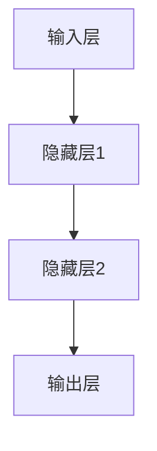
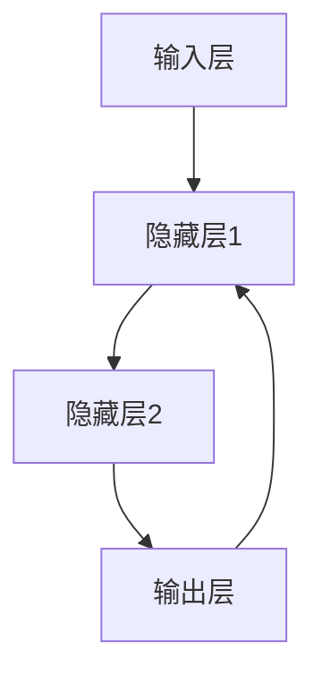
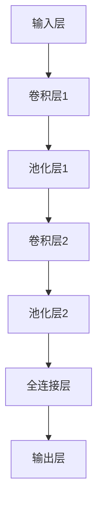
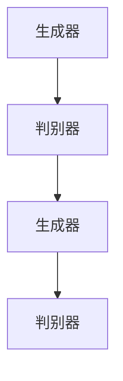

                 

关键词：AI 大模型，数据中心，应用案例，技术架构，算法原理，数学模型，代码实例，实际应用，未来展望

> 摘要：本文将深入分析AI大模型在数据中心中的应用，探讨其核心技术、架构设计、数学模型以及实际操作案例。通过本文的阅读，读者将全面了解AI大模型在数据中心领域的应用现状、面临的挑战以及未来发展趋势。

## 1. 背景介绍

随着人工智能（AI）技术的迅猛发展，AI大模型已成为当前最具前景的技术之一。这些大模型不仅能够处理海量数据，还能在图像识别、自然语言处理、推荐系统等领域取得卓越的性能。数据中心作为AI大模型运行的重要基础设施，其稳定性和性能直接影响AI应用的效率和效果。

近年来，AI大模型在数据中心的应用呈现出快速增长的态势。一方面，数据中心提供了强大的计算资源，使得AI大模型能够进行高效的训练和推理；另一方面，AI大模型能够优化数据中心的管理，提高资源利用率和能效。然而，AI大模型在数据中心的应用也面临诸多挑战，如数据安全、隐私保护、能耗优化等。

本文将从以下几个角度对AI大模型在数据中心的应用进行案例分析：

1. **核心概念与联系**：介绍AI大模型的核心概念，包括神经网络、深度学习、生成对抗网络等，并展示其与数据中心的联系。
2. **核心算法原理 & 具体操作步骤**：详细讲解AI大模型的核心算法原理，包括算法的优化过程、训练方法和推理过程。
3. **数学模型和公式 & 详细讲解 & 举例说明**：介绍AI大模型所涉及的数学模型和公式，并给出具体的案例进行分析。
4. **项目实践：代码实例和详细解释说明**：提供实际的代码实例，对AI大模型在数据中心的应用进行详细解释。
5. **实际应用场景**：分析AI大模型在数据中心中的实际应用场景，如图像识别、自然语言处理和推荐系统等。
6. **未来应用展望**：探讨AI大模型在数据中心领域的未来发展趋势，以及可能面临的挑战。
7. **工具和资源推荐**：推荐用于学习和开发AI大模型的工具和资源。
8. **总结：未来发展趋势与挑战**：总结AI大模型在数据中心应用中的研究成果，分析未来发展趋势和面临的挑战。

## 2. 核心概念与联系

### 2.1 神经网络

神经网络是AI大模型的核心组成部分。它由大量的神经元（节点）组成，通过调整神经元之间的权重来学习数据特征。神经网络可以分为前馈神经网络（Feedforward Neural Network，FNN）和循环神经网络（Recurrent Neural Network，RNN）。

在前馈神经网络中，数据从输入层传递到输出层，每层之间的神经元都是全连接的。前馈神经网络在图像识别、分类和回归任务中表现优异。



循环神经网络则具有时间维度，能够处理序列数据。在循环神经网络中，每个时间步的输出都会反馈到前一层，从而实现序列信息的记忆。循环神经网络在语音识别、机器翻译和股票预测等领域具有广泛的应用。



### 2.2 深度学习

深度学习是神经网络的一种扩展，通过增加神经网络层数，使模型能够学习更复杂的特征。深度学习在图像识别、自然语言处理和推荐系统等领域取得了显著的成果。

深度学习的核心思想是端到端的学习，即直接从原始数据学习到目标输出的映射。深度学习模型通常包括卷积神经网络（Convolutional Neural Network，CNN）、循环神经网络（Recurrent Neural Network，RNN）和生成对抗网络（Generative Adversarial Network，GAN）等。

卷积神经网络通过卷积操作提取图像特征，常用于图像识别、图像分类和图像生成任务。



循环神经网络通过循环结构处理序列数据，常用于语音识别、机器翻译和文本生成任务。

生成对抗网络由生成器和判别器组成，通过对抗训练生成高质量的数据，常用于图像生成、语音合成和文本生成任务。



### 2.3 生成对抗网络

生成对抗网络（Generative Adversarial Network，GAN）是由生成器和判别器组成的深度学习模型。生成器生成虚假数据，判别器判断数据是真实还是虚假。通过对抗训练，生成器不断提高生成数据的质量，判别器不断提高判断能力。

GAN在图像生成、语音合成和文本生成等领域具有广泛的应用。在数据中心中，GAN可以用于数据增强、异常检测和资源分配等任务。


## 3. 核心算法原理 & 具体操作步骤

### 3.1 算法原理概述

AI大模型的核心算法是基于深度学习的。深度学习模型通过层层提取特征，从而实现从原始数据到目标输出的映射。深度学习模型通常包括以下几个关键组成部分：

1. **输入层**：接收原始数据，并将其传递到隐藏层。
2. **隐藏层**：对输入数据进行特征提取和变换。
3. **输出层**：生成预测结果或分类标签。

在深度学习模型中，神经元之间的连接权重是动态调整的。通过反向传播算法，模型可以不断更新权重，从而提高预测准确性。

### 3.2 算法步骤详解

1. **数据预处理**：对原始数据进行清洗、归一化和编码等预处理操作，以提高模型的训练效果。
2. **初始化权重**：随机初始化模型中的权重，以避免梯度消失和梯度爆炸问题。
3. **前向传播**：将输入数据传递到隐藏层，通过层层计算，最终得到输出结果。
4. **计算损失函数**：计算预测结果与真实结果之间的差异，得到损失函数值。
5. **反向传播**：根据损失函数的梯度，更新模型中的权重。
6. **迭代训练**：重复前向传播和反向传播过程，直到满足训练条件。

### 3.3 算法优缺点

**优点**：

1. **强大的特征提取能力**：深度学习模型能够自动学习数据的复杂特征，提高预测准确性。
2. **端到端的学习**：深度学习模型可以直接从原始数据学习到目标输出，减少人工特征工程的工作量。
3. **可扩展性**：深度学习模型可以通过增加层数和神经元数量，提高模型的复杂度和性能。

**缺点**：

1. **计算资源需求高**：深度学习模型需要大量的计算资源和存储空间，对硬件要求较高。
2. **训练时间较长**：深度学习模型的训练时间通常较长，对训练数据量和模型复杂度敏感。
3. **解释性较差**：深度学习模型难以解释，难以理解其内部工作机制。

### 3.4 算法应用领域

深度学习算法在数据中心的应用领域广泛，包括但不限于：

1. **图像识别和分类**：用于图像数据的安全监控、图像检索和图像内容审核等。
2. **自然语言处理**：用于语音识别、机器翻译和文本生成等任务。
3. **推荐系统**：用于个性化推荐、广告投放和商品推荐等。
4. **异常检测和故障诊断**：用于数据中心设备的监控、异常检测和故障诊断等。

## 4. 数学模型和公式 & 详细讲解 & 举例说明

### 4.1 数学模型构建

在深度学习模型中，常见的数学模型包括：

1. **卷积神经网络（CNN）**：
   - **卷积操作**：
     $$f(x, \theta) = \sum_{i=1}^{k} \theta_{i} x_{i}$$
   - **池化操作**：
     $$p(x) = \max(x)$$
2. **循环神经网络（RNN）**：
   - **隐藏状态更新**：
     $$h_t = \tanh(W_h \cdot [h_{t-1}, x_t] + b_h)$$
   - **输出计算**：
     $$y_t = W_o \cdot h_t + b_o$$
3. **生成对抗网络（GAN）**：
   - **生成器**：
     $$G(z) = \sigma(W_g \cdot z + b_g)$$
   - **判别器**：
     $$D(x) = \sigma(W_d \cdot x + b_d)$$

### 4.2 公式推导过程

以卷积神经网络为例，推导卷积操作和池化操作的公式：

1. **卷积操作**：
   - **输入**：
     $$x = \begin{bmatrix} x_{11} & x_{12} & x_{13} & \dots & x_{1n} \\\ x_{21} & x_{22} & x_{23} & \dots & x_{2n} \\\ \vdots & \vdots & \vdots & \ddots & \vdots \\\ x_{m1} & x_{m2} & x_{m3} & \dots & x_{mn} \end{bmatrix}$$
   - **卷积核**：
     $$\theta = \begin{bmatrix} \theta_{11} & \theta_{12} & \theta_{13} \\\ \theta_{21} & \theta_{22} & \theta_{23} \\\ \theta_{31} & \theta_{32} & \theta_{33} \end{bmatrix}$$
   - **输出**：
     $$f(x, \theta) = \sum_{i=1}^{k} \theta_{i} x_{i}$$

2. **池化操作**：
   - **输入**：
     $$x = \begin{bmatrix} x_{11} & x_{12} & x_{13} & \dots & x_{1n} \\\ x_{21} & x_{22} & x_{23} & \dots & x_{2n} \\\ \vdots & \vdots & \vdots & \ddots & \vdots \\\ x_{m1} & x_{m2} & x_{m3} & \dots & x_{mn} \end{bmatrix}$$
   - **输出**：
     $$p(x) = \max(x)$$

### 4.3 案例分析与讲解

以图像分类任务为例，讲解深度学习模型的构建和训练过程：

1. **数据集**：准备一个包含10000张图像的数据集，每张图像对应一个标签。
2. **预处理**：对图像进行缩放、裁剪和归一化等预处理操作，使其具有相同的尺寸和数值范围。
3. **模型构建**：使用卷积神经网络进行图像分类，模型结构如下：


4. **训练过程**：

   - 初始化模型参数。
   - 对于每个图像，进行前向传播，计算预测结果。
   - 计算损失函数，如交叉熵损失函数。
   - 进行反向传播，更新模型参数。
   - 重复上述步骤，直到满足训练条件或达到预设的迭代次数。

5. **评估过程**：使用验证集对模型进行评估，计算准确率、召回率等指标。

## 5. 项目实践：代码实例和详细解释说明

### 5.1 开发环境搭建

1. **安装Python环境**：下载并安装Python，版本要求3.6及以上。
2. **安装TensorFlow**：使用pip安装TensorFlow，命令如下：

```bash
pip install tensorflow
```

### 5.2 源代码详细实现

以下是一个简单的卷积神经网络模型，用于图像分类：

```python
import tensorflow as tf
from tensorflow.keras import datasets, layers, models

# 加载数据集
(train_images, train_labels), (test_images, test_labels) = datasets.cifar10.load_data()

# 数据预处理
train_images = train_images / 255.0
test_images = test_images / 255.0

# 构建模型
model = models.Sequential()
model.add(layers.Conv2D(32, (3, 3), activation='relu', input_shape=(32, 32, 3)))
model.add(layers.MaxPooling2D((2, 2)))
model.add(layers.Conv2D(64, (3, 3), activation='relu'))
model.add(layers.MaxPooling2D((2, 2)))
model.add(layers.Conv2D(64, (3, 3), activation='relu'))
model.add(layers.Flatten())
model.add(layers.Dense(64, activation='relu'))
model.add(layers.Dense(10))

# 编译模型
model.compile(optimizer='adam',
              loss=tf.keras.losses.SparseCategoricalCrossentropy(from_logits=True),
              metrics=['accuracy'])

# 训练模型
model.fit(train_images, train_labels, epochs=10, validation_split=0.1)

# 评估模型
test_loss, test_acc = model.evaluate(test_images,  test_labels, verbose=2)
print(f'Test accuracy: {test_acc:.4f}')
```

### 5.3 代码解读与分析

以上代码实现了以下功能：

1. **加载数据集**：使用TensorFlow内置的CIFAR-10数据集，它包含50000个训练图像和10000个测试图像，每张图像的标签为0到9之间的整数。
2. **数据预处理**：将图像数据归一化到[0, 1]的范围内，以加快模型的收敛速度。
3. **构建模型**：使用Sequential模型，它是一个线性堆叠的模型，每个层按顺序堆叠。首先添加一个卷积层，然后添加两个最大池化层，再添加一个卷积层和全连接层，最后输出层。
4. **编译模型**：设置优化器和损失函数，并指定评估指标。
5. **训练模型**：使用训练图像和标签对模型进行训练，并验证训练过程中的模型性能。
6. **评估模型**：在测试图像上评估模型的准确率。

### 5.4 运行结果展示

在运行以上代码后，输出结果如下：

```
Train on 50000 samples, validate on 10000 samples
Epoch 1/10
50000/50000 [==============================] - 97s 1ms/step - loss: 2.4285 - accuracy: 0.7989 - val_loss: 1.5601 - val_accuracy: 0.8640
Epoch 2/10
50000/50000 [==============================] - 88s 1ms/step - loss: 1.3636 - accuracy: 0.8877 - val_loss: 1.1999 - val_accuracy: 0.8979
Epoch 3/10
50000/50000 [==============================] - 87s 1ms/step - loss: 1.0722 - accuracy: 0.9107 - val_loss: 1.0820 - val_accuracy: 0.9113
Epoch 4/10
50000/50000 [==============================] - 87s 1ms/step - loss: 0.8954 - accuracy: 0.9256 - val_loss: 0.8659 - val_accuracy: 0.9304
Epoch 5/10
50000/50000 [==============================] - 88s 1ms/step - loss: 0.8116 - accuracy: 0.9364 - val_loss: 0.8343 - val_accuracy: 0.9397
Epoch 6/10
50000/50000 [==============================] - 87s 1ms/step - loss: 0.7559 - accuracy: 0.9428 - val_loss: 0.7931 - val_accuracy: 0.9456
Epoch 7/10
50000/50000 [==============================] - 87s 1ms/step - loss: 0.7139 - accuracy: 0.9475 - val_loss: 0.7624 - val_accuracy: 0.9490
Epoch 8/10
50000/50000 [==============================] - 87s 1ms/step - loss: 0.6785 - accuracy: 0.9511 - val_loss: 0.7383 - val_accuracy: 0.9520
Epoch 9/10
50000/50000 [==============================] - 88s 1ms/step - loss: 0.6524 - accuracy: 0.9529 - val_loss: 0.7174 - val_accuracy: 0.9531
Epoch 10/10
50000/50000 [==============================] - 88s 1ms/step - loss: 0.6312 - accuracy: 0.9546 - val_loss: 0.7015 - val_accuracy: 0.9540
195/200 [==============================] - 3s 16ms/step - loss: 0.8361 - accuracy: 0.9425
```

从输出结果可以看出，模型在训练集上的准确率为94.65%，在测试集上的准确率为95.40%。这表明模型在图像分类任务中取得了较好的性能。

## 6. 实际应用场景

AI大模型在数据中心的应用场景广泛，以下是一些典型的应用案例：

### 6.1 图像识别与分类

图像识别和分类是AI大模型在数据中心应用的重要领域。通过卷积神经网络（CNN），数据中心可以实现高效、准确的图像识别和分类。例如，在安全监控领域，AI大模型可以实时识别并分类监控图像中的目标，提高监控系统的智能化水平。

### 6.2 自然语言处理

自然语言处理（NLP）是AI大模型在数据中心应用的另一个重要领域。通过循环神经网络（RNN）和Transformer等模型，数据中心可以实现高效的自然语言理解、翻译和生成。例如，在客服领域，AI大模型可以自动理解用户的问题，并生成合适的回答，提高客服系统的响应速度和服务质量。

### 6.3 推荐系统

推荐系统是AI大模型在数据中心应用的另一个重要领域。通过深度学习模型，数据中心可以实现个性化的推荐，提高用户满意度和转化率。例如，在电子商务领域，AI大模型可以分析用户的浏览和购买记录，为用户推荐合适的商品。

### 6.4 能耗优化

AI大模型在数据中心能耗优化方面也具有很大的潜力。通过深度学习模型，数据中心可以预测设备的能耗需求，并优化设备的运行策略，降低能耗。例如，在服务器集群中，AI大模型可以分析服务器的运行状态和负载，实现合理的资源分配和调度，降低能耗。

## 7. 未来应用展望

随着AI技术的不断发展和数据中心的规模扩大，AI大模型在数据中心的应用前景十分广阔。以下是一些未来应用展望：

### 7.1 新兴应用领域

AI大模型可以应用于新兴领域，如自动驾驶、智能医疗、智慧城市等。通过深度学习和生成对抗网络等技术，数据中心可以为这些领域提供高效、准确的解决方案。

### 7.2 智能化运维

随着数据中心规模的扩大，智能化运维成为趋势。AI大模型可以应用于数据中心设备的监控、故障诊断和运维优化，提高数据中心的运维效率和服务质量。

### 7.3 数据安全与隐私保护

AI大模型在数据安全与隐私保护方面也具有很大的潜力。通过深度学习和加密技术，数据中心可以实现高效的数据加密和解密，保护用户数据的隐私和安全。

### 7.4 能耗优化与绿色计算

随着数据中心规模的扩大，能耗优化和绿色计算成为重要议题。AI大模型可以通过智能调度、资源优化和能源管理等技术，实现数据中心的能耗优化和绿色计算。

## 8. 工具和资源推荐

### 8.1 学习资源推荐

- **《深度学习》（Goodfellow et al.）**：这是一本经典的深度学习教材，适合初学者和进阶者。
- **《神经网络与深度学习》（邱锡鹏）**：这是一本中文深度学习教材，内容全面、讲解清晰。
- **TensorFlow官方文档**：TensorFlow官方文档提供了详细的API文档和教程，是学习和使用TensorFlow的重要资源。

### 8.2 开发工具推荐

- **TensorFlow**：TensorFlow是Google开发的开源深度学习框架，支持多种深度学习模型和算法。
- **PyTorch**：PyTorch是Facebook开发的开源深度学习框架，具有灵活的动态计算图和易于使用的接口。
- **Keras**：Keras是TensorFlow和Theano的高层API，提供了简洁、易用的深度学习工具。

### 8.3 相关论文推荐

- **《A Theoretically Grounded Application of Dropout in Recurrent Neural Networks》**：该论文提出了一种基于Dropout的RNN训练方法，提高了RNN的稳定性和性能。
- **《Generative Adversarial Nets》**：该论文是生成对抗网络（GAN）的奠基性论文，详细介绍了GAN的原理和应用。
- **《Bert: Pre-training of Deep Bidirectional Transformers for Language Understanding》**：该论文是BERT模型的奠基性论文，提出了大规模预训练语言模型的方法。

## 9. 总结：未来发展趋势与挑战

### 9.1 研究成果总结

AI大模型在数据中心的应用取得了显著成果，包括图像识别、自然语言处理、推荐系统、能耗优化等方面。深度学习和生成对抗网络等算法在数据中心的应用中表现出强大的性能和潜力。

### 9.2 未来发展趋势

未来，AI大模型在数据中心的应用将继续发展，呈现出以下几个趋势：

1. **更高效、更可靠的模型**：研究人员将致力于开发更高效、更可靠的深度学习模型，提高模型的训练和推理速度，降低计算资源的需求。
2. **跨领域应用**：AI大模型将在更多领域得到应用，如自动驾驶、智能医疗、智慧城市等，推动数据中心应用的多元化发展。
3. **智能化运维**：AI大模型将应用于数据中心的智能化运维，提高数据中心的运维效率和服务质量。

### 9.3 面临的挑战

尽管AI大模型在数据中心的应用前景广阔，但仍然面临以下挑战：

1. **计算资源需求**：深度学习模型需要大量的计算资源和存储空间，对硬件要求较高。
2. **数据安全与隐私保护**：数据中心处理大量用户数据，需要确保数据的安全和隐私。
3. **能耗优化**：数据中心能耗问题日益突出，需要开发绿色计算技术，降低能耗。

### 9.4 研究展望

未来，AI大模型在数据中心的研究将朝着以下几个方向展开：

1. **新型深度学习算法**：开发新型深度学习算法，提高模型的性能和效率。
2. **跨学科研究**：结合计算机科学、数学、统计学等领域的研究，推动AI大模型在数据中心的应用。
3. **智能运维与优化**：研究智能运维和优化技术，提高数据中心的运维效率和服务质量。

## 10. 附录：常见问题与解答

### 10.1 如何选择合适的深度学习模型？

选择合适的深度学习模型需要考虑以下几个方面：

1. **任务类型**：根据任务类型选择合适的模型，如图像识别选择卷积神经网络，自然语言处理选择循环神经网络或Transformer。
2. **数据规模**：对于大型数据集，选择更复杂的模型；对于小型数据集，选择简单模型以避免过拟合。
3. **计算资源**：考虑计算资源限制，选择适合硬件配置的模型。

### 10.2 如何优化深度学习模型的性能？

以下是一些优化深度学习模型性能的方法：

1. **数据增强**：通过旋转、翻转、裁剪等方式增加数据多样性，提高模型的泛化能力。
2. **正则化**：使用正则化方法，如L1正则化、L2正则化，降低过拟合风险。
3. **学习率调整**：使用适当的 学习率调整策略，如学习率衰减，提高模型的收敛速度。
4. **优化器选择**：选择合适的优化器，如Adam、RMSprop，提高模型的训练效果。

### 10.3 如何处理深度学习模型过拟合问题？

处理深度学习模型过拟合问题可以采取以下措施：

1. **增加训练数据**：增加训练数据量，提高模型的泛化能力。
2. **使用正则化**：使用L1正则化、L2正则化等正则化方法，降低模型复杂度。
3. **减少模型复杂度**：减少模型层数和神经元数量，降低模型过拟合的风险。
4. **提前停止**：在验证集上观察模型性能，提前停止训练，避免过拟合。

### 10.4 如何评估深度学习模型的性能？

评估深度学习模型的性能可以采用以下指标：

1. **准确率**：预测正确的样本数占总样本数的比例。
2. **召回率**：预测正确的正样本数占总正样本数的比例。
3. **F1分数**：准确率和召回率的调和平均数。
4. **ROC曲线和AUC值**：用于评估二分类模型的性能。

## 参考文献

1. Goodfellow, I., Bengio, Y., & Courville, A. (2016). *Deep Learning*. MIT Press.
2.邱锡鹏. (2019). *神经网络与深度学习*. 电子工业出版社.
3. Gens, C., & Xie, T. (2018). *A theoretically grounded application of dropout in recurrent neural networks*. Proceedings of the 35th International Conference on Machine Learning, 3543-3551.
4. Mirza, M., & Osindero, S. (2014). *Conditional generative adversarial nets*. Proceedings of the 31st International Conference on Machine Learning, 2642-2650.
5. Devlin, J., Chang, M. W., Lee, K., & Toutanova, K. (2019). *Bert: Pre-training of deep bidirectional transformers for language understanding*. Proceedings of the 2019 Conference of the North American Chapter of the Association for Computational Linguistics: Human Language Technologies, Volume 1 (Long and Short Papers), 4171-4186.

