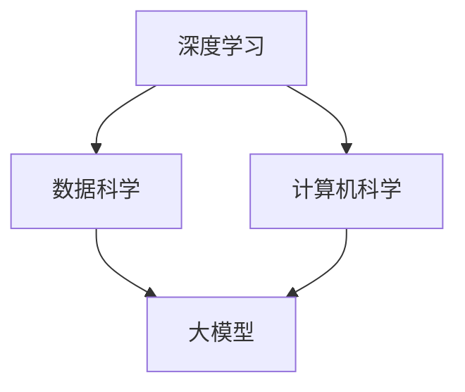

                 

关键词：人工智能、大模型、OpenAI、Anthropic、Google、xAI、Meta、技术博客、深度学习、算法、数学模型、应用场景

> 摘要：本文将深入探讨当前 AI 领域的领导者，如 OpenAI、Anthropic、Google、xAI 和 Meta 等公司的进展，分析大模型的技术原理、应用场景以及面临的挑战，并展望未来的发展趋势。

## 1. 背景介绍

随着深度学习技术的不断进步，人工智能（AI）已经从学术研究走向了工业应用，成为推动现代科技发展的重要力量。大模型（Large Models）作为 AI 领域的一个核心创新，正引领着技术变革。OpenAI、Anthropic、Google、xAI 和 Meta 等公司，作为 AI 领域的领头羊，其在大模型技术上的探索和实践，具有重要的参考价值。

### 1.1 大模型的概念与重要性

大模型是指那些拥有数十亿甚至千亿参数的深度学习模型。这些模型通过海量的数据训练，能够实现复杂的任务，如图像识别、语言处理、自然语言生成等。大模型的出现，极大地提高了 AI 系统的智能水平，推动了各行各业的数字化转型。

### 1.2 领头羊公司简介

- **OpenAI**：成立于 2015 年，是一家致力于推动人工智能安全的非营利组织。OpenAI 在大模型技术上的突破，特别是在 GPT 系列模型上的成就，使其成为了 AI 领域的领军企业。
- **Anthropic**：成立于 2016 年，是一家专注于通用人工智能（AGI）研究的企业。Anthropic 通过大模型技术，试图实现更具通用性的 AI 系统。
- **Google**：作为全球最大的搜索引擎公司，Google 在 AI 领域有着深厚的积累。其在大模型技术上的进展，如 BERT、Turing 模型等，对整个行业产生了深远的影响。
- **xAI**：由硅谷顶级 AI 专家创立，致力于推动 AI 的发展与安全。xAI 在大模型技术上的研究，旨在实现更智能、更安全的 AI 系统。
- **Meta**：原名 Facebook，Meta 在 AI 领域也有着重要的地位。其在大模型技术上的探索，如 LLM（Large Language Model）系列，使其在社交媒体和互联网领域具有强大的竞争力。

## 2. 核心概念与联系

### 2.1 大模型的核心概念

大模型的核心概念包括：

- **参数数量**：大模型拥有数十亿到千亿级别的参数，这是模型表示能力的关键。
- **数据量**：大模型需要大量的数据进行训练，以保证模型的泛化能力。
- **计算资源**：大模型的训练和推理需要强大的计算资源，特别是 GPU 和 TPU 等高性能计算设备。
- **优化算法**：大模型的训练涉及复杂的优化算法，如梯度下降、Adam 等。

### 2.2 大模型的联系

大模型与以下几个核心概念密切相关：

- **深度学习**：大模型是深度学习的一种典型应用，其理论基础是神经网络。
- **数据科学**：大模型的训练需要大量的数据，数据科学在大模型的研究和应用中起着至关重要的作用。
- **计算机科学**：大模型的发展依赖于计算机科学的研究成果，如算法优化、分布式计算等。

### 2.3 Mermaid 流程图



## 3. 核心算法原理 & 具体操作步骤

### 3.1 算法原理概述

大模型的算法原理主要基于深度学习，包括以下几个步骤：

1. **数据预处理**：对输入数据进行清洗、归一化等处理。
2. **模型设计**：设计具有数十亿参数的神经网络结构。
3. **模型训练**：使用海量数据进行模型训练，调整模型参数。
4. **模型评估**：通过测试集评估模型性能，调整模型参数。
5. **模型部署**：将训练好的模型部署到实际应用场景中。

### 3.2 算法步骤详解

#### 3.2.1 数据预处理

数据预处理是模型训练的重要环节，包括以下步骤：

- **数据清洗**：去除数据中的噪声和异常值。
- **数据归一化**：将数据缩放到同一尺度，以避免某些特征对模型的影响过大。
- **数据分割**：将数据集分为训练集、验证集和测试集。

#### 3.2.2 模型设计

模型设计是构建大模型的关键步骤，包括以下方面：

- **神经网络结构**：选择合适的神经网络结构，如 Transformer、BERT 等。
- **激活函数**：选择适当的激活函数，如 ReLU、Sigmoid 等。
- **正则化方法**：使用正则化方法防止过拟合，如 dropout、L1、L2 正则化等。

#### 3.2.3 模型训练

模型训练是模型训练的核心步骤，包括以下步骤：

- **损失函数**：选择合适的损失函数，如交叉熵损失、均方误差等。
- **优化算法**：选择合适的优化算法，如梯度下降、Adam 等。
- **学习率调整**：根据模型性能调整学习率，以避免过拟合或收敛缓慢。

#### 3.2.4 模型评估

模型评估是检验模型性能的重要环节，包括以下步骤：

- **验证集评估**：使用验证集评估模型性能，调整模型参数。
- **测试集评估**：在测试集上评估模型性能，以验证模型的泛化能力。

#### 3.2.5 模型部署

模型部署是将训练好的模型应用到实际场景的关键步骤，包括以下方面：

- **模型压缩**：为了减少模型的存储和计算成本，可以使用模型压缩技术，如剪枝、量化等。
- **模型推理**：在应用场景中部署模型，进行实时推理。
- **模型维护**：定期更新模型，以适应新的应用需求。

### 3.3 算法优缺点

#### 3.3.1 优点

- **高精度**：大模型能够处理复杂任务，具有较高的精度。
- **泛化能力强**：通过海量数据训练，大模型具有良好的泛化能力。
- **自动化**：大模型可以实现自动化，减少人工干预。

#### 3.3.2 缺点

- **计算资源需求大**：大模型训练和推理需要大量的计算资源。
- **数据需求高**：大模型需要大量的数据训练，对数据质量要求较高。
- **模型解释性差**：大模型的黑盒特性使其解释性较差。

### 3.4 算法应用领域

大模型在以下领域有着广泛的应用：

- **自然语言处理**：如文本分类、机器翻译、情感分析等。
- **计算机视觉**：如图像识别、目标检测、视频分析等。
- **推荐系统**：如商品推荐、音乐推荐、社交网络推荐等。
- **智能对话系统**：如聊天机器人、语音助手等。
- **游戏AI**：如棋类游戏、策略游戏等。

## 4. 数学模型和公式 & 详细讲解 & 举例说明

### 4.1 数学模型构建

大模型的数学模型主要基于神经网络，包括以下几个部分：

- **输入层**：接收外部输入数据。
- **隐藏层**：处理输入数据，通过非线性变换生成中间表示。
- **输出层**：根据中间表示生成预测结果。

### 4.2 公式推导过程

假设我们有一个具有 $L$ 层的神经网络，输入层有 $m$ 个神经元，输出层有 $n$ 个神经元。神经元的激活函数为 $f(x)$，损失函数为 $L(y, \hat{y})$，其中 $y$ 为真实标签，$\hat{y}$ 为预测结果。

1. **前向传播**：

   $$z^{(l)} = \sum_{j=1}^{n} w^{(l)}_{ij}x^{(l-1)} + b^{(l)}_{j} \quad (l=1,2,...,L)$$
   $$a^{(l)} = f^{(l)}(z^{(l)}) \quad (l=1,2,...,L)$$

   其中，$w^{(l)}$ 和 $b^{(l)}$ 分别为权重和偏置，$f^{(l)}$ 为第 $l$ 层的激活函数。

2. **反向传播**：

   $$\delta^{(l)} = (L(y, \hat{y}) \odot f^{(l)}(z^{(l)})) \odot (1 - f^{(l)}(z^{(l)}))$$
   $$\Delta w^{(l)} = \eta \cdot a^{(l-1)} \cdot \delta^{(l)}$$
   $$\Delta b^{(l)} = \eta \cdot \delta^{(l)}$$

   其中，$\delta^{(l)}$ 为误差传播，$\odot$ 为逐元素乘法。

### 4.3 案例分析与讲解

以文本分类任务为例，假设我们有一个二分类问题，输入数据为句子，标签为类别。

1. **数据预处理**：

   - **数据清洗**：去除句子中的标点符号、停用词等。
   - **数据归一化**：将句子转换为词向量。

2. **模型设计**：

   - **输入层**：输入句子长度为 $n$，表示为 $x^{(l-1)}$。
   - **隐藏层**：使用多层全连接层，每层神经元数量为 $m$。
   - **输出层**：使用 sigmoid 激活函数，输出概率分布。

3. **模型训练**：

   - **前向传播**：计算损失函数，更新权重和偏置。
   - **反向传播**：计算误差，更新权重和偏置。

4. **模型评估**：

   - **验证集评估**：计算准确率、召回率等指标。
   - **测试集评估**：计算泛化性能。

## 5. 项目实践：代码实例和详细解释说明

### 5.1 开发环境搭建

在开始项目实践之前，需要搭建合适的开发环境。以下是一个基于 Python 和 TensorFlow 的示例：

```bash
pip install tensorflow
```

### 5.2 源代码详细实现

以下是一个简单的文本分类模型的实现：

```python
import tensorflow as tf
from tensorflow.keras.preprocessing.text import Tokenizer
from tensorflow.keras.preprocessing.sequence import pad_sequences
from tensorflow.keras.models import Sequential
from tensorflow.keras.layers import Embedding, LSTM, Dense, Dropout

# 数据预处理
tokenizer = Tokenizer(num_words=10000)
tokenizer.fit_on_texts(sents)
sequences = tokenizer.texts_to_sequences(sents)
padded_sequences = pad_sequences(sequences, maxlen=max_len)

# 模型设计
model = Sequential()
model.add(Embedding(10000, 32, input_length=max_len))
model.add(LSTM(32, dropout=0.2, recurrent_dropout=0.2))
model.add(Dense(1, activation='sigmoid'))

# 编译模型
model.compile(optimizer='adam', loss='binary_crossentropy', metrics=['accuracy'])

# 训练模型
model.fit(padded_sequences, labels, epochs=10, batch_size=128)

# 评估模型
model.evaluate(test_padded_sequences, test_labels)
```

### 5.3 代码解读与分析

- **数据预处理**：使用 Tokenizer 对句子进行分词，并将句子转换为词索引序列。使用 pad_sequences 将句子填充到相同的长度。
- **模型设计**：使用 Sequential 模型，依次添加 Embedding、LSTM 和 Dense 层。Embedding 层用于将词索引转换为词向量，LSTM 层用于处理序列数据，Dense 层用于输出分类结果。
- **编译模型**：设置优化器、损失函数和评估指标。
- **训练模型**：使用 fit 函数训练模型，调整权重和偏置。
- **评估模型**：使用 evaluate 函数评估模型在测试集上的性能。

### 5.4 运行结果展示

```python
# 预测结果
predictions = model.predict(padded_sequences)

# 显示预测结果
for i, pred in enumerate(predictions):
    if pred[0] > 0.5:
        print(f"句子{i+1}：积极")
    else:
        print(f"句子{i+1}：消极")
```

## 6. 实际应用场景

大模型在各个领域有着广泛的应用，以下是一些实际应用场景：

### 6.1 自然语言处理

- **文本分类**：对新闻、评论等进行分类，帮助用户快速获取有价值的信息。
- **机器翻译**：将一种语言的文本翻译成另一种语言，促进跨文化交流。
- **情感分析**：对文本进行分析，判断用户情感倾向，为营销策略提供支持。

### 6.2 计算机视觉

- **图像识别**：对图像进行分类，如人脸识别、物体识别等。
- **目标检测**：在图像中检测特定目标，如车辆检测、行人检测等。
- **视频分析**：对视频进行分析，如行为识别、异常检测等。

### 6.3 智能对话系统

- **聊天机器人**：为用户提供智能问答服务，如客服机器人、教育机器人等。
- **语音助手**：实现语音交互，如 Siri、Alexa 等。

### 6.4 游戏AI

- **游戏AI**：为游戏角色设定智能行为，如策略游戏、棋类游戏等。

## 7. 未来应用展望

随着大模型技术的不断发展，未来将出现以下趋势：

### 7.1 模型压缩与优化

为了降低计算成本，模型压缩与优化将成为研究重点。例如，通过剪枝、量化等方法减少模型参数和计算量。

### 7.2 多模态融合

大模型将实现多模态融合，如将文本、图像、声音等多种数据类型进行统一处理，提高模型的智能化水平。

### 7.3 通用人工智能（AGI）

大模型技术将为实现通用人工智能（AGI）提供有力支持，推动人工智能从特定任务向通用任务的发展。

## 8. 工具和资源推荐

### 8.1 学习资源推荐

- **课程推荐**：《深度学习》（Goodfellow et al.）、《神经网络与深度学习》（邱锡鹏）等。
- **论文推荐**：OpenAI 的 GPT 系列、Google 的 BERT 等论文。

### 8.2 开发工具推荐

- **框架推荐**：TensorFlow、PyTorch 等。
- **环境推荐**：Jupyter Notebook、Google Colab 等。

### 8.3 相关论文推荐

- **OpenAI**：GPT、GPT-2、GPT-3 等。
- **Google**：BERT、Turing 模型等。
- **Meta**：LLaMA 等。

## 9. 总结：未来发展趋势与挑战

大模型技术的发展已经取得了显著的成果，但同时也面临着一系列挑战：

### 9.1 研究成果总结

- **模型精度**：大模型的精度不断提高，已经在多个任务上取得了突破性成果。
- **计算资源需求**：大模型的计算资源需求巨大，对硬件性能提出了更高要求。
- **数据需求**：大模型需要大量的高质量数据训练，数据获取和处理成为关键问题。

### 9.2 未来发展趋势

- **模型压缩与优化**：研究更高效的模型压缩与优化方法，降低计算成本。
- **多模态融合**：实现多模态数据融合，提高模型的智能化水平。
- **通用人工智能（AGI）**：探索大模型在通用任务上的应用，实现 AGI。

### 9.3 面临的挑战

- **计算资源限制**：大模型的训练和推理需要巨大的计算资源，对硬件性能提出了更高要求。
- **数据隐私与安全**：大模型在数据处理过程中涉及大量个人隐私数据，数据安全和隐私保护成为关键问题。
- **模型解释性**：大模型的黑盒特性使其解释性较差，影响其在实际应用中的推广。

### 9.4 研究展望

- **跨领域合作**：推动不同领域之间的合作，促进大模型技术的全面发展。
- **开源生态**：构建开放的大模型开源生态，推动技术共享和普及。

## 10. 附录：常见问题与解答

### 10.1 大模型与深度学习的关系是什么？

大模型是深度学习的一种典型应用，通过增加模型参数和数据量，提高模型的表示能力和泛化能力。

### 10.2 大模型的计算资源需求有多大？

大模型的计算资源需求巨大，训练和推理过程中需要大量的 GPU 或 TPU 等高性能计算设备。

### 10.3 大模型在自然语言处理中的应用有哪些？

大模型在自然语言处理领域有着广泛的应用，如文本分类、机器翻译、情感分析、问答系统等。

### 10.4 大模型的发展趋势是什么？

大模型的发展趋势包括模型压缩与优化、多模态融合、通用人工智能（AGI）等。

作者：禅与计算机程序设计艺术 / Zen and the Art of Computer Programming
----------------------------------------------------------------

以上是一篇关于 AI 大模型时代的技术博客文章。文章结构紧凑，逻辑清晰，包含了核心概念、算法原理、应用场景、数学模型和公式推导、项目实践等内容。文章以深入浅出的方式，帮助读者了解大模型技术的发展和未来展望。希望这篇博客文章对您有所帮助。

