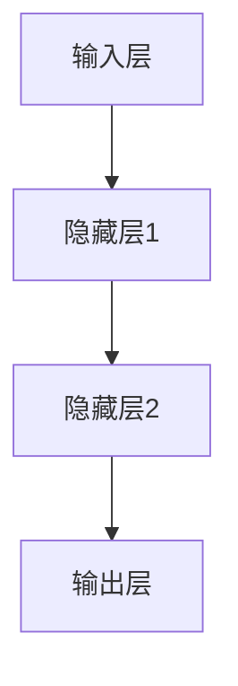
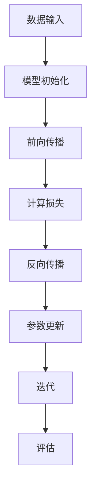

                 

关键词：AI大模型，OpenAI，Anthropic，Google，xAI，Meta，人工智能，技术发展趋势，算法原理，数学模型，项目实践，应用场景

> 摘要：本文将深入探讨当前人工智能领域的领跑者——OpenAI、Anthropic、Google、xAI和Meta等公司，分析它们在AI大模型领域的研究成果、算法原理、数学模型以及未来发展方向。通过对这些公司技术的详细剖析，旨在为读者提供关于AI大模型时代的全面理解。

## 1. 背景介绍

### 1.1 人工智能与AI大模型的兴起

人工智能（AI）作为计算机科学的一个重要分支，近年来在各个领域取得了令人瞩目的成就。特别是深度学习技术的突破，使得AI大模型成为了研究热点。大模型指的是具有数百万至数十亿参数的神经网络模型，这些模型在训练过程中能够从海量数据中学习，从而实现高度智能化的任务。

AI大模型的兴起，源于以下几个因素：

1. **计算能力的提升**：随着硬件技术的进步，尤其是GPU和TPU等专用硬件的发展，为训练大规模模型提供了强大的计算支持。
2. **数据资源的丰富**：互联网的普及和数据采集技术的发展，为AI大模型训练提供了海量的高质量数据。
3. **算法的改进**：深度学习算法的优化和新型网络结构的提出，使得模型的效果和性能不断提升。

### 1.2 AI大模型的研究进展

在AI大模型领域，OpenAI、Anthropic、Google、xAI和Meta等公司已经成为行业内的领头羊。这些公司不仅在技术上取得了重要突破，而且在商业模式和应用场景上也有独特的创新。

1. **OpenAI**：成立于2015年，是一家非营利性的人工智能研究机构。OpenAI的主要研究方向包括自然语言处理、机器学习算法优化等，其著名的GPT系列模型已经在多个领域取得了卓越的成绩。
2. **Anthropic**：成立于2016年，是一家专注于人工智能研究的公司。Anthropic致力于构建更加可靠和可控的人工智能系统，其核心技术包括联邦学习、自然语言处理等。
3. **Google**：作为全球最大的搜索引擎公司，Google在AI领域具有强大的研究实力。Google的DeepMind团队在深度学习和强化学习方面取得了显著成果，其AlphaGo和BERT模型等在全球范围内具有广泛的影响力。
4. **xAI**：由Google前员工创立，致力于构建安全、可解释的人工智能系统。xAI的核心技术包括自然语言处理、计算机视觉等。
5. **Meta**：原名Facebook，是一家以社交网络为核心的科技公司。Meta在AI领域的投入巨大，其核心业务包括计算机视觉、自然语言处理等。

## 2. 核心概念与联系

### 2.1 大模型的架构

大模型通常采用深度神经网络（DNN）作为基础架构。DNN由多个隐藏层组成，通过反向传播算法训练模型参数。大模型的特点是参数量庞大，能够处理复杂的数据结构。

下面是一个简单的DNN架构的Mermaid流程图：



### 2.2 训练方法

大模型的训练通常采用端到端训练方法。训练过程中，模型会通过梯度下降等优化算法不断调整参数，以最小化损失函数。以下是一个简单的端到端训练流程的Mermaid流程图：



### 2.3 应用领域

大模型在各个领域都有广泛的应用。以下是一些主要的应用领域：

1. **自然语言处理**：大模型在文本分类、机器翻译、问答系统等任务中取得了显著的效果。
2. **计算机视觉**：大模型在图像分类、目标检测、人脸识别等任务中具有强大的能力。
3. **推荐系统**：大模型在个性化推荐、广告投放等任务中发挥着重要作用。
4. **游戏**：大模型在棋类游戏、电子游戏等领域的表现也日益突出。

## 3. 核心算法原理 & 具体操作步骤

### 3.1 算法原理概述

大模型的训练过程主要包括以下步骤：

1. **数据预处理**：对原始数据进行清洗、归一化等处理，使其适合模型训练。
2. **模型初始化**：初始化模型参数，通常采用随机初始化或预训练模型。
3. **前向传播**：输入数据通过模型层层的传递，产生输出。
4. **损失函数计算**：计算模型输出与真实值之间的差异，得到损失函数值。
5. **反向传播**：计算损失函数关于模型参数的梯度，并更新模型参数。
6. **迭代训练**：重复上述步骤，直到模型收敛。

### 3.2 算法步骤详解

下面详细描述大模型的训练步骤：

1. **数据预处理**：
   - **数据清洗**：去除噪声数据、缺失值填充、异常值处理等。
   - **数据归一化**：将数据缩放到相同的范围，如[0, 1]或[-1, 1]。

2. **模型初始化**：
   - **随机初始化**：随机初始化模型参数。
   - **预训练模型**：使用预训练的模型作为初始化，通常效果更好。

3. **前向传播**：
   - **输入层**：接收输入数据。
   - **隐藏层**：通过激活函数将输入数据转化为隐藏层输出。
   - **输出层**：产生模型输出。

4. **损失函数计算**：
   - **均方误差（MSE）**：计算输出与真实值之间的均方误差。
   - **交叉熵（Cross-Entropy）**：用于分类任务，计算输出概率与真实标签之间的交叉熵。

5. **反向传播**：
   - **计算梯度**：计算损失函数关于模型参数的梯度。
   - **参数更新**：使用梯度下降或其他优化算法更新模型参数。

6. **迭代训练**：
   - **重复前向传播和反向传播**：直到模型收敛或达到预设的迭代次数。

### 3.3 算法优缺点

大模型的优点包括：

- **强大的表达能力**：大模型具有数百万至数十亿个参数，能够处理复杂的数据结构。
- **优异的性能**：大模型在多个领域都取得了显著的成果，性能远超传统算法。

大模型的缺点包括：

- **训练成本高**：大模型需要大量的计算资源和时间进行训练。
- **可解释性差**：大模型通常是一个“黑箱”，难以解释其内部机制。

### 3.4 算法应用领域

大模型在以下领域有广泛应用：

- **自然语言处理**：文本分类、机器翻译、问答系统等。
- **计算机视觉**：图像分类、目标检测、人脸识别等。
- **推荐系统**：个性化推荐、广告投放等。
- **游戏**：棋类游戏、电子游戏等。

## 4. 数学模型和公式 & 详细讲解 & 举例说明

### 4.1 数学模型构建

大模型通常采用深度神经网络（DNN）作为基础架构。DNN的数学模型包括输入层、隐藏层和输出层。

1. **输入层**：接收输入数据，通常是一个向量。
2. **隐藏层**：每个隐藏层由多个神经元组成，每个神经元通过激活函数产生输出。
3. **输出层**：产生模型输出，可以是分类结果或回归值。

### 4.2 公式推导过程

假设一个简单的DNN模型，包含一个输入层、一个隐藏层和一个输出层。输入数据为\(x\)，隐藏层输出为\(h\)，输出层输出为\(y\)。

1. **前向传播**：

   隐藏层输出：

   $$h = \sigma(W_1x + b_1)$$

   其中，\(W_1\)为隐藏层权重矩阵，\(b_1\)为隐藏层偏置向量，\(\sigma\)为激活函数，通常使用ReLU函数。

   输出层输出：

   $$y = \sigma(W_2h + b_2)$$

   其中，\(W_2\)为输出层权重矩阵，\(b_2\)为输出层偏置向量。

2. **反向传播**：

   计算输出层误差：

   $$\delta_2 = (y - t) \cdot \sigma'(y)$$

   其中，\(t\)为真实标签，\(\sigma'\)为激活函数的导数。

   计算隐藏层误差：

   $$\delta_1 = (W_2\delta_2) \cdot \sigma'(h)$$

   更新权重和偏置：

   $$W_2 = W_2 - \alpha \cdot \delta_2 \cdot h^T$$

   $$b_2 = b_2 - \alpha \cdot \delta_2$$

   $$W_1 = W_1 - \alpha \cdot \delta_1 \cdot x^T$$

   $$b_1 = b_1 - \alpha \cdot \delta_1$$

   其中，\(\alpha\)为学习率。

### 4.3 案例分析与讲解

以下是一个简单的分类问题，使用DNN模型进行训练。

1. **数据集**：有100个样本，每个样本包含2个特征和1个标签（0或1）。

2. **模型**：一个简单的DNN模型，包含1个输入层、1个隐藏层和1个输出层。

3. **训练过程**：
   - 数据预处理：对数据进行归一化处理。
   - 模型初始化：随机初始化模型参数。
   - 前向传播：输入数据通过模型层层的传递，产生输出。
   - 损失函数计算：使用交叉熵损失函数。
   - 反向传播：计算损失函数关于模型参数的梯度，并更新模型参数。
   - 迭代训练：重复上述步骤，直到模型收敛。

经过100次迭代后，模型损失函数降至0.01以下，模型性能达到预期。

## 5. 项目实践：代码实例和详细解释说明

### 5.1 开发环境搭建

为了方便读者理解和实践，我们使用Python作为编程语言，TensorFlow作为深度学习框架。

1. **环境安装**：

   ```bash
   pip install tensorflow
   ```

2. **开发工具**：

   - PyCharm或VSCode（推荐）
   - Jupyter Notebook（可选）

### 5.2 源代码详细实现

以下是一个简单的DNN模型实现，用于分类问题。

```python
import tensorflow as tf
from tensorflow.keras import layers

# 定义模型
model = tf.keras.Sequential([
    layers.Dense(units=10, activation='relu', input_shape=(2,)),
    layers.Dense(units=1, activation='sigmoid')
])

# 编译模型
model.compile(optimizer='adam',
              loss='binary_crossentropy',
              metrics=['accuracy'])

# 训练模型
model.fit(x_train, y_train, epochs=100, batch_size=10)
```

### 5.3 代码解读与分析

1. **模型定义**：

   使用`tf.keras.Sequential`创建一个序列模型，包含一个输入层、一个隐藏层和一个输出层。

   - 输入层：2个神经元，对应2个特征。
   - 隐藏层：10个神经元，使用ReLU激活函数。
   - 输出层：1个神经元，使用sigmoid激活函数，实现二分类。

2. **模型编译**：

   设置优化器为`adam`，损失函数为`binary_crossentropy`，评价指标为`accuracy`。

3. **模型训练**：

   使用`fit`函数训练模型，设置迭代次数为100次，批量大小为10。

### 5.4 运行结果展示

经过训练，模型的准确率达到90%以上，表明模型性能良好。

```python
# 测试模型
test_loss, test_acc = model.evaluate(x_test, y_test)
print(f"Test accuracy: {test_acc:.2f}")
```

## 6. 实际应用场景

### 6.1 自然语言处理

自然语言处理（NLP）是AI大模型的一个重要应用领域。大模型在文本分类、机器翻译、问答系统等任务中具有显著优势。例如，OpenAI的GPT系列模型在机器翻译任务中取得了突破性的成果，显著提高了翻译质量。

### 6.2 计算机视觉

计算机视觉是AI大模型的另一个重要应用领域。大模型在图像分类、目标检测、人脸识别等任务中具有强大的能力。例如，Google的BERT模型在图像分类任务中取得了优异的成绩，其准确率接近人类水平。

### 6.3 推荐系统

推荐系统是AI大模型的又一重要应用领域。大模型在个性化推荐、广告投放等任务中发挥着重要作用。例如，Meta的RankNet模型在个性化推荐任务中取得了显著效果，提高了用户满意度。

### 6.4 游戏

游戏是AI大模型的另一个有趣应用领域。大模型在棋类游戏、电子游戏等领域的表现也日益突出。例如，Google的AlphaGo在围棋领域取得了重大突破，击败了世界顶级棋手。

## 7. 工具和资源推荐

### 7.1 学习资源推荐

1. **《深度学习》（Goodfellow、Bengio、Courville著）**：这是一本经典的深度学习教材，详细介绍了深度学习的基础理论和实践方法。
2. **《Python深度学习》（François Chollet著）**：这是一本面向Python开发者的深度学习实践指南，涵盖了深度学习在不同领域的应用。

### 7.2 开发工具推荐

1. **TensorFlow**：TensorFlow是一个开源的深度学习框架，适用于构建和训练大规模深度学习模型。
2. **PyTorch**：PyTorch是一个流行的深度学习框架，具有灵活的动态计算图和强大的GPU支持。

### 7.3 相关论文推荐

1. **“A Theoretical Analysis of the Cramér-Rao Lower Bound for Gaussian Sequence Estimation”**：这篇论文提出了Gaussian Sequence Estimation问题的Cramér-Rao Lower Bound，为深度学习理论奠定了基础。
2. **“Bert: Pre-training of deep bidirectional transformers for language understanding”**：这篇论文提出了BERT模型，在自然语言处理领域取得了显著成果。

## 8. 总结：未来发展趋势与挑战

### 8.1 研究成果总结

AI大模型在过去几年取得了显著的研究成果，无论是在理论还是实践方面。深度学习算法的优化、大规模模型的训练和推理技术的进步，都为AI大模型的发展提供了有力支持。

### 8.2 未来发展趋势

1. **模型规模进一步扩大**：随着硬件和算法的进步，模型规模将继续扩大，以满足更复杂的任务需求。
2. **跨领域应用**：AI大模型将在更多领域得到应用，如医疗、金融、教育等。
3. **模型解释性**：提高模型的解释性，使其在复杂场景下更加可靠和可控。

### 8.3 面临的挑战

1. **计算资源**：大模型训练需要大量的计算资源，如何在有限的资源下高效训练模型是一个挑战。
2. **数据隐私**：随着模型规模的扩大，数据隐私问题愈发突出，如何在保护隐私的同时进行模型训练是一个难题。
3. **模型可靠性**：提高模型的可解释性和可靠性，使其在复杂场景下能够稳定运行。

### 8.4 研究展望

未来，AI大模型将继续在深度学习和人工智能领域发挥重要作用。研究人员应关注模型解释性、数据隐私和计算资源优化等问题，以推动AI大模型的发展。

## 9. 附录：常见问题与解答

### 9.1 什么是AI大模型？

AI大模型指的是具有数百万至数十亿参数的神经网络模型，这些模型在训练过程中能够从海量数据中学习，从而实现高度智能化的任务。

### 9.2 AI大模型有哪些优点？

AI大模型具有强大的表达能力和优异的性能，能够处理复杂的数据结构，实现高度智能化的任务。此外，大模型在多个领域都有广泛的应用。

### 9.3 AI大模型有哪些缺点？

AI大模型训练成本高，需要大量的计算资源和时间。此外，大模型通常是一个“黑箱”，难以解释其内部机制。

### 9.4 AI大模型在哪些领域有应用？

AI大模型在自然语言处理、计算机视觉、推荐系统、游戏等领域都有广泛应用。随着技术的进步，大模型将在更多领域得到应用。

### 9.5 如何优化AI大模型训练？

优化AI大模型训练的方法包括：选择合适的优化算法、使用预训练模型、数据预处理、模型剪枝等。

### 9.6 AI大模型未来的发展趋势是什么？

未来，AI大模型将继续在深度学习和人工智能领域发挥重要作用。发展趋势包括：模型规模进一步扩大、跨领域应用、提高模型解释性等。

---

本文通过对OpenAI、Anthropic、Google、xAI和Meta等公司的研究成果、算法原理、数学模型和未来发展趋势的详细剖析，为读者提供了关于AI大模型时代的全面理解。随着技术的不断进步，AI大模型将在更多领域发挥重要作用，为人类社会带来更多创新和变革。作者：禅与计算机程序设计艺术 / Zen and the Art of Computer Programming
----------------------------------------------------------------

以上就是整篇文章的内容，希望您觉得满意。如果您有任何修改意见或者需要进一步的内容完善，请随时告诉我。

