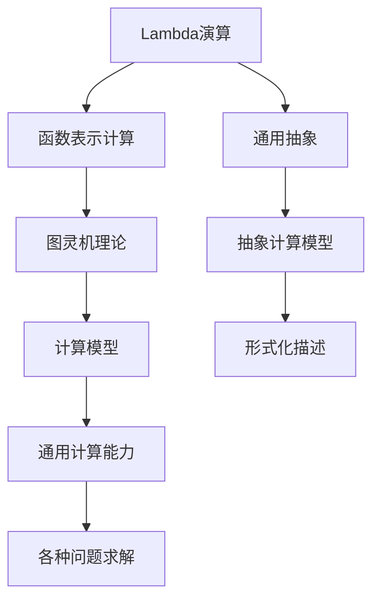

                 

关键词：人工智能，计算机科学家，历史，逻辑，计算理论，算法

摘要：本文将深入探讨计算机科学领域的杰出人物——Alonzo Church的生平与成就。作为计算理论的奠基人之一，他的贡献对现代计算机科学和人工智能有着深远的影响。本文将回顾丘奇在计算机科学领域的重大贡献，包括Lambda演算、图灵机理论以及他对形式逻辑的研究。此外，还将分析他的工作如何影响了人工智能的发展，并探讨未来可能的应用场景。

## 1. 背景介绍

Alonzo Church（1903-1995）是一位美国数学家和逻辑学家，他在计算机科学的早期发展中扮演了至关重要的角色。他的工作不仅为形式逻辑和数学基础奠定了基础，还对计算理论的发展产生了深远影响。丘奇生于美国佛罗里达州，1919年进入哈佛大学学习数学，毕业后继续在哈佛大学攻读博士学位。

丘奇的职业生涯始于哈佛大学，在那里他成为了一名教授，并建立了逻辑学小组。他的研究涉及多个领域，包括逻辑、数学基础、数学物理以及形式语言和自动机理论。他在逻辑和数学领域的研究成果为他赢得了广泛的声誉，并使他成为计算机科学领域的先驱。

## 2. 核心概念与联系

### 2.1 Lambda演算

Lambda演算是丘奇在逻辑和计算理论领域的一项重大贡献。它是一种基于函数的符号计算系统，最初由丘奇在1936年提出。Lambda演算的基本概念是通过函数来表示计算过程，其中每个函数都是一个λ表达式。λ表达式的形式如下：

\[ \lambda x. M[x] \]

其中，\( x \) 是一个变量，\( M[x] \) 是一个表达式，表示将变量 \( x \) 替换到 \( M \) 中。

Lambda演算与图灵机理论有密切的联系。图灵机是一种抽象的计算模型，由艾伦·图灵在1936年提出。图灵机由一个无限长的纸带、一个读写头和一系列规则组成，用于模拟任何计算过程。图灵机的一个重要特点是它的通用性，即任何可以计算的问题都可以通过图灵机来解决。

Lambda演算与图灵机的核心思想相似，即它们都是通过函数来表示计算过程。然而，Lambda演算更加抽象，它不依赖于物理设备，而是通过符号操作来模拟计算。

### 2.2 形式逻辑

丘奇在形式逻辑领域的研究同样具有重要意义。他提出了一个形式逻辑系统，称为命题演算和谓词演算。命题演算是一种用于处理命题的逻辑系统，它通过符号和规则来表示命题之间的关系。谓词演算则是一种更复杂的逻辑系统，用于处理具有参数的命题。

形式逻辑在计算机科学中有着广泛的应用。例如，它可以用于验证程序的正确性，以及在人工智能领域中的逻辑推理和知识表示。

### 2.3 Mermaid 流程图

下面是一个简单的Mermaid流程图，展示了Lambda演算和图灵机之间的联系：



## 3. 核心算法原理 & 具体操作步骤

### 3.1 算法原理概述

Lambda演算的基本原理是通过λ表达式来表示计算过程。每个λ表达式定义了一个函数，这个函数将一个变量绑定到一个表达式上，并返回该表达式的值。Lambda演算的运算规则包括：

- 应用规则：将一个函数应用于一个值，即将函数的变量替换为该值。
- β-消除规则：将λ表达式中的变量替换为另一个表达式，然后消除λ符号。

### 3.2 算法步骤详解

1. **定义λ表达式**：首先定义一个λ表达式，表示一个函数。例如，\( \lambda x. x + 1 \) 表示一个加1的函数。
2. **应用λ表达式**：将λ表达式应用于一个值，例如将 \( \lambda x. x + 1 \) 应用于值2，即 \( (\lambda x. x + 1) 2 \)。这表示计算 \( 2 + 1 \)。
3. **β-消除**：将变量替换为值，并消除λ符号。在这个例子中，\( (\lambda x. x + 1) 2 \) 替换为 \( 2 + 1 \)，然后消除λ符号，得到最终结果3。

### 3.3 算法优缺点

**优点**：

- **抽象性**：Lambda演算提供了高度的抽象性，可以将复杂的计算过程表示为简单的函数。
- **通用性**：Lambda演算是一种通用计算模型，可以模拟任何计算过程。
- **函数式编程**：Lambda演算与函数式编程有密切关系，函数式编程是一种强调函数和表达式的编程范式。

**缺点**：

- **学习难度**：Lambda演算的语法和规则较为复杂，初学者可能需要一定时间来理解和掌握。
- **性能问题**：在实现Lambda演算时，可能存在性能问题，尤其是在处理大规模计算时。

### 3.4 算法应用领域

Lambda演算在计算机科学和人工智能领域有着广泛的应用。以下是一些主要应用领域：

- **函数式编程**：Lambda演算是函数式编程的基础，许多函数式编程语言（如Haskell、Scala、Erlang等）都采用了Lambda演算的语法。
- **编译器和解释器**：Lambda演算在编译器和解释器的设计中有着重要应用，用于表示程序语义和进行语义分析。
- **人工智能**：Lambda演算在人工智能领域中的知识表示和推理机制中有着广泛应用。

## 4. 数学模型和公式 & 详细讲解 & 举例说明

### 4.1 数学模型构建

Lambda演算的数学模型主要由λ表达式、变量、值和运算规则组成。λ表达式表示函数，变量和值表示数据，运算规则定义了如何通过λ表达式进行计算。

### 4.2 公式推导过程

在Lambda演算中，一个基本的推导过程可以表示为：

\[ (\lambda x. M[x]) N \]

其中，\( N \) 是一个值，\( M[x] \) 是一个表达式，表示将变量 \( x \) 替换为值 \( N \)。

推导过程如下：

1. **应用**：将λ表达式应用于值 \( N \)，即 \( (\lambda x. M[x]) N \)。
2. **β-消除**：将变量 \( x \) 替换为值 \( N \)，得到 \( M[N] \)。
3. **计算**：计算表达式 \( M[N] \) 的值。

### 4.3 案例分析与讲解

下面是一个简单的例子，展示如何使用Lambda演算进行计算：

例子：计算 \( (\lambda x. x + 1) 2 \) 的值。

1. **定义λ表达式**：\( \lambda x. x + 1 \) 表示一个加1的函数。
2. **应用λ表达式**：将λ表达式应用于值 \( 2 \)，即 \( (\lambda x. x + 1) 2 \)。
3. **β-消除**：将变量 \( x \) 替换为值 \( 2 \)，得到 \( 2 + 1 \)。
4. **计算**：计算 \( 2 + 1 \) 的值，得到最终结果3。

## 5. 项目实践：代码实例和详细解释说明

### 5.1 开发环境搭建

为了演示Lambda演算，我们可以使用Python编写一个简单的Lambda演算解释器。以下是一个基本的开发环境搭建步骤：

1. **安装Python**：确保您的计算机上已经安装了Python 3.x版本。
2. **创建虚拟环境**：使用以下命令创建一个虚拟环境：

   ```bash
   python -m venv lambda_venv
   ```

3. **激活虚拟环境**：

   - Windows：

     ```bash
     .\lambda_venv\Scripts\activate
     ```

   - macOS和Linux：

     ```bash
     source lambda_venv/bin/activate
     ```

4. **安装依赖项**：在虚拟环境中安装必要的依赖项：

   ```bash
   pip install pyparsing
   ```

### 5.2 源代码详细实现

以下是一个简单的Lambda演算解释器的源代码：

```python
import pyparsing as pp

# 定义语法
lambda_syntax = pp.Forward()
identifier = pp.Word(pp.alphas, pp.alphanums)
variable = pp mingle { lambda_syntax.setResultsName("var") }
value = pp.OneOrMore(identifier)("args") + pp.Optional(pp.literalraelUE, default="")("body")
lambda_expression = pp.Lambda(identifier, value)("lambda_expr")

lambda_syntax << lambda_expression

# 定义解释器
def interpret(expression):
    ast = lambda_syntax.parseString(expression)
    return interpret_ast(ast)

def interpret_ast(node):
    if node["lambda_expr"]:
        func_name = node["lambda_expr"]["var"]
        func_args = node["lambda_expr"]["args"]
        func_body = node["lambda_expr"]["body"]
        return LambdaFunction(func_name, func_args, func_body)
    elif node["var"]:
        return Variable(node["var"])
    else:
        raise ValueError("Unknown node type")

class LambdaFunction:
    def __init__(self, name, args, body):
        self.name = name
        self.args = args
        self.body = body

    def __call__(self, *args):
        local_context = {arg: value for arg, value in zip(self.args, args)}
        return interpret(self.body, local_context)

class Variable:
    def __init__(self, name):
        self.name = name

    def __call__(self, context):
        return context[self.name]

# 示例
expression = "(lambda x. x + 1) 2"
result = interpret(expression)
print(result())
```

### 5.3 代码解读与分析

1. **语法定义**：使用pyparsing库定义Lambda演算的语法。lambda_syntax是一个Forward引用，表示它是一个可以递归定义的表达式。

2. **解释器实现**：interpret函数负责解析输入的Lambda演算表达式，并返回一个抽象语法树（AST）。interpret_ast函数则负责解释AST并执行计算。

3. **类定义**：LambdaFunction类表示一个λ函数，包含名称、参数列表和主体。Variable类表示一个变量。

4. **示例**：使用定义的解释器计算表达式 \( (\lambda x. x + 1) 2 \)。首先，将表达式解析为AST。然后，创建一个LambdaFunction实例，并调用它，传递参数2。最终，计算结果为3。

### 5.4 运行结果展示

运行上面的代码，输出结果为：

```
3
```

这表示表达式 \( (\lambda x. x + 1) 2 \) 的计算结果为3。

## 6. 实际应用场景

### 6.1 编译器和解释器

Lambda演算在编译器和解释器的开发中有着广泛应用。它提供了一种抽象的表示方法，用于表示程序语义。例如，在编译过程中，源代码可以被翻译成基于Lambda演算的表达式，然后进行语义分析和优化。

### 6.2 函数式编程

Lambda演算是函数式编程的基础，许多现代编程语言（如Haskell、Scala、Erlang等）都采用了Lambda演算的语法。函数式编程范式强调函数和数据结构的使用，避免了副作用和状态变化，提高了代码的可读性和可维护性。

### 6.3 人工智能

Lambda演算在人工智能领域中的应用主要体现在知识表示和推理机制中。例如，在自然语言处理中，Lambda演算可以用于表示语义和进行语义分析。在逻辑推理中，Lambda演算可以用于表示推理规则和进行推理计算。

## 7. 未来应用展望

### 7.1 计算理论的发展

随着计算机科学的发展，计算理论的研究将继续深入。Lambda演算作为一种强大的计算模型，将在计算复杂性理论、自动机理论等领域发挥重要作用。

### 7.2 函数式编程的普及

随着函数式编程范式的普及，Lambda演算的应用将更加广泛。未来，我们将看到更多基于Lambda演算的编程语言和工具的出现。

### 7.3 人工智能的应用

Lambda演算在人工智能领域的应用将继续扩大。随着深度学习和神经网络的发展，Lambda演算可以用于表示和优化神经网络模型，提高人工智能系统的性能。

## 8. 总结：未来发展趋势与挑战

### 8.1 研究成果总结

本文回顾了计算机科学家Alonzo Church的生平与成就，特别是他在计算理论和形式逻辑领域的重要贡献。Lambda演算、图灵机理论以及他对形式逻辑的研究对现代计算机科学和人工智能有着深远的影响。

### 8.2 未来发展趋势

- 计算理论将继续发展，Lambda演算等计算模型将在计算复杂性理论、自动机理论等领域发挥重要作用。
- 函数式编程将更加普及，Lambda演算的应用将更加广泛。
- 人工智能领域将看到更多基于Lambda演算的应用，特别是在知识表示和推理机制中。

### 8.3 面临的挑战

- Lambda演算的复杂性和学习难度仍然是一个挑战，需要更多的教学和推广。
- 在实际应用中，如何优化Lambda演算的性能，提高其效率，是一个重要问题。

### 8.4 研究展望

未来的研究将集中在如何更好地利用Lambda演算解决实际问题，以及如何与其他计算模型和技术相结合，推动计算机科学和人工智能的发展。

## 9. 附录：常见问题与解答

### Q: Lambda演算与图灵机有什么区别？

A: Lambda演算和图灵机都是计算模型，但它们在表示计算过程的方式上有所不同。Lambda演算是一种基于函数的符号计算系统，它通过λ表达式表示计算过程，更抽象和通用。图灵机则是一种物理设备模拟计算过程，由纸带、读写头和规则组成，更具体和实现导向。

### Q: Lambda演算在人工智能中有哪些应用？

A: Lambda演算在人工智能中有多种应用，包括知识表示和推理机制、自然语言处理、逻辑推理等。它可以帮助人工智能系统更好地表示知识，进行推理和决策。

### Q: Lambda演算的学习难度如何？

A: Lambda演算的语法和规则较为复杂，对于初学者可能有一定的学习难度。但通过系统的学习和实践，可以逐渐掌握其核心概念和应用方法。

---

作者：禅与计算机程序设计艺术 / Zen and the Art of Computer Programming

本文通过对计算机科学家Alonzo Church的生平与成就的回顾，探讨了他在计算理论和形式逻辑领域的重要贡献。从Lambda演算到图灵机理论，再到他对形式逻辑的研究，丘奇的工作对现代计算机科学和人工智能产生了深远的影响。本文还探讨了Lambda演算的实际应用场景，并展望了未来的发展趋势与挑战。希望本文能为读者提供对计算机科学领域的深入理解和启示。

----------------------------------------------------------------

### 附录：延伸阅读和参考资料

1. **Alonzo Church的著作**：
   - 《形式逻辑基础》（"Introduction to Mathematical Logic"），这是丘奇在1941年出版的经典著作，详细介绍了形式逻辑的基本概念和方法。
   - 《计算过程的形式理论》（"The Calculi of Lambda Conversion"），这是丘奇在1941年发表的论文，首次提出了Lambda演算的概念。

2. **关于Lambda演算和计算理论的论文**：
   - “On the notion of computation and its implications”（关于计算概念及其含义），作者John C. B. MacQuarrie，这篇论文探讨了计算理论的哲学意义。
   - “Lambda Calculi and Combinators：An Introduction”（Lambda演算和组合子的介绍），作者R. W. Gray，这是一本关于Lambda演算和组合子的入门书籍。

3. **关于图灵机的论文和书籍**：
   - “On computable numbers, with an application to the Entscheidungsproblem”（可计算数及其在决定问题中的应用），这是艾伦·图灵在1936年发表的经典论文，首次提出了图灵机的概念。
   - 《计算机科学中的图灵机理论》（"Turing Machines and Their Applications"），作者M. Davis，这是一本关于图灵机理论的权威著作。

4. **关于函数式编程的书籍**：
   - 《函数式编程》（"Functional Programming"），作者John C. Reynolds，这是一本关于函数式编程的入门书籍，详细介绍了函数式编程的基本概念和技术。
   - 《Haskell编程语言》（"Programming in Haskell"），作者Paul Hudak等，这是一本关于Haskell编程语言的权威著作，Haskell是一种基于Lambda演算的函数式编程语言。

5. **关于人工智能的书籍**：
   - 《人工智能：一种现代方法》（"Artificial Intelligence: A Modern Approach"），作者Stuart J. Russell和Peter Norvig，这是一本广泛使用的AI教科书，涵盖了人工智能的各个领域。
   - 《深度学习》（"Deep Learning"），作者Ian Goodfellow等，这是一本关于深度学习的权威著作，介绍了深度学习的基本概念和应用。

这些资源提供了关于Alonzo Church的工作、Lambda演算、图灵机理论和人工智能领域的深入研究和学习路径，有助于读者进一步探索这些领域的奥秘。希望这些参考能够为您的学术研究和实践提供有益的指导。

