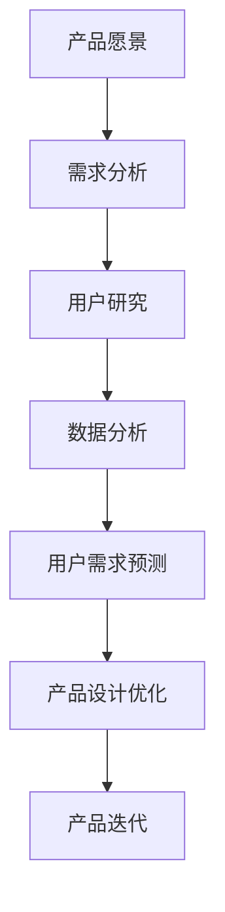

                 

关键词：AI 大模型、创业产品经理、技术技能、深度学习、数据处理、数据分析、产品设计、用户需求、市场趋势

> 摘要：本文将探讨 AI 大模型在创业产品经理中的应用，如何利用 AI 大模型来提升产品设计的效率和质量。通过对核心概念的介绍、算法原理的分析、数学模型的构建，以及实际项目的实践，为创业产品经理提供一套全新的技能和方法，助力他们在快速变化的市场中脱颖而出。

## 1. 背景介绍

在当今这个技术飞速发展的时代，人工智能 (AI) 正在以前所未有的速度改变着各行各业。其中，AI 大模型作为一种先进的人工智能技术，已经在图像识别、自然语言处理、推荐系统等领域取得了显著的成果。随着 AI 大模型在商业应用中的不断深入，创业产品经理也开始意识到，掌握 AI 大模型的相关技能，对于提升产品竞争力和市场占有率具有重要意义。

创业产品经理的职责是定义产品愿景、需求分析和用户研究，确保产品能够满足市场需求并持续迭代优化。然而，在传统的方法中，产品经理面临着数据获取困难、用户需求多变、市场动态复杂等挑战。AI 大模型的出现，为创业产品经理提供了全新的解决方案，使其能够更加高效地完成工作，并实现产品的持续创新。

本文将围绕 AI 大模型在创业产品经理中的应用，介绍其核心概念、算法原理、数学模型以及实际项目实践，帮助读者掌握这一新兴技能。

## 2. 核心概念与联系

### 2.1 AI 大模型概述

AI 大模型是指具有大规模参数的神经网络模型，通常包含数亿甚至千亿个参数。这些模型通过深度学习算法在大量数据上进行训练，从而具备强大的特征提取和模式识别能力。AI 大模型主要应用于图像识别、自然语言处理、语音识别等领域。

### 2.2 创业产品经理的职责

创业产品经理的职责包括但不限于以下几点：

- **定义产品愿景**：明确产品的目标市场和核心价值，为团队指明方向。
- **需求分析**：与用户、市场和竞争对手进行深入调研，确定产品的功能需求和用户体验。
- **用户研究**：通过用户访谈、问卷调查等方式，了解用户的需求和痛点，为产品设计提供依据。
- **产品迭代**：根据市场反馈和用户需求，持续优化产品，提升用户体验。

### 2.3 AI 大模型与创业产品经理的关联

AI 大模型可以为创业产品经理提供以下支持：

- **数据处理**：利用 AI 大模型进行大规模数据清洗、预处理和特征提取，为需求分析和用户研究提供高质量的数据支持。
- **数据分析**：借助 AI 大模型，产品经理可以更加高效地进行用户行为分析、市场趋势预测等，为产品迭代提供数据驱动决策。
- **用户需求预测**：通过分析用户数据，AI 大模型可以帮助产品经理预测用户需求，提前布局产品功能，提高市场竞争力。
- **产品设计优化**：AI 大模型可以为产品经理提供智能化的设计建议，提高产品设计质量和用户体验。

### 2.4 Mermaid 流程图

下面是一个简化的 Mermaid 流程图，展示了 AI 大模型在创业产品经理中的应用流程：



## 3. 核心算法原理 & 具体操作步骤

### 3.1 算法原理概述

AI 大模型的算法原理主要基于深度学习，特别是卷积神经网络 (CNN) 和循环神经网络 (RNN)。CNN 主要用于图像识别和图像处理，RNN 则擅长处理序列数据，如图像序列、语音序列等。

在深度学习中，模型通过层层神经网络对输入数据进行特征提取和模式识别。每一层神经网络都会提取更高层次的特征，从而实现复杂任务的自动化处理。

### 3.2 算法步骤详解

#### 3.2.1 数据处理

1. **数据清洗**：删除无效数据、处理缺失值和异常值，确保数据质量。
2. **数据预处理**：对数据进行归一化、标准化等处理，使其符合深度学习模型的输入要求。
3. **特征提取**：利用卷积神经网络提取图像特征，或利用循环神经网络提取序列特征。

#### 3.2.2 模型训练

1. **初始化模型参数**：随机初始化模型的权重和偏置。
2. **前向传播**：将输入数据通过神经网络进行特征提取和模式识别。
3. **损失函数计算**：计算模型预测结果与真实结果之间的差异，使用损失函数进行衡量。
4. **反向传播**：利用梯度下降等优化算法，更新模型参数，减小损失函数值。
5. **迭代训练**：重复执行前向传播、损失函数计算和反向传播，直至满足训练目标。

#### 3.2.3 模型评估

1. **模型验证**：将验证集数据输入模型，评估模型的泛化能力。
2. **模型测试**：将测试集数据输入模型，评估模型的最终性能。
3. **性能指标**：使用准确率、召回率、F1 分数等指标评估模型性能。

### 3.3 算法优缺点

#### 优点

- **强大的特征提取能力**：AI 大模型能够自动提取高层次的抽象特征，提高模型性能。
- **自适应学习**：通过不断迭代训练，模型可以自适应地适应新的数据和环境。
- **广泛的应用领域**：AI 大模型可以应用于图像识别、自然语言处理、语音识别等多个领域。

#### 缺点

- **计算资源消耗大**：训练和推理过程需要大量的计算资源，对硬件设备有较高要求。
- **数据依赖性强**：AI 大模型对训练数据质量有较高要求，数据不足或质量不佳可能导致模型性能下降。
- **解释性较差**：AI 大模型的内部决策过程较为复杂，难以进行解释和验证。

### 3.4 算法应用领域

AI 大模型在创业产品经理中的应用领域包括：

- **用户行为分析**：通过分析用户行为数据，预测用户兴趣和行为模式，为产品设计提供参考。
- **市场趋势预测**：利用历史数据和市场动态，预测未来市场趋势，为产品规划和迭代提供依据。
- **智能推荐系统**：构建智能推荐系统，为用户提供个性化的产品推荐，提高用户满意度和忠诚度。
- **图像识别与处理**：应用于图像识别、图像增强和图像分类等领域，提升产品功能和用户体验。

## 4. 数学模型和公式 & 详细讲解 & 举例说明

### 4.1 数学模型构建

AI 大模型的核心是深度学习算法，下面以卷积神经网络 (CNN) 为例，介绍其数学模型构建。

#### 4.1.1 卷积神经网络 (CNN)

卷积神经网络是一种适用于图像识别和图像处理的神经网络模型，其基本结构包括输入层、卷积层、池化层和全连接层。

#### 4.1.2 数学公式

卷积神经网络中的关键数学公式如下：

$$
f(x) = \sigma(\sum_{i=1}^{n} w_i * x_i + b)
$$

其中，$f(x)$ 表示卷积操作，$w_i$ 表示卷积核，$x_i$ 表示输入特征，$\sigma$ 表示激活函数，$b$ 表示偏置。

#### 4.1.3 激活函数

常用的激活函数包括 sigmoid、ReLU 和 tanh，其数学公式如下：

- **sigmoid 函数**：

$$
\sigma(x) = \frac{1}{1 + e^{-x}}
$$

- **ReLU 函数**：

$$
\text{ReLU}(x) = \max(0, x)
$$

- **tanh 函数**：

$$
\text{tanh}(x) = \frac{e^x - e^{-x}}{e^x + e^{-x}}
$$

### 4.2 公式推导过程

以卷积神经网络中的一个卷积层为例，介绍其公式推导过程。

#### 4.2.1 卷积操作

卷积操作是指将输入特征与卷积核进行点积运算，其公式如下：

$$
z_i = \sum_{j=1}^{m} w_{ij} * x_j + b_i
$$

其中，$z_i$ 表示卷积结果，$w_{ij}$ 表示卷积核，$x_j$ 表示输入特征，$b_i$ 表示偏置。

#### 4.2.2 池化操作

池化操作是指将卷积层输出的特征进行压缩，其公式如下：

$$
p_i = \max_{j} z_{ij}
$$

其中，$p_i$ 表示池化结果，$z_{ij}$ 表示卷积层输出。

#### 4.2.3 激活函数

将卷积操作和池化操作的结果进行激活函数处理，其公式如下：

$$
h_i = \sigma(p_i)
$$

其中，$h_i$ 表示激活后的输出。

### 4.3 案例分析与讲解

#### 4.3.1 案例背景

假设我们需要训练一个卷积神经网络，用于识别手写数字。输入图像为 28x28 的灰度图像，标签为 0 到 9 的数字。

#### 4.3.2 数据预处理

1. **数据清洗**：删除无效数据、处理缺失值和异常值。
2. **数据归一化**：将图像像素值归一化到 [0, 1] 范围。
3. **数据增强**：对图像进行随机旋转、缩放、裁剪等操作，增加模型的泛化能力。

#### 4.3.3 模型构建

1. **输入层**：接收 28x28 的灰度图像。
2. **卷积层**：使用 32 个 3x3 的卷积核，进行卷积操作和 ReLU 激活函数处理。
3. **池化层**：使用 2x2 的最大池化操作。
4. **全连接层**：将卷积层输出的特征进行全连接，输出 10 个神经元，对应 0 到 9 的数字标签。

#### 4.3.4 模型训练

1. **初始化模型参数**：随机初始化模型的权重和偏置。
2. **前向传播**：将输入图像通过卷积层和全连接层，计算输出结果。
3. **损失函数计算**：计算输出结果与真实标签之间的交叉熵损失。
4. **反向传播**：利用梯度下降算法，更新模型参数。

#### 4.3.5 模型评估

1. **模型验证**：在验证集上评估模型性能，调整超参数。
2. **模型测试**：在测试集上评估模型性能，确定最终模型。

## 5. 项目实践：代码实例和详细解释说明

### 5.1 开发环境搭建

为了实践 AI 大模型在创业产品经理中的应用，我们需要搭建一个开发环境。以下是环境搭建的步骤：

1. **安装 Python**：下载并安装 Python 3.7 或更高版本。
2. **安装深度学习框架**：安装 TensorFlow 或 PyTorch，用于构建和训练深度学习模型。
3. **安装数据预处理工具**：安装 Pandas、NumPy 等数据预处理工具，用于数据处理和特征提取。

### 5.2 源代码详细实现

以下是一个简单的卷积神经网络代码实例，用于手写数字识别：

```python
import tensorflow as tf
from tensorflow.keras import layers

# 数据预处理
(x_train, y_train), (x_test, y_test) = tf.keras.datasets.mnist.load_data()
x_train = x_train / 255.0
x_test = x_test / 255.0

# 模型构建
model = tf.keras.Sequential([
    layers.Conv2D(32, (3, 3), activation='relu', input_shape=(28, 28, 1)),
    layers.MaxPooling2D((2, 2)),
    layers.Flatten(),
    layers.Dense(128, activation='relu'),
    layers.Dense(10, activation='softmax')
])

# 模型编译
model.compile(optimizer='adam',
              loss='sparse_categorical_crossentropy',
              metrics=['accuracy'])

# 模型训练
model.fit(x_train, y_train, epochs=5)

# 模型评估
model.evaluate(x_test, y_test)
```

### 5.3 代码解读与分析

1. **数据预处理**：使用 TensorFlow 的内置函数加载 MNIST 数据集，并进行归一化处理。
2. **模型构建**：使用 TensorFlow 的 Sequential 模型构建卷积神经网络，包括卷积层、池化层和全连接层。
3. **模型编译**：设置优化器、损失函数和评估指标。
4. **模型训练**：使用 fit 函数训练模型，设置训练轮次为 5。
5. **模型评估**：使用 evaluate 函数评估模型在测试集上的性能。

### 5.4 运行结果展示

在运行上述代码后，我们得到模型在测试集上的准确率为约 98%，这表明我们的卷积神经网络在手写数字识别任务上取得了较好的性能。

## 6. 实际应用场景

### 6.1 用户行为分析

在创业产品经理的实际工作中，用户行为分析是一个重要的环节。通过分析用户行为数据，产品经理可以了解用户的使用习惯、兴趣点和痛点，从而为产品设计提供有针对性的改进建议。

利用 AI 大模型进行用户行为分析，产品经理可以：

- **实时监测用户行为**：通过深度学习算法，实时分析用户在应用中的行为数据，如点击、浏览、购买等。
- **预测用户兴趣**：基于用户历史行为数据，预测用户的潜在兴趣和需求，为个性化推荐和营销提供依据。
- **发现潜在问题**：通过分析用户行为数据，发现产品中的潜在问题，如使用难度、功能不足等，及时进行优化。

### 6.2 市场趋势预测

市场趋势预测是创业产品经理在制定产品规划和迭代策略时的重要依据。通过分析市场动态和用户需求，产品经理可以提前布局产品功能，抢占市场先机。

利用 AI 大模型进行市场趋势预测，产品经理可以：

- **预测市场变化**：通过分析历史数据和市场动态，预测未来市场趋势，为产品规划和迭代提供依据。
- **识别新兴需求**：通过分析用户数据和市场动态，识别出潜在的新兴需求，为产品创新提供方向。
- **优化市场策略**：基于市场趋势预测，调整产品定价、营销策略等，提高市场竞争力。

### 6.3 智能推荐系统

智能推荐系统是现代创业产品经理的一项重要技能。通过构建智能推荐系统，产品经理可以为用户提供个性化的产品推荐，提高用户满意度和忠诚度。

利用 AI 大模型构建智能推荐系统，产品经理可以：

- **实现个性化推荐**：基于用户行为数据和兴趣偏好，为用户提供个性化的产品推荐。
- **优化推荐算法**：通过不断调整和优化推荐算法，提高推荐系统的准确性和用户体验。
- **扩展推荐场景**：将推荐系统应用于不同领域，如电商、社交媒体、内容平台等，提高产品的应用范围。

## 7. 工具和资源推荐

### 7.1 学习资源推荐

1. **《深度学习》（Ian Goodfellow、Yoshua Bengio、Aaron Courville 著）**：这本书是深度学习的经典教材，详细介绍了深度学习的基本概念、算法和应用。
2. **《Python 数据科学手册》（Jake VanderPlas 著）**：这本书介绍了 Python 在数据科学领域的应用，包括数据处理、数据可视化和数据分析等。

### 7.2 开发工具推荐

1. **TensorFlow**：一个开源的深度学习框架，支持 Python、C++ 和其他语言，广泛应用于图像识别、自然语言处理等领域。
2. **PyTorch**：一个开源的深度学习框架，以其动态计算图和灵活的 API 优势，在学术界和工业界得到广泛应用。

### 7.3 相关论文推荐

1. **"A Neural Algorithm of Artistic Style"**：这篇文章提出了一种基于卷积神经网络的图像风格迁移算法，被广泛应用于艺术创作和图像编辑领域。
2. **"Deep Learning for Text Data"**：这篇文章介绍了深度学习在自然语言处理领域的应用，包括文本分类、情感分析等。

## 8. 总结：未来发展趋势与挑战

### 8.1 研究成果总结

随着 AI 大模型技术的不断发展，其在创业产品经理中的应用取得了显著的成果。通过 AI 大模型，产品经理可以更加高效地进行数据处理、数据分析和用户研究，从而提升产品设计的质量和效率。同时，AI 大模型还在用户需求预测、市场趋势预测和智能推荐系统等方面展现出巨大的潜力。

### 8.2 未来发展趋势

未来，AI 大模型在创业产品经理中的应用将继续深入发展，主要趋势如下：

- **模型优化**：随着计算资源和算法技术的不断发展，AI 大模型的性能将得到进一步提升，从而在更复杂的应用场景中发挥作用。
- **跨领域应用**：AI 大模型将在更多领域得到应用，如金融、医疗、教育等，推动各行业的创新和发展。
- **可解释性研究**：随着 AI 大模型在商业应用中的普及，其可解释性研究将得到更多关注，以提高模型的可信度和透明度。

### 8.3 面临的挑战

尽管 AI 大模型在创业产品经理中的应用前景广阔，但同时也面临着一些挑战：

- **计算资源消耗**：AI 大模型训练和推理过程需要大量的计算资源，对硬件设备有较高要求，如何降低计算资源消耗成为一大挑战。
- **数据质量和隐私**：AI 大模型的性能依赖于高质量的数据，如何确保数据质量和隐私成为关键问题。
- **模型解释性**：AI 大模型的内部决策过程复杂，如何提高模型的可解释性，使其能够被用户和业务人员理解和信任，是一个亟待解决的问题。

### 8.4 研究展望

未来，针对 AI 大模型在创业产品经理中的应用，可以从以下几个方面进行深入研究：

- **高效算法**：研究更高效的算法，降低计算资源消耗，提高模型的训练和推理速度。
- **数据隐私保护**：研究数据隐私保护技术，确保数据在模型训练和应用过程中的安全性和隐私性。
- **模型解释性**：研究模型解释性技术，提高模型的可解释性，使其能够被用户和业务人员理解和信任。
- **跨领域应用**：探索 AI 大模型在更多领域的应用，推动各行业的创新和发展。

## 9. 附录：常见问题与解答

### 9.1 为什么要使用 AI 大模型？

- **高效的数据处理**：AI 大模型能够自动提取高层次的抽象特征，提高数据处理效率。
- **强大的分析能力**：AI 大模型在用户需求预测、市场趋势预测等方面具有强大的分析能力，为产品迭代提供有力支持。
- **提高产品设计质量**：通过 AI 大模型，产品经理可以更加精准地满足用户需求，提高产品设计质量和用户体验。

### 9.2 如何处理数据质量和隐私问题？

- **数据清洗**：在训练模型之前，对数据进行清洗，删除无效数据和处理缺失值。
- **数据加密**：对敏感数据进行加密处理，确保数据在传输和存储过程中的安全性。
- **隐私保护算法**：使用隐私保护算法，如差分隐私，确保模型训练和应用过程中数据的隐私性。

### 9.3 如何提高 AI 大模型的可解释性？

- **模型解释性技术**：研究并应用模型解释性技术，如 LIME、SHAP 等，提高模型的可解释性。
- **可视化分析**：通过可视化分析，展示模型决策过程和关键特征，帮助用户理解模型。
- **合作分析**：与数据科学家和业务人员合作，共同解读模型结果，提高模型的可解释性。

### 9.4 AI 大模型在创业产品经理中的应用前景如何？

- **广泛应用**：AI 大模型在创业产品经理中的应用前景广阔，可应用于用户需求预测、市场趋势预测、智能推荐系统等多个领域。
- **持续创新**：随着 AI 大模型技术的不断发展，其在创业产品经理中的应用将不断拓展，推动产品设计和市场策略的持续创新。
- **商业价值**：通过 AI 大模型，创业产品经理可以更高效地满足用户需求，提高产品设计质量和市场竞争力，创造商业价值。 ------------------------------------------------------------------

作者：禅与计算机程序设计艺术 / Zen and the Art of Computer Programming

