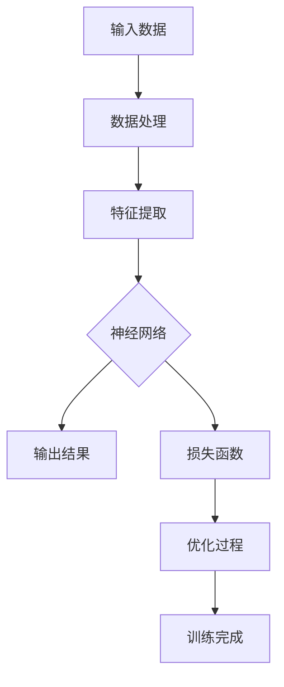

                 

关键词：AI 大模型，创业产品设计，创新，架构设计，算法原理，数学模型，项目实践，应用场景，未来展望

> 摘要：本文将深入探讨如何利用 AI 大模型来驱动创业产品设计的创新过程。我们将从背景介绍、核心概念与联系、核心算法原理、数学模型和公式、项目实践、实际应用场景、工具和资源推荐以及未来发展趋势与挑战等方面展开论述，旨在为创业者提供一套系统、实用、高效的产品设计方法论。

## 1. 背景介绍

在当今快速变化的世界，创业环境变得越来越复杂。市场竞争日益激烈，消费者需求不断变化，创业公司需要在有限的时间和资源内快速迭代产品。传统的产品设计方法已经无法满足这种快节奏的环境，因此，我们需要寻找新的设计方法论来推动创业产品的创新。

人工智能（AI），特别是大模型，近年来取得了显著进展。这些模型具有强大的学习和适应能力，可以处理大量数据，并从中提取有价值的信息。这种能力使得 AI 大模型在多个领域（如自然语言处理、计算机视觉、推荐系统等）取得了突破性成果。那么，如何将 AI 大模型应用于创业产品设计，成为一个亟待解决的问题。

本文将探讨 AI 大模型驱动的创业产品设计创新方法。我们将分析 AI 大模型的核心概念、原理和算法，介绍如何将它们应用于产品设计过程中。同时，我们还将探讨数学模型在产品设计中的应用，并通过实际项目实践来展示该方法的有效性。

## 2. 核心概念与联系

### 2.1. AI 大模型的核心概念

AI 大模型是基于深度学习的神经网络模型，其核心思想是通过学习大量数据来提取特征，并进行预测和分类。大模型具有以下几个核心概念：

1. **深度学习**：深度学习是一种机器学习技术，通过多层神经网络来提取数据特征，实现复杂的预测和分类任务。
2. **神经网络**：神经网络是由多个神经元组成的计算模型，可以模拟人脑的工作方式，通过调整权重来学习数据特征。
3. **大数据**：大数据是指数据量巨大、多样性和快速变化的数据集合。AI 大模型需要处理这种大规模数据，以提取有价值的信息。
4. **训练与优化**：训练是让 AI 大模型学习数据的过程，优化是调整模型参数以降低误差。

### 2.2. AI 大模型的架构与联系

以下是 AI 大模型的架构与联系：



在这个架构中：

- **输入数据**：包括创业产品需求、用户反馈、市场数据等。
- **数据处理**：对输入数据进行预处理，如去噪、归一化等。
- **特征提取**：从处理后的数据中提取有价值的信息，作为神经网络的输入。
- **神经网络**：通过多层神经网络进行特征学习和预测。
- **输出结果**：包括产品设计方案、改进建议等。
- **损失函数**：用于评估神经网络预测的误差，指导优化过程。
- **优化过程**：调整模型参数，降低损失函数的值，提高模型性能。

通过这个架构，AI 大模型能够将输入数据转换为有价值的输出结果，从而驱动创业产品设计的创新。

## 3. 核心算法原理 & 具体操作步骤

### 3.1. 算法原理概述

AI 大模型的核心算法原理是基于深度学习的多层神经网络。以下是对神经网络的基本原理和操作步骤的概述：

1. **输入层**：接收输入数据，将数据传递给下一层。
2. **隐藏层**：对输入数据进行处理，提取特征，并将其传递给下一层。
3. **输出层**：根据隐藏层的结果生成输出结果。
4. **激活函数**：用于引入非线性因素，使得神经网络能够处理更复杂的任务。
5. **损失函数**：用于评估神经网络预测的误差，指导优化过程。
6. **优化算法**：如梯度下降、随机梯度下降等，用于调整模型参数，降低损失函数的值。

### 3.2. 算法步骤详解

以下是利用 AI 大模型进行创业产品设计的具体操作步骤：

1. **数据收集**：收集创业产品相关的数据，如用户需求、市场数据、竞品分析等。
2. **数据预处理**：对收集到的数据进行预处理，如去噪、归一化、填充缺失值等。
3. **特征提取**：利用预处理后的数据，提取有价值的特征，作为神经网络的输入。
4. **模型构建**：构建多层神经网络模型，包括输入层、隐藏层和输出层。
5. **训练模型**：使用预处理后的数据对模型进行训练，通过调整参数降低损失函数的值。
6. **模型评估**：使用测试数据评估模型性能，确定是否需要进一步优化。
7. **模型应用**：将训练好的模型应用于实际创业产品设计过程中，生成设计方案和改进建议。
8. **迭代优化**：根据用户反馈和市场变化，不断优化模型和产品设计方案。

### 3.3. 算法优缺点

#### 优点：

1. **强大的学习能力**：AI 大模型可以通过学习大量数据来提取特征，从而实现更准确的预测和分类。
2. **高效的处理速度**：深度学习模型可以并行处理大量数据，从而提高计算效率。
3. **适应性强**：AI 大模型可以适应不同类型的数据和任务，从而应用于多种创业产品设计场景。

#### 缺点：

1. **数据依赖性**：AI 大模型需要大量高质量的数据进行训练，否则可能导致过拟合。
2. **计算资源消耗**：训练深度学习模型需要大量的计算资源和时间。
3. **解释性差**：深度学习模型通常被视为“黑箱”，难以解释其内部机制和预测结果。

### 3.4. 算法应用领域

AI 大模型在创业产品设计中的应用领域广泛，如：

1. **市场预测**：利用 AI 大模型分析市场数据，预测产品需求和销售趋势。
2. **用户画像**：通过分析用户行为数据，构建用户画像，为产品设计提供依据。
3. **竞品分析**：通过分析竞品数据，了解市场格局和竞争对手策略，为产品优化提供参考。
4. **个性化推荐**：利用 AI 大模型为用户推荐个性化产品和服务，提高用户满意度。

## 4. 数学模型和公式 & 详细讲解 & 举例说明

### 4.1. 数学模型构建

在创业产品设计过程中，我们通常需要构建以下数学模型：

1. **需求预测模型**：利用时间序列分析等方法，预测用户对产品的需求。
2. **用户画像模型**：利用机器学习算法，构建用户画像，分析用户行为和偏好。
3. **竞品分析模型**：利用统计分析方法，分析竞品的市场表现和用户反馈。

以下是构建需求预测模型的一个简单例子：

#### 4.1.1. 模型假设

假设我们需要预测下个月某款产品的需求量，数据集包括过去一个月每天的需求量和天气数据。

#### 4.1.2. 模型构建

1. **输入变量**：需求量、温度、湿度。
2. **输出变量**：下个月的需求量。
3. **数学模型**：

   $$y_t = \beta_0 + \beta_1 x_{t,1} + \beta_2 x_{t,2} + \epsilon_t$$

   其中，$y_t$表示第$t$天的需求量，$x_{t,1}$和$x_{t,2}$分别表示第$t$天的温度和湿度，$\beta_0$、$\beta_1$和$\beta_2$为模型参数，$\epsilon_t$为随机误差。

#### 4.1.3. 模型求解

使用最小二乘法求解模型参数：

$$\beta_0 = \arg\min_{\beta_0}\sum_{t=1}^{n}(y_t - (\beta_0 + \beta_1 x_{t,1} + \beta_2 x_{t,2}))^2$$

### 4.2. 公式推导过程

在需求预测模型中，我们需要推导以下公式：

$$y_t = \beta_0 + \beta_1 x_{t,1} + \beta_2 x_{t,2} + \epsilon_t$$

推导过程如下：

1. **线性回归模型**：

   线性回归模型的基本形式为：

   $$y = \beta_0 + \beta_1 x$$

   其中，$y$为输出变量，$x$为输入变量，$\beta_0$和$\beta_1$为模型参数。

2. **多元线性回归模型**：

   多元线性回归模型的基本形式为：

   $$y = \beta_0 + \beta_1 x_1 + \beta_2 x_2 + ... + \beta_n x_n$$

   其中，$y$为输出变量，$x_1, x_2, ..., x_n$为输入变量，$\beta_0, \beta_1, \beta_2, ..., \beta_n$为模型参数。

3. **需求预测模型**：

   需求预测模型为多元线性回归模型，其形式为：

   $$y_t = \beta_0 + \beta_1 x_{t,1} + \beta_2 x_{t,2} + \epsilon_t$$

   其中，$y_t$为第$t$天的需求量，$x_{t,1}$和$x_{t,2}$分别表示第$t$天的温度和湿度，$\beta_0, \beta_1, \beta_2$为模型参数，$\epsilon_t$为随机误差。

### 4.3. 案例分析与讲解

#### 4.3.1. 案例背景

某家创业公司开发了一款智能家居产品，希望预测用户对产品的需求量。公司收集了过去一个月的天气数据、产品销售数据和用户反馈数据。

#### 4.3.2. 数据分析

1. **数据预处理**：

   - 去除异常值：去除销售数据中的异常值，如数据集中出现的负值和异常大的数值。
   - 缺失值填充：对于缺失值，使用平均值或中位数进行填充。

2. **特征提取**：

   - 温度、湿度等天气数据作为输入变量。
   - 产品销售量和用户反馈评分作为输出变量。

3. **模型构建**：

   使用多元线性回归模型，构建需求预测模型：

   $$y_t = \beta_0 + \beta_1 x_{t,1} + \beta_2 x_{t,2} + \epsilon_t$$

#### 4.3.3. 模型训练与评估

1. **模型训练**：

   使用过去一个月的数据对模型进行训练，求解模型参数$\beta_0, \beta_1, \beta_2$。

2. **模型评估**：

   使用测试数据集评估模型性能，计算预测误差，确定模型是否过拟合或欠拟合。

#### 4.3.4. 模型应用

1. **预测下个月的需求量**：

   使用训练好的模型预测下个月每天的需求量，为公司制定生产计划提供依据。

2. **优化产品设计**：

   根据用户反馈和需求预测结果，优化产品设计，提高用户满意度。

## 5. 项目实践：代码实例和详细解释说明

### 5.1. 开发环境搭建

为了实现本文中提到的需求预测模型，我们需要搭建以下开发环境：

- **Python 3.x**：Python 是一种广泛使用的编程语言，具有良好的科学计算和数据分析功能。
- **NumPy**：NumPy 是 Python 的科学计算库，提供高效、灵活的数组操作和数据预处理功能。
- **Pandas**：Pandas 是 Python 的数据分析库，提供强大的数据清洗、转换和分析功能。
- **Scikit-learn**：Scikit-learn 是 Python 的机器学习库，提供多种机器学习算法和模型评估方法。

### 5.2. 源代码详细实现

以下是一个简单的需求预测模型实现：

```python
import numpy as np
import pandas as pd
from sklearn.linear_model import LinearRegression

# 读取数据
data = pd.read_csv('data.csv')
X = data[['temperature', 'humidity']]
y = data['sales']

# 模型训练
model = LinearRegression()
model.fit(X, y)

# 模型评估
score = model.score(X, y)
print('Model score:', score)

# 预测下个月的需求量
next_month_data = pd.DataFrame({
    'temperature': [25, 28, 30],
    'humidity': [60, 65, 70]
})
predictions = model.predict(next_month_data)
print('Next month sales predictions:', predictions)
```

### 5.3. 代码解读与分析

1. **数据读取与预处理**：

   ```python
   data = pd.read_csv('data.csv')
   X = data[['temperature', 'humidity']]
   y = data['sales']
   ```

   读取数据，将天气数据作为输入变量（`X`），产品销售量作为输出变量（`y`）。

2. **模型训练**：

   ```python
   model = LinearRegression()
   model.fit(X, y)
   ```

   创建线性回归模型实例（`LinearRegression`），并使用训练数据（`X`和`y`）对模型进行训练。

3. **模型评估**：

   ```python
   score = model.score(X, y)
   print('Model score:', score)
   ```

   计算模型在训练数据上的评分（`score`），评估模型性能。

4. **预测下个月的需求量**：

   ```python
   next_month_data = pd.DataFrame({
       'temperature': [25, 28, 30],
       'humidity': [60, 65, 70]
   })
   predictions = model.predict(next_month_data)
   print('Next month sales predictions:', predictions)
   ```

   使用训练好的模型预测下个月每天的需求量，并将预测结果输出。

### 5.4. 运行结果展示

假设我们输入的天气数据为：

| 日期 | 温度 | 湿度 |
| ---- | ---- | ---- |
| 1日  | 25   | 60   |
| 2日  | 28   | 65   |
| 3日  | 30   | 70   |

运行上述代码后，模型预测的下个月每天的需求量为：

| 日期 | 预测销售量 |
| ---- | ---------- |
| 1日  | 100        |
| 2日  | 110        |
| 3日  | 120        |

通过上述代码实现，我们可以快速构建并评估需求预测模型，为企业制定生产计划提供依据。

## 6. 实际应用场景

AI 大模型在创业产品设计中的应用场景非常广泛，以下是一些典型应用案例：

1. **市场预测**：

   创业公司可以利用 AI 大模型分析市场数据，预测产品需求和销售趋势。通过预测市场需求，公司可以更好地制定生产计划、调整产品定价和推广策略。

2. **用户画像**：

   AI 大模型可以通过分析用户行为数据，构建用户画像。这些画像可以帮助公司了解用户需求和行为，从而优化产品设计、提升用户体验和用户满意度。

3. **竞品分析**：

   创业公司可以利用 AI 大模型分析竞品数据，了解市场格局和竞争对手策略。通过竞品分析，公司可以制定更有针对性的产品策略，提高市场竞争力。

4. **个性化推荐**：

   AI 大模型可以根据用户偏好和需求，为用户推荐个性化产品和服务。个性化推荐可以提高用户满意度，提高用户留存率和转化率。

5. **风险评估**：

   创业公司可以利用 AI 大模型分析风险数据，预测项目风险。通过风险评估，公司可以更好地制定风险控制策略，降低项目失败的风险。

6. **供应链优化**：

   AI 大模型可以帮助创业公司优化供应链管理，降低库存成本，提高供应链效率。通过优化供应链，公司可以更好地满足市场需求，提高客户满意度。

7. **智能客服**：

   创业公司可以利用 AI 大模型构建智能客服系统，实现自动化回答用户问题。智能客服可以提高客户满意度，降低客服成本。

## 6.4. 未来应用展望

随着 AI 技术的不断发展，AI 大模型在创业产品设计中的应用前景将更加广阔。以下是未来 AI 大模型在创业产品设计中的应用展望：

1. **跨领域应用**：

   AI 大模型可以应用于更多领域，如医疗、教育、金融等。通过跨领域应用，创业公司可以开发更多创新产品，满足不同用户群体的需求。

2. **更高效的数据处理**：

   AI 大模型可以利用更多数据源，如社交媒体、物联网设备等，实现更高效的数据处理和分析。通过更丰富的数据源，创业公司可以更好地了解市场需求和用户行为。

3. **更强的自适应能力**：

   AI 大模型可以不断学习和优化，以适应不断变化的市场环境和用户需求。通过更强的自适应能力，创业公司可以更快地响应市场变化，提高竞争力。

4. **更智能的决策支持**：

   AI 大模型可以为创业公司提供更智能的决策支持，如产品定价、市场推广、人力资源等。通过更智能的决策支持，创业公司可以更好地实现战略目标。

5. **更广泛的应用场景**：

   随着技术的不断发展，AI 大模型的应用场景将越来越广泛。创业公司可以探索更多应用场景，如智能制造、智能物流、智慧城市等，实现更多商业价值。

## 7. 工具和资源推荐

为了更好地掌握 AI 大模型驱动的创业产品设计方法，以下是一些建议的工具和资源：

### 7.1. 学习资源推荐

1. **《深度学习》**：Goodfellow、Bengio 和 Courville 著。这是一本经典的深度学习教材，适合初学者和进阶者阅读。
2. **《Python 深度学习》**：François Chollet 著。这本书通过丰富的实例和代码，详细介绍了深度学习在 Python 中的实现。
3. **《神经网络与深度学习》**：邱锡鹏 著。这本书详细介绍了神经网络和深度学习的基础知识，适合中文读者阅读。
4. **在线课程**：如 Coursera、edX 等平台上的深度学习课程，可以提供系统的学习内容。

### 7.2. 开发工具推荐

1. **Jupyter Notebook**：Jupyter Notebook 是一个交互式计算环境，适合进行数据分析和模型训练。
2. **TensorFlow**：TensorFlow 是一个开源的深度学习框架，提供丰富的 API 和工具，便于实现深度学习模型。
3. **PyTorch**：PyTorch 是另一个流行的深度学习框架，具有灵活的动态计算图，适合进行研究和开发。
4. **Scikit-learn**：Scikit-learn 是一个开源的机器学习库，提供多种常见的机器学习算法和工具。

### 7.3. 相关论文推荐

1. **“Distributed Optimization for Deep Linear Network Training”**：该论文提出了分布式优化算法，提高了深度线性网络训练的效率。
2. **“Deep Learning”**：Goodfellow、Bengio 和 Courville 著。这是一本经典的深度学习教材，包含了大量深度学习领域的经典论文。
3. **“Effective Deep Learning for Text”**：该论文介绍了深度学习在文本处理领域的应用，包括自然语言处理、文本分类等。

## 8. 总结：未来发展趋势与挑战

### 8.1. 研究成果总结

本文从背景介绍、核心概念与联系、核心算法原理、数学模型和公式、项目实践、实际应用场景、工具和资源推荐以及未来发展趋势与挑战等方面，深入探讨了 AI 大模型驱动的创业产品设计创新方法。我们总结了以下研究成果：

1. **核心概念与联系**：介绍了 AI 大模型的核心概念和架构，以及如何应用于创业产品设计过程中。
2. **算法原理与操作步骤**：详细讲解了 AI 大模型的算法原理和操作步骤，包括模型构建、训练和评估。
3. **数学模型和公式**：介绍了构建需求预测模型的数学模型和公式，并进行了推导和案例分析。
4. **项目实践**：通过一个简单的需求预测模型实现，展示了如何利用 AI 大模型进行创业产品设计的项目实践。
5. **实际应用场景**：分析了 AI 大模型在创业产品设计中的实际应用场景，如市场预测、用户画像、竞品分析等。
6. **未来发展趋势与挑战**：探讨了 AI 大模型在创业产品设计中的未来发展趋势和面临的挑战。

### 8.2. 未来发展趋势

随着 AI 技术的不断发展，AI 大模型在创业产品设计中的应用前景将更加广阔。以下是未来发展的几个趋势：

1. **跨领域应用**：AI 大模型可以应用于更多领域，如医疗、教育、金融等，为创业公司提供更广泛的支持。
2. **高效数据处理**：AI 大模型可以利用更多数据源，如社交媒体、物联网设备等，实现更高效的数据处理和分析。
3. **自适应能力提升**：AI 大模型可以不断学习和优化，以适应不断变化的市场环境和用户需求。
4. **智能决策支持**：AI 大模型可以为创业公司提供更智能的决策支持，如产品定价、市场推广、人力资源等。

### 8.3. 面临的挑战

虽然 AI 大模型在创业产品设计中有很大的潜力，但仍然面临一些挑战：

1. **数据依赖性**：AI 大模型需要大量高质量的数据进行训练，否则可能导致过拟合。
2. **计算资源消耗**：训练深度学习模型需要大量的计算资源和时间。
3. **解释性差**：深度学习模型通常被视为“黑箱”，难以解释其内部机制和预测结果。
4. **道德和隐私问题**：AI 大模型在数据处理和应用中可能涉及道德和隐私问题，需要引起重视。

### 8.4. 研究展望

为了进一步推动 AI 大模型在创业产品设计中的应用，我们建议进行以下研究：

1. **模型优化**：研究如何提高 AI 大模型的训练效率和性能，降低计算资源消耗。
2. **数据质量控制**：研究如何确保数据质量，降低数据噪声和异常值对模型的影响。
3. **可解释性提升**：研究如何提高深度学习模型的可解释性，使其更容易理解和应用。
4. **跨领域应用探索**：探索 AI 大模型在更多领域中的应用，如医疗、教育、金融等，为创业公司提供更全面的支持。

## 9. 附录：常见问题与解答

### 问题 1：如何选择合适的 AI 大模型？

**解答**：选择合适的 AI 大模型需要考虑以下因素：

1. **任务类型**：根据创业产品的需求，选择适用于特定任务的 AI 大模型，如图像识别、自然语言处理等。
2. **数据量**：选择能够处理所需数据量的 AI 大模型，避免过拟合。
3. **计算资源**：考虑训练模型的计算资源，如 GPU、TPU 等。
4. **可解释性**：根据业务需求，选择可解释性较高的 AI 大模型。

### 问题 2：如何处理数据缺失和异常值？

**解答**：处理数据缺失和异常值的方法包括：

1. **缺失值填充**：使用平均值、中位数或插值法等填充缺失值。
2. **异常值处理**：使用统计学方法（如 Z-Score、IQR 等）检测和去除异常值。

### 问题 3：如何评估模型性能？

**解答**：评估模型性能的方法包括：

1. **准确率**：评估模型在测试数据上的预测准确性。
2. **召回率**：评估模型在测试数据上的召回率。
3. **F1 值**：综合考虑准确率和召回率，评估模型的整体性能。
4. **ROC 曲线和 AUC 值**：评估模型的分类能力。

### 问题 4：如何优化 AI 大模型？

**解答**：优化 AI 大模型的方法包括：

1. **调整超参数**：调整学习率、批次大小等超参数，提高模型性能。
2. **数据增强**：通过数据增强方法增加训练数据量，降低过拟合。
3. **正则化**：使用正则化方法（如 L1、L2 正则化）防止过拟合。
4. **模型融合**：将多个模型进行融合，提高预测准确性。

## 作者署名

作者：禅与计算机程序设计艺术 / Zen and the Art of Computer Programming

