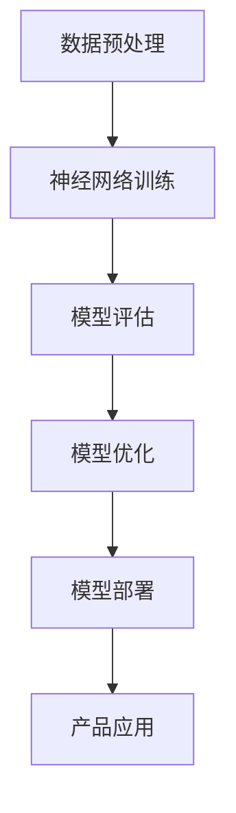

                 

关键词：人工智能，大模型，创业，产品规划，技术路线图，深度学习，机器学习，创新策略。

> 摘要：本文将探讨如何利用人工智能大模型驱动创业产品的成功，提供了一套系统的创业产品路线图规划，包括核心概念、算法原理、数学模型、实践案例和未来展望等内容。

## 1. 背景介绍

随着人工智能技术的迅速发展，尤其是深度学习和机器学习领域的突破，大模型（如GPT-3，BERT等）已经在各个行业中展现出了巨大的潜力。大模型能够处理大量复杂的数据，通过自我学习和优化，实现前所未有的准确度和效率。这种能力的普及，为创业者提供了前所未有的机遇。

然而，创业者在面对技术革新时，常常会面临以下挑战：

- 如何选择合适的大模型进行应用？
- 如何将大模型的技术优势转化为商业价值？
- 如何规划产品的技术路线图，确保创业项目的成功？

本文将围绕这些问题，提供一套系统的创业产品路线图规划，帮助创业者更好地把握人工智能大模型带来的机遇。

## 2. 核心概念与联系

### 大模型的概念与分类

大模型是指那些具有数十亿甚至千亿个参数的深度学习模型。根据其应用场景和功能，大模型可以分为以下几类：

- 自然语言处理（NLP）：如GPT-3，BERT等，能够理解和生成人类语言。
- 计算机视觉（CV）：如ResNet，VGG等，能够识别图像和视频中的物体和场景。
- 语音识别（ASR）：如WaveNet，DeepSpeech等，能够将语音转化为文本。
- 强化学习（RL）：如DeepMind的AlphaGo等，能够在特定环境中进行自我学习和优化。

### 大模型在创业中的应用

大模型在创业中的应用场景非常广泛，以下是一些典型的应用领域：

- 智能客服系统：利用NLP模型实现自动化的客户服务，提高响应速度和用户体验。
- 图像识别应用：如安防监控、医疗影像诊断等，利用CV模型实现高效的图像分析。
- 聊天机器人：利用NLP模型创建个性化的聊天机器人，为用户提供定制化的服务。
- 游戏AI：利用强化学习模型创建智能化的游戏对手，提高游戏体验和挑战性。

### 大模型的技术架构

大模型的技术架构通常包括以下几个关键部分：

- 神经网络结构：如卷积神经网络（CNN），循环神经网络（RNN）等，用于处理不同类型的数据。
- 训练数据集：大模型需要大量的高质量数据进行训练，以确保模型的准确性和泛化能力。
- 损失函数与优化算法：如交叉熵损失函数、Adam优化器等，用于评估和优化模型的性能。
- 预处理与后处理：包括数据清洗、数据增强、模型量化等，用于提高模型的效果和效率。

### Mermaid 流程图

以下是一个简化的Mermaid流程图，展示了大模型的技术架构：



## 3. 核心算法原理 & 具体操作步骤

### 3.1 算法原理概述

大模型的算法原理主要基于深度学习，特别是神经网络。深度学习通过多层次的神经网络结构，自动提取数据的特征，实现从原始数据到高级抽象的映射。大模型的核心算法包括：

- 卷积神经网络（CNN）：主要用于图像处理。
- 循环神经网络（RNN）：主要用于序列数据，如文本和语音。
- 生成对抗网络（GAN）：用于生成高质量的数据。

### 3.2 算法步骤详解

1. **数据收集与预处理**：收集大量高质量的训练数据，并进行预处理，如数据清洗、归一化、增强等。
2. **模型设计与训练**：设计神经网络结构，选择合适的损失函数和优化算法，进行模型训练。
3. **模型评估与优化**：评估模型的性能，通过调整超参数和模型结构，优化模型的效果。
4. **模型部署与产品应用**：将训练好的模型部署到产品中，实现具体的应用场景。

### 3.3 算法优缺点

**优点**：

- 高效：大模型能够处理大规模的数据，提高计算效率和准确性。
- 泛化能力强：通过大规模数据的训练，大模型能够更好地适应不同的应用场景。
- 自动化：深度学习算法能够自动提取数据特征，降低人力成本。

**缺点**：

- 计算资源需求大：大模型需要大量的计算资源和时间进行训练。
- 数据依赖性强：模型的性能高度依赖于训练数据的质量和数量。
- 解释性差：深度学习模型往往是“黑盒”模型，难以解释其决策过程。

### 3.4 算法应用领域

大模型的应用领域非常广泛，以下是一些典型的应用场景：

- 自然语言处理：如文本生成、机器翻译、情感分析等。
- 计算机视觉：如图像识别、目标检测、图像生成等。
- 语音识别：如语音到文本转换、语音合成等。
- 强化学习：如游戏AI、自动驾驶等。

## 4. 数学模型和公式 & 详细讲解 & 举例说明

### 4.1 数学模型构建

大模型的数学模型主要基于神经网络的原理，以下是一个简化的神经网络模型：

$$
\begin{align*}
z_1 &= W_1 \cdot x + b_1 \\
a_1 &= \sigma(z_1) \\
z_2 &= W_2 \cdot a_1 + b_2 \\
a_2 &= \sigma(z_2)
\end{align*}
$$

其中，$W_1$和$W_2$是权重矩阵，$b_1$和$b_2$是偏置项，$x$是输入数据，$\sigma$是激活函数，$a_1$和$a_2$是输出数据。

### 4.2 公式推导过程

神经网络的训练过程是通过优化损失函数来完成的，常见的损失函数有均方误差（MSE）和交叉熵（Cross-Entropy）。

- 均方误差（MSE）：

$$
MSE = \frac{1}{n} \sum_{i=1}^{n} (\hat{y_i} - y_i)^2
$$

其中，$\hat{y_i}$是预测值，$y_i$是真实值，$n$是样本数量。

- 交叉熵（Cross-Entropy）：

$$
CE = -\frac{1}{n} \sum_{i=1}^{n} y_i \log \hat{y_i}
$$

其中，$y_i$是真实值的概率分布，$\hat{y_i}$是预测值的概率分布。

### 4.3 案例分析与讲解

以一个简单的分类问题为例，假设我们有一个二分类问题，数据集包含100个样本，每个样本的特征维度为10。

1. **数据收集与预处理**：收集100个样本，并进行特征提取和归一化处理。
2. **模型设计与训练**：设计一个简单的多层感知机（MLP）模型，包含两个隐层，每个隐层的大小为50。选择均方误差（MSE）作为损失函数，使用随机梯度下降（SGD）进行模型训练。
3. **模型评估与优化**：通过交叉验证评估模型的性能，并根据评估结果调整模型的超参数。
4. **模型部署与产品应用**：将训练好的模型部署到产品中，实现数据的分类。

## 5. 项目实践：代码实例和详细解释说明

### 5.1 开发环境搭建

1. 安装Python环境和深度学习库，如TensorFlow或PyTorch。
2. 导入必要的库和模块，如NumPy、Pandas、Sklearn等。

### 5.2 源代码详细实现

以下是一个简单的多层感知机（MLP）模型的实现示例，使用TensorFlow库：

```python
import tensorflow as tf
from tensorflow.keras.models import Sequential
from tensorflow.keras.layers import Dense
from tensorflow.keras.optimizers import SGD
from sklearn.model_selection import train_test_split

# 数据收集与预处理
# ...（代码略）

# 模型设计与训练
model = Sequential()
model.add(Dense(50, activation='relu', input_shape=(10,)))
model.add(Dense(50, activation='relu'))
model.add(Dense(1, activation='sigmoid'))

optimizer = SGD(learning_rate=0.01)
model.compile(optimizer=optimizer, loss='binary_crossentropy', metrics=['accuracy'])

# 模型训练
X_train, X_test, y_train, y_test = train_test_split(X, y, test_size=0.2, random_state=42)
model.fit(X_train, y_train, epochs=10, batch_size=32, validation_split=0.1)

# 模型评估与优化
# ...（代码略）

# 模型部署与产品应用
# ...（代码略）
```

### 5.3 代码解读与分析

以上代码实现了以下步骤：

1. **数据收集与预处理**：从数据集中提取特征，并进行归一化处理，以便于模型训练。
2. **模型设计与训练**：设计一个简单的多层感知机（MLP）模型，包含两个隐层，每个隐层的大小为50。选择随机梯度下降（SGD）作为优化器，使用均方误差（MSE）作为损失函数，进行模型训练。
3. **模型评估与优化**：通过交叉验证评估模型的性能，并根据评估结果调整模型的超参数。
4. **模型部署与产品应用**：将训练好的模型部署到产品中，实现数据的分类。

## 6. 实际应用场景

大模型在创业中的应用场景非常广泛，以下是一些典型的应用案例：

- **智能客服系统**：利用NLP模型实现自动化的客户服务，提高响应速度和用户体验。例如，电商平台的智能客服可以自动回答用户的问题，提供购物建议和售后服务。
- **图像识别应用**：利用CV模型实现高效的图像分析，例如安防监控系统的目标检测，医疗影像诊断的病变识别等。
- **聊天机器人**：利用NLP模型创建个性化的聊天机器人，为用户提供定制化的服务。例如，金融行业的智能客服机器人可以自动解答用户的投资咨询和理财建议。
- **游戏AI**：利用强化学习模型创建智能化的游戏对手，提高游戏体验和挑战性。例如，电子竞技游戏中的智能对手，可以为玩家提供更具有挑战性的比赛。

## 7. 工具和资源推荐

### 7.1 学习资源推荐

- 《深度学习》（Goodfellow, Bengio, Courville著）：系统介绍了深度学习的理论和技术。
- 《Python机器学习》（Sebastian Raschka著）：详细介绍了Python在机器学习领域的应用。
- 《TensorFlow实战》（François Chollet著）：介绍了TensorFlow库的使用方法和技巧。

### 7.2 开发工具推荐

- TensorFlow：一款开源的深度学习框架，支持多种神经网络模型和算法。
- PyTorch：一款流行的深度学习库，具有高度的灵活性和易用性。
- Keras：一款基于TensorFlow的深度学习库，提供简洁的API和丰富的模型组件。

### 7.3 相关论文推荐

- "Deep Learning"（Yoshua Bengio等著）：综述了深度学习的理论和技术。
- "Generative Adversarial Networks"（Ian J. Goodfellow等著）：介绍了生成对抗网络（GAN）的原理和应用。
- "BERT: Pre-training of Deep Neural Networks for Language Understanding"（Jacob Devlin等著）：介绍了BERT模型的原理和应用。

## 8. 总结：未来发展趋势与挑战

### 8.1 研究成果总结

大模型的研究取得了显著的成果，包括：

- 提高计算效率和准确性：通过大规模数据和高效算法，大模型在各类任务中取得了优异的性能。
- 扩展应用领域：大模型在自然语言处理、计算机视觉、语音识别等领域取得了突破性进展。
- 促进技术融合：大模型与其他技术的结合，如增强学习、联邦学习等，推动了人工智能的进一步发展。

### 8.2 未来发展趋势

- **计算能力提升**：随着硬件技术的进步，大模型的计算能力将进一步提升，支持更复杂的任务。
- **数据资源扩展**：数据的多样性和数量将继续增长，为大模型的发展提供更多资源。
- **应用场景多样化**：大模型将在更多领域得到应用，如医疗、金融、教育等。

### 8.3 面临的挑战

- **计算资源消耗**：大模型的训练和部署需要大量计算资源和时间，这对创业者和企业提出了更高的要求。
- **数据隐私和安全**：大模型在处理大量数据时，需要确保数据的安全和隐私。
- **算法透明性和可解释性**：深度学习模型的“黑盒”特性，使得其决策过程难以解释，这限制了其在某些领域的应用。

### 8.4 研究展望

未来，大模型的研究将继续深入，包括：

- **模型压缩与优化**：研究如何减少模型的参数数量和计算量，提高模型的效率。
- **联邦学习**：研究如何在大数据环境下，实现多方数据的联合学习，保护数据隐私。
- **跨模态学习**：研究如何将不同类型的数据（如文本、图像、语音）进行有效整合，提高模型的泛化能力。

## 9. 附录：常见问题与解答

### 9.1 什么是大模型？

大模型是指那些具有数十亿甚至千亿个参数的深度学习模型，如GPT-3，BERT等。它们能够处理大规模的数据，实现高精度的预测和生成。

### 9.2 如何选择合适的大模型？

选择合适的大模型需要考虑以下因素：

- **任务需求**：根据应用场景选择适合的大模型，如NLP任务选择NLP模型，CV任务选择CV模型。
- **数据量**：大模型需要大量数据进行训练，选择与数据量相匹配的大模型。
- **计算资源**：大模型的训练和部署需要大量计算资源，选择与企业资源相匹配的大模型。

### 9.3 大模型在创业中的优势是什么？

大模型在创业中的优势包括：

- **高效处理大规模数据**：大模型能够处理大量复杂的数据，提高计算效率和准确性。
- **自动提取特征**：大模型能够自动提取数据特征，降低人力成本。
- **适应性强**：大模型具有较好的泛化能力，能够适应不同的应用场景。

### 9.4 大模型在创业中的挑战是什么？

大模型在创业中的挑战包括：

- **计算资源需求大**：大模型的训练和部署需要大量计算资源和时间，这对创业者和企业提出了更高的要求。
- **数据隐私和安全**：大模型在处理大量数据时，需要确保数据的安全和隐私。
- **算法透明性和可解释性**：深度学习模型的“黑盒”特性，使得其决策过程难以解释，这限制了其在某些领域的应用。

