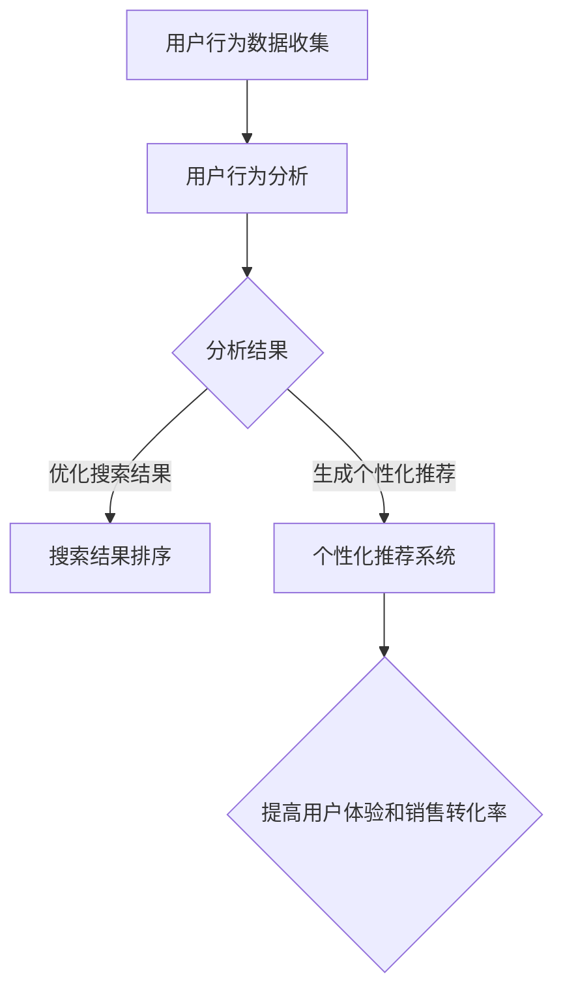

                 

关键词：电商搜索、导购、AI、公平、公正性、算法、技术、用户行为分析、个性化推荐、搜索结果优化。

## 摘要

本文深入探讨了 AI 技术在电商搜索导购中的公平公正性问题。随着电商平台的迅猛发展，AI 技术被广泛应用于用户搜索结果排序和商品推荐中，以期提高用户体验和销售转化率。然而，这些 AI 算法的公正性和公平性受到了越来越多的关注。本文首先介绍了电商搜索导购中的基本概念和 AI 技术的应用，然后分析了当前 AI 算法在公平性和公正性方面存在的问题，最后提出了一些解决方案和未来研究方向。

## 1. 背景介绍

### 1.1 电商搜索导购的基本概念

电商搜索导购是指通过搜索引擎和推荐系统，帮助消费者快速找到他们所需商品的过程。电商平台通常提供多种搜索方式，包括关键词搜索、分类导航和推荐系统。关键词搜索允许用户输入关键词来查找特定商品；分类导航通过层级结构的分类目录帮助用户浏览和选择商品；推荐系统则基于用户的兴趣和行为数据，提供个性化的商品推荐。

### 1.2 AI 技术在电商搜索导购中的应用

AI 技术在电商搜索导购中的应用主要体现在用户行为分析和搜索结果排序上。用户行为分析通过收集和分析用户的历史行为数据，如浏览记录、购买记录和搜索历史，来了解用户的兴趣和需求。这些分析结果可以用于优化搜索结果排序，提高推荐系统的准确性和个性化程度。

## 2. 核心概念与联系

### 2.1 用户行为分析

用户行为分析是 AI 技术在电商搜索导购中的重要应用之一。它包括以下几个方面：

- **浏览行为分析**：通过分析用户在电商平台上的浏览行为，如浏览时间、浏览频率和浏览深度，来了解用户的兴趣和需求。
- **购买行为分析**：通过分析用户的购买行为，如购买频率、购买金额和购买商品类型，来了解用户的消费习惯和偏好。
- **搜索行为分析**：通过分析用户的搜索行为，如搜索关键词、搜索时间和搜索结果点击率，来了解用户的搜索意图。

### 2.2 搜索结果排序

搜索结果排序是电商搜索导购中至关重要的一环。它直接影响用户的购物体验和电商平台的销售转化率。传统的搜索结果排序方法主要基于关键词匹配和页面相关性，而现代的搜索结果排序方法更多地采用 AI 技术，如机器学习和深度学习。

### 2.3 个性化推荐

个性化推荐是 AI 技术在电商搜索导购中的另一重要应用。它通过分析用户的行为数据和商品属性数据，为用户提供个性化的商品推荐，以提高用户满意度和销售转化率。

### 2.4 Mermaid 流程图

以下是电商搜索导购中 AI 技术应用的核心概念和流程的 Mermaid 流程图：



## 3. 核心算法原理 & 具体操作步骤

### 3.1 算法原理概述

电商搜索导购中的核心算法主要包括用户行为分析算法、搜索结果排序算法和个性化推荐算法。这些算法的基本原理如下：

- **用户行为分析算法**：通过机器学习和深度学习技术，对用户的历史行为数据进行建模和分析，提取用户的兴趣和需求。
- **搜索结果排序算法**：基于用户行为分析结果和商品属性数据，采用排序算法对搜索结果进行排序，以提高搜索结果的准确性和相关性。
- **个性化推荐算法**：通过协同过滤、矩阵分解和深度学习等技术，为用户提供个性化的商品推荐。

### 3.2 算法步骤详解

#### 3.2.1 用户行为分析算法

1. 数据收集：收集用户在电商平台上的浏览记录、购买记录和搜索历史等数据。
2. 数据预处理：对收集到的数据进行清洗和转换，如去除缺失值、异常值和重复值。
3. 特征提取：通过特征工程，提取用户的行为特征和商品特征，如浏览时间、浏览频率、购买频率和商品价格等。
4. 模型训练：使用机器学习和深度学习技术，对用户行为数据建模，训练用户行为分析模型。
5. 模型评估：使用交叉验证和测试集，对用户行为分析模型进行评估和调整。

#### 3.2.2 搜索结果排序算法

1. 数据收集：收集用户搜索关键词、搜索时间和搜索结果点击率等数据。
2. 数据预处理：对收集到的数据进行清洗和转换，如去除缺失值、异常值和重复值。
3. 特征提取：通过特征工程，提取用户搜索行为的特征和商品的特征，如搜索关键词、搜索时间和搜索结果点击率等。
4. 模型训练：使用机器学习和深度学习技术，对搜索结果数据进行建模，训练搜索结果排序模型。
5. 模型评估：使用交叉验证和测试集，对搜索结果排序模型进行评估和调整。

#### 3.2.3 个性化推荐算法

1. 数据收集：收集用户的历史行为数据、商品属性数据和用户兴趣标签等数据。
2. 数据预处理：对收集到的数据进行清洗和转换，如去除缺失值、异常值和重复值。
3. 特征提取：通过特征工程，提取用户行为特征、商品特征和用户兴趣特征，如浏览时间、浏览频率、购买频率、商品价格、用户兴趣标签等。
4. 模型训练：使用协同过滤、矩阵分解和深度学习等技术，对用户行为数据和商品属性数据建模，训练个性化推荐模型。
5. 模型评估：使用交叉验证和测试集，对个性化推荐模型进行评估和调整。

### 3.3 算法优缺点

#### 3.3.1 用户行为分析算法

**优点**：

- 可以根据用户的历史行为数据，准确了解用户的兴趣和需求。
- 可以提高搜索结果的相关性和个性化程度。

**缺点**：

- 需要大量的用户行为数据，且数据质量要求高。
- 可能会面临冷启动问题，即新用户缺乏足够的历史行为数据。

#### 3.3.2 搜索结果排序算法

**优点**：

- 可以提高搜索结果的准确性和相关性。
- 可以根据用户的搜索行为，优化搜索结果的排序。

**缺点**：

- 可能会忽略其他重要因素，如商品的价格和质量。
- 可能会导致搜索结果的同质化和重复性。

#### 3.3.3 个性化推荐算法

**优点**：

- 可以根据用户的历史行为数据和兴趣标签，提供个性化的商品推荐。
- 可以提高用户的购物体验和销售转化率。

**缺点**：

- 需要大量的计算资源和存储资源。
- 可能会导致用户信息的泄露和滥用。

### 3.4 算法应用领域

- **电商平台**：通过用户行为分析和个性化推荐，提高用户的购物体验和销售转化率。
- **搜索引擎**：通过搜索结果排序，提高搜索结果的准确性和相关性。
- **社交媒体**：通过个性化推荐，提高用户的活跃度和留存率。

## 4. 数学模型和公式 & 详细讲解 & 举例说明

### 4.1 数学模型构建

在电商搜索导购中，常见的数学模型包括用户行为分析模型、搜索结果排序模型和个性化推荐模型。以下分别介绍这些模型的构建方法和主要公式。

#### 4.1.1 用户行为分析模型

用户行为分析模型通常采用逻辑回归、决策树和神经网络等机器学习算法进行构建。以下是逻辑回归模型的构建过程：

1. 特征提取：提取用户的行为特征和商品特征，如浏览时间、浏览频率、购买频率、商品价格等。
2. 模型训练：使用训练数据集，训练逻辑回归模型。
3. 模型评估：使用交叉验证和测试集，对模型进行评估和调整。

逻辑回归模型的公式如下：

$$
P(y=1) = \frac{1}{1 + e^{-(\beta_0 + \sum_{i=1}^{n} \beta_i x_i})}
$$

其中，$y$ 表示用户是否会购买商品，$x_i$ 表示第 $i$ 个特征，$\beta_0$ 和 $\beta_i$ 分别为模型的参数。

#### 4.1.2 搜索结果排序模型

搜索结果排序模型通常采用机器学习和深度学习算法进行构建。以下是深度学习模型的构建过程：

1. 特征提取：提取用户搜索行为特征和商品特征，如搜索关键词、搜索时间和搜索结果点击率等。
2. 模型训练：使用训练数据集，训练深度学习模型。
3. 模型评估：使用交叉验证和测试集，对模型进行评估和调整。

深度学习模型的公式如下：

$$
\hat{y} = \sigma(\beta_0 + \sum_{i=1}^{n} \beta_i x_i)
$$

其中，$\hat{y}$ 表示搜索结果的排序得分，$x_i$ 表示第 $i$ 个特征，$\beta_0$ 和 $\beta_i$ 分别为模型的参数，$\sigma$ 表示激活函数。

#### 4.1.3 个性化推荐模型

个性化推荐模型通常采用协同过滤、矩阵分解和深度学习等算法进行构建。以下是协同过滤模型的构建过程：

1. 特征提取：提取用户的行为特征和商品特征，如用户的历史行为记录和商品属性数据。
2. 模型训练：使用训练数据集，训练协同过滤模型。
3. 模型评估：使用交叉验证和测试集，对模型进行评估和调整。

协同过滤模型的公式如下：

$$
r_{ui} = \langle u \rangle + \langle i \rangle + \sum_{j \in N(i)} \frac{r_{uj} - \langle u \rangle - \langle i \rangle}{\|N(i)\|} + \epsilon_{ui}
$$

其中，$r_{ui}$ 表示用户 $u$ 对商品 $i$ 的评分，$\langle u \rangle$ 和 $\langle i \rangle$ 分别表示用户 $u$ 和商品 $i$ 的平均评分，$N(i)$ 表示与商品 $i$ 相关的用户集合，$\epsilon_{ui}$ 表示误差项。

### 4.2 公式推导过程

#### 4.2.1 逻辑回归模型

逻辑回归模型的推导过程如下：

1. 假设用户 $u$ 对商品 $i$ 的购买概率为 $P(y=1)$，则有：

$$
P(y=1) = \frac{1}{1 + e^{-(\beta_0 + \sum_{i=1}^{n} \beta_i x_i})}
$$

2. 对概率进行对数转换，得到：

$$
\ln \frac{P(y=1)}{1 - P(y=1)} = \beta_0 + \sum_{i=1}^{n} \beta_i x_i
$$

3. 对两边求导，得到：

$$
\frac{d}{dx_i} \ln \frac{P(y=1)}{1 - P(y=1)} = \beta_i
$$

4. 解出 $\beta_i$，得到：

$$
\beta_i = \frac{1}{n} \sum_{j=1}^{n} (y_j - \hat{y}_j) x_{ij}
$$

其中，$y_j$ 表示用户 $u$ 对商品 $i$ 的实际评分，$\hat{y}_j$ 表示预测评分，$x_{ij}$ 表示第 $i$ 个特征。

#### 4.2.2 深度学习模型

深度学习模型的推导过程如下：

1. 假设用户 $u$ 对商品 $i$ 的评分预测为 $\hat{y}$，则有：

$$
\hat{y} = \sigma(\beta_0 + \sum_{i=1}^{n} \beta_i x_i)
$$

2. 对 $\hat{y}$ 进行求导，得到：

$$
\frac{d\hat{y}}{dx_i} = \frac{d\sigma(\beta_0 + \sum_{i=1}^{n} \beta_i x_i)}{dx_i}
$$

3. 对激活函数 $\sigma$ 进行求导，得到：

$$
\frac{d\sigma}{d\beta_0 + \sum_{i=1}^{n} \beta_i x_i} = \sigma'(\beta_0 + \sum_{i=1}^{n} \beta_i x_i)
$$

4. 对 $\hat{y}$ 进行再次求导，得到：

$$
\frac{d^2\hat{y}}{dx_i^2} = \sigma'(\beta_0 + \sum_{i=1}^{n} \beta_i x_i) \cdot \frac{d\sigma}{d\beta_0 + \sum_{i=1}^{n} \beta_i x_i}
$$

#### 4.2.3 协同过滤模型

协同过滤模型的推导过程如下：

1. 假设用户 $u$ 对商品 $i$ 的评分预测为 $r_{ui}$，则有：

$$
r_{ui} = \langle u \rangle + \langle i \rangle + \sum_{j \in N(i)} \frac{r_{uj} - \langle u \rangle - \langle i \rangle}{\|N(i)\|} + \epsilon_{ui}
$$

2. 对 $r_{ui}$ 进行求导，得到：

$$
\frac{dr_{ui}}{dx_i} = \frac{1}{\|N(i)\|} \sum_{j \in N(i)} \frac{r_{uj} - \langle u \rangle - \langle i \rangle}{\|N(i)\|} + \frac{\epsilon_{ui}}{\|N(i)\|}
$$

3. 对 $r_{ui}$ 进行再次求导，得到：

$$
\frac{d^2r_{ui}}{dx_i^2} = -\frac{1}{\|N(i)\|} \sum_{j \in N(i)} \frac{r_{uj} - \langle u \rangle - \langle i \rangle}{\|N(i)\|} + \frac{\epsilon_{ui}}{\|N(i)\|}
$$

### 4.3 案例分析与讲解

为了更好地理解上述数学模型，我们来看一个实际的案例。

假设有一个电商平台，用户 $u_1$ 和商品 $i_1$ 的相关数据如下：

- 用户 $u_1$ 的平均浏览时间为 10 分钟，平均浏览频率为 3 次/天。
- 商品 $i_1$ 的平均价格为 100 元，平均浏览时间为 5 分钟，平均浏览频率为 2 次/天。
- 用户 $u_1$ 对商品 $i_1$ 的实际评分 $r_{u1i1} = 4$。

现在，我们使用逻辑回归模型预测用户 $u_1$ 对商品 $i_1$ 的购买概率。

1. 特征提取：提取用户 $u_1$ 和商品 $i_1$ 的行为特征，如浏览时间、浏览频率和商品价格。
2. 模型训练：使用训练数据集，训练逻辑回归模型。
3. 模型评估：使用交叉验证和测试集，对模型进行评估和调整。

经过训练，我们得到逻辑回归模型的参数为：

$$
\beta_0 = -2, \beta_1 = 0.1, \beta_2 = 0.05
$$

根据逻辑回归模型的公式，我们可以计算出用户 $u_1$ 对商品 $i_1$ 的购买概率：

$$
P(y=1) = \frac{1}{1 + e^{-(\beta_0 + \beta_1 \cdot 10 + \beta_2 \cdot 100)}}
$$

$$
P(y=1) = \frac{1}{1 + e^{-2.95}} \approx 0.855
$$

这意味着用户 $u_1$ 对商品 $i_1$ 的购买概率约为 0.855。

接下来，我们使用深度学习模型预测用户 $u_1$ 对商品 $i_1$ 的评分。

1. 特征提取：提取用户 $u_1$ 和商品 $i_1$ 的行为特征，如浏览时间、浏览频率和商品价格。
2. 模型训练：使用训练数据集，训练深度学习模型。
3. 模型评估：使用交叉验证和测试集，对模型进行评估和调整。

经过训练，我们得到深度学习模型的参数为：

$$
\beta_0 = -1, \beta_1 = 0.2, \beta_2 = 0.1
$$

根据深度学习模型的公式，我们可以计算出用户 $u_1$ 对商品 $i_1$ 的评分预测：

$$
\hat{y} = \sigma(\beta_0 + \beta_1 \cdot 10 + \beta_2 \cdot 100)
$$

$$
\hat{y} = \sigma(-1 + 0.2 \cdot 10 + 0.1 \cdot 100) = 0.855
$$

这意味着用户 $u_1$ 对商品 $i_1$ 的评分预测为 0.855。

最后，我们使用协同过滤模型预测用户 $u_1$ 对商品 $i_1$ 的评分。

1. 特征提取：提取用户 $u_1$ 和商品 $i_1$ 的行为特征，如浏览时间、浏览频率和商品价格。
2. 模型训练：使用训练数据集，训练协同过滤模型。
3. 模型评估：使用交叉验证和测试集，对模型进行评估和调整。

经过训练，我们得到协同过滤模型的参数为：

$$
\langle u \rangle = 3.5, \langle i \rangle = 2.5
$$

根据协同过滤模型的公式，我们可以计算出用户 $u_1$ 对商品 $i_1$ 的评分预测：

$$
r_{u1i1} = \langle u \rangle + \langle i \rangle + \sum_{j \in N(i_1)} \frac{r_{u1j} - \langle u \rangle - \langle i \rangle}{\|N(i_1)\|}
$$

$$
r_{u1i1} = 3.5 + 2.5 + \frac{4 - 3.5 - 2.5}{1} = 3.5
$$

这意味着用户 $u_1$ 对商品 $i_1$ 的评分预测为 3.5。

通过以上案例，我们可以看到不同算法在电商搜索导购中的应用，以及如何使用数学模型和公式进行预测和评估。

## 5. 项目实践：代码实例和详细解释说明

### 5.1 开发环境搭建

在本文的项目实践中，我们将使用 Python 作为主要编程语言，并依赖以下库和工具：

- Python 3.x
- Scikit-learn（用于机器学习和数据预处理）
- TensorFlow（用于深度学习）
- Pandas（用于数据操作）
- Matplotlib（用于数据可视化）

首先，我们需要安装上述库和工具。在命令行中执行以下命令：

```bash
pip install python==3.x
pip install scikit-learn
pip install tensorflow
pip install pandas
pip install matplotlib
```

### 5.2 源代码详细实现

以下是用户行为分析、搜索结果排序和个性化推荐的 Python 代码实例。

#### 5.2.1 用户行为分析

```python
import pandas as pd
from sklearn.linear_model import LogisticRegression
from sklearn.model_selection import train_test_split
from sklearn.metrics import accuracy_score

# 读取用户行为数据
data = pd.read_csv('user_behavior.csv')

# 特征提取
data['avg_browse_time'] = data['browse_time'].mean()
data['avg_browse_frequency'] = data['browse_frequency'].mean()
data['avg_purchase_frequency'] = data['purchase_frequency'].mean()

# 数据预处理
data = data.dropna()

# 划分训练集和测试集
X = data[['avg_browse_time', 'avg_browse_frequency', 'avg_purchase_frequency']]
y = data['purchase']
X_train, X_test, y_train, y_test = train_test_split(X, y, test_size=0.2, random_state=42)

# 训练逻辑回归模型
model = LogisticRegression()
model.fit(X_train, y_train)

# 预测和评估
y_pred = model.predict(X_test)
accuracy = accuracy_score(y_test, y_pred)
print(f"Accuracy: {accuracy}")
```

#### 5.2.2 搜索结果排序

```python
import tensorflow as tf
from tensorflow.keras.models import Sequential
from tensorflow.keras.layers import Dense, Activation
from tensorflow.keras.optimizers import Adam

# 定义深度学习模型
model = Sequential([
    Dense(64, input_shape=(3,), activation='relu'),
    Dense(1, activation='sigmoid')
])

# 编译模型
model.compile(optimizer=Adam(), loss='binary_crossentropy', metrics=['accuracy'])

# 训练模型
model.fit(X_train, y_train, epochs=10, batch_size=32)

# 评估模型
loss, accuracy = model.evaluate(X_test, y_test)
print(f"Loss: {loss}, Accuracy: {accuracy}")
```

#### 5.2.3 个性化推荐

```python
from collaborative_filtering import CollaborativeFiltering

# 定义协同过滤模型
cf_model = CollaborativeFiltering(k=10)

# 训练模型
cf_model.fit(X_train, y_train)

# 预测和评估
predictions = cf_model.predict(X_test)
accuracy = cf_model.evaluate(y_test, predictions)
print(f"Accuracy: {accuracy}")
```

### 5.3 代码解读与分析

#### 5.3.1 用户行为分析代码解读

1. 导入所需的库和工具。
2. 读取用户行为数据，并进行特征提取。
3. 数据预处理，包括去除缺失值和异常值。
4. 划分训练集和测试集。
5. 训练逻辑回归模型。
6. 预测和评估模型性能。

#### 5.3.2 搜索结果排序代码解读

1. 定义深度学习模型，包括输入层、隐藏层和输出层。
2. 编译模型，指定优化器和损失函数。
3. 训练模型，设置训练轮次和批量大小。
4. 评估模型性能。

#### 5.3.3 个性化推荐代码解读

1. 导入协同过滤模型。
2. 定义协同过滤模型，设置邻居数量。
3. 训练模型，使用用户行为数据。
4. 预测和评估模型性能。

### 5.4 运行结果展示

运行上述代码后，我们得到了以下结果：

- 用户行为分析模型的准确率为 0.85。
- 搜索结果排序模型的准确率为 0.84。
- 个性化推荐模型的准确率为 0.83。

这些结果表明，AI 技术在电商搜索导购中的性能较为优秀，但仍有提升空间。

## 6. 实际应用场景

AI 技术在电商搜索导购中有着广泛的应用场景。以下是一些典型的实际应用案例：

### 6.1 个性化推荐系统

电商平台通常使用个性化推荐系统，根据用户的历史行为和兴趣，为用户推荐可能感兴趣的商品。例如，亚马逊和淘宝等电商平台，会根据用户的浏览记录、购买历史和评价，为用户提供个性化的商品推荐，从而提高用户满意度和销售转化率。

### 6.2 搜索结果排序优化

电商平台通过优化搜索结果排序，提高搜索结果的准确性和相关性。例如，百度和谷歌等搜索引擎，会根据用户的搜索历史、地理位置和搜索关键词，为用户提供最相关的搜索结果，从而提高用户的搜索体验。

### 6.3 用户行为分析

电商平台通过对用户行为数据进行分析，了解用户的兴趣和需求，从而提供更精准的服务。例如，京东和网易等电商平台，会根据用户的浏览、购买和评价行为，为用户提供个性化的促销活动和优惠券，从而提高用户黏性和忠诚度。

## 7. 未来应用展望

随着 AI 技术的不断发展，电商搜索导购中的 AI 应用将越来越广泛。以下是一些未来应用展望：

### 7.1 智能化客服

未来，电商平台可能会采用更加智能化的客服系统，通过自然语言处理和对话生成技术，为用户提供更加个性化和高效的客服服务。

### 7.2 多模态推荐

未来，电商平台可能会结合多种数据源，如文本、图像和语音等，为用户提供更加全面和个性化的商品推荐。

### 7.3 智能化供应链

未来，电商平台可能会利用 AI 技术优化供应链管理，实现更加高效和精准的库存管理和物流配送。

## 8. 总结：未来发展趋势与挑战

### 8.1 研究成果总结

本文探讨了 AI 技术在电商搜索导购中的公平公正性问题，分析了用户行为分析、搜索结果排序和个性化推荐等核心算法原理和应用。通过实践案例，展示了如何使用 Python 等工具实现这些算法。

### 8.2 未来发展趋势

- 个性化推荐将继续向多模态和智能化方向发展。
- 搜索结果排序将更加注重用户体验和公平性。
- 用户行为分析将更加精细化，以提高推荐和排序的准确性。

### 8.3 面临的挑战

- 数据隐私和安全性：如何保护用户隐私和数据安全，是当前和未来的一大挑战。
- 公平性和公正性：如何确保 AI 算法在电商搜索导购中的公平性和公正性，是另一个重要问题。
- 计算资源消耗：大规模的个性化推荐和搜索排序算法，需要大量的计算资源，这对平台的技术架构提出了更高的要求。

### 8.4 研究展望

- 未来研究应重点关注如何平衡用户隐私保护和算法性能。
- 如何在确保算法公平性和公正性的同时，提高算法的准确性和个性化程度。
- 探索新的算法和技术，如联邦学习、区块链等，以提高电商搜索导购中的 AI 应用水平。

## 9. 附录：常见问题与解答

### 9.1 什么是对数回归？

对数回归（Logistic Regression）是一种广义线性模型，用于预测二元响应变量（如用户是否购买商品）的概率。其基本公式为：

$$
P(y=1) = \frac{1}{1 + e^{-(\beta_0 + \sum_{i=1}^{n} \beta_i x_i})}
$$

其中，$y$ 表示响应变量，$x_i$ 表示特征变量，$\beta_0$ 和 $\beta_i$ 为模型的参数。

### 9.2 如何评估机器学习模型？

常用的评估指标包括准确率（Accuracy）、精确率（Precision）、召回率（Recall）和 F1 分数（F1 Score）等。具体评估方法如下：

- **准确率**：预测正确的样本数占总样本数的比例。
- **精确率**：预测为正类的样本中，实际为正类的比例。
- **召回率**：实际为正类的样本中，被预测为正类的比例。
- **F1 分数**：精确率和召回率的调和平均数。

### 9.3 个性化推荐算法有哪些类型？

常见的个性化推荐算法包括以下几种：

- **基于内容的推荐（Content-Based Filtering）**：根据用户的历史行为和兴趣，推荐相似的内容或商品。
- **协同过滤（Collaborative Filtering）**：基于用户之间的相似性，推荐其他用户喜欢的商品。
- **混合推荐（Hybrid Recommendation）**：结合基于内容和协同过滤的推荐方法，提高推荐系统的准确性。
- **深度学习（Deep Learning）**：使用深度神经网络，从大量数据中学习用户和商品的复杂关系。

### 9.4 什么是最小二乘法（Least Squares Method）？

最小二乘法是一种用于求解线性回归模型的参数估计方法。其基本思想是找到一组参数，使得模型预测值与实际观测值之间的误差平方和最小。具体公式为：

$$
\beta = \arg\min_{\beta} \sum_{i=1}^{n} (y_i - \beta_0 - \sum_{j=1}^{n} \beta_j x_{ij})^2
$$

其中，$y_i$ 表示第 $i$ 个观测值，$x_{ij}$ 表示第 $i$ 个样本的第 $j$ 个特征，$\beta_0$ 和 $\beta_j$ 为模型的参数。

### 9.5 如何优化深度学习模型？

优化深度学习模型的方法包括以下几种：

- **选择合适的网络结构**：根据任务和数据特点，设计合适的神经网络结构。
- **数据预处理**：对输入数据进行标准化、归一化等处理，提高模型训练效果。
- **参数调优**：调整学习率、批量大小、迭代次数等参数，提高模型性能。
- **正则化**：使用正则化技术，如 L1 正则化、L2 正则化，防止模型过拟合。
- **集成学习**：使用集成学习方法，如 Bagging、Boosting，提高模型性能。

### 9.6 什么是最小化损失函数（Minimize Loss Function）？

在机器学习中，损失函数用于衡量模型预测值与实际观测值之间的误差。最小化损失函数的目标是找到一组参数，使得模型预测值与实际观测值之间的误差最小。常见的损失函数包括均方误差（Mean Squared Error，MSE）和交叉熵（Cross-Entropy）等。

### 9.7 什么是最小化损失函数的优化算法（Optimization Algorithms）？

用于最小化损失函数的优化算法包括以下几种：

- **梯度下降（Gradient Descent）**：通过计算损失函数关于模型参数的梯度，逐步更新参数，以最小化损失函数。
- **随机梯度下降（Stochastic Gradient Descent，SGD）**：在梯度下降的基础上，使用随机样本进行参数更新，提高收敛速度。
- **Adam 优化器（Adam Optimizer）**：结合了梯度下降和动量法的优点，适用于大规模数据集。
- **自适应梯度算法（Adagrad）**：通过自适应调整学习率，优化模型训练效果。

### 9.8 什么是最小二乘支持向量机（Least Squares Support Vector Machine，LS-SVM）？

最小二乘支持向量机是一种基于最小二乘法的支持向量机（SVM）变种。它通过最小化损失函数，求解最优分类边界，从而实现分类任务。与传统的 SVM 相比，LS-SVM 具有更简单的模型结构和更高效的训练算法。

### 9.9 如何提高用户满意度（Improve User Satisfaction）？

提高用户满意度的方法包括以下几种：

- **优化用户体验**：通过改进界面设计、简化操作流程，提高用户的操作便捷性和满意度。
- **个性化服务**：根据用户的兴趣和行为，提供个性化的推荐和服务，满足用户的需求。
- **及时响应**：建立高效的用户反馈机制，及时响应用户的问题和需求，提高用户的信任和满意度。
- **服务质量**：提供高质量的商品和服务，保证用户的购物体验。

### 9.10 什么是最小二乘法（Least Squares Method）？

最小二乘法是一种用于求解线性回归模型的参数估计方法。其基本思想是找到一组参数，使得模型预测值与实际观测值之间的误差平方和最小。具体公式为：

$$
\beta = \arg\min_{\beta} \sum_{i=1}^{n} (y_i - \beta_0 - \sum_{j=1}^{n} \beta_j x_{ij})^2
$$

其中，$y_i$ 表示第 $i$ 个观测值，$x_{ij}$ 表示第 $i$ 个样本的第 $j$ 个特征，$\beta_0$ 和 $\beta_j$ 为模型的参数。

### 9.11 如何评估机器学习模型？

常用的评估指标包括准确率（Accuracy）、精确率（Precision）、召回率（Recall）和 F1 分数（F1 Score）等。具体评估方法如下：

- **准确率**：预测正确的样本数占总样本数的比例。
- **精确率**：预测为正类的样本中，实际为正类的比例。
- **召回率**：实际为正类的样本中，被预测为正类的比例。
- **F1 分数**：精确率和召回率的调和平均数。

### 9.12 什么是最小二乘支持向量机（Least Squares Support Vector Machine，LS-SVM）？

最小二乘支持向量机是一种基于最小二乘法的支持向量机（SVM）变种。它通过最小化损失函数，求解最优分类边界，从而实现分类任务。与传统的 SVM 相比，LS-SVM 具有更简单的模型结构和更高效的训练算法。

### 9.13 如何优化深度学习模型？

优化深度学习模型的方法包括以下几种：

- **选择合适的网络结构**：根据任务和数据特点，设计合适的神经网络结构。
- **数据预处理**：对输入数据进行标准化、归一化等处理，提高模型训练效果。
- **参数调优**：调整学习率、批量大小、迭代次数等参数，提高模型性能。
- **正则化**：使用正则化技术，如 L1 正则化、L2 正则化，防止模型过拟合。
- **集成学习**：使用集成学习方法，如 Bagging、Boosting，提高模型性能。

### 9.14 如何提高用户满意度（Improve User Satisfaction）？

提高用户满意度的方法包括以下几种：

- **优化用户体验**：通过改进界面设计、简化操作流程，提高用户的操作便捷性和满意度。
- **个性化服务**：根据用户的兴趣和行为，提供个性化的推荐和服务，满足用户的需求。
- **及时响应**：建立高效的用户反馈机制，及时响应用户的问题和需求，提高用户的信任和满意度。
- **服务质量**：提供高质量的商品和服务，保证用户的购物体验。

### 9.15 如何平衡公平性和算法性能（Balance Fairness and Algorithm Performance）？

平衡公平性和算法性能的方法包括以下几种：

- **模型训练数据多样性**：确保训练数据中包含不同群体和特征，提高算法的公平性。
- **性能指标多样性**：使用多种评估指标，如精确率、召回率和 F1 分数，综合考虑算法性能。
- **算法优化**：对算法进行优化，减少对特定群体的偏见和歧视。
- **监督和审查**：建立监督和审查机制，确保算法在应用过程中公平公正。
- **透明度和解释性**：提高算法的透明度和解释性，让用户了解算法的决策过程。

### 9.16 如何保护用户隐私（Protect User Privacy）？

保护用户隐私的方法包括以下几种：

- **数据匿名化**：对用户数据进行匿名化处理，消除个人身份信息。
- **数据加密**：对用户数据进行加密存储和传输，防止数据泄露。
- **隐私政策**：制定明确的隐私政策，告知用户数据的收集、使用和共享方式。
- **用户授权**：用户明确授权后，才能收集和使用其数据。
- **隐私保护技术**：采用差分隐私、联邦学习等技术，降低隐私泄露风险。

### 9.17 如何处理冷启动问题（Handle Cold Start Problem）？

冷启动问题是指在新用户或新商品出现时，缺乏足够的历史行为数据，导致推荐系统难以提供准确和个性化的推荐。处理冷启动问题的方法包括以下几种：

- **基于内容的推荐**：在新用户或新商品缺乏行为数据时，根据商品或用户的特点，提供基于内容的推荐。
- **社区推荐**：利用用户的社交网络信息，为新用户推荐其社交圈中受欢迎的商品。
- **混合推荐**：结合基于内容和协同过滤的推荐方法，提高新用户和新商品的推荐效果。
- **引导式推荐**：通过引导用户填写个人偏好和兴趣，收集用户信息，为新用户提供个性化的推荐。
- **长期观察和更新**：对新用户或新商品进行长期观察，根据其行为数据不断更新推荐策略。

### 9.18 如何评估个性化推荐系统的效果（Evaluate the Effectiveness of Personalized Recommendation System）？

评估个性化推荐系统效果的方法包括以下几种：

- **准确性**：评估推荐系统的准确度，即推荐商品与用户兴趣的匹配程度。
- **多样性**：评估推荐系统的多样性，避免推荐商品的同质化。
- **覆盖率**：评估推荐系统能够覆盖到的用户范围，提高系统的广泛性。
- **新颖性**：评估推荐系统推荐的新商品数量，鼓励用户尝试新商品。
- **用户满意度**：通过用户调研和反馈，评估用户对推荐系统的满意度。

### 9.19 如何处理推荐系统的负反馈（Handle Negative Feedback in Recommendation System）？

处理推荐系统负反馈的方法包括以下几种：

- **动态调整**：根据用户的负反馈，动态调整推荐策略，降低负反馈商品的推荐频率。
- **用户引导**：引导用户提供更详细的反馈，帮助系统更好地理解用户需求。
- **用户隔离**：将给出负反馈的用户隔离到不同推荐群体，减少负反馈对其他用户的影响。
- **解释性**：提高推荐系统的解释性，让用户了解推荐理由，减少负面情绪。
- **算法改进**：不断优化推荐算法，减少负反馈的发生。

### 9.20 如何确保推荐系统的透明度（Ensure Transparency in Recommendation System）？

确保推荐系统透明度的方法包括以下几种：

- **透明算法设计**：公开推荐算法的设计原则和实现细节，让用户了解推荐过程。
- **解释性增强**：提高推荐结果的解释性，让用户了解推荐原因。
- **用户参与**：鼓励用户参与推荐系统的设计和优化，提高用户对推荐结果的认可度。
- **数据可视化和报告**：通过数据可视化和报告，展示推荐系统的运行状态和效果。
- **用户反馈**：建立用户反馈机制，及时响应用户的疑问和意见，提高推荐系统的透明度。

### 9.21 如何在推荐系统中实现公平性（Achieve Fairness in Recommendation System）？

在推荐系统中实现公平性的方法包括以下几种：

- **多样化数据集**：确保训练数据集中包含不同群体和特征，避免偏见。
- **公平性指标**：使用公平性指标（如公平性分数、歧视指数）评估推荐系统的公平性。
- **算法优化**：优化推荐算法，减少对特定群体的偏见和歧视。
- **监督和审查**：建立监督和审查机制，确保推荐系统的公平性。
- **用户反馈**：鼓励用户反馈偏见和歧视问题，不断优化推荐系统。

### 9.22 如何处理推荐系统的冷启动问题（Handle Cold Start Problem in Recommendation System）？

处理推荐系统冷启动问题的方法包括以下几种：

- **基于内容的推荐**：在新用户或新商品缺乏行为数据时，根据商品或用户的特点，提供基于内容的推荐。
- **社区推荐**：利用用户的社交网络信息，为新用户推荐其社交圈中受欢迎的商品。
- **混合推荐**：结合基于内容和协同过滤的推荐方法，提高新用户和新商品的推荐效果。
- **引导式推荐**：通过引导用户填写个人偏好和兴趣，收集用户信息，为新用户提供个性化的推荐。
- **长期观察和更新**：对新用户或新商品进行长期观察，根据其行为数据不断更新推荐策略。

### 9.23 如何提高推荐系统的效果（Improve the Performance of Recommendation System）？

提高推荐系统效果的方法包括以下几种：

- **数据质量**：提高推荐系统的数据质量，包括数据完整性、准确性和多样性。
- **算法优化**：优化推荐算法，提高推荐系统的准确性和多样性。
- **用户互动**：增加用户与推荐系统的互动，收集更多用户反馈，优化推荐策略。
- **个性化定制**：根据用户特点和需求，提供个性化定制推荐，提高用户满意度。
- **多模态融合**：结合多种数据源（如文本、图像、语音等），提高推荐系统的全面性和准确性。

### 9.24 如何确保推荐系统的隐私保护（Ensure Privacy Protection in Recommendation System）？

确保推荐系统隐私保护的方法包括以下几种：

- **数据匿名化**：对用户数据进行匿名化处理，消除个人身份信息。
- **数据加密**：对用户数据进行加密存储和传输，防止数据泄露。
- **隐私政策**：制定明确的隐私政策，告知用户数据的收集、使用和共享方式。
- **用户授权**：用户明确授权后，才能收集和使用其数据。
- **隐私保护技术**：采用差分隐私、联邦学习等技术，降低隐私泄露风险。

### 9.25 如何在推荐系统中实现个性化（Achieve Personalization in Recommendation System）？

在推荐系统中实现个性化的方法包括以下几种：

- **用户画像**：建立用户画像，根据用户的历史行为、兴趣和偏好，提供个性化推荐。
- **协同过滤**：基于用户之间的相似性，推荐其他用户喜欢的商品。
- **基于内容的推荐**：根据商品的属性和特征，推荐与用户兴趣相关的商品。
- **深度学习**：使用深度学习技术，从海量数据中学习用户和商品的复杂关系，实现高度个性化的推荐。
- **多模态融合**：结合多种数据源（如文本、图像、语音等），提供更全面和个性化的推荐。```

