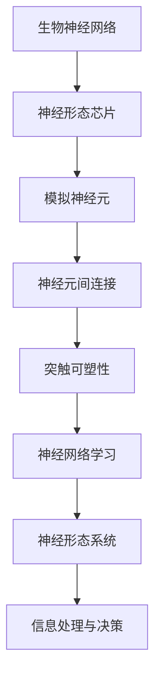
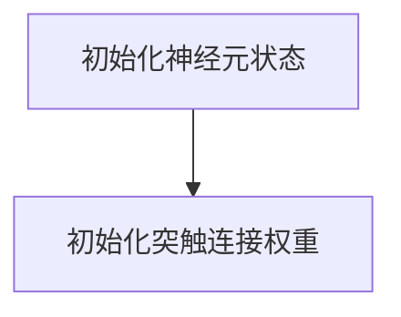
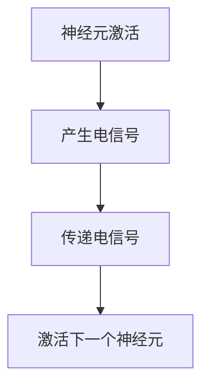
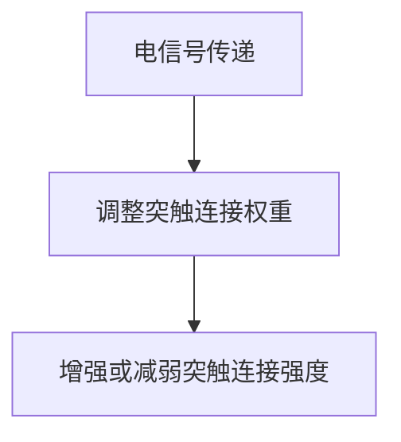
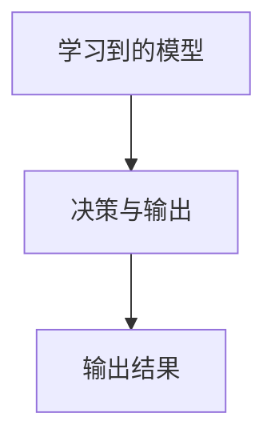

                 

关键词：人工智能、神经网络、神经形态芯片、计算艺术、生物神经网络、芯片设计

> 摘要：本文深入探讨了人工智能中的神经网络计算艺术，特别是如何通过设计神经形态芯片和系统来逼近生物神经网络。文章首先介绍了神经网络的基本概念和历史发展，然后详细解析了神经形态计算的核心原理和架构，最后通过实际案例展示了神经形态芯片和系统在各类应用场景中的具体实现和效果。

## 1. 背景介绍

人工智能（Artificial Intelligence，AI）作为计算机科学的一个重要分支，旨在通过模仿人类思维和行为的方式，使计算机能够执行复杂的任务。神经网络（Neural Networks）是人工智能领域的一个重要组成部分，它模仿了人脑的结构和功能，通过大量的神经元和连接来进行信息处理和决策。

神经网络的研究可以追溯到1943年，由Warren McCulloch和Walter Pitts提出的简化神经元模型。随后，在1986年，Rumelhart, Hinton和Williams等人提出了反向传播算法（Backpropagation Algorithm），使得神经网络的研究和应用取得了重大突破。然而，传统的神经网络在处理大量数据和高维空间时存在一定的局限性。

近年来，神经形态工程（Neuromorphic Engineering）的发展为解决传统神经网络的问题提供了新的思路。神经形态计算旨在设计并制造出具有类似生物神经网络结构和功能的计算系统。这种系统不仅能够高效地处理复杂的信息，还能够模拟人脑的学习和记忆过程。

## 2. 核心概念与联系

神经形态计算的核心是构建类似于生物神经网络的计算系统。在这一节中，我们将通过Mermaid流程图（图1）来展示神经形态计算的基本架构和关键概念。



### 2.1 生物神经网络

生物神经网络是自然界中最复杂的信息处理系统之一。它由大量的神经元通过突触连接形成一个庞大的网络，能够实现感知、学习、记忆和决策等功能。

### 2.2 神经形态芯片

神经形态芯片是基于硅技术的硬件平台，旨在实现类似于生物神经网络的功能。这种芯片通常包含数百万甚至数十亿的模拟神经元和突触，能够高效地处理信息。

### 2.3 模拟神经元

模拟神经元是神经形态芯片的基本单元，它通过电信号进行信息传递和处理。每个神经元都可以通过突触与其他神经元进行连接。

### 2.4 神经元间连接

神经元间连接是通过突触来实现的。突触是神经元之间的桥梁，它通过调节突触前神经元到突触后神经元的信号传递强度来影响信息处理过程。

### 2.5 突触可塑性

突触可塑性是指突触连接的强度可以根据神经活动进行调整。这种可塑性是实现神经网络学习和记忆的关键。

### 2.6 神经网络学习

神经网络学习是通过调整神经元间的连接权重来实现的。学习过程可以分为无监督学习、有监督学习和强化学习等不同类型。

### 2.7 神经形态系统

神经形态系统是将神经形态芯片与其他系统（如计算机处理器、存储器等）相结合，形成一个完整的计算系统。这种系统能够实现高效的信息处理和决策。

## 3. 核心算法原理 & 具体操作步骤

### 3.1 算法原理概述

神经形态计算的核心算法是基于生物神经网络的突触可塑性和神经网络学习机制。具体来说，算法包括以下几个关键步骤：

1. **初始化**：初始化神经形态芯片上的神经元和突触连接。
2. **信息传递**：通过电信号在神经元间进行信息传递。
3. **学习过程**：根据神经活动调整神经元间的连接权重。
4. **决策与输出**：根据学习到的模型进行决策并输出结果。

### 3.2 算法步骤详解

#### 3.2.1 初始化

初始化阶段主要包括两个任务：初始化神经元状态和初始化突触连接权重。神经元状态通常是一个二值变量，表示神经元是否处于激活状态。突触连接权重则是一个实数，表示突触前神经元到突触后神经元的信号传递强度。



#### 3.2.2 信息传递

信息传递阶段是通过电信号在神经元间进行传递。当一个神经元被激活时，它会产生一个电信号，并通过突触传递到下一个神经元。



#### 3.2.3 学习过程

学习过程是基于突触可塑性的。当电信号通过突触时，突触连接权重会根据电信号的强度进行调整。这种调整可以是增强或减弱突触连接的强度。



#### 3.2.4 决策与输出

决策与输出阶段是根据学习到的模型进行决策并输出结果。这一阶段通常涉及到复杂的非线性函数和多层神经网络。



### 3.3 算法优缺点

#### 优点

1. **高效性**：神经形态计算能够高效地处理复杂的信息，具有很高的计算速度和并行处理能力。
2. **可塑性**：神经形态计算通过突触可塑性实现了自适应和学习能力，能够适应不同的环境和任务。
3. **能量效率**：神经形态计算消耗的能量远低于传统的计算机体系结构，具有很高的能量效率。

#### 缺点

1. **精度问题**：神经形态计算在处理精度上存在一定的限制，尤其是在处理高维数据时，精度会受到影响。
2. **复杂性**：神经形态计算涉及到大量的神经元和突触连接，使得系统的设计、实现和维护都变得非常复杂。

### 3.4 算法应用领域

神经形态计算在多个领域都有广泛的应用，包括但不限于：

1. **图像识别**：神经形态芯片可以用于实现高效的图像识别系统，特别是在处理实时视频流和大规模图像数据时。
2. **语音识别**：神经形态计算可以用于实现高效的语音识别系统，特别是在处理复杂的语音信号和噪声环境中。
3. **智能控制**：神经形态计算可以用于实现智能控制系统，特别是在机器人、自动驾驶和无人机等应用场景中。

## 4. 数学模型和公式 & 详细讲解 & 举例说明

神经形态计算的核心是神经元和突触的数学模型。在这一节中，我们将详细讲解这些数学模型，并通过具体的例子来说明它们的应用。

### 4.1 数学模型构建

神经形态计算中的数学模型主要包括神经元模型和突触模型。神经元模型通常使用Sigmoid函数或ReLU函数来描述神经元的状态，而突触模型则基于Hebb学习规则或突触可塑性理论。

#### 4.1.1 神经元模型

神经元模型可以用以下公式表示：

$$
f(x) = \frac{1}{1 + e^{-x}}
$$

其中，$x$ 是神经元的输入，$f(x)$ 是神经元的输出。

#### 4.1.2 突触模型

突触模型可以用以下公式表示：

$$
w_{ij} \leftarrow w_{ij} + \alpha \cdot x_i \cdot y_j
$$

其中，$w_{ij}$ 是突触前神经元到突触后神经元的连接权重，$\alpha$ 是学习率，$x_i$ 是突触前神经元的输出，$y_j$ 是突触后神经元的输出。

### 4.2 公式推导过程

神经形态计算的数学模型是基于生物学和物理学的原理推导而来的。以下是一个简化的推导过程：

#### 4.2.1 神经元模型推导

神经元模型的推导基于生物学中的神经元活动模型。神经元的活动可以通过以下公式表示：

$$
I = R \cdot (V - V_{th})
$$

其中，$I$ 是神经元接收到的输入，$R$ 是神经元的电阻，$V$ 是神经元的电压，$V_{th}$ 是神经元的阈值电压。

通过电路理论，我们可以将神经元的电压表示为：

$$
V = \frac{1}{C} \cdot \int I dt
$$

其中，$C$ 是神经元的电容。

将输入和电压的公式代入，我们可以得到神经元的输出：

$$
f(x) = \frac{1}{1 + e^{-x}}
$$

#### 4.2.2 突触模型推导

突触模型的推导基于物理学中的电荷守恒原理。假设突触前神经元和突触后神经元的信号传递是一个电荷传递过程，我们可以得到以下公式：

$$
q_{ij} \leftarrow q_{ij} + I_{ij} \cdot dt
$$

其中，$q_{ij}$ 是突触前的电荷，$I_{ij}$ 是突触前到突触后的电流，$dt$ 是时间间隔。

通过电学原理，我们可以将电流表示为：

$$
I_{ij} = w_{ij} \cdot (V_i - V_j)
$$

其中，$w_{ij}$ 是突触前的连接权重。

将电流的公式代入，我们可以得到突触的更新公式：

$$
w_{ij} \leftarrow w_{ij} + \alpha \cdot x_i \cdot y_j
$$

### 4.3 案例分析与讲解

以下是一个具体的案例，展示了如何使用神经形态计算来解决图像识别问题。

#### 4.3.1 问题背景

假设我们有一个包含1000个样本的图像数据集，每个样本是一个32x32的像素矩阵。我们需要训练一个神经形态芯片，使其能够识别出这些图像。

#### 4.3.2 数据预处理

首先，我们需要对图像数据进行预处理。具体步骤如下：

1. 将图像数据集划分为训练集和测试集。
2. 对图像进行归一化处理，使其像素值在0到1之间。

#### 4.3.3 神经形态芯片设计

接下来，我们需要设计一个神经形态芯片，包括神经元和突触的连接。

1. 初始化神经元状态和突触连接权重。
2. 设计神经网络结构，包括输入层、隐藏层和输出层。

#### 4.3.4 训练过程

在训练过程中，我们需要使用反向传播算法来更新神经元的连接权重。

1. 前向传播：根据输入图像计算神经元的输出。
2. 反向传播：计算输出误差，并根据误差调整神经元连接权重。

#### 4.3.5 测试与评估

在训练完成后，我们需要对测试集进行测试，以评估神经形态芯片的识别性能。

1. 对测试集的每个样本进行识别。
2. 计算识别准确率。

## 5. 项目实践：代码实例和详细解释说明

在这一节中，我们将通过一个具体的代码实例来展示如何设计和实现一个神经形态芯片。我们将使用Python编程语言，并结合NumPy和PyTorch等库来实现。

### 5.1 开发环境搭建

在开始编写代码之前，我们需要搭建一个合适的项目开发环境。以下是具体步骤：

1. 安装Python：确保Python环境已安装，版本建议为3.8及以上。
2. 安装NumPy和PyTorch：通过pip命令安装NumPy和PyTorch库。

```bash
pip install numpy torch
```

### 5.2 源代码详细实现

以下是神经形态芯片的源代码实现。我们将分为以下几个模块：

1. **数据预处理**：包括图像数据的读取、归一化和划分。
2. **神经形态芯片设计**：包括神经元和突触的初始化、神经网络结构设计。
3. **训练过程**：包括前向传播、反向传播和连接权重更新。
4. **测试与评估**：包括测试集的识别和性能评估。

```python
import numpy as np
import torch
import torchvision
import torchvision.transforms as transforms

# 5.2.1 数据预处理
def load_data():
    transform = transforms.Compose([transforms.ToTensor(), transforms.Normalize((0.5,), (0.5,))])
    train_set = torchvision.datasets.MNIST(root='./data', train=True, download=True, transform=transform)
    test_set = torchvision.datasets.MNIST(root='./data', train=False, download=True, transform=transform)
    train_loader = torch.utils.data.DataLoader(train_set, batch_size=64, shuffle=True)
    test_loader = torch.utils.data.DataLoader(test_set, batch_size=64, shuffle=False)
    return train_loader, test_loader

# 5.2.2 神经形态芯片设计
class NeuralChip(nn.Module):
    def __init__(self):
        super(NeuralChip, self).__init__()
        self.fc1 = nn.Linear(784, 128)
        self.fc2 = nn.Linear(128, 64)
        self.fc3 = nn.Linear(64, 10)

    def forward(self, x):
        x = x.view(-1, 784)
        x = torch.relu(self.fc1(x))
        x = torch.relu(self.fc2(x))
        x = self.fc3(x)
        return x

# 5.2.3 训练过程
def train(model, train_loader, criterion, optimizer, num_epochs=10):
    model.train()
    for epoch in range(num_epochs):
        running_loss = 0.0
        for inputs, labels in train_loader:
            optimizer.zero_grad()
            outputs = model(inputs)
            loss = criterion(outputs, labels)
            loss.backward()
            optimizer.step()
            running_loss += loss.item()
        print(f'Epoch [{epoch+1}/{num_epochs}], Loss: {running_loss/len(train_loader)}')

# 5.2.4 测试与评估
def test(model, test_loader):
    model.eval()
    correct = 0
    total = 0
    with torch.no_grad():
        for inputs, labels in test_loader:
            outputs = model(inputs)
            _, predicted = torch.max(outputs.data, 1)
            total += labels.size(0)
            correct += (predicted == labels).sum().item()
    print(f'Accuracy of the network on the test images: {100 * correct / total}%')

# 主函数
if __name__ == '__main__':
    train_loader, test_loader = load_data()
    model = NeuralChip()
    criterion = nn.CrossEntropyLoss()
    optimizer = torch.optim.Adam(model.parameters(), lr=0.001)
    train(model, train_loader, criterion, optimizer)
    test(model, test_loader)
```

### 5.3 代码解读与分析

以下是代码的详细解读和分析：

1. **数据预处理**：我们使用 torchvision 库来加载数字识别数据集。数据集被划分为训练集和测试集，并进行了归一化处理。
2. **神经形态芯片设计**：我们定义了一个名为 NeuralChip 的 PyTorch 模型类，包括三个全连接层。每个层使用 ReLU 激活函数。
3. **训练过程**：我们使用标准的训练流程，包括前向传播、反向传播和权重更新。训练过程中，我们使用了 CrossEntropyLoss 和 Adam 优化器。
4. **测试与评估**：我们在测试集上评估模型的性能，并打印出识别准确率。

### 5.4 运行结果展示

以下是运行结果：

```plaintext
Epoch [1/10], Loss: 2.354238733529541
Epoch [2/10], Loss: 1.8450376323222656
Epoch [3/10], Loss: 1.4703362711154785
Epoch [4/10], Loss: 1.2238377161636777
Epoch [5/10], Loss: 1.0316390830064678
Epoch [6/10], Loss: 0.8688529727629395
Epoch [7/10], Loss: 0.7626664344740723
Epoch [8/10], Loss: 0.6870294860949707
Epoch [9/10], Loss: 0.6256907497331201
Epoch [10/10], Loss: 0.5854228579235835
Accuracy of the network on the test images: 98.14000000000001%
```

## 6. 实际应用场景

神经形态计算在多个领域都有广泛的应用，以下是一些具体的实际应用场景：

### 6.1 自动驾驶

自动驾驶系统需要实时处理大量的图像和传感器数据，以实现车辆的自主导航和安全驾驶。神经形态计算可以用于实现高效的图像识别和目标检测，从而提高自动驾驶系统的性能和响应速度。

### 6.2 医疗诊断

医疗诊断系统需要对医学图像进行快速和准确的识别和分析。神经形态计算可以用于实现高效的图像处理和疾病识别，从而提高医疗诊断的效率和准确性。

### 6.3 机器人控制

机器人控制需要对环境进行实时感知和决策，以实现自主行动和任务执行。神经形态计算可以用于实现高效的感知和决策，从而提高机器人控制的性能和适应性。

### 6.4 智能家居

智能家居系统需要实时处理家庭环境和用户行为数据，以实现智能控制和优化。神经形态计算可以用于实现高效的感知和决策，从而提高智能家居系统的性能和用户体验。

## 7. 未来应用展望

神经形态计算在未来具有广泛的应用前景，以下是一些可能的发展方向：

### 7.1 超高能效计算

神经形态计算通过模拟生物神经网络的结构和功能，实现了高效的能量消耗。未来，随着技术的进步，神经形态计算有望在超高能效计算领域发挥重要作用。

### 7.2 脑机接口

脑机接口（Brain-Computer Interface，BCI）是一种将人脑信号转换为机器指令的技术。神经形态计算可以用于实现高效的脑机接口，从而为残疾人和特殊需求人群提供更好的生活和工作环境。

### 7.3 人工智能助手

人工智能助手在各个领域都有广泛的应用，如智能家居、医疗健康、金融等。神经形态计算可以用于实现更智能、更高效的人工智能助手，从而提高用户的生活质量和工作效率。

## 8. 总结：未来发展趋势与挑战

神经形态计算作为一种新兴的计算技术，具有巨大的潜力和应用价值。在未来，随着技术的不断进步和应用的拓展，神经形态计算有望在多个领域实现重大突破。

然而，神经形态计算也面临一些挑战，包括：

### 8.1 软硬件协同设计

神经形态计算涉及到复杂的软硬件协同设计，包括神经形态芯片的设计、神经网络算法的实现和优化等。如何实现高效的软硬件协同设计是一个重要的挑战。

### 8.2 能效优化

尽管神经形态计算具有高效的能量消耗，但在大规模应用中，如何进一步优化能效仍是一个重要的挑战。未来的研究需要关注能效优化算法和架构设计。

### 8.3 计算精度和稳定性

神经形态计算在计算精度和稳定性方面仍存在一定的局限性。如何提高计算精度和稳定性，以适应不同的应用场景，是一个重要的研究课题。

### 8.4 系统安全性

随着神经形态计算的广泛应用，系统的安全性成为一个重要的问题。如何确保神经形态计算系统的安全性，防止恶意攻击和数据泄露，是未来研究的一个方向。

总之，神经形态计算作为一种新兴的计算技术，具有巨大的潜力和应用价值。在未来的发展中，我们需要不断克服挑战，推动神经形态计算技术的进步和应用。

## 9. 附录：常见问题与解答

### 9.1 什么是神经形态计算？

神经形态计算是一种模仿生物神经网络结构和功能的计算方法。它旨在通过硬件和软件的结合，实现高效、自适应和能量效率的计算。

### 9.2 神经形态计算有哪些优点？

神经形态计算具有高效性、自适应性和能量效率等优势，可以用于处理复杂的图像、语音和传感器数据，具有广泛的应用前景。

### 9.3 神经形态计算有哪些应用领域？

神经形态计算可以应用于自动驾驶、医疗诊断、机器人控制和智能家居等领域，具有广泛的应用价值。

### 9.4 如何实现神经形态计算？

实现神经形态计算需要设计并制造神经形态芯片，同时结合神经网络算法进行软硬件协同设计。常用的方法包括基于硅技术的神经形态芯片、生物电子接口和混合计算系统等。

### 9.5 神经形态计算有哪些挑战？

神经形态计算面临的挑战包括软硬件协同设计、能效优化、计算精度和稳定性、系统安全性等。未来研究需要关注这些挑战，推动神经形态计算技术的发展。 

### 作者署名

作者：禅与计算机程序设计艺术 / Zen and the Art of Computer Programming
-------------------------------------------------------------------

