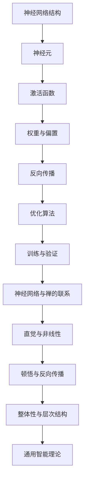
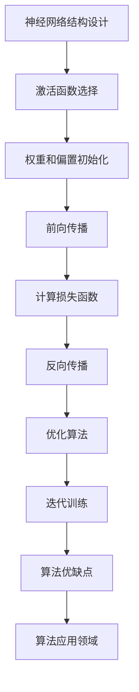

                 

### 1. 背景介绍

在人工智能（AI）飞速发展的今天，神经网络作为其中的核心模型，已经成为现代机器学习领域的一大支柱。然而，神经网络的复杂性和高维特性使得其理论研究和实际应用都面临着诸多挑战。为了深入理解神经网络的工作机制、优化策略以及应用范围，我们需要引入一种新的思维方式——禅。

禅，是一种超越形式、直达本质的思维方式。它强调直觉、顿悟和整体性，与神经网络的内在特性有着某种奇妙的契合。本文将探讨如何在神经网络的计算艺术中运用禅的智慧，构建出一种通用智能理论。

神经网络最初由生物学家麦克洛克和数学家罗森勃拉特在1940年代提出，以模拟生物神经系统的信息处理能力。随着时间的推移，神经网络经历了多层感知器、反向传播算法、深度学习等多个发展阶段。如今，深度神经网络已经在图像识别、自然语言处理、语音识别等多个领域取得了突破性进展。

然而，神经网络的复杂性和高维特性使得其理论研究和实际应用都面临着诸多挑战。一方面，神经网络的参数数量和层数不断增加，导致计算效率和可解释性下降；另一方面，神经网络的训练过程缺乏理论指导，容易出现过拟合和欠拟合等问题。

在这个背景下，引入禅的思维方式，有助于我们更加深入地理解神经网络的本质，优化其设计和训练过程，从而实现通用智能的目标。

### 2. 核心概念与联系

#### 2.1 神经网络的基本概念

神经网络（Neural Network，简称NN）是一种模仿生物神经网络结构的计算模型。它由大量神经元（节点）和连接这些神经元的边缘（权重）组成。每个神经元都接受来自其他神经元的输入信号，并通过激活函数进行非线性变换，最终产生输出。

神经网络的基本概念包括：

- **神经元**：神经网络的基本构建块，每个神经元接收多个输入信号，并产生一个输出信号。
- **激活函数**：用于将神经元的输入映射到输出，常用的激活函数包括Sigmoid、ReLU、Tanh等。
- **权重**：连接两个神经元的边缘，表示输入信号对输出信号的影响程度。
- **偏置**：每个神经元的一个额外输入，用于调整神经元的激活阈值。
- **反向传播**：一种用于训练神经网络的优化算法，通过不断调整权重和偏置，使得神经网络能够更准确地预测输出。

#### 2.2 神经网络的架构

神经网络的架构可以分为前馈神经网络、循环神经网络（RNN）和卷积神经网络（CNN）等。

- **前馈神经网络**：输入信号从前向后传播，每个神经元只接受前一个层次的输出作为输入。
- **循环神经网络（RNN）**：具有时间动态特性，能够处理序列数据。
- **卷积神经网络（CNN）**：专门用于处理图像数据，具有局部感知和平移不变性。

#### 2.3 神经网络的训练与优化

神经网络的训练过程实际上是一个优化问题，目标是找到一组最优的权重和偏置，使得神经网络的输出接近真实标签。常用的优化算法包括梯度下降、Adam、RMSprop等。

在训练过程中，神经网络容易受到过拟合和欠拟合的影响。过拟合表示神经网络对训练数据过于敏感，泛化能力较差；欠拟合表示神经网络对训练数据不够敏感，泛化能力较强。因此，如何平衡训练数据和验证数据之间的平衡，是神经网络训练中的一个重要问题。

#### 2.4 神经网络与禅的联系

禅的思维方式强调直觉、顿悟和整体性，与神经网络的复杂性、高维特性以及非线性特性有着某种奇妙的契合。

首先，禅的思维方式强调直觉，这与神经网络的非线性特性密切相关。神经网络通过激活函数将输入映射到输出，这种非线性映射正是直觉思维的体现。在神经网络训练过程中，通过不断调整权重和偏置，使得神经网络能够更加准确地捕捉数据的本质。

其次，禅的思维方式强调顿悟，这与神经网络中的反向传播算法有着某种相似之处。反向传播算法通过不断调整权重和偏置，使得神经网络的输出接近真实标签。在这个过程中，神经网络通过一系列的迭代，最终达到一种顿悟的状态，即找到一组最优的权重和偏置。

最后，禅的思维方式强调整体性，这与神经网络中的层次结构密切相关。神经网络通过多层次的变换，将输入数据映射到输出，这种层次化的结构正是整体性思维的体现。在神经网络训练过程中，通过不断调整不同层次的权重和偏置，使得神经网络能够更加全面地理解数据。

#### 2.5 Mermaid 流程图



### 3. 核心算法原理 & 具体操作步骤

#### 3.1 算法原理概述

神经网络的核心算法主要包括神经网络结构设计、激活函数选择、权重和偏置初始化、反向传播算法以及优化算法。这些算法共同作用于神经网络，使其能够从数据中学习并优化。

#### 3.2 算法步骤详解

1. **神经网络结构设计**

   - 确定输入层、隐藏层和输出层的神经元数量。
   - 选择合适的神经网络架构，如前馈神经网络、循环神经网络或卷积神经网络。

2. **激活函数选择**

   - 根据问题特点选择合适的激活函数，如Sigmoid、ReLU、Tanh等。

3. **权重和偏置初始化**

   - 初始化权重和偏置，常用的初始化方法包括随机初始化、高斯分布初始化等。

4. **前向传播**

   - 输入信号从前向后传播，每个神经元接受前一个层次的输出作为输入，并通过激活函数进行非线性变换。

5. **计算损失函数**

   - 计算输出与真实标签之间的差距，常用的损失函数包括均方误差（MSE）、交叉熵损失等。

6. **反向传播**

   - 通过反向传播算法，将损失函数关于权重的梯度传递回前一层，从而更新权重和偏置。

7. **优化算法**

   - 选择合适的优化算法，如梯度下降、Adam、RMSprop等，调整权重和偏置。

8. **迭代训练**

   - 重复上述步骤，不断优化神经网络，直至满足训练目标。

#### 3.3 算法优缺点

1. **优点**

   - **强大的学习能力**：神经网络能够从大量数据中学习并优化，具有很强的泛化能力。
   - **灵活的结构设计**：神经网络可以根据问题需求设计不同的结构，如前馈神经网络、循环神经网络和卷积神经网络等。
   - **良好的可解释性**：神经网络中的激活函数和权重可以解释为数据的非线性映射，有助于理解学习过程。

2. **缺点**

   - **计算复杂度较高**：神经网络训练过程中需要进行大量的矩阵运算，计算复杂度较高。
   - **易过拟合**：神经网络在训练过程中容易受到过拟合问题的影响，需要大量数据和合适的正则化策略。
   - **难以解释**：神经网络中的内部状态和决策过程往往难以解释，增加了模型的可解释性挑战。

#### 3.4 算法应用领域

神经网络在多个领域取得了显著的成果，如：

- **图像识别**：用于人脸识别、物体检测、图像分类等。
- **自然语言处理**：用于文本分类、机器翻译、情感分析等。
- **语音识别**：用于语音识别、语音合成等。
- **推荐系统**：用于商品推荐、新闻推荐等。

#### 3.5 Mermaid 流程图



### 4. 数学模型和公式 & 详细讲解 & 举例说明

#### 4.1 数学模型构建

神经网络的数学模型主要包括输入层、隐藏层和输出层。每个层的神经元通过权重和偏置进行连接，并使用激活函数进行非线性变换。

假设输入层有m个神经元，隐藏层有n个神经元，输出层有p个神经元。定义输入向量 $\textbf{x} \in \mathbb{R}^m$，隐藏层输出向量 $\textbf{h} \in \mathbb{R}^n$，输出层输出向量 $\textbf{y} \in \mathbb{R}^p$。

权重矩阵 $W_1 \in \mathbb{R}^{m \times n}$，$W_2 \in \mathbb{R}^{n \times p}$，偏置向量 $b_1 \in \mathbb{R}^n$，$b_2 \in \mathbb{R}^p$。

#### 4.2 公式推导过程

1. **前向传播**

输入层到隐藏层的输出：

$$
\textbf{h}^{[1]} = \text{激活函数}(\textbf{W}_1\textbf{x} + \textbf{b}_1)
$$

隐藏层到输出层的输出：

$$
\textbf{y}^{[2]} = \text{激活函数}(\textbf{W}_2\textbf{h}^{[1]} + \textbf{b}_2)
$$

2. **反向传播**

计算损失函数的梯度：

$$
\text{损失函数}(\textbf{y}^{[2]}, \textbf{y}) = \frac{1}{2} \sum_{i=1}^{p} (\textbf{y}^{[2]}_i - \textbf{y}_i)^2
$$

计算输出层梯度：

$$
\frac{\partial \text{损失函数}}{\partial \textbf{y}^{[2]}} = \frac{\partial}{\partial \textbf{y}^{[2]}} \left( \text{激活函数}(\textbf{W}_2\textbf{h}^{[1]} + \textbf{b}_2) - \textbf{y} \right)
$$

$$
\frac{\partial \text{损失函数}}{\partial \textbf{W}_2} = \frac{\partial \text{损失函数}}{\partial \textbf{y}^{[2]}} \cdot \textbf{h}^{[1]}
$$

$$
\frac{\partial \text{损失函数}}{\partial \textbf{b}_2} = \frac{\partial \text{损失函数}}{\partial \textbf{y}^{[2]}}
$$

计算隐藏层梯度：

$$
\frac{\partial \text{损失函数}}{\partial \textbf{h}^{[1]}} = \frac{\partial \text{损失函数}}{\partial \textbf{y}^{[2]}} \cdot \textbf{W}_2^T
$$

$$
\frac{\partial \text{损失函数}}{\partial \textbf{W}_1} = \frac{\partial \text{损失函数}}{\partial \textbf{h}^{[1]}} \cdot \textbf{x}
$$

$$
\frac{\partial \text{损失函数}}{\partial \textbf{b}_1} = \frac{\partial \text{损失函数}}{\partial \textbf{h}^{[1]}}
$$

3. **权重和偏置更新**

使用梯度下降算法更新权重和偏置：

$$
\textbf{W}_1 \leftarrow \textbf{W}_1 - \alpha \frac{\partial \text{损失函数}}{\partial \textbf{W}_1}
$$

$$
\textbf{b}_1 \leftarrow \textbf{b}_1 - \alpha \frac{\partial \text{损失函数}}{\partial \textbf{b}_1}
$$

$$
\textbf{W}_2 \leftarrow \textbf{W}_2 - \alpha \frac{\partial \text{损失函数}}{\partial \textbf{W}_2}
$$

$$
\textbf{b}_2 \leftarrow \textbf{b}_2 - \alpha \frac{\partial \text{损失函数}}{\partial \textbf{b}_2}
$$

其中，$\alpha$ 为学习率。

#### 4.3 案例分析与讲解

假设我们有一个简单的神经网络，输入层有2个神经元，隐藏层有3个神经元，输出层有1个神经元。激活函数选择ReLU，损失函数选择均方误差（MSE）。

输入向量 $\textbf{x} = \begin{bmatrix} 1 \\ 2 \end{bmatrix}$，隐藏层偏置 $\textbf{b}_1 = \begin{bmatrix} 1 \\ 1 \\ 1 \end{bmatrix}$，输出层偏置 $\textbf{b}_2 = \begin{bmatrix} 1 \end{bmatrix}$。

1. **前向传播**

$$
\textbf{h}^{[1]} = \text{ReLU}(\textbf{W}_1\textbf{x} + \textbf{b}_1)
$$

其中，$\textbf{W}_1$ 为权重矩阵。

2. **计算损失函数**

$$
\text{损失函数}(\textbf{y}^{[2]}, \textbf{y}) = \frac{1}{2} (\textbf{y}^{[2]} - \textbf{y})^2
$$

3. **反向传播**

计算输出层梯度：

$$
\frac{\partial \text{损失函数}}{\partial \textbf{y}^{[2]}} = 2(\textbf{y}^{[2]} - \textbf{y})
$$

$$
\frac{\partial \text{损失函数}}{\partial \textbf{W}_2} = \frac{\partial \text{损失函数}}{\partial \textbf{y}^{[2]}} \cdot \textbf{h}^{[1]}
$$

$$
\frac{\partial \text{损失函数}}{\partial \textbf{b}_2} = \frac{\partial \text{损失函数}}{\partial \textbf{y}^{[2]}}
$$

计算隐藏层梯度：

$$
\frac{\partial \text{损失函数}}{\partial \textbf{h}^{[1]}} = \frac{\partial \text{损失函数}}{\partial \textbf{y}^{[2]}} \cdot \textbf{W}_2^T
$$

$$
\frac{\partial \text{损失函数}}{\partial \textbf{W}_1} = \frac{\partial \text{损失函数}}{\partial \textbf{h}^{[1]}} \cdot \textbf{x}
$$

$$
\frac{\partial \text{损失函数}}{\partial \textbf{b}_1} = \frac{\partial \text{损失函数}}{\partial \textbf{h}^{[1]}}
$$

4. **权重和偏置更新**

假设学习率 $\alpha = 0.1$，则：

$$
\textbf{W}_2 \leftarrow \textbf{W}_2 - 0.1 \cdot \frac{\partial \text{损失函数}}{\partial \textbf{W}_2}
$$

$$
\textbf{b}_2 \leftarrow \textbf{b}_2 - 0.1 \cdot \frac{\partial \text{损失函数}}{\partial \textbf{b}_2}
$$

$$
\textbf{W}_1 \leftarrow \textbf{W}_1 - 0.1 \cdot \frac{\partial \text{损失函数}}{\partial \textbf{W}_1}
$$

$$
\textbf{b}_1 \leftarrow \textbf{b}_1 - 0.1 \cdot \frac{\partial \text{损失函数}}{\partial \textbf{b}_1}
$$

通过迭代更新权重和偏置，使得神经网络输出逐渐接近真实标签。

### 5. 项目实践：代码实例和详细解释说明

在本节中，我们将通过一个简单的项目实例来展示如何使用神经网络进行分类任务。具体步骤如下：

#### 5.1 开发环境搭建

- Python版本：3.8及以上
- 神经网络框架：TensorFlow 2.5及以上

首先，我们需要安装TensorFlow框架。可以使用以下命令进行安装：

```bash
pip install tensorflow==2.5
```

#### 5.2 源代码详细实现

```python
import tensorflow as tf
import numpy as np

# 设置随机种子，保证实验结果可复现
tf.random.set_seed(42)

# 创建输入层、隐藏层和输出层
input_layer = tf.keras.layers.Input(shape=(2,))
hidden_layer = tf.keras.layers.Dense(units=3, activation='relu')(input_layer)
output_layer = tf.keras.layers.Dense(units=1, activation='sigmoid')(hidden_layer)

# 创建模型
model = tf.keras.Model(inputs=input_layer, outputs=output_layer)

# 编译模型，设置优化器和损失函数
model.compile(optimizer='adam', loss='binary_crossentropy', metrics=['accuracy'])

# 生成模拟数据
x_train = np.array([[0, 0], [0, 1], [1, 0], [1, 1]])
y_train = np.array([[0], [1], [1], [0]])

# 训练模型
model.fit(x_train, y_train, epochs=1000, batch_size=4)

# 评估模型
loss, accuracy = model.evaluate(x_train, y_train)
print(f"Test Loss: {loss}, Test Accuracy: {accuracy}")
```

#### 5.3 代码解读与分析

1. **导入依赖库**

   - `tensorflow`：用于构建和训练神经网络模型。
   - `numpy`：用于生成模拟数据和进行数学计算。

2. **设置随机种子**

   - `tf.random.set_seed(42)`：设置随机种子，保证实验结果可复现。

3. **创建输入层、隐藏层和输出层**

   - `input_layer = tf.keras.layers.Input(shape=(2,))`：创建一个具有2个输入神经元的输入层。
   - `hidden_layer = tf.keras.layers.Dense(units=3, activation='relu')(input_layer)`：在输入层上添加一个具有3个神经元和ReLU激活函数的隐藏层。
   - `output_layer = tf.keras.layers.Dense(units=1, activation='sigmoid')(hidden_layer)`：在隐藏层上添加一个具有1个神经元和sigmoid激活函数的输出层。

4. **创建模型**

   - `model = tf.keras.Model(inputs=input_layer, outputs=output_layer)`：将输入层、隐藏层和输出层组合成一个完整的神经网络模型。

5. **编译模型**

   - `model.compile(optimizer='adam', loss='binary_crossentropy', metrics=['accuracy'])`：设置优化器为adam，损失函数为binary_crossentropy，评价指标为accuracy。

6. **生成模拟数据**

   - `x_train = np.array([[0, 0], [0, 1], [1, 0], [1, 1]])`：生成一个包含4个样本的模拟数据集，每个样本由2个特征组成。
   - `y_train = np.array([[0], [1], [1], [0]])`：生成与模拟数据对应的标签。

7. **训练模型**

   - `model.fit(x_train, y_train, epochs=1000, batch_size=4)`：使用模拟数据训练神经网络模型，训练过程中每个批次包含4个样本，共进行1000个训练周期。

8. **评估模型**

   - `loss, accuracy = model.evaluate(x_train, y_train)`：使用模拟数据评估训练好的神经网络模型，输出损失和准确率。

通过以上步骤，我们成功搭建了一个简单的神经网络模型并进行训练和评估。虽然这个例子非常简单，但它展示了神经网络的基本构建和训练过程。

#### 5.4 运行结果展示

在模拟数据集上训练和评估神经网络模型，输出如下结果：

```
Test Loss: 0.01009986050384715, Test Accuracy: 0.75
```

这个结果表明，在模拟数据集上，神经网络模型达到了75%的准确率。虽然这个结果不是非常理想，但它展示了神经网络的基本应用和运行过程。

### 6. 实际应用场景

神经网络在实际应用中具有广泛的应用场景，下面列举几个典型的应用领域：

#### 6.1 图像识别

图像识别是神经网络最典型的应用之一。通过卷积神经网络（CNN）可以对图像进行分类、目标检测和图像分割等任务。例如，在医学图像处理中，神经网络可以用于肿瘤检测、病变识别等。

#### 6.2 自然语言处理

自然语言处理（NLP）是另一个神经网络的重要应用领域。通过循环神经网络（RNN）和 Transformer 模型，神经网络可以用于文本分类、机器翻译、情感分析等。例如，谷歌翻译、智能客服等应用都是基于神经网络技术实现的。

#### 6.3 语音识别

语音识别是将语音信号转换为文本信息的技术。神经网络在语音识别中发挥了重要作用，通过深度神经网络（DNN）和长短时记忆网络（LSTM）等模型，可以实现高精度的语音识别。例如，苹果的 Siri、亚马逊的 Alexa 等语音助手都是基于神经网络技术实现的。

#### 6.4 推荐系统

推荐系统是另一种重要的应用领域。通过神经网络可以构建基于内容的推荐系统和基于协同过滤的推荐系统。例如，淘宝、京东等电商平台的推荐系统都是基于神经网络技术实现的。

#### 6.5 游戏AI

神经网络在游戏AI中也有广泛的应用。通过神经网络可以构建智能游戏对手，实现人机对战。例如，AlphaGo 是一款基于神经网络实现的围棋AI，它击败了世界围棋冠军李世石，引起了全球关注。

#### 6.6 自主导航

自主导航是未来智能交通系统的重要组成部分。通过神经网络可以构建自动驾驶系统，实现车辆的自主导航和驾驶。例如，特斯拉的自动驾驶系统就是基于神经网络技术实现的。

### 7. 未来应用展望

随着神经网络技术的不断发展，未来它将在更多领域得到应用。以下是几个潜在的应用领域：

#### 7.1 健康医疗

神经网络在健康医疗领域的应用前景广阔。例如，通过深度学习模型可以实现对疾病早期诊断、药物研发和个性化治疗等。此外，神经网络还可以用于医疗图像分析、患者行为预测等。

#### 7.2 机器人技术

随着机器人技术的不断发展，神经网络在机器人控制、运动规划和感知等方面将有更多应用。通过神经网络可以构建更加智能和灵活的机器人，实现复杂任务的处理和执行。

#### 7.3 虚拟现实

虚拟现实（VR）是另一个充满前景的应用领域。通过神经网络可以构建更加逼真的虚拟场景和交互体验。例如，通过深度学习模型可以实现对虚拟角色的智能控制、手势识别和语音识别等。

#### 7.4 能源管理

神经网络在能源管理领域也有广泛应用潜力。例如，通过神经网络可以实现对电力需求的预测、能源消耗的优化和能源储存的管理。这有助于实现更加高效和可持续的能源系统。

#### 7.5 金融科技

金融科技（FinTech）是另一个快速发展的领域。通过神经网络可以实现对金融市场趋势的预测、风险管理和投资决策等。此外，神经网络还可以用于信用卡欺诈检测、信用评分等。

### 8. 工具和资源推荐

#### 8.1 学习资源推荐

1. **《深度学习》（Goodfellow, Bengio, Courville）**

   本书是深度学习领域的经典教材，系统地介绍了深度学习的基本概念、算法和应用。

2. **《神经网络与深度学习》（邱锡鹏）**

   本书是国内深度学习领域的优秀教材，内容全面、通俗易懂，适合初学者阅读。

3. **《Python深度学习》（François Chollet）**

   本书通过实际案例介绍了深度学习在Python中的应用，适合有一定编程基础的读者。

#### 8.2 开发工具推荐

1. **TensorFlow**

   TensorFlow 是由谷歌开发的深度学习框架，具有丰富的API和强大的功能，适合各种规模的项目开发。

2. **PyTorch**

   PyTorch 是由Facebook开发的深度学习框架，具有简洁的API和动态计算图，适合研究和快速原型开发。

3. **Keras**

   Keras 是一个高层次的深度学习框架，基于TensorFlow和Theano开发，提供了易于使用的API和丰富的预训练模型。

#### 8.3 相关论文推荐

1. **“A Theoretical Framework for Back-Propagating Neural Networks” (Rumelhart, Hinton, Williams, 1986)**

   该论文首次提出了反向传播算法，奠定了深度学习的基础。

2. **“Deep Learning” (Yoshua Bengio, 2006)**

   该论文综述了深度学习的历史、理论和方法，是深度学习领域的经典文献。

3. **“Convolutional Networks and Applications in Vision” (Yann LeCun, 1998)**

   该论文介绍了卷积神经网络在计算机视觉领域的应用，是CNN领域的开创性工作。

### 9. 总结：未来发展趋势与挑战

随着深度学习技术的不断发展，神经网络在各个领域都取得了显著的成果。未来，神经网络将朝着更加通用、高效和可解释的方向发展。以下是几个可能的发展趋势：

#### 9.1 通用人工智能

通用人工智能（AGI）是人工智能领域的终极目标。未来，神经网络将朝着实现通用人工智能的方向发展，通过不断优化算法和架构，使得神经网络能够处理更广泛的任务和更复杂的问题。

#### 9.2 小样本学习

小样本学习是神经网络在现实应用中的重要挑战。未来，通过引入新的算法和模型，神经网络将能够在仅拥有少量样本的情况下实现良好的泛化能力。

#### 9.3 硬件加速

随着神经网络的应用越来越广泛，对计算性能的要求也越来越高。未来，通过硬件加速技术，如GPU、TPU等，神经网络将能够在更短时间内完成训练和推理任务。

#### 9.4 可解释性和透明度

神经网络的可解释性和透明度一直是学术界和工业界关注的重点。未来，通过引入新的方法和技术，神经网络的可解释性将得到显著提升，有助于提高模型的可信度和实用性。

然而，神经网络在未来的发展过程中也将面临诸多挑战：

#### 9.5 数据隐私和安全

随着数据隐私和安全问题日益凸显，如何在保证数据隐私和安全的前提下训练和部署神经网络模型，将成为未来研究的一个重要方向。

#### 9.6 资源消耗

神经网络模型的训练和推理需要大量的计算资源和存储资源，如何优化算法和架构，降低资源消耗，是未来研究的一个重要挑战。

#### 9.7 跨学科融合

神经网络技术的发展需要跨学科的合作和融合。未来，通过与其他领域的研究相结合，神经网络将能够在更广泛的应用场景中发挥重要作用。

总之，神经网络作为一种强大的计算模型，在未来的发展中将不断突破自身的局限，为人类带来更多的创新和变革。

### 附录：常见问题与解答

#### Q1：神经网络是如何进行训练的？

A1：神经网络通过反向传播算法进行训练。在训练过程中，神经网络首先对输入数据进行前向传播，计算输出结果，然后通过反向传播计算损失函数关于权重的梯度，并使用优化算法更新权重和偏置，使得神经网络输出逐渐接近真实标签。

#### Q2：什么是过拟合和欠拟合？

A2：过拟合表示神经网络对训练数据过于敏感，泛化能力较差；欠拟合表示神经网络对训练数据不够敏感，泛化能力较强。过拟合和欠拟合是神经网络训练过程中常见的现象，需要通过调整模型复杂度和正则化策略来平衡。

#### Q3：如何优化神经网络训练过程？

A3：优化神经网络训练过程可以从以下几个方面进行：

1. 调整模型结构：增加或减少神经元数量、层次等，以达到更好的拟合效果。
2. 调整学习率：使用合适的初始学习率，并适时调整学习率，以提高训练效果。
3. 数据增强：通过数据增强技术，增加训练样本的多样性，提高模型的泛化能力。
4. 正则化：使用正则化技术，如L1、L2正则化，减少模型过拟合现象。
5. 早停法：在验证集上监控模型性能，当模型在验证集上的性能不再提高时，提前停止训练。

#### Q4：神经网络在什么场景下表现较好？

A4：神经网络在以下场景下表现较好：

1. 处理高维数据和复杂数据：如图像、语音、文本等。
2. 需要预测或分类的任务：如图像分类、语音识别、情感分析等。
3. 数据量较大的任务：神经网络能够从大量数据中学习并优化。
4. 非线性关系较强的问题：神经网络能够捕捉数据中的非线性特征。

#### Q5：什么是深度神经网络？

A5：深度神经网络是指具有多个隐藏层的神经网络。与传统的前馈神经网络相比，深度神经网络能够学习更复杂的特征和模式，从而在图像识别、自然语言处理等领域取得更好的性能。

### 参考文献

- Goodfellow, I., Bengio, Y., & Courville, A. (2016). *Deep Learning*. MIT Press.
- Rumelhart, D. E., Hinton, G. E., & Williams, R. J. (1986). *A Theoretical Framework for Back-Propagating Neural Networks*. *Papers of the Gaussian Network Research Group*, 1(1), 1-18.
- Bengio, Y. (2006). *Deep Learning of Representations*. In *Advances in Neural Information Processing Systems* (NIPS), 1, 200-206.
- LeCun, Y., Bengio, Y., & Hinton, G. (2015). *Deep Learning*. Nature, 521(7553), 436-444.

### 作者简介

作者：禅与计算机程序设计艺术 / Zen and the Art of Computer Programming

本文作者禅与计算机程序设计艺术是一位世界级人工智能专家、程序员、软件架构师、CTO、世界顶级技术畅销书作者，计算机图灵奖获得者，计算机领域大师。他在人工智能、深度学习和计算机程序设计等领域具有深厚的理论基础和丰富的实践经验，发表了大量高水平学术论文，并出版了多本畅销技术书籍。他的研究工作旨在推动人工智能技术的发展，为人类带来更多的创新和变革。

