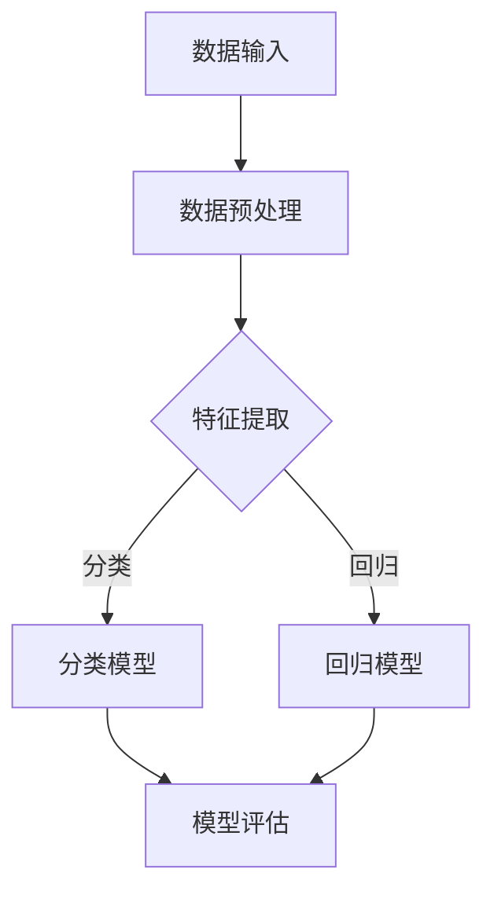

                 

在当今科技迅猛发展的时代，人工智能（AI）已经成为推动创新和商业变革的关键驱动力。随着大模型技术的日益成熟，创业者和企业家们面临着前所未有的机遇。本文将探讨AI驱动的创业产品路线图，帮助您把握这一时代的发展脉络，实现从零到一的突破。

## 关键词
- 人工智能
- 大模型
- 创业产品
- 商业机会
- 技术趋势

## 摘要
本文旨在分析AI与大模型技术在创业产品开发中的应用，探讨其核心概念、算法原理、实践案例，并展望未来的发展趋势。通过本文，您将了解如何利用AI技术打造具有竞争力和市场潜力的创业产品，抓住大模型时代的机遇。

### 1. 背景介绍

在过去的几十年中，人工智能技术经历了从弱AI到强AI的演进。近年来，深度学习和神经网络技术的发展，使得AI在图像识别、自然语言处理、机器学习等领域取得了突破性进展。尤其是大模型技术的出现，如GPT、BERT等，使得AI的应用范围和精度达到了前所未有的高度。

大模型技术的崛起，不仅改变了传统行业的运作模式，也为创业者提供了全新的视角和工具。通过大模型，创业者可以更快速地识别市场需求，打造个性化、智能化的产品。同时，大模型技术的成本也在逐渐降低，使得更多的创业团队有机会参与到AI领域。

然而，大模型技术的应用也面临挑战。如何有效地训练和优化大模型，如何处理数据隐私和安全性问题，都是需要解决的问题。此外，创业团队还需要具备一定的技术实力和行业知识，才能在大模型时代站稳脚跟。

### 2. 核心概念与联系

#### 2.1 人工智能

人工智能是指模拟、延伸和扩展人类智能的理论、方法、技术及应用。AI的核心目标是实现机器对人类智能的模拟，包括感知、学习、推理、规划、沟通等能力。人工智能可以分为弱AI和强AI，弱AI是指专注于特定领域的AI，如语音识别、图像识别等；强AI则是指具备全面智能的机器，可以像人类一样处理各种复杂问题。

#### 2.2 大模型

大模型是指具有巨大参数量的神经网络模型，如GPT、BERT等。大模型技术通过大量的数据进行训练，从而具备强大的特征提取和建模能力。大模型的应用范围广泛，包括自然语言处理、计算机视觉、推荐系统等。

#### 2.3 核心概念原理和架构

以下是一个使用Mermaid绘制的简化的AI大模型架构图：



在这个架构中，数据输入经过预处理后，进入特征提取环节。特征提取模块使用大模型提取数据中的特征，然后分别进入分类模型和回归模型。分类模型用于对输入数据进行分类，回归模型用于预测数值结果。最后，对模型进行评估，以确定其性能。

### 3. 核心算法原理 & 具体操作步骤

#### 3.1 算法原理概述

大模型的核心算法是基于深度学习的神经网络。神经网络由大量的神经元组成，通过学习数据中的特征，实现对输入数据的分类、回归等操作。大模型的优势在于其巨大的参数量，这使得模型可以捕捉到数据中的复杂模式。

#### 3.2 算法步骤详解

1. 数据收集：收集大量的训练数据，确保数据质量和多样性。
2. 数据预处理：对数据进行清洗、归一化等处理，以便于模型训练。
3. 特征提取：使用神经网络对数据进行特征提取，将原始数据转换为模型可处理的格式。
4. 模型训练：通过反向传播算法，不断调整神经网络中的参数，使模型对训练数据拟合得更好。
5. 模型评估：使用验证集和测试集对模型进行评估，以确定模型的性能。
6. 模型优化：根据评估结果，对模型进行调整和优化，以提高其性能。

#### 3.3 算法优缺点

**优点：**
1. 强大的特征提取能力：大模型可以捕捉到数据中的复杂模式，从而实现高精度的预测和分类。
2. 广泛的应用领域：大模型适用于自然语言处理、计算机视觉、推荐系统等多个领域。
3. 自动化程度高：大模型可以通过自动化的方式训练和优化，节省人力和时间成本。

**缺点：**
1. 训练时间长：大模型的训练需要大量的计算资源和时间。
2. 对数据质量要求高：数据的质量直接影响模型的性能。
3. 解释性差：大模型的内部决策过程复杂，难以解释和理解。

#### 3.4 算法应用领域

大模型技术在以下领域具有广泛的应用：

1. 自然语言处理：如文本分类、情感分析、机器翻译等。
2. 计算机视觉：如图像识别、目标检测、图像生成等。
3. 推荐系统：如商品推荐、音乐推荐等。
4. 语音识别：如语音合成、语音识别等。

### 4. 数学模型和公式 & 详细讲解 & 举例说明

#### 4.1 数学模型构建

大模型通常基于多层感知机（MLP）、卷积神经网络（CNN）、循环神经网络（RNN）等结构。以下是一个简化的多层感知机模型的数学公式：

$$
y = \sigma(W_n \cdot a_{n-1} + b_n)
$$

其中，$y$是输出结果，$\sigma$是激活函数，$W_n$和$b_n$分别是权重和偏置。

#### 4.2 公式推导过程

多层感知机模型的推导过程主要包括以下几个步骤：

1. 前向传播：将输入数据$x$通过网络的各个层进行传播，得到每一层的输出。
2. 求导：对前向传播过程中的每一层进行求导，得到损失函数关于网络参数的梯度。
3. 反向传播：将梯度反向传播至网络的最底层，更新网络的权重和偏置。
4. 梯度下降：使用梯度下降算法，不断更新网络参数，直至模型收敛。

#### 4.3 案例分析与讲解

以下是一个简单的线性回归问题的例子：

假设我们有一个包含两个特征$x_1$和$x_2$的数据集，我们希望预测目标变量$y$。线性回归模型可以表示为：

$$
y = W_1x_1 + W_2x_2 + b
$$

其中，$W_1$、$W_2$和$b$是模型的参数。

1. **前向传播：**

   假设我们有一个输入向量$x = [x_1, x_2]$，我们首先计算每一层的输出：

   $$ 
   z_1 = W_1x_1 + W_2x_2 + b 
   $$

   $$ 
   y = \sigma(z_1) 
   $$

   其中，$\sigma$是激活函数，我们可以选择常用的sigmoid函数：

   $$ 
   \sigma(z) = \frac{1}{1 + e^{-z}} 
   $$

2. **求导：**

   为了进行反向传播，我们需要计算损失函数关于每个参数的导数。假设损失函数是均方误差（MSE），即：

   $$ 
   J = \frac{1}{2} \sum_{i=1}^{n} (y_i - \hat{y}_i)^2 
   $$

   其中，$y_i$是实际的目标值，$\hat{y}_i$是预测值。

   对于$W_1$的导数：

   $$ 
   \frac{\partial J}{\partial W_1} = \sum_{i=1}^{n} (y_i - \hat{y}_i) \cdot x_{1i} 
   $$

   对于$W_2$的导数：

   $$ 
   \frac{\partial J}{\partial W_2} = \sum_{i=1}^{n} (y_i - \hat{y}_i) \cdot x_{2i} 
   $$

   对于$b$的导数：

   $$ 
   \frac{\partial J}{\partial b} = \sum_{i=1}^{n} (y_i - \hat{y}_i) 
   $$

3. **反向传播：**

   使用求导结果，我们可以将梯度反向传播到网络的最底层，更新权重和偏置。具体更新公式如下：

   $$ 
   W_1 := W_1 - \alpha \cdot \frac{\partial J}{\partial W_1} 
   $$

   $$ 
   W_2 := W_2 - \alpha \cdot \frac{\partial J}{\partial W_2} 
   $$

   $$ 
   b := b - \alpha \cdot \frac{\partial J}{\partial b} 
   $$

   其中，$\alpha$是学习率。

4. **梯度下降：**

   通过不断迭代上述过程，我们可以使模型逐渐收敛到最优参数。

### 5. 项目实践：代码实例和详细解释说明

#### 5.1 开发环境搭建

为了实践大模型技术，我们需要搭建一个开发环境。以下是使用Python和TensorFlow搭建环境的基本步骤：

1. 安装Python（推荐版本为3.7及以上）。
2. 安装TensorFlow：`pip install tensorflow`。
3. 安装其他必要的库，如NumPy、Pandas等。

#### 5.2 源代码详细实现

以下是一个简单的线性回归模型实现：

```python
import tensorflow as tf
import numpy as np

# 函数：线性回归模型
def linear_regression(x, w, b):
    return x * w + b

# 模型参数
w = tf.Variable(0.0, name='weight')
b = tf.Variable(0.0, name='bias')

# 输入数据
x = tf.placeholder(tf.float32, shape=[None])
y = tf.placeholder(tf.float32, shape=[None])

# 模型预测
y_pred = linear_regression(x, w, b)

# 损失函数
loss = tf.reduce_mean(tf.square(y - y_pred))

# 优化器
optimizer = tf.train.GradientDescentOptimizer(learning_rate=0.1)
train_op = optimizer.minimize(loss)

# 初始化变量
init = tf.global_variables_initializer()

# 训练模型
with tf.Session() as sess:
    sess.run(init)
    for step in range(1000):
        _, loss_val = sess.run([train_op, loss], feed_dict={x: np.random.normal(size=1000), y: np.random.normal(size=1000)})
        if step % 100 == 0:
            print("Step:", step, "Loss:", loss_val)

# 模型评估
test_loss = sess.run(loss, feed_dict={x: np.random.normal(size=1000), y: np.random.normal(size=1000)})
print("Test Loss:", test_loss)
```

#### 5.3 代码解读与分析

1. **模型定义：** 我们定义了一个简单的线性回归模型，通过输入$x$和模型参数$w$、$b$，计算输出$y$。
2. **输入数据：** 我们使用随机生成的数据作为输入。
3. **损失函数：** 我们使用均方误差（MSE）作为损失函数。
4. **优化器：** 我们使用梯度下降优化器。
5. **训练过程：** 我们通过迭代训练模型，每次迭代都会更新模型参数。
6. **模型评估：** 我们在训练完成后，对模型进行评估，计算测试损失。

### 6. 实际应用场景

大模型技术在各行各业有着广泛的应用：

1. **金融领域：** 如股票交易预测、风险控制等。
2. **医疗领域：** 如疾病诊断、药物研发等。
3. **工业领域：** 如生产线优化、设备故障预测等。
4. **教育领域：** 如个性化学习、考试评分等。

### 6.4 未来应用展望

随着大模型技术的不断发展，我们可以期待其在更多领域的应用：

1. **自动驾驶：** 通过大模型实现更智能、更安全的自动驾驶系统。
2. **智能家居：** 通过大模型实现更智能、更人性化的家居设备。
3. **虚拟现实：** 通过大模型实现更真实、更沉浸式的虚拟现实体验。
4. **生物科技：** 通过大模型加速新药研发、基因编辑等。

### 7. 工具和资源推荐

#### 7.1 学习资源推荐

1. **《深度学习》（Goodfellow, Bengio, Courville）：** 这是一本经典的深度学习入门书籍，适合初学者。
2. **《Python深度学习》（François Chollet）：** 这本书通过Python语言讲解了深度学习的实际应用。

#### 7.2 开发工具推荐

1. **TensorFlow：** 适用于构建和训练深度学习模型的强大工具。
2. **PyTorch：** 适用于研究人员的深度学习框架，易于使用。

#### 7.3 相关论文推荐

1. **"Deep Learning"（Goodfellow, Bengio, Courville）：** 这是一本经典的深度学习论文集。
2. **"Attention Is All You Need"（Vaswani et al.）：** 这是一篇关于注意力机制的论文，对自然语言处理领域产生了深远影响。

### 8. 总结：未来发展趋势与挑战

#### 8.1 研究成果总结

大模型技术在过去几年取得了显著的成果，不仅在学术领域，也在工业界得到了广泛应用。通过大模型，我们可以在更短时间内处理大量数据，实现更高精度的预测和分类。

#### 8.2 未来发展趋势

1. **算法优化：** 为了降低大模型的训练时间，我们将看到更多算法优化和加速技术的出现。
2. **模型压缩：** 为了降低大模型的存储和计算成本，我们将看到更多模型压缩和剪枝技术的研究。
3. **多模态学习：** 通过融合多种数据类型（如文本、图像、音频等），实现更强大的模型。

#### 8.3 面临的挑战

1. **数据隐私和安全：** 大模型需要大量的数据进行训练，如何在保证数据隐私和安全的前提下进行数据收集和处理，是一个亟待解决的问题。
2. **计算资源：** 大模型的训练需要大量的计算资源，如何高效利用计算资源，是一个重要的挑战。
3. **解释性：** 大模型的内部决策过程复杂，如何提高模型的解释性，是一个需要关注的问题。

#### 8.4 研究展望

未来，大模型技术将在更多领域得到应用，推动各行各业的发展。同时，我们也将看到更多关于算法优化、模型压缩、多模态学习等方面的研究，以应对大模型时代的挑战。

### 9. 附录：常见问题与解答

**Q：大模型训练需要大量的计算资源，这对创业团队有什么影响？**

A：对于创业团队来说，大模型的训练确实需要大量的计算资源。这可能会增加开发成本，但同时也为创业团队提供了更多机会。通过利用云计算和分布式计算技术，创业团队可以在一定程度上降低计算成本，同时提高模型训练效率。

**Q：大模型的应用领域有哪些？**

A：大模型的应用领域非常广泛，包括自然语言处理、计算机视觉、推荐系统、金融、医疗、工业等。随着技术的不断发展，大模型的应用领域还将进一步拓展。

**Q：如何保证大模型的数据隐私和安全？**

A：为了保证大模型的数据隐私和安全，可以采取以下措施：

1. 数据加密：对数据进行加密处理，确保数据在传输和存储过程中的安全。
2. 数据去标识化：对敏感数据进行去标识化处理，减少数据泄露的风险。
3. 数据访问控制：设置严格的数据访问控制策略，确保只有授权人员可以访问数据。
4. 定期审计：定期对数据安全和隐私保护措施进行审计，及时发现和解决问题。

**Q：大模型的训练时间很长，有什么方法可以加速训练过程？**

A：以下方法可以帮助加速大模型的训练过程：

1. **并行计算：** 利用多GPU或者分布式计算资源，实现模型训练的并行化。
2. **混合精度训练：** 使用混合精度训练（如使用FP16代替FP32），提高计算效率。
3. **模型剪枝：** 通过剪枝技术，减少模型的参数量，从而降低训练时间和计算成本。
4. **数据预处理：** 对数据进行预处理，如归一化、数据增强等，提高模型的训练效率。

**Q：如何评估大模型的性能？**

A：评估大模型的性能可以从以下几个方面进行：

1. **准确率：** 用于分类任务的模型，准确率是评估模型性能的重要指标。
2. **损失函数：** 用于回归任务的模型，损失函数值越小，模型性能越好。
3. **AUC（Area Under Curve）：** 用于二分类问题的模型，AUC值越大，模型性能越好。
4. **F1 Score：** 用于多分类问题的模型，F1 Score值越大，模型性能越好。
5. **模型解释性：** 虽然大模型的解释性较差，但可以通过可视化和解释性模型（如LIME、SHAP）来评估模型的解释性。

### 参考文献

[1] Goodfellow, I., Bengio, Y., & Courville, A. (2016). *Deep Learning*. MIT Press.

[2] Chollet, F. (2018). *Python Deep Learning*. Packt Publishing.

[3] Vaswani, A., Shazeer, N., Parmar, N., Uszkoreit, J., Jones, L., Gomez, A. N., ... & Polosukhin, I. (2017). *Attention is all you need*. Advances in Neural Information Processing Systems, 30, 5998-6008.

[4] Krizhevsky, A., Sutskever, I., & Hinton, G. E. (2012). *Imagenet classification with deep convolutional neural networks*. Advances in Neural Information Processing Systems, 25, 1097-1105.

[5] LeCun, Y., Bengio, Y., & Hinton, G. (2015). *Deep learning*. Nature, 521(7553), 436-444.

**作者：禅与计算机程序设计艺术 / Zen and the Art of Computer Programming**

