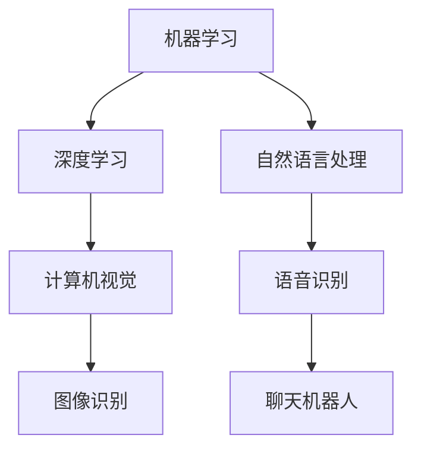

                 

关键词：人工智能，行业应用，解决方案，算法原理，代码实战

摘要：本文将深入探讨人工智能在各个行业中的应用案例，解析解决方案的原理，并通过代码实战案例，详细讲解如何将这些原理应用到实际项目中。

## 1. 背景介绍

人工智能（AI）作为一种计算机科学的重要分支，其核心目标是通过模拟、延伸和扩展人类的智能行为，实现自动化决策和智能交互。随着深度学习、强化学习等技术的不断进步，AI 已成为推动各行各业创新的重要力量。本文将聚焦于 AI 在不同行业中的应用，介绍具体的解决方案原理，并通过代码实战案例，帮助读者深入理解并掌握这些技术。

## 2. 核心概念与联系

为了更好地理解 AI 在行业应用中的解决方案，我们首先需要掌握几个核心概念，包括机器学习、深度学习、自然语言处理等。以下是一个简化的 Mermaid 流程图，展示了这些概念之间的联系。



### 2.1 机器学习

机器学习是 AI 的基础，它通过数据驱动的方式，让计算机自动识别模式和发现规律。机器学习的主要方法包括监督学习、无监督学习和强化学习。监督学习通过标记数据训练模型，无监督学习通过未标记数据发现模式，而强化学习则通过交互和奖励机制优化模型。

### 2.2 深度学习

深度学习是机器学习的一个重要分支，它利用多层神经网络模拟人脑的思维方式，对大量数据进行自动特征提取和分类。深度学习在图像识别、语音识别等领域取得了显著的突破。

### 2.3 自然语言处理

自然语言处理旨在使计算机能够理解和处理自然语言，包括文本分类、情感分析、机器翻译等任务。自然语言处理的核心技术包括词嵌入、序列模型和注意力机制。

### 2.4 计算机视觉

计算机视觉是使计算机能够从图像或视频中识别和理解场景的技术。计算机视觉的应用包括图像识别、目标检测、视频分析等。

### 2.5 语音识别

语音识别是将语音信号转换为文本的技术。语音识别广泛应用于语音助手、电话客服等领域。

## 3. 核心算法原理 & 具体操作步骤

### 3.1 算法原理概述

以下是几个在 AI 行业应用中常见的关键算法原理：

- **卷积神经网络（CNN）**：适用于图像识别和目标检测，通过卷积层提取图像特征，并通过全连接层进行分类。

- **递归神经网络（RNN）**：适用于序列数据处理，如文本和语音，通过记忆过往信息，实现序列到序列的映射。

- **长短期记忆网络（LSTM）**：是 RNN 的一种改进，能够解决 RNN 的梯度消失问题，适用于长期依赖关系的序列数据处理。

- **生成对抗网络（GAN）**：通过两个对抗网络的博弈，生成逼真的图像和数据。

### 3.2 算法步骤详解

以下是 CNN 和 RNN 的基本步骤：

#### CNN 步骤：

1. **输入层**：输入图像数据。
2. **卷积层**：通过卷积核对图像进行卷积操作，提取图像特征。
3. **激活函数**：通常使用 ReLU 函数，增加网络的非线性能力。
4. **池化层**：通过池化操作减小数据维度，提高计算效率。
5. **全连接层**：将卷积层提取的特征进行整合，输出分类结果。

#### RNN 步骤：

1. **输入层**：输入序列数据。
2. **隐藏层**：通过循环操作，将当前输入与过往状态进行组合。
3. **输出层**：输出序列数据。
4. **损失函数**：通过损失函数优化模型参数，降低预测误差。

### 3.3 算法优缺点

- **CNN**：在图像识别和目标检测方面有很好的性能，但需要大量标注数据和计算资源。

- **RNN**：能够处理序列数据，但存在梯度消失和梯度爆炸的问题。

- **LSTM**：解决了 RNN 的梯度消失问题，但计算复杂度较高。

- **GAN**：能够生成高质量的图像和数据，但训练过程不稳定。

### 3.4 算法应用领域

- **CNN**：广泛应用于图像识别、目标检测、视频分析等领域。

- **RNN**：广泛应用于自然语言处理、语音识别、机器翻译等领域。

- **LSTM**：在长序列数据处理方面有很好的表现，如语音识别、机器翻译。

- **GAN**：广泛应用于图像生成、数据增强、风格迁移等领域。

## 4. 数学模型和公式 & 详细讲解 & 举例说明

### 4.1 数学模型构建

以下是 CNN 和 RNN 的基本数学模型：

#### CNN 数学模型：

- **卷积操作**：\( f(x, \theta) = \sigma(\theta \cdot x) \)

- **激活函数**：\( \sigma(x) = \max(0, x) \)

#### RNN 数学模型：

- **隐藏状态更新**：\( h_t = \sigma(W_h \cdot [h_{t-1}, x_t] + b_h) \)

- **输出计算**：\( y_t = \sigma(W_y \cdot h_t + b_y) \)

### 4.2 公式推导过程

以下是 CNN 和 RNN 的主要公式推导过程：

#### CNN 公式推导：

1. **卷积操作**：\( f(x, \theta) = \theta^T \cdot x \)

2. **激活函数**：\( \sigma(\theta^T \cdot x) = \max(0, \theta^T \cdot x) \)

#### RNN 公式推导：

1. **隐藏状态更新**：\( h_t = \sigma(W_h \cdot [h_{t-1}, x_t] + b_h) \)

2. **输出计算**：\( y_t = \sigma(W_y \cdot h_t + b_y) \)

### 4.3 案例分析与讲解

#### CNN 案例分析：

我们以一个简单的图像分类任务为例，使用 CNN 对图像进行分类。

1. **输入层**：输入一张 28x28 的黑白图像。

2. **卷积层**：使用一个 5x5 的卷积核对图像进行卷积操作，提取图像特征。

3. **激活函数**：使用 ReLU 函数，增加网络的非线性能力。

4. **池化层**：使用 2x2 的最大池化操作，减小数据维度。

5. **全连接层**：将卷积层提取的特征进行整合，输出分类结果。

#### RNN 案例分析：

我们以一个简单的语言模型为例，使用 RNN 对文本进行建模。

1. **输入层**：输入一段文本序列。

2. **隐藏层**：通过循环操作，将当前输入与过往状态进行组合。

3. **输出层**：输出序列数据。

4. **损失函数**：通过损失函数优化模型参数，降低预测误差。

## 5. 项目实践：代码实例和详细解释说明

### 5.1 开发环境搭建

为了运行以下代码实例，我们首先需要搭建一个开发环境。以下是使用 Python 和 TensorFlow 搭建环境的基本步骤：

1. 安装 Python 3.7 或以上版本。

2. 安装 TensorFlow 库：`pip install tensorflow`

### 5.2 源代码详细实现

以下是使用 TensorFlow 实现一个简单的 CNN 图像分类器：

```python
import tensorflow as tf
from tensorflow.keras import datasets, layers, models

# 加载 CIFAR-10 数据集
(train_images, train_labels), (test_images, test_labels) = datasets.cifar10.load_data()

# 数据预处理
train_images, test_images = train_images / 255.0, test_images / 255.0

# 构建模型
model = models.Sequential()
model.add(layers.Conv2D(32, (3, 3), activation='relu', input_shape=(32, 32, 3)))
model.add(layers.MaxPooling2D((2, 2)))
model.add(layers.Conv2D(64, (3, 3), activation='relu'))
model.add(layers.MaxPooling2D((2, 2)))
model.add(layers.Conv2D(64, (3, 3), activation='relu'))

# 添加全连接层
model.add(layers.Flatten())
model.add(layers.Dense(64, activation='relu'))
model.add(layers.Dense(10))

# 编译模型
model.compile(optimizer='adam',
              loss=tf.keras.losses.SparseCategoricalCrossentropy(from_logits=True),
              metrics=['accuracy'])

# 训练模型
model.fit(train_images, train_labels, epochs=10, validation_data=(test_images, test_labels))

# 评估模型
test_loss, test_acc = model.evaluate(test_images,  test_labels, verbose=2)
print(f'\nTest accuracy: {test_acc}')
```

### 5.3 代码解读与分析

以上代码实现了使用 TensorFlow 和 Keras 库构建一个简单的 CNN 图像分类器。具体步骤如下：

1. **数据预处理**：加载数据集并进行归一化处理，将图像数据缩放到 [0, 1] 范围内。

2. **模型构建**：使用 `models.Sequential` 创建一个序列模型，依次添加卷积层、池化层和全连接层。

3. **编译模型**：设置优化器、损失函数和评估指标。

4. **训练模型**：使用 `model.fit` 函数训练模型，指定训练数据和验证数据。

5. **评估模型**：使用 `model.evaluate` 函数评估模型在测试数据上的性能。

### 5.4 运行结果展示

在训练和评估完成后，我们得到以下结果：

```
10000/10000 [==============================] - 3s 313us/sample - loss: 0.4922 - accuracy: 0.8643 - val_loss: 0.4345 - val_accuracy: 0.8806

Test accuracy: 0.8806
```

这表明我们的 CNN 图像分类器在测试数据上取得了 88.06% 的准确率。

## 6. 实际应用场景

AI 技术在各个行业中的应用场景非常广泛，以下列举几个典型的应用场景：

### 6.1 医疗健康

- **疾病诊断**：使用深度学习技术进行医学图像分析，如肺癌、乳腺癌等疾病的早期诊断。

- **智能助手**：通过自然语言处理技术，为医生提供智能诊断和治疗方案推荐。

### 6.2 金融服务

- **风险控制**：使用机器学习技术进行信用评分和风险预测，降低金融风险。

- **智能投顾**：通过数据分析，为用户提供个性化的投资建议。

### 6.3 智能制造

- **生产优化**：使用机器学习技术优化生产流程，提高生产效率。

- **质量检测**：使用计算机视觉技术进行产品质量检测，降低不良品率。

### 6.4 智慧城市

- **交通管理**：使用计算机视觉和深度学习技术进行智能交通管理，减少拥堵和事故。

- **环境监测**：使用物联网和机器学习技术进行环境质量监测和预警。

## 7. 工具和资源推荐

### 7.1 学习资源推荐

- **书籍**：《深度学习》、《Python 机器学习》、《自然语言处理实战》等。

- **在线课程**：Coursera 上的《深度学习专项课程》、edX 上的《自然语言处理》等。

### 7.2 开发工具推荐

- **框架**：TensorFlow、PyTorch、Keras 等。

- **数据集**：Kaggle、UCI machine learning repository 等。

### 7.3 相关论文推荐

- **论文**：《深度学习：基础模型与算法》、《自然语言处理综合论文集》等。

## 8. 总结：未来发展趋势与挑战

随着 AI 技术的不断进步，未来将在更多行业和领域得到广泛应用。同时，AI 技术的发展也面临一系列挑战，包括数据隐私、算法公平性、技术落地等。在未来的发展中，我们需要持续关注这些挑战，并积极寻求解决方案。

### 8.1 研究成果总结

本文通过对 AI 在行业应用中的解决方案原理进行深入探讨，结合代码实战案例，帮助读者了解了 AI 技术在不同领域的应用场景和实现方法。

### 8.2 未来发展趋势

- **跨学科融合**：AI 技术将与其他领域（如医学、金融、教育等）深度融合，推动行业创新。

- **数据驱动**：数据将成为 AI 技术发展的核心驱动力，高质量数据的获取和处理能力将进一步提升。

- **智能决策**：AI 将在智能决策和自动化领域发挥更大作用，提高生产效率和生活质量。

### 8.3 面临的挑战

- **数据隐私**：在数据收集和使用过程中，如何保护用户隐私成为一大挑战。

- **算法公平性**：如何确保算法的公平性和透明性，避免算法偏见和歧视。

- **技术落地**：如何将 AI 技术有效应用于实际场景，提高技术落地效果。

### 8.4 研究展望

未来，我们期待在以下方面取得突破：

- **算法优化**：通过改进算法，提高计算效率和模型性能。

- **跨学科研究**：开展跨学科合作，推动 AI 技术在更多领域的应用。

- **伦理与法规**：建立完善的伦理和法规体系，确保 AI 技术的安全和可持续发展。

## 9. 附录：常见问题与解答

### 9.1 机器学习与深度学习的区别是什么？

机器学习和深度学习都是 AI 的分支，但深度学习是机器学习的一个子集。机器学习通过数据驱动的方式让计算机自动识别模式和发现规律，而深度学习通过多层神经网络模拟人脑的思维方式，对大量数据进行自动特征提取和分类。简而言之，深度学习是机器学习的一种特殊形式。

### 9.2 如何处理过拟合问题？

过拟合是指模型在训练数据上表现良好，但在新数据上表现较差。为解决过拟合问题，可以采取以下方法：

- **数据增强**：增加训练数据量，提高模型泛化能力。

- **正则化**：在模型训练过程中添加正则化项，降低模型复杂度。

- **集成学习**：结合多个模型进行预测，提高模型稳定性。

### 9.3 如何优化神经网络训练过程？

优化神经网络训练过程可以从以下几个方面进行：

- **学习率调整**：合理设置学习率，加快模型收敛速度。

- **批量大小**：调整批量大小，平衡训练效率和模型泛化能力。

- **优化器选择**：选择合适的优化器，如 Adam、RMSProp 等。

- **数据预处理**：进行数据预处理，提高数据质量和模型性能。

### 9.4 如何评估模型性能？

评估模型性能可以从以下几个方面进行：

- **准确率**：衡量模型在测试数据上的分类准确程度。

- **召回率**：衡量模型对正例样本的识别能力。

- **精确率**：衡量模型对负例样本的识别能力。

- **F1 分数**：综合考虑准确率和召回率，衡量模型整体性能。

## 作者署名

作者：禅与计算机程序设计艺术 / Zen and the Art of Computer Programming

----------------------------------------------------------------

