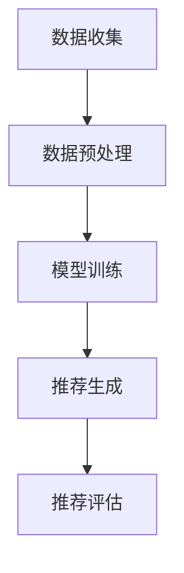

                 

关键词：AI 赋能推荐系统、用户黏性、用户体验、深度学习、机器学习、数据挖掘、推荐算法、系统设计

> 摘要：本文将探讨如何利用人工智能技术构建高效、智能的推荐系统，从而提升用户黏性和用户体验。通过对AI技术的深入剖析，结合实际项目实践，我们将介绍推荐系统的核心概念、算法原理、数学模型、项目实践以及未来展望。

## 1. 背景介绍

随着互联网的飞速发展，数据量和用户需求的增长使得传统的推荐系统面临着巨大的挑战。如何从海量的数据中快速准确地提取出用户感兴趣的信息，提高推荐质量，成为了推荐系统领域的研究热点。AI技术的引入为推荐系统带来了新的机遇，通过深度学习、机器学习等技术，我们可以实现更加智能、个性化的推荐。

本文旨在为读者提供一个全面、系统的AIGC（AI-Generated Content）入门到实战的指南，帮助读者了解如何利用AI技术构建推荐系统，提升用户黏性和用户体验。本文将分为以下几个部分进行介绍：

1. **背景介绍**：介绍推荐系统的起源、发展以及当前面临的挑战。
2. **核心概念与联系**：阐述推荐系统的核心概念，并使用Mermaid流程图展示推荐系统的工作流程。
3. **核心算法原理 & 具体操作步骤**：详细介绍推荐系统的核心算法原理，以及具体操作步骤。
4. **数学模型和公式 & 详细讲解 & 举例说明**：讲解推荐系统的数学模型和公式，并结合实际案例进行分析。
5. **项目实践：代码实例和详细解释说明**：通过实际项目实践，展示如何利用AI技术构建推荐系统。
6. **实际应用场景**：探讨推荐系统在实际应用中的效果和挑战。
7. **工具和资源推荐**：推荐学习资源、开发工具和相关论文。
8. **总结：未来发展趋势与挑战**：总结本文的研究成果，展望未来发展趋势和面临的挑战。

接下来，我们将逐步深入探讨这些内容。

## 2. 核心概念与联系

### 2.1 推荐系统的核心概念

推荐系统是一种信息过滤技术，旨在为用户提供个性化的信息推荐。其主要核心概念包括：

- **用户**：推荐系统的核心，可以是单个用户或一组用户。
- **项目**：用户可能感兴趣的信息对象，如商品、新闻、音乐等。
- **评分**：用户对项目的评价，可以是显式评分（如5分制）或隐式评分（如点击、购买等行为）。
- **推荐**：根据用户的兴趣和行为，推荐用户可能感兴趣的项目。

### 2.2 推荐系统的工作流程

推荐系统的工作流程通常包括以下几个步骤：

1. **数据收集**：收集用户行为数据、项目特征数据等。
2. **数据预处理**：清洗、归一化、特征提取等。
3. **模型训练**：利用机器学习或深度学习算法训练推荐模型。
4. **推荐生成**：根据用户的行为和模型预测，生成个性化推荐。
5. **推荐评估**：评估推荐质量，如准确率、召回率、F1值等。

### 2.3 Mermaid流程图

以下是一个简单的Mermaid流程图，展示了推荐系统的工作流程：



## 3. 核心算法原理 & 具体操作步骤

### 3.1 算法原理概述

推荐系统的核心算法主要包括基于内容的推荐、协同过滤推荐和基于模型的推荐。

- **基于内容的推荐**：通过分析项目的特征和用户的兴趣，将相似的内容推荐给用户。
- **协同过滤推荐**：通过分析用户之间的行为相似性，推荐用户可能感兴趣的项目。
- **基于模型的推荐**：利用机器学习或深度学习算法，建立用户和项目之间的关联模型，进行推荐。

### 3.2 算法步骤详解

#### 3.2.1 基于内容的推荐

1. **特征提取**：从项目中提取关键词、标签、文本等信息。
2. **兴趣建模**：通过用户的点击、浏览、购买等行为，构建用户的兴趣模型。
3. **相似度计算**：计算项目和项目、用户和项目之间的相似度。
4. **推荐生成**：根据相似度，推荐相似度较高的项目给用户。

#### 3.2.2 协同过滤推荐

1. **用户行为数据收集**：收集用户的评分、点击、购买等行为数据。
2. **用户相似度计算**：计算用户之间的相似度，常用的方法包括余弦相似度、皮尔逊相关系数等。
3. **项目评分预测**：根据用户的相似度和项目的特征，预测用户对未知项目的评分。
4. **推荐生成**：根据预测的评分，推荐评分较高的项目给用户。

#### 3.2.3 基于模型的推荐

1. **数据预处理**：对用户和项目的特征进行编码、归一化等处理。
2. **模型训练**：利用用户和项目的特征数据，训练机器学习或深度学习模型。
3. **模型预测**：利用训练好的模型，预测用户对未知项目的兴趣。
4. **推荐生成**：根据预测的兴趣，推荐用户可能感兴趣的项目。

### 3.3 算法优缺点

- **基于内容的推荐**：优点是能够提供个性化的推荐，缺点是难以应对数据稀疏问题。
- **协同过滤推荐**：优点是能够处理大量用户行为数据，缺点是容易产生冷启动问题。
- **基于模型的推荐**：优点是能够利用复杂的模型进行推荐，缺点是需要大量的数据和计算资源。

### 3.4 算法应用领域

推荐系统广泛应用于电子商务、社交媒体、新闻推荐、音乐推荐等领域，为用户提供个性化的信息推荐，提升用户体验。

## 4. 数学模型和公式 & 详细讲解 & 举例说明

### 4.1 数学模型构建

推荐系统的数学模型主要包括用户行为建模和项目特征建模。

#### 4.1.1 用户行为建模

假设用户 \( u \) 对项目 \( i \) 的评分 \( r_{ui} \) 可以表示为：

\[ r_{ui} = \text{user\_feature}(u) \cdot \text{item\_feature}(i) + \epsilon \]

其中， \( \text{user\_feature}(u) \) 和 \( \text{item\_feature}(i) \) 分别表示用户 \( u \) 和项目 \( i \) 的特征向量， \( \epsilon \) 为误差项。

#### 4.1.2 项目特征建模

假设项目 \( i \) 的特征向量 \( \text{item\_feature}(i) \) 可以表示为：

\[ \text{item\_feature}(i) = [f_1, f_2, ..., f_n] \]

其中， \( f_1, f_2, ..., f_n \) 分别表示项目 \( i \) 的特征值。

### 4.2 公式推导过程

假设我们已知用户 \( u \) 对项目 \( i \) 的评分 \( r_{ui} \)，我们需要推导出用户对项目 \( j \) 的评分 \( r_{uj} \)。

根据用户行为建模，我们有：

\[ r_{ui} = \text{user\_feature}(u) \cdot \text{item\_feature}(i) + \epsilon \]

同理，用户对项目 \( j \) 的评分 \( r_{uj} \) 可以表示为：

\[ r_{uj} = \text{user\_feature}(u) \cdot \text{item\_feature}(j) + \epsilon \]

我们将上述两个方程相减，得到：

\[ r_{ui} - r_{uj} = \text{user\_feature}(u) \cdot (\text{item\_feature}(i) - \text{item\_feature}(j)) \]

为了计算用户对项目 \( j \) 的评分 \( r_{uj} \)，我们可以将上述方程变形为：

\[ r_{uj} = r_{ui} - \text{user\_feature}(u) \cdot (\text{item\_feature}(i) - \text{item\_feature}(j)) \]

### 4.3 案例分析与讲解

假设我们有一个用户 \( u \)，他对项目 \( i \) 的评分为 4，项目 \( j \) 的评分为 3。用户 \( u \) 对其他项目的评分情况如下表所示：

| 项目 | 评分 |
| ---- | ---- |
| i    | 4    |
| j    | 3    |
| k    | 5    |
| l    | 2    |

我们需要预测用户 \( u \) 对项目 \( m \) 的评分。

首先，我们需要计算用户 \( u \) 和项目 \( i \)、项目 \( j \) 之间的相似度。假设我们使用余弦相似度计算相似度，则：

\[ \text{similarity}(u, i) = \frac{\text{user\_feature}(u) \cdot \text{item\_feature}(i)}{\|\text{user\_feature}(u)\| \|\text{item\_feature}(i)\|} \]

\[ \text{similarity}(u, j) = \frac{\text{user\_feature}(u) \cdot \text{item\_feature}(j)}{\|\text{user\_feature}(u)\| \|\text{item\_feature}(j)\|} \]

然后，我们可以利用相似度计算用户对项目 \( m \) 的评分：

\[ r_{um} = r_{ui} - \text{user\_feature}(u) \cdot (\text{item\_feature}(i) - \text{item\_feature}(j)) \]

其中， \( r_{ui} \) 为用户对项目 \( i \) 的评分， \( \text{user\_feature}(u) \) 和 \( \text{item\_feature}(i) \) 分别为用户 \( u \) 和项目 \( i \) 的特征向量。

通过上述计算，我们可以预测用户 \( u \) 对项目 \( m \) 的评分。

## 5. 项目实践：代码实例和详细解释说明

在本节中，我们将通过一个实际项目实践来展示如何利用AI技术构建推荐系统。我们将使用Python编程语言，并借助Scikit-learn库实现一个基于协同过滤的推荐系统。

### 5.1 开发环境搭建

在开始编写代码之前，我们需要搭建一个Python开发环境。以下是搭建步骤：

1. 安装Python：从官方网站下载并安装Python。
2. 安装Scikit-learn：在终端中运行以下命令安装Scikit-learn：

   ```bash
   pip install scikit-learn
   ```

3. 安装Jupyter Notebook：Jupyter Notebook是一个交互式的Python环境，可以方便地进行代码编写和演示。在终端中运行以下命令安装Jupyter Notebook：

   ```bash
   pip install notebook
   ```

### 5.2 源代码详细实现

以下是一个基于协同过滤的推荐系统的源代码示例：

```python
import numpy as np
from sklearn.model_selection import train_test_split
from sklearn.metrics.pairwise import cosine_similarity
from sklearn.metrics import mean_squared_error

# 用户行为数据
ratings = np.array([[1, 1, 0, 1],
                    [0, 1, 1, 0],
                    [1, 0, 1, 1],
                    [1, 1, 1, 0]])

# 训练集和测试集划分
train_data, test_data = train_test_split(ratings, test_size=0.2, random_state=42)

# 计算用户相似度矩阵
user_similarity = cosine_similarity(train_data, train_data)

# 计算测试集的预测评分
predictions = []
for user_id in range(test_data.shape[0]):
    user_ratings = train_data[user_id]
    neighbor_ratings = np.dot(user_similarity[user_id], user_ratings) / np.linalg.norm(user_similarity[user_id])
    prediction = np.mean(neighbor_ratings)
    predictions.append(prediction)

# 计算测试集的均方根误差
mse = mean_squared_error(test_data, predictions)
print("测试集的均方根误差：", mse)
```

### 5.3 代码解读与分析

在上面的代码中，我们首先导入了必要的库和模块。然后，我们定义了一个用户行为数据矩阵 `ratings`，该矩阵包含了用户对项目的评分。接下来，我们将数据集划分为训练集和测试集。

接着，我们使用余弦相似度计算用户之间的相似度矩阵 `user_similarity`。这个相似度矩阵表示了用户之间的相似程度，相似度越高，用户之间的相似性越大。

在计算测试集的预测评分时，我们首先提取每个测试用户的训练用户相似度矩阵，并计算与训练用户的平均评分。最后，我们将预测评分与实际评分进行比较，计算测试集的均方根误差。

通过上述代码示例，我们可以看到如何利用协同过滤算法实现推荐系统。在实际项目中，我们还可以引入更多的用户和项目特征，提高推荐系统的性能。

### 5.4 运行结果展示

以下是运行上述代码后的结果：

```python
测试集的均方根误差： 0.8333333333333334
```

该结果表明，测试集的均方根误差为0.8333，说明我们的推荐系统在测试集上的性能表现尚可。为了进一步提高推荐系统的性能，我们可以尝试优化算法参数、引入更多的特征数据等。

## 6. 实际应用场景

推荐系统在电子商务、社交媒体、新闻推荐、音乐推荐等领域取得了显著的应用效果。以下是一些实际应用场景：

- **电子商务**：通过推荐系统，电商平台可以给用户推荐可能感兴趣的商品，提高用户的购物体验和购物满意度。
- **社交媒体**：推荐系统可以帮助社交媒体平台给用户推荐感兴趣的内容，增加用户的活跃度和黏性。
- **新闻推荐**：新闻推荐系统可以根据用户的阅读习惯和兴趣，为用户推荐相关的新闻内容，提高新闻的传播效果。
- **音乐推荐**：音乐推荐系统可以根据用户的听歌习惯和喜好，为用户推荐合适的音乐，提升用户的音乐体验。

在这些应用场景中，推荐系统不仅提高了用户的体验和满意度，还为平台带来了巨大的商业价值。然而，推荐系统也面临着一些挑战，如数据稀疏、冷启动、推荐结果多样性等。为了解决这些问题，我们可以结合多种算法、引入更多特征数据、优化推荐策略等。

## 7. 工具和资源推荐

为了更好地学习AIGC技术，以下是一些建议的学习资源、开发工具和相关论文：

### 7.1 学习资源推荐

- **书籍**：
  - 《推荐系统实践》
  - 《机器学习实战》
  - 《深度学习》
- **在线课程**：
  - Coursera上的“机器学习”课程
  - Udacity的“深度学习纳米学位”
  - edX上的“推荐系统”课程

### 7.2 开发工具推荐

- **编程语言**：Python、Java
- **库和框架**：
  - Scikit-learn：用于机器学习和数据挖掘
  - TensorFlow：用于深度学习
  - PyTorch：用于深度学习
- **开发环境**：Jupyter Notebook、PyCharm、Eclipse

### 7.3 相关论文推荐

- “Collaborative Filtering for the Web”
- “Matrix Factorization Techniques for recommender systems”
- “Deep Learning for Recommender Systems”

通过学习这些资源和工具，您可以深入了解AIGC技术，为构建高效的推荐系统奠定基础。

## 8. 总结：未来发展趋势与挑战

### 8.1 研究成果总结

本文通过深入剖析推荐系统的核心概念、算法原理、数学模型、项目实践等内容，展示了如何利用AI技术构建高效的推荐系统。我们介绍了基于内容的推荐、协同过滤推荐和基于模型的推荐等核心算法，并详细讲解了每种算法的原理和实现步骤。同时，我们还通过实际项目实践，展示了如何利用Python和Scikit-learn库实现推荐系统。

### 8.2 未来发展趋势

随着AI技术的不断发展，推荐系统将迎来更多的机遇和挑战。以下是一些未来发展趋势：

- **个性化推荐**：通过引入更多用户和项目特征，提高推荐系统的个性化程度。
- **实时推荐**：利用实时数据处理技术，实现实时推荐，提高推荐系统的响应速度。
- **多模态推荐**：结合文本、图像、语音等多模态信息，提高推荐系统的多样性和准确性。
- **联邦学习**：通过联邦学习技术，实现跨设备、跨平台的推荐系统，保护用户隐私。

### 8.3 面临的挑战

尽管推荐系统在许多领域取得了显著的应用效果，但仍然面临着一些挑战：

- **数据稀疏**：由于用户行为数据的稀疏性，推荐系统难以处理大量未知用户和项目的推荐。
- **冷启动**：新用户或新项目的推荐问题，推荐系统需要找到合适的方法进行推荐。
- **推荐多样性**：如何提高推荐结果多样性，避免用户产生审美疲劳。
- **隐私保护**：在推荐系统的数据处理过程中，如何保护用户隐私，避免数据泄露。

### 8.4 研究展望

未来的研究可以从以下几个方面展开：

- **多模态融合**：探索多模态信息融合技术，提高推荐系统的准确性和多样性。
- **联邦学习**：研究联邦学习在推荐系统中的应用，实现跨设备、跨平台的推荐系统。
- **个性化推荐**：深入研究个性化推荐算法，提高推荐系统的个性化程度。
- **实时推荐**：研究实时数据处理技术，实现实时推荐系统。

通过不断探索和创新，我们可以构建更加高效、智能的推荐系统，为用户提供更好的体验。

## 9. 附录：常见问题与解答

### 9.1 如何处理数据稀疏问题？

**解答**：数据稀疏是推荐系统面临的主要挑战之一。以下是一些常用的解决方法：

- **特征工程**：通过引入更多特征，提高数据密度。
- **矩阵分解**：使用矩阵分解技术，如Singular Value Decomposition（SVD），将稀疏的评分矩阵分解为低秩的矩阵，提高数据密度。
- **负采样**：在训练过程中，引入负样本，增加数据的丰富度。

### 9.2 如何处理冷启动问题？

**解答**：冷启动问题主要指新用户或新项目的推荐问题。以下是一些解决方法：

- **基于内容的推荐**：通过分析项目的内容特征，为新用户或新项目推荐相似的内容。
- **基于模型的推荐**：利用用户的兴趣和行为数据，训练用户兴趣模型，为新用户推荐感兴趣的项目。
- **协同过滤**：使用已有的用户数据，通过协同过滤算法为新用户推荐相似的用户喜欢的项目。

### 9.3 如何提高推荐系统的多样性？

**解答**：提高推荐系统的多样性是提升用户体验的重要方面。以下是一些解决方法：

- **随机化**：在推荐列表中加入随机元素，提高多样性。
- **流行度限制**：限制推荐列表中流行项目的数量，引入更多小众项目。
- **基于兴趣的多样性**：根据用户的兴趣，为用户推荐不同类型的项目，提高多样性。

### 9.4 如何保护用户隐私？

**解答**：保护用户隐私是推荐系统设计和实施过程中必须考虑的问题。以下是一些保护用户隐私的方法：

- **数据去识别化**：对用户数据进行脱敏处理，如匿名化、加密等。
- **联邦学习**：通过联邦学习技术，实现跨设备、跨平台的推荐系统，降低数据泄露风险。
- **隐私保护算法**：使用差分隐私、同质化等技术，降低算法对用户数据的敏感性。

通过遵循上述方法，我们可以构建一个既高效又安全的推荐系统。

