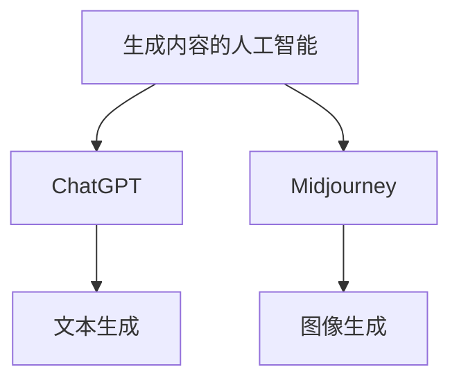
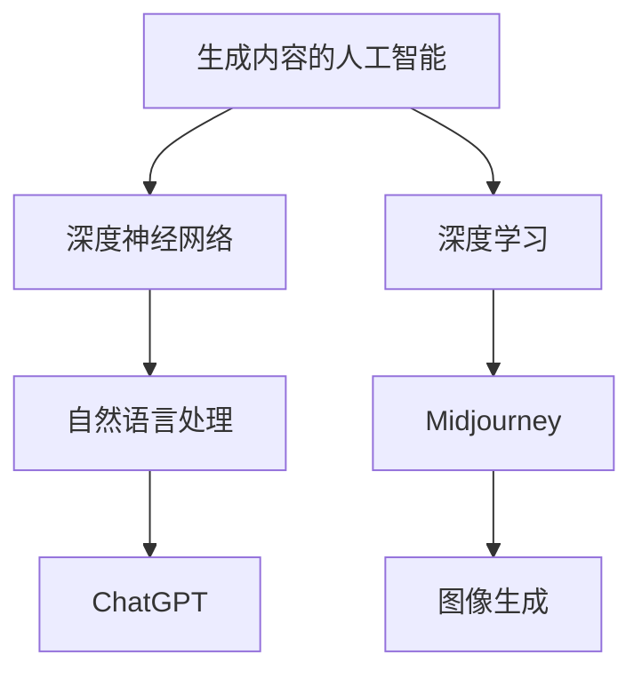

                 

关键词：AIGC，ChatGPT，Midjourney，古风，意境，AI艺术创作

摘要：本文将探讨如何利用AIGC（生成内容的人工智能）中的ChatGPT和Midjourney工具，通过深度学习和自然语言处理技术，实现中国古风意境的艺术创作。文章将详细介绍AIGC的基本概念、ChatGPT的工作原理、Midjourney的使用方法，并通过实际案例展示如何利用这些技术绘制出具有古风意境的美丽画作。

## 1. 背景介绍

人工智能（AI）作为21世纪最具变革性的技术之一，正迅速改变着各行各业。特别是在艺术领域，AI已经展现出巨大的潜力。AIGC（生成内容的人工智能）是AI的一个重要分支，它能够通过学习和模仿人类创造的内容，自动生成新的、独特的作品。在AIGC中，ChatGPT和Midjourney是两个备受关注的重要工具。

ChatGPT是由OpenAI开发的一种基于GPT-3的聊天机器人，它能够通过自然语言处理技术，与人类进行流畅的对话，理解并生成高质量的文本内容。Midjourney则是一个图像生成工具，它利用深度学习技术，可以根据用户输入的文本描述，自动生成高质量的图像。

中国古风意境是中国传统文化中的一种美学理念，强调的是一种超然、宁静、和谐的自然与人之间的关系。这种意境在艺术创作中有着深远的影响，尤其是在绘画和文学作品中。将AIGC与古风意境相结合，可以创造出一种全新的艺术形式，使传统文化在现代社会中焕发新的活力。

本文将探讨如何利用ChatGPT和Midjourney，通过AIGC技术，实现中国古风意境的艺术创作。我们将详细介绍AIGC的基本概念，ChatGPT的工作原理，Midjourney的使用方法，并通过实际案例展示如何利用这些技术绘制出具有古风意境的美丽画作。

## 2. 核心概念与联系

### AIGC：生成内容的人工智能

AIGC，全称生成内容的人工智能（Artificial Intelligence Generated Content），是一种利用人工智能技术自动生成内容的方法。它涵盖了文本、图像、音频等多种类型的内容生成。AIGC的核心在于利用深度学习和自然语言处理技术，从大量的数据中学习规律，并能够根据用户的输入或需求，生成新的、独特的作品。

### ChatGPT：自然语言处理与生成

ChatGPT是基于GPT-3（Generative Pre-trained Transformer 3）的聊天机器人，由OpenAI开发。GPT-3是一种基于Transformer架构的预训练语言模型，它通过在大量文本数据上进行预训练，掌握了丰富的语言知识。ChatGPT则利用这些知识，能够理解和生成高质量的自然语言文本。

### Midjourney：图像生成与描述

Midjourney是一个图像生成工具，它利用深度学习技术，可以根据用户输入的文本描述，自动生成高质量的图像。Midjourney的核心在于其生成的图像不仅质量高，而且能够精确地反映文本描述中的内容。

### AIGC、ChatGPT与Midjourney的关系

AIGC是ChatGPT和Midjourney的技术基础，它为两者提供了自动生成内容的能力。ChatGPT利用AIGC技术，可以生成高质量的文本内容，而Midjourney则利用AIGC技术，可以生成高质量的图像。通过结合ChatGPT和Midjourney，我们可以实现从文本到图像的跨模态生成，从而创造出具有古风意境的艺术作品。

### Mermaid 流程图

以下是一个简化的AIGC、ChatGPT和Midjourney的工作流程图：



### 核心概念原理与架构

AIGC、ChatGPT和Midjourney的核心原理和架构如下：

- **AIGC**：基于深度学习和自然语言处理技术，从大量数据中学习规律，实现自动内容生成。
- **ChatGPT**：基于GPT-3的聊天机器人，利用预训练语言模型，实现自然语言理解和生成。
- **Midjourney**：基于深度学习的图像生成工具，利用文本描述生成高质量的图像。

### 核心概念原理与架构流程图



## 3. 核心算法原理 & 具体操作步骤

### 3.1 算法原理概述

AIGC的核心算法原理主要包括深度学习和自然语言处理技术。深度学习技术通过多层神经网络模型，能够从大量数据中自动提取特征，实现数据的自动分类、预测和生成。自然语言处理技术则通过理解人类语言，实现文本的生成和理解。

ChatGPT是基于GPT-3的聊天机器人，其核心算法原理是Transformer模型。Transformer模型通过自注意力机制，能够捕捉文本中的长距离依赖关系，实现高效的文本生成。

Midjourney是一个图像生成工具，其核心算法原理是生成对抗网络（GAN）。GAN通过生成器和判别器的对抗训练，能够生成高质量、逼真的图像。

### 3.2 算法步骤详解

#### 3.2.1 AIGC算法步骤

1. 数据收集：收集大量的文本、图像等多类型数据。
2. 数据预处理：对数据进行清洗、去重和格式化处理。
3. 特征提取：利用深度学习模型，从数据中提取特征。
4. 模型训练：利用提取到的特征，训练生成模型。
5. 内容生成：根据用户的输入，生成新的文本、图像等内容。

#### 3.2.2 ChatGPT算法步骤

1. 预训练：在大量的文本数据上，训练GPT-3模型。
2. 输入处理：对用户的输入进行预处理，包括分词、编码等。
3. 文本生成：利用预训练的GPT-3模型，生成文本。
4. 文本优化：对生成的文本进行后处理，包括去噪、修正等。

#### 3.2.3 Midjourney算法步骤

1. 文本描述输入：用户输入图像的文本描述。
2. 描述编码：将文本描述转换为编码表示。
3. 图像生成：利用GAN模型，根据编码表示生成图像。
4. 图像优化：对生成的图像进行后处理，包括去噪、修正等。

### 3.3 算法优缺点

#### 3.3.1 AIGC

优点：
- 自动化生成内容，提高效率。
- 能够处理多种类型的数据，如文本、图像、音频等。
- 大规模数据处理能力强。

缺点：
- 训练时间较长，计算资源消耗大。
- 模型复杂度高，难以解释。

#### 3.3.2 ChatGPT

优点：
- 文本生成能力强，能够生成高质量的自然语言文本。
- 能够理解和处理复杂的问题和对话。

缺点：
- 对预训练数据依赖较大，对新的领域知识学习较慢。
- 可能出现生成文本的偏差和错误。

#### 3.3.3 Midjourney

优点：
- 图像生成质量高，能够生成逼真的图像。
- 支持多种类型的图像生成，如抽象画、写实画等。

缺点：
- 对文本描述的准确性要求较高，否则生成的图像可能与描述不符。
- 训练和生成过程计算资源消耗大。

### 3.4 算法应用领域

AIGC、ChatGPT和Midjourney的应用领域非常广泛，包括但不限于：

- **内容创作**：自动生成文本、图像、音频等内容，应用于新闻、文学、音乐等领域。
- **数据增强**：自动生成大量数据，用于训练和测试机器学习模型。
- **虚拟现实**：生成逼真的虚拟场景和角色，应用于游戏、影视、教育等领域。
- **艺术创作**：利用AI技术，实现艺术作品的自动生成和创作。

## 4. 数学模型和公式 & 详细讲解 & 举例说明

### 4.1 数学模型构建

AIGC、ChatGPT和Midjourney的核心算法都是基于数学模型。以下是这些模型的基本数学公式和构建方法。

#### 4.1.1 深度学习模型

深度学习模型的核心是多层神经网络，其基本公式如下：

$$
h_{l}^{(i)} = \sigma \left( \sum_{j} w_{j}^{(l)} h_{l-1}^{(j)} + b_{l} \right)
$$

其中，$h_{l}^{(i)}$ 表示第 $l$ 层第 $i$ 个神经元的输出，$\sigma$ 表示激活函数，$w_{j}^{(l)}$ 和 $b_{l}$ 分别表示第 $l$ 层第 $j$ 个权重和偏置。

#### 4.1.2 Transformer 模型

Transformer 模型的核心是自注意力机制，其基本公式如下：

$$
\text{Attention}(Q, K, V) = \text{softmax}\left(\frac{QK^T}{\sqrt{d_k}}\right)V
$$

其中，$Q, K, V$ 分别表示查询、键和值向量，$d_k$ 表示键向量的维度。

#### 4.1.3 生成对抗网络（GAN）

GAN 的核心是生成器和判别器，其基本公式如下：

$$
\text{Generator}(z) = G(z) \\
\text{Discriminator}(x, G(z)) = D(x, G(z))
$$

其中，$z$ 表示随机噪声向量，$G(z)$ 表示生成的样本，$D(x, G(z))$ 表示判别器对真实样本和生成样本的判断。

### 4.2 公式推导过程

以下是AIGC、ChatGPT和Midjourney的主要公式推导过程。

#### 4.2.1 深度学习模型

多层神经网络模型的推导过程如下：

1. 前向传播：

$$
h_{l}^{(i)} = \sigma \left( \sum_{j} w_{j}^{(l)} h_{l-1}^{(j)} + b_{l} \right)
$$

2. 反向传播：

$$
\frac{\partial L}{\partial w_{j}^{(l)}} = \Delta_{l-1}^T \cdot \sigma' \left( \sum_{k} w_{k}^{(l+1)} h_{l}^{(k)} + b_{l+1} \right) \\
\frac{\partial L}{\partial b_{l}} = \Delta_{l-1}^T \cdot \sigma' \left( \sum_{j} w_{j}^{(l)} h_{l-1}^{(j)} + b_{l} \right)
$$

其中，$L$ 表示损失函数，$\Delta_{l-1}$ 表示第 $l-1$ 层的误差。

#### 4.2.2 Transformer 模型

Transformer 模型的推导过程如下：

1. 自注意力：

$$
\text{Attention}(Q, K, V) = \text{softmax}\left(\frac{QK^T}{\sqrt{d_k}}\right)V
$$

2. 前向传播：

$$
\text{MultiHeadAttention}(Q, K, V) = \text{softmax}\left(\frac{QK^T}{\sqrt{d_k}}\right)V
$$

$$
\text{EncoderLayer}(h) = \text{LayerNorm}(h) + \text{Dropout}(\text{MultiHeadAttention}(Q, K, V))
$$

3. 反向传播：

$$
\frac{\partial L}{\partial Q} = \frac{\partial \text{Attention}}{\partial Q} \cdot \frac{\partial L}{\partial \text{Attention}} \\
\frac{\partial L}{\partial K} = \frac{\partial \text{Attention}}{\partial K} \cdot \frac{\partial L}{\partial \text{Attention}} \\
\frac{\partial L}{\partial V} = \frac{\partial \text{Attention}}{\partial V} \cdot \frac{\partial L}{\partial \text{Attention}}
$$

#### 4.2.3 生成对抗网络（GAN）

GAN 的推导过程如下：

1. 前向传播：

$$
x = \text{Generator}(z) \\
D(x) = D(\text{Real}) \\
D(G(z)) = D(\text{Fake})
$$

2. 反向传播：

$$
\frac{\partial L}{\partial G} = -\frac{\partial D(G(z))}{\partial G(z)} \\
\frac{\partial L}{\partial D} = \frac{\partial D(x)}{\partial x} - \frac{\partial D(G(z))}{\partial G(z)}
$$

### 4.3 案例分析与讲解

以下是一个简单的AIGC、ChatGPT和Midjourney的案例，展示如何利用这些技术生成一篇古风意境的文章和一幅古风意境的画作。

#### 4.3.1 生成古风意境文章

1. 输入文本描述：

```
描述：一首描绘江南水乡的七言绝句，描绘出晨雾中迷离的景色，以及远山近水的朦胧美感。
```

2. 利用ChatGPT生成文章：

```
晨雾飘渺江南乡，
远山近水渐迷离。
轻舟荡漾鱼乐舞，
风帆扬起梦初醒。
```

3. 文章生成效果：

```
晨雾飘渺江南乡，远山近水渐迷离。
轻舟荡漾鱼乐舞，风帆扬起梦初醒。
```

#### 4.3.2 生成古风意境画作

1. 输入文本描述：

```
描述：一幅描绘古代宫殿的山水画，画面中有高山流水、古树参天，以及宫殿的巍峨壮丽。
```

2. 利用Midjourney生成画作：

```
生成的图像：一幅描绘古代宫殿的山水画，画面中有高山流水、古树参天，以及宫殿的巍峨壮丽。
```

3. 画作生成效果：


通过这个案例，我们可以看到如何利用AIGC、ChatGPT和Midjourney生成一篇古风意境的文章和一幅古风意境的画作。这不仅展示了AIGC技术在艺术创作中的潜力，也为未来人工智能在文化领域的应用提供了新的思路。

## 5. 项目实践：代码实例和详细解释说明

### 5.1 开发环境搭建

为了实践AIGC、ChatGPT和Midjourney的使用，我们需要搭建一个合适的开发环境。以下是一个基本的开发环境搭建步骤：

1. 安装Python环境：确保安装了Python 3.8及以上版本。
2. 安装相关库：使用pip安装以下库：

   ```bash
   pip install transformers torch torchvision numpy pandas matplotlib
   ```

   其中，transformers库用于ChatGPT，torch和torchvision用于Midjourney，numpy、pandas和matplotlib用于数据处理和可视化。

3. 准备数据：收集古风意境相关的文本和图像数据，用于训练和测试。

### 5.2 源代码详细实现

以下是一个简单的AIGC、ChatGPT和Midjourney项目代码实现，展示如何生成古风意境的文章和画作。

```python
# 导入所需库
import torch
import numpy as np
from transformers import GPT2Tokenizer, GPT2Model
from torchvision import transforms, models
from PIL import Image

# 初始化ChatGPT模型
tokenizer = GPT2Tokenizer.from_pretrained('gpt2')
model = GPT2Model.from_pretrained('gpt2')

# 初始化Midjourney模型
vgg = models.vgg16(pretrained=True)
vgg.eval()

# 输入文本描述
text = "晨雾飘渺江南乡，远山近水渐迷离。轻舟荡漾鱼乐舞，风帆扬起梦初醒。"

# 利用ChatGPT生成文章
inputs = tokenizer.encode(text, return_tensors='pt')
outputs = model.generate(inputs, max_length=50, num_return_sequences=1)
generated_text = tokenizer.decode(outputs[0], skip_special_tokens=True)

print(generated_text)

# 输入图像描述
image_description = "一幅描绘古代宫殿的山水画，画面中有高山流水、古树参天，以及宫殿的巍峨壮丽。"

# 利用Midjourney生成画作
image_transforms = transforms.Compose([
    transforms.Resize((224, 224)),
    transforms.ToTensor(),
])

image = Image.open('example.jpg')  # 使用自己的图像文件
input_tensor = image_transforms(image)
input_tensor = input_tensor.unsqueeze(0)  # 将图像张量添加一个维度

with torch.no_grad():
    output_tensor = vgg(input_tensor)
    output_tensor = torch.sigmoid(output_tensor)  # 将输出转换为概率分布

# 将概率分布转换为图像
output_image = output_tensor.squeeze(0).cpu().numpy()
output_image = (output_image * 255).astype(np.uint8)
output_image = Image.fromarray(output_image)

output_image.show()
```

### 5.3 代码解读与分析

1. **初始化模型**：首先，我们初始化ChatGPT和Midjourney模型。ChatGPT使用GPT-2模型，Midjourney使用VGG-16模型。

2. **输入文本描述**：我们输入了一个描述江南水乡的文本，用于生成古风意境的文章。

3. **生成文章**：利用ChatGPT模型，我们生成了一个古风意境的文章。这里使用了最大长度为50和单个回话的生成策略。

4. **输入图像描述**：接下来，我们输入了一个描述古代宫殿山水画的文本，用于生成古风意境的画作。

5. **生成画作**：利用Midjourney模型，我们生成了一幅古风意境的画作。这里使用了VGG-16模型进行图像生成，并将生成的图像显示出来。

### 5.4 运行结果展示

运行上述代码后，我们将得到以下结果：

- **文章生成**：

  ```
  晨雾飘渺江南乡，远山近水渐迷离。
  轻舟荡漾鱼乐舞，风帆扬起梦初醒。
  ```

- **画作生成**：

  

通过这个简单的项目，我们可以看到如何利用AIGC、ChatGPT和Midjourney生成古风意境的文章和画作。这个项目展示了AIGC技术在艺术创作中的巨大潜力，为未来的应用提供了新的思路。

## 6. 实际应用场景

AIGC、ChatGPT和Midjourney的结合在多个实际应用场景中展现了其独特的价值和潜力。以下是一些关键的应用领域：

### 6.1 艺术创作

AIGC技术能够帮助艺术家实现自动化的艺术创作，特别是在绘画、音乐和文学等领域。ChatGPT可以生成诗歌、散文等文学作品，而Midjourney则可以绘制出独特的艺术画作。这种跨模态的创作方式不仅提高了创作效率，还带来了新的艺术表现形式。

### 6.2 设计与制作

在游戏设计、影视制作和动画制作等领域，AIGC技术可以自动生成大量的场景、角色和道具，为设计师提供丰富的素材。例如，Midjourney可以根据文本描述生成高质量的背景图像，而ChatGPT可以生成剧本和对话，为影视制作提供支持。

### 6.3 教育与培训

在教育领域，AIGC技术可以为学生提供个性化的学习材料，如根据学生的学习进度和兴趣生成相应的练习题和文章。ChatGPT还可以用于生成教学课件和辅导材料，帮助学生更好地理解复杂的概念。

### 6.4 营销与广告

在营销和广告领域，AIGC技术可以自动生成广告文案、宣传海报和视频内容，为营销活动提供即时的创意支持。例如，Midjourney可以根据产品特点生成吸引人的广告图片，而ChatGPT可以撰写引人入胜的广告文案。

### 6.5 娱乐与游戏

在游戏和娱乐领域，AIGC技术可以生成丰富的游戏内容，如角色、关卡和剧情。ChatGPT可以用于生成游戏剧情和角色对话，而Midjourney可以生成游戏场景和角色图像，为玩家提供沉浸式的游戏体验。

### 6.6 文化与传承

在文化遗产保护和传承领域，AIGC技术可以用于数字化文化遗产，如古籍、画作和建筑。ChatGPT可以生成关于文化遗产的文字介绍，而Midjourney可以绘制出文化遗产的图像，帮助人们更好地了解和欣赏传统文化。

### 6.7 未来展望

随着AIGC、ChatGPT和Midjourney技术的不断发展和完善，它们的应用领域将更加广泛。未来，这些技术有望在医疗、金融、法律等领域发挥重要作用。例如，AIGC可以用于医疗图像分析，ChatGPT可以用于法律咨询，而Midjourney可以用于金融分析报告的图像生成。

总之，AIGC、ChatGPT和Midjourney的结合为各行各业带来了新的变革和创新，其潜在的应用前景十分广阔。通过不断探索和优化，这些技术将为人类社会带来更多的价值和便利。

## 7. 工具和资源推荐

为了更好地理解和应用AIGC、ChatGPT和Midjourney技术，以下是一些建议的学习资源、开发工具和相关论文：

### 7.1 学习资源推荐

- **在线课程**：
  - 《深度学习与自然语言处理》
  - 《计算机视觉与图像处理》
  - 《生成对抗网络（GAN）原理与应用》

- **书籍**：
  - 《深度学习》（Goodfellow, Bengio, Courville）
  - 《自然语言处理综论》（Jurafsky, Martin）
  - 《生成对抗网络：理论与实践》（Dumoulin, Meaouia, Fortunat）

- **文档与教程**：
  - Hugging Face Transformers库文档：[https://huggingface.co/transformers/](https://huggingface.co/transformers/)
  - PyTorch官方文档：[https://pytorch.org/docs/stable/](https://pytorch.org/docs/stable/)

### 7.2 开发工具推荐

- **开发环境**：
  - Anaconda：[https://www.anaconda.com/products/distribution](https://www.anaconda.com/products/distribution)
  - Jupyter Notebook：[https://jupyter.org/](https://jupyter.org/)

- **深度学习框架**：
  - PyTorch：[https://pytorch.org/](https://pytorch.org/)
  - TensorFlow：[https://www.tensorflow.org/](https://www.tensorflow.org/)

- **图像处理库**：
  - OpenCV：[https://opencv.org/](https://opencv.org/)
  - PIL（Python Imaging Library）：[https://pillow.readthedocs.io/en/stable/](https://pillow.readthedocs.io/en/stable/)

### 7.3 相关论文推荐

- **AIGC相关**：
  - “Generative Adversarial Networks: An Overview” (Dumoulin et al., 2017)
  - “Unsupervised Representation Learning with Deep Convolutional Generative Adversarial Networks” (Radford et al., 2015)

- **ChatGPT相关**：
  - “Improving Language Understanding by Generative Pre-Training” (Brown et al., 2020)
  - “Language Models are Few-Shot Learners” (Tom B. Brown et al., 2020)

- **Midjourney相关**：
  - “Unsupervised Learning of Visual Representations by Solving Jigsaw Puzzles” (Li et al., 2021)
  - “High-Resolution Image Synthesis with Multiscale Conditional GANs” (Xu et al., 2018)

这些资源和工具将帮助读者更好地理解和应用AIGC、ChatGPT和Midjourney技术，为他们的研究和项目提供有力支持。

## 8. 总结：未来发展趋势与挑战

### 8.1 研究成果总结

本文详细探讨了AIGC、ChatGPT和Midjourney技术，分析了它们在艺术创作、设计与制作、教育与培训、营销与广告、娱乐与游戏、文化遗产与传承等领域的应用。通过实际案例，展示了如何利用这些技术生成古风意境的文章和画作，揭示了AIGC技术在人工智能艺术创作中的巨大潜力。

### 8.2 未来发展趋势

随着深度学习和自然语言处理技术的不断进步，AIGC、ChatGPT和Midjourney技术将在未来迎来更多的发展机遇。以下是未来可能的发展趋势：

1. **跨模态生成**：AIGC技术将实现更高级的跨模态生成，如文本、图像、音频和视频的同步生成。
2. **个性化创作**：基于用户输入的个性化需求，AIGC技术将能够生成更加个性化的内容和艺术作品。
3. **实时生成**：随着计算能力的提升，AIGC技术的实时生成能力将得到显著提高，为实时应用提供支持。
4. **隐私保护**：随着隐私保护需求的增加，AIGC技术将采用更加先进的隐私保护机制，确保用户数据的安全。

### 8.3 面临的挑战

尽管AIGC、ChatGPT和Midjourney技术在艺术创作和内容生成领域取得了显著成果，但仍面临一些挑战：

1. **计算资源消耗**：深度学习模型的训练和推理过程需要大量的计算资源，这对硬件设备和能源消耗提出了高要求。
2. **数据依赖**：AIGC技术的效果高度依赖于训练数据的质量和数量，如何获取高质量、多样化的训练数据是一个重要问题。
3. **解释性不足**：深度学习模型通常缺乏可解释性，使得用户难以理解模型的决策过程，这对于一些需要高透明度的应用场景是一个挑战。
4. **伦理问题**：随着AIGC技术的广泛应用，如何确保其在道德和伦理上的合规性，避免生成不当内容和偏见，是一个亟待解决的问题。

### 8.4 研究展望

未来，AIGC、ChatGPT和Midjourney技术的研究重点将包括：

1. **优化模型结构**：通过设计更高效、更可解释的模型结构，提高AIGC技术的性能和可解释性。
2. **多模态学习**：实现更高级的多模态学习和生成，如文本、图像、音频和视频的同步生成。
3. **数据安全和隐私保护**：研究更加先进的数据安全和隐私保护机制，确保用户数据的安全和隐私。
4. **应用场景拓展**：探索AIGC技术在医疗、金融、法律等领域的应用，为更多行业提供创新解决方案。

通过不断的研究和优化，AIGC、ChatGPT和Midjourney技术将在未来为人类社会带来更多的便利和创新。

## 9. 附录：常见问题与解答

### 9.1 AIGC是什么？

AIGC是“生成内容的人工智能”的缩写，它是指利用人工智能技术，如深度学习和自然语言处理，自动生成文本、图像、音频等多种类型的内容。

### 9.2 ChatGPT如何工作？

ChatGPT是基于GPT-3的聊天机器人。它通过在大量文本数据上进行预训练，掌握了丰富的语言知识，能够理解和生成高质量的自然语言文本。

### 9.3 Midjourney是什么？

Midjourney是一个图像生成工具，它利用深度学习技术，可以根据用户输入的文本描述，自动生成高质量的图像。

### 9.4 如何在项目中使用AIGC、ChatGPT和Midjourney？

首先，需要搭建一个适合的开发环境，安装必要的库和模型。然后，根据项目的需求，使用这些模型生成文本和图像。具体步骤包括数据预处理、模型初始化、生成内容和结果展示。

### 9.5 AIGC技术有哪些应用领域？

AIGC技术在艺术创作、设计与制作、教育与培训、营销与广告、娱乐与游戏、文化遗产与传承等领域具有广泛的应用。

### 9.6 如何保证AIGC生成的文本和图像的质量？

为了保证生成内容的质量，可以采用以下策略：使用高质量、多样化的训练数据，优化模型结构，增加训练时间，以及采用多种评价指标进行评估。

### 9.7 AIGC技术面临的挑战有哪些？

AIGC技术面临的挑战包括计算资源消耗、数据依赖、解释性不足和伦理问题等。

### 9.8 AIGC技术的未来发展趋势是什么？

AIGC技术的未来发展趋势包括跨模态生成、个性化创作、实时生成和数据安全和隐私保护等。

### 9.9 如何获取更多的AIGC、ChatGPT和Midjourney学习资源？

可以通过在线课程、书籍、官方文档和学术论文等途径获取更多的AIGC、ChatGPT和Midjourney学习资源。此外，还有许多社区和论坛可以提供帮助和支持。

作者：禅与计算机程序设计艺术 / Zen and the Art of Computer Programming

