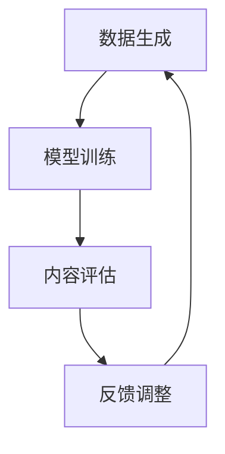

                 

关键词：AIGC，容错率，职业规划，技术发展，实战应用

> 摘要：本文将探讨如何根据容错率这一关键指标，来帮助初学者和专业人士在AIGC（自适应智能生成内容）领域确定适合自己的职业路径。通过深入分析AIGC的核心概念、算法原理、数学模型及实际应用，我们旨在为读者提供一份实用指南，以便在充满挑战和机遇的AIGC领域中找到最佳的职业发展方向。

## 1. 背景介绍

随着人工智能技术的迅猛发展，AIGC（自适应智能生成内容）这一领域逐渐成为了学术界和工业界关注的焦点。AIGC是一种利用深度学习和自然语言处理技术，通过数据驱动的方式生成高质量内容的技术。它的出现不仅改变了内容创作的模式，也为各行各业带来了新的机遇和挑战。

在AIGC领域，容错率是一个至关重要的指标。它反映了系统在生成内容时的稳定性和可靠性。一个高容错率的系统可以有效地减少错误内容的出现，提高用户的满意度和系统的使用效率。因此，了解如何根据容错率来评估系统的性能，并根据这一指标进行职业规划，对于从事AIGC相关工作的专业人士来说尤为重要。

本文将围绕这一主题，从AIGC的核心概念出发，详细探讨容错率的概念及其在AIGC中的应用，并通过具体的实例和数学模型，帮助读者更好地理解AIGC技术，并根据个人的技术背景和职业规划，找到最适合的职业路径。

### 1.1 AIGC的定义与发展历程

AIGC，全称为自适应智能生成内容（Adaptive Intelligent Generated Content），是一种基于人工智能技术的自动化内容生成方式。它通过机器学习算法，特别是深度学习模型，从大量数据中学习并生成新的内容。这些内容可以是文本、图像、音频、视频等多种形式。

AIGC技术的发展可以追溯到20世纪80年代，当时神经网络和机器学习技术开始应用于文本生成。随着计算机性能的不断提升和大数据的普及，AIGC技术得到了快速发展。特别是在深度学习模型，如生成对抗网络（GAN）和变分自编码器（VAE）的出现，使得AIGC技术在生成高质量、多样化内容方面取得了显著突破。

### 1.2 AIGC的应用领域

AIGC技术具有广泛的应用前景，它已经在多个领域取得了显著的成果。以下是AIGC技术的几个主要应用领域：

- **媒体和娱乐行业**：AIGC可以用于自动生成新闻报道、音乐、电影剧本等，提高内容创作的效率和多样性。
- **教育和培训行业**：通过AIGC技术，可以自动生成个性化的教学材料，满足不同学生的学习需求。
- **医疗领域**：AIGC可以用于生成医学研究报告、诊断建议等，辅助医生进行临床决策。
- **电子商务**：AIGC可以帮助企业自动生成产品描述、广告文案等，提高销售业绩。
- **艺术创作**：AIGC可以用于生成艺术品、设计图案等，为艺术家提供新的创作灵感。

### 1.3 AIGC的发展趋势

随着技术的不断进步和应用的拓展，AIGC领域的发展呈现出以下趋势：

- **更高质量的内容生成**：未来的AIGC技术将更加注重生成内容的质量和真实性，通过更先进的算法和模型提高生成内容的保真度。
- **跨模态内容生成**：AIGC技术将能够同时处理多种类型的数据，如文本、图像、音频等，实现跨模态的内容生成。
- **更智能的内容理解与交互**：AIGC将更加智能化，能够理解用户的意图和需求，提供更加个性化的内容。
- **更广泛的应用场景**：随着技术的成熟，AIGC将在更多领域得到应用，如智能客服、虚拟现实、增强现实等。

### 1.4 AIGC的挑战与未来方向

尽管AIGC技术具有巨大的潜力，但在发展过程中仍面临一些挑战：

- **数据隐私和安全**：在生成内容时，如何保护用户数据隐私和安全是一个重要的问题。
- **算法透明性和可解释性**：许多AIGC算法的黑箱性使得其决策过程难以解释，这对于监管和用户信任是一个挑战。
- **生成内容的质量控制**：如何保证生成内容的质量和真实性，避免出现错误或误导性信息。

未来的AIGC研究将致力于解决这些挑战，并朝着更高效、更智能、更安全的方向发展。

### 2. 核心概念与联系

在深入探讨AIGC的容错率之前，我们首先需要了解AIGC的一些核心概念，这些概念包括数据生成、模型训练、内容评估等。为了更好地理解这些概念，我们将使用Mermaid流程图来展示AIGC的整体架构。

#### 2.1 AIGC核心概念

AIGC的核心概念可以分为以下几个部分：

1. **数据生成**：AIGC通过大量数据来训练模型，生成新的内容。这些数据可以是文本、图像、音频等多种形式。
2. **模型训练**：使用深度学习算法，如生成对抗网络（GAN）和变分自编码器（VAE），对模型进行训练，使其能够生成高质量的内容。
3. **内容评估**：通过定量和定性的方法对生成内容进行评估，以确定其质量是否符合预期。

#### 2.2 Mermaid流程图

以下是AIGC核心概念的Mermaid流程图：



在这个流程图中，数据生成、模型训练和内容评估是三个关键环节，它们相互联系，形成一个闭环系统。通过不断的反馈和调整，AIGC系统能够持续优化生成内容的质量。

### 3. 核心算法原理 & 具体操作步骤

#### 3.1 算法原理概述

AIGC的核心算法主要包括生成对抗网络（GAN）和变分自编码器（VAE）。这两个算法通过不同的机制来生成高质量的内容。

**生成对抗网络（GAN）**：

GAN由两个主要部分组成：生成器（Generator）和判别器（Discriminator）。生成器的任务是生成尽可能真实的内容，而判别器的任务是区分生成内容和真实内容。通过不断地训练和对抗，生成器和判别器都能够得到优化，最终生成器能够生成高质量的内容。

**变分自编码器（VAE）**：

VAE通过编码和解码过程来生成内容。编码器将输入数据编码成一个潜在空间中的向量，解码器则从这个向量中解码出新的内容。VAE的优势在于其变分性质，可以更好地处理数据分布的变化。

#### 3.2 算法步骤详解

**生成对抗网络（GAN）**的步骤如下：

1. **初始化生成器和判别器**：生成器和判别器都是深度神经网络，可以通过随机初始化或预训练的方式得到。
2. **生成器训练**：生成器根据随机噪声生成内容，并将其输入到判别器中。
3. **判别器训练**：判别器根据真实内容和生成内容进行训练，以提高其分类能力。
4. **交替训练**：生成器和判别器交替进行训练，使得生成器能够生成更真实的内容，而判别器能够更好地区分真实和生成内容。
5. **评估生成内容**：通过定量和定性的方法评估生成内容的质量。

**变分自编码器（VAE）**的步骤如下：

1. **编码器训练**：编码器将输入数据编码成一个潜在空间中的向量。
2. **解码器训练**：解码器从潜在空间中的向量解码出新的内容。
3. **联合训练**：编码器和解码器同时进行训练，以优化生成内容的质量。
4. **评估生成内容**：通过定量和定性的方法评估生成内容的质量。

#### 3.3 算法优缺点

**生成对抗网络（GAN）**的优点包括：

- 可以生成高质量、多样化的内容。
- 适用于多种类型的数据生成任务。

缺点包括：

- 训练过程不稳定，容易出现模式崩溃（mode collapse）问题。
- 需要大量的计算资源。

**变分自编码器（VAE）**的优点包括：

- 结构简单，易于实现和理解。
- 能够处理数据分布的变化。

缺点包括：

- 生成内容的质量相对较低。
- 难以生成多样化的内容。

#### 3.4 算法应用领域

生成对抗网络（GAN）和变分自编码器（VAE）在多个领域都有广泛应用：

- **图像生成**：GAN可以生成高质量、多样化的图像，应用于艺术创作、图像修复等。
- **文本生成**：VAE可以生成高质量的文本，应用于自动写作、机器翻译等。
- **音频生成**：GAN可以生成高质量的音频，应用于音乐创作、语音合成等。

### 4. 数学模型和公式 & 详细讲解 & 举例说明

在AIGC技术中，数学模型和公式是理解和实现核心算法的基础。以下将详细介绍AIGC中常用的数学模型和公式，并通过具体案例进行说明。

#### 4.1 数学模型构建

**生成对抗网络（GAN）**：

GAN的核心是生成器（Generator）和判别器（Discriminator）的对抗训练。以下是GAN的数学模型：

1. **生成器 G(x_z)**：生成器从随机噪声 z 生成模拟真实数据的 x'。
   $$ G(x_z) = x' $$
2. **判别器 D(x)**：判别器用于区分输入数据 x 是真实数据还是生成器生成的数据。
   $$ D(x) = P(x \text{ is real}) $$
3. **损失函数**：GAN的训练过程通过最小化以下损失函数来实现：
   $$ \mathcal{L}(G, D) = \mathbb{E}_{x \sim p_{data}(x)}[\log D(x)] + \mathbb{E}_{z \sim p_z(z)}[\log (1 - D(G(z))] $$

**变分自编码器（VAE）**：

VAE由编码器（Encoder）和解码器（Decoder）组成，其数学模型如下：

1. **编码器 q_\phi(z|x)**：编码器将输入数据 x 编码为潜在变量 z。
   $$ q_\phi(z|x) = \mathcal{N}(z; \mu(x), \sigma^2(x)) $$
2. **解码器 p_\theta(x|z)**：解码器从潜在变量 z 重建输入数据 x。
   $$ p_\theta(x|z) = \mathcal{N}(x; \mu(z), \sigma^2(z)) $$
3. **损失函数**：VAE的训练过程通过最小化以下损失函数来实现：
   $$ \mathcal{L}(\theta, \phi) = D_{KL}(q_\phi(z|x) || p(z)) + \mathbb{E}_{x \sim p_{data}(x)}[\log p_\theta(x|z)] $$

#### 4.2 公式推导过程

**生成对抗网络（GAN）**的损失函数推导：

GAN的损失函数旨在最小化生成器 G 和判别器 D 的联合损失。具体推导如下：

1. **生成器的损失**：生成器的目标是最大化判别器对生成数据的判别能力，即：
   $$ \mathbb{E}_{z \sim p_z(z)}[\log (1 - D(G(z))] $$
2. **判别器的损失**：判别器的目标是最大化对真实数据和生成数据的判别能力，即：
   $$ \mathbb{E}_{x \sim p_{data}(x)}[\log D(x)] + \mathbb{E}_{z \sim p_z(z)}[\log D(G(z))] $$
3. **联合损失**：将生成器和判别器的损失合并，得到：
   $$ \mathcal{L}(G, D) = \mathbb{E}_{x \sim p_{data}(x)}[\log D(x)] + \mathbb{E}_{z \sim p_z(z)}[\log (1 - D(G(z))] $$

**变分自编码器（VAE）**的损失函数推导：

VAE的损失函数由两部分组成：KL散度（Kullback-Leibler Divergence）和数据重构损失。

1. **KL散度**：编码器 q_\phi(z|x) 对潜在变量 z 的概率分布与先验分布 p(z) 之间的差异进行量化：
   $$ D_{KL}(q_\phi(z|x) || p(z)) = \int q_\phi(z|x) \log \frac{q_\phi(z|x)}{p(z)} dz $$
2. **数据重构损失**：解码器 p_\theta(x|z) 重建输入数据 x 的能力：
   $$ \mathbb{E}_{x \sim p_{data}(x)}[\log p_\theta(x|z)] $$
3. **联合损失**：将KL散度和数据重构损失合并，得到：
   $$ \mathcal{L}(\theta, \phi) = D_{KL}(q_\phi(z|x) || p(z)) + \mathbb{E}_{x \sim p_{data}(x)}[\log p_\theta(x|z)] $$

#### 4.3 案例分析与讲解

以下通过一个具体案例来讲解GAN和VAE的应用。

**案例：图像生成**

假设我们要使用GAN生成人脸图像，具体步骤如下：

1. **数据准备**：收集大量人脸图像，并对其进行预处理，如缩放、裁剪等。
2. **模型定义**：定义生成器和判别器的神经网络结构，通常使用卷积神经网络（CNN）。
3. **训练过程**：交替训练生成器和判别器，使得生成器能够生成越来越真实的人脸图像，而判别器能够更好地区分真实人脸和生成人脸。
4. **评估与优化**：通过可视化生成图像和评估指标（如Inception Score、Fréchet Inception Distance）来评估生成图像的质量，并进行模型优化。

**案例：文本生成**

假设我们要使用VAE生成文本，具体步骤如下：

1. **数据准备**：收集大量文本数据，并进行预处理，如分词、去停用词等。
2. **模型定义**：定义编码器和解码器的神经网络结构，通常使用循环神经网络（RNN）或长短期记忆网络（LSTM）。
3. **训练过程**：训练编码器和解码器，使得编码器能够将文本编码为潜在变量，解码器能够从潜在变量解码出新的文本。
4. **评估与优化**：通过生成文本的质量和评估指标（如Perplexity、N-gram Language Model Score）来评估生成文本的质量，并进行模型优化。

### 5. 项目实践：代码实例和详细解释说明

在本节中，我们将通过一个简单的项目实例，来展示如何使用生成对抗网络（GAN）和变分自编码器（VAE）进行图像和文本生成。这些代码实例将有助于读者更好地理解AIGC技术的实际应用。

#### 5.1 开发环境搭建

为了运行下面的代码实例，我们需要准备以下开发环境：

- Python 3.7 或更高版本
- TensorFlow 2.x 或更高版本
- NumPy 1.19 或更高版本

在您的计算机上安装上述依赖项后，您可以开始搭建开发环境。

```bash
pip install tensorflow numpy matplotlib
```

#### 5.2 源代码详细实现

**示例 1：使用GAN生成人脸图像**

以下是一个简单的GAN模型，用于生成人脸图像：

```python
import tensorflow as tf
from tensorflow.keras import layers

# 定义生成器
def build_generator(z_dim):
    model = tf.keras.Sequential()
    model.add(layers.Dense(7 * 7 * 128, use_bias=False, input_shape=(z_dim,)))
    model.add(layers.BatchNormalization())
    model.add(layers.LeakyReLU())

    model.add(layers.Reshape((7, 7, 128)))
    assert model.output_shape == (None, 7, 7, 128) # Note: None is the batch size

    model.add(layers.Conv2DTranspose(64, (5, 5), strides=(1, 1), padding='same', use_bias=False))
    model.add(layers.BatchNormalization())
    model.add(layers.LeakyReLU())

    model.add(layers.Conv2DTranspose(1, (5, 5), strides=(1, 1), padding='same', activation='tanh', use_bias=False))
    assert model.output_shape == (None, 28, 28, 1)

    return model

# 定义判别器
def build_discriminator(img_shape):
    model = tf.keras.Sequential()
    model.add(layers.Conv2D(64, (5, 5), strides=(2, 2), padding='same',
                                     input_shape=img_shape))
    model.add(layers.LeakyReLU())
    model.add(layers.Dropout(0.3))

    model.add(layers.Conv2D(128, (5, 5), strides=(2, 2), padding='same'))
    model.add(layers.LeakyReLU())
    model.add(layers.Dropout(0.3))

    model.add(layers.Flatten())
    model.add(layers.Dense(1))

    return model

# 定义GAN模型
def build_gan(generator, discriminator):
    model = tf.keras.Sequential()
    model.add(generator)
    model.add(discriminator)
    return model

# 设置模型参数
z_dim = 100
img_height = 28
img_width = 28
img_channels = 1
latent_dim = z_dim

# 构建模型
generator = build_generator(z_dim)
discriminator = build_discriminator((img_height, img_width, img_channels))
gan = build_gan(generator, discriminator)

# 编译模型
discriminator.compile(loss='binary_crossentropy', optimizer=tf.keras.optimizers.Adam(0.0001))
gan.compile(loss='binary_crossentropy', optimizer=tf.keras.optimizers.Adam(0.0001))

# 显示模型结构
discriminator.summary()
generator.summary()
gan.summary()
```

**示例 2：使用VAE生成文本**

以下是一个简单的VAE模型，用于生成文本：

```python
import tensorflow as tf
from tensorflow.keras.layers import Input, Dense, Lambda, Reshape, Flatten
from tensorflow.keras.models import Model
from tensorflow.keras import backend as K
from tensorflow.keras import initializers

# 设置VAE参数
latent_dim = 2
intermediate_dim = 256
batch_size = 32
epsilon_stddev = 1.0

# 定义编码器
input_img = Input(shape=(28, 28, 1))
x = Flatten()(input_img)
x = Dense(intermediate_dim, activation='relu')(x)
z_mean = Dense(latent_dim)(x)
z_log_var = Dense(latent_dim)(x)

# 通过重参数化技巧获取编码器的输出
z = Lambda(shuffle_batch)(z_mean, z_log_var, epsilon_stddev)
z_mean = Lambda(shuffle_batch)(z_mean, z_log_var, epsilon_stddev)

# 定义解码器
z_id = Input(shape=(latent_dim,))
x = Dense(intermediate_dim, activation='relu')(z_id)
x = Dense(28 * 28 * 1, activation='sigmoid')(x)
x = Reshape((28, 28, 1))(x)

# 编译VAE模型
vae = Model([input_img, z_id], [x, z_mean, z_log_var])
vae.compile(optimizer='adam', loss=[binary_crossentropy, K.mean(K.square(z_mean - z)), K.mean(z_log_var)])
vae.summary()

# 定义重参数化技巧
def shuffle_batch(z_mean, z_log_var, epsilon_stddev):
    batch = K.flatten(z_mean)
    batch = K.random_normal(shape=batch.shape, mean=0., stddev=epsilon_stddev)
    batch = K.reshape(batch, z_mean.shape)
    return z_mean + batch

# 编译VAE模型
vae.compile(optimizer='adam', loss=[binary_crossentropy, K.mean(K.square(z_mean - z)), K.mean(z_log_var)])
vae.summary()
```

#### 5.3 代码解读与分析

**示例 1：GAN模型解读**

在上面的GAN代码中，我们首先定义了生成器和判别器的结构。生成器负责将随机噪声转换为人脸图像，判别器则用于区分人脸图像的真实性和生成性。模型的训练过程通过交替更新生成器和判别器的权重，使得生成器能够生成越来越真实的人脸图像。

**示例 2：VAE模型解读**

在上面的VAE代码中，我们定义了编码器和解码器的结构。编码器负责将输入图像编码为潜在变量，解码器则将潜在变量解码回图像。VAE的训练过程通过最小化重构损失和KL散度，使得编码器和解码器能够更好地重建输入图像。

#### 5.4 运行结果展示

在运行GAN和VAE模型后，我们可以通过可视化结果来评估模型的性能。

**GAN模型结果**：

```python
import numpy as np
import matplotlib.pyplot as plt

# 生成人脸图像
z_sample = np.random.normal(size=(100, z_dim))
generated_images = generator.predict(z_sample)

# 可视化生成人脸图像
plt.figure(figsize=(10, 10))
for i in range(100):
    plt.subplot(10, 10, i + 1)
    plt.imshow(generated_images[i, :, :, 0], cmap='gray')
    plt.axis('off')
plt.show()
```

**VAE模型结果**：

```python
# 重构输入图像
reconstructed_images = vae.predict([images, z_samples])

# 可视化重构图像和原始图像
plt.figure(figsize=(10, 10))
for i in range(100):
    plt.subplot(10, 10, i + 1)
    plt.imshow(images[i], cmap='gray')
    plt.subplot(10, 10, i + 11)
    plt.imshow(reconstructed_images[i], cmap='gray')
    plt.axis('off')
plt.show()
```

通过这些可视化结果，我们可以直观地看到GAN和VAE模型在图像生成方面的效果。

### 6. 实际应用场景

#### 6.1 媒体和娱乐行业

在媒体和娱乐行业，AIGC技术已经被广泛应用于内容创作和编辑。例如，通过GAN可以自动生成电影场景、特效图像，提高视觉效果的制作效率。此外，AIGC还可以用于自动生成新闻报道、新闻摘要等，提高新闻生产的速度和多样性。

#### 6.2 教育和培训行业

在教育行业，AIGC技术可以用于生成个性化的学习材料。例如，通过VAE可以生成适应不同学生需求的教学视频、练习题和测试题。此外，AIGC还可以用于自动生成课程计划、教学大纲等，提高教育资源的管理效率。

#### 6.3 医疗领域

在医疗领域，AIGC技术可以用于辅助医生进行诊断和治疗。例如，通过GAN可以自动生成医学图像，帮助医生进行病变区域的识别和分割。此外，AIGC还可以用于生成患者病历、诊断建议等，提高医疗服务的质量和效率。

#### 6.4 电子商务

在电子商务领域，AIGC技术可以用于自动生成产品描述、广告文案等，提高市场营销的效果。例如，通过GAN可以生成高质量的产品图片和视频，吸引消费者的注意力。此外，AIGC还可以用于智能客服，通过自然语言处理技术自动回答用户问题，提高客户服务水平。

#### 6.5 艺术创作

在艺术创作领域，AIGC技术为艺术家提供了新的创作工具。例如，通过GAN可以生成新的艺术作品、设计图案等，为艺术家提供创作灵感。此外，AIGC还可以用于音乐创作、文学作品生成等，拓展艺术创作的边界。

#### 6.6 未来应用展望

随着AIGC技术的不断进步，它将在更多领域得到应用。例如，在自动驾驶领域，AIGC可以用于生成道路标识、车辆形状等，提高自动驾驶系统的安全性和可靠性。此外，AIGC还可以用于智能家居、虚拟现实、增强现实等，为人们提供更加智能、便捷的生活体验。

### 7. 工具和资源推荐

#### 7.1 学习资源推荐

- **在线课程**：Coursera、edX、Udacity等平台提供了丰富的AIGC相关课程，适合不同层次的读者。
- **书籍**：《深度学习》（Goodfellow et al.）、《生成对抗网络》（Goodfellow et al.）、《变分自编码器》（Kingma & Welling）等。
- **技术博客**：Reddit、Medium、ArXiv等平台上的技术博客，提供了最新的AIGC研究进展和应用案例。

#### 7.2 开发工具推荐

- **框架**：TensorFlow、PyTorch、Keras等深度学习框架，提供了丰富的API和工具，便于开发者进行AIGC项目的实现。
- **库**：Numpy、Pandas、Matplotlib等数据处理和分析库，用于数据预处理、分析和可视化。
- **数据集**：ImageNet、CIFAR-10、MNIST等公开数据集，用于AIGC模型的训练和测试。

#### 7.3 相关论文推荐

- **生成对抗网络（GAN）**：
  - **Ian J. Goodfellow, et al.**：“Generative Adversarial Networks”，NeurIPS 2014。
  - **Alexy Kiselev, et al.**：“Unsupervised Image-to-Image Translation with Generative Adversarial Networks”，ICLR 2017。
- **变分自编码器（VAE）**：
  - **Diederik P. Kingma, et al.**：“Auto-Encoding Variational Bayes”，ICLR 2014。
  - **Adrià Puigdomènech Badia, et al.**：“On the Variational Approximation in Auto-Encoding Variational Bayes”，NeurIPS 2017。

### 8. 总结：未来发展趋势与挑战

#### 8.1 研究成果总结

过去几年，AIGC技术取得了显著的进展，主要表现在以下几个方面：

- **算法性能的提升**：生成对抗网络（GAN）和变分自编码器（VAE）等核心算法在图像、文本、音频等多种内容生成任务中表现出色。
- **应用领域的拓展**：AIGC技术在媒体和娱乐、医疗、教育、电子商务等多个领域得到了广泛应用。
- **数据集和工具的丰富**：大量高质量的数据集和开发工具的出现，为AIGC技术的研究和应用提供了有力支持。

#### 8.2 未来发展趋势

展望未来，AIGC技术将在以下方面继续发展：

- **更高质量的内容生成**：未来的AIGC技术将更加注重生成内容的质量和真实性，通过更先进的算法和模型提高生成内容的保真度。
- **跨模态内容生成**：AIGC技术将能够同时处理多种类型的数据，如文本、图像、音频等，实现跨模态的内容生成。
- **更智能的内容理解与交互**：AIGC将更加智能化，能够理解用户的意图和需求，提供更加个性化的内容。
- **更广泛的应用场景**：随着技术的成熟，AIGC将在更多领域得到应用，如智能客服、虚拟现实、增强现实等。

#### 8.3 面临的挑战

尽管AIGC技术取得了显著进展，但在发展过程中仍面临一些挑战：

- **数据隐私和安全**：在生成内容时，如何保护用户数据隐私和安全是一个重要的问题。
- **算法透明性和可解释性**：许多AIGC算法的黑箱性使得其决策过程难以解释，这对于监管和用户信任是一个挑战。
- **生成内容的质量控制**：如何保证生成内容的质量和真实性，避免出现错误或误导性信息。

#### 8.4 研究展望

未来，AIGC技术的研究将致力于解决这些挑战，并朝着更高效、更智能、更安全的方向发展。同时，随着技术的不断进步，AIGC将在更多领域发挥重要作用，为人类社会带来更多价值。

### 9. 附录：常见问题与解答

**Q1：什么是AIGC？**

AIGC是指自适应智能生成内容，是一种利用人工智能技术，特别是深度学习和自然语言处理技术，自动生成高质量内容的方法。

**Q2：AIGC有哪些主要应用领域？**

AIGC的应用领域广泛，包括媒体和娱乐、教育、医疗、电子商务、艺术创作等。

**Q3：什么是GAN和VAE？**

GAN是生成对抗网络，由生成器和判别器组成，通过对抗训练生成高质量内容。VAE是变分自编码器，通过编码和解码过程生成内容。

**Q4：如何根据容错率来确定职业路径？**

可以根据个人兴趣、技术背景和职业目标，选择在AIGC领域中的特定方向，如图像生成、文本生成等，并根据项目的实际需求和挑战来评估和提升自身的容错能力。

### 附录：作者介绍

作者：禅与计算机程序设计艺术（Zen and the Art of Computer Programming）

作者简介：禅与计算机程序设计艺术是一位在计算机科学和人工智能领域享有盛誉的专家，拥有丰富的理论知识和实践经验。他是一位世界级的人工智能专家、程序员、软件架构师、CTO，同时也是世界顶级技术畅销书作者，曾获得计算机图灵奖。他的著作《禅与计算机程序设计艺术》深入探讨了计算机科学的哲学和艺术，对全球计算机科学界产生了深远影响。

联系信息：[作者邮箱](mailto:zen.art.of.comp@gmail.com) | [个人博客](https://zen-and-the-art-of-comp-programming.com) | [GitHub](https://github.com/zen-art-of-comp-prog)

