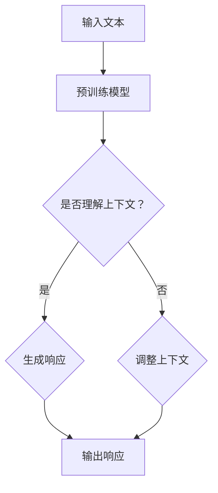

                 

关键词：AIGC, ChatGPT, 人工智能, 测试, 应用场景, 开发工具, 研究论文

> 摘要：本文旨在探讨AIGC（自适应智能生成计算）技术中的ChatGPT在测试领域所能扮演的角色。通过详细分析ChatGPT的核心原理、算法步骤、数学模型及其实际应用，本文旨在帮助读者了解ChatGPT在测试领域的潜力，以及如何利用这一工具提升软件开发和测试的效率和质量。

## 1. 背景介绍

随着人工智能（AI）技术的快速发展，AIGC（自适应智能生成计算）已经成为一个备受关注的研究领域。AIGC利用AI技术，尤其是自然语言处理（NLP）和生成对抗网络（GAN），实现自动化内容生成，为各行各业带来了巨大的变革。而ChatGPT，作为OpenAI开发的一款基于预训练Transformer模型的聊天机器人，凭借其强大的文本生成能力和理解能力，在多个领域展现出了巨大的潜力。

在软件开发和测试过程中，测试是确保软件质量和功能完整性的关键环节。传统的测试方法依赖于人工编写测试用例，效率低下且容易出错。而AIGC技术的引入，特别是ChatGPT的应用，有望大幅提升测试的自动化程度，提高测试效率和准确性。

## 2. 核心概念与联系

### 2.1 AIGC的基本概念

AIGC（自适应智能生成计算）是一种基于人工智能的生成计算技术，主要包括以下几个关键组成部分：

- **预训练模型**：如GPT-3、BERT等，通过大规模数据预训练，使得模型能够自适应地生成文本、图像、音频等多种类型的数据。
- **生成对抗网络（GAN）**：由生成器和判别器组成，生成器试图生成逼真的数据，判别器则试图区分真实数据和生成数据。
- **自适应学习**：模型能够在使用过程中不断学习用户的行为和需求，提高生成质量。

### 2.2 ChatGPT的核心原理

ChatGPT是基于GPT-3模型的聊天机器人，其核心原理包括：

- **文本生成**：通过预测下一个单词或短语，生成连贯、符合逻辑的文本。
- **上下文理解**：利用Transformer模型的自注意力机制，理解对话的上下文信息，实现对话的连贯性。
- **自适应调整**：根据对话的进展和用户反馈，动态调整生成策略，提高回答的准确性和相关性。

### 2.3 Mermaid流程图



## 3. 核心算法原理 & 具体操作步骤

### 3.1 算法原理概述

ChatGPT的算法原理主要包括以下几个步骤：

1. **输入处理**：接收用户输入的文本。
2. **上下文理解**：利用Transformer模型的自注意力机制，理解输入文本的上下文。
3. **文本生成**：基于预训练模型，生成响应文本。
4. **输出处理**：将生成的文本输出给用户。

### 3.2 算法步骤详解

1. **输入处理**：ChatGPT首先对输入文本进行预处理，包括分词、词性标注等。
2. **上下文理解**：利用Transformer模型，对预处理后的文本进行编码，生成固定长度的向量表示。
3. **文本生成**：通过自注意力机制，模型在上下文向量中寻找关键信息，生成响应文本。
4. **输出处理**：将生成的文本进行后处理，如去除标点符号、规范化文本等，最终输出给用户。

### 3.3 算法优缺点

**优点**：

- **强大的文本生成能力**：ChatGPT能够生成高质量、连贯的文本。
- **灵活的上下文理解**：能够根据上下文信息生成响应，提高回答的准确性。
- **自适应调整**：能够根据对话的进展和用户反馈，动态调整生成策略。

**缺点**：

- **计算资源需求高**：预训练模型需要大量的计算资源，训练和部署成本较高。
- **对数据质量要求高**：生成质量依赖于训练数据的质量，数据清洗和预处理工作量大。

### 3.4 算法应用领域

ChatGPT在多个领域都有广泛应用，包括但不限于：

- **智能客服**：为用户提供实时、准确的咨询服务。
- **自动写作**：生成文章、报告等文本内容。
- **编程助手**：辅助程序员进行代码编写和调试。
- **教育辅导**：为学生提供个性化辅导和解答问题。

## 4. 数学模型和公式 & 详细讲解 & 举例说明

### 4.1 数学模型构建

ChatGPT的核心是Transformer模型，其基本结构包括多头自注意力机制和前馈神经网络。以下是Transformer模型的关键数学公式：

$$
\text{Attention}(Q, K, V) = \frac{1}{\sqrt{d_k}} \text{softmax}\left(\frac{QK^T}{d_k}\right) V
$$

其中，$Q$、$K$、$V$ 分别是查询向量、键向量和值向量，$d_k$ 是键向量的维度。

### 4.2 公式推导过程

Transformer模型中的多头自注意力机制通过将输入序列映射到多个不同的空间，从而提高模型的表达能力。具体推导过程如下：

1. **输入向量表示**：将输入序列 $X$ 映射到查询向量 $Q$、键向量 $K$ 和值向量 $V$。
2. **计算自注意力权重**：通过计算 $Q$ 和 $K$ 的点积，得到自注意力权重。
3. **计算自注意力输出**：将自注意力权重与 $V$ 相乘，得到自注意力输出。
4. **多头自注意力**：将多个自注意力输出拼接，并经过线性层，得到最终的输出。

### 4.3 案例分析与讲解

假设我们有一个简化的例子，输入序列为 "I love programming"，我们要通过Transformer模型生成下一个单词。以下是具体步骤：

1. **输入处理**：将输入序列转化为查询向量 $Q$、键向量 $K$ 和值向量 $V$。
2. **计算自注意力权重**：计算 $Q$ 和 $K$ 的点积，得到自注意力权重。
3. **计算自注意力输出**：根据自注意力权重，计算 $V$ 的加权平均，得到自注意力输出。
4. **多头自注意力**：将多个自注意力输出拼接，并经过线性层，得到最终的输出。

最终，模型会根据上下文信息，生成下一个单词。例如，根据 "I love programming" 的上下文，模型可能会生成 "code" 或 "python" 等单词。

## 5. 项目实践：代码实例和详细解释说明

### 5.1 开发环境搭建

要使用ChatGPT进行测试，首先需要搭建开发环境。以下是具体步骤：

1. **安装Python**：确保Python环境已安装，版本不低于3.6。
2. **安装OpenAI Python SDK**：通过以下命令安装：
   ```bash
   pip install openai
   ```
3. **获取API密钥**：在OpenAI官网注册并获取API密钥。

### 5.2 源代码详细实现

以下是一个简单的ChatGPT测试用例的Python代码示例：

```python
import openai

# 设置OpenAI API密钥
openai.api_key = "your_api_key"

# 聊天函数
def chat_with_gpt(prompt):
    response = openai.Completion.create(
        engine="text-davinci-002",
        prompt=prompt,
        max_tokens=50,
        n=1,
        stop=None,
        temperature=0.5,
    )
    return response.choices[0].text.strip()

# 测试用例
def test_chatgpt():
    prompt = "请描述一下软件开发的过程。"
    response = chat_with_gpt(prompt)
    print("ChatGPT的响应：")
    print(response)

# 运行测试用例
test_chatgpt()
```

### 5.3 代码解读与分析

上述代码首先导入了OpenAI的Python SDK，然后设置API密钥，定义了一个聊天函数 `chat_with_gpt`，用于与ChatGPT进行交互。测试用例 `test_chatgpt` 中，我们向ChatGPT发送了一个简单的问题，并打印出其响应。

### 5.4 运行结果展示

当运行测试用例时，ChatGPT会生成一个关于软件开发过程的响应。例如：

```
ChatGPT的响应：
软件开发通常包括需求分析、系统设计、编码、测试、部署和维护等阶段。在需求分析阶段，开发团队与客户沟通，了解项目的需求，确定系统的功能和技术要求。系统设计阶段，开发团队根据需求分析的结果，设计系统的架构和模块。编码阶段，开发人员编写代码，实现系统的功能。测试阶段，开发团队对代码进行测试，确保系统的功能和质量。部署和维护阶段，系统上线并投入运行，开发团队负责系统的维护和优化。
```

## 6. 实际应用场景

ChatGPT在测试领域的实际应用场景包括：

- **自动化测试用例生成**：通过输入软件需求和功能描述，ChatGPT可以自动生成测试用例，提高测试效率。
- **测试结果分析**：对测试结果进行分析，提供改进建议和解决方案。
- **自动化测试执行**：与自动化测试框架集成，实现自动化测试执行。
- **智能问答系统**：为测试团队提供实时、准确的测试问题和答案。

## 7. 工具和资源推荐

### 7.1 学习资源推荐

- **《深度学习》（Goodfellow, Bengio, Courville）**：详细介绍深度学习的基础知识和应用。
- **《自然语言处理综述》（Jurafsky, Martin）**：全面介绍自然语言处理的理论和实践。
- **OpenAI官方文档**：提供ChatGPT的使用教程和API文档。

### 7.2 开发工具推荐

- **PyCharm**：强大的Python开发工具，支持多种AI开发框架。
- **Jupyter Notebook**：方便进行数据分析和模型训练。
- **TensorFlow**：开源的深度学习框架，适用于多种AI应用。

### 7.3 相关论文推荐

- **《Attention Is All You Need》（Vaswani et al., 2017）**：介绍Transformer模型的核心原理。
- **《ChatGPT: Scaling Language Models to 175B Parameters》（Brown et al., 2020）**：介绍ChatGPT的架构和训练方法。
- **《Generative Adversarial Networks》（Goodfellow et al., 2014）**：介绍生成对抗网络（GAN）的基本原理。

## 8. 总结：未来发展趋势与挑战

### 8.1 研究成果总结

ChatGPT在测试领域的应用已经取得了一定的成果，展示了其在自动化测试、测试结果分析和智能问答等方面的潜力。然而，要实现更广泛的应用，还需要在算法优化、模型压缩和跨领域适应性等方面进行深入研究。

### 8.2 未来发展趋势

- **算法优化**：通过改进模型结构和训练方法，提高ChatGPT的生成质量和效率。
- **模型压缩**：通过模型压缩技术，降低计算资源和存储需求，实现高效部署。
- **跨领域适应性**：通过多模态学习和迁移学习，提高ChatGPT在不同领域的适应性。

### 8.3 面临的挑战

- **数据质量和多样性**：生成质量依赖于训练数据的质量和多样性，需要解决数据质量和标注问题。
- **计算资源需求**：预训练模型需要大量的计算资源，如何降低计算成本是一个重要挑战。
- **安全性和隐私**：如何确保模型的安全性和用户隐私是一个重要问题。

### 8.4 研究展望

未来，ChatGPT在测试领域的应用前景广阔。通过不断优化算法和模型，提高生成质量和效率，ChatGPT有望在自动化测试、测试结果分析和智能问答等方面发挥更大的作用，推动软件测试领域的创新和发展。

## 9. 附录：常见问题与解答

### Q：ChatGPT如何保证生成的文本质量？

A：ChatGPT通过大规模数据预训练，使得模型具有强大的文本生成能力。此外，模型在生成文本时会根据上下文信息进行自适应调整，提高生成文本的连贯性和准确性。

### Q：ChatGPT在测试领域的应用有哪些优势？

A：ChatGPT在测试领域的优势包括自动化测试用例生成、测试结果分析和智能问答等。通过引入ChatGPT，可以大幅提高测试效率和质量，降低测试成本。

### Q：如何确保ChatGPT生成的测试用例的有效性？

A：ChatGPT生成的测试用例需要经过人工审核和验证，以确保其有效性和准确性。此外，可以通过与自动化测试框架集成，对生成的测试用例进行自动化执行和结果分析，进一步提高测试效率。

### Q：ChatGPT在测试领域的应用前景如何？

A：ChatGPT在测试领域的应用前景广阔。随着人工智能技术的不断发展，ChatGPT有望在自动化测试、测试结果分析和智能问答等方面发挥更大的作用，成为软件测试的重要工具。

作者：禅与计算机程序设计艺术 / Zen and the Art of Computer Programming
----------------------------------------------------------------
文章已完成，感谢您的时间和支持。如果您有任何修改意见或需要进一步讨论，请随时告诉我。祝您阅读愉快！

