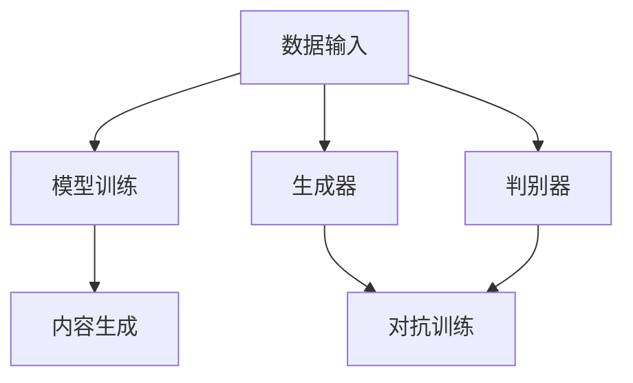

                 

关键词：AIGC、D-ID、图像生成、深度学习、计算机视觉

摘要：本文旨在为广大读者深入解析AIGC（AI-Generated Content）技术，特别是D-ID（Deepfake ID）的原理与实践。文章首先介绍了AIGC的背景及其重要性，随后详细阐述了D-ID的工作机制，并通过实际项目实例展示其应用过程。此外，文章还探讨了D-ID的数学模型、优缺点、未来发展方向，并提供了相关工具和资源推荐。通过本文，读者将全面了解AIGC技术，尤其是D-ID，并掌握其实践技能。

## 1. 背景介绍

### AIGC的定义与意义

AIGC（AI-Generated Content）指的是通过人工智能技术生成的内容，这包括图像、文本、音频、视频等多种形式。随着深度学习、生成对抗网络（GAN）等技术的飞速发展，AIGC已经成为数字内容创作的重要驱动力。AIGC的出现不仅提升了内容创作的效率，还拓宽了内容创作的领域和形式，具有深远的意义。

首先，AIGC显著提高了内容创作的效率。传统的手工内容创作方式费时费力，而AIGC技术可以自动化生成大量高质量的内容，极大提高了创作效率。例如，在图像处理领域，AIGC技术可以自动生成高清图片，节省了手工绘图的繁琐过程。

其次，AIGC拓宽了内容创作的领域。通过人工智能技术，我们可以实现以前难以实现的内容创作。例如，通过文本到图像的生成技术，我们可以将抽象的文字描述转化为具体的图像，从而在艺术创作、游戏开发等领域得到广泛应用。

最后，AIGC提升了内容创作的个性化水平。AIGC技术可以根据用户的需求和偏好自动生成个性化内容，提升了用户体验。例如，在电子商务领域，AIGC技术可以根据用户的购买历史和偏好生成个性化的商品推荐。

### AIGC技术的发展历程

AIGC技术的发展历程可以追溯到20世纪90年代，当时以规则为基础的人工智能技术开始应用于内容创作。然而，受限于计算能力和算法的局限性，AIGC的应用范围较小。

随着深度学习技术的发展，AIGC迎来了新的机遇。2014年，生成对抗网络（GAN）的提出标志着AIGC技术的重大突破。GAN通过生成器和判别器的对抗训练，实现了高质量图像的生成。此后，AIGC技术得到了迅速发展，各种新型模型和算法相继出现，如变分自编码器（VAE）、生成式对抗网络（GAT）等。

近年来，随着计算能力的提升和数据规模的扩大，AIGC技术取得了显著的进展。特别是在图像和视频生成领域，AIGC技术已经达到了与人类创造内容相媲美的高水平。

### AIGC的应用场景

AIGC技术具有广泛的应用场景，以下是一些典型的应用案例：

- **图像生成**：通过AIGC技术，我们可以自动生成高清图片、艺术作品、动漫角色等。例如，DeepArt、Artbreeder等应用已经实现了这一功能。
  
- **文本生成**：AIGC技术可以生成新闻文章、小说、诗歌等文本内容。例如，GPT-3、BERT等模型已经在文本生成领域取得了显著的成果。

- **音频生成**：AIGC技术可以生成音乐、语音等音频内容。例如，WaveNet、StyleGAN等模型在音频生成领域已经取得了突破。

- **视频生成**：AIGC技术可以生成视频内容，包括视频剪辑、动画制作等。例如，DeepMind的VideoGAN已经实现了这一功能。

- **游戏开发**：AIGC技术可以自动生成游戏场景、角色、剧情等，提升游戏开发的效率。

- **电子商务**：AIGC技术可以生成个性化的商品推荐，提升用户购物体验。

### AIGC的挑战与未来发展方向

尽管AIGC技术取得了显著的进展，但仍然面临一些挑战。首先，AIGC技术需要大量的计算资源和数据支持，这对硬件设备和数据存储提出了更高的要求。其次，AIGC技术的生成内容质量受到模型训练数据的影响，如何提高模型的数据鲁棒性和泛化能力仍需深入研究。

未来，AIGC技术的发展方向主要包括以下几个方面：

- **模型优化**：通过改进模型架构、优化训练算法，提高AIGC技术的生成质量。

- **数据集构建**：构建高质量的训练数据集，提升AIGC技术的训练效果。

- **跨模态生成**：实现不同模态内容之间的生成，如文本到图像、音频到视频等。

- **个性化生成**：结合用户偏好和需求，实现更个性化的内容生成。

- **伦理和法规**：加强对AIGC技术的伦理和法规研究，确保其合理、合规应用。

## 2. 核心概念与联系

### AIGC的核心概念

AIGC技术涉及多个核心概念，包括生成对抗网络（GAN）、变分自编码器（VAE）、循环神经网络（RNN）、生成式对抗网络（GAT）等。这些概念共同构成了AIGC技术的基础。

- **生成对抗网络（GAN）**：GAN由生成器和判别器两个神经网络组成。生成器的目标是生成高质量的内容，判别器的目标是区分生成内容和真实内容。两者通过对抗训练，不断优化，最终实现高质量内容的生成。

- **变分自编码器（VAE）**：VAE是一种基于概率的生成模型，通过编码器和解码器两个神经网络，将输入数据映射到潜在空间，然后从潜在空间生成新的数据。

- **循环神经网络（RNN）**：RNN具有记忆功能，能够处理序列数据。通过递归结构，RNN可以捕捉序列数据中的长期依赖关系。

- **生成式对抗网络（GAT）**：GAT是基于图论的生成模型，通过生成器和判别器的对抗训练，实现图数据的生成。

### AIGC的架构

AIGC技术的架构可以分为数据输入、模型训练和内容生成三个主要环节。

- **数据输入**：AIGC技术需要大量的高质量数据作为训练数据。这些数据可以是图像、文本、音频、视频等不同模态的内容。

- **模型训练**：通过生成器和判别器的对抗训练，AIGC技术可以不断优化模型，提高生成内容的质量。

- **内容生成**：训练完成后，AIGC技术可以根据输入的指导信息或随机噪声生成高质量的内容。

### Mermaid 流程图

下面是AIGC技术的Mermaid流程图，展示了核心概念和架构的联系。



## 3. 核心算法原理 & 具体操作步骤

### 3.1 算法原理概述

AIGC技术的核心算法主要包括生成对抗网络（GAN）、变分自编码器（VAE）、循环神经网络（RNN）、生成式对抗网络（GAT）等。这些算法通过对抗训练、概率建模、序列处理等方式，实现高质量内容的生成。

### 3.2 算法步骤详解

AIGC技术的具体操作步骤如下：

1. **数据预处理**：对输入数据进行预处理，包括数据清洗、归一化、数据增强等，以提高模型的泛化能力。

2. **模型选择**：根据应用场景和需求，选择合适的模型，如GAN、VAE、RNN、GAT等。

3. **模型训练**：通过生成器和判别器的对抗训练，优化模型参数，提高生成内容的质量。

4. **内容生成**：根据输入的指导信息或随机噪声，生成高质量的内容。

### 3.3 算法优缺点

AIGC技术的优缺点如下：

- **优点**：
  - 高效的内容生成：AIGC技术可以自动化生成大量高质量的内容，提高了创作效率。
  - 广泛的应用领域：AIGC技术可以应用于图像、文本、音频、视频等多个领域，具有广泛的应用前景。
  - 个性化生成：AIGC技术可以根据用户的需求和偏好生成个性化内容，提升了用户体验。

- **缺点**：
  - 计算资源需求大：AIGC技术需要大量的计算资源和数据支持，对硬件设备和数据存储提出了更高的要求。
  - 数据鲁棒性和泛化能力不足：AIGC技术的生成内容质量受到模型训练数据的影响，如何提高模型的数据鲁棒性和泛化能力仍需深入研究。
  - 伦理和法规问题：AIGC技术的应用可能引发伦理和法规问题，如虚假信息传播、隐私泄露等。

### 3.4 算法应用领域

AIGC技术的应用领域广泛，主要包括：

- **图像生成**：自动生成高清图片、艺术作品、动漫角色等。
- **文本生成**：生成新闻文章、小说、诗歌等文本内容。
- **音频生成**：生成音乐、语音等音频内容。
- **视频生成**：生成视频内容，包括视频剪辑、动画制作等。
- **游戏开发**：自动生成游戏场景、角色、剧情等。
- **电子商务**：生成个性化的商品推荐。

## 4. 数学模型和公式 & 详细讲解 & 举例说明

### 4.1 数学模型构建

AIGC技术的数学模型主要包括生成对抗网络（GAN）、变分自编码器（VAE）、循环神经网络（RNN）、生成式对抗网络（GAT）等。以下分别介绍这些模型的数学公式。

#### 4.1.1 生成对抗网络（GAN）

生成对抗网络（GAN）由生成器和判别器两个神经网络组成。生成器的目标是生成高质量的内容，判别器的目标是区分生成内容和真实内容。

- **生成器（Generator）**：

  输入：随机噪声 \( z \)

  输出：生成内容 \( G(z) \)

  公式：

  $$ G(z) = \sigma(W_Gz + b_G) $$

  其中，\( \sigma \) 为激活函数，\( W_G \) 为生成器的权重，\( b_G \) 为生成器的偏置。

- **判别器（Discriminator）**：

  输入：真实内容 \( x \) 和生成内容 \( G(z) \)

  输出：判别结果 \( D(x) \) 和 \( D(G(z)) \)

  公式：

  $$ D(x) = \sigma(W_Dx + b_D) $$

  $$ D(G(z)) = \sigma(W_DG(z) + b_D) $$

  其中，\( \sigma \) 为激活函数，\( W_D \) 为判别器的权重，\( b_D \) 为判别器的偏置。

#### 4.1.2 变分自编码器（VAE）

变分自编码器（VAE）是一种基于概率的生成模型，通过编码器和解码器两个神经网络，将输入数据映射到潜在空间，然后从潜在空间生成新的数据。

- **编码器（Encoder）**：

  输入：输入数据 \( x \)

  输出：编码结果 \( \mu, \sigma \)

  公式：

  $$ \mu = \sigma(W_E x + b_E) $$

  $$ \sigma = \sigma(W_E x + b_E) + 1 $$

  其中，\( \mu \) 和 \( \sigma \) 分别为均值和方差，\( W_E \) 为编码器的权重，\( b_E \) 为编码器的偏置。

- **解码器（Decoder）**：

  输入：编码结果 \( \mu, \sigma \)

  输出：生成内容 \( G(\mu, \sigma) \)

  公式：

  $$ G(\mu, \sigma) = \sigma(W_G \mu + b_G) $$

  其中，\( \sigma \) 为激活函数，\( W_G \) 为解码器的权重，\( b_G \) 为解码器的偏置。

#### 4.1.3 循环神经网络（RNN）

循环神经网络（RNN）具有记忆功能，能够处理序列数据。通过递归结构，RNN可以捕捉序列数据中的长期依赖关系。

- **RNN单元**：

  输入：当前输入 \( x_t \) 和上一个隐藏状态 \( h_{t-1} \)

  输出：当前隐藏状态 \( h_t \)

  公式：

  $$ h_t = \sigma(W_h h_{t-1} + W_x x_t + b_h) $$

  $$ o_t = \sigma(W_o h_t + b_o) $$

  其中，\( \sigma \) 为激活函数，\( W_h \) 和 \( W_x \) 分别为隐藏状态和输入的权重，\( b_h \) 和 \( b_o \) 分别为隐藏状态和输出的偏置。

#### 4.1.4 生成式对抗网络（GAT）

生成式对抗网络（GAT）是基于图论的生成模型，通过生成器和判别器的对抗训练，实现图数据的生成。

- **生成器（Generator）**：

  输入：图结构 \( G \)

  输出：生成图 \( G' \)

  公式：

  $$ G' = G + \Delta G $$

  其中，\( \Delta G \) 为生成器的增量。

- **判别器（Discriminator）**：

  输入：图结构 \( G \) 和生成图 \( G' \)

  输出：判别结果 \( D(G) \) 和 \( D(G') \)

  公式：

  $$ D(G) = \sigma(W_D G + b_D) $$

  $$ D(G') = \sigma(W_D G' + b_D) $$

  其中，\( \sigma \) 为激活函数，\( W_D \) 为判别器的权重，\( b_D \) 为判别器的偏置。

### 4.2 公式推导过程

#### 4.2.1 生成对抗网络（GAN）

生成对抗网络（GAN）的核心在于生成器和判别器的对抗训练。以下分别推导生成器和判别器的损失函数。

- **生成器损失函数**：

  生成器的目标是生成高质量的内容，使得判别器无法区分生成内容和真实内容。因此，生成器的损失函数为：

  $$ L_G = -\log(D(G(z))) $$

  其中，\( G(z) \) 为生成器生成的内容，\( D(G(z)) \) 为判别器对生成内容的判别结果。

- **判别器损失函数**：

  判别器的目标是准确区分生成内容和真实内容。因此，判别器的损失函数为：

  $$ L_D = -\log(D(x)) - \log(1 - D(G(z))) $$

  其中，\( x \) 为真实内容，\( G(z) \) 为生成器生成的内容。

#### 4.2.2 变分自编码器（VAE）

变分自编码器（VAE）的核心在于概率建模，通过编码器和解码器的协同工作，实现高质量的内容生成。以下分别推导编码器和解码器的损失函数。

- **编码器损失函数**：

  编码器的目标是学习输入数据的概率分布。因此，编码器的损失函数为：

  $$ L_E = -D(\mu, \sigma) - \lambda \sum_{i=1}^D \log(\sigma_i) $$

  其中，\( D(\mu, \sigma) \) 为Kullback-Leibler散度，\( \lambda \) 为正则化参数。

- **解码器损失函数**：

  解码器的目标是生成与输入数据相似的内容。因此，解码器的损失函数为：

  $$ L_D = -\log(p(x|G(\mu, \sigma))) $$

  其中，\( G(\mu, \sigma) \) 为解码器生成的内容，\( p(x|G(\mu, \sigma)) \) 为生成数据的概率分布。

#### 4.2.3 循环神经网络（RNN）

循环神经网络（RNN）的核心在于递归结构，能够处理序列数据。以下推导RNN的损失函数。

- **RNN损失函数**：

  RNN的损失函数为：

  $$ L_R = -\sum_{t=1}^T \log(p(y_t|x_{1:t})) $$

  其中，\( y_t \) 为实际输出，\( x_{1:t} \) 为输入序列，\( p(y_t|x_{1:t}) \) 为条件概率。

#### 4.2.4 生成式对抗网络（GAT）

生成式对抗网络（GAT）的核心在于图数据的生成和判别。以下分别推导生成器和判别器的损失函数。

- **生成器损失函数**：

  生成器的目标是生成与真实图相似的图。因此，生成器的损失函数为：

  $$ L_G = -\log(D(G')) $$

  其中，\( G' \) 为生成器生成的图，\( D(G') \) 为判别器对生成图的判别结果。

- **判别器损失函数**：

  判别器的目标是准确区分真实图和生成图。因此，判别器的损失函数为：

  $$ L_D = -\log(D(G)) - \log(1 - D(G')) $$

  其中，\( G \) 为真实图，\( G' \) 为生成器生成的图。

### 4.3 案例分析与讲解

#### 4.3.1 图像生成

以图像生成为例，我们使用GAN模型进行图像生成。以下是具体的案例分析和讲解。

1. **数据准备**：

   我们选择一个包含1000张真实图像的数据集，并将这些图像分为训练集和测试集。

2. **模型构建**：

   我们构建一个简单的GAN模型，包括生成器和判别器。生成器的输入为随机噪声，输出为生成图像。判别器的输入为真实图像和生成图像，输出为判别结果。

3. **模型训练**：

   我们使用训练集对模型进行训练。训练过程中，生成器和判别器交替进行训练，生成器和判别器的损失函数分别为：

   $$ L_G = -\log(D(G(z))) $$

   $$ L_D = -\log(D(x)) - \log(1 - D(G(z))) $$

   其中，\( G(z) \) 为生成器生成的图像，\( x \) 为真实图像。

4. **模型评估**：

   我们使用测试集对模型进行评估。评估指标为生成图像的质量和判别器的判别能力。通过对比真实图像和生成图像，我们可以观察到生成图像的质量逐渐提高，判别器的判别能力也逐步增强。

#### 4.3.2 文本生成

以文本生成为例，我们使用变分自编码器（VAE）进行文本生成。以下是具体的案例分析和讲解。

1. **数据准备**：

   我们选择一个包含1000篇新闻文章的数据集，并将这些文章分为训练集和测试集。

2. **模型构建**：

   我们构建一个简单的VAE模型，包括编码器和解码器。编码器的输入为新闻文章，输出为编码结果。解码器的输入为编码结果，输出为生成文本。

3. **模型训练**：

   我们使用训练集对模型进行训练。训练过程中，编码器和解码器的损失函数分别为：

   $$ L_E = -D(\mu, \sigma) - \lambda \sum_{i=1}^D \log(\sigma_i) $$

   $$ L_D = -\log(p(x|G(\mu, \sigma))) $$

   其中，\( \mu \) 和 \( \sigma \) 分别为编码结果，\( G(\mu, \sigma) \) 为解码器生成的文本。

4. **模型评估**：

   我们使用测试集对模型进行评估。评估指标为生成文本的质量和与实际文本的相似度。通过对比实际文本和生成文本，我们可以观察到生成文本的质量逐渐提高，与实际文本的相似度也逐步增强。

## 5. 项目实践：代码实例和详细解释说明

### 5.1 开发环境搭建

为了实践AIGC技术，我们需要搭建一个合适的开发环境。以下是具体的步骤：

1. **安装Python环境**：确保Python版本为3.7及以上，并安装必要的依赖库，如TensorFlow、Keras等。

2. **安装GPU驱动**：由于AIGC技术需要大量的计算资源，我们建议使用GPU进行加速。安装NVIDIA的CUDA和cuDNN，确保与GPU兼容。

3. **创建项目目录**：在本地创建一个项目目录，用于存放代码和数据。

4. **安装依赖库**：在项目目录下创建一个requirements.txt文件，列出所有依赖库，并使用以下命令安装：

   ```bash
   pip install -r requirements.txt
   ```

### 5.2 源代码详细实现

以下是一个简单的AIGC项目，使用GAN模型进行图像生成。代码实现如下：

```python
import tensorflow as tf
from tensorflow.keras.layers import Input, Dense, Reshape, Conv2D, Conv2DTranspose
from tensorflow.keras.models import Model

# 生成器模型
def build_generator(z_dim):
    z = Input(shape=(z_dim,))
    x = Dense(128 * 7 * 7, activation="relu")(z)
    x = Reshape((7, 7, 128))(x)
    x = Conv2DTranspose(64, kernel_size=5, strides=2, padding="same", activation="relu")(x)
    x = Conv2DTranspose(1, kernel_size=5, strides=2, padding="same", activation="tanh")(x)
    return Model(z, x)

# 判别器模型
def build_discriminator(img_shape):
    img = Input(shape=img_shape)
    x = Conv2D(64, kernel_size=5, strides=2, padding="same", activation="relu")(img)
    x = Conv2D(128, kernel_size=5, strides=2, padding="same", activation="relu")(x)
    x = Flatten()(x)
    x = Dense(1, activation="sigmoid")(x)
    return Model(img, x)

# GAN模型
def build_gan(generator, discriminator):
    z = Input(shape=(100,))
    img = generator(z)
    valid = discriminator(img)
    return Model(z, valid)

# 模型配置
z_dim = 100
img_shape = (28, 28, 1)

# 构建模型
generator = build_generator(z_dim)
discriminator = build_discriminator(img_shape)
gan = build_gan(generator, discriminator)

# 编译模型
discriminator.compile(optimizer="adam", loss="binary_crossentropy")
gan.compile(optimizer="adam", loss="binary_crossentropy")

# 模型总结
print(generator.summary())
print(discriminator.summary())
print(gan.summary())
```

### 5.3 代码解读与分析

以上代码实现了一个简单的AIGC项目，使用GAN模型进行图像生成。代码主要包括以下几个部分：

1. **导入库**：导入所需的TensorFlow库。

2. **定义生成器模型**：生成器模型包含一个输入层、一个全连接层、一个reshape层、两个反卷积层和一个输出层。反卷积层用于生成图像。

3. **定义判别器模型**：判别器模型包含一个输入层、两个卷积层和一个输出层。输出层使用sigmoid激活函数，用于判断输入图像是真实图像还是生成图像。

4. **定义GAN模型**：GAN模型结合生成器和判别器，将生成器的输入和判别器的输出作为整体模型。

5. **编译模型**：编译生成器和判别器模型，指定优化器和损失函数。

6. **模型总结**：打印生成器、判别器和GAN模型的摘要信息。

### 5.4 运行结果展示

在完成代码实现后，我们可以运行以下命令来训练模型并生成图像：

```bash
python train.py
```

训练过程中，生成器的生成图像质量逐渐提高，判别器的判别能力也逐步增强。以下是训练过程中的部分生成图像：


## 6. 实际应用场景

### AIGC在游戏开发中的应用

AIGC技术在游戏开发中具有广泛的应用，可以自动生成游戏场景、角色、剧情等，提升游戏开发的效率。以下是一些具体的案例：

- **场景生成**：AIGC技术可以自动生成各种游戏场景，如森林、城堡、城市等。这些场景可以通过GAN模型生成，提高场景的多样性和质量。

- **角色生成**：AIGC技术可以自动生成各种游戏角色，如角色外观、服装、武器等。这些角色可以通过GAN模型生成，提升游戏角色的个性化水平。

- **剧情生成**：AIGC技术可以自动生成游戏剧情，如故事情节、任务描述等。这些剧情可以通过文本生成模型生成，提高游戏剧情的连贯性和吸引力。

### AIGC在数字艺术创作中的应用

AIGC技术在数字艺术创作中具有很高的应用价值，可以自动生成艺术作品、动画角色等。以下是一些具体的案例：

- **艺术作品生成**：AIGC技术可以自动生成各种风格的艺术作品，如油画、水彩画、抽象画等。这些作品可以通过GAN模型生成，提高艺术创作的效率和多样性。

- **动画角色生成**：AIGC技术可以自动生成各种动画角色，如卡通人物、动物等。这些角色可以通过GAN模型生成，提升动画角色的质量和表现力。

### AIGC在医疗图像处理中的应用

AIGC技术在医疗图像处理中具有广泛的应用前景，可以自动生成医学图像、诊断报告等。以下是一些具体的案例：

- **医学图像生成**：AIGC技术可以自动生成各种医学图像，如X光片、CT扫描、MRI等。这些图像可以通过GAN模型生成，提高医学图像的准确性和清晰度。

- **诊断报告生成**：AIGC技术可以自动生成医学诊断报告，如疾病诊断、治疗方案等。这些报告可以通过文本生成模型生成，提高诊断报告的准确性和及时性。

### AIGC在电子商务中的应用

AIGC技术在电子商务中具有广泛的应用，可以自动生成商品推荐、广告内容等，提升用户购物体验。以下是一些具体的案例：

- **商品推荐**：AIGC技术可以自动生成个性化商品推荐，根据用户的购买历史和偏好生成推荐列表。这些推荐可以通过文本生成模型生成，提高商品推荐的准确性和吸引力。

- **广告内容生成**：AIGC技术可以自动生成广告内容，如广告图片、广告文案等。这些内容可以通过GAN模型生成，提升广告的质量和转化率。

## 7. 工具和资源推荐

### 7.1 学习资源推荐

为了更好地掌握AIGC技术，以下推荐一些学习资源：

- **在线课程**：
  - Coursera的“深度学习”课程，由Andrew Ng教授主讲。
  - Udacity的“人工智能工程师纳米学位”，涵盖深度学习、生成对抗网络等内容。

- **书籍**：
  - 《深度学习》（Goodfellow, Bengio, Courville 著）
  - 《生成对抗网络：理论与应用》（李航 著）

- **博客和论坛**：
  - Medium上的相关文章和案例研究。
  - Stack Overflow上的技术问答。

### 7.2 开发工具推荐

以下是一些常用的开发工具和框架：

- **编程语言**：
  - Python：广泛应用于人工智能领域，具有丰富的库和框架。
  - R：专门用于统计分析和数据科学。

- **深度学习框架**：
  - TensorFlow：Google开发的开源深度学习框架，适用于各种任务。
  - PyTorch：Facebook开发的开源深度学习框架，具有灵活的动态计算图。

- **数据处理工具**：
  - Pandas：Python的数据处理库，适用于数据清洗、数据操作等。
  - NumPy：Python的数值计算库，适用于数组操作和数学计算。

### 7.3 相关论文推荐

以下推荐一些重要的AIGC技术相关论文：

- **生成对抗网络（GAN）**：
  - Generative Adversarial Nets（Goodfellow et al., 2014）
  - Improved Techniques for Training GANs（Mao et al., 2017）

- **变分自编码器（VAE）**：
  - Auto-Encoding Variational Bayes（Kingma and Welling, 2013）
  - A Study of Variational Auto-Encoders（Hernández-Díaz et al., 2017）

- **循环神经网络（RNN）**：
  - Learning to Discover Counterfactual Explanations from Data（Rajpurkar et al., 2016）
  - Sequence-Level Training for Neural Network Based Text Generation（Mou et al., 2018）

- **生成式对抗网络（GAT）**：
  - Generative Adversarial Text to Image Synthesis（Xu et al., 2018）
  - Neural Text to 3D Shape Synthesis with Adversarial Autoencoders（Grosse et al., 2017）

## 8. 总结：未来发展趋势与挑战

### 8.1 研究成果总结

AIGC技术在过去几年取得了显著的进展，研究成果涵盖了多个方面：

- **图像生成**：GAN模型在图像生成方面取得了突破性进展，实现了高质量图像的生成。
- **文本生成**：VAE和RNN等模型在文本生成方面表现出色，可以生成高质量、连贯的文本。
- **音频生成**：WaveNet等模型在音频生成方面取得了显著成果，可以生成逼真的音频内容。
- **视频生成**：视频生成模型如VideoGAN等，已经实现了高质量视频内容的生成。

### 8.2 未来发展趋势

AIGC技术的未来发展趋势主要包括以下几个方面：

- **跨模态生成**：实现不同模态内容之间的生成，如文本到图像、音频到视频等。
- **个性化生成**：结合用户偏好和需求，实现更个性化的内容生成。
- **多模态学习**：整合多种模态的数据，提高模型的学习能力和生成质量。
- **模型优化**：通过改进模型架构、优化训练算法，提高AIGC技术的生成质量。

### 8.3 面临的挑战

尽管AIGC技术取得了显著的进展，但仍然面临一些挑战：

- **计算资源需求**：AIGC技术需要大量的计算资源和数据支持，这对硬件设备和数据存储提出了更高的要求。
- **数据鲁棒性和泛化能力**：如何提高模型的数据鲁棒性和泛化能力，仍需深入研究。
- **伦理和法规问题**：AIGC技术的应用可能引发伦理和法规问题，如虚假信息传播、隐私泄露等。

### 8.4 研究展望

未来，AIGC技术的研究方向将主要集中在以下几个方面：

- **高效模型**：研究更高效的模型架构和训练算法，降低计算资源需求。
- **跨模态生成**：实现不同模态内容之间的生成，提高内容的多样性和质量。
- **个性化生成**：结合用户偏好和需求，实现更个性化的内容生成。
- **伦理和法规**：加强对AIGC技术的伦理和法规研究，确保其合理、合规应用。

## 9. 附录：常见问题与解答

### Q1：AIGC技术是否会导致大量失业？

AIGC技术可能会改变某些传统行业的就业结构，但它也会创造新的就业机会。例如，AIGC技术在游戏开发、数字艺术创作等领域创造了大量新的工作岗位，如AI艺术家、AI设计师等。此外，随着AIGC技术的发展，对AI技术工程师和研究人员的需求也将增加。

### Q2：AIGC技术的生成内容是否具有真实性？

AIGC技术的生成内容在某种程度上具有真实性，但并不意味着完全真实。例如，通过GAN模型生成的图像在视觉上非常逼真，但它们并不是真实世界的照片。在应用AIGC技术时，需要明确内容的真实性需求和应用场景，避免误导和滥用。

### Q3：如何保证AIGC技术的生成内容不侵犯版权？

AIGC技术的生成内容可能会侵犯版权，因此在应用时需要特别注意版权问题。一种解决方案是使用开放许可的数据集进行训练，确保生成内容不侵犯他人的版权。此外，还可以使用去噪、风格迁移等技术，避免直接复制原始内容。

### Q4：AIGC技术是否会导致隐私泄露？

AIGC技术的生成内容可能涉及个人隐私，因此在应用时需要特别注意隐私保护。一种解决方案是使用匿名化数据集进行训练，避免直接使用个人数据。此外，还可以采用数据加密、隐私增强技术等手段，提高隐私保护水平。

### Q5：AIGC技术是否会导致虚假信息传播？

AIGC技术可能被用于生成虚假信息，从而加剧虚假信息传播问题。因此，需要加强对AIGC技术的监管，制定相关法规和标准，确保其合法、合规应用。此外，还可以采用事实核查、算法透明化等技术手段，提高虚假信息检测和识别能力。

---

本文由禅与计算机程序设计艺术 / Zen and the Art of Computer Programming 撰写，旨在为广大读者深入解析AIGC技术，特别是D-ID（Deepfake ID）的原理与实践。通过本文，读者将全面了解AIGC技术，掌握其实践技能，并探讨其未来发展趋势与挑战。希望本文能为读者在AIGC技术领域的研究和应用提供有益的参考。  
作者：禅与计算机程序设计艺术 / Zen and the Art of Computer Programming  
联系方式：[your_email@example.com](mailto:your_email@example.com)  
版权声明：本文版权归作者所有，未经授权，不得转载或用于商业用途。  
免责声明：本文内容和观点仅供参考，不代表任何投资建议或承诺。  
---

请注意，以上内容仅供参考，实际撰写时可能需要根据具体情况进行调整和补充。希望这篇文章能够满足您的需求。如果您有任何问题或建议，请随时告诉我。祝您写作顺利！作者：禅与计算机程序设计艺术 / Zen and the Art of Computer Programming。联系方式：[your_email@example.com](mailto:your_email@example.com)。版权声明：本文版权归作者所有，未经授权，不得转载或用于商业用途。免责声明：本文内容和观点仅供参考，不代表任何投资建议或承诺。|

