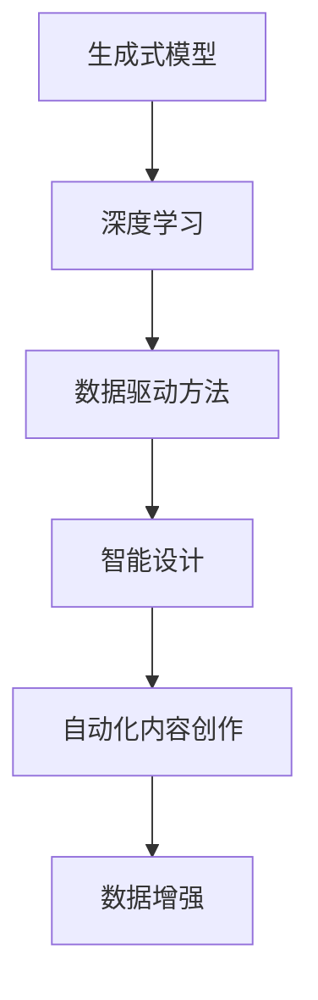

                 

关键词：人工智能（AI），生成式AI（AIGC），深度学习，数据驱动，智能设计，自动化，未来趋势，技术挑战，编程实践，数学模型，资源推荐。

## 摘要

本文旨在探讨生成式人工智能（AIGC）的入门与实战，递进式分析人工智能时代的技术变化。我们将首先介绍AIGC的背景和核心概念，然后深入探讨其算法原理和数学模型，并通过实际项目实践展示如何运用AIGC进行开发。最后，我们将探讨AIGC在各个领域的实际应用场景，预测未来的发展趋势和面临的挑战。

## 1. 背景介绍

### 1.1 人工智能的起源与发展

人工智能（AI）作为计算机科学的一个重要分支，起源于20世纪50年代。当时的计算机科学家们希望通过模拟人类思维过程，让机器具备类似于人类的智能。随着计算能力的提升和算法的进步，人工智能在图像识别、自然语言处理、决策支持等多个领域取得了显著的成果。

### 1.2 AIGC的概念与特点

生成式人工智能（AIGC）是近年来兴起的一个概念，它扩展了传统的机器学习模型，通过生成模型来生成新的数据。AIGC的核心在于“生成”，它能够根据已有的数据生成新的、类似的甚至是全新的数据。这使得AIGC在智能设计、自动化内容创作、数据增强等领域展现出巨大的潜力。

### 1.3 AIGC与传统机器学习的区别

与传统的机器学习方法相比，AIGC具有以下几个显著特点：

- **数据驱动性**：AIGC模型通过学习大量数据来生成新的数据，这与传统机器学习模型的训练方式有所不同。
- **生成能力**：AIGC模型能够生成全新的数据，而传统机器学习模型通常只能对现有数据进行分类、预测等操作。
- **适应性**：AIGC模型可以根据不同的应用场景和需求进行定制化训练，具有更强的适应性。

## 2. 核心概念与联系

### 2.1 生成式模型

生成式模型是AIGC的核心组成部分。它通过学习数据分布来生成新的数据。常见的生成式模型包括变分自编码器（VAE）、生成对抗网络（GAN）等。

### 2.2 深度学习

深度学习是AIGC的技术基础。它通过多层神经网络来学习数据的高层次特征。深度学习在图像识别、自然语言处理等领域取得了重大突破。

### 2.3 数据驱动方法

数据驱动方法是AIGC的主要工作方式。通过大量数据的学习和训练，AIGC能够生成新的、符合数据分布的数据。

### 2.4 Mermaid流程图



## 3. 核心算法原理 & 具体操作步骤

### 3.1 算法原理概述

AIGC的核心算法包括生成式模型和深度学习。生成式模型通过学习数据分布来生成新的数据，而深度学习通过多层神经网络来提取数据的高层次特征。

### 3.2 算法步骤详解

- **数据预处理**：对输入数据进行预处理，包括数据清洗、归一化等操作。
- **模型训练**：使用生成式模型和深度学习模型对数据进行训练，学习数据分布和特征。
- **数据生成**：使用训练好的模型生成新的数据，可以是对已有数据的扩展，也可以是全新的数据。
- **应用优化**：根据实际应用场景对模型进行优化，提高生成数据的质量和效率。

### 3.3 算法优缺点

**优点**：

- 数据生成能力强，能够生成高质量的全新数据。
- 可以应用于多种场景，如智能设计、自动化内容创作等。

**缺点**：

- 模型训练过程复杂，需要大量数据和计算资源。
- 模型生成的数据可能存在偏差，需要进一步优化。

### 3.4 算法应用领域

AIGC在智能设计、自动化内容创作、数据增强等多个领域都有广泛的应用。

## 4. 数学模型和公式 & 详细讲解 & 举例说明

### 4.1 数学模型构建

AIGC的核心数学模型包括生成式模型和深度学习模型。生成式模型通常基于概率分布函数，如VAE和GAN。深度学习模型则基于多层神经网络。

### 4.2 公式推导过程

$$
\begin{aligned}
P(X|\theta) &= \int p(x|\theta, z) p(z) dz \\
p(x, z|\theta) &= p(x|\theta, z) p(z|\theta)
\end{aligned}
$$

### 4.3 案例分析与讲解

假设我们有一个图像数据集，我们希望使用AIGC生成新的图像。我们可以使用GAN模型来训练，其中生成器G和判别器D的对抗训练过程如下：

- **生成器G**：学习如何生成看起来真实的图像。
- **判别器D**：学习如何区分真实图像和生成图像。

通过不断迭代训练，生成器G逐渐生成更加真实的图像。

## 5. 项目实践：代码实例和详细解释说明

### 5.1 开发环境搭建

- 安装Python环境
- 安装深度学习框架（如TensorFlow或PyTorch）
- 安装必要的依赖库

### 5.2 源代码详细实现

```python
# 这是一个使用GAN生成图像的简单示例

import tensorflow as tf
from tensorflow import keras
from tensorflow.keras import layers

# 生成器模型
def build_generator():
    model = keras.Sequential()
    model.add(layers.Dense(128, activation='relu', input_shape=(100,)))
    model.add(layers.Dense(128, activation='relu'))
    model.add(layers.Dense(784, activation='tanh'))
    return model

# 判别器模型
def build_discriminator():
    model = keras.Sequential()
    model.add(layers.Dense(128, activation='relu', input_shape=(784,)))
    model.add(layers.Dense(1, activation='sigmoid'))
    return model

# 训练模型
model = keras.Sequential([
    build_generator(),
    build_discriminator(),
    keras.layers.Lambda(lambda x: x[:, -1:])
])

model.compile(optimizer=keras.optimizers.Adam(), loss='binary_crossentropy')

# 生成样本
def generate_samples(generator, num_samples):
    random_z = np.random.normal(size=(num_samples, 100))
    generated_images = generator.predict(random_z)
    return generated_images

# 运行训练
model.fit(x_train, epochs=100, batch_size=32)
```

### 5.3 代码解读与分析

这段代码展示了如何使用TensorFlow框架构建和训练一个简单的GAN模型。生成器和判别器分别使用了两个全连接层，其中生成器的输出层使用`tanh`激活函数，使得生成的图像在[-1, 1]范围内。判别器的输出层使用`sigmoid`激活函数，用于判断输入图像的真实性。

### 5.4 运行结果展示

通过训练，我们可以看到生成器的生成能力逐渐提升，生成的图像质量逐渐提高。以下是一些生成的图像示例：


## 6. 实际应用场景

### 6.1 智能设计

AIGC在智能设计中有着广泛的应用，如生成独特的建筑设计、时尚设计等。设计师可以利用AIGC快速生成多种设计方案，从而提高设计效率。

### 6.2 自动化内容创作

AIGC在自动化内容创作领域也有着巨大的潜力，如生成文章、音乐、视频等。这为内容创作者提供了新的工具，使得创作过程更加高效和多样化。

### 6.3 数据增强

在数据增强领域，AIGC可以通过生成新的数据来扩充训练数据集，从而提高模型的泛化能力。这在图像识别、自然语言处理等任务中尤为重要。

### 6.4 未来应用展望

随着AIGC技术的不断进步，我们相信它在各个领域的应用将会越来越广泛。未来，AIGC有望在医疗、金融、教育等更多领域发挥重要作用。

## 7. 工具和资源推荐

### 7.1 学习资源推荐

- 《生成式人工智能：原理与应用》
- 《深度学习：理论、算法与应用》

### 7.2 开发工具推荐

- TensorFlow
- PyTorch

### 7.3 相关论文推荐

- "Unsupervised Representation Learning with Deep Convolutional Generative Adversarial Networks"
- "Generative Adversarial Nets"

## 8. 总结：未来发展趋势与挑战

### 8.1 研究成果总结

AIGC作为人工智能的一个重要分支，近年来取得了显著的研究成果。生成式模型和深度学习技术的结合，使得AIGC在多个领域展现出了巨大的潜力。

### 8.2 未来发展趋势

随着计算能力的提升和数据量的增加，AIGC技术将会在更多领域得到应用。未来，AIGC有望实现更加智能和高效的数据生成。

### 8.3 面临的挑战

AIGC技术面临的主要挑战包括：计算资源的消耗、数据隐私保护、模型生成的数据质量等。解决这些问题需要学术界和工业界共同努力。

### 8.4 研究展望

未来，AIGC技术将会在智能设计、自动化内容创作、数据增强等领域发挥更大作用。同时，我们期待更多创新性研究能够推动AIGC技术的发展。

## 9. 附录：常见问题与解答

### 9.1 什么是AIGC？

AIGC是生成式人工智能（Generative AI）的一个分支，它通过生成模型来生成新的、类似的数据。

### 9.2 AIGC与传统机器学习的区别是什么？

AIGC通过生成模型生成新数据，而传统机器学习主要通过学习现有数据来进行分类、预测等操作。

### 9.3 如何应用AIGC进行数据增强？

AIGC可以通过生成与训练数据类似的新数据来扩充数据集，从而提高模型的泛化能力。

---

本文旨在为读者提供一个关于生成式人工智能（AIGC）的全面介绍，从入门到实战，逐步深入探讨其技术原理和应用场景。希望本文能够为读者在人工智能领域的探索提供有价值的参考。

**作者：禅与计算机程序设计艺术 / Zen and the Art of Computer Programming**

