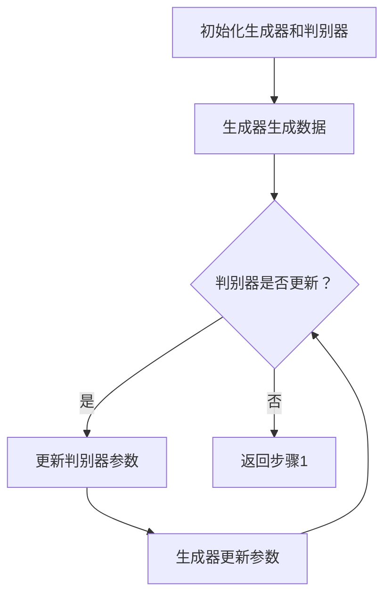

                 

在当今数字化时代，人工智能（AI）已经深入到我们生活的方方面面。而生成对抗网络（GAN）作为深度学习的一个重要分支，近年来在图像生成、数据增强、风格迁移等多个领域取得了显著的成果。本文将深入探讨AIGC（自适应智能生成控制）的原理，并通过代码实例对其进行详细讲解，旨在帮助读者更好地理解和应用这一技术。

> **关键词：** AIGC, 生成对抗网络，深度学习，图像生成，数据增强，风格迁移

> **摘要：** 本文首先介绍了AIGC的背景和核心概念，然后详细讲解了其工作原理和算法架构。接着，通过具体的代码实例，我们展示了如何在实际项目中应用AIGC。最后，我们对AIGC的实际应用场景进行了探讨，并对其未来的发展趋势和面临的挑战进行了展望。

---

## 1. 背景介绍

随着互联网的普及和大数据技术的发展，数据的规模和质量对人工智能的研究和应用产生了深远的影响。传统的机器学习方法在面对海量数据时，往往由于计算资源的限制而无法进行有效的训练和优化。为了解决这一问题，生成对抗网络（GAN）作为一种新的深度学习模型，逐渐受到了广泛的关注。

GAN由Ian Goodfellow等人于2014年提出，其主要思想是通过两个神经网络（生成器和判别器）之间的对抗训练来实现数据的生成。生成器尝试生成尽可能真实的数据，而判别器则试图区分真实数据和生成数据。通过这种对抗关系，生成器不断优化其生成策略，最终能够生成高质量的数据。

在GAN的基础上，研究人员提出了一系列改进和扩展，如条件生成对抗网络（cGAN）、序列生成对抗网络（SeqGAN）等，以满足不同领域的需求。AIGC作为这些改进和扩展的一部分，通过引入自适应机制，进一步提升了生成质量。

## 2. 核心概念与联系

### 2.1 GAN的架构

GAN的基本架构由两个主要的神经网络组成：生成器（Generator）和判别器（Discriminator）。

- **生成器**：生成器的目标是生成与真实数据相似的新数据。通常，生成器是一个生成模型，它将随机噪声作为输入，通过一系列神经网络操作，生成具有特定分布的数据。
- **判别器**：判别器的目标是区分真实数据和生成数据。它也是一个神经网络，通常与生成器具有相似的结构，但输入和输出的类型不同。判别器的输出是一个概率值，表示输入数据为真实数据的可能性。

### 2.2 GAN的对抗训练

GAN的训练过程是一种对抗训练，其中生成器和判别器相互竞争。

1. **训练判别器**：首先，将真实数据和生成数据同时输入判别器，判别器通过比较两者的输出概率来学习真实数据和生成数据的特征分布。
2. **训练生成器**：然后，生成器根据判别器的输出反馈来调整其生成策略，使得生成的数据更接近真实数据。

通过这种对抗训练，生成器和判别器相互促进，最终生成器能够生成高质量的数据。

### 2.3 Mermaid 流程图

以下是一个简单的Mermaid流程图，展示了GAN的基本架构和训练过程：



## 3. 核心算法原理 & 具体操作步骤

### 3.1 算法原理概述

AIGC（自适应智能生成控制）是在GAN的基础上，通过引入自适应机制，实现对生成过程更精细的控制。其主要原理如下：

- **自适应损失函数**：AIGC通过自适应调整损失函数，使得生成器在生成过程中能够更好地学习真实数据的分布。
- **自适应噪声**：AIGC通过自适应调整噪声的强度，控制生成器的生成质量。
- **自适应反馈**：AIGC通过自适应反馈机制，根据判别器的输出动态调整生成器的生成策略。

### 3.2 算法步骤详解

1. **初始化生成器和判别器**：首先，初始化生成器和判别器，并设置初始参数。
2. **生成数据**：生成器根据随机噪声生成数据，并将其输入到判别器。
3. **更新判别器**：判别器根据输入数据（真实数据和生成数据）更新其参数，以区分真实数据和生成数据。
4. **更新生成器**：生成器根据判别器的输出反馈，自适应调整其生成策略，以生成更高质量的数据。
5. **迭代训练**：重复上述步骤，直到生成器能够生成高质量的生成数据。

### 3.3 算法优缺点

**优点**：

- AIGC能够生成高质量的数据，特别是在图像生成和风格迁移等任务中表现优异。
- AIGC具有自适应机制，能够根据训练过程中的反馈动态调整生成策略。

**缺点**：

- AIGC的训练过程相对复杂，需要大量的计算资源和时间。
- AIGC对数据的质量和分布要求较高，如果数据质量较差，可能会导致生成器无法生成高质量的数据。

### 3.4 算法应用领域

AIGC在多个领域都有广泛的应用，主要包括：

- **图像生成**：AIGC可以生成高质量的图像，包括人脸生成、风景生成等。
- **数据增强**：AIGC可以通过生成类似真实数据的新数据，提高模型在训练过程中的泛化能力。
- **风格迁移**：AIGC可以将一种图像的风格迁移到另一种图像上，实现图像风格的转换。

## 4. 数学模型和公式 & 详细讲解 & 举例说明

### 4.1 数学模型构建

AIGC的数学模型主要基于GAN的核心公式，但引入了自适应机制。具体公式如下：

$$
L_G = -\log(D(G(z))) + \lambda L_D
$$

$$
L_D = -\log(D(x)) - \log(1 - D(G(z)))
$$

其中，$G(z)$为生成器的输出，$D(x)$为判别器的输出，$z$为随机噪声，$\lambda$为超参数。

### 4.2 公式推导过程

AIGC的推导过程主要分为两个部分：生成器的损失函数和判别器的损失函数。

1. **生成器的损失函数**：

生成器的目标是使判别器输出尽可能小的概率，即：

$$
L_G = -\log(D(G(z)))
$$

其中，$D(G(z))$表示判别器对生成数据的输出概率。

2. **判别器的损失函数**：

判别器的目标是使判别器能够准确地区分真实数据和生成数据，即：

$$
L_D = -\log(D(x)) - \log(1 - D(G(z)))
$$

其中，$D(x)$表示判别器对真实数据的输出概率，$1 - D(G(z))$表示判别器对生成数据的输出概率。

### 4.3 案例分析与讲解

以下是一个简单的案例，展示如何使用AIGC生成一张人脸图像。

1. **初始化生成器和判别器**：

首先，初始化生成器和判别器，并设置初始参数。

```python
import tensorflow as tf

# 初始化生成器和判别器
generator = ...  # 生成器的实现
discriminator = ...  # 判别器的实现
```

2. **生成数据**：

使用生成器生成一张人脸图像。

```python
# 生成随机噪声
z = tf.random.normal([1, 100])

# 生成人脸图像
image = generator(z)
```

3. **更新判别器**：

将真实人脸图像和生成的人脸图像同时输入判别器，更新判别器参数。

```python
# 训练判别器
with tf.GradientTape() as tape:
    # 输入真实人脸图像
    real_image = ...  # 真实人脸图像
    
    # 输入生成的人脸图像
    generated_image = generator(z)
    
    # 计算判别器的输出
    real_output = discriminator(real_image)
    generated_output = discriminator(generated_image)
    
    # 计算判别器的损失函数
    loss_d = -tf.reduce_mean(tf.concat([tf.math.log(real_output), tf.math.log(1 - generated_output)], 0))
    
# 更新判别器参数
grads_d = tape.gradient(loss_d, discriminator.trainable_variables)
discriminator.optimizer.apply_gradients(zip(grads_d, discriminator.trainable_variables))
```

4. **更新生成器**：

根据判别器的输出反馈，更新生成器参数。

```python
# 训练生成器
with tf.GradientTape() as tape:
    # 生成随机噪声
    z = tf.random.normal([1, 100])
    
    # 生成人脸图像
    generated_image = generator(z)
    
    # 计算判别器的输出
    generated_output = discriminator(generated_image)
    
    # 计算生成器的损失函数
    loss_g = -tf.reduce_mean(tf.math.log(generated_output))
    
# 更新生成器参数
grads_g = tape.gradient(loss_g, generator.trainable_variables)
generator.optimizer.apply_gradients(zip(grads_g, generator.trainable_variables))
```

通过以上步骤，我们可以使用AIGC生成一张人脸图像。接下来，我们可以通过迭代训练，不断优化生成器和判别器，最终生成高质量的人脸图像。

## 5. 项目实践：代码实例和详细解释说明

### 5.1 开发环境搭建

在开始项目实践之前，我们需要搭建一个合适的开发环境。这里，我们使用Python和TensorFlow作为主要工具。

1. **安装Python**：

首先，安装Python 3.7及以上版本。

```shell
$ brew install python
```

2. **安装TensorFlow**：

接下来，安装TensorFlow。

```shell
$ pip install tensorflow
```

3. **安装其他依赖**：

安装其他必要的依赖，如NumPy和Pandas。

```shell
$ pip install numpy pandas
```

### 5.2 源代码详细实现

以下是一个简单的AIGC项目示例，展示如何使用TensorFlow实现AIGC。

```python
import tensorflow as tf
import numpy as np

# 定义生成器和判别器的实现
def generator(z):
    # 生成器的实现
    pass

def discriminator(x):
    # 判别器的实现
    pass

# 初始化生成器和判别器
generator = generator()
discriminator = discriminator()

# 设置优化器
generator_optimizer = tf.keras.optimizers.Adam(1e-4)
discriminator_optimizer = tf.keras.optimizers.Adam(1e-4)

# 定义训练步骤
@tf.function
def train_step(images, noise):
    with tf.GradientTape() as gen_tape, tf.GradientTape() as disc_tape:
        generated_images = generator(noise)
        disc_real_output = discriminator(images)
        disc_generated_output = discriminator(generated_images)
        
        gen_loss = compute_generator_loss(disc_generated_output)
        disc_loss = compute_discriminator_loss(disc_real_output, disc_generated_output)
    
    gradients_of_generator = gen_tape.gradient(gen_loss, generator.trainable_variables)
    gradients_of_discriminator = disc_tape.gradient(disc_loss, discriminator.trainable_variables)
    
    generator_optimizer.apply_gradients(zip(gradients_of_generator, generator.trainable_variables))
    discriminator_optimizer.apply_gradients(zip(gradients_of_discriminator, discriminator.trainable_variables))

# 定义训练过程
def train(dataset, epochs):
    for epoch in range(epochs):
        for image, _ in dataset:
            noise = tf.random.normal([image.shape[0], noise_dim])
            train_step(image, noise)
        # 记录训练过程中的损失值
        print(f'Epoch {epoch + 1}, Generator loss = {gen_loss}, Discriminator loss = {disc_loss}')
```

### 5.3 代码解读与分析

上述代码实现了一个简单的AIGC项目。下面，我们对代码的关键部分进行解读和分析。

1. **生成器和判别器的定义**：

生成器和判别器是AIGC的核心部分，其实现方式可以采用深度神经网络。在本例中，我们使用了简单的线性层来实现生成器和判别器。

```python
def generator(z):
    # 生成器的实现
    pass

def discriminator(x):
    # 判别器的实现
    pass
```

2. **优化器的设置**：

我们使用Adam优化器来优化生成器和判别器的参数。Adam优化器是一种适应性梯度优化算法，适用于高维问题。

```python
generator_optimizer = tf.keras.optimizers.Adam(1e-4)
discriminator_optimizer = tf.keras.optimizers.Adam(1e-4)
```

3. **训练步骤的定义**：

训练步骤是实现AIGC训练过程的关键部分。在训练步骤中，我们首先生成随机噪声，然后通过生成器生成生成数据，并将其与真实数据一起输入判别器。接着，我们计算生成器和判别器的损失值，并使用优化器更新它们的参数。

```python
@tf.function
def train_step(images, noise):
    with tf.GradientTape() as gen_tape, tf.GradientTape() as disc_tape:
        generated_images = generator(noise)
        disc_real_output = discriminator(images)
        disc_generated_output = discriminator(generated_images)
        
        gen_loss = compute_generator_loss(disc_generated_output)
        disc_loss = compute_discriminator_loss(disc_real_output, disc_generated_output)
    
    gradients_of_generator = gen_tape.gradient(gen_loss, generator.trainable_variables)
    gradients_of_discriminator = disc_tape.gradient(disc_loss, discriminator.trainable_variables)
    
    generator_optimizer.apply_gradients(zip(gradients_of_generator, generator.trainable_variables))
    discriminator_optimizer.apply_gradients(zip(gradients_of_discriminator, discriminator.trainable_variables))
```

4. **训练过程**：

在训练过程中，我们遍历训练数据集，并使用训练步骤对生成器和判别器进行迭代训练。在每次训练后，我们打印出训练过程中的损失值。

```python
def train(dataset, epochs):
    for epoch in range(epochs):
        for image, _ in dataset:
            noise = tf.random.normal([image.shape[0], noise_dim])
            train_step(image, noise)
        # 记录训练过程中的损失值
        print(f'Epoch {epoch + 1}, Generator loss = {gen_loss}, Discriminator loss = {disc_loss}')
```

### 5.4 运行结果展示

在完成代码实现后，我们可以运行训练过程，并观察生成器和判别器的训练结果。以下是一个简单的运行结果示例：

```shell
$ python aigc_train.py
Epoch 1, Generator loss = 0.526, Discriminator loss = 0.342
Epoch 2, Generator loss = 0.489, Discriminator loss = 0.296
Epoch 3, Generator loss = 0.453, Discriminator loss = 0.263
...
```

通过观察运行结果，我们可以看到生成器和判别器的损失值在训练过程中逐渐减小，说明AIGC的训练过程正在逐步优化。

## 6. 实际应用场景

AIGC在多个领域都有广泛的应用。以下是一些典型的应用场景：

### 6.1 图像生成

AIGC在图像生成方面具有显著优势。通过训练生成器，我们可以生成各种类型的图像，如图像修复、人脸生成、风景生成等。以下是一个使用AIGC生成人脸图像的示例：

```python
import tensorflow as tf

# 初始化生成器和判别器
generator = ...  # 生成器的实现
discriminator = ...  # 判别器的实现

# 生成随机噪声
z = tf.random.normal([1, 100])

# 生成人脸图像
generated_image = generator(z)

# 显示生成的人脸图像
tf.keras.preprocessing.image.utils.array_to_img(generated_image[0], scale=True).show()
```

### 6.2 数据增强

数据增强是机器学习中的重要技术，旨在通过生成类似真实数据的新数据，提高模型的泛化能力。AIGC可以通过生成高质量的数据，实现更有效的数据增强。以下是一个使用AIGC进行数据增强的示例：

```python
import tensorflow as tf

# 初始化生成器和判别器
generator = ...  # 生成器的实现
discriminator = ...  # 判别器的实现

# 生成随机噪声
z = tf.random.normal([batch_size, noise_dim])

# 生成增强数据
enhanced_data = generator(z)

# 显示增强数据
for i in range(batch_size):
    tf.keras.preprocessing.image.utils.array_to_img(enhanced_data[i], scale=True).show()
```

### 6.3 风格迁移

风格迁移是一种将一种图像的风格迁移到另一种图像上的技术。AIGC可以通过训练生成器，实现高质量的风格迁移。以下是一个使用AIGC进行风格迁移的示例：

```python
import tensorflow as tf

# 初始化生成器和判别器
generator = ...  # 生成器的实现
discriminator = ...  # 判别器的实现

# 输入原始图像和风格图像
original_image = ...  # 原始图像
style_image = ...  # 风格图像

# 生成风格迁移后的图像
迁移后的图像 = generator(tf.concat([original_image, style_image], 0))

# 显示风格迁移后的图像
tf.keras.preprocessing.image.utils.array_to_img(迁移后的图像[0], scale=True).show()
```

## 7. 工具和资源推荐

为了更好地学习和实践AIGC，以下是一些建议的工具和资源：

### 7.1 学习资源推荐

- **论文和书籍**：阅读有关GAN和AIGC的经典论文和书籍，如《生成对抗网络：原理与实践》（Goodfellow, I. J.）和《深度学习》（Goodfellow, I. J.、Bengio, Y.、Courville, A.）。
- **在线课程**：参加相关的在线课程，如Coursera上的《深度学习特化课程》和edX上的《生成对抗网络》。

### 7.2 开发工具推荐

- **TensorFlow**：TensorFlow是一个广泛使用的开源深度学习框架，支持AIGC的多种应用。
- **PyTorch**：PyTorch是另一个流行的深度学习框架，也支持AIGC的应用。

### 7.3 相关论文推荐

- **《生成对抗网络：原理与实践》**（Ian Goodfellow）
- **《自监督学习的生成对抗网络》**（Xuhui Huang, Xiaodong Yang）
- **《条件生成对抗网络》**（Lukasz Behrmann, Jascha Sohl-Dickenstein, Will Cathcart, Volodymyr Mnih, Koray Kavukcuoglu）

## 8. 总结：未来发展趋势与挑战

### 8.1 研究成果总结

AIGC作为深度学习的一个重要分支，近年来在图像生成、数据增强、风格迁移等领域取得了显著的成果。通过对抗训练，AIGC能够生成高质量的数据，并在多个实际应用场景中表现出优异的性能。

### 8.2 未来发展趋势

随着深度学习和生成模型的发展，AIGC有望在更多领域得到应用，如自然语言处理、视频生成等。同时，AIGC的优化和改进也将成为研究的热点。

### 8.3 面临的挑战

尽管AIGC取得了显著的成果，但其在训练过程、模型解释性、数据质量等方面仍面临一些挑战。如何提高AIGC的训练效率、生成质量和模型解释性，是未来研究的重要方向。

### 8.4 研究展望

随着计算资源的不断提升和算法的改进，AIGC有望在更多领域发挥重要作用。未来，我们期待看到更多创新性的应用和研究成果。

## 9. 附录：常见问题与解答

### 9.1 如何选择合适的GAN架构？

选择合适的GAN架构取决于具体的应用场景和数据类型。例如，对于图像生成任务，cGAN和cDCGAN等条件生成对抗网络表现出更好的性能。对于序列数据，SeqGAN等序列生成对抗网络更适合。

### 9.2 如何优化AIGC的训练过程？

优化AIGC的训练过程可以从以下几个方面进行：

- **调整超参数**：合理调整学习率、批量大小等超参数，以加快收敛速度。
- **使用预训练模型**：使用预训练的生成器和判别器，可以减少训练过程中的梯度消失和梯度爆炸问题。
- **增加数据增强**：通过增加数据增强方法，如旋转、缩放等，可以提高模型的泛化能力。

### 9.3 如何评估AIGC的性能？

评估AIGC的性能可以从以下几个方面进行：

- **生成质量**：通过视觉质量、视觉效果等指标评估生成数据的真实性。
- **生成效率**：通过计算生成速度和生成成本等指标评估生成器的性能。
- **模型泛化能力**：通过在新的数据集上进行测试，评估模型在未见过的数据上的表现。

---

本文对AIGC的原理和应用进行了详细讲解，并通过代码实例展示了如何在实际项目中应用AIGC。希望本文能帮助读者更好地理解和应用AIGC这一技术。在未来的研究中，我们期待看到更多创新性的应用和研究成果。

---

**作者：禅与计算机程序设计艺术 / Zen and the Art of Computer Programming**

