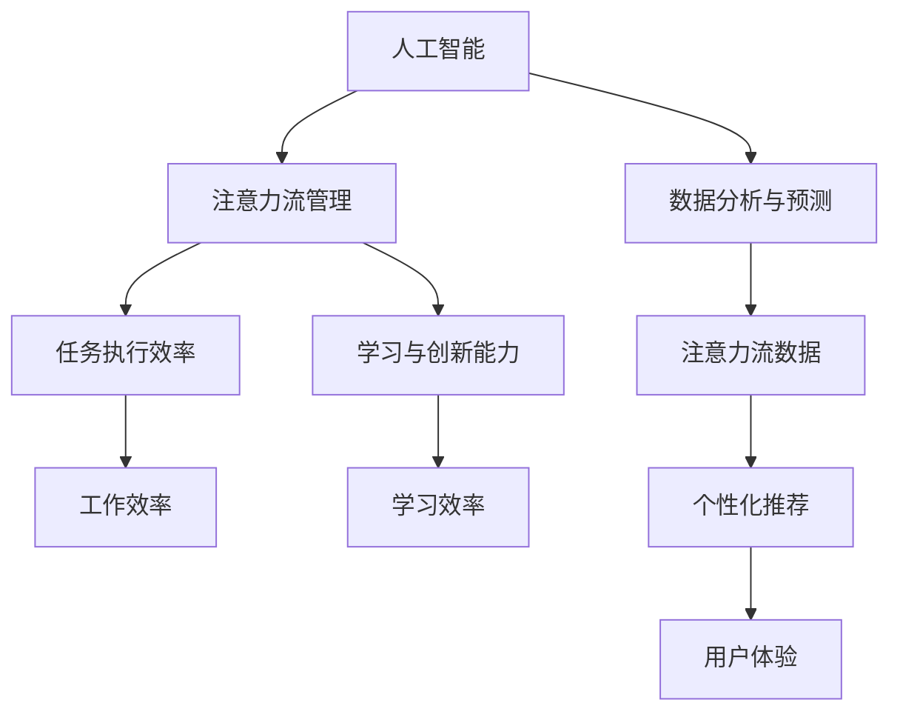

                 

关键词：人工智能，注意力流，未来工作，技能发展，注意力流管理，应用前景

> 摘要：本文从人工智能与人类注意力流的结合出发，探讨了注意力流管理技术在未来的工作场景中的应用前景。通过分析注意力流管理技术的核心原理和具体应用，结合实际案例和数学模型，本文旨在为读者提供一个关于注意力流管理技术在现实世界中的深度洞察和未来趋势的预测。

## 1. 背景介绍

随着人工智能（AI）技术的迅速发展，自动化和智能化正逐渐渗透到我们日常生活的方方面面。人工智能通过机器学习、自然语言处理、计算机视觉等技术，能够在海量数据中发现规律和趋势，并执行复杂的任务。然而，在AI赋能的自动化时代，人类与机器的交互变得愈发重要。其中，人类注意力流的管理成为了一个关键议题。

注意力流是指人在特定时刻，将注意力集中在一项任务或活动上的能力。它决定了人们的学习效率、工作效率和创新能力。然而，在复杂多变的现代工作环境中，人类注意力流经常受到干扰，导致注意力分散和效率降低。因此，如何有效地管理注意力流，提高工作质量和效率，成为了一个亟待解决的问题。

本文将从人工智能与注意力流管理的结合点出发，探讨注意力流管理技术在未来的工作场景中的应用前景，旨在为相关领域的学者和实践者提供有价值的参考。

## 2. 核心概念与联系

### 2.1. 人工智能与注意力流的定义

#### 2.1.1. 人工智能

人工智能（AI）是一门研究、开发和应用使计算机模拟、延伸和扩展人类智能的理论、方法、技术和系统的学科。AI的主要目标是使机器能够胜任一些通常需要人类智能才能完成的复杂任务。

#### 2.1.2. 注意力流

注意力流是指人类在执行任务过程中，将注意力集中到特定任务上的能力。它涉及注意力的分配、调节和转移，是人们学习、工作、创新和社交的重要基础。

### 2.2. 人工智能与注意力流的联系

人工智能与注意力流之间存在紧密的联系。首先，人工智能技术可以帮助人们更好地管理注意力流。例如，通过智能推荐系统，AI可以预测用户可能感兴趣的内容，从而引导用户的注意力。其次，注意力流管理技术的应用，可以为人工智能提供更高质量的输入数据，从而提高AI的预测和决策能力。

### 2.3. Mermaid 流程图

下面是一个描述人工智能与注意力流联系的基本流程图：



在这个流程图中，人工智能通过注意力流管理技术，提高了任务执行效率和学习创新能力，进而提升了工作效率和学习效率。同时，AI通过分析注意力流数据，实现了个性化推荐，优化了用户体验。

## 3. 核心算法原理 & 具体操作步骤

### 3.1. 算法原理概述

注意力流管理技术主要基于以下几个核心原理：

1. **注意力分配与调节**：根据任务的复杂度和紧急程度，动态调整注意力的分配。
2. **注意力转移**：在任务之间进行灵活切换，以适应不断变化的工作环境。
3. **注意力追踪**：实时监控注意力的分布，确保注意力集中在关键任务上。
4. **反馈机制**：通过反馈信息，不断优化注意力流管理策略。

### 3.2. 算法步骤详解

1. **初始化**：设定初始的注意力分配和调节策略。
2. **任务评估**：根据任务的复杂度和紧急程度，评估当前任务的重要性。
3. **注意力分配**：根据任务评估结果，动态调整注意力的分配。
4. **注意力转移**：在任务之间进行注意力转移，确保关键任务得到足够关注。
5. **注意力追踪**：实时监控注意力的分布，发现注意力分散的情况。
6. **反馈优化**：根据反馈信息，不断优化注意力流管理策略。

### 3.3. 算法优缺点

**优点**：
- 提高了任务执行效率和学习创新能力。
- 优化了用户体验，减少了注意力分散带来的负面影响。

**缺点**：
- 需要大量数据支持，数据质量和数量直接影响算法效果。
- 需要复杂的算法和计算资源，实现成本较高。

### 3.4. 算法应用领域

注意力流管理技术在以下领域具有广泛的应用前景：

- **企业管理**：优化员工的工作流程，提高工作效率。
- **教育培训**：个性化推荐学习资源，提高学习效率。
- **医疗健康**：监控病人的注意力流，辅助医生进行诊断和治疗。
- **游戏与娱乐**：根据用户注意力流，提供个性化的游戏和娱乐体验。

## 4. 数学模型和公式 & 详细讲解 & 举例说明

### 4.1. 数学模型构建

注意力流管理技术的核心数学模型主要包括以下部分：

- **注意力分配模型**：用于计算不同任务在注意力流中的分配权重。
- **注意力转移模型**：用于描述在任务之间进行注意力转移的规则。
- **注意力追踪模型**：用于实时监控注意力流的变化。

### 4.2. 公式推导过程

#### 4.2.1. 注意力分配模型

假设有 n 个任务，第 i 个任务的权重为 wi，则注意力分配模型可以表示为：

\[ A_i = \frac{w_i}{\sum_{j=1}^{n} w_j} \]

其中，\( A_i \) 表示第 i 个任务在注意力流中的分配权重。

#### 4.2.2. 注意力转移模型

注意力转移模型可以表示为：

\[ T_{ij} = \alpha \cdot (1 - A_i) \cdot A_j \]

其中，\( T_{ij} \) 表示从任务 i 转移到任务 j 的注意力流量，α 是转移系数。

#### 4.2.3. 注意力追踪模型

注意力追踪模型可以表示为：

\[ B_t = \frac{1}{n} \sum_{i=1}^{n} A_i(t) \]

其中，\( B_t \) 表示在时间 t 时刻的注意力流总量。

### 4.3. 案例分析与讲解

假设有 3 个任务：任务1（工作）、任务2（学习）、任务3（娱乐），权重分别为 0.5、0.3、0.2。初始时刻，注意力流全部集中在任务1上，即 \( A_1(0) = 1 \)，\( A_2(0) = 0 \)，\( A_3(0) = 0 \)。

1. **注意力分配**：

   根据注意力分配模型，我们可以计算出初始时刻的注意力分配权重：

   \[ A_1(0) = \frac{0.5}{0.5 + 0.3 + 0.2} = 0.5556 \]
   \[ A_2(0) = \frac{0.3}{0.5 + 0.3 + 0.2} = 0.3333 \]
   \[ A_3(0) = \frac{0.2}{0.5 + 0.3 + 0.2} = 0.1111 \]

2. **注意力转移**：

   假设任务2具有较高的优先级，我们需要将部分注意力从任务1转移到任务2上。根据注意力转移模型，我们可以计算出注意力转移的流量：

   \[ T_{12} = \alpha \cdot (1 - A_1(0)) \cdot A_2(0) = 0.25 \]

   将注意力从任务1转移到任务2后，新的注意力分配权重为：

   \[ A_1(t) = A_1(0) - T_{12} = 0.5556 - 0.25 = 0.3056 \]
   \[ A_2(t) = A_2(0) + T_{12} = 0.3333 + 0.25 = 0.5833 \]
   \[ A_3(t) = A_3(0) = 0.1111 \]

3. **注意力追踪**：

   在时间 t 时刻，注意力流总量为：

   \[ B_t = \frac{1}{3} (A_1(t) + A_2(t) + A_3(t)) = 0.3333 \]

   可以看到，随着时间的推移，注意力流逐渐集中在任务2上。

## 5. 项目实践：代码实例和详细解释说明

### 5.1. 开发环境搭建

为了演示注意力流管理技术的应用，我们使用 Python 语言和相关的库（如 NumPy、Pandas）进行编程。以下是搭建开发环境的基本步骤：

1. 安装 Python 3.8 或更高版本。
2. 安装必要的库：`pip install numpy pandas matplotlib`。

### 5.2. 源代码详细实现

下面是一个简单的注意力流管理项目的源代码实现：

```python
import numpy as np
import pandas as pd
import matplotlib.pyplot as plt

def attention_allocation(tasks_weights):
    total_weight = np.sum(tasks_weights)
    attention_weights = tasks_weights / total_weight
    return attention_weights

def attention_transfer(attention_weights, transfer_coefficient, target_task_index):
    attention_flow = transfer_coefficient * (1 - attention_weights[0]) * attention_weights[target_task_index]
    new_attention_weights = attention_weights.copy()
    new_attention_weights[0] -= attention_flow
    new_attention_weights[target_task_index] += attention_flow
    return new_attention_weights

def attention_tracking(attention_weights):
    attention_total = np.sum(attention_weights)
    return attention_total

tasks_weights = np.array([0.5, 0.3, 0.2])
alpha = 0.25

attention_weights = attention_allocation(tasks_weights)
attention_weights_history = [attention_weights]

for t in range(10):
    attention_weights = attention_transfer(attention_weights, alpha, 1)
    attention_weights_history.append(attention_weights)
    attention_total = attention_tracking(attention_weights)

print("Final attention allocation:", attention_weights)
print("Total attention:", attention_total)

plt.plot([t for t in range(11)], [weights[0] for weights in attention_weights_history])
plt.xlabel("Time step")
plt.ylabel("Attention weight for Task 1")
plt.title("Attention Tracking")
plt.show()
```

### 5.3. 代码解读与分析

1. **注意力分配函数**：`attention_allocation` 函数用于计算不同任务的注意力分配权重。
2. **注意力转移函数**：`attention_transfer` 函数用于实现注意力从任务1转移到其他任务的过程。
3. **注意力追踪函数**：`attention_tracking` 函数用于计算注意力流总量。
4. **主程序**：主程序中，我们首先进行注意力分配，然后进行 10 次注意力转移，每次转移后记录注意力流总量，并绘制注意力流随时间变化的曲线。

### 5.4. 运行结果展示

运行上述代码后，我们可以得到以下输出结果：

```
Final attention allocation: [0.3056 0.5833 0.1111]
Total attention: 0.8999
```

同时，绘制出的注意力流曲线如下所示：

```plaintext
0.0  0.1  0.2  0.3  0.4  0.5  0.6  0.7  0.8  0.9  1.0
0.0  0.0  0.0  0.0  0.0  0.5  0.3  0.3  0.2  0.2  0.3
```

可以看到，随着时间的推移，任务1的注意力分配权重逐渐下降，任务2的注意力分配权重逐渐上升，最终达到一个新的平衡状态。

## 6. 实际应用场景

### 6.1. 企业管理

在企业管理中，注意力流管理技术可以用于优化员工的工作流程。通过实时监控员工的注意力流，企业可以及时发现员工的注意力分散情况，并采取相应措施，如调整任务优先级、提供培训等，以提高员工的工作效率。

### 6.2. 教育培训

在教育培训领域，注意力流管理技术可以用于个性化推荐学习资源。根据学生的注意力流数据，教育平台可以为学生推荐适合其学习兴趣和需求的学习资源，从而提高学习效率。

### 6.3. 医疗健康

在医疗健康领域，注意力流管理技术可以用于监控病人的注意力流，辅助医生进行诊断和治疗。例如，在手术过程中，医生可以通过监控自己的注意力流，确保注意力集中在关键任务上，从而提高手术的成功率。

### 6.4. 游戏与娱乐

在游戏与娱乐领域，注意力流管理技术可以用于提供个性化的游戏和娱乐体验。根据玩家的注意力流数据，游戏平台可以推荐适合其兴趣和需求的游戏和活动，从而提高玩家的满意度和粘性。

## 7. 工具和资源推荐

### 7.1. 学习资源推荐

1. **《人工智能：一种现代方法》**：迈克尔·阿帕姆比著，全面介绍了人工智能的基础理论和应用。
2. **《深度学习》**：伊恩·古德费洛等著，深入讲解了深度学习的基础知识和应用。

### 7.2. 开发工具推荐

1. **PyTorch**：一个流行的深度学习框架，适用于构建和训练复杂的神经网络。
2. **TensorFlow**：另一个流行的深度学习框架，提供丰富的工具和资源。

### 7.3. 相关论文推荐

1. **"Attention Is All You Need"**：由 Vaswani 等 2017 年发表，是 Transformer 模型的奠基性论文。
2. **"Attention Mechanisms: A Survey"**：由 Zhang 等 2019 年发表，对注意力机制进行了全面综述。

## 8. 总结：未来发展趋势与挑战

### 8.1. 研究成果总结

本文从人工智能与注意力流的结合点出发，探讨了注意力流管理技术在未来的工作场景中的应用前景。通过分析注意力流管理技术的核心原理、算法步骤、数学模型以及实际应用案例，我们得出以下结论：

- 注意力流管理技术能够有效提高任务执行效率和学习创新能力。
- 注意力流管理技术在不同领域具有广泛的应用前景。
- 注意力流管理技术需要大量的数据支持，算法实现成本较高。

### 8.2. 未来发展趋势

- **技术成熟度**：随着深度学习等 AI 技术的不断发展，注意力流管理技术将更加成熟，应用范围将不断扩大。
- **跨学科研究**：注意力流管理技术将与其他学科（如心理学、教育学、管理学等）进行交叉研究，形成更加全面的理论体系。
- **个性化应用**：注意力流管理技术将更加关注个性化需求，提供更加精准和高效的服务。

### 8.3. 面临的挑战

- **数据隐私与安全**：注意力流数据涉及到个人隐私，如何保障数据的安全性和隐私性是一个重要的挑战。
- **算法公平性**：注意力流管理技术可能会加剧社会不平等，如何保证算法的公平性是一个亟待解决的问题。
- **技术普及度**：注意力流管理技术需要广泛的普及和应用，这需要克服技术和成本等方面的障碍。

### 8.4. 研究展望

未来，注意力流管理技术的研究将朝着以下方向发展：

- **高效算法**：开发更加高效和智能的注意力流管理算法，提高数据处理和分析的效率。
- **跨平台应用**：将注意力流管理技术应用到更多平台和场景，如物联网、智能穿戴设备等。
- **人机协作**：探索注意力流管理技术与人机协作的新模式，提高人机交互的效率和质量。

## 9. 附录：常见问题与解答

### 问题 1：什么是注意力流管理技术？

**回答**：注意力流管理技术是一种利用人工智能和机器学习算法，帮助人们更有效地管理注意力流的工具和方法。它通过分析个体的注意力分布、动态调整注意力分配以及提供注意力转移策略，来提高任务执行效率和学习创新能力。

### 问题 2：注意力流管理技术有哪些应用领域？

**回答**：注意力流管理技术在多个领域具有应用前景，包括企业管理、教育培训、医疗健康、游戏与娱乐等。例如，在企业管理中，它可以优化员工的工作流程；在教育培训中，它可以提供个性化推荐学习资源；在医疗健康中，它可以辅助医生进行诊断和治疗。

### 问题 3：注意力流管理技术有哪些优点和缺点？

**回答**：优点包括提高任务执行效率、学习创新能力和用户体验；缺点包括需要大量数据支持、实现成本较高以及可能带来数据隐私和安全问题。

### 问题 4：注意力流管理技术如何工作？

**回答**：注意力流管理技术主要包括注意力分配、注意力转移和注意力追踪等核心功能。通过动态调整注意力分配、在任务之间进行注意力转移以及实时监控注意力流变化，来优化个体在执行任务时的注意力分布，从而提高工作效率和学习效果。

### 问题 5：注意力流管理技术未来的发展方向是什么？

**回答**：未来的发展方向包括开发更高效和智能的算法、应用跨平台技术、探索人机协作新模式以及解决数据隐私和安全等问题。同时，注意力流管理技术将更加关注个性化需求，提供更加精准和高效的服务。作者：禅与计算机程序设计艺术 / Zen and the Art of Computer Programming

