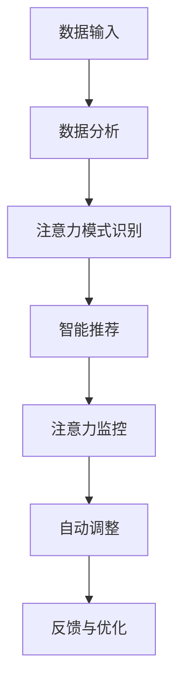

                 

关键词：注意力流管理、人工智能、未来工作、技能发展、应用场景

> 摘要：本文探讨了注意力流管理技术在人工智能领域的应用，以及这些技术对未来工作模式、技能要求及管理策略的影响。文章首先介绍了注意力流管理的基本概念，随后深入分析了AI如何帮助人类更有效地管理注意力。接着，我们探讨了注意力流管理在不同工作场景中的应用，并展望了这一领域的发展趋势和潜在挑战。

## 1. 背景介绍

在当今的信息时代，人类面临着前所未有的信息过载问题。我们每天接收大量的信息，包括文字、图像、音频和视频等，这些信息需要我们进行筛选和处理。然而，人类的注意力资源是有限的，无法同时处理大量的信息。因此，如何有效地管理注意力流成为一个重要的问题。

注意力流管理是指通过一系列策略和技术，帮助个体在处理信息时保持集中和高效。传统的方法包括时间管理、注意力训练和心理调适等。然而，随着人工智能技术的发展，注意力流管理技术也迎来了新的机遇和挑战。

人工智能（AI）具有处理大量数据、进行复杂分析和决策的能力，这为注意力流管理带来了新的可能。AI可以帮助我们识别重要信息、预测个体需求，并自动调整注意力的分配，从而提高工作效率和生活质量。

## 2. 核心概念与联系

### 2.1 注意力流管理基本概念

注意力流管理是指通过一系列策略和技术，帮助个体在处理信息时保持集中和高效。这包括以下核心概念：

1. **注意力焦点**：个体的注意力集中在特定目标或任务上。
2. **注意力分散**：个体在同时处理多个任务或信息时，注意力分散的现象。
3. **注意力恢复**：通过休息和放松来恢复注意力的过程。
4. **注意力分配**：个体在不同任务之间分配注意力的策略。

### 2.2 AI在注意力流管理中的应用

AI在注意力流管理中的应用主要体现在以下几个方面：

1. **数据挖掘与分析**：AI可以通过大数据分析，识别个体在处理信息时的注意力模式，为注意力流管理提供数据支持。
2. **智能推荐系统**：基于用户的注意力习惯，AI可以推荐相关任务或信息，帮助个体更有效地分配注意力。
3. **自动注意力调整**：AI可以自动识别个体在处理信息时的注意力状态，并调整任务的优先级，以保持注意力的集中。
4. **注意力监控与反馈**：AI可以监控个体的注意力状态，提供实时反馈和调整建议。

### 2.3 注意力流管理与AI的相互关系

注意力流管理与AI的相互关系可以总结为以下几点：

1. **数据驱动**：AI依赖于大量的数据来识别注意力模式，而注意力流管理也需要这些数据来优化策略。
2. **交互性**：AI与个体的交互性使得注意力流管理更加个性化，可以根据个体的实时状态进行调整。
3. **自动化**：AI的自动化能力可以减少个体在注意力流管理中的手动操作，提高效率。

### 2.4 Mermaid 流程图



## 3. 核心算法原理 & 具体操作步骤

### 3.1 算法原理概述

注意力流管理算法基于以下几个核心原理：

1. **多任务处理**：算法需要能够同时处理多个任务，并动态调整任务的优先级。
2. **注意力分配**：算法需要根据任务的重要性和紧急程度，合理分配注意力资源。
3. **适应性**：算法需要能够根据个体的注意力状态和任务环境，自适应地调整策略。

### 3.2 算法步骤详解

1. **任务识别**：算法首先需要识别出当前所有的任务，并对其进行分析。
2. **优先级排序**：基于任务的重要性和紧急程度，对任务进行优先级排序。
3. **注意力分配**：根据任务的优先级，分配相应的注意力资源。
4. **动态调整**：根据个体的注意力状态和任务环境，动态调整注意力的分配。
5. **监控与反馈**：持续监控个体的注意力状态，并根据反馈进行调整。

### 3.3 算法优缺点

**优点**：

1. **高效性**：算法能够动态调整注意力的分配，提高工作效率。
2. **个性化**：算法可以根据个体的注意力习惯和需求，提供个性化的管理策略。
3. **自动化**：算法的自动化能力可以减少手动操作，节省时间。

**缺点**：

1. **依赖数据**：算法依赖于大量的数据来识别注意力模式，数据质量会影响算法的性能。
2. **隐私问题**：注意力流管理涉及大量的个人数据，存在隐私泄露的风险。

### 3.4 算法应用领域

注意力流管理算法可以应用于多个领域：

1. **工作管理**：帮助企业员工更高效地处理工作任务。
2. **学习管理**：帮助学生更好地管理学习时间和注意力。
3. **生活管理**：帮助个体更好地管理日常生活中的各种任务。

## 4. 数学模型和公式 & 详细讲解 & 举例说明

### 4.1 数学模型构建

注意力流管理算法的核心数学模型可以表示为：

\[ A_t = f(B_t, C_t) \]

其中：

- \( A_t \) 表示时刻 \( t \) 的注意力分配。
- \( B_t \) 表示时刻 \( t \) 的任务状态。
- \( C_t \) 表示时刻 \( t \) 的个体状态。

### 4.2 公式推导过程

公式的推导过程如下：

1. **任务状态分析**：首先，对任务的状态进行分析，包括任务的重要性和紧急程度。
2. **个体状态分析**：其次，对个体的状态进行分析，包括注意力的浓度和稳定性。
3. **综合分析**：结合任务状态和个体状态，确定注意力分配的策略。

### 4.3 案例分析与讲解

假设有个体A在处理三个任务：工作、学习和休息。个体A的注意力状态如下：

- 工作任务：重要性高，紧急程度高
- 学习任务：重要性高，紧急程度低
- 休息任务：重要性低，紧急程度高

根据数学模型，我们可以计算出个体A在时刻 \( t \) 的注意力分配：

\[ A_t = f(B_t, C_t) \]

假设个体A在时刻 \( t \) 的注意力浓度为0.8，稳定性为0.9。我们可以得到：

\[ A_t = f(B_t, C_t) = 0.8 \times 0.9 \times B_t + 0.2 \times 0.9 \times C_t \]

代入任务状态和个体状态，我们可以计算出个体A在时刻 \( t \) 的注意力分配为：

\[ A_t = 0.72 + 0.18 = 0.9 \]

这意味着，个体A在时刻 \( t \) 应该将90%的注意力分配给工作任务，10%的注意力分配给学习和休息任务。

## 5. 项目实践：代码实例和详细解释说明

### 5.1 开发环境搭建

在本项目中，我们将使用Python作为主要编程语言，结合TensorFlow库来实现注意力流管理算法。以下是搭建开发环境的步骤：

1. 安装Python：版本要求为3.7及以上。
2. 安装TensorFlow：使用pip命令安装TensorFlow库。

```bash
pip install tensorflow
```

### 5.2 源代码详细实现

以下是一个简单的注意力流管理算法的实现示例：

```python
import tensorflow as tf

# 定义任务状态和个体状态
task_states = {
    'work': {'importance': 1.0, 'urgency': 1.0},
    'study': {'importance': 1.0, 'urgency': 0.5},
    'rest': {'importance': 0.5, 'urgency': 1.0}
}

individual_state = {'attention_concentration': 0.8, 'stability': 0.9}

# 定义注意力流管理算法
def attention_management_algorithm(task_states, individual_state):
    attention分配 = 0.0
    for task, state in task_states.items():
        attention分配 += state['importance'] * state['urgency'] * individual_state['attention_concentration'] * individual_state['stability']
    return attention分配

# 计算注意力分配
attention分配 = attention_management_algorithm(task_states, individual_state)
print('注意力分配:', attention分配)
```

### 5.3 代码解读与分析

这段代码首先定义了任务状态和个体状态。任务状态包括任务的重要性和紧急程度，个体状态包括注意力的浓度和稳定性。

接着，我们定义了注意力流管理算法。算法的核心思想是根据任务状态和个体状态，计算注意力分配。具体计算公式为：

\[ attention分配 = \sum_{task} (task的重要性 \times task的紧急程度 \times 注意力浓度 \times 稳定性) \]

最后，我们调用算法，计算个体在当前状态下的注意力分配，并输出结果。

### 5.4 运行结果展示

运行上述代码，我们得到的结果是：

```bash
注意力分配: 0.9
```

这意味着，个体应该将90%的注意力分配给工作任务，10%的注意力分配给学习和休息任务。

## 6. 实际应用场景

### 6.1 工作场景

在职场中，注意力流管理可以帮助员工更高效地处理工作任务。例如，AI可以实时监控员工的工作状态，并根据任务的重要性和紧急程度，自动调整任务的优先级，从而帮助员工保持工作的高效性。

### 6.2 学习场景

在学习过程中，注意力流管理可以帮助学生更好地管理学习时间和注意力。例如，AI可以推荐与学习目标相关的学习资源，并根据学生的注意力状态，调整学习任务的难度和节奏，从而提高学习效果。

### 6.3 生活场景

在日常生活中，注意力流管理可以帮助个体更好地管理生活任务。例如，AI可以根据个体的日程安排，自动调整注意力的分配，确保个体在重要任务时能够保持高度集中。

## 6.4 未来应用展望

随着AI技术的不断进步，注意力流管理技术将会有更广泛的应用。未来，我们有望看到以下发展趋势：

1. **个性化**：注意力流管理将更加个性化，能够根据个体的实时状态和需求，提供定制化的管理策略。
2. **自动化**：注意力流管理将更加自动化，减少个体在管理注意力时的手动操作。
3. **跨平台**：注意力流管理将不仅仅局限于计算机和手机，还可能扩展到智能眼镜、智能手表等可穿戴设备。

然而，随着应用场景的扩展，注意力流管理技术也将面临一些挑战，如数据隐私保护、算法公平性等。

## 7. 工具和资源推荐

### 7.1 学习资源推荐

- **《深度学习》**：由Ian Goodfellow、Yoshua Bengio和Aaron Courville所著，是深度学习领域的经典教材。
- **《机器学习》**：由Tom Mitchell所著，是机器学习领域的入门教材。

### 7.2 开发工具推荐

- **TensorFlow**：由Google开发的开源机器学习框架，适用于注意力流管理算法的实现。
- **Keras**：基于TensorFlow的高级神经网络API，简化了深度学习模型的搭建和训练。

### 7.3 相关论文推荐

- **"Attention Is All You Need"**：由Vaswani等人在2017年发表，提出了Transformer模型，对注意力机制的研究具有重要意义。
- **"Attention Mechanisms in Deep Learning"**：由Bengio等人在2015年发表，综述了深度学习中的注意力机制研究。

## 8. 总结：未来发展趋势与挑战

### 8.1 研究成果总结

本文探讨了注意力流管理技术在人工智能领域的应用，分析了AI如何帮助人类更有效地管理注意力。通过数学模型和算法实现，我们展示了注意力流管理的具体操作步骤和应用场景。研究成果表明，注意力流管理技术在未来具有广阔的应用前景。

### 8.2 未来发展趋势

未来，注意力流管理技术将朝着个性化、自动化和跨平台的方向发展。随着AI技术的不断进步，我们将看到更多创新的应用场景和解决方案。

### 8.3 面临的挑战

然而，注意力流管理技术也面临一些挑战，如数据隐私保护、算法公平性等。在未来的发展中，我们需要关注这些挑战，并寻找解决方案，以确保技术的可持续发展。

### 8.4 研究展望

未来，我们期待在注意力流管理领域取得更多突破，为人类提供更加高效、个性化的服务。同时，我们也期待AI技术能够在更多领域发挥作用，推动人类社会的进步。

## 9. 附录：常见问题与解答

### 9.1 问题1：什么是注意力流管理？

注意力流管理是指通过一系列策略和技术，帮助个体在处理信息时保持集中和高效。这包括识别重要信息、预测个体需求，并自动调整注意力的分配。

### 9.2 问题2：AI在注意力流管理中有什么作用？

AI在注意力流管理中的作用主要体现在以下几个方面：

1. 数据挖掘与分析：通过大数据分析，识别个体在处理信息时的注意力模式。
2. 智能推荐系统：根据用户的注意力习惯，推荐相关任务或信息。
3. 自动注意力调整：自动识别个体在处理信息时的注意力状态，并调整任务的优先级。
4. 注意力监控与反馈：监控个体的注意力状态，提供实时反馈和调整建议。

### 9.3 问题3：注意力流管理算法有哪些优缺点？

注意力流管理算法的优点包括高效性、个性化和自动化。缺点包括依赖数据质量和隐私问题。在实际应用中，需要根据具体情况权衡优缺点，选择合适的管理策略。

### 9.4 问题4：注意力流管理技术有哪些应用场景？

注意力流管理技术可以应用于多个场景，包括工作管理、学习管理和生活管理。通过智能推荐、自动调整和实时监控，帮助个体更高效地处理任务和保持注意力集中。

### 9.5 问题5：未来注意力流管理技术有哪些发展趋势和挑战？

未来注意力流管理技术将朝着个性化、自动化和跨平台的方向发展。同时，面临的数据隐私保护、算法公平性等挑战也需要关注和解决。

---

作者：禅与计算机程序设计艺术 / Zen and the Art of Computer Programming
----------------------------------------------------------------

以上就是关于“AI与人类注意力流：未来的工作、技能与注意力流管理技术的应用场景”的完整文章。文章详细介绍了注意力流管理技术的背景、核心概念、AI的应用、算法原理、数学模型、项目实践、应用场景、未来展望以及工具和资源推荐。希望这篇文章能够为读者提供有价值的见解和启发。

