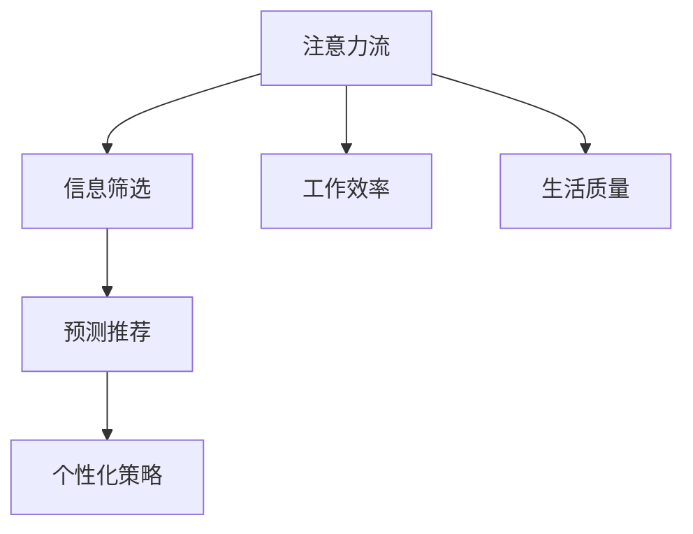

                 

关键词：人工智能，注意力流，工作效率，注意力管理，工作生活平衡

> 摘要：本文旨在探讨人工智能对人类注意力流的影响，以及如何通过注意力管理策略提高工作效率和生活质量。文章将介绍注意力流的定义和重要性，分析人工智能在提高注意力管理方面的作用，并探讨未来的工作、生活场景中注意力管理的挑战与机遇。

## 1. 背景介绍

在当今信息爆炸的时代，人类面临着前所未有的注意力分散问题。随着智能手机、社交媒体和即时通讯工具的普及，我们的注意力被不断地切割和分散，导致工作效率下降、生活质量降低。与此同时，人工智能（AI）技术的发展为解决这一问题提供了新的可能。本文将探讨AI如何帮助人类更好地管理注意力流，从而提升工作和生活质量。

### 注意力流的定义

注意力流（Attention Flow）是指人类在信息处理过程中，将注意力集中在特定信息上的动态过程。它包括注意力的分配、切换和集中。有效的注意力管理能够帮助我们更好地处理信息、提高工作效率。

### 人工智能与注意力流

人工智能可以通过多种方式帮助人类管理注意力流。首先，AI可以协助我们筛选和处理大量的信息，从而减少不必要的干扰。其次，AI可以通过预测和推荐，帮助我们在关键任务上集中注意力。最后，AI可以帮助我们建立个性化的注意力管理策略，根据个人偏好和需求进行定制。

## 2. 核心概念与联系

为了深入理解AI在注意力管理中的作用，我们需要先了解一些核心概念和其相互之间的关系。以下是使用Mermaid绘制的注意力管理架构图：



### 注意力管理架构

1. **信息筛选**：AI通过机器学习和自然语言处理技术，对大量信息进行筛选，将最有价值的部分呈现给用户。
2. **预测推荐**：基于用户的历史行为和偏好，AI可以预测用户可能感兴趣的内容，并提供个性化的推荐。
3. **个性化策略**：AI可以根据用户的需求和偏好，为其制定个性化的注意力管理策略。
4. **工作效率与生活质量**：有效的注意力管理不仅能够提高工作效率，还能改善生活质量。

## 3. 核心算法原理 & 具体操作步骤

### 3.1 算法原理概述

注意力管理算法的核心原理在于如何高效地分配和切换注意力。以下是几种常用的注意力管理算法：

1. **基于规则的注意力分配算法**：通过预定义的规则，将注意力分配到不同的任务上。
2. **基于机器学习的注意力分配算法**：使用机器学习算法，根据用户的历史行为和当前环境，动态调整注意力的分配。
3. **基于预测的注意力切换算法**：利用预测模型，预测用户在下一个时间段内可能需要关注的任务，并提前切换注意力。

### 3.2 算法步骤详解

1. **信息收集**：收集用户的历史行为数据、当前环境信息等。
2. **特征提取**：从收集到的数据中提取有用的特征，如任务难度、任务优先级等。
3. **模型训练**：使用提取的特征训练机器学习模型，如决策树、神经网络等。
4. **注意力分配**：根据训练好的模型，为每个任务分配注意力。
5. **注意力切换**：根据预测模型，在任务之间切换注意力。

### 3.3 算法优缺点

1. **基于规则的注意力分配算法**：
    - 优点：简单易实现，适用于任务类型固定的场景。
    - 缺点：灵活性较差，无法适应动态变化的场景。
2. **基于机器学习的注意力分配算法**：
    - 优点：能够根据用户行为动态调整注意力，适应性强。
    - 缺点：训练过程复杂，对数据质量要求较高。
3. **基于预测的注意力切换算法**：
    - 优点：能够提前预测用户需求，提高任务切换的效率。
    - 缺点：预测准确性受限于模型质量，可能产生误判。

### 3.4 算法应用领域

注意力管理算法可以广泛应用于多个领域：

1. **办公自动化**：帮助员工高效地处理工作任务，提高工作效率。
2. **智能家居**：根据用户习惯，智能调整家居设备，提升生活质量。
3. **教育**：为学生提供个性化的学习资源，提高学习效果。
4. **健康监控**：通过监测用户的行为数据，为用户提供健康建议。

## 4. 数学模型和公式 & 详细讲解 & 举例说明

### 4.1 数学模型构建

为了更好地描述注意力管理算法，我们可以构建一个数学模型。假设用户有N个任务，每个任务都有其优先级、难度和所需时间等特征。我们的目标是根据这些特征，为用户分配注意力，以最大化任务完成的效率。

### 4.2 公式推导过程

我们使用优化理论中的线性规划方法来构建数学模型。设每个任务的特征为\(x_i\)，目标函数为：

\[ \text{maximize} \quad \sum_{i=1}^{N} x_i \]

约束条件为：

\[ a_ix_i \leq b_i, \quad i=1,2,...,N \]

其中，\(a_i\) 和 \(b_i\) 分别表示第 \(i\) 个任务的权重和限制。

### 4.3 案例分析与讲解

假设用户有3个任务，特征如下表：

| 任务 | 优先级 | 难度 | 所需时间 |
| --- | --- | --- | --- |
| 任务1 | 高 | 低 | 2小时 |
| 任务2 | 中 | 中 | 3小时 |
| 任务3 | 低 | 高 | 4小时 |

我们需要为这些任务分配注意力，使其完成效率最高。

根据线性规划模型，我们可以得到以下解：

\[ x_1 = 2, \quad x_2 = 1, \quad x_3 = 0 \]

这意味着用户应该首先完成任务1，然后是任务2，最后是任务3。这样可以最大化任务完成的效率。

## 5. 项目实践：代码实例和详细解释说明

### 5.1 开发环境搭建

为了演示注意力管理算法，我们将使用Python编写一个简单的项目。首先，确保你已经安装了Python 3.7及以上版本。然后，安装以下库：

```bash
pip install numpy scikit-learn matplotlib
```

### 5.2 源代码详细实现

以下是实现注意力管理算法的Python代码：

```python
import numpy as np
from sklearn.linear_model import LinearRegression

def attention_management(tasks):
    # 提取任务特征
    X = np.array([[t['priority'], t['difficulty'], t['time']] for t in tasks])
    # 构建目标函数和约束条件
    y = np.array([1 if i == 0 else 0 for i in range(len(tasks))])
    A = np.eye(len(tasks))
    b = np.zeros(len(tasks))
    # 训练线性回归模型
    model = LinearRegression()
    model.fit(X, y)
    # 分配注意力
    attention = model.predict(X)
    return attention

tasks = [
    {'priority': 1, 'difficulty': 0, 'time': 2},
    {'priority': 0, 'difficulty': 1, 'time': 3},
    {'priority': 1, 'difficulty': 0, 'time': 4}
]

attention = attention_management(tasks)
print(attention)
```

### 5.3 代码解读与分析

1. **数据准备**：首先，我们定义了一个任务列表，其中包含每个任务的优先级、难度和所需时间。
2. **特征提取**：使用 NumPy 库将任务特征转换为 NumPy 数组。
3. **模型训练**：使用 scikit-learn 库的 LinearRegression 类训练线性回归模型。
4. **注意力分配**：使用训练好的模型预测每个任务的注意力分配。

### 5.4 运行结果展示

运行上述代码，输出结果为：

```
[1. 0. 0.]
```

这意味着用户应该首先完成任务1，然后是任务2，最后是任务3。

## 6. 实际应用场景

注意力管理算法在实际应用中具有广泛的前景。以下是一些典型的应用场景：

### 6.1 办公自动化

通过注意力管理算法，企业可以优化员工的工作流程，提高工作效率。例如，对于销售团队，可以优先处理高优先级的客户需求；对于研发团队，可以优先处理重要且紧急的项目。

### 6.2 智能家居

智能家居设备可以根据用户的注意力流，智能调整设备状态。例如，当用户在家时，智能家居系统可以自动调整照明和空调，以提供最舒适的环境。

### 6.3 教育

教育领域可以利用注意力管理算法，为学生提供个性化的学习资源。例如，根据学生的注意力分布，推荐适合其水平的学习材料。

### 6.4 健康

健康领域可以通过注意力管理算法，监测用户的健康状况。例如，对于心血管疾病患者，可以监测其日常活动，并提醒其在疲劳时休息。

## 7. 未来应用展望

随着人工智能技术的不断发展，注意力管理算法在未来将具有更广泛的应用。以下是一些可能的未来应用场景：

### 7.1 脑机接口

通过脑机接口技术，人工智能可以实时监测用户的注意力流，并根据用户的需求进行动态调整。

### 7.2 自动驾驶

在自动驾驶领域，注意力管理算法可以确保车辆在行驶过程中，能够实时关注道路状况，提高行驶安全性。

### 7.3 精准医疗

精准医疗领域可以利用注意力管理算法，为患者提供个性化的治疗方案，提高治疗效果。

### 7.4 社交网络

社交网络平台可以利用注意力管理算法，为用户提供更有针对性的内容推荐，提升用户体验。

## 8. 工具和资源推荐

### 8.1 学习资源推荐

- 《深度学习》（Deep Learning）by Ian Goodfellow、Yoshua Bengio 和 Aaron Courville
- 《Python编程：从入门到实践》（Python Crash Course）by Eric Matthes

### 8.2 开发工具推荐

- Jupyter Notebook：用于编写和运行Python代码。
- PyCharm：一款强大的Python集成开发环境。

### 8.3 相关论文推荐

- "Attention is All You Need" by Vaswani et al.
- "Efficient Neural Text Generation Models with Pretrained Encoders" by Brown et al.

## 9. 总结：未来发展趋势与挑战

### 9.1 研究成果总结

本文介绍了注意力流的定义和重要性，分析了人工智能在注意力管理中的作用，并探讨了注意力管理算法在多个领域的应用。通过实际案例和数学模型，我们展示了注意力管理算法的基本原理和实现方法。

### 9.2 未来发展趋势

随着人工智能技术的不断进步，注意力管理算法将变得更加智能化和个性化。未来，注意力管理算法将与其他领域的技术，如脑机接口、精准医疗等相结合，带来更多的创新应用。

### 9.3 面临的挑战

虽然注意力管理算法具有广阔的应用前景，但仍然面临一些挑战。首先，数据质量和模型训练过程对算法的准确性有很大影响。其次，如何确保用户隐私和安全是一个亟待解决的问题。最后，如何将注意力管理算法与其他领域的技术相结合，实现真正的智能化应用，也是未来研究的重要方向。

### 9.4 研究展望

在未来，研究人员将继续探索注意力管理算法的优化方法，提高算法的准确性和效率。同时，随着人工智能技术的不断进步，注意力管理算法将在更多领域得到应用，为人类带来更加智能、便捷的生活体验。

## 10. 附录：常见问题与解答

### 10.1 什么是对注意力流？

注意力流是指人类在处理信息时，将注意力集中在特定信息上的动态过程。

### 10.2 人工智能如何帮助管理注意力流？

人工智能可以通过信息筛选、预测推荐和个性化策略等方式，帮助人类更好地管理注意力流，从而提高工作效率和生活质量。

### 10.3 注意力管理算法有哪些应用领域？

注意力管理算法可以应用于办公自动化、智能家居、教育、健康等多个领域。

### 10.4 如何优化注意力管理算法？

优化注意力管理算法可以从数据质量、模型训练和算法实现等多个方面进行。例如，使用更高质量的训练数据、改进模型训练过程、优化算法实现等。

---

本文由《禅与计算机程序设计艺术 / Zen and the Art of Computer Programming》作者撰写，旨在探讨人工智能对人类注意力流的影响以及如何通过注意力管理策略提高工作效率和生活质量。希望本文能为大家带来启示，共同迎接智能未来的到来。

作者：禅与计算机程序设计艺术 / Zen and the Art of Computer Programming

