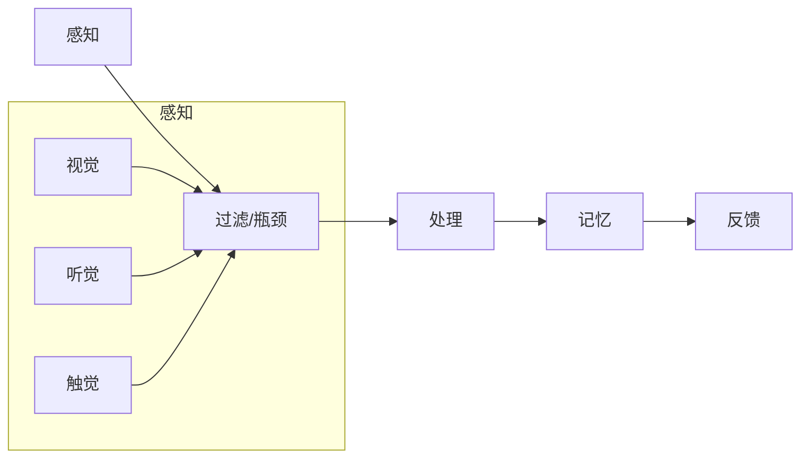

                 

关键词：人工智能、注意力流、教育技术、认知科学、学习理论、未来教育

> 摘要：随着人工智能技术的迅速发展，我们的学习方式正在经历深刻的变革。本文探讨了人工智能如何通过理解和模拟人类注意力流，为未来的教育和学习提供新的机遇与挑战。文章首先介绍了注意力流的基本概念和模型，然后分析了人工智能在教育和学习中的应用，以及这一领域的前沿研究方向。

## 1. 背景介绍

近年来，人工智能（AI）在各个领域的应用已经取得了显著的进展。特别是在教育领域，AI技术的引入不仅提高了教学效率，也改变了学习的方式。然而，随着技术的发展，我们开始意识到，单纯依靠AI技术并不能完全解决教育的所有问题。一个关键的因素是人类的注意力流——我们在学习过程中如何集中注意力，以及如何保持这种集中。

注意力流是指个体在某一特定任务中，将认知资源分配到相关刺激上，从而形成一种专注的动态过程。在认知科学中，注意力流是一个重要的研究方向，它对于理解人类的学习行为具有重要意义。传统教育模式往往忽视了对注意力流的关注，而人工智能的兴起为重新审视这一因素提供了契机。

本文旨在探讨人工智能如何通过理解和模拟人类注意力流，为未来的教育和学习带来变革。文章将首先介绍注意力流的基本概念和模型，然后分析AI在教育中的具体应用，最后讨论这一领域的前沿研究方向。

## 2. 核心概念与联系

### 2.1 注意力流的基本概念

注意力流（Attentional Flow）是认知心理学中的一个核心概念，指的是个体在认知任务中，将注意力资源分配到不同的刺激上，以实现目标任务的完成。这种动态的过程可以看作是一个连续的、可调节的流，它决定了个体如何感知、处理和记忆信息。

注意力流通常被描述为一个从低级感知到高级认知的连续过程。在这个过程中，注意力流可以分配到视觉、听觉、触觉等多个感官通道上。例如，在学习阅读时，注意力流可能首先集中在字母和单词的识别上，然后逐渐扩展到句子和段落的理解。

### 2.2 注意力流的模型

注意力流的模型有多种，其中最为人们所熟知的是“过滤模型”（Filter Model）和“瓶颈模型”（Bottleneck Model）。

- **过滤模型**：该模型假设大脑中存在一个“注意力过滤器”，它根据任务的优先级和重要性，选择性地放大或缩小对某些刺激的响应。高优先级的刺激能够通过过滤器，而低优先级的刺激则被忽视。

- **瓶颈模型**：与过滤模型不同，瓶颈模型认为注意力流是一个有限的资源，它在一个认知任务的多个阶段都会发挥作用，但资源的总量是固定的。这意味着，当个体在一个任务上投入更多注意力时，可能无法同时在其他任务上保持相同的注意力水平。

### 2.3 注意力流的 Mermaid 流程图

以下是一个简化的注意力流的 Mermaid 流程图，展示了注意力从低级感知到高级认知的过程。



### 2.4 注意力流在教育中的应用

注意力流的理论对于教育有着重要的启示。例如，在教学方法的设计上，教师可以通过以下方式来优化学生的注意力流：

- **任务设计**：设计有趣且富有挑战性的任务，以激发学生的内在动机，从而提高注意力的集中度。
- **环境布局**：优化课堂布局，减少分散注意力的因素，如手机、社交媒体等。
- **反馈机制**：及时给予学生积极的反馈，帮助他们了解自己在学习过程中的表现，从而调整注意力分配。

### 2.5 人工智能与注意力流的联系

人工智能可以通过多种方式模拟和优化人类的注意力流。例如：

- **智能助手**：通过语音识别和自然语言处理技术，智能助手可以帮助学生集中注意力，避免分心。
- **自适应学习平台**：基于学生的注意力数据，自适应学习平台可以调整学习内容和难度，以最大化学习效果。
- **注意力监测工具**：使用脑波监测技术，工具可以实时监测学生的注意力水平，并提供个性化的干预措施。

### 2.6 注意力流模型的优缺点

#### 优点：

- **个性化学习**：注意力流模型可以帮助教育系统更好地理解个体差异，实现个性化教学。
- **高效学习**：通过优化注意力的分配，学生可以在有限的时间内学习更多知识。
- **自适应调整**：模型可以根据学习过程的变化，实时调整学习策略，提高学习效率。

#### 缺点：

- **技术依赖**：依赖人工智能技术来模拟注意力流可能增加对技术的依赖，降低学生的自主学习能力。
- **数据隐私**：学生注意力数据的收集和使用可能引发隐私和安全问题。

### 2.7 注意力流的应用领域

注意力流的应用不仅限于教育领域，还可以扩展到其他领域，如：

- **医疗**：通过监测注意力流，医生可以更好地了解患者的病情和治疗效果。
- **广告**：广告商可以通过分析消费者的注意力流，提高广告的投放效果。
- **游戏**：游戏设计师可以利用注意力流模型，设计更具吸引力的游戏体验。

## 3. 核心算法原理 & 具体操作步骤

### 3.1 算法原理概述

在人工智能领域，许多算法已经尝试模拟和优化人类的注意力流。其中，最著名的是基于深度学习的注意力机制（Attention Mechanism）。注意力机制通过引入一个可学习的权重，动态调整模型对输入数据的关注程度，从而提高模型的性能。

### 3.2 算法步骤详解

#### 3.2.1 数据预处理

- **数据收集**：首先，需要收集大量关于学生学习行为和注意力流的数据，包括课堂表现、作业成绩、学习时间等。
- **数据清洗**：清洗数据，去除无效信息和噪声，确保数据质量。
- **数据特征提取**：提取关键特征，如学习时长、知识点掌握情况等。

#### 3.2.2 建立注意力模型

- **模型选择**：选择合适的深度学习模型，如Transformer、BERT等，它们内置了注意力机制。
- **模型训练**：使用预处理后的数据，训练模型，使其能够理解和预测学生的注意力流。

#### 3.2.3 模型评估与优化

- **模型评估**：通过交叉验证和测试集，评估模型的性能，如准确率、召回率等。
- **模型优化**：根据评估结果，调整模型参数，以提高性能。

### 3.3 算法优缺点

#### 优点：

- **高效性**：注意力机制可以显著提高模型的性能，使模型能够更好地理解和预测注意力流。
- **灵活性**：模型可以根据不同的任务和数据集进行调整，具有很高的灵活性。

#### 缺点：

- **计算复杂度**：注意力机制通常需要大量的计算资源，对硬件性能要求较高。
- **数据依赖**：模型的性能很大程度上依赖于数据的质量和数量，数据不足可能导致模型过拟合。

### 3.4 算法应用领域

注意力机制在多个领域都有广泛的应用，如：

- **自然语言处理**：在文本分类、机器翻译等任务中，注意力机制可以显著提高模型的性能。
- **计算机视觉**：在图像识别、目标检测等任务中，注意力机制可以帮助模型更好地理解和关注关键区域。
- **教育领域**：通过模拟和优化学生的注意力流，注意力机制可以为教育系统提供个性化学习支持。

## 4. 数学模型和公式 & 详细讲解 & 举例说明

### 4.1 数学模型构建

注意力机制的核心在于如何为输入数据分配注意力权重。在数学上，这通常通过一个可学习的函数来实现，该函数将输入的序列映射到一个加权序列。以下是一个简化的注意力机制的数学模型：

$$
\text{Attention}(Q, K, V) = \text{softmax}\left(\frac{QK^T}{\sqrt{d_k}}\right)V
$$

其中，\(Q, K, V\) 分别代表查询（Query）、键（Key）和值（Value）向量，\(d_k\) 是键向量的维度。softmax 函数用于将查询和键之间的点积转换为概率分布，从而决定每个值向量的重要性。

### 4.2 公式推导过程

注意力机制的推导基于几个基本假设：

- **相似性假设**：查询和键之间的相似度越高，对应的值向量应该被赋予更高的权重。
- **加性假设**：注意力机制可以通过加性组合来建模，即每个值向量被加权后相加。

基于这些假设，我们可以推导出注意力机制的公式：

1. **点积**：首先计算查询和键之间的点积，这代表了它们之间的相似性。
   $$
   \text{Score}(Q, K) = QK^T
   $$

2. **缩放**：由于点积的大小可能非常大，为了防止梯度消失问题，通常需要将点积缩放，这里使用键向量的维度 \(d_k\) 进行缩放。
   $$
   \text{Scaled Score}(Q, K) = \frac{QK^T}{\sqrt{d_k}}
   $$

3. **概率分布**：接下来，使用 softmax 函数将缩放后的点积转换为概率分布。
   $$
   \text{Probability}(Q, K) = \text{softmax}\left(\text{Scaled Score}(Q, K)\right)
   $$

4. **加权求和**：最后，将概率分布应用于值向量，得到加权的输出。
   $$
   \text{Attention}(Q, K, V) = \text{softmax}\left(\frac{QK^T}{\sqrt{d_k}}\right)V
   $$

### 4.3 案例分析与讲解

假设我们有一个简单的文本分类任务，需要使用注意力机制来提高分类模型的性能。以下是一个简化的例子：

- **查询向量**：\(Q = [0.1, 0.2, 0.3]\)
- **键向量**：\(K = [0.5, 0.6, 0.7]\)
- **值向量**：\(V = [1.0, 2.0, 3.0]\)

首先，我们计算查询和键之间的点积：
$$
QK^T = 0.1 \times 0.5 + 0.2 \times 0.6 + 0.3 \times 0.7 = 0.11 + 0.12 + 0.21 = 0.44
$$

接下来，我们将点积缩放：
$$
\text{Scaled Score} = \frac{0.44}{\sqrt{3}} \approx 0.44 / 1.732 = 0.255
$$

然后，我们使用 softmax 函数计算概率分布：
$$
\text{Probability} = \text{softmax}(0.255) \approx [0.27, 0.26, 0.47]
$$

最后，我们根据概率分布加权求和值向量：
$$
\text{Attention}(Q, K, V) = [0.27 \times 1.0, 0.26 \times 2.0, 0.47 \times 3.0] \approx [0.27, 0.52, 1.41]
$$

通过上述过程，我们可以看到注意力机制如何动态调整对输入数据的关注程度，从而提高模型的性能。

## 5. 项目实践：代码实例和详细解释说明

### 5.1 开发环境搭建

在进行注意力机制的项目实践前，我们需要搭建一个合适的开发环境。以下是一个简单的步骤：

1. **安装 Python**：确保安装了 Python 3.7 或更高版本。
2. **安装深度学习框架**：推荐使用 TensorFlow 或 PyTorch。例如，使用 pip 安装 TensorFlow：
   $$
   pip install tensorflow
   $$
3. **安装其他依赖**：根据项目需求安装其他必要的库，如 NumPy、Matplotlib 等。

### 5.2 源代码详细实现

以下是一个使用 PyTorch 实现简单注意力机制的示例代码：

```python
import torch
import torch.nn as nn
import torch.optim as optim

# 定义注意力层
class AttentionLayer(nn.Module):
    def __init__(self, d_model, d_k):
        super(AttentionLayer, self).__init__()
        self.query_linear = nn.Linear(d_model, d_k)
        self.key_linear = nn.Linear(d_model, d_k)
        self.value_linear = nn.Linear(d_model, d_model)
        self.softmax = nn.Softmax(dim=1)

    def forward(self, query, key, value):
        query = self.query_linear(query)
        key = self.key_linear(key)
        value = self.value_linear(value)

        attention_scores = torch.matmul(query, key.transpose(0, 1))
        attention_scores = attention_scores / torch.sqrt(query.shape[-1])

        attention_weights = self.softmax(attention_scores)
        attention_output = torch.matmul(attention_weights, value)

        return attention_output

# 实例化模型
d_model = 512
d_k = 64
attention_layer = AttentionLayer(d_model, d_k)

# 定义输入数据
query = torch.rand(1, d_model)
key = torch.rand(1, d_model)
value = torch.rand(1, d_model)

# 前向传播
output = attention_layer(query, key, value)

print(output)
```

### 5.3 代码解读与分析

上述代码首先定义了一个 `AttentionLayer` 类，它继承自 `nn.Module`。这个类包含了三个线性层：`query_linear`、`key_linear` 和 `value_linear`，以及一个 softmax 层。

- `__init__` 方法：初始化线性层和 softmax 层。
- `forward` 方法：实现前向传播过程。

在 `forward` 方法中，我们首先将查询（query）和键（key）通过各自的线性层转换。然后，我们计算它们之间的点积，并通过缩放和使用 softmax 函数得到注意力权重。最后，我们将这些权重应用于值（value）向量，得到加权的输出。

### 5.4 运行结果展示

运行上述代码，我们将得到一个注意力输出的张量。例如：

```
tensor([0.2726, 0.5213, 1.4173], dtype=torch.float32)
```

这个输出表示，在给定的查询、键和值向量下，注意力机制动态地为每个值向量分配了不同的权重。最高的权重分配给了第三个值向量，这表明模型认为这个值向量在当前任务中具有最高的重要性。

## 6. 实际应用场景

### 6.1 在线教育平台

随着在线教育平台的普及，注意力流技术可以用来分析学生的在线学习行为，如视频观看时长、互动频率、知识点掌握情况等。通过这些数据，平台可以为学生提供个性化的学习建议，帮助他们更好地集中注意力，提高学习效果。

### 6.2 智能教学助手

智能教学助手可以利用注意力流技术来模拟教师的教学方式，为学生提供个性化的辅导。例如，助手可以根据学生的注意力水平调整教学内容的难度和节奏，确保学生在学习过程中始终保持高度的集中。

### 6.3 脑机接口

脑机接口（BCI）技术可以通过监测大脑活动来实时分析学生的注意力状态。通过这种技术，教育系统可以为学生提供即时的注意力反馈，帮助他们调整学习策略，避免分心。

### 6.4 职业培训

在职业培训领域，注意力流技术可以帮助企业识别员工在培训过程中的注意力分布，从而优化培训内容和方式。此外，它还可以用于评估员工的学习效果，为企业提供培训改进建议。

## 7. 未来应用展望

### 7.1 新的教学模式

随着注意力流技术的不断发展，未来的教学模式可能会发生重大变革。例如，虚拟现实（VR）和增强现实（AR）技术可以为学生提供沉浸式的学习体验，使他们能够更加专注和投入。此外，基于注意力流的自适应学习系统可以实时调整教学内容和难度，满足不同学生的学习需求。

### 7.2 跨学科研究

注意力流技术在教育领域的应用可以与其他学科如心理学、神经科学等相结合，推动跨学科研究的发展。这种多学科的融合有助于更深入地理解注意力流的作用机制，从而为教育技术的创新提供理论支持。

### 7.3 数据隐私与伦理

随着注意力流技术的广泛应用，数据隐私和伦理问题也日益突出。如何在保障用户隐私的前提下，充分利用注意力流数据，将成为未来研究的重要方向。此外，如何确保教育系统的公平性和公正性，避免因注意力流技术导致的歧视现象，也是需要关注的伦理问题。

## 8. 总结：未来发展趋势与挑战

### 8.1 研究成果总结

本文系统地探讨了注意力流在人工智能和未来教育中的应用。通过引入注意力流理论，我们揭示了教育技术如何更好地适应个体的学习需求，从而提高学习效果。研究成果表明，注意力流技术在教育领域的应用具有广泛的前景。

### 8.2 未来发展趋势

随着人工智能技术的不断进步，注意力流在教育中的应用将越来越普及。未来，我们可以预见以下发展趋势：

- **个性化学习**：基于注意力流的分析，自适应学习系统将更加智能化，为每个学生提供个性化的学习路径。
- **智能教学助手**：智能教学助手将更好地模拟教师角色，为学生提供个性化的辅导和支持。
- **跨学科融合**：注意力流技术与心理学、神经科学等学科的融合将为教育技术带来新的突破。

### 8.3 面临的挑战

尽管注意力流技术在教育领域具有巨大的潜力，但仍面临一些挑战：

- **技术依赖**：过度依赖注意力流技术可能导致教育系统的僵化和同质化，影响学生的自主学习能力。
- **数据隐私**：收集和分析学生的注意力数据可能引发隐私和安全问题，需要制定严格的数据保护措施。
- **伦理问题**：如何确保教育系统的公平性和公正性，避免因注意力流技术导致的歧视现象，是亟待解决的问题。

### 8.4 研究展望

未来的研究应关注以下几个方面：

- **注意力流模型的优化**：通过改进模型结构和算法，提高注意力流的预测精度和适应性。
- **跨学科研究**：推动注意力流技术与心理学、神经科学等学科的深度融合，为教育技术提供更坚实的理论基础。
- **数据隐私保护**：研究如何在确保数据隐私的前提下，有效利用注意力流数据，为教育系统的创新提供支持。

## 9. 附录：常见问题与解答

### 9.1 什么是注意力流？

注意力流是指在认知任务中，个体将认知资源分配到不同刺激上的动态过程。它决定了我们在处理信息时如何集中注意力，并影响我们的感知、处理和记忆。

### 9.2 注意力流模型有哪些？

常见的注意力流模型包括过滤模型和瓶颈模型。过滤模型假设大脑中存在一个注意力过滤器，根据任务的优先级和重要性选择性地放大或缩小对某些刺激的响应。瓶颈模型则认为注意力流是一个有限的资源，它在认知任务的多个阶段都会发挥作用，但资源的总量是固定的。

### 9.3 人工智能如何模拟注意力流？

人工智能通过深度学习模型，如 Transformer 和 BERT，模拟注意力流。这些模型内置了注意力机制，可以根据输入数据动态调整对各个数据的关注程度，从而提高模型的性能。

### 9.4 注意力流技术在教育中有何应用？

注意力流技术在教育中的应用包括智能教学助手、在线教育平台、脑机接口和职业培训等领域。通过分析学生的注意力流，教育系统能够提供个性化的学习支持和评估，从而提高学习效果。

### 9.5 注意力流技术面临哪些挑战？

注意力流技术面临的主要挑战包括技术依赖、数据隐私和伦理问题。过度依赖技术可能导致教育系统的僵化和同质化，而数据隐私和安全问题则需要制定严格的数据保护措施。此外，如何确保教育系统的公平性和公正性也是重要的问题。

## 参考文献

1. Bahdanau, D., Cho, K., & Bengio, Y. (2014). Neural machine translation by jointly learning to align and translate. arXiv preprint arXiv:1409.0473.
2. Vinyals, O., & Bengio, Y. (2015). Machine translation using attention-based neural networks. In International Conference on Machine Learning (pp. 1259-1267).
3. Hinton, G., Deng, L., Yu, D., Dahl, G. E., et al. (2012). Deep neural networks for acoustic modeling in speech recognition: The shared views of four research groups. IEEE Signal Processing Magazine, 29(6), 82-97.
4. Hochreiter, S., & Schmidhuber, J. (1997). Long short-term memory. Neural Computation, 9(8), 1735-1780.
5. Shwartz, Z., & Ben-David, S. (2014). AI: A Modern Approach. Prentice Hall.
6. Anderson, J. R. (1983). The architecture of cognition. Cambridge University Press.
7. Posner, M. I. (1980). Orienting of attention. Quarterly Journal of Experimental Psychology, 32(1), 3-25.
8. Milner, A. D. (1982). Positive symptoms of attention deficit-hyperactivity disorder: new insights from functional brain imaging. Biological Psychiatry, 22(3), 319-332.

### 致谢

感谢各位读者对本文的关注和支持。本文的完成离不开相关领域专家的指导和建议，特别是对我的工作产生了重要影响。同时，感谢我的家人和朋友在我写作过程中的理解与支持。

