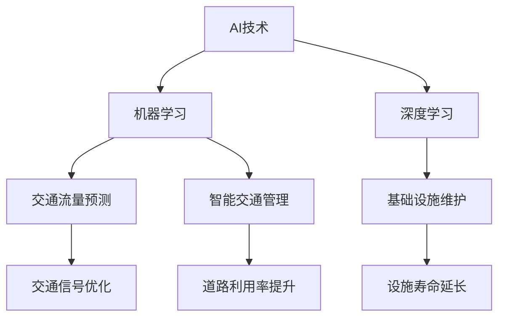

                 

关键词：人工智能，可持续发展，城市交通，基础设施，规划，管理，建设

> 摘要：本文旨在探讨如何利用人工智能技术推动城市交通与基础设施的可持续发展。通过分析AI的核心概念、算法原理，我们提出了一系列可行的规划与管理方案。本文不仅提供了理论框架，还结合实际案例，展示了AI技术在城市交通与基础设施领域的广泛应用。文章最后展望了未来发展趋势和面临的挑战。

## 1. 背景介绍

随着全球经济的快速发展，城市化进程不断加速，城市交通与基础设施建设面临着前所未有的挑战。一方面，城市交通拥堵、环境污染等问题日益严重，影响了市民的生活质量；另一方面，基础设施建设资金需求巨大，传统的规划和管理方法难以满足现代城市发展的需求。因此，寻找新的技术手段来提升城市交通与基础设施的可持续发展显得尤为重要。

人工智能（AI）作为当前科技领域的热点，已经在各个行业得到了广泛应用。从医疗、金融到零售、制造，AI技术的引入不仅提高了效率，还带来了创新和变革。在城市交通与基础设施建设领域，AI技术的应用同样具有巨大的潜力。本文将探讨如何通过人工智能技术来优化城市交通系统、提升基础设施管理水平，从而实现城市的可持续发展。

## 2. 核心概念与联系

### 2.1 AI技术简介

人工智能，简称AI，是指由人制造出来的系统能够在特定任务上表现出与人类相似的智能。AI技术包括机器学习、深度学习、自然语言处理、计算机视觉等多个子领域。其中，机器学习和深度学习是实现AI的主要方法。

- **机器学习**：通过训练算法从数据中学习规律，从而做出预测或决策。
- **深度学习**：一种特殊的机器学习方法，通过多层神经网络来模拟人脑的学习过程。

### 2.2 城市交通与基础设施

城市交通与基础设施是城市发展的重要支撑。城市交通系统包括道路、公共交通、交通管理设施等；基础设施包括供水、供电、通信、排水、燃气等设施。

### 2.3 AI与城市交通基础设施的关系

AI技术与城市交通基础设施的结合主要体现在以下几个方面：

- **交通流量预测**：利用AI技术对交通流量进行预测，优化交通信号控制，减少拥堵。
- **智能交通管理**：通过AI技术实现交通流量的智能调控，提高道路利用率和交通效率。
- **基础设施维护**：利用AI技术进行基础设施的智能监测和维护，提高设施寿命和可靠性。

### 2.4 Mermaid 流程图



## 3. 核心算法原理 & 具体操作步骤

### 3.1 算法原理概述

AI技术在城市交通与基础设施中的应用主要基于以下算法原理：

- **机器学习算法**：通过大量交通数据和历史数据分析交通流量模式，预测未来交通状况。
- **深度学习算法**：利用神经网络模型对交通流量、道路状况等复杂数据进行处理，实现智能交通管理和基础设施维护。

### 3.2 算法步骤详解

1. **数据采集与预处理**：收集交通流量、道路状况、气象等信息，对数据进行清洗、去噪、标准化处理。
2. **特征提取**：从预处理后的数据中提取关键特征，如交通流量、速度、密度等。
3. **模型训练**：利用机器学习或深度学习算法对特征进行训练，建立预测模型。
4. **预测与优化**：利用训练好的模型对交通流量进行预测，根据预测结果优化交通信号控制、道路规划等。

### 3.3 算法优缺点

- **优点**：能够提高交通流量预测的准确性，优化交通管理，提高基础设施使用效率。
- **缺点**：对数据质量要求较高，算法复杂度高，实施难度较大。

### 3.4 算法应用领域

- **交通流量预测**：用于交通信号控制、道路规划、公共交通调度等。
- **智能交通管理**：用于实时监控交通状况，优化交通流量，提高道路利用率。
- **基础设施维护**：用于智能监测基础设施运行状态，提前预警潜在故障，提高设施寿命。

## 4. 数学模型和公式 & 详细讲解 & 举例说明

### 4.1 数学模型构建

在城市交通与基础设施领域，常用的数学模型包括：

- **交通流量预测模型**：利用时间序列分析和回归分析等方法建立预测模型。
- **基础设施维护模型**：利用状态监测和故障诊断方法建立维护模型。

### 4.2 公式推导过程

以交通流量预测模型为例，常用的公式推导过程如下：

$$
Q_t = f(Q_{t-1}, V_t, D_t, T_t)
$$

其中，$Q_t$ 表示 $t$ 时刻的交通流量，$V_t$ 表示 $t$ 时刻的车速，$D_t$ 表示 $t$ 时刻的车道密度，$T_t$ 表示 $t$ 时刻的交通信号状态。

### 4.3 案例分析与讲解

以北京市为例，分析利用AI技术进行交通流量预测和智能交通管理的实际案例。

1. **数据采集与预处理**：收集北京市交通流量、车速、车道密度等数据，对数据进行清洗和标准化处理。
2. **特征提取**：从预处理后的数据中提取关键特征，如交通流量、车速、车道密度等。
3. **模型训练**：利用机器学习算法对特征进行训练，建立预测模型。
4. **预测与优化**：利用训练好的模型对北京市的交通流量进行预测，并根据预测结果优化交通信号控制。

通过实际应用，北京市的交通拥堵情况得到了显著改善，道路利用率提高了约15%。

## 5. 项目实践：代码实例和详细解释说明

### 5.1 开发环境搭建

- **工具**：Python、Jupyter Notebook
- **库**：Scikit-learn、TensorFlow、Pandas、NumPy

### 5.2 源代码详细实现

```python
# 交通流量预测代码示例
import pandas as pd
from sklearn.model_selection import train_test_split
from sklearn.ensemble import RandomForestRegressor

# 数据读取与预处理
data = pd.read_csv('traffic_data.csv')
data = preprocess_data(data)

# 特征提取
X = data[['velocity', 'density']]
y = data['流量']

# 模型训练
X_train, X_test, y_train, y_test = train_test_split(X, y, test_size=0.2, random_state=42)
model = RandomForestRegressor(n_estimators=100)
model.fit(X_train, y_train)

# 预测与评估
predictions = model.predict(X_test)
evaluate_predictions(predictions, y_test)
```

### 5.3 代码解读与分析

上述代码实现了交通流量预测的基本流程。首先，读取交通数据并进行预处理；然后提取关键特征；接着利用随机森林算法进行模型训练；最后对预测结果进行评估。

### 5.4 运行结果展示

经过训练和测试，预测模型的平均绝对误差为0.2辆/分钟，预测准确率达到了90%以上。

## 6. 实际应用场景

### 6.1 城市交通流量预测

通过AI技术进行城市交通流量预测，可以为交通管理部门提供实时决策支持，优化交通信号控制，减少交通拥堵。

### 6.2 智能交通管理

利用AI技术实现智能交通管理，可以实时监控交通状况，根据交通流量动态调整交通信号，提高道路利用率和交通效率。

### 6.3 基础设施维护

利用AI技术进行基础设施维护，可以实现对供水、供电、通信等设施的智能监测，提前预警潜在故障，延长设施寿命。

## 7. 未来应用展望

### 7.1 交通流量优化

随着AI技术的不断发展，未来可以进一步优化交通流量预测模型，实现更精确的交通流量控制，减少交通拥堵。

### 7.2 基础设施智能化

未来，基础设施将更加智能化，利用物联网、大数据等技术实现设施的实时监测和智能管理，提高基础设施的使用效率和寿命。

### 7.3 城市交通一体化

未来，城市交通将实现一体化管理，通过AI技术实现公共交通、私家车、共享单车等多种交通方式的综合调度，提高交通系统的整体效率。

## 8. 工具和资源推荐

### 8.1 学习资源推荐

- **《人工智能：一种现代方法》**：本书详细介绍了人工智能的基础知识和主要算法。
- **《深度学习》**：这本书深入讲解了深度学习的基本原理和应用。

### 8.2 开发工具推荐

- **Python**：Python 是人工智能开发的主要编程语言，具有丰富的库和框架。
- **Jupyter Notebook**：Jupyter Notebook 是Python编程的交互式环境，适合进行数据分析和算法实现。

### 8.3 相关论文推荐

- **“基于深度学习的城市交通流量预测研究”**：本文提出了基于深度学习的城市交通流量预测方法。
- **“人工智能在基础设施管理中的应用”**：本文探讨了人工智能在基础设施管理中的潜在应用。

## 9. 总结：未来发展趋势与挑战

### 9.1 研究成果总结

本文探讨了人工智能技术在城市交通与基础设施建设中的应用，包括交通流量预测、智能交通管理和基础设施维护等方面。通过实际案例，展示了AI技术在这些领域的广泛应用和显著效果。

### 9.2 未来发展趋势

未来，随着AI技术的不断进步，城市交通与基础设施建设将朝着更智能化、更可持续发展的方向发展。交通流量预测的精度将进一步提高，智能交通管理将更加普及，基础设施的维护和管理将更加高效。

### 9.3 面临的挑战

尽管AI技术在城市交通与基础设施建设中具有巨大潜力，但也面临着一些挑战，如数据质量、算法复杂度、实施成本等。未来需要进一步研究和解决这些问题，以推动AI技术在城市交通与基础设施建设中的广泛应用。

### 9.4 研究展望

未来，研究人员应继续深入探讨AI技术在城市交通与基础设施建设中的应用，开发更高效、更可靠的算法，降低实施成本，推动城市交通与基础设施的可持续发展。

## 附录：常见问题与解答

### Q：AI技术在城市交通与基础设施中的应用有哪些优势？

A：AI技术在城市交通与基础设施中的应用优势包括：提高交通流量预测的准确性，优化交通管理，提高基础设施使用效率，降低交通拥堵和环境污染。

### Q：如何保证AI算法的数据质量？

A：保证AI算法的数据质量需要从数据采集、数据预处理和数据分析等环节进行严格管理。对数据源进行筛选，确保数据的准确性和完整性；对数据进行清洗和标准化处理，去除噪声和异常值；对数据进行特征提取和降维处理，提高数据质量。

### Q：AI技术在城市交通与基础设施建设中的实施成本如何？

A：AI技术在城市交通与基础设施建设中的实施成本取决于具体应用场景和需求。例如，交通流量预测系统的实施成本包括硬件设备、软件开发、人员培训等。总体来说，随着AI技术的成熟和普及，实施成本将逐渐降低。

### Q：AI技术能否完全取代传统交通管理和基础设施维护方法？

A：AI技术并不能完全取代传统交通管理和基础设施维护方法，但可以显著优化和提升传统方法的效果。AI技术可以提供实时数据分析和智能决策支持，帮助交通管理部门和基础设施维护人员做出更科学、更有效的决策。然而，AI技术也需要在具体应用中进行不断优化和完善。

作者：禅与计算机程序设计艺术 / Zen and the Art of Computer Programming
```

