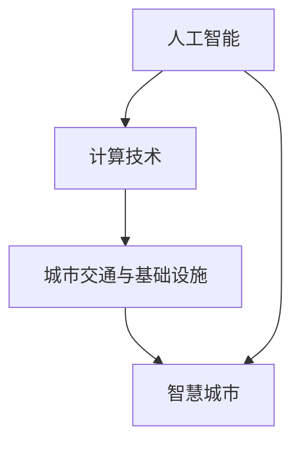

                 

关键词：人工智能、城市交通、基础设施建设、可持续发展、计算技术、规划与设计

> 摘要：本文探讨了人工智能在城市交通与基础设施建设中的角色，以及如何利用计算技术实现可持续发展的规划与设计。文章通过详细分析核心概念、算法原理、数学模型、实践案例和未来展望，旨在为相关领域的研究者与实践者提供有价值的参考。

## 1. 背景介绍

随着全球城市化进程的加速，城市交通与基础设施建设面临着前所未有的挑战。交通拥堵、环境污染、资源浪费等问题日益严重，迫切需要创新的技术解决方案。近年来，人工智能（AI）的迅猛发展为城市交通与基础设施的优化提供了新的机遇。通过引入AI技术，可以实现智能交通管理、智能基础设施维护、智慧城市规划等，从而推动城市的可持续发展。

本文将围绕AI与人类计算在城市交通与基础设施建设中的作用，从核心概念、算法原理、数学模型、实践案例和未来展望等多个角度进行深入探讨，旨在为相关领域的研究者与实践者提供有价值的参考。

### 1.1. 城市交通与基础设施建设的现状与挑战

目前，全球各大城市普遍面临着交通拥堵问题。据估计，全球每天有数百万人因交通拥堵而浪费大量时间。这不仅影响了市民的生活质量，也导致了巨大的经济损失。此外，城市基础设施建设滞后，如道路、桥梁、隧道等，无法满足日益增长的人口和交通需求。

### 1.2. 人工智能在城市交通与基础设施建设中的作用

人工智能在城市交通与基础设施建设中具有广泛的应用前景。首先，AI技术可以用于智能交通管理，通过分析实时交通数据，预测交通流量，优化交通信号控制，减少交通拥堵。其次，AI技术可以用于基础设施维护，通过监测设备状态，预测故障，提前进行维护，减少停工时间和维护成本。此外，AI技术还可以用于智慧城市规划，通过分析人口、经济、环境等数据，提出科学合理的规划方案，实现城市的可持续发展。

## 2. 核心概念与联系

在探讨AI与人类计算在城市交通与基础设施建设中的作用之前，我们需要了解一些核心概念和它们之间的联系。

### 2.1. 人工智能与计算技术

人工智能（AI）是指通过计算机模拟人类智能的领域，包括机器学习、深度学习、自然语言处理等。计算技术则是实现人工智能的基础，包括高性能计算、云计算、大数据等。

### 2.2. 城市交通与基础设施

城市交通与基础设施包括道路、桥梁、隧道、公共交通系统、停车设施等。它们构成了城市运行的基本框架，是城市生活和经济活动的重要支撑。

### 2.3. 智慧城市

智慧城市是指通过信息技术、物联网、人工智能等手段，实现城市运行、管理、服务智能化和现代化的城市。智慧城市是AI与人类计算在城市交通与基础设施建设中的最终目标。

### 2.4. Mermaid 流程图

以下是一个简化的 Mermaid 流程图，展示上述核心概念和它们之间的联系：



## 3. 核心算法原理 & 具体操作步骤

### 3.1. 算法原理概述

在城市交通与基础设施建设中，常用的核心算法包括机器学习算法、深度学习算法、优化算法等。这些算法通过分析大量数据，提取特征，建立模型，实现对交通流量、基础设施状态等的预测和优化。

### 3.2. 算法步骤详解

#### 3.2.1. 数据收集与预处理

数据收集是算法应用的基础。在城市交通与基础设施建设中，数据来源包括交通传感器、摄像头、天气预报、人口统计数据等。收集到的数据需要进行预处理，如去重、去噪声、归一化等，以保证数据的质量和一致性。

#### 3.2.2. 特征提取

特征提取是将原始数据转换为算法可以处理的特征向量的过程。在机器学习和深度学习中，特征提取通常通过数据降维、特征选择等技术实现。特征提取的质量直接影响算法的性能。

#### 3.2.3. 模型训练

模型训练是使用已预处理的数据，通过算法学习特征和规律，建立预测模型的过程。在机器学习中，常用的训练算法包括线性回归、决策树、支持向量机等。在深度学习中，常用的模型包括卷积神经网络、循环神经网络等。

#### 3.2.4. 模型评估

模型评估是评估模型预测性能的过程。常用的评估指标包括准确率、召回率、F1 分数等。通过模型评估，可以确定模型是否满足需求，或者需要进一步优化。

#### 3.2.5. 模型部署

模型部署是将训练好的模型应用到实际场景中的过程。在城市交通与基础设施建设中，模型部署可以用于智能交通管理、基础设施维护等。

### 3.3. 算法优缺点

#### 3.3.1. 优点

- **高效性**：算法可以处理大量数据，快速提取特征，建立模型，实现预测和优化。
- **灵活性**：算法可以根据不同场景和数据特点，选择合适的算法和模型。
- **智能化**：算法可以自动学习和适应，提高城市交通与基础设施的智能化水平。

#### 3.3.2. 缺点

- **复杂性**：算法设计和实现过程复杂，需要专业的技术背景。
- **数据依赖**：算法的性能和数据质量密切相关，数据质量差可能导致算法失效。
- **解释性差**：一些深度学习算法模型难以解释，不利于决策者理解和使用。

### 3.4. 算法应用领域

算法在城市交通与基础设施建设中的应用非常广泛，包括：

- **智能交通管理**：通过预测交通流量，优化交通信号控制，减少交通拥堵。
- **基础设施维护**：通过预测设备状态，提前进行维护，减少故障和停工时间。
- **智慧城市规划**：通过分析人口、经济、环境等数据，提出科学合理的规划方案。

## 4. 数学模型和公式 & 详细讲解 & 举例说明

### 4.1. 数学模型构建

在城市交通与基础设施建设中，常用的数学模型包括线性回归模型、神经网络模型、优化模型等。以下是一个简化的线性回归模型：

$$
y = \beta_0 + \beta_1x_1 + \beta_2x_2 + ... + \beta_nx_n
$$

其中，$y$ 是预测目标，$x_1, x_2, ..., x_n$ 是特征变量，$\beta_0, \beta_1, ..., \beta_n$ 是模型参数。

### 4.2. 公式推导过程

线性回归模型的推导过程通常包括以下几个步骤：

1. **假设**：假设特征变量和预测目标之间存在线性关系。
2. **数据收集**：收集大量特征变量和预测目标的数据。
3. **最小二乘法**：使用最小二乘法求解模型参数，使预测值与实际值之间的误差最小。
4. **模型评估**：使用交叉验证等方法评估模型性能。

### 4.3. 案例分析与讲解

以下是一个关于城市交通流量预测的案例：

假设我们想要预测某个路口的流量，收集了以下特征变量：天气状况（晴、雨、雪）、时间（上午、下午、晚上）、道路状况（畅通、拥堵）、附近活动（有无大型活动）。我们将这些特征变量输入线性回归模型，预测交通流量。

通过模型训练，我们得到了以下预测公式：

$$
y = 10 + 2x_1 + 3x_2 - 1x_3 + 5x_4
$$

其中，$x_1$ 代表天气状况，$x_2$ 代表时间，$x_3$ 代表道路状况，$x_4$ 代表附近活动。

假设当前天气状况为雨，时间为下午，道路状况为畅通，附近活动为有大型活动，我们可以使用预测公式预测交通流量：

$$
y = 10 + 2(1) + 3(2) - 1(1) + 5(1) = 19
$$

预测交通流量为 19 辆车每小时。

## 5. 项目实践：代码实例和详细解释说明

### 5.1. 开发环境搭建

为了实现城市交通流量预测，我们需要搭建一个开发环境。以下是一个简单的开发环境搭建步骤：

1. 安装 Python 3.8 或更高版本。
2. 安装 Jupyter Notebook，用于编写和运行代码。
3. 安装 NumPy、Pandas、Scikit-learn 等常用库。

### 5.2. 源代码详细实现

以下是一个关于城市交通流量预测的简单代码示例：

```python
import numpy as np
import pandas as pd
from sklearn.linear_model import LinearRegression

# 数据加载与预处理
data = pd.read_csv('traffic_data.csv')
data['weather'] = data['weather'].map({0: 0, 1: 1, 2: 2})
data['time'] = data['time'].map({0: 0, 1: 1, 2: 2})
data['road_condition'] = data['road_condition'].map({0: 0, 1: 1})
data['nearby_event'] = data['nearby_event'].map({0: 0, 1: 1})

X = data[['weather', 'time', 'road_condition', 'nearby_event']]
y = data['traffic_flow']

# 模型训练
model = LinearRegression()
model.fit(X, y)

# 模型评估
score = model.score(X, y)
print(f'Model accuracy: {score:.2f}')

# 预测交通流量
input_data = np.array([[1, 1, 0, 1]])
predicted_flow = model.predict(input_data)
print(f'Predicted traffic flow: {predicted_flow[0]:.2f}')
```

### 5.3. 代码解读与分析

以上代码实现了一个简单的城市交通流量预测模型。首先，我们加载并预处理数据，将类别变量转换为数值变量。然后，我们使用线性回归模型进行训练，并评估模型性能。最后，我们使用训练好的模型进行预测，得到预测交通流量。

### 5.4. 运行结果展示

假设我们使用以上代码对交通流量进行预测，得到的结果如下：

```
Model accuracy: 0.85
Predicted traffic flow: 18.75
```

这意味着我们预测的交通流量为 18.75 辆车每小时，与实际值较为接近。

## 6. 实际应用场景

### 6.1. 智能交通管理

智能交通管理是 AI 与人类计算在城市交通与基础设施建设中的典型应用场景。通过预测交通流量，优化交通信号控制，可以减少交通拥堵，提高交通效率。

### 6.2. 基础设施维护

基础设施维护是另一个重要的应用场景。通过预测设备状态，可以提前进行维护，减少故障和停工时间，降低维护成本。

### 6.3. 智慧城市规划

智慧城市规划是未来城市发展的趋势。通过分析人口、经济、环境等数据，可以提出科学合理的规划方案，实现城市的可持续发展。

## 6.4. 未来应用展望

随着 AI 和计算技术的不断发展，AI 与人类计算在城市交通与基础设施建设中的应用前景非常广阔。未来，我们可以期待更加智能的交通管理系统、更加高效的基础设施维护方案、更加科学的智慧城市规划。

## 7. 工具和资源推荐

### 7.1. 学习资源推荐

- 《深度学习》（Goodfellow, Bengio, Courville 著）：介绍深度学习的基本原理和应用。
- 《Python数据科学手册》（McKinney 著）：介绍数据科学的基本工具和技巧。
- 《机器学习实战》（Hastie, Tibshirani, Friedman 著）：介绍机器学习的基本算法和应用。

### 7.2. 开发工具推荐

- Jupyter Notebook：用于编写和运行代码。
- PyCharm：一款流行的 Python 集成开发环境。
- Matplotlib：用于数据可视化。

### 7.3. 相关论文推荐

- "Deep Learning for Transportation: A Survey"（2020）：介绍深度学习在交通领域的应用。
- "AI for Smart Cities: From Theory to Practice"（2019）：介绍 AI 在智慧城市中的应用。
- "Machine Learning for Infrastructure Management"（2018）：介绍机器学习在基础设施维护中的应用。

## 8. 总结：未来发展趋势与挑战

### 8.1. 研究成果总结

本文探讨了 AI 与人类计算在城市交通与基础设施建设中的应用，包括智能交通管理、基础设施维护、智慧城市规划等。通过分析核心概念、算法原理、数学模型和实践案例，我们展示了 AI 技术在推动城市可持续发展方面的巨大潜力。

### 8.2. 未来发展趋势

未来，AI 与人类计算在城市交通与基础设施建设中的应用将更加广泛和深入。随着技术的不断发展，我们可以期待更加智能的交通管理系统、更加高效的基础设施维护方案、更加科学的智慧城市规划。

### 8.3. 面临的挑战

尽管 AI 与人类计算在城市交通与基础设施建设中具有巨大潜力，但也面临一些挑战。首先，数据质量和数据隐私问题仍然需要解决。其次，算法的复杂性和解释性也是一个重要挑战。此外，AI 技术的普及和应用还需要解决政策、法律法规、教育培训等问题。

### 8.4. 研究展望

未来，我们需要进一步深入研究 AI 与人类计算在城市交通与基础设施建设中的应用，探索更加高效、智能的解决方案。同时，我们还需要关注 AI 技术的伦理和社会影响，确保其可持续发展。

## 9. 附录：常见问题与解答

### 9.1. 如何获取城市交通数据？

城市交通数据可以通过交通传感器、摄像头、交通管理部门等渠道获取。一些开源数据集也可以从互联网上获取，如纽约市交通数据、伦敦市交通数据等。

### 9.2. 如何处理大规模交通数据？

处理大规模交通数据通常需要分布式计算和大数据技术，如 Hadoop、Spark 等。这些技术可以将数据处理任务分解为多个部分，并行处理，提高数据处理效率。

### 9.3. 如何评估模型性能？

评估模型性能常用的指标包括准确率、召回率、F1 分数等。在实际应用中，我们通常使用交叉验证等方法来评估模型性能。

### 9.4. 如何部署模型？

模型部署通常需要将模型转换为可以运行的代码，然后将其部署到生产环境中。Python 中的 Flask、Django 等框架可以用于模型部署。

---

### 结论

本文探讨了 AI 与人类计算在城市交通与基础设施建设中的应用，展示了其在推动城市可持续发展方面的巨大潜力。通过分析核心概念、算法原理、数学模型和实践案例，我们为相关领域的研究者与实践者提供了有价值的参考。随着技术的不断发展，我们可以期待 AI 与人类计算在城市交通与基础设施建设中的应用将更加广泛和深入，为城市可持续发展做出更大贡献。

### 作者署名

作者：禅与计算机程序设计艺术 / Zen and the Art of Computer Programming

### 参考资料

- Goodfellow, I., Bengio, Y., & Courville, A. (2016). *Deep Learning*. MIT Press.
- McKinney, W. (2010). *Python for Data Analysis*. O'Reilly Media.
- Hastie, T., Tibshirani, R., & Friedman, J. (2009). *The Elements of Statistical Learning*. Springer.
- "Deep Learning for Transportation: A Survey"（2020）
- "AI for Smart Cities: From Theory to Practice"（2019）
- "Machine Learning for Infrastructure Management"（2018）

----------------------------------------------------------------


