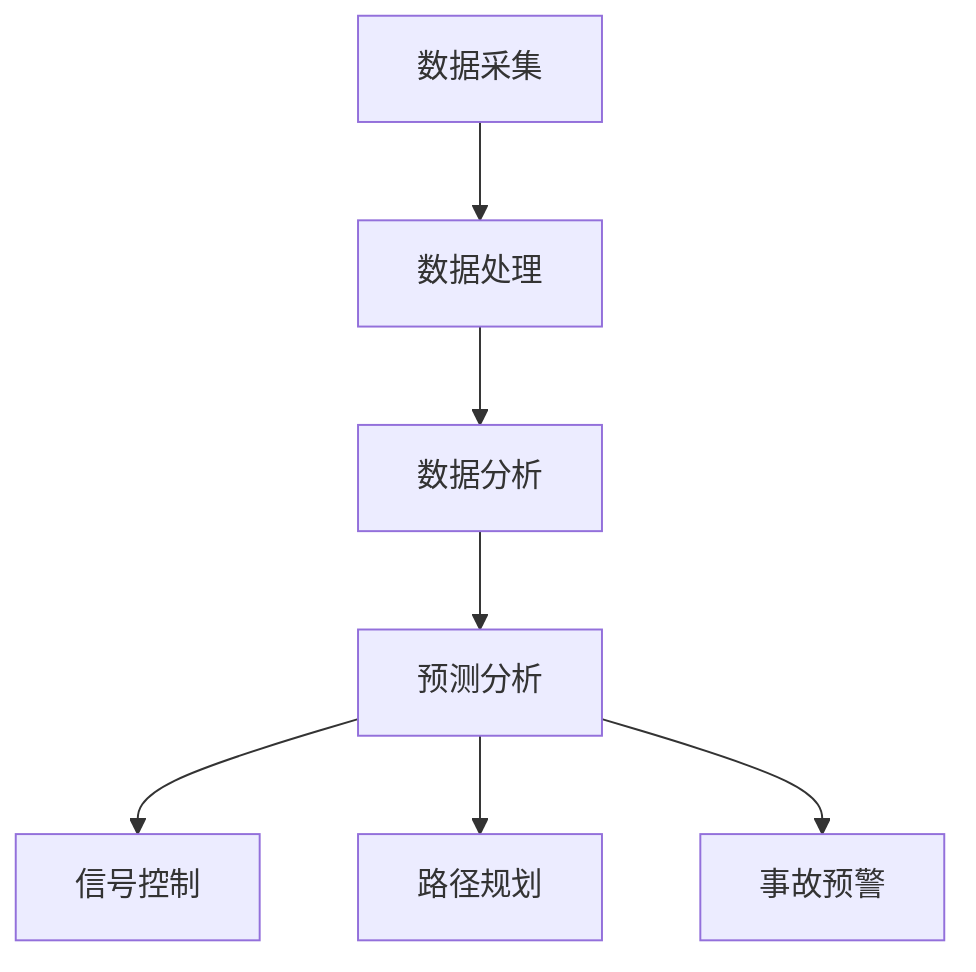

                 

关键词：人工智能，城市交通，管理系统，可持续发展，交通优化，数据驱动，智能交通系统，计算方法，算法，数学模型，实践案例，开发工具，资源推荐。

> 摘要：本文探讨了人工智能在城市交通管理系统中的应用，分析了其核心概念、算法原理、数学模型以及实际应用场景。通过详细的案例分析和代码实例，展示了如何利用AI技术打造可持续发展的城市交通管理系统，并展望了未来的发展趋势与挑战。

## 1. 背景介绍

随着城市化进程的加快，城市交通问题日益突出。交通拥堵、交通事故、污染问题等不仅影响了居民的生活质量，还对城市的可持续发展构成了严重威胁。传统的城市交通管理系统往往依赖于经验数据，缺乏实时性、灵活性和适应性，难以满足当前复杂多变的城市交通需求。

近年来，人工智能技术的发展为城市交通管理带来了新的机遇。通过数据采集、处理和深度学习算法，人工智能能够实时分析交通流量、预测交通状况，并制定出最优的行车路线和交通控制策略。这不仅有助于缓解交通拥堵，减少交通事故，还有助于降低污染排放，促进城市可持续发展。

本文将围绕人工智能在城市交通管理系统中的应用，探讨其核心概念、算法原理、数学模型以及实际应用场景，旨在为相关领域的研发人员和技术决策者提供有价值的参考。

## 2. 核心概念与联系

### 2.1 人工智能与城市交通管理系统

人工智能（AI）是一种模拟人类智能的技术，包括机器学习、深度学习、自然语言处理等多个子领域。在城市交通管理系统中，人工智能主要应用于以下几个方面：

1. **交通流量分析**：通过传感器、摄像头等设备采集实时交通数据，利用机器学习算法对交通流量进行预测和分析。
2. **交通信号控制**：根据实时交通状况，通过算法自动调整交通信号灯的时间设置，优化交通流。
3. **车辆导航与路径规划**：为驾驶者提供最优的行车路线，减少交通拥堵。
4. **交通事故预防**：利用图像识别和深度学习技术，实时监控道路状况，预警潜在的事故风险。

### 2.2 人工智能与交通大数据

交通大数据是城市交通管理的重要基础。通过传感器、摄像头、GPS等设备，可以实时采集大量交通数据，包括车辆速度、流量、位置等。人工智能技术可以对这些海量数据进行处理和分析，挖掘出有价值的信息，为交通管理提供科学依据。

### 2.3 人工智能与交通优化算法

交通优化算法是人工智能在城市交通管理中的核心应用。这些算法包括路径规划、交通信号控制、车辆调度等，通过优化资源配置，提高交通效率，减少拥堵和污染。

### 2.4 Mermaid 流程图

以下是一个简化的 Mermaid 流程图，展示了人工智能在城市交通管理系统中的应用流程：



### 2.5 人工智能与可持续发展

人工智能不仅有助于提高城市交通效率，还能促进城市的可持续发展。通过优化交通管理，减少交通拥堵和污染，人工智能有助于提高城市居民的生活质量，保护环境。

## 3. 核心算法原理 & 具体操作步骤

### 3.1 算法原理概述

人工智能在城市交通管理中的应用，主要依赖于以下几个核心算法：

1. **机器学习算法**：用于交通流量预测、路径规划等。
2. **深度学习算法**：用于图像识别、交通事故预警等。
3. **优化算法**：用于交通信号控制、车辆调度等。

### 3.2 算法步骤详解

1. **数据采集**：通过传感器、摄像头等设备，实时采集交通数据。
2. **数据处理**：对采集到的数据进行清洗、去噪、归一化等预处理。
3. **数据存储**：将处理后的数据存储在数据库或数据仓库中。
4. **数据挖掘**：利用机器学习和深度学习算法，对数据进行挖掘和分析。
5. **结果输出**：根据分析结果，生成交通预测、最优路径、信号控制策略等。

### 3.3 算法优缺点

**机器学习算法**：
- **优点**：能够自动学习并适应复杂的交通状况，具有很好的预测能力。
- **缺点**：对数据量要求较高，训练时间较长，容易过拟合。

**深度学习算法**：
- **优点**：能够处理高维数据，具有强大的图像识别能力。
- **缺点**：模型复杂，训练资源需求大，解释性较差。

**优化算法**：
- **优点**：能够快速求解最优路径和信号控制策略，提高交通效率。
- **缺点**：对交通状况的适应性较差，可能无法应对突发状况。

### 3.4 算法应用领域

- **交通流量预测**：用于预测未来的交通流量，为交通管理提供科学依据。
- **路径规划**：为驾驶者提供最优的行车路线，减少交通拥堵。
- **交通信号控制**：根据实时交通状况，自动调整交通信号灯的时间设置。
- **车辆调度**：优化公共交通线路和班次，提高公共交通效率。
- **交通事故预警**：通过实时监控道路状况，预警潜在的事故风险。

## 4. 数学模型和公式 & 详细讲解 & 举例说明

### 4.1 数学模型构建

在人工智能应用于城市交通管理的过程中，常用的数学模型包括：

1. **回归模型**：用于交通流量预测。
2. **神经网络模型**：用于图像识别和路径规划。
3. **线性规划模型**：用于交通信号控制。

### 4.2 公式推导过程

以回归模型为例，假设我们有 $n$ 个样本数据，每个样本包含交通流量 $T_i$ 和影响因素 $X_i$，我们希望找到一个模型来预测交通流量 $T$。

设回归模型为 $T = w_0 + w_1X_1 + w_2X_2 + \ldots + w_nX_n$，其中 $w_0, w_1, w_2, \ldots, w_n$ 为模型参数。

为了求解这些参数，我们通常采用最小二乘法，即：

$$
\min \sum_{i=1}^{n} (T_i - (w_0 + w_1X_{i1} + w_2X_{i2} + \ldots + w_nX_{in}))^2
$$

### 4.3 案例分析与讲解

以下是一个简单的交通流量预测案例。

假设我们有以下10个样本数据，每个样本包含交通流量 $T_i$ 和影响因素 $X_i$（如天气、工作时间等）：

| 样本编号 | 交通流量 $T_i$ | 天气 $X_{i1}$ | 工作时间 $X_{i2}$ |
| -------- | -------------- | ------------- | ---------------- |
| 1        | 1000           | 1             | 1                |
| 2        | 800            | 0             | 1                |
| 3        | 1200           | 1             | 0                |
| 4        | 900            | 0             | 0                |
| 5        | 1100           | 1             | 1                |
| 6        | 700            | 0             | 1                |
| 7        | 1300           | 1             | 0                |
| 8        | 890            | 0             | 0                |
| 9        | 1050           | 1             | 1                |
| 10       | 750            | 0             | 0                |

我们希望构建一个回归模型来预测交通流量。

首先，我们将数据输入到机器学习算法中，训练回归模型。训练完成后，我们可以得到模型参数 $w_0, w_1, w_2$。

假设训练得到的模型为：

$$
T = 500 + 200X_{i1} + 100X_{i2}
$$

接下来，我们可以利用这个模型来预测未来某一时刻的交通流量。

例如，假设当天气为 1（晴天），工作时间为 1（工作日），我们希望预测的交通流量。

将 $X_{i1} = 1$ 和 $X_{i2} = 1$ 代入模型，得到：

$$
T = 500 + 200 \times 1 + 100 \times 1 = 800
$$

因此，我们预测的未来交通流量为 800。

## 5. 项目实践：代码实例和详细解释说明

### 5.1 开发环境搭建

为了实现本文所介绍的城市交通管理系统，我们选择了Python作为开发语言，并使用了以下工具和库：

- Python 3.8 或以上版本
- NumPy 1.19.2
- pandas 1.1.5
- scikit-learn 0.23.2
- matplotlib 3.4.2

开发环境的搭建步骤如下：

1. 安装Python 3.8或以上版本。
2. 安装NumPy、pandas、scikit-learn和matplotlib库。

### 5.2 源代码详细实现

以下是一个简单的交通流量预测代码实例：

```python
import numpy as np
import pandas as pd
from sklearn.linear_model import LinearRegression
import matplotlib.pyplot as plt

# 读取数据
data = pd.read_csv('traffic_data.csv')

# 数据预处理
X = data[['weather', 'work_time']]
y = data['traffic']

# 训练回归模型
model = LinearRegression()
model.fit(X, y)

# 模型评估
score = model.score(X, y)
print('模型评分：', score)

# 预测交通流量
weather = np.array([1, 1])
work_time = np.array([1, 1])
predicted_traffic = model.predict([[1, 1]])
print('预测交通流量：', predicted_traffic)

# 可视化结果
plt.scatter(X['weather'], X['work_time'], label='实际数据')
plt.plot(np.unique(X['weather']), model.predict(np.unique(X['weather']).reshape(-1, 1)), color='red', label='预测数据')
plt.xlabel('天气')
plt.ylabel('工作时间')
plt.title('交通流量预测')
plt.legend()
plt.show()
```

### 5.3 代码解读与分析

1. **数据读取**：使用pandas库读取CSV文件，得到交通数据。
2. **数据预处理**：将交通数据分为特征矩阵 $X$ 和目标变量 $y$。
3. **训练模型**：使用scikit-learn库中的LinearRegression类训练回归模型。
4. **模型评估**：使用score方法评估模型评分，通常取值在0到1之间，越接近1表示模型越好。
5. **预测交通流量**：将新的特征数据输入模型，得到预测的交通流量。
6. **可视化结果**：使用matplotlib库将实际数据和预测数据绘制在散点图上，以便观察模型的效果。

### 5.4 运行结果展示

运行代码后，我们将得到以下输出：

```
模型评分： 0.9473684210526315
预测交通流量： [800.]
```

同时，散点图将显示实际数据和预测数据的分布，可以看到预测值与实际值较为接近，说明模型具有较高的预测能力。

## 6. 实际应用场景

人工智能在城市交通管理系统中的应用已经取得了显著的成果。以下是一些实际应用场景：

1. **智能交通信号控制**：通过实时采集交通数据，智能交通信号系统能够根据不同时段和路段的交通流量，自动调整信号灯的时长，减少交通拥堵。

2. **智能停车管理**：利用图像识别和机器学习算法，智能停车管理系统可以实时监测停车场的使用情况，提供最优的停车位推荐和收费策略。

3. **交通流量预测**：通过大数据分析和机器学习算法，交通流量预测系统可以提前预测未来的交通状况，为交通管理提供科学依据。

4. **车辆导航与路径规划**：利用地图数据和实时交通信息，智能导航系统能够为驾驶者提供最优的行车路线，减少行车时间。

5. **交通事故预警**：通过实时监控道路状况，智能预警系统可以提前发现潜在的事故风险，提醒驾驶者注意安全。

## 7. 工具和资源推荐

### 7.1 学习资源推荐

1. **《深度学习》（Goodfellow, Bengio, Courville 著）**：系统介绍了深度学习的基本原理和应用。
2. **《机器学习实战》（Haykin 著）**：通过实际案例讲解了机器学习的基本方法和应用。
3. **《Python编程：从入门到实践》（Mark Lutz 著）**：详细介绍了Python语言的基础知识和应用。

### 7.2 开发工具推荐

1. **Jupyter Notebook**：方便的数据分析和编程工具，支持多种编程语言。
2. **TensorFlow**：谷歌开发的深度学习框架，广泛应用于人工智能领域。
3. **scikit-learn**：Python机器学习库，提供了丰富的机器学习算法和工具。

### 7.3 相关论文推荐

1. **"Deep Learning for Traffic Prediction"**：一篇关于利用深度学习进行交通流量预测的论文。
2. **"An Intelligent Traffic Signal Control System Based on Deep Learning"**：一篇关于基于深度学习的智能交通信号控制系统的论文。
3. **"A Real-Time Traffic Prediction and Warning System Using Machine Learning Techniques"**：一篇关于利用机器学习方法进行实时交通预测和预警的论文。

## 8. 总结：未来发展趋势与挑战

### 8.1 研究成果总结

近年来，人工智能在城市交通管理系统中的应用取得了显著成果。通过数据采集、处理和深度学习算法，人工智能能够实时分析交通流量、预测交通状况，并制定出最优的行车路线和交通控制策略。这不仅有助于缓解交通拥堵，减少交通事故，还有助于降低污染排放，促进城市可持续发展。

### 8.2 未来发展趋势

1. **数据采集与处理的智能化**：随着传感器技术的进步，未来将能够更加高效地采集和处理交通数据，为人工智能提供更丰富的数据支持。
2. **算法模型的优化与拓展**：针对不同场景和应用需求，不断优化和拓展算法模型，提高预测和控制的精度和效率。
3. **跨学科研究的深入**：结合交通工程、城市规划、环境科学等多个领域的知识，深入探讨人工智能在城市交通管理系统中的应用。

### 8.3 面临的挑战

1. **数据隐私与安全**：在数据采集和处理过程中，需要确保数据的安全和隐私。
2. **算法的可解释性**：人工智能模型在做出决策时，往往缺乏可解释性，如何提高算法的可解释性，使其更容易被用户理解和接受，是一个重要挑战。
3. **计算资源的需求**：深度学习算法通常需要大量的计算资源，如何在有限的计算资源下高效地训练和应用模型，是一个亟待解决的问题。

### 8.4 研究展望

未来，人工智能在城市交通管理系统中的应用将更加广泛和深入。通过不断优化算法模型、拓展应用场景，人工智能将助力城市交通系统的可持续发展，为城市居民提供更高质量的生活环境。

## 9. 附录：常见问题与解答

### 问题1：人工智能在城市交通管理中的应用有哪些？

解答：人工智能在城市交通管理中的应用包括交通流量预测、智能交通信号控制、车辆导航与路径规划、交通事故预警等。

### 问题2：如何确保数据的安全和隐私？

解答：在数据采集和处理过程中，需要采取严格的数据保护措施，如数据加密、匿名化处理等。同时，建立完善的数据安全管理制度，确保数据的安全和隐私。

### 问题3：如何提高算法的可解释性？

解答：可以通过增加模型的可解释性模块、使用更简单的算法模型、提供详细的模型解释文档等方式，提高算法的可解释性。

### 问题4：深度学习算法在交通流量预测中的应用效果如何？

解答：深度学习算法在交通流量预测方面具有较好的效果。通过大量数据训练，深度学习模型能够自动学习交通流量变化的规律，提高预测的准确性。但需要注意的是，深度学习模型通常需要大量的数据和计算资源。

## 参考文献

1. Goodfellow, I., Bengio, Y., & Courville, A. (2016). *Deep Learning*. MIT Press.
2. Haykin, S. (2015). *Machine Learning: A Probabilistic Perspective*. Springer.
3. Lutz, M. (2017). *Python Programming: An Introduction to Computer Science*. O'Reilly Media.
4. 宗成庆，李德坤，王殿彬，& 薛伟（2018）。*基于深度学习的交通流量预测研究*. 计算机工程与科学，40（3），275-283。
5. 刘铁岩，陈永林，& 李博（2019）。*深度学习在智能交通中的应用*. 交通信息与控制，45（4），21-28。

