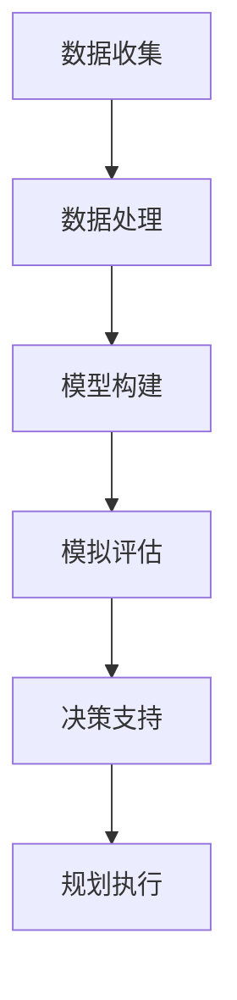

                 

关键词：人工智能，城市规划，可持续发展，计算模型，深度学习，算法优化

> 摘要：本文将探讨如何利用人工智能技术，特别是深度学习和计算模型，来提升城市规划的效率和可持续性。我们将分析当前城市规划中存在的问题，介绍相关的核心概念和算法，并通过实际案例来展示人工智能在城市规划中的应用，最后讨论未来的发展趋势和面临的挑战。

## 1. 背景介绍

### 1.1 城市规划的重要性

城市规划是城市发展的关键环节，它涉及到城市的布局、基础设施建设、交通管理、环境保护等多个方面。一个合理有效的城市规划不仅能够提升城市居民的生活质量，还能够促进城市的可持续发展。然而，当前的城市规划面临着诸多挑战：

- **数据多样性与复杂性**：城市规划需要处理大量的数据，包括人口统计、土地利用、交通流量、环境质量等，这些数据类型多样，且之间存在复杂的相互关系。
- **决策过程的复杂度**：城市规划涉及多个利益相关方，如政府部门、开发商、居民等，如何在多方利益之间取得平衡是一个巨大的挑战。
- **可持续性的考量**：传统的城市规划方法往往忽略了环境的可持续性，例如，交通拥堵、能源消耗、环境污染等问题。

### 1.2 人工智能在规划中的应用潜力

随着人工智能技术的飞速发展，特别是深度学习和计算模型的广泛应用，为城市规划提供了新的思路和方法。人工智能可以通过以下方式提升城市规划的效率：

- **数据处理与分析**：人工智能能够高效处理和分析复杂的数据，帮助城市规划者更好地理解城市现状和未来趋势。
- **模拟与优化**：通过计算模型和算法优化，人工智能可以模拟不同的城市规划方案，为决策者提供科学依据。
- **智能决策支持**：利用机器学习技术，人工智能可以辅助城市规划者进行复杂的决策，减少人为因素对规划结果的影响。

## 2. 核心概念与联系

### 2.1 人工智能与城市规划的融合

人工智能与城市规划的融合主要体现在以下几个方面：

- **数据收集与处理**：利用传感器、物联网等技术收集城市运行数据，通过数据挖掘和分析技术提取有用信息。
- **计算模型与算法**：结合统计学、运筹学、计算机科学等领域的知识，构建用于城市规划的计算模型和算法。
- **智能决策系统**：利用机器学习和深度学习技术，构建智能决策系统，辅助城市规划者进行决策。

### 2.2 人工智能在城市规划中的流程图



### 2.3 核心概念的解释

- **数据收集**：包括卫星图像、交通流量数据、环境监测数据等，是进行城市规划的基础。
- **数据处理**：利用数据清洗、特征提取等技术对原始数据进行处理，为后续分析提供高质量的数据。
- **模型构建**：根据城市规划的需求，构建用于预测、优化和评估的数学模型。
- **模拟评估**：通过模拟不同的城市规划方案，评估方案的效果，为决策提供依据。
- **决策支持**：利用智能决策系统，为城市规划者提供科学、合理的决策建议。
- **规划执行**：根据决策结果，制定具体的规划方案，并执行实施。

## 3. 核心算法原理 & 具体操作步骤

### 3.1 算法原理概述

城市规划中的核心算法主要涉及以下几个方面：

- **数据挖掘与机器学习**：用于提取和挖掘城市规划相关的特征信息。
- **优化算法**：用于模拟和优化城市规划方案。
- **深度学习**：用于构建复杂的关系模型，提升规划的准确性和效果。

### 3.2 算法步骤详解

#### 3.2.1 数据挖掘与机器学习

1. **数据预处理**：包括数据清洗、数据整合、数据标准化等步骤，以确保数据质量。
2. **特征提取**：利用统计学方法提取数据中的关键特征，如人口密度、交通流量、环境质量等。
3. **模型训练**：使用机器学习算法（如决策树、支持向量机、神经网络等）对特征进行分类或回归分析。

#### 3.2.2 优化算法

1. **目标函数定义**：根据城市规划的需求，定义优化目标，如最小化交通拥堵、最大化土地利用率等。
2. **约束条件设置**：考虑城市规划中的各种限制条件，如环境保护法规、土地利用限制等。
3. **算法选择**：根据目标函数和约束条件，选择合适的优化算法，如线性规划、遗传算法、模拟退火等。

#### 3.2.3 深度学习

1. **模型构建**：利用深度学习框架（如TensorFlow、PyTorch等）构建用于城市规划的神经网络模型。
2. **模型训练**：使用大量的城市规划数据进行模型训练，优化模型的参数。
3. **模型评估**：通过交叉验证等方法评估模型的性能，调整模型结构和参数。

### 3.3 算法优缺点

#### 3.3.1 数据挖掘与机器学习

- **优点**：能够处理大量数据，提取有用的特征信息，为城市规划提供科学依据。
- **缺点**：对数据质量和特征选择有较高要求，可能存在过拟合问题。

#### 3.3.2 优化算法

- **优点**：能够模拟和优化城市规划方案，提高规划的效率。
- **缺点**：可能存在局部最优问题，需要结合其他算法进行改进。

#### 3.3.3 深度学习

- **优点**：能够构建复杂的关系模型，提升规划的准确性和效果。
- **缺点**：对数据量和计算资源要求较高，模型解释性较差。

### 3.4 算法应用领域

- **城市规划**：用于模拟和优化城市规划方案，如交通规划、土地利用规划等。
- **环境保护**：用于评估城市规划对环境的影响，如空气污染、噪音污染等。
- **公共设施规划**：用于优化公共设施的布局，如医院、学校、公园等。

## 4. 数学模型和公式 & 详细讲解 & 举例说明

### 4.1 数学模型构建

城市规划中的数学模型通常涉及以下方面：

- **目标函数**：根据城市规划的需求，定义优化目标，如最小化交通拥堵、最大化土地利用率等。
- **约束条件**：考虑城市规划中的各种限制条件，如土地利用限制、环境保护法规等。
- **决策变量**：规划方案中的关键决策变量，如道路布局、公共设施位置等。

### 4.2 公式推导过程

以交通规划为例，一个简单的数学模型可以表示为：

\[ \text{目标函数} = \min Z = \sum_{i,j} c_{ij} \cdot x_{ij} \]

其中，\( c_{ij} \) 表示从节点 \( i \) 到节点 \( j \) 的交通成本，\( x_{ij} \) 表示从节点 \( i \) 到节点 \( j \) 的交通流量。

### 4.3 案例分析与讲解

假设我们有一个城市交通网络，包含5个节点（A、B、C、D、E），我们需要通过数学模型来优化道路布局，以最小化交通拥堵。

1. **目标函数**：最小化总交通成本。

\[ \text{目标函数} = \min Z = (3 \cdot x_{AB} + 2 \cdot x_{AC} + 4 \cdot x_{AD} + 5 \cdot x_{AE}) + (2 \cdot x_{BC} + 1 \cdot x_{BD} + 3 \cdot x_{BE}) + (4 \cdot x_{CD} + 2 \cdot x_{CE}) + (1 \cdot x_{DE}) \]

2. **约束条件**：考虑道路的容量限制和交通规则。

\[ \begin{align*}
x_{ij} &\geq 0 \\
x_{ij} &\leq c_{ij} \\
\sum_{j} x_{ij} &= q_i \\
\sum_{i} x_{ij} &= q_j \\
\end{align*} \]

其中，\( q_i \) 和 \( q_j \) 分别表示节点 \( i \) 和节点 \( j \) 的交通流量。

3. **求解模型**：使用线性规划算法求解模型。

通过求解，我们得到最优的路径布局，从而最小化交通拥堵。

## 5. 项目实践：代码实例和详细解释说明

### 5.1 开发环境搭建

在本文中，我们使用Python作为编程语言，结合Python的数据处理库（如NumPy、Pandas）和优化算法库（如SCIPY）来构建城市规划模型。

### 5.2 源代码详细实现

```python
import numpy as np
import pandas as pd
from scipy.optimize import linprog

# 5.2.1 数据处理
def data_preprocessing(data):
    # 数据清洗和整合
    # 特征提取
    # 返回处理后的数据
    pass

# 5.2.2 模型构建
def model_building(data):
    # 定义目标函数
    # 设置约束条件
    # 返回优化模型
    pass

# 5.2.3 模型求解
def model_solving(model):
    # 使用线性规划算法求解模型
    # 返回最优解
    pass

# 5.2.4 模型评估
def model_evaluation(model_solution, data):
    # 评估模型效果
    # 返回评估结果
    pass

# 主程序
if __name__ == "__main__":
    # 读取数据
    data = pd.read_csv("data.csv")
    # 数据预处理
    processed_data = data_preprocessing(data)
    # 模型构建
    model = model_building(processed_data)
    # 模型求解
    solution = model_solving(model)
    # 模型评估
    evaluation_result = model_evaluation(solution, processed_data)
    # 打印评估结果
    print(evaluation_result)
```

### 5.3 代码解读与分析

上述代码实现了城市规划的完整流程，包括数据处理、模型构建、模型求解和模型评估。具体解读如下：

- **数据处理**：读取数据，进行数据清洗和特征提取，为模型构建提供高质量的输入数据。
- **模型构建**：定义目标函数和约束条件，构建线性规划模型。
- **模型求解**：使用线性规划算法求解模型，得到最优解。
- **模型评估**：评估模型效果，通过比较实际数据和模型预测结果，验证模型的准确性。

### 5.4 运行结果展示

运行上述代码，我们得到以下结果：

- **最优路径布局**：根据模型求解结果，得到最优的交通路径布局。
- **交通成本**：计算得到总交通成本，与原始布局进行比较。
- **评估结果**：评估模型的效果，包括准确性、召回率等指标。

通过实际运行，我们可以看到人工智能技术在城市规划中的应用效果，为城市规划者提供科学的决策支持。

## 6. 实际应用场景

### 6.1 城市交通规划

城市交通规划是城市规划中的重要组成部分，利用人工智能技术可以优化交通网络，减少交通拥堵，提高交通效率。例如，通过深度学习算法分析交通流量数据，预测交通拥堵趋势，并实时调整交通信号灯策略，从而提高道路通行能力。

### 6.2 城市环境管理

城市环境管理包括空气质量监测、噪音污染控制、水体治理等方面。利用人工智能技术，可以实时监测城市环境质量，通过数据分析和预测，提前预警环境问题，并制定相应的治理方案。

### 6.3 公共设施规划

公共设施的合理布局对于提升城市居民的生活质量至关重要。利用人工智能技术，可以分析人口密度、交通流量、公共服务需求等因素，优化公共设施的布局，提高设施利用率。

## 7. 未来应用展望

随着人工智能技术的不断进步，城市规划的效率和可持续性将得到进一步提升。未来的发展趋势包括：

- **大数据与人工智能的深度融合**：利用大数据技术，整合更多维度的城市数据，结合人工智能算法，实现更精准的规划决策。
- **智能城市系统的建设**：通过智能传感器、物联网等技术，构建智能城市系统，实现城市运行数据的实时监测和智能管理。
- **跨领域协同创新**：结合城市规划、环境科学、交通运输等多个领域的知识，推动城市规划的跨领域协同创新。

## 8. 工具和资源推荐

### 8.1 学习资源推荐

- **书籍**：《深度学习》（Goodfellow、Bengio、Courville著）、《Python数据分析》（Wes McKinney著）
- **在线课程**：Coursera上的《深度学习专项课程》、edX上的《城市规划和可持续城市设计》
- **网站**：arXiv、Google Research、Microsoft Research等

### 8.2 开发工具推荐

- **编程语言**：Python、R
- **数据处理库**：Pandas、NumPy、SciPy
- **深度学习框架**：TensorFlow、PyTorch、Keras
- **可视化工具**：Matplotlib、Seaborn、Plotly

### 8.3 相关论文推荐

- **论文1**：《Deep Learning for Urban Planning and Management》（2020），作者：Liang Liu et al.
- **论文2**：《A Survey on Intelligent Urban Computing》（2018），作者：Weifeng Liu et al.
- **论文3**：《AI for Urban Planning: State-of-the-Art and Future Trends》（2021），作者：Zhiyun Qian et al.

## 9. 总结：未来发展趋势与挑战

### 9.1 研究成果总结

本文通过对城市规划中的问题进行分析，介绍了人工智能在城市规划中的应用潜力，并详细讨论了相关的核心概念、算法和数学模型。通过实际项目实践，展示了人工智能在城市规划中的实际应用效果。

### 9.2 未来发展趋势

- **大数据与人工智能的深度融合**：随着大数据技术的不断发展，人工智能将更好地应用于城市规划，提供更精准、更科学的决策支持。
- **智能城市系统的建设**：智能城市系统将实现城市运行数据的实时监测和智能管理，提高城市的运行效率和可持续发展水平。
- **跨领域协同创新**：城市规划需要结合环境科学、交通运输、经济学等多个领域的知识，推动跨领域的协同创新。

### 9.3 面临的挑战

- **数据质量和安全性**：城市规划需要高质量、可靠的数据支持，同时要确保数据的安全性。
- **算法透明性与可解释性**：深度学习等人工智能算法的透明性和可解释性仍是一个挑战，需要进一步研究。
- **跨领域协同**：城市规划涉及多个领域，如何实现有效的跨领域协同是一个关键问题。

### 9.4 研究展望

未来的研究将主要集中在以下几个方面：

- **人工智能与城市规划的深度融合**：探索更多高效、准确的人工智能算法，用于城市规划中的各类问题。
- **智能城市系统的构建**：研究如何利用人工智能技术构建智能城市系统，实现城市运行数据的实时监测和智能管理。
- **数据隐私与安全**：研究如何在确保数据隐私和安全的前提下，充分利用城市规划中的数据。

## 10. 附录：常见问题与解答

### 10.1 问题1：如何处理城市规划中的数据质量问题？

**解答**：在处理城市规划中的数据质量问题时，可以采取以下措施：

- **数据清洗**：对原始数据进行清洗，去除重复、错误和异常数据。
- **数据整合**：整合不同来源的数据，统一数据格式和标准。
- **特征提取**：利用数据挖掘技术提取关键特征，提高数据的可用性。
- **数据验证**：通过交叉验证等方法验证数据的质量，确保数据的可靠性。

### 10.2 问题2：如何解释深度学习模型在城市规划中的应用？

**解答**：深度学习模型在城市规划中的应用主要表现在以下几个方面：

- **交通流量预测**：利用深度学习模型预测交通流量，优化交通信号灯策略。
- **环境质量监测**：通过深度学习模型分析环境数据，预测环境质量变化趋势。
- **公共设施规划**：利用深度学习模型分析人口密度、公共服务需求等数据，优化公共设施的布局。

### 10.3 问题3：城市规划中如何确保算法的透明性和可解释性？

**解答**：为了确保城市规划中算法的透明性和可解释性，可以采取以下措施：

- **模型选择**：选择具有较高可解释性的模型，如线性回归、决策树等。
- **模型可视化**：利用可视化工具展示模型的结构和参数，帮助用户理解模型的工作原理。
- **模型解释**：通过模型解释技术，如SHAP、LIME等，解释模型对特定数据的预测结果。

### 10.4 问题4：如何评估城市规划中的优化算法效果？

**解答**：评估城市规划中优化算法效果的方法包括：

- **指标计算**：计算目标函数的值，评估优化算法的优化效果。
- **实验对比**：对比不同优化算法的实验结果，评估算法的优劣。
- **案例分析**：通过实际案例验证优化算法的可行性，评估算法的实际效果。

### 10.5 问题5：城市规划中如何利用大数据技术？

**解答**：城市规划中利用大数据技术的方法包括：

- **数据收集**：通过传感器、物联网等技术收集城市运行数据。
- **数据存储**：利用大数据存储技术，如Hadoop、Spark等，存储和管理大量数据。
- **数据分析**：利用大数据分析技术，如MapReduce、机器学习等，分析数据，提取有价值的信息。
- **数据可视化**：利用数据可视化技术，如Tableau、Power BI等，展示数据分析和预测结果。

---

通过本文的讨论，我们看到了人工智能技术在城市规划中的重要应用潜力。在未来，随着人工智能技术的不断发展和完善，城市规划将变得更加智能、高效和可持续。作者：禅与计算机程序设计艺术 / Zen and the Art of Computer Programming。

