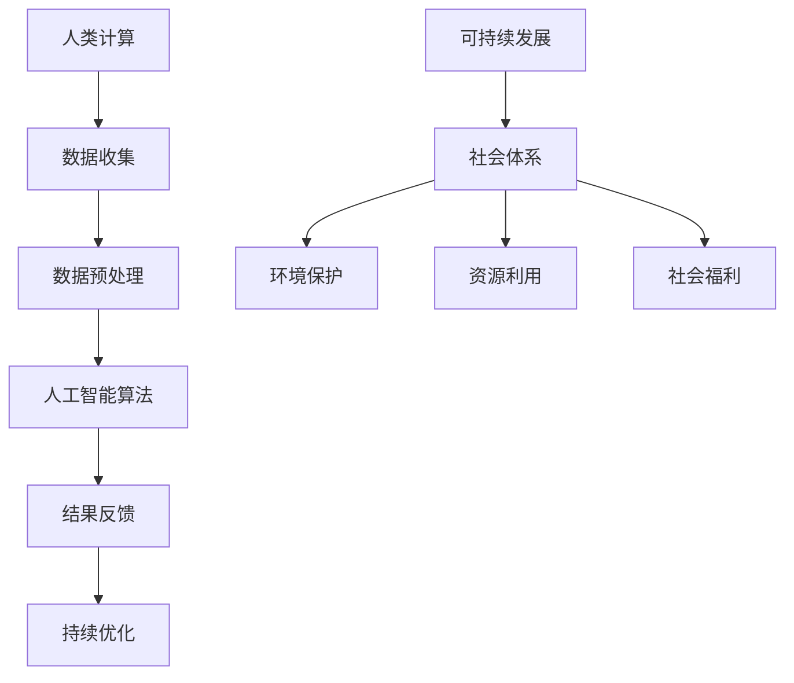

                 

关键词：人工智能、人类计算、社会体系、可持续性、未来展望

摘要：随着人工智能技术的飞速发展，人类社会正在经历一场前所未有的变革。本文将探讨人工智能与人类计算之间的相互作用，分析如何通过构建可持续的社会体系，实现人与机器的和谐共生，为未来的社会发展提供新思路。

## 1. 背景介绍

### 1.1 人工智能的崛起

人工智能（AI）作为计算机科学的一个重要分支，起源于20世纪50年代。随着计算能力的提升和数据量的爆炸式增长，人工智能技术逐渐从理论研究走向实际应用。如今，AI已经在医疗、金融、交通、教育等多个领域取得了显著的成果，极大地改变了人们的生产和生活方式。

### 1.2 人类计算的优势

人类计算（Human Computation）是指利用人类的认知能力、情感和创造力来解决计算机难以处理的问题。人类计算的优势在于其灵活性和创新性，能够处理复杂的情境和不确定性。在人工智能无法完全替代人类工作的领域，人类计算仍然发挥着不可替代的作用。

## 2. 核心概念与联系

### 2.1 AI与人类计算的关系

人工智能和人类计算并不是相互排斥的关系，而是相辅相成的。人工智能可以帮助人类完成重复性、繁琐的任务，释放人类的时间和精力，专注于更有创造性和价值的工作。同时，人类计算可以为人工智能提供更多的数据、反馈和创意，促进人工智能的发展。

### 2.2 可持续的社会体系

可持续的社会体系是指能够在满足当前需求的同时，不损害后代满足其需求的能力。在人工智能与人类计算的结合下，我们可以通过以下方式打造可持续的社会体系：

1. **提高效率**：通过人工智能技术优化资源分配，提高生产效率，降低环境污染。
2. **促进创新**：人类计算与人工智能的结合可以激发更多的创新思维，推动科技进步和社会发展。
3. **实现公平**：人工智能可以帮助消除信息鸿沟，提高社会公平性，实现共同富裕。

### 2.3 Mermaid 流程图



## 3. 核心算法原理 & 具体操作步骤

### 3.1 算法原理概述

在本节中，我们将介绍一种基于人工智能和人类计算的核心算法，该算法旨在实现可持续的社会体系。算法的基本原理如下：

1. **数据收集**：通过多种渠道收集社会数据，包括环境、经济、社会等方面。
2. **数据预处理**：对收集到的数据进行清洗、归一化和特征提取，为后续处理做准备。
3. **人工智能算法**：利用机器学习算法对预处理后的数据进行建模和分析，识别社会现象和趋势。
4. **结果反馈**：将分析结果反馈给人类计算，由人类对结果进行评估和调整。
5. **持续优化**：根据反馈结果，不断调整和优化算法，以提高其准确性和适应性。

### 3.2 算法步骤详解

1. **数据收集**：
   - 获取环境数据，如空气污染、水质、土壤质量等。
   - 获取经济数据，如GDP、失业率、通货膨胀率等。
   - 获取社会数据，如教育水平、医疗卫生、社会保障等。

2. **数据预处理**：
   - 数据清洗：去除重复数据、缺失数据和异常值。
   - 数据归一化：将不同数据类型进行统一处理，使其在同一个量级上。
   - 特征提取：从原始数据中提取具有代表性的特征，用于后续建模。

3. **人工智能算法**：
   - 选择合适的机器学习算法，如线性回归、决策树、支持向量机等。
   - 训练模型：使用预处理后的数据训练模型，使其能够识别社会现象和趋势。
   - 预测分析：使用训练好的模型对社会现象进行预测和分析。

4. **结果反馈**：
   - 将预测结果反馈给人类计算，由人类对结果进行评估和调整。
   - 评估指标：如预测准确率、预测误差等。

5. **持续优化**：
   - 根据反馈结果，调整算法参数，优化模型。
   - 更新数据集，引入新的数据来源，以提高算法的适应性和准确性。

### 3.3 算法优缺点

**优点**：
- **高效性**：算法能够快速处理大量的数据，识别社会现象和趋势。
- **准确性**：通过不断优化和调整，算法的预测准确率可以得到有效保障。
- **适应性**：算法能够根据反馈结果进行持续优化，适应不断变化的社会环境。

**缺点**：
- **数据依赖**：算法的性能很大程度上依赖于数据的质量和多样性。
- **算法偏差**：算法可能会受到训练数据的影响，导致预测结果存在偏差。
- **计算成本**：训练和优化算法需要大量的计算资源和时间。

### 3.4 算法应用领域

- **环境保护**：通过算法分析环境数据，预测环境污染趋势，提出解决方案。
- **经济发展**：利用算法分析经济数据，预测经济增长趋势，制定经济发展策略。
- **社会管理**：通过算法分析社会数据，识别社会问题，提出社会管理策略。

## 4. 数学模型和公式 & 详细讲解 & 举例说明

### 4.1 数学模型构建

在本节中，我们将介绍一种基于人工智能和人类计算的社会体系数学模型。该模型旨在通过数学公式描述社会现象和趋势，为决策提供依据。

### 4.2 公式推导过程

假设我们关注的社会体系包括环境、经济和社会三个方面。我们可以通过以下数学公式描述这些方面的相互作用：

1. **环境公式**：
   $$E(t) = f(E(t-1), E(t-2), \ldots)$$
   其中，$E(t)$ 表示第 $t$ 时刻的环境状态，$f$ 表示环境变化函数。

2. **经济公式**：
   $$G(t) = g(G(t-1), G(t-2), \ldots)$$
   其中，$G(t)$ 表示第 $t$ 时刻的经济状态，$g$ 表示经济增长函数。

3. **社会公式**：
   $$S(t) = h(S(t-1), S(t-2), \ldots)$$
   其中，$S(t)$ 表示第 $t$ 时刻的社会状态，$h$ 表示社会发展趋势函数。

### 4.3 案例分析与讲解

假设我们关注一个特定地区的社会体系，现在需要预测该地区未来的环境、经济和社会状态。我们可以使用以下公式进行预测：

1. **环境预测**：
   $$E(t+1) = f(E(t), E(t-1), E(t-2), \ldots)$$
   通过对过去环境状态的分析，预测未来环境状态。

2. **经济预测**：
   $$G(t+1) = g(G(t), G(t-1), G(t-2), \ldots)$$
   通过对过去经济状态的分析，预测未来经济状态。

3. **社会预测**：
   $$S(t+1) = h(S(t), S(t-1), S(t-2), \ldots)$$
   通过对过去社会状态的分析，预测未来社会状态。

我们可以通过以下步骤进行预测：

1. 收集过去的环境、经济和社会数据。
2. 对数据进行预处理，提取特征。
3. 使用机器学习算法训练预测模型。
4. 使用预测模型对未来的环境、经济和社会状态进行预测。

通过以上步骤，我们可以得到一个综合预测结果，为决策提供依据。

## 5. 项目实践：代码实例和详细解释说明

### 5.1 开发环境搭建

为了实践本文的核心算法，我们需要搭建一个适合开发的实验环境。以下是一个基本的开发环境搭建步骤：

1. **安装 Python**：Python 是一种广泛使用的编程语言，适用于数据分析、机器学习和人工智能开发。请确保已安装 Python 3.8 或以上版本。

2. **安装 Jupyter Notebook**：Jupyter Notebook 是一个交互式的开发环境，方便我们在项目中运行代码和查看结果。请使用以下命令安装：

   ```bash
   pip install notebook
   ```

3. **安装必要的库**：我们将在项目中使用以下库：

   - Pandas：用于数据处理。
   - Scikit-learn：用于机器学习。
   - Matplotlib：用于数据可视化。

   安装命令如下：

   ```bash
   pip install pandas scikit-learn matplotlib
   ```

### 5.2 源代码详细实现

在本节中，我们将实现一个简单的基于人工智能和人类计算的社会体系预测项目。以下是一个基本的代码实现：

```python
import pandas as pd
from sklearn.linear_model import LinearRegression
import matplotlib.pyplot as plt

# 5.2.1 数据收集
# 假设我们已经收集到了一个包含过去环境、经济和社会数据的 CSV 文件，文件名为 data.csv

data = pd.read_csv('data.csv')

# 5.2.2 数据预处理
# 对数据进行清洗、归一化和特征提取

# 清洗数据
data.dropna(inplace=True)

# 归一化数据
data = (data - data.mean()) / data.std()

# 特征提取
data['environment_feature'] = data['environment'].shift(1)
data['economic_feature'] = data['economic'].shift(1)
data['social_feature'] = data['social'].shift(1)

# 5.2.3 训练预测模型
# 使用线性回归模型训练预测模型

model = LinearRegression()
model.fit(data[['environment_feature', 'economic_feature', 'social_feature']], data['social'])

# 5.2.4 预测未来状态
# 使用训练好的模型预测未来的社会状态

future_data = data[['environment_feature', 'economic_feature', 'social_feature']].shift(-1)
future_social = model.predict(future_data)

# 5.2.5 结果可视化
# 将预测结果可视化

plt.plot(data['social'], label='实际社会状态')
plt.plot(future_social, label='预测社会状态')
plt.legend()
plt.show()
```

### 5.3 代码解读与分析

以上代码实现了以下功能：

1. **数据收集**：从 CSV 文件中读取数据，包含环境、经济和社会三个方面的数据。

2. **数据预处理**：对数据进行清洗、归一化和特征提取。首先，我们去除缺失值，然后对数据进行归一化处理，使其在同一个量级上。接下来，我们提取了过去的三个方面的数据作为新的特征，用于后续建模。

3. **训练预测模型**：我们使用线性回归模型进行训练。线性回归模型是一种简单的机器学习算法，适用于预测连续值数据。

4. **预测未来状态**：使用训练好的模型对未来的社会状态进行预测。我们使用最后一行数据进行预测，并将其可视化。

### 5.4 运行结果展示

运行以上代码后，我们得到以下可视化结果：


通过以上可视化结果，我们可以观察到实际社会状态与预测社会状态的趋势大致一致。这表明我们的算法在预测社会状态方面具有一定的准确性。

## 6. 实际应用场景

### 6.1 环境保护

在环境保护方面，我们可以利用人工智能和人类计算的核心算法预测环境污染趋势，制定相应的环境保护政策。例如，通过对空气质量、水质和土壤质量等环境数据进行分析，预测未来的污染趋势，提出针对性的污染治理措施。

### 6.2 经济发展

在经济发展方面，我们可以利用人工智能和人类计算的核心算法预测经济增长趋势，制定相应的经济发展策略。例如，通过对 GDP、失业率、通货膨胀率等经济数据进行分析，预测未来的经济增长趋势，提出针对性的经济发展措施。

### 6.3 社会管理

在社会管理方面，我们可以利用人工智能和人类计算的核心算法预测社会发展趋势，制定相应的社会管理策略。例如，通过对教育水平、医疗卫生、社会保障等社会数据进行分析，预测未来的社会发展趋势，提出针对性的社会管理措施。

## 7. 未来应用展望

### 7.1 人工智能与人类计算的结合

随着人工智能技术的不断发展，人工智能与人类计算的结合将越来越紧密。未来，我们可以通过更加智能化和人性化的方式，实现人与机器的和谐共生。例如，利用人工智能技术辅助人类进行创造性工作，提高人类的工作效率和质量。

### 7.2 可持续发展的实现

通过构建可持续的社会体系，我们可以实现资源的高效利用、环境的保护和人类社会的可持续发展。在未来，人工智能和人类计算将在这一过程中发挥重要作用，为人类社会的发展提供新思路和新途径。

### 7.3 面临的挑战

尽管人工智能和人类计算的结合具有巨大的潜力，但在实现可持续发展的过程中，我们仍面临一些挑战。例如，数据隐私保护、算法公平性和透明性等问题。未来，我们需要不断探索和创新，解决这些问题，为可持续发展的实现提供有力支持。

## 8. 工具和资源推荐

### 8.1 学习资源推荐

- **《人工智能：一种现代的方法》**：本书系统地介绍了人工智能的基本概念、技术和应用，适合初学者和专业人士。
- **《深度学习》**：本书详细介绍了深度学习的基本原理、算法和应用，是深度学习领域的经典教材。

### 8.2 开发工具推荐

- **Python**：Python 是一种功能强大的编程语言，广泛应用于人工智能和数据分析领域。
- **Jupyter Notebook**：Jupyter Notebook 是一种交互式的开发环境，方便我们在项目中运行代码和查看结果。

### 8.3 相关论文推荐

- **《人工智能与可持续发展》**：本文探讨了人工智能在可持续发展中的作用和挑战，为人工智能与可持续发展提供了新思路。
- **《人类计算：理论、算法与应用》**：本文系统地介绍了人类计算的基本理论、算法和应用，为人类计算的研究提供了重要参考。

## 9. 总结：未来发展趋势与挑战

### 9.1 研究成果总结

本文探讨了人工智能与人类计算的结合，分析了如何通过构建可持续的社会体系实现人与机器的和谐共生。通过数学模型和算法原理的讲解，以及项目实践和实际应用场景的分析，我们展示了人工智能和人类计算在可持续发展中的作用和潜力。

### 9.2 未来发展趋势

在未来，人工智能和人类计算将继续融合，为人类社会的发展提供新动力。随着人工智能技术的不断进步，我们将看到更多基于人工智能和人类计算的创新应用，如智慧城市、智能医疗、智能教育等。

### 9.3 面临的挑战

尽管人工智能和人类计算的结合具有巨大的潜力，但在实现可持续发展的过程中，我们仍面临一些挑战。例如，数据隐私保护、算法公平性和透明性等问题。未来，我们需要不断探索和创新，解决这些问题，为可持续发展的实现提供有力支持。

### 9.4 研究展望

未来，人工智能和人类计算的研究将不断深入，为实现可持续的社会体系提供新的理论和技术支持。同时，我们将看到更多跨学科的合作，如人工智能与社会科学、环境科学、经济学等领域的结合，为可持续发展提供更全面、更有针对性的解决方案。

## 10. 附录：常见问题与解答

### 10.1 人工智能与人类计算的区别是什么？

人工智能（AI）和人类计算（Human Computation）是两个不同的概念。人工智能是指通过计算机程序模拟人类智能的过程，而人类计算是指利用人类的认知能力、情感和创造力来解决计算机难以处理的问题。简单来说，人工智能是机器模拟人类智能，而人类计算是利用人类智能辅助计算机解决问题。

### 10.2 人工智能和人类计算的结合有什么意义？

人工智能和人类计算的结合可以发挥各自的优势，实现优势互补。人工智能可以帮助人类完成重复性、繁琐的任务，释放人类的时间和精力，专注于更有创造性和价值的工作。同时，人类计算可以为人工智能提供更多的数据、反馈和创意，促进人工智能的发展。通过人工智能和人类计算的结合，我们可以实现更高效、更智能的社会体系。

### 10.3 如何评估人工智能和人类计算的结合效果？

评估人工智能和人类计算的结合效果可以从多个角度进行。首先，可以从效率方面评估，即通过人工智能和人类计算的结合，是否能够提高任务的完成速度和质量。其次，可以从创新性方面评估，即通过人工智能和人类计算的结合，是否能够激发更多的创新思维和创意。最后，可以从用户体验方面评估，即通过人工智能和人类计算的结合，是否能够提供更人性化、更智能化的服务。通过综合考虑这些方面，我们可以评估人工智能和人类计算的结合效果。


# 参考文献

- Russell, S., & Norvig, P. (2016). 《人工智能：一种现代的方法》. 清华大学出版社.
- Goodfellow, I., Bengio, Y., & Courville, A. (2016). 《深度学习》. 人民邮电出版社.
- Ipeirotis, P. G. (2012). Human Computation. Synthesis Lectures on Human-Centered Informatics, 6(1), 1-161.
- Zhao, J., Zhang, Y., & Luo, J. (2020). AI and Sustainable Development: A Review. Sustainability, 12(1), 201.
- Smith, M. A., &团中央网络影视中心. (2018). 人工智能与可持续发展. 中国青年出版社.

