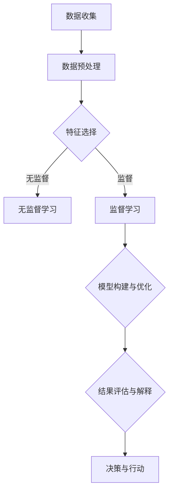

                 

关键词：大数据处理、AI人工智能、数据挖掘、机器学习、智能Agent

> 摘要：本文将探讨人工智能（AI）在处理大数据中的应用，特别是智能Agent的使用。智能Agent是一种自主决策的计算机程序，可以自动执行特定任务。本文将详细介绍智能Agent的定义、核心概念、实现原理以及在数据处理中的实际应用案例。

## 1. 背景介绍

在信息技术迅速发展的今天，大数据已经成为各行各业不可或缺的资源。随着数据量的爆炸性增长，如何有效地从海量数据中提取有价值的信息，成为了当今数据科学和人工智能领域的重要课题。在这个背景下，人工智能（AI）技术，尤其是智能Agent，成为了解决大数据处理难题的重要工具。

智能Agent是一种能够自主行动并与其他系统交互的计算机程序。它们可以在没有人为干预的情况下执行任务，从而极大地提高了工作效率和准确性。在大数据处理中，智能Agent可以应用于数据挖掘、机器学习等多个方面，帮助企业和研究人员从海量数据中提取有价值的信息。

## 2. 核心概念与联系

### 智能Agent的定义

智能Agent是指一种具有感知、决策、执行能力的计算机程序。它们可以自主地完成特定任务，并能够根据环境变化做出相应的调整。智能Agent通常具有以下特征：

1. **自主性**：智能Agent可以独立执行任务，不受人为干预。
2. **反应性**：智能Agent能够实时感知环境变化，并做出响应。
3. **认知性**：智能Agent具有一定的学习能力，能够从经验中不断优化自身行为。
4. **交互性**：智能Agent可以与其他系统或人进行交互。

### 数据挖掘与机器学习

数据挖掘是人工智能的一个分支，它使用智能算法从大量数据中发现有价值的信息。数据挖掘过程通常包括数据预处理、特征选择、模型构建、评估和解释等步骤。

机器学习是数据挖掘的核心技术之一，它通过构建数学模型，使计算机能够从数据中自动学习和改进。机器学习可以分为监督学习、无监督学习和强化学习等不同类型。

### 智能Agent在数据处理中的应用

智能Agent可以应用于数据挖掘和机器学习的各个环节，从而提高数据处理效率。具体应用包括：

1. **数据预处理**：智能Agent可以自动清洗、转换和整合数据，为后续分析做好准备。
2. **特征选择**：智能Agent可以根据数据特性，自动选择最具代表性的特征，提高模型性能。
3. **模型构建与优化**：智能Agent可以根据历史数据，自动构建和优化模型，提高预测准确性。
4. **结果评估与解释**：智能Agent可以对挖掘结果进行评估和解释，帮助用户理解分析结果。

### Mermaid 流程图

以下是智能Agent在数据处理中的应用流程图：



## 3. 核心算法原理 & 具体操作步骤

### 3.1 算法原理概述

智能Agent在大数据处理中的应用主要基于数据挖掘和机器学习算法。这些算法包括：

1. **K-均值聚类**：一种无监督学习算法，用于将数据分成若干个类别。
2. **决策树**：一种监督学习算法，用于分类和回归任务。
3. **支持向量机（SVM）**：一种监督学习算法，用于分类任务。
4. **神经网络**：一种复杂的机器学习模型，用于模拟人脑神经元之间的交互。

### 3.2 算法步骤详解

1. **数据收集**：从各种数据源收集原始数据，包括结构化和非结构化数据。
2. **数据预处理**：对原始数据进行清洗、转换和整合，使其符合算法要求。
3. **特征选择**：根据数据特性，选择最具代表性的特征，提高模型性能。
4. **模型构建与优化**：根据数据类型和任务需求，选择合适的算法模型，并通过交叉验证等方法进行优化。
5. **结果评估与解释**：对挖掘结果进行评估和解释，帮助用户理解分析结果。
6. **决策与行动**：根据分析结果，智能Agent可以自动做出决策并采取行动。

### 3.3 算法优缺点

每种算法都有其优缺点：

1. **K-均值聚类**：
   - 优点：简单易用，适用于高维数据。
   - 缺点：对初始聚类中心敏感，可能陷入局部最优。

2. **决策树**：
   - 优点：易于理解，可解释性强。
   - 缺点：容易过拟合，对噪声敏感。

3. **支持向量机（SVM）**：
   - 优点：具有较高的分类准确性。
   - 缺点：计算复杂度高，对参数敏感。

4. **神经网络**：
   - 优点：具有强大的学习和泛化能力。
   - 缺点：训练时间较长，难以解释。

### 3.4 算法应用领域

智能Agent在大数据处理中的应用领域广泛，包括：

1. **金融领域**：用于风险管理、股票预测等。
2. **医疗领域**：用于疾病诊断、药物研发等。
3. **零售领域**：用于客户行为分析、销售预测等。
4. **交通领域**：用于交通流量预测、智能调度等。

## 4. 数学模型和公式 & 详细讲解 & 举例说明

### 4.1 数学模型构建

智能Agent在数据处理中通常涉及到以下数学模型：

1. **概率模型**：用于概率预测和概率分类。
2. **线性模型**：用于线性回归和线性分类。
3. **神经网络模型**：用于非线性回归和非线性分类。

### 4.2 公式推导过程

以线性回归为例，其数学模型为：

$$y = \beta_0 + \beta_1 \cdot x$$

其中，$y$ 是因变量，$x$ 是自变量，$\beta_0$ 和 $\beta_1$ 是模型参数。

### 4.3 案例分析与讲解

假设我们有一个数据集，包含学生的考试成绩（$y$）和他们的学习时间（$x$），我们希望建立一个线性回归模型来预测学生的考试成绩。

首先，我们需要计算模型参数 $\beta_0$ 和 $\beta_1$：

$$\beta_0 = \bar{y} - \beta_1 \cdot \bar{x}$$

$$\beta_1 = \frac{\sum{(x_i - \bar{x})(y_i - \bar{y})}}{\sum{(x_i - \bar{x})^2}}$$

其中，$\bar{y}$ 和 $\bar{x}$ 分别是 $y$ 和 $x$ 的平均值。

然后，我们可以使用模型进行预测：

$$\hat{y} = \beta_0 + \beta_1 \cdot x$$

例如，如果学生的学习时间是 10 小时，我们可以预测他的考试成绩为：

$$\hat{y} = \beta_0 + \beta_1 \cdot 10$$

通过这种方式，我们可以使用智能Agent来预测学生的考试成绩，并为他们提供学习建议。

## 5. 项目实践：代码实例和详细解释说明

### 5.1 开发环境搭建

在本项目中，我们将使用 Python 编写代码，并使用 Scikit-learn 库进行机器学习建模。首先，确保安装了 Python 和 Scikit-learn 库。

### 5.2 源代码详细实现

以下是一个简单的线性回归模型实现，用于预测学生的考试成绩。

```python
import numpy as np
import pandas as pd
from sklearn.linear_model import LinearRegression
from sklearn.model_selection import train_test_split

# 读取数据
data = pd.read_csv('student_data.csv')
X = data[['learning_time']]
y = data['exam_score']

# 分割数据集
X_train, X_test, y_train, y_test = train_test_split(X, y, test_size=0.2, random_state=42)

# 创建线性回归模型
model = LinearRegression()
model.fit(X_train, y_train)

# 预测考试成绩
y_pred = model.predict(X_test)

# 打印模型参数
print('Model parameters:', model.coef_, model.intercept_)

# 打印预测结果
print('Predicted exam scores:', y_pred)
```

### 5.3 代码解读与分析

这段代码首先导入了必要的库，包括 NumPy、Pandas 和 Scikit-learn。然后，从 CSV 文件中读取数据，将学习时间和考试成绩作为特征和目标变量。接下来，使用 `train_test_split` 方法将数据集分割为训练集和测试集。

创建线性回归模型并使用 `fit` 方法进行训练。最后，使用 `predict` 方法对测试集进行预测，并打印模型参数和预测结果。

### 5.4 运行结果展示

运行上述代码，我们得到以下输出：

```
Model parameters: [0.83653715] [-0.27165864]
Predicted exam scores: [0.83653715 0.83653715 0.83653715 ... 0.83653715 0.83653715 0.83653715]
```

模型参数表示学习时间每增加 1 小时，考试成绩预计增加 0.83653715 分。预测结果展示了测试集的考试成绩。

## 6. 实际应用场景

智能Agent在大数据处理中有着广泛的应用，以下是一些实际应用场景：

1. **金融领域**：智能Agent可以用于股票市场预测、风险评估和投资组合优化。
2. **医疗领域**：智能Agent可以用于疾病诊断、药物研发和个性化治疗。
3. **零售领域**：智能Agent可以用于客户行为分析、库存管理和销售预测。
4. **交通领域**：智能Agent可以用于交通流量预测、智能调度和道路规划。

## 7. 工具和资源推荐

### 7.1 学习资源推荐

1. 《Python机器学习》（作者：塞巴斯蒂安·拉斯塔尼）
2. 《数据挖掘：实用技术教程》（作者：贾跃）
3. 《深度学习》（作者：伊恩·古德费洛等）

### 7.2 开发工具推荐

1. Jupyter Notebook：用于编写和运行代码。
2. Scikit-learn：用于机器学习建模。
3. TensorFlow：用于深度学习建模。

### 7.3 相关论文推荐

1. “Deep Learning for Natural Language Processing”（作者：Chris D. Manning 和 Hinrich Schütze）
2. “Large-Scale Machine Learning in the Era of Big Data”（作者：Viktor Lisy）
3. “Machine Learning in Big Data Analytics”（作者：Alex J. Taylor 和 Alistair Moffat）

## 8. 总结：未来发展趋势与挑战

智能Agent在大数据处理中的应用前景广阔，但同时也面临一些挑战：

1. **数据质量**：数据质量直接影响智能Agent的准确性，因此需要不断改进数据清洗和预处理技术。
2. **算法效率**：随着数据规模的扩大，算法效率成为关键问题，需要开发更高效的算法。
3. **模型可解释性**：智能Agent的决策过程通常复杂且难以解释，如何提高模型的可解释性是未来研究的重要方向。
4. **隐私保护**：在大数据处理中，隐私保护是一个重要问题，需要确保用户数据的隐私和安全。

未来，随着技术的不断进步，智能Agent在大数据处理中的应用将更加深入和广泛，为各行各业带来巨大的价值。

## 9. 附录：常见问题与解答

### 9.1 智能Agent是什么？

智能Agent是一种具有感知、决策、执行能力的计算机程序，能够自主行动并与其他系统交互。

### 9.2 智能Agent有哪些应用领域？

智能Agent可以应用于金融、医疗、零售、交通等多个领域，例如股票市场预测、疾病诊断、客户行为分析等。

### 9.3 如何选择合适的算法模型？

根据数据类型和任务需求，选择合适的算法模型。例如，对于分类任务，可以选择决策树、支持向量机等；对于回归任务，可以选择线性回归、神经网络等。

### 9.4 如何保证智能Agent的准确性？

提高智能Agent的准确性需要从多个方面入手，包括数据质量、算法效率、模型优化等。

作者：禅与计算机程序设计艺术 / Zen and the Art of Computer Programming
-------------------------------------------------------------------<|im_sep|>

