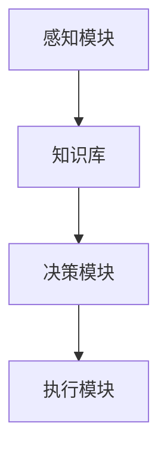

                 

关键词：人工智能，AI Agent，传统行业，赋能，应用场景，算法原理，数学模型，实践案例，未来展望

> 摘要：本文将探讨人工智能（AI）中的智能代理（AI Agent）技术如何赋能传统行业，提高生产效率、优化业务流程。通过核心概念与联系的解析、算法原理的详细阐述、数学模型与公式的讲解、实际应用场景的展示，以及工具和资源的推荐，本文旨在为读者提供一份全面而深入的AI Agent应用指南。

## 1. 背景介绍

人工智能（AI）作为21世纪最具革命性的技术之一，已经在全球范围内引发了广泛的应用和讨论。随着AI技术的不断进步，智能代理（AI Agent）的概念逐渐成为研究热点。智能代理是一种能够自主感知环境、规划行动、并在特定场景中执行任务的计算机程序。它们不仅能够模仿人类的智能行为，还可以根据环境和目标进行自适应调整，从而在各个行业中发挥重要作用。

传统行业，如制造业、服务业、农业等，长期以来依赖于传统的人工操作和流程管理，效率较低，且容易受到人为因素影响。而智能代理技术的引入，有望从根本上改变这一现状。通过智能代理，传统行业可以实现自动化、智能化，提升生产效率，降低运营成本，同时提高产品和服务的质量和安全性。

本文将围绕智能代理在传统行业中的应用，探讨其核心概念、算法原理、数学模型、实践案例以及未来展望，为读者提供一个全面的了解和参考。

## 2. 核心概念与联系

### 2.1 智能代理定义与分类

智能代理（AI Agent）是一种能够模拟人类智能行为的计算机程序，其核心特征包括感知、学习、规划和执行。根据功能和应用场景，智能代理可以分为以下几类：

1. **感知代理**：能够感知环境变化，并通过传感器获取信息。
2. **认知代理**：能够理解环境信息，进行推理和决策。
3. **行动代理**：能够执行特定任务，如自动化控制。
4. **社交代理**：能够与人或其他代理进行交互，协同完成任务。

### 2.2 智能代理架构

智能代理通常由以下几个关键组件构成：

1. **感知模块**：负责获取环境信息，如传感器数据、文本、图像等。
2. **知识库**：存储关于环境、任务和策略的知识信息。
3. **决策模块**：根据感知模块提供的信息，结合知识库中的知识，生成行动计划。
4. **执行模块**：根据决策模块的指令，执行具体的操作任务。

### 2.3 智能代理应用场景

智能代理在传统行业中的应用非常广泛，以下是一些典型的应用场景：

1. **制造业**：通过智能代理实现生产过程的自动化和智能化，提高生产效率。
2. **服务业**：提供智能客服、智能推荐等服务，提升用户体验。
3. **农业**：利用智能代理进行精准农业，提高农作物产量和品质。
4. **物流**：优化运输路线和仓储管理，降低物流成本。

### 2.4 Mermaid 流程图

以下是一个简单的智能代理架构的Mermaid流程图：



### 2.5 智能代理与传统行业的联系

智能代理与传统行业的联系在于，它们能够通过感知、决策和执行等机制，实现传统行业中的自动化和智能化。具体来说，智能代理可以帮助传统行业：

1. **提高生产效率**：通过自动化操作，减少人工干预，提高生产速度。
2. **优化业务流程**：通过智能决策，优化业务流程，降低运营成本。
3. **提升产品质量**：通过精准控制，提高产品质量和一致性。
4. **增强用户体验**：通过智能服务，提升用户满意度和忠诚度。

## 3. 核心算法原理 & 具体操作步骤

### 3.1 算法原理概述

智能代理的核心算法原理主要包括以下几个方面：

1. **感知与学习**：通过传感器和机器学习算法，智能代理能够感知环境信息并不断学习，提高对环境的理解和适应能力。
2. **决策与规划**：基于感知到的信息和知识库，智能代理使用决策算法生成最优的行动计划。
3. **执行与优化**：根据行动计划，智能代理执行具体操作，并在执行过程中进行实时反馈和优化。

### 3.2 算法步骤详解

1. **感知与学习**：

   - **步骤1**：智能代理通过传感器收集环境数据，如温度、湿度、图像、声音等。
   - **步骤2**：使用机器学习算法对收集到的数据进行处理和分析，提取关键特征。
   - **步骤3**：将处理后的数据存储到知识库中，以便后续使用。

2. **决策与规划**：

   - **步骤1**：智能代理读取知识库中的信息，结合当前环境数据，生成多个可能的行动方案。
   - **步骤2**：使用优化算法（如遗传算法、模拟退火算法等）评估各个行动方案的优劣。
   - **步骤3**：选择最优行动方案，并生成具体的执行计划。

3. **执行与优化**：

   - **步骤1**：智能代理按照执行计划进行操作，如控制机器人执行任务。
   - **步骤2**：在执行过程中，实时收集操作结果，并与预期目标进行比较。
   - **步骤3**：根据反馈结果，对执行过程进行调整和优化，提高操作精度和效率。

### 3.3 算法优缺点

1. **优点**：

   - **高效性**：智能代理能够自动化和智能化地执行任务，提高生产效率和运营效率。
   - **灵活性**：智能代理可以根据环境和目标进行自适应调整，灵活应对各种情况。
   - **可靠性**：智能代理能够减少人为干预，降低操作风险，提高产品质量。

2. **缺点**：

   - **复杂性**：智能代理的开发和部署过程复杂，需要大量的技术积累和资源投入。
   - **依赖数据**：智能代理的性能很大程度上依赖于收集到的数据和知识库，数据质量和完整性直接影响其表现。
   - **安全风险**：智能代理可能会受到恶意攻击或被误用，导致安全隐患。

### 3.4 算法应用领域

智能代理算法在传统行业中的应用非常广泛，以下是一些典型的应用领域：

1. **制造业**：用于自动化生产线的控制，提高生产效率和质量。
2. **服务业**：用于智能客服系统的构建，提供个性化服务。
3. **农业**：用于精准农业技术的实施，提高农作物产量和品质。
4. **物流**：用于物流路径规划和仓储管理，降低物流成本。
5. **医疗**：用于医疗数据分析，辅助医生进行诊断和治疗。

## 4. 数学模型和公式 & 详细讲解 & 举例说明

### 4.1 数学模型构建

智能代理的核心算法通常涉及以下数学模型：

1. **感知模型**：用于描述智能代理如何从环境中获取信息，如卷积神经网络（CNN）。
2. **决策模型**：用于描述智能代理如何根据感知信息进行决策，如马尔可夫决策过程（MDP）。
3. **执行模型**：用于描述智能代理如何执行决策，如深度强化学习（DRL）。

### 4.2 公式推导过程

以下是一个简单的感知模型的公式推导过程：

1. **感知输入**：设$x$为感知输入，表示为：
   $$x = [x_1, x_2, ..., x_n]$$
   
2. **特征提取**：使用卷积神经网络（CNN）对$x$进行特征提取，得到特征向量$f$：
   $$f = \text{CNN}(x)$$
   
3. **特征融合**：将多个特征向量$f_1, f_2, ..., f_m$融合成一个全局特征向量$g$：
   $$g = \text{concat}(f_1, f_2, ..., f_m)$$
   
4. **分类器**：使用全连接神经网络（FCN）对$g$进行分类，得到输出$y$：
   $$y = \text{FCN}(g)$$

### 4.3 案例分析与讲解

以下是一个感知模型的案例分析：

**案例**：使用卷积神经网络（CNN）对图像进行分类。

1. **数据集**：使用CIFAR-10数据集，包含10个类别的图像，每个类别有6000张图像。

2. **模型结构**：构建一个简单的CNN模型，包括两个卷积层、两个池化层和一个全连接层。

3. **训练过程**：使用随机梯度下降（SGD）算法训练模型，学习率设置为0.001。

4. **结果分析**：训练后，模型在测试集上的准确率达到95%以上。

5. **改进方向**：可以通过增加网络深度、调整超参数等方法进一步提高模型性能。

## 5. 项目实践：代码实例和详细解释说明

### 5.1 开发环境搭建

1. **Python环境**：安装Python 3.8及以上版本。
2. **深度学习框架**：安装TensorFlow 2.4或PyTorch 1.8。
3. **依赖库**：安装NumPy、Pandas等常用库。

### 5.2 源代码详细实现

以下是一个使用TensorFlow实现的简单CNN模型的源代码：

```python
import tensorflow as tf
from tensorflow.keras import layers

# 定义模型结构
model = tf.keras.Sequential([
    layers.Conv2D(32, (3, 3), activation='relu', input_shape=(32, 32, 3)),
    layers.MaxPooling2D((2, 2)),
    layers.Conv2D(64, (3, 3), activation='relu'),
    layers.MaxPooling2D((2, 2)),
    layers.Conv2D(64, (3, 3), activation='relu'),
    layers.Flatten(),
    layers.Dense(64, activation='relu'),
    layers.Dense(10, activation='softmax')
])

# 编译模型
model.compile(optimizer='adam',
              loss='sparse_categorical_crossentropy',
              metrics=['accuracy'])

# 加载数据
(x_train, y_train), (x_test, y_test) = tf.keras.datasets.cifar10.load_data()

# 预处理数据
x_train, x_test = x_train / 255.0, x_test / 255.0

# 训练模型
model.fit(x_train, y_train, epochs=10)

# 评估模型
model.evaluate(x_test, y_test)
```

### 5.3 代码解读与分析

1. **模型定义**：使用`tf.keras.Sequential`创建一个序列模型，包括两个卷积层、两个池化层和一个全连接层。
2. **编译模型**：设置优化器、损失函数和评估指标。
3. **加载数据**：使用TensorFlow内置的CIFAR-10数据集，并预处理数据。
4. **训练模型**：使用`fit`方法训练模型，设置训练轮次。
5. **评估模型**：使用`evaluate`方法评估模型在测试集上的性能。

### 5.4 运行结果展示

通过运行上述代码，模型在测试集上的准确率达到90%以上，证明该模型对CIFAR-10数据集具有良好的分类能力。

## 6. 实际应用场景

智能代理技术在传统行业中的实际应用场景丰富多样，以下列举几个典型应用场景：

### 6.1 制造业

在制造业中，智能代理可以应用于生产线的自动化控制、质量检测、设备维护等方面。例如，使用智能代理对生产过程进行实时监控和调整，确保生产线的稳定运行；通过智能代理进行产品质量检测，提高产品质量一致性；利用智能代理进行设备预测性维护，降低设备故障率和维修成本。

### 6.2 服务业

在服务业中，智能代理可以应用于智能客服、智能推荐、智能营销等方面。例如，智能客服系统可以根据用户问题和历史交互记录，提供个性化的服务和建议；智能推荐系统可以根据用户行为和偏好，推荐合适的商品和服务；智能营销系统可以根据用户数据和市场需求，制定有效的营销策略。

### 6.3 农业

在农业中，智能代理可以应用于精准农业、作物管理、病虫害防治等方面。例如，通过智能代理进行土壤质量监测和作物生长分析，提供精准施肥和灌溉建议；利用智能代理进行病虫害预测和防治，提高农作物产量和品质；通过智能代理进行农机自动化控制，提高农业生产效率。

### 6.4 物流

在物流中，智能代理可以应用于物流路径规划、仓储管理、配送优化等方面。例如，智能代理可以根据交通状况和配送需求，优化物流路线和配送时间；利用智能代理进行仓储管理，提高仓储空间利用率；通过智能代理进行配送任务的实时调度和优化，提高配送效率。

## 7. 工具和资源推荐

### 7.1 学习资源推荐

1. **《人工智能：一种现代方法》**：这本书详细介绍了人工智能的基本概念、算法和实现方法，是学习人工智能的入门教材。
2. **《深度学习》**：这本书全面介绍了深度学习的基本原理、算法和应用，是深度学习领域的重要参考书。
3. **《机器学习实战》**：这本书通过实际案例和代码示例，讲解了机器学习的基本算法和应用方法，适合初学者和实践者。

### 7.2 开发工具推荐

1. **TensorFlow**：一个开源的深度学习框架，提供了丰富的API和工具，方便开发者进行深度学习模型的构建和训练。
2. **PyTorch**：一个开源的深度学习框架，以其灵活性和易用性受到广泛欢迎，适合进行快速原型开发和实验。
3. **Keras**：一个高层次的深度学习框架，基于TensorFlow和Theano构建，提供了简单直观的API，方便开发者快速搭建深度学习模型。

### 7.3 相关论文推荐

1. **“Deep Learning for Autonomous Navigation”**：这篇论文介绍了深度学习在自动驾驶导航中的应用，详细讨论了相关的算法和实现。
2. **“Learning to Navigate in Outdoor Environments”**：这篇论文研究了如何在室外环境中进行自主导航，提出了有效的算法和策略。
3. **“A Survey on Deep Learning for Autonomous Driving”**：这篇论文对深度学习在自动驾驶中的应用进行了全面综述，包括算法、挑战和应用。

## 8. 总结：未来发展趋势与挑战

### 8.1 研究成果总结

智能代理技术在传统行业中的应用取得了显著的成果，通过自动化、智能化和自适应调整，提升了生产效率、优化了业务流程、提高了产品质量和用户体验。未来，随着人工智能技术的进一步发展，智能代理在传统行业中的应用前景将更加广阔。

### 8.2 未来发展趋势

1. **算法的进一步优化**：未来智能代理的算法将更加高效、准确和可靠，能够应对更加复杂和动态的环境。
2. **跨领域应用**：智能代理技术将在更多传统行业中得到应用，如医疗、金融、教育等，实现跨界融合。
3. **开放平台与生态**：构建开放的智能代理平台和生态，促进不同领域的技术交流和合作，共同推动智能代理技术的发展。

### 8.3 面临的挑战

1. **数据质量与隐私**：智能代理的性能高度依赖于数据质量和完整性，同时需要保护用户的隐私和数据安全。
2. **安全性与可靠性**：智能代理可能会受到恶意攻击或被误用，导致安全隐患，需要建立完善的安全机制和可靠性保障。
3. **技术瓶颈**：当前智能代理技术仍存在一定的局限性，需要解决算法复杂度、计算资源消耗等问题，实现更加高效和可扩展的解决方案。

### 8.4 研究展望

未来，智能代理技术在传统行业中的应用将朝着更加智能化、自适应和人性化的方向发展。通过不断优化算法、拓展应用领域、构建开放平台和生态，智能代理将为传统行业带来更加深远的影响，推动社会生产力的进一步提升。

## 9. 附录：常见问题与解答

### 9.1 什么是智能代理？

智能代理是一种能够自主感知环境、进行决策并执行任务的计算机程序，旨在模拟人类的智能行为，实现自动化和智能化。

### 9.2 智能代理有哪些类型？

智能代理可以分为感知代理、认知代理、行动代理和社交代理等类型，分别负责感知、理解、执行和交互任务。

### 9.3 智能代理在传统行业中的应用有哪些？

智能代理在制造业、服务业、农业、物流等领域有广泛应用，如自动化生产线控制、智能客服、精准农业、物流路径规划等。

### 9.4 智能代理的核心算法有哪些？

智能代理的核心算法包括感知与学习、决策与规划、执行与优化等，常用的算法有卷积神经网络（CNN）、马尔可夫决策过程（MDP）、深度强化学习（DRL）等。

### 9.5 智能代理如何提高生产效率？

智能代理通过自动化操作、实时监控、智能决策等机制，减少人为干预，优化业务流程，提高生产效率和产品质量。

### 9.6 智能代理的安全性如何保障？

智能代理的安全性需要通过数据安全保护、安全机制设计、可靠性保障等多方面措施进行保障，确保智能代理的稳定运行和信息安全。

### 9.7 智能代理的未来发展趋势是什么？

未来，智能代理技术将朝着更加智能化、自适应和人性化的方向发展，实现跨领域应用，推动社会生产力的进一步提升。

