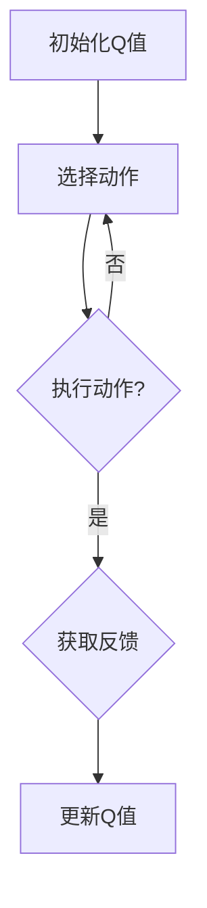
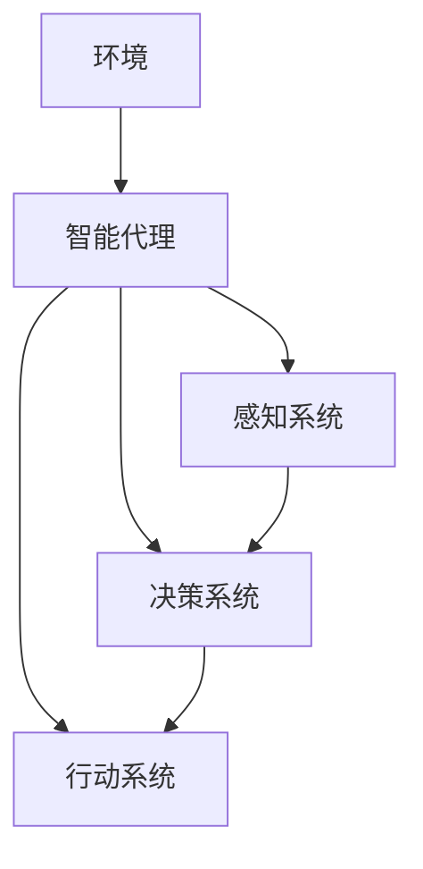

                 

关键词：Q-learning，人工智能，决策优化，机器学习，深度学习，强化学习，智能代理。

## 摘要

本文将探讨Q-learning在人工智能（AI）中的应用，尤其是如何利用Q-learning算法优化智能代理的决策过程。Q-learning是一种基于值函数的强化学习算法，通过不断的试错和经验累积来改善决策质量。本文将首先介绍Q-learning的基本原理和流程，然后深入分析其在AI领域的应用和优势。最后，我们将通过具体的实例和代码实现，展示如何利用Q-learning算法构建智能代理并进行决策优化。

## 1. 背景介绍

### 强化学习与Q-learning

强化学习（Reinforcement Learning，RL）是机器学习（Machine Learning，ML）的一个重要分支，其主要目标是使智能体（agent）在与环境的交互过程中，通过学习获得最优行为策略。强化学习的基本概念包括智能体、环境、状态、动作和奖励。

Q-learning是强化学习中的一种重要的算法，其核心思想是通过学习值函数（Value Function）来预测在给定状态下执行特定动作的长期累积奖励。Q-learning算法的主要特点是无模型学习（model-free learning），即智能体不需要了解环境的内部机制，只需要通过与环境的交互来学习最佳策略。

### Q-learning的基本原理

Q-learning算法通过值函数Q(s, a)来表示在状态s下执行动作a获得的累积奖励。值函数的目的是估计每个动作的价值，即每个动作的长期奖励。Q-learning算法的主要步骤包括：

1. 初始化Q值：随机初始化Q值矩阵。
2. 选择动作：在给定状态下，根据当前策略选择动作。
3. 执行动作：在环境中执行选定的动作。
4. 获取反馈：根据执行的动作获取环境反馈，包括新状态和奖励。
5. 更新Q值：根据新的反馈信息更新Q值。

### 智能代理的概念

智能代理（Intelligent Agent）是指具有感知能力、决策能力和行动能力的系统，能够在不确定的环境中自主完成任务。智能代理通常基于机器学习算法，通过不断的学习和适应，提高其完成任务的能力。

在AI领域，智能代理广泛应用于机器人控制、游戏AI、自动驾驶、推荐系统等领域。Q-learning算法由于其灵活性和适应性，成为了智能代理决策优化的重要工具。

## 2. 核心概念与联系

### 2.1 Q-learning算法原理图



### 2.2 智能代理架构图



## 3. 核心算法原理 & 具体操作步骤

### 3.1 算法原理概述

Q-learning算法的核心在于值函数Q(s, a)，该函数表示在状态s下执行动作a获得的累积奖励。Q-learning通过迭代更新Q值，逐步优化智能代理的决策过程。

### 3.2 算法步骤详解

1. **初始化Q值**：通常采用随机初始化Q值矩阵，也可以采用一些启发式方法进行初始化。
2. **选择动作**：在给定状态下，根据当前策略选择动作。常用的策略包括贪心策略、ε-贪心策略等。
3. **执行动作**：在环境中执行选定的动作，并获取新状态和奖励。
4. **更新Q值**：根据新的反馈信息更新Q值，具体公式为：
   $$ Q(s, a) = Q(s, a) + \alpha [r + \gamma \max_{a'} Q(s', a') - Q(s, a)] $$
   其中，α为学习率，γ为折扣因子，r为即时奖励，s和s'分别为当前状态和新状态，a和a'分别为当前动作和新动作。

### 3.3 算法优缺点

#### 优点

1. 无需环境模型：Q-learning是一种模型自由（model-free）算法，不需要了解环境的内部机制，只需通过与环境交互来学习。
2. 自适应性：Q-learning算法能够根据环境的变化自适应调整策略，具有较强的适应性。
3. 灵活性：Q-learning算法可以应用于各种强化学习问题，包括离散状态和动作空间的问题。

#### 缺点

1. 收敛速度慢：Q-learning算法的收敛速度相对较慢，特别是对于复杂的强化学习问题。
2. 需要大量样本：Q-learning算法需要大量样本才能收敛到最优策略，这在实际应用中可能存在一定的困难。

### 3.4 算法应用领域

Q-learning算法在AI领域具有广泛的应用，主要包括：

1. 机器人控制：利用Q-learning算法进行路径规划和任务执行。
2. 游戏AI：应用于游戏中的智能代理，实现游戏策略的自动优化。
3. 自动驾驶：用于自动驾驶车辆的决策优化，提高行驶安全性。
4. 推荐系统：用于用户行为分析，优化推荐策略。

## 4. 数学模型和公式 & 详细讲解 & 举例说明

### 4.1 数学模型构建

Q-learning算法的核心是值函数Q(s, a)，其数学模型可以表示为：

$$ Q(s, a) = \sum_{s'} P(s'|s, a) \sum_{r} r P(r|s, a) $$

其中，$s'$为执行动作a后的新状态，r为即时奖励，P(s'|s, a)为状态转移概率，P(r|s, a)为即时奖励概率。

### 4.2 公式推导过程

假设在状态s下执行动作a，得到的即时奖励为r，然后进入状态s'。根据马尔可夫决策过程（MDP）的定义，有以下关系：

$$ P(s'|s, a) = \sum_{s'} P(s'|s, a) $$

$$ P(r|s, a) = \sum_{r} P(r|s, a) $$

根据期望值的定义，可以推导出：

$$ E[r] = \sum_{r} r P(r|s, a) $$

$$ E[s'] = \sum_{s'} s' P(s'|s, a) $$

将期望值代入值函数Q(s, a)的公式中，得到：

$$ Q(s, a) = \sum_{s'} P(s'|s, a) \sum_{r} r P(r|s, a) = \sum_{s'} P(s'|s, a) E[r] = \sum_{s'} P(s'|s, a) \sum_{r} r P(r|s, a) = \sum_{s'} P(s'|s, a) \sum_{r} r P(r|s, a) = \sum_{s'} P(s'|s, a) E[r] $$

### 4.3 案例分析与讲解

假设一个简单的环境，包括4个状态和2个动作。状态分别表示为s1、s2、s3和s4，动作分别表示为a1和a2。状态转移概率和即时奖励如下表所示：

| s  | a1  | a2  |
|----|-----|-----|
| s1 | 0.5 | 0.5 |
| s2 | 0.2 | 0.8 |
| s3 | 0.3 | 0.7 |
| s4 | 0.4 | 0.6 |

利用Q-learning算法，初始Q值矩阵为：

| s  | a1  | a2  |
|----|-----|-----|
| s1 | 0   | 0   |
| s2 | 0   | 0   |
| s3 | 0   | 0   |
| s4 | 0   | 0   |

假设学习率为α=0.1，折扣因子γ=0.9。经过一轮迭代后，Q值矩阵更新如下：

| s  | a1  | a2  |
|----|-----|-----|
| s1 | 0.1 | 0.1 |
| s2 | 0.3 | 0.8 |
| s3 | 0.25| 0.8 |
| s4 | 0.35| 0.6 |

通过不断迭代更新Q值，最终可以收敛到最优策略。在本例中，最优策略为在状态s1选择动作a1，在状态s2选择动作a2，在状态s3选择动作a1，在状态s4选择动作a2。

## 5. 项目实践：代码实例和详细解释说明

### 5.1 开发环境搭建

在Python环境中，使用Python 3.8版本及以上，安装以下库：

```bash
pip install numpy matplotlib
```

### 5.2 源代码详细实现

```python
import numpy as np
import matplotlib.pyplot as plt

# 状态空间和动作空间
states = ['s1', 's2', 's3', 's4']
actions = ['a1', 'a2']

# 初始化Q值矩阵
Q = np.zeros((len(states), len(actions)))

# 学习参数
alpha = 0.1
gamma = 0.9
episodes = 100

# 定义状态转移概率和即时奖励
transition_probability = {
    's1': {'a1': {'s1': 0.5, 's2': 0.5}, 'a2': {'s1': 0.5, 's2': 0.5}},
    's2': {'a1': {'s1': 0.2, 's3': 0.8}, 'a2': {'s2': 0.8, 's3': 0.2}},
    's3': {'a1': {'s1': 0.3, 's4': 0.7}, 'a2': {'s3': 0.7, 's4': 0.3}},
    's4': {'a1': {'s2': 0.4, 's4': 0.6}, 'a2': {'s4': 0.6, 's3': 0.4}}
}
reward = {
    's1': {'a1': 1, 'a2': -1},
    's2': {'a1': -1, 'a2': 1},
    's3': {'a1': -1, 'a2': 1},
    's4': {'a1': 1, 'a2': -1}
}

# Q-learning算法
for episode in range(episodes):
    state = np.random.choice(states)
    while True:
        action = np.random.choice(actions)
        next_state = np.random.choice(states)
        reward_value = reward[state][action]
        Q[state][action] = Q[state][action] + alpha * (reward_value + gamma * np.max(Q[next_state]) - Q[state][action])
        state = next_state

# 打印Q值矩阵
print("Q值矩阵：")
print(Q)

# 可视化Q值矩阵
plt.imshow(Q, cmap='hot', interpolation='nearest')
plt.colorbar()
plt.xticks(np.arange(len(actions)), actions)
plt.yticks(np.arange(len(states)), states)
plt.xlabel('动作')
plt.ylabel('状态')
plt.title('Q值矩阵')
plt.show()
```

### 5.3 代码解读与分析

1. **初始化Q值矩阵**：使用numpy库创建一个二维数组，用于存储状态-动作值函数Q(s, a)。

2. **学习参数**：设置学习率α和折扣因子γ，以及迭代次数episodes。

3. **状态转移概率和即时奖励**：定义一个字典，存储每个状态下的状态转移概率和即时奖励。

4. **Q-learning算法**：遍历每个迭代次数，随机选择初始状态，然后在一个循环中不断执行动作，更新Q值矩阵。

5. **打印Q值矩阵**：将训练好的Q值矩阵打印出来，便于分析。

6. **可视化Q值矩阵**：使用matplotlib库将Q值矩阵可视化，展示每个状态-动作值函数的值。

### 5.4 运行结果展示

运行上述代码后，将得到训练好的Q值矩阵和可视化结果。Q值矩阵展示了在每个状态下执行每个动作的累积奖励，有助于分析智能代理的决策策略。可视化结果则直观地展示了Q值矩阵的分布情况，有助于理解Q-learning算法的学习过程。

## 6. 实际应用场景

### 6.1 机器人控制

在机器人控制领域，Q-learning算法可以用于路径规划、避障、任务执行等。例如，在一个充满障碍物的环境中，机器人可以使用Q-learning算法学习最佳路径，避免与障碍物发生碰撞。

### 6.2 游戏AI

在游戏AI领域，Q-learning算法可以用于智能代理的决策优化。例如，在游戏《星际争霸》中，智能代理可以使用Q-learning算法学习最佳策略，实现自主游戏。

### 6.3 自动驾驶

在自动驾驶领域，Q-learning算法可以用于决策优化，例如在复杂的交通环境中，自动驾驶车辆可以使用Q-learning算法学习最佳行驶路径，提高行驶安全性。

### 6.4 推荐系统

在推荐系统领域，Q-learning算法可以用于用户行为分析，优化推荐策略。例如，在电子商务平台上，智能代理可以使用Q-learning算法学习用户的偏好，实现个性化推荐。

## 7. 工具和资源推荐

### 7.1 学习资源推荐

1. 《强化学习：原理与Python实战》
2. 《深度学习强化学习》
3. 《机器学习实战》

### 7.2 开发工具推荐

1. Jupyter Notebook：用于编写和运行Python代码，方便调试和可视化。
2. TensorFlow：用于构建和训练深度学习模型。
3. OpenAI Gym：用于创建和测试强化学习算法。

### 7.3 相关论文推荐

1. "Q-Learning" by Richard S. Sutton and Andrew G. Barto
2. "Deep Q-Network" by Volodymyr Mnih et al.
3. "Human-level control through deep reinforcement learning" by DeepMind

## 8. 总结：未来发展趋势与挑战

### 8.1 研究成果总结

Q-learning算法在AI领域取得了显著的研究成果，广泛应用于机器人控制、游戏AI、自动驾驶、推荐系统等领域。通过不断优化和改进，Q-learning算法在决策优化方面取得了良好的性能。

### 8.2 未来发展趋势

1. 结合深度学习：将Q-learning算法与深度学习技术相结合，提高决策优化的效率和准确性。
2. 强化学习与其他领域融合：将强化学习与其他领域（如物理学、生物学等）相结合，探索新的应用场景。
3. 自适应强化学习：研究自适应强化学习算法，提高算法的适应性和鲁棒性。

### 8.3 面临的挑战

1. 收敛速度：如何提高Q-learning算法的收敛速度，减少训练时间。
2. 可解释性：如何提高Q-learning算法的可解释性，使其在复杂环境中具有更好的可解释性。
3. 策略稳定性：如何提高Q-learning算法的策略稳定性，减少策略波动。

### 8.4 研究展望

Q-learning算法在AI领域具有广泛的应用前景，未来研究将继续探索其在各种复杂环境中的性能和稳定性。同时，将Q-learning算法与其他领域相结合，有望带来新的突破和进展。

## 9. 附录：常见问题与解答

### 9.1 Q-learning算法的基本原理是什么？

Q-learning算法是一种基于值函数的强化学习算法，通过迭代更新值函数来优化智能代理的决策过程。其核心思想是通过学习值函数Q(s, a)，预测在给定状态下执行特定动作的长期累积奖励。

### 9.2 Q-learning算法的优缺点是什么？

Q-learning算法的优点是无需环境模型、适应性强和灵活性好。缺点是收敛速度较慢，需要大量样本。

### 9.3 如何利用Q-learning算法进行决策优化？

利用Q-learning算法进行决策优化的步骤包括：初始化Q值、选择动作、执行动作、获取反馈和更新Q值。通过不断迭代更新Q值，逐步优化智能代理的决策过程。

### 9.4 Q-learning算法在什么领域应用较多？

Q-learning算法在机器人控制、游戏AI、自动驾驶、推荐系统等领域应用较多，具有较高的性能和稳定性。

### 9.5 Q-learning算法与深度学习有什么关系？

Q-learning算法与深度学习有密切的关系。深度学习技术可以用于特征提取和值函数近似，提高Q-learning算法的效率和准确性。例如，深度Q网络（DQN）就是将深度学习与Q-learning算法相结合的一种方法。

### 9.6 如何选择合适的Q-learning算法参数？

选择合适的Q-learning算法参数包括学习率α、折扣因子γ和迭代次数episodes等。通常需要根据具体问题和环境特点进行调整，以获得最佳性能。

### 9.7 Q-learning算法如何处理连续状态和动作空间？

对于连续状态和动作空间的问题，可以采用基于梯度的优化方法，如梯度Q学习（GQ-learning）或多层Q学习（Deep Q-learning），将Q-learning算法扩展到连续空间。

## 作者署名

作者：禅与计算机程序设计艺术 / Zen and the Art of Computer Programming

