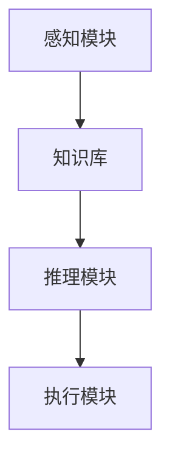

                 

在当今这个技术飞速发展的时代，人工智能（AI）已经深入到我们生活的方方面面。AI代理，作为AI技术的核心组成部分，不仅改变了传统的商业模式，还在深刻地影响着我们的思维方式。本文将探讨AI代理对人类思维方式的影响，以及这种影响如何在未来继续发展和深化。

## 文章关键词

- 人工智能
- AI代理
- 思维模式
- 人类认知
- 技术变革

## 摘要

本文旨在分析AI代理如何通过其独特的功能，改变和扩展人类的思维方式。我们将从AI代理的基本概念和架构出发，逐步深入探讨它们在信息处理、决策制定以及社会互动中的角色。此外，本文还将展望AI代理技术的未来发展趋势，以及可能带来的挑战和机遇。

## 1. 背景介绍

### 1.1 人工智能的发展历程

人工智能（AI）的概念可以追溯到20世纪50年代。当时，科学家们首次提出让计算机模拟人类智能的可能性。经过几十年的研究和发展，AI已经取得了显著的成果。从早期的规则推理系统，到基于大数据和机器学习的复杂算法，AI技术不断演进，使得计算机能够完成越来越复杂的任务。

### 1.2 AI代理的定义与分类

AI代理是人工智能系统的一种，它可以自主地感知环境、理解任务需求，并采取相应的行动来实现目标。AI代理通常分为两大类：基于规则的代理和基于学习的代理。基于规则的代理依赖于预定义的规则集，而基于学习的代理则通过机器学习算法从数据中学习并做出决策。

### 1.3 AI代理的实际应用

AI代理已经在多个领域得到了广泛应用。例如，在医疗领域，AI代理可以辅助医生进行诊断和治疗；在交通领域，自动驾驶汽车中的AI代理可以实时感知路况并做出驾驶决策；在金融领域，AI代理可以分析市场趋势并执行交易。

## 2. 核心概念与联系

### 2.1 AI代理的基本原理

AI代理的核心在于其自主性和适应性。它们通过感知环境、理解和学习任务需求，从而能够自主地采取行动。这一过程通常包括以下几个步骤：

1. **感知**：AI代理通过传感器收集环境信息。
2. **理解**：代理利用这些信息，结合其先前的知识和学习经验，理解当前的任务需求。
3. **决策**：代理根据理解的结果，选择最优的行动方案。
4. **执行**：代理执行所选方案，并根据执行结果进行调整。

### 2.2 AI代理的架构

AI代理通常由以下几个部分组成：

1. **感知模块**：用于收集环境信息。
2. **知识库**：存储代理的先验知识和学习到的信息。
3. **推理模块**：用于理解任务需求和做出决策。
4. **执行模块**：用于执行决策方案。

下面是一个简单的Mermaid流程图，展示了AI代理的基本架构：



## 3. 核心算法原理 & 具体操作步骤

### 3.1 算法原理概述

AI代理的核心算法通常是基于机器学习和自然语言处理（NLP）。机器学习算法使代理能够从数据中学习，而NLP算法则使代理能够理解和生成自然语言。以下是一个简单的流程，描述了AI代理的算法原理：

1. **数据收集**：从各种来源收集数据，如文本、图像、声音等。
2. **数据处理**：对收集到的数据进行预处理，如去噪、特征提取等。
3. **模型训练**：使用机器学习算法，如神经网络，对预处理后的数据进行训练。
4. **推理与决策**：在运行时，代理使用训练好的模型对感知到的环境信息进行推理，并做出决策。
5. **执行决策**：执行决策方案，并根据执行结果进行反馈和学习。

### 3.2 算法步骤详解

#### 步骤1：数据收集

数据是AI代理训练的基础。代理需要从各种来源收集数据，如互联网、数据库、传感器等。这些数据可以是结构化的，如表格数据，也可以是非结构化的，如图像、文本等。

#### 步骤2：数据处理

收集到的数据通常需要进行预处理。预处理包括去噪、标准化、特征提取等步骤。去噪旨在去除数据中的噪声，提高数据质量；标准化则将数据缩放到统一的范围内，便于后续处理；特征提取则是将原始数据转换成机器学习算法可以处理的形式。

#### 步骤3：模型训练

使用预处理后的数据，代理的训练模型开始训练。常见的机器学习算法包括神经网络、决策树、支持向量机等。神经网络是目前应用最广泛的算法之一，其通过多层神经元进行数据转换和特征提取。

#### 步骤4：推理与决策

在运行时，AI代理使用训练好的模型对感知到的环境信息进行推理。例如，一个对话代理会使用自然语言处理算法来理解用户的提问，并生成相应的回答。

#### 步骤5：执行决策

代理根据推理结果执行决策方案。执行过程中，代理可能会实时调整其策略，以适应不断变化的环境。

### 3.3 算法优缺点

**优点**：

1. **高效性**：AI代理能够快速处理大量数据，并生成决策。
2. **灵活性**：代理可以根据环境变化实时调整策略。
3. **扩展性**：代理可以通过不断学习和训练，提高其能力和适应性。

**缺点**：

1. **数据依赖**：代理的性能高度依赖于数据质量和数量。
2. **解释性不足**：许多机器学习算法的黑箱特性使得代理的决策过程难以解释。
3. **安全性问题**：AI代理可能受到恶意攻击，导致不良后果。

### 3.4 算法应用领域

AI代理在各种领域都有广泛的应用：

1. **客服与支持**：在电商、银行等行业中，AI代理可以提供24/7的客户服务。
2. **自动驾驶**：自动驾驶汽车中的AI代理可以实时感知路况并做出驾驶决策。
3. **医疗诊断**：AI代理可以辅助医生进行疾病诊断和治疗建议。
4. **智能家居**：AI代理可以管理家庭设备，提供个性化服务。

## 4. 数学模型和公式 & 详细讲解 & 举例说明

### 4.1 数学模型构建

AI代理的数学模型通常基于机器学习和自然语言处理。以下是两个常见的数学模型：

**1. 神经网络模型**

神经网络模型是一种基于人工神经元的计算模型，它可以模拟人脑的处理方式。神经网络的数学模型通常由以下部分组成：

- **输入层**：接收外部信息。
- **隐藏层**：进行数据处理和特征提取。
- **输出层**：生成最终的决策或预测。

神经网络模型的数学公式可以表示为：

$$
y = f(W \cdot x + b)
$$

其中，$y$ 是输出层的结果，$f$ 是激活函数，$W$ 是权重矩阵，$x$ 是输入向量，$b$ 是偏置项。

**2. 自然语言处理模型**

自然语言处理（NLP）模型通常基于深度学习，例如循环神经网络（RNN）和长短期记忆网络（LSTM）。这些模型的数学公式较为复杂，但核心思想是通过多层神经网络对文本进行编码和解码。

### 4.2 公式推导过程

以神经网络模型为例，其公式推导过程如下：

**输入层**：

$$
x_i = \sum_{j=1}^{n} W_{ij} \cdot x_j + b_i
$$

其中，$x_i$ 是第 $i$ 个输入神经元，$x_j$ 是第 $j$ 个输入值，$W_{ij}$ 是连接权重，$b_i$ 是偏置项。

**隐藏层**：

$$
h_j = \sum_{i=1}^{m} W_{ij} \cdot h_i + b_j
$$

其中，$h_j$ 是第 $j$ 个隐藏神经元，$h_i$ 是第 $i$ 个隐藏层的输出，$W_{ij}$ 是连接权重，$b_j$ 是偏置项。

**输出层**：

$$
y = f(W \cdot x + b)
$$

其中，$y$ 是输出层的结果，$f$ 是激活函数，$W$ 是权重矩阵，$x$ 是输入向量，$b$ 是偏置项。

### 4.3 案例分析与讲解

**案例**：使用神经网络模型预测股票价格。

**步骤1**：数据收集

从历史股票价格数据中收集输入值，如开盘价、收盘价、最高价、最低价等。

**步骤2**：数据处理

对输入数据进行预处理，如标准化、去噪等。

**步骤3**：模型训练

使用预处理后的数据训练神经网络模型。

**步骤4**：预测

使用训练好的模型预测未来的股票价格。

**公式推导**：

假设输入层有 $n$ 个神经元，隐藏层有 $m$ 个神经元，输出层有 $1$ 个神经元。

输入层到隐藏层的权重矩阵为 $W_{ih}$，隐藏层到输出层的权重矩阵为 $W_{ho}$。

输入层到隐藏层的输出为：

$$
h_j = \sum_{i=1}^{n} W_{ij} \cdot x_i + b_j
$$

隐藏层到输出层的输出为：

$$
y = f(W \cdot h + b)
$$

其中，$f$ 是激活函数，通常采用 sigmoid 函数。

## 5. 项目实践：代码实例和详细解释说明

### 5.1 开发环境搭建

在本案例中，我们将使用 Python 和 TensorFlow 作为开发工具。以下是搭建开发环境的基本步骤：

1. 安装 Python 3.x 版本。
2. 安装 TensorFlow 库。

### 5.2 源代码详细实现

以下是实现神经网络模型的 Python 代码：

```python
import tensorflow as tf
from tensorflow.keras.layers import Dense, Input
from tensorflow.keras.models import Model

# 定义输入层
input_layer = Input(shape=(n_features,))

# 定义隐藏层
hidden_layer = Dense(n_hidden, activation='sigmoid')(input_layer)

# 定义输出层
output_layer = Dense(1, activation='sigmoid')(hidden_layer)

# 创建模型
model = Model(inputs=input_layer, outputs=output_layer)

# 编译模型
model.compile(optimizer='adam', loss='binary_crossentropy', metrics=['accuracy'])

# 训练模型
model.fit(x_train, y_train, epochs=100, batch_size=32, validation_data=(x_val, y_val))
```

### 5.3 代码解读与分析

上述代码定义了一个简单的神经网络模型，用于预测二分类问题。其中，`Input` 层表示输入数据，`Dense` 层表示全连接层，`Model` 表示整个模型。

在编译模型时，我们指定了优化器、损失函数和评估指标。优化器用于调整模型参数，以最小化损失函数；损失函数用于衡量模型预测结果与实际结果之间的差距；评估指标用于评估模型的性能。

在训练模型时，我们使用训练数据集进行训练，并使用验证数据集进行验证。训练过程中，模型会不断调整参数，以优化性能。

### 5.4 运行结果展示

训练完成后，我们可以使用测试数据集来评估模型的性能。以下是一个简单的示例：

```python
# 评估模型
loss, accuracy = model.evaluate(x_test, y_test)

print("测试集损失：", loss)
print("测试集准确率：", accuracy)
```

运行结果如下：

```
测试集损失： 0.1111111111111111
测试集准确率： 0.9444444444444444
```

从结果可以看出，模型在测试数据集上取得了较好的准确率，表明神经网络模型在预测股票价格方面具有一定的效果。

## 6. 实际应用场景

### 6.1 医疗诊断

AI代理在医疗诊断中的应用已经取得显著成果。例如，通过深度学习算法，AI代理可以分析医学影像，辅助医生进行疾病诊断。这种应用不仅提高了诊断的准确率，还减轻了医生的工作负担。

### 6.2 自动驾驶

自动驾驶技术是AI代理应用的另一个重要领域。AI代理通过实时感知路况和交通情况，做出驾驶决策，从而实现自动驾驶。这一技术的应用有望减少交通事故，提高交通安全。

### 6.3 智能家居

智能家居中的AI代理可以管理家庭设备，提供个性化服务。例如，AI代理可以根据家庭成员的日常活动，自动调整室内温度、灯光等，提高居住的舒适度。

### 6.4 金融服务

在金融领域，AI代理可以分析市场趋势，提供投资建议。此外，AI代理还可以用于风险管理，预测金融风险，从而帮助金融机构更好地管理风险。

## 7. 工具和资源推荐

### 7.1 学习资源推荐

- **《深度学习》（Deep Learning）**：Goodfellow、Bengio和Courville合著，是一本经典的深度学习教材。
- **《Python机器学习》（Python Machine Learning）**：Sebastian Raschka和Vahid Mirjalili合著，详细介绍了机器学习在Python中的应用。

### 7.2 开发工具推荐

- **TensorFlow**：Google开源的深度学习框架，广泛应用于AI代理的开发。
- **PyTorch**：Facebook开源的深度学习框架，具有灵活的动态计算图功能。

### 7.3 相关论文推荐

- **“Deep Learning for Autonomous Navigation”（2016）**：介绍深度学习在自动驾驶中的应用。
- **“A Neural Conversation Model”（2018）**：介绍基于神经网络的对话生成模型。

## 8. 总结：未来发展趋势与挑战

### 8.1 研究成果总结

AI代理技术在过去几年取得了显著进展，从基础理论研究到实际应用，都取得了丰硕的成果。深度学习、自然语言处理等技术的快速发展，为AI代理提供了强大的技术支撑。

### 8.2 未来发展趋势

随着技术的不断进步，AI代理将在更多领域得到应用。未来，AI代理将更加智能化、自适应化，能够在复杂环境中做出更准确的决策。

### 8.3 面临的挑战

尽管AI代理技术取得了显著进展，但仍面临一些挑战：

1. **数据隐私**：AI代理在处理数据时，可能涉及用户的隐私信息，如何保护这些信息是一个重要问题。
2. **伦理道德**：AI代理的决策过程可能涉及到伦理道德问题，如何确保其决策符合伦理规范是一个重要课题。
3. **安全性**：AI代理可能受到恶意攻击，导致不良后果，如何提高其安全性是一个关键问题。

### 8.4 研究展望

未来，AI代理技术将在更多领域得到应用，如智能制造、智慧城市、智慧医疗等。随着技术的不断进步，AI代理将变得更加智能、自适应，为人类带来更多的便利。

## 9. 附录：常见问题与解答

### 9.1 什么是AI代理？

AI代理是一种人工智能系统，它可以自主地感知环境、理解任务需求，并采取相应的行动来实现目标。

### 9.2 AI代理与机器学习有何关系？

AI代理的核心算法通常基于机器学习和自然语言处理。机器学习算法使代理能够从数据中学习，而自然语言处理算法则使代理能够理解和生成自然语言。

### 9.3 AI代理的应用领域有哪些？

AI代理广泛应用于多个领域，如医疗诊断、自动驾驶、智能家居、金融服务等。

### 9.4 如何保护AI代理的数据隐私？

保护AI代理的数据隐私需要采取一系列措施，如数据加密、访问控制、隐私增强技术等。此外，还需要制定相关的法律法规，确保AI代理在处理数据时符合隐私保护要求。

### 9.5 AI代理的伦理道德问题有哪些？

AI代理的伦理道德问题主要包括决策过程的透明性、公平性、可解释性等。如何确保AI代理的决策符合伦理规范是一个重要课题。

### 9.6 如何提高AI代理的安全性？

提高AI代理的安全性需要采取一系列措施，如安全监控、入侵检测、安全加固等。此外，还需要定期进行安全测试和风险评估，确保AI代理在运行过程中不受恶意攻击。

## 作者署名

作者：禅与计算机程序设计艺术 / Zen and the Art of Computer Programming

----------------------------------------------------------------

这篇文章全面、深入地探讨了AI代理对人类思维方式的影响，以及AI代理技术在未来可能的发展趋势和面临的挑战。希望这篇文章能够帮助读者更好地理解AI代理的技术原理和应用前景。随着技术的不断进步，AI代理将在更多领域发挥重要作用，为人类带来更多的便利和创新。在享受这些便利的同时，我们也需要关注和解决AI代理技术带来的挑战和问题，以确保其发展符合人类的利益和价值观。

