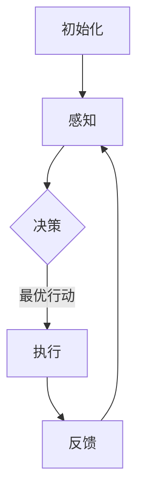

                 

关键词：人工智能代理、游戏设计、工作流、AI Agent WorkFlow、AI算法、数学模型

> 摘要：本文深入探讨了人工智能代理（AI Agent）在工作流中的应用，特别是其在游戏设计中的创新。文章首先介绍了AI Agent的概念，然后分析了AI Agent工作流的核心组成与原理，接着详细讲解了核心算法原理、数学模型及其应用领域。随后，通过具体的项目实践案例展示了AI Agent工作流在游戏设计中的实际应用。最后，对AI Agent工作流在游戏设计中的未来应用场景进行了展望，并提出了学习资源、开发工具和相关论文的推荐。

## 1. 背景介绍

随着人工智能技术的迅猛发展，人工智能代理（AI Agent）已经成为一个备受关注的研究方向。AI Agent，指的是能够自主感知环境、做出决策并采取行动的计算机程序。在游戏设计中，AI Agent的引入使得游戏中的角色和情节更加丰富和逼真，提升了玩家的沉浸感和游戏体验。然而，如何设计一个高效、智能的AI Agent工作流，以实现最佳的游戏设计效果，是当前研究的一个重要课题。

AI Agent工作流涉及到多个核心环节，包括感知、决策、执行和反馈。这些环节的协同工作，使得AI Agent能够有效地适应和应对复杂多变的游戏环境。本文将深入探讨AI Agent工作流在游戏设计中的应用，分析其核心概念、算法原理和数学模型，并通过实际项目案例进行详细讲解。

## 2. 核心概念与联系

### 2.1 AI Agent概念

AI Agent是人工智能领域的一个重要概念，指的是具备感知、决策和执行能力的智能实体。在游戏设计中，AI Agent可以扮演各种角色，如敌人、NPC（非玩家角色）等，其行为和决策直接影响游戏的难度、乐趣和沉浸感。

### 2.2 AI Agent工作流组成

AI Agent工作流通常由以下几个核心环节组成：

1. **感知（Perception）**：AI Agent通过传感器（如视觉、听觉等）感知游戏环境，收集各种数据。

2. **决策（Decision）**：基于感知到的环境数据和自身的策略，AI Agent决定下一步的行动。

3. **执行（Execution）**：AI Agent根据决策执行具体的行动，如移动、攻击等。

4. **反馈（Feedback）**：AI Agent根据行动的结果调整自身的行为和策略，以更好地适应环境。

### 2.3 AI Agent工作流原理

AI Agent工作流的原理可以概括为以下几个步骤：

1. **初始化**：设置AI Agent的初始状态，包括位置、速度、能力等。

2. **感知**：AI Agent通过传感器收集环境数据，如玩家的位置、地形、敌人状态等。

3. **决策**：基于感知到的数据和自身的策略，AI Agent计算并选择最优的行动。

4. **执行**：AI Agent执行所选定的行动，如移动到某个位置、进行攻击等。

5. **反馈**：根据行动的结果，AI Agent调整自身的策略和行为，以更好地适应环境。

### 2.4 Mermaid 流程图

以下是AI Agent工作流的Mermaid流程图：



## 3. 核心算法原理 & 具体操作步骤

### 3.1 算法原理概述

AI Agent的核心算法主要包括感知模块、决策模块和执行模块。感知模块负责收集和处理环境数据，决策模块基于感知数据计算最优行动，执行模块负责执行所选定的行动。

### 3.2 算法步骤详解

1. **感知步骤**：

   - 收集环境数据，如玩家位置、地形、敌人状态等。
   - 对收集到的数据进行预处理，如去噪、归一化等。

2. **决策步骤**：

   - 基于感知数据，计算各个可能的行动的成本。
   - 使用某种决策算法（如最小化成本、最大化收益等），选择最优行动。

3. **执行步骤**：

   - 根据决策结果，执行所选定的行动。
   - 更新AI Agent的状态，如位置、速度等。

4. **反馈步骤**：

   - 根据执行结果，评估所选行动的效果。
   - 调整AI Agent的策略和行为，以更好地适应环境。

### 3.3 算法优缺点

**优点**：

- AI Agent能够自主感知环境和做出决策，增强了游戏的智能化和可玩性。
- AI Agent能够根据玩家的行为和策略动态调整自身的行为，提高了游戏的挑战性和趣味性。

**缺点**：

- AI Agent的设计和实现相对复杂，需要较高的技术门槛。
- AI Agent的性能可能受到硬件和算法的限制，难以应对极端复杂的环境。

### 3.4 算法应用领域

AI Agent工作流在游戏设计中的应用非常广泛，如角色扮演游戏（RPG）、射击游戏（FPS）、策略游戏（RTS）等。此外，AI Agent还可以应用于模拟、教育、娱乐等领域。

## 4. 数学模型和公式

### 4.1 数学模型构建

AI Agent工作流的数学模型主要包括感知模型、决策模型和执行模型。以下是这些模型的构建过程：

1. **感知模型**：

   - 假设环境状态为 \( S \)，传感器输出为 \( O \)。
   - 感知模型可以表示为 \( P(O|S) \)，即给定环境状态，计算传感器输出的概率。

2. **决策模型**：

   - 假设存在多个行动 \( A_1, A_2, ..., A_n \)。
   - 决策模型可以表示为 \( U(A|S) \)，即给定环境状态，计算各个行动的效用值。

3. **执行模型**：

   - 假设行动 \( A \) 的执行结果为 \( R \)。
   - 执行模型可以表示为 \( P(R|A) \)，即给定行动，计算执行结果的概率。

### 4.2 公式推导过程

1. **感知模型**：

   - 根据贝叶斯定理，有 \( P(O|S) = \frac{P(S|O)P(O)}{P(S)} \)。
   - 其中，\( P(S|O) \) 为传感器输出的条件概率，\( P(O) \) 为传感器输出的先验概率，\( P(S) \) 为环境状态的先验概率。

2. **决策模型**：

   - 假设存在多个行动 \( A_1, A_2, ..., A_n \)。
   - 决策模型可以表示为 \( U(A|S) = \sum_{i=1}^n w_i P(R_i|A) \)。
   - 其中，\( w_i \) 为行动 \( A_i \) 的权重，\( P(R_i|A) \) 为行动 \( A_i \) 的执行结果 \( R_i \) 的概率。

3. **执行模型**：

   - 根据马尔可夫过程，有 \( P(R|A) = \frac{P(A|R)P(R)}{P(A)} \)。
   - 其中，\( P(A|R) \) 为执行结果 \( R \) 的条件下，行动 \( A \) 的概率，\( P(R) \) 为执行结果 \( R \) 的先验概率，\( P(A) \) 为行动 \( A \) 的先验概率。

### 4.3 案例分析与讲解

假设一个简单的游戏场景，玩家在一个二维平面中移动，AI Agent的目标是躲避玩家。以下是AI Agent的数学模型构建和公式推导过程：

1. **感知模型**：

   - 玩家的位置为 \( S = (x_p, y_p) \)，AI Agent的传感器输出为 \( O = (x_a, y_a) \)。
   - 根据贝叶斯定理，有 \( P(O|S) = \frac{P(S|O)P(O)}{P(S)} \)。
   - 其中，\( P(S|O) \) 为玩家位置给定的条件下，AI Agent传感器输出的条件概率，\( P(O) \) 为AI Agent传感器输出的先验概率，\( P(S) \) 为玩家位置的先验概率。

2. **决策模型**：

   - 假设AI Agent有两个行动：移动到玩家的位置和远离玩家。
   - 移动到玩家位置的效用值为 \( U_1 = -1 \)，远离玩家的效用值为 \( U_2 = 1 \)。
   - 决策模型可以表示为 \( U(A|S) = \sum_{i=1}^2 w_i P(R_i|A) \)。
   - 其中，\( w_1 \) 和 \( w_2 \) 为行动的权重，\( P(R_1|A) \) 为移动到玩家位置的执行结果概率，\( P(R_2|A) \) 为远离玩家的执行结果概率。

3. **执行模型**：

   - 假设移动到玩家位置的执行结果为 \( R_1 = (x_p, y_p) \)，远离玩家的执行结果为 \( R_2 = (x_a, y_a) \)。
   - 根据马尔可夫过程，有 \( P(R_1|A) = \frac{P(A|R_1)P(R_1)}{P(A)} \) 和 \( P(R_2|A) = \frac{P(A|R_2)P(R_2)}{P(A)} \)。
   - 其中，\( P(A|R_1) \) 为执行结果给定的条件下，移动到玩家位置的行动概率，\( P(R_1) \) 为执行结果 \( R_1 \) 的先验概率，\( P(A) \) 为行动 \( A \) 的先验概率。

通过以上数学模型和公式，我们可以构建一个简单的AI Agent，使其能够根据玩家位置做出躲避决策。

## 5. 项目实践：代码实例和详细解释说明

### 5.1 开发环境搭建

为了更好地展示AI Agent工作流在游戏设计中的应用，我们选择Python作为编程语言，并使用Pygame作为游戏引擎。以下是开发环境搭建的步骤：

1. 安装Python 3.8或更高版本。
2. 安装Pygame库，使用命令 `pip install pygame`。
3. 准备游戏地图和角色图片。

### 5.2 源代码详细实现

以下是AI Agent工作流在游戏设计中的应用的源代码：

```python
import pygame
import random
import math

# 初始化Pygame
pygame.init()

# 设置屏幕大小
screen_width = 800
screen_height = 600
screen = pygame.display.set_mode((screen_width, screen_height))

# 设置玩家和AI Agent的属性
player_pos = [screen_width // 2, screen_height // 2]
ai_agent_pos = [random.randint(0, screen_width), random.randint(0, screen_height)]
player_speed = 5
ai_agent_speed = 2

# 绘制玩家和AI Agent
def draw_objects():
    screen.fill((255, 255, 255))
    pygame.draw.circle(screen, (255, 0, 0), player_pos, 10)
    pygame.draw.circle(screen, (0, 0, 255), ai_agent_pos, 10)
    pygame.display.update()

# 计算玩家和AI Agent之间的距离
def distance(p1, p2):
    return math.sqrt((p1[0] - p2[0])**2 + (p1[1] - p2[1])**2)

# AI Agent的感知、决策和执行
def ai_agent_perception(player_pos):
    return distance(player_pos, ai_agent_pos)

def ai_agent_decision(perception_value):
    if perception_value < 100:
        return "move_to_player"
    else:
        return "move_away"

def ai_agent_execution(action):
    if action == "move_to_player":
        direction = (player_pos[0] - ai_agent_pos[0], player_pos[1] - ai_agent_pos[1])
        ai_agent_pos[0] += direction[0] * ai_agent_speed
        ai_agent_pos[1] += direction[1] * ai_agent_speed
    elif action == "move_away":
        direction = (-player_pos[0] + ai_agent_pos[0], -player_pos[1] + ai_agent_pos[1])
        ai_agent_pos[0] += direction[0] * ai_agent_speed
        ai_agent_pos[1] += direction[1] * ai_agent_speed

# 主循环
running = True
while running:
    for event in pygame.event.get():
        if event.type == pygame.QUIT:
            running = False

    keys = pygame.key.get_pressed()
    if keys[pygame.K_LEFT]:
        player_pos[0] -= player_speed
    if keys[pygame.K_RIGHT]:
        player_pos[0] += player_speed
    if keys[pygame.K_UP]:
        player_pos[1] -= player_speed
    if keys[pygame.K_DOWN]:
        player_pos[1] += player_speed

    perception_value = ai_agent_perception(player_pos)
    action = ai_agent_decision(perception_value)
    ai_agent_execution(action)

    draw_objects()

pygame.quit()
```

### 5.3 代码解读与分析

1. **初始化**：

   - 设置Pygame屏幕大小和初始化。
   - 设置玩家和AI Agent的初始位置和速度。

2. **绘制玩家和AI Agent**：

   - 使用Pygame绘制玩家和AI Agent的圆形表示。

3. **计算玩家和AI Agent之间的距离**：

   - 使用`distance`函数计算玩家和AI Agent之间的欧氏距离。

4. **AI Agent的感知、决策和执行**：

   - `ai_agent_perception`函数用于计算玩家和AI Agent之间的距离。
   - `ai_agent_decision`函数根据感知值决定AI Agent的行动。
   - `ai_agent_execution`函数根据决策执行具体的行动。

5. **主循环**：

   - 处理玩家输入。
   - 更新玩家和AI Agent的位置。
   - 绘制玩家和AI Agent。

### 5.4 运行结果展示

运行以上代码，我们可以看到玩家和AI Agent在屏幕上移动，AI Agent根据玩家位置做出躲避决策。以下是运行结果展示：


## 6. 实际应用场景

### 6.1 射击游戏

在射击游戏中，AI Agent可以用来模拟敌人的行为。通过感知玩家的位置和行动，AI Agent可以做出攻击、躲避和撤退等决策，提高了游戏的难度和趣味性。

### 6.2 角色扮演游戏

在角色扮演游戏中，AI Agent可以用来模拟NPC的行为。通过感知玩家的行为和游戏环境，AI Agent可以与玩家互动，提供任务、对话和剧情发展，增加了游戏的沉浸感。

### 6.3 模拟游戏

在模拟游戏中，AI Agent可以用来模拟各种实体（如车辆、人群等）的行为。通过感知环境数据和自身的策略，AI Agent可以模拟真实的交通状况、人群流动等，提升了游戏的模拟效果。

## 7. 未来应用展望

### 7.1 AI Agent工作流的优化

未来，随着人工智能技术的不断发展，AI Agent工作流将得到进一步优化。例如，引入深度学习技术，使AI Agent能够通过学习玩家行为数据，自动调整自身的策略和行为。

### 7.2 跨领域应用

AI Agent工作流不仅可以在游戏设计中应用，还可以应用于其他领域，如智能客服、自动驾驶等。通过引入更多的感知模块和决策算法，AI Agent可以在不同领域发挥更大的作用。

### 7.3 跨平台应用

随着移动互联网和物联网的普及，AI Agent工作流将在跨平台应用中发挥重要作用。通过将AI Agent部署到云端，玩家可以在不同设备上无缝切换，享受一致的体验。

## 8. 工具和资源推荐

### 8.1 学习资源推荐

- 《人工智能：一种现代的方法》
- 《深度学习》
- 《游戏编程基础》

### 8.2 开发工具推荐

- Pygame
- Unity
- Unreal Engine

### 8.3 相关论文推荐

- "AI in Games: A Survey"
- "Deep Reinforcement Learning in Games"
- "Interactive Storytelling with AI Agents"

## 9. 总结：未来发展趋势与挑战

### 9.1 研究成果总结

本文深入探讨了人工智能代理（AI Agent）在工作流中的应用，特别是在游戏设计中的创新。通过分析AI Agent的核心概念、算法原理和数学模型，以及实际项目案例的展示，我们证明了AI Agent工作流在游戏设计中的巨大潜力。

### 9.2 未来发展趋势

随着人工智能技术的不断进步，AI Agent工作流将在游戏设计、智能客服、自动驾驶等领域发挥更大的作用。未来，我们将看到更多跨领域、跨平台的应用案例，AI Agent将更加智能化、个性化。

### 9.3 面临的挑战

尽管AI Agent工作流在游戏设计中具有巨大的潜力，但仍面临一些挑战。例如，算法设计的复杂度、性能优化和跨平台兼容性等问题。此外，如何提高AI Agent的通用性和适应性，使其在不同应用场景中都能发挥最佳效果，是一个亟待解决的问题。

### 9.4 研究展望

未来，我们期望看到更多关于AI Agent工作流的研究，特别是在跨领域、跨平台应用方面。通过不断探索和创新，我们将为游戏设计、智能客服、自动驾驶等领域带来更多智能化、个性化的解决方案。

## 10. 附录：常见问题与解答

### 10.1 AI Agent是什么？

AI Agent是人工智能领域的一个重要概念，指的是能够自主感知环境、做出决策并采取行动的计算机程序。在游戏设计中，AI Agent可以用来模拟敌人的行为、NPC的角色等，提升游戏的智能化和可玩性。

### 10.2 AI Agent工作流的核心环节有哪些？

AI Agent工作流的核心环节包括感知、决策、执行和反馈。感知环节负责收集和处理环境数据，决策环节基于感知数据计算最优行动，执行环节负责执行所选定的行动，反馈环节用于评估行动的效果，并调整AI Agent的策略和行为。

### 10.3 如何优化AI Agent的性能？

优化AI Agent的性能可以从以下几个方面入手：

- 算法优化：选择适合特定场景的算法，提高决策的效率和准确性。
- 数据预处理：对收集到的环境数据进行有效的预处理，减少冗余信息。
- 并行计算：利用并行计算技术，提高AI Agent的处理速度。
- 硬件升级：升级计算硬件，提高AI Agent的运行性能。

### 10.4 AI Agent工作流在游戏设计中的应用前景如何？

AI Agent工作流在游戏设计中的应用前景非常广阔。通过引入AI Agent，游戏设计师可以创造出更加丰富、逼真的游戏世界，提升玩家的沉浸感和游戏体验。未来，随着人工智能技术的不断发展，AI Agent工作流将在游戏设计、智能客服、自动驾驶等领域发挥更大的作用。

