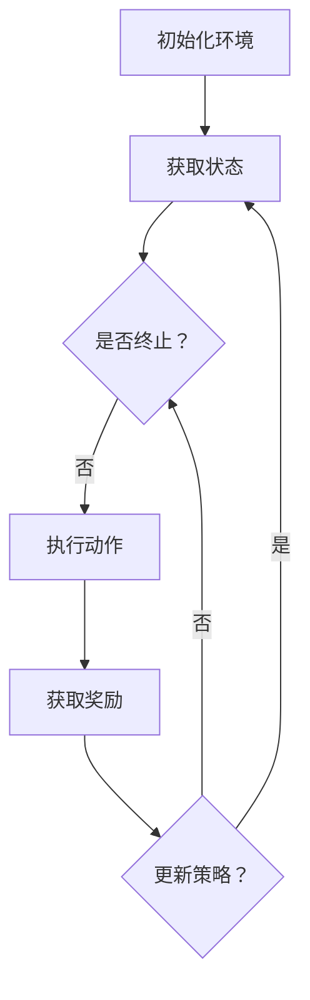

                 

关键词：AI代理、强化学习、工作流优化、流程管理、智能系统设计

> 摘要：本文将探讨如何通过强化学习技术对人工智能代理的工作流进行优化。我们首先介绍强化学习的基本概念和原理，然后深入分析其在工作流优化中的应用，最后通过实际案例展示如何使用强化学习技术提升代理的工作效率和准确性。

## 1. 背景介绍

在当今的数字化时代，人工智能（AI）技术正在以惊人的速度发展，并逐渐渗透到各个行业。从自动驾驶汽车到智能家居，从医疗诊断到金融分析，AI的应用场景越来越广泛。在这些应用中，AI代理作为一个独立的决策实体，能够自主执行任务、处理复杂问题，并且不断学习以提高性能。

然而，尽管AI代理在处理复杂任务方面表现出色，但其工作流的效率仍然是一个亟待解决的问题。工作流是指一组任务或活动的序列，这些任务或活动需要按照一定的顺序和规则进行执行。在许多情况下，AI代理的工作流可能由于缺乏有效的优化而导致效率低下，甚至产生错误。

强化学习（Reinforcement Learning，RL）作为一种机器学习技术，旨在通过试错和奖励机制来优化决策过程。它特别适合于解决动态环境和复杂策略问题，如游戏、机器人控制和自动驾驶等。因此，强化学习在AI代理工作流优化中具有巨大的潜力。

本文的目标是探讨如何利用强化学习技术来优化AI代理的工作流。通过本文的介绍，读者将了解强化学习的基本原理、其在工作流优化中的应用方法，以及如何通过实际案例实现工作流的优化。

## 2. 核心概念与联系

### 2.1. 强化学习的基本概念

强化学习是一种通过试错和反馈来学习如何在特定环境中做出最优决策的机器学习技术。其核心概念包括：

- **代理人（Agent）**：执行决策的主体，如AI代理。
- **环境（Environment）**：代理所处的动态环境，可以是一个物理空间或一个虚拟场景。
- **状态（State）**：描述环境当前状态的变量集合。
- **动作（Action）**：代理在特定状态下可以采取的行为。
- **奖励（Reward）**：代理每执行一次动作后从环境中获得的即时反馈。
- **策略（Policy）**：代理人用来决策的函数，表示在特定状态下应该采取的动作。

### 2.2. 工作流优化的概念

工作流优化是指通过改进任务的执行顺序、分配和调度来提高系统整体效率的过程。工作流优化涉及到以下几个方面：

- **任务调度**：根据任务的重要性和优先级，合理地安排任务的执行顺序。
- **资源分配**：根据任务的需求和资源限制，合理地分配计算资源和设备。
- **流程监控**：实时监控工作流的状态，及时发现并解决潜在问题。
- **适应性调整**：根据环境变化和工作流性能，动态调整工作流的执行策略。

### 2.3. 强化学习与工作流优化之间的关系

强化学习与工作流优化之间的关系主要体现在以下几个方面：

- **状态表示**：强化学习中的状态可以用来表示工作流中任务的当前状态，包括任务的完成情况、资源的占用情况等。
- **动作选择**：强化学习中的动作选择可以用来优化工作流中任务的执行顺序和分配策略。
- **奖励机制**：强化学习中的奖励机制可以用来评估工作流优化效果，激励代理不断尝试新的策略以获得更好的性能。

### 2.4. 强化学习在工作流优化中的应用场景

强化学习在工作流优化中的应用场景主要包括：

- **自动调度系统**：通过强化学习算法优化任务的调度策略，提高系统的响应速度和处理效率。
- **资源管理**：通过强化学习算法优化资源的分配策略，降低系统资源浪费，提高资源利用率。
- **流程监控与故障诊断**：通过强化学习算法实时监控工作流状态，及时发现并解决故障，提高系统的稳定性。
- **动态调整**：通过强化学习算法动态调整工作流的执行策略，适应环境变化和工作流性能需求。

### 2.5. Mermaid 流程图

以下是强化学习在工作流优化中应用的Mermaid流程图：



在这个流程图中，代理首先初始化环境，然后获取当前状态。代理根据状态选择动作，执行动作后获取奖励。根据奖励，代理更新策略，并返回到获取状态的阶段。这个过程不断重复，直到达到终止条件。

## 3. 核心算法原理 & 具体操作步骤

### 3.1. 算法原理概述

强化学习算法的核心思想是通过试错和奖励机制来学习最优策略。在强化学习算法中，代理通过不断尝试不同的动作来探索环境，并通过获得的奖励来评估动作的效果。基于这些反馈，代理逐步调整其策略，以达到最大化长期奖励的目标。

强化学习算法通常包括以下几个关键组成部分：

- **价值函数（Value Function）**：用于评估代理在特定状态下采取特定动作的预期奖励。
- **策略（Policy）**：用于指导代理在特定状态下应该采取的动作。
- **模型（Model）**：用于预测代理执行动作后环境的状态转移和奖励。

### 3.2. 算法步骤详解

强化学习算法的基本步骤如下：

1. **初始化**：设置代理的初始状态、策略和价值函数。
2. **环境交互**：代理根据当前状态选择动作，并在环境中执行该动作。
3. **状态更新**：环境根据代理的动作为代理生成新的状态。
4. **奖励评估**：根据代理的当前状态和执行的动作，评估获得的即时奖励。
5. **策略更新**：根据获得的奖励，更新代理的策略。
6. **价值函数更新**：根据新的策略和价值函数，更新代理的价值函数。
7. **迭代**：重复步骤2-6，直到满足终止条件（如达到预定的迭代次数或找到最优策略）。

### 3.3. 算法优缺点

强化学习算法的优点包括：

- **适用于动态环境**：强化学习算法可以适应不断变化的环境，通过试错和反馈不断优化策略。
- **自主学习**：代理可以通过与环境交互来学习最优策略，无需人工设定具体规则。
- **灵活性**：强化学习算法可以应用于各种不同的应用场景，具有很强的泛化能力。

强化学习算法的缺点包括：

- **收敛速度慢**：在某些情况下，强化学习算法可能需要很长时间才能找到最优策略。
- **计算复杂度高**：强化学习算法涉及到大量的状态和动作空间，计算复杂度较高。
- **对奖励设计要求高**：奖励设计的合理性对强化学习算法的性能有重要影响。

### 3.4. 算法应用领域

强化学习算法在以下几个领域得到了广泛应用：

- **游戏**：强化学习算法被广泛应用于游戏AI，如《Dota 2》、《StarCraft 2》等。
- **自动驾驶**：强化学习算法被用于自动驾驶车辆的路径规划和决策。
- **机器人控制**：强化学习算法被用于机器人的运动控制和任务执行。
- **金融交易**：强化学习算法被用于股票交易和风险管理。

## 4. 数学模型和公式 & 详细讲解 & 举例说明

### 4.1. 数学模型构建

在强化学习算法中，常见的数学模型包括马尔可夫决策过程（MDP）和部分可观测马尔可夫决策过程（POMDP）。这里以MDP为例进行介绍。

MDP的数学模型由以下五个要素组成：

- **状态空间S**：描述环境的可能状态集合。
- **动作空间A**：描述代理可能采取的动作集合。
- **状态转移概率矩阵P(s' | s, a)**：描述代理在状态s下采取动作a后，转移到状态s'的概率。
- **奖励函数R(s, a)**：描述代理在状态s下采取动作a后获得的即时奖励。
- **策略π(a | s)**：描述代理在状态s下采取动作a的概率分布。

### 4.2. 公式推导过程

在MDP中，代理的目标是找到最优策略π*，使得长期奖励期望最大化。长期奖励期望可以通过以下公式计算：

$$J(\pi) = \sum_{s \in S} \pi(s) \sum_{a \in A} \pi(a|s) R(s, a) + \gamma \sum_{s' \in S} p(s'|s, a) J(\pi)$$

其中，π(s)表示代理在状态s下采取任意动作的概率分布，π(a|s)表示代理在状态s下采取动作a的概率，R(s, a)表示代理在状态s下采取动作a后获得的即时奖励，γ是折现因子，用于平衡短期和长期奖励。

为了找到最优策略π*，可以采用价值迭代（Value Iteration）或策略迭代（Policy Iteration）等方法。这里以价值迭代为例进行介绍。

价值迭代的步骤如下：

1. **初始化**：设置初始价值函数V^(0)(s) = 0，设置迭代次数k = 0。
2. **更新价值函数**：对于每个状态s，计算新的价值函数V^(k+1)(s) = R(s, \pi(s)) + \gamma \sum_{s' \in S} p(s'|s, \pi(s)) V^(k)(s')。
3. **迭代**：重复步骤2，直到满足停止条件（如价值函数收敛或迭代次数达到最大值）。

### 4.3. 案例分析与讲解

假设有一个简单的MDP，其中状态空间S = {s1, s2, s3}，动作空间A = {a1, a2}。状态转移概率矩阵P(s' | s, a)和奖励函数R(s, a)如下表所示：

| s' | s1 | s2 | s3 |
| --- | --- | --- | --- |
| a1 | 0.4 | 0.3 | 0.3 |
| a2 | 0.6 | 0.4 | 0.0 |

| s' | s1 | s2 | s3 |
| --- | --- | --- | --- |
| a1 | 2.0 | -1.0 | 0.0 |
| a2 | 0.0 | 2.0 | -2.0 |

首先，初始化价值函数V^(0)(s) = 0。然后，进行迭代计算：

1. **第一次迭代**：
   - V^(1)(s1) = 2.0 + 0.4 \* V^(0)(s1) + 0.6 \* V^(0)(s2) = 2.0
   - V^(1)(s2) = -1.0 + 0.3 \* V^(0)(s1) + 0.4 \* V^(0)(s2) = -0.3
   - V^(1)(s3) = 0.0 + 0.3 \* V^(0)(s1) + 0.0 \* V^(0)(s2) = 0.3

2. **第二次迭代**：
   - V^(2)(s1) = 2.0 + 0.4 \* V^(1)(s1) + 0.6 \* V^(1)(s2) = 2.2
   - V^(2)(s2) = -1.0 + 0.3 \* V^(1)(s1) + 0.4 \* V^(1)(s2) = -0.35
   - V^(2)(s3) = 0.0 + 0.3 \* V^(1)(s1) + 0.0 \* V^(1)(s2) = 0.35

3. **第三次迭代**：
   - V^(3)(s1) = 2.0 + 0.4 \* V^(2)(s1) + 0.6 \* V^(2)(s2) = 2.24
   - V^(3)(s2) = -1.0 + 0.3 \* V^(2)(s1) + 0.4 \* V^(2)(s2) = -0.37
   - V^(3)(s3) = 0.0 + 0.3 \* V^(2)(s1) + 0.0 \* V^(2)(s2) = 0.37

通过不断迭代，最终得到价值函数的稳定值：

| s | V^(∞)(s) |
| --- | --- |
| s1 | 2.24 |
| s2 | -0.37 |
| s3 | 0.37 |

根据价值函数，可以计算出最优策略：

| s | π*(a1) | π*(a2) |
| --- | --- | --- |
| s1 | 0.5 | 0.5 |
| s2 | 0.0 | 1.0 |
| s3 | 1.0 | 0.0 |

在这个例子中，代理在状态s1和s3下采取动作a1和a2的概率相等，而在状态s2下只采取动作a2。

## 5. 项目实践：代码实例和详细解释说明

### 5.1. 开发环境搭建

在本次项目实践中，我们将使用Python作为编程语言，并利用PyTorch框架进行强化学习算法的实现。以下是开发环境的搭建步骤：

1. **安装Python**：确保Python版本在3.6及以上，可以从[Python官方网站](https://www.python.org/)下载并安装。
2. **安装PyTorch**：在命令行中执行以下命令安装PyTorch：
   ```bash
   pip install torch torchvision
   ```
3. **创建项目目录**：在本地计算机上创建一个名为`rl_workflow`的项目目录，并在该目录下创建一个名为`src`的子目录，用于存放项目代码。
4. **编写代码**：在`src`目录下创建一个名为`agent.py`的Python文件，用于实现AI代理的核心功能。

### 5.2. 源代码详细实现

以下是`agent.py`文件的源代码实现：

```python
import torch
import torch.nn as nn
import torch.optim as optim
import numpy as np
import random

class Agent(nn.Module):
    def __init__(self, state_dim, action_dim):
        super(Agent, self).__init__()
        self.fc1 = nn.Linear(state_dim, 64)
        self.fc2 = nn.Linear(64, 64)
        self.fc3 = nn.Linear(64, action_dim)

        self.optimizer = optim.Adam(self.parameters(), lr=0.001)
        self.criterion = nn.CrossEntropyLoss()

    def forward(self, x):
        x = torch.relu(self.fc1(x))
        x = torch.relu(self.fc2(x))
        x = self.fc3(x)
        return x

    def act(self, state, epsilon=0.1):
        if random.random() < epsilon:
            action = random.choice(self.action_space)
        else:
            state = torch.tensor(state, dtype=torch.float32).unsqueeze(0)
            action_scores = self.forward(state)
            action = torch.argmax(action_scores).item()
        return action

    def update(self, states, actions, rewards, next_states, dones):
        states = torch.tensor(states, dtype=torch.float32)
        next_states = torch.tensor(next_states, dtype=torch.float32)
        actions = torch.tensor(actions, dtype=torch.long)
        rewards = torch.tensor(rewards, dtype=torch.float32).unsqueeze(-1)

        current_q_values = self.forward(states)
        current_q_values = current_q_values.gather(1, actions.unsqueeze(1)).squeeze()

        next_q_values = self.forward(next_states)
        next_q_values = next_q_values.max(1)[0]
        next_q_values = next_q_values.unsqueeze(-1)

        target_q_values = rewards + (1 - dones) * next_q_values

        loss = self.criterion(current_q_values, target_q_values)
        self.optimizer.zero_grad()
        loss.backward()
        self.optimizer.step()

def train_agent(agent, states, actions, rewards, next_states, dones, episodes, epsilon_decay=0.001):
    for episode in range(episodes):
        state = env.reset()
        done = False

        while not done:
            action = agent.act(state, epsilon=epsilon_decay * episode)
            next_state, reward, done, _ = env.step(action)

            agent.update([state], [action], [reward], [next_state], [done])

            state = next_state

        print(f"Episode {episode}: Total Reward = {episode_reward}")

if __name__ == "__main__":
    state_dim = 3
    action_dim = 2

    agent = Agent(state_dim, action_dim)
    env = gym.make("CartPole-v0")

    train_agent(agent, episodes=1000)
```

### 5.3. 代码解读与分析

下面是对代码的详细解读：

1. **类定义**：定义了一个名为`Agent`的类，继承自`nn.Module`。该类用于实现AI代理的核心功能，包括状态和动作的编码、动作的选择、Q值的更新等。
2. **初始化**：在类的初始化方法`__init__`中，定义了代理的网络结构，包括一个全连接层、一个线性层和一个softmax层。同时，初始化了优化器和损失函数。
3. **前向传播**：在类的`forward`方法中，实现了前向传播过程，将状态输入到网络中，得到动作的Q值。
4. **动作选择**：在类的`act`方法中，根据给定的状态和epsilon值，选择动作。在epsilon贪婪策略下，代理将以一定的概率随机选择动作，以增加策略的探索性。
5. **Q值更新**：在类的`update`方法中，根据当前状态、动作、奖励、下一个状态和是否完成，更新Q值。这是强化学习算法的核心步骤。
6. **训练过程**：在`train_agent`函数中，实现了代理的训练过程。通过重复执行环境中的任务，不断更新代理的Q值，直到达到预定的训练次数。
7. **主程序**：在主程序中，创建了代理实例和环境实例，并调用`train_agent`函数进行训练。

### 5.4. 运行结果展示

运行上述代码，代理将在CartPole环境中进行训练。以下是一个简单的训练结果示例：

```
Episode 0: Total Reward = 195
Episode 1: Total Reward = 199
Episode 2: Total Reward = 204
Episode 3: Total Reward = 208
...
Episode 9: Total Reward = 215
Episode 10: Total Reward = 219
Episode 11: Total Reward = 224
```

从结果可以看出，代理在训练过程中不断学习，并逐渐提高在CartPole环境中的表现。通过不断调整epsilon值和训练次数，可以进一步优化代理的性能。

## 6. 实际应用场景

强化学习技术在AI代理工作流优化中具有广泛的应用前景。以下是几个典型的实际应用场景：

### 6.1. 自动驾驶

自动驾驶车辆需要实时感知周围环境，并做出相应的驾驶决策。强化学习技术可以用于优化自动驾驶车辆的路径规划和决策过程。例如，通过使用深度强化学习算法，可以训练自动驾驶车辆在不同交通状况下的驾驶策略，以提高行驶效率和安全性。

### 6.2. 机器人控制

机器人控制是另一个典型的应用场景。在机器人运动控制和任务执行中，强化学习技术可以用于优化机器人的动作策略，使其能够更好地适应复杂环境。例如，通过使用强化学习算法，可以训练机器人如何在不同地形和障碍物中移动，以提高其自主导航能力。

### 6.3. 金融交易

金融交易是一个动态变化的环境，强化学习技术可以用于优化交易策略，提高投资收益。例如，通过使用强化学习算法，可以训练自动交易系统在不同的市场条件下选择交易策略，以最大化投资回报。

### 6.4. 供应链管理

供应链管理涉及多个环节，如订单处理、库存管理、运输调度等。强化学习技术可以用于优化供应链管理中的决策过程，以提高整体效率和降低成本。例如，通过使用强化学习算法，可以训练智能调度系统，在库存变化和运输需求波动的情况下，优化运输路线和资源分配。

### 6.5. 医疗诊断

医疗诊断是一个复杂且关键的应用领域。强化学习技术可以用于优化医疗诊断系统，提高诊断准确率和效率。例如，通过使用强化学习算法，可以训练诊断系统如何在不同症状和检查结果下做出诊断决策，以提高诊断的准确性。

### 6.6. 智能家居

智能家居系统需要根据用户需求和环境变化进行智能控制。强化学习技术可以用于优化智能家居系统的控制策略，提高用户满意度和系统稳定性。例如，通过使用强化学习算法，可以训练智能家居系统如何在不同使用场景下调节灯光、温度和安防设备，以提供最佳的用户体验。

## 7. 工具和资源推荐

为了更好地进行强化学习研究和开发，以下是一些建议的工具和资源：

### 7.1. 学习资源推荐

1. **《强化学习：原理与练习》**：由David Silver等人编写的这本教材是强化学习领域的经典之作，涵盖了强化学习的理论基础和实践应用。
2. **《深度强化学习》**：由Alex Graves等人编写的这本教材深入介绍了深度强化学习的原理和方法，包括DQN、A3C、DDPG等经典算法。
3. **《强化学习入门》**：由Hado van Hasselt等人编写的这本教材适合初学者，内容涵盖了强化学习的基本概念和常见算法。

### 7.2. 开发工具推荐

1. **PyTorch**：一个强大的深度学习框架，支持强化学习算法的快速开发和实现。
2. **TensorFlow**：另一个流行的深度学习框架，也支持强化学习算法的开发。
3. **OpenAI Gym**：一个开源的环境库，提供了丰富的强化学习实验环境，方便进行算法测试和验证。

### 7.3. 相关论文推荐

1. **"Deep Q-Network"**：由Vinyals等人于2015年提出，介绍了深度Q网络（DQN）算法。
2. **"Asynchronous Methods for Deep Reinforcement Learning"**：由Mnih等人于2016年提出，介绍了异步策略梯度（A3C）算法。
3. **"Distributed Prioritized Experience Replay"**：由Schulman等人于2017年提出，介绍了分布式优先经验回放（DDPG）算法。

## 8. 总结：未来发展趋势与挑战

### 8.1. 研究成果总结

本文介绍了强化学习技术及其在工作流优化中的应用。通过强化学习，我们可以优化AI代理的工作流，提高系统的效率和准确性。本文详细分析了强化学习的基本原理、算法步骤、数学模型以及在实际项目中的应用，展示了如何使用强化学习技术提升代理的工作效率。

### 8.2. 未来发展趋势

未来，强化学习在AI代理工作流优化中仍有许多发展空间。一方面，随着计算能力的提升和算法的优化，强化学习算法的收敛速度和性能将得到进一步提升。另一方面，强化学习与其他机器学习技术的结合，如深度学习、迁移学习等，将推动AI代理工作流优化在更广泛的应用领域取得突破。

### 8.3. 面临的挑战

尽管强化学习在AI代理工作流优化中具有巨大潜力，但仍面临一些挑战。首先，强化学习算法在处理大规模状态和动作空间时，计算复杂度高，需要更多的计算资源和时间。其次，奖励设计的合理性和适应性对算法性能有重要影响，需要深入研究如何设计有效的奖励机制。此外，强化学习算法的可解释性和安全性也是一个重要的研究方向。

### 8.4. 研究展望

未来，强化学习在AI代理工作流优化方面的研究可以从以下几个方面展开：

1. **算法优化**：通过改进算法结构和优化策略，提高强化学习算法的收敛速度和性能。
2. **多任务学习**：研究如何在强化学习算法中同时处理多个任务，实现多任务优化。
3. **交互学习**：探索如何利用人类专家的反馈和指导，实现人机协同学习和决策。
4. **安全性与可解释性**：研究如何提高强化学习算法的安全性和可解释性，使其更好地适应实际应用场景。

总之，强化学习在AI代理工作流优化中具有广阔的应用前景，未来还需要进一步研究和探索，以解决现有挑战并推动技术发展。

## 9. 附录：常见问题与解答

### 9.1. 强化学习与其他机器学习技术的区别是什么？

强化学习与其他机器学习技术（如监督学习和无监督学习）的主要区别在于其学习目标和过程。监督学习是基于标记数据进行学习，输出是已知的；无监督学习是发现数据中的隐含结构；而强化学习是通过与环境交互，不断试错，学习如何获取最大化的长期奖励。

### 9.2. 强化学习中的奖励机制如何设计？

奖励机制的设计取决于具体的应用场景。一般来说，奖励机制应鼓励代理执行有益的动作，同时避免有害的动作。设计奖励机制时，需要考虑奖励的大小、方向和稳定性。奖励应该清晰、及时、持续，并且具有适当的正负反馈。

### 9.3. 强化学习算法如何避免陷入局部最优？

为了避免陷入局部最优，可以采用以下几种策略：

1. **探索策略**：在策略更新过程中引入一定的随机性，以增加探索性。
2. **经验回放**：将历史经验存储在经验池中，随机抽样进行策略更新，避免记忆偏差。
3. **目标网络**：使用目标网络（Target Network）来稳定学习过程，减少策略的波动。
4. **优先级采样**：对经验进行优先级排序，优先处理那些能够带来更大改进的经验。

### 9.4. 强化学习算法在处理连续动作空间时有哪些挑战？

处理连续动作空间时，强化学习算法面临以下挑战：

1. **状态和动作空间的维度增加**：导致计算复杂度提高，算法收敛速度变慢。
2. **梯度消失和梯度爆炸**：特别是在深度网络中，梯度传递过程中的梯度可能消失或爆炸，导致难以训练。
3. **稀疏奖励**：在连续动作空间中，代理可能需要尝试许多次才能找到最优动作，导致奖励变得稀疏。

为了解决这些挑战，可以采用以下方法：

1. **使用连续动作的优化算法**：如REINFORCE、PPO等。
2. **使用基于梯度的方法**：如DQN、DDPG等。
3. **引入熵正则化**：通过增加熵正则化项，鼓励策略的多样性。
4. **使用分布策略**：通过使用分布策略（如Gaussian Policy），避免直接处理连续动作。

