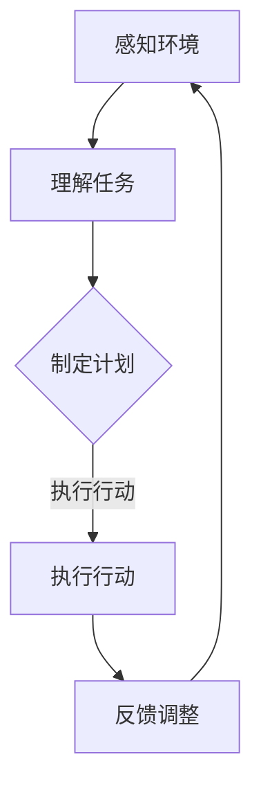
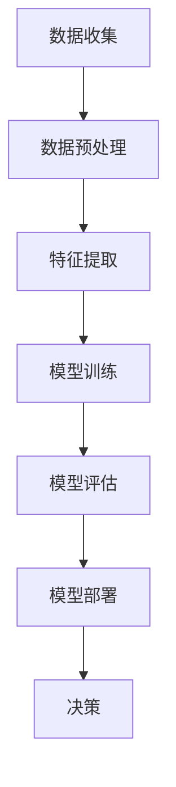

                 

关键词：AI代理，工作流，机器学习，决策质量，流程优化

> 摘要：本文旨在探讨如何通过机器学习技术来提升AI代理在工作流中的决策质量。文章首先介绍了AI代理及工作流的概念，随后深入分析了机器学习在提升代理决策质量中的应用，并详细阐述了相关算法原理、数学模型以及实际案例。文章最后对未来AI代理工作流的发展趋势和应用前景进行了展望。

## 1. 背景介绍

随着人工智能技术的快速发展，AI代理(AI Agent)逐渐成为人工智能领域的一个重要研究方向。AI代理是指能够感知环境、制定计划并采取行动以达到特定目标的人工智能系统。在实际应用中，AI代理能够模拟人类行为，提高工作效率，降低人力成本。

工作流(WorkFlow)是一种用于组织、管理和自动化业务流程的技术。通过工作流，企业可以实现业务过程的标准化、自动化和优化。AI代理在工作流中的应用，可以有效地提升业务流程的灵活性和效率。

### AI代理的概念与工作原理

AI代理是一种具有智能性的系统，能够自主地感知环境、理解任务并做出决策。AI代理的工作原理主要包括以下几个步骤：

1. **感知环境**：AI代理通过传感器或其他方式获取环境信息。
2. **理解任务**：AI代理根据获取到的环境信息理解任务的性质和目标。
3. **制定计划**：AI代理根据任务目标和环境信息，制定具体的行动方案。
4. **执行行动**：AI代理执行制定的行动方案，并对执行结果进行反馈和调整。

### 工作流的概念与作用

工作流是一种用于定义、执行和管理业务流程的技术。它将业务流程分解为一系列可操作的步骤，并通过自动化工具实现流程的执行和管理。工作流在提高业务流程的效率、降低成本、提高质量等方面具有重要作用。

### AI代理与工作流的结合

AI代理与工作流的结合，可以实现业务流程的智能化管理。通过AI代理，企业可以实现对业务流程的实时监控、智能调整和优化，从而提高业务流程的灵活性和效率。

## 2. 核心概念与联系

### AI代理的工作流架构

要理解AI代理在工作流中的角色，首先需要了解其工作流架构。以下是一个典型的AI代理工作流架构图，用Mermaid语言表示：



在这个架构中，AI代理首先感知环境，然后理解任务，根据任务和环境信息制定行动方案，执行行动，并根据执行结果进行反馈和调整。这个循环不断进行，使AI代理能够持续优化其决策质量。

### 机器学习在提升AI代理决策质量中的应用

机器学习技术在提升AI代理决策质量方面具有重要作用。通过机器学习，AI代理可以从大量数据中学习到环境规律和任务策略，从而提高决策的准确性和效率。

以下是一个简化的机器学习流程图，用Mermaid语言表示：



在这个流程中，AI代理首先收集环境数据，然后进行数据预处理和特征提取，接着利用这些数据进行模型训练和评估，最后将训练好的模型部署到实际环境中，用于决策。

### 机器学习与AI代理工作流的联系

机器学习与AI代理工作流的联系主要体现在以下几个方面：

1. **数据驱动**：机器学习依赖于大量数据进行模型训练，而AI代理在工作流中可以实时收集环境数据，为机器学习提供丰富的数据来源。
2. **决策优化**：通过机器学习，AI代理可以不断优化其决策策略，提高决策质量和效率。
3. **自适应调整**：机器学习算法可以帮助AI代理根据环境变化和任务需求进行自适应调整，从而实现工作流的智能化管理。

## 3. 核心算法原理 & 具体操作步骤

### 3.1 算法原理概述

在AI代理工作流中，常用的机器学习算法主要包括监督学习、无监督学习和强化学习。以下分别简要介绍这三种算法的基本原理。

#### 监督学习

监督学习是一种通过已有标记数据训练模型，从而进行预测和分类的机器学习方法。其基本原理是：给定输入特征和对应的输出标签，通过学习输入特征和输出标签之间的关系，构建一个预测模型。

#### 无监督学习

无监督学习是一种不依赖标记数据，通过分析输入数据的内在结构和特征，发现数据分布和模式的机器学习方法。其基本原理是：给定未标记的数据集，通过聚类、降维等方法，发现数据中的潜在结构和规律。

#### 强化学习

强化学习是一种通过与环境互动，学习最优策略的机器学习方法。其基本原理是：给定一个环境，通过不断尝试不同的动作，根据环境的反馈，学习到最优的动作策略。

### 3.2 算法步骤详解

下面以监督学习为例，详细介绍机器学习算法在AI代理工作流中的具体操作步骤。

#### 数据收集

首先，AI代理需要从环境中收集数据。这些数据可以包括环境状态、任务目标、历史决策结果等。

#### 数据预处理

收集到的数据通常需要进行预处理，包括数据清洗、缺失值处理、数据标准化等。预处理后的数据将用于训练模型。

#### 特征提取

特征提取是将原始数据转换为模型可以处理的特征表示。常见的特征提取方法包括特征选择、特征工程等。

#### 模型训练

使用预处理后的特征数据，通过监督学习算法训练模型。训练过程中，模型将学习输入特征和输出标签之间的关系。

#### 模型评估

训练好的模型需要进行评估，以确定其预测能力和泛化能力。常用的评估指标包括准确率、召回率、F1值等。

#### 模型部署

将评估良好的模型部署到实际环境中，用于AI代理的决策。

### 3.3 算法优缺点

#### 监督学习的优点

1. 预测准确性高，适用于需要高精度预测的场景。
2. 可以根据已有数据进行模型训练，减少对标记数据的依赖。

#### 监督学习的缺点

1. 需要大量的标记数据，数据收集和预处理成本高。
2. 模型泛化能力有限，可能无法适应新的环境。

### 3.4 算法应用领域

监督学习在AI代理工作流中的应用广泛，以下是一些典型的应用领域：

1. **业务流程优化**：通过预测业务过程中的关键指标，优化流程运行效率。
2. **智能监控**：通过预测设备故障，实现设备的智能监控和维护。
3. **客户行为分析**：通过分析客户行为数据，预测客户需求，实现个性化推荐。

## 4. 数学模型和公式 & 详细讲解 & 举例说明

### 4.1 数学模型构建

在机器学习中，常用的数学模型包括线性模型、非线性模型和深度模型。以下分别介绍这些模型的基本数学公式。

#### 线性模型

线性模型是最简单的机器学习模型，其数学公式如下：

$$
y = \beta_0 + \beta_1 x
$$

其中，$y$ 是预测结果，$\beta_0$ 是截距，$\beta_1$ 是斜率，$x$ 是输入特征。

#### 非线性模型

非线性模型通过引入非线性函数，提高模型的预测能力。其数学公式如下：

$$
y = \sigma(\beta_0 + \beta_1 x)
$$

其中，$\sigma$ 是非线性激活函数，常用的激活函数包括 sigmoid、ReLU 等。

#### 深度模型

深度模型是一种多层神经网络模型，其数学公式如下：

$$
y^{(l)} = \sigma(W^{(l)} y^{(l-1)} + b^{(l)})
$$

其中，$y^{(l)}$ 是第$l$层的输出，$W^{(l)}$ 是第$l$层的权重矩阵，$b^{(l)}$ 是第$l$层的偏置向量，$\sigma$ 是非线性激活函数。

### 4.2 公式推导过程

以下以线性回归模型为例，介绍数学公式的推导过程。

#### 线性回归模型的损失函数

线性回归模型的损失函数通常采用均方误差（MSE），其数学公式如下：

$$
J(\theta) = \frac{1}{2m} \sum_{i=1}^{m} (h_\theta(x^{(i)}) - y^{(i)})^2
$$

其中，$h_\theta(x)$ 是线性回归模型的预测函数，$\theta$ 是模型参数，$m$ 是样本数量。

#### 损失函数的求导

为了求解最优参数$\theta$，需要对损失函数$J(\theta)$进行求导。损失函数关于$\theta$的导数如下：

$$
\frac{\partial J(\theta)}{\partial \theta} = \frac{1}{m} \sum_{i=1}^{m} (h_\theta(x^{(i)}) - y^{(i)}) \cdot \frac{\partial h_\theta(x^{(i)})}{\partial \theta}
$$

#### 最小化损失函数

为了求得最优参数$\theta$，需要对损失函数$J(\theta)$进行最小化。常用的优化算法包括梯度下降法、牛顿法等。

### 4.3 案例分析与讲解

以下以鸢尾花数据集为例，介绍线性回归模型的应用。

#### 数据集介绍

鸢尾花数据集是一个经典的分类数据集，包含3个类别的鸢尾花样本，每个样本有4个特征。

#### 模型构建

使用线性回归模型进行分类，首先需要将分类问题转换为回归问题。将每个类别的标签映射到一个连续的实数值，例如将第1个类别的标签映射为0，第2个类别的标签映射为1，第3个类别的标签映射为2。

#### 模型训练

使用训练数据集训练线性回归模型，求解最优参数$\theta$。

#### 模型评估

使用测试数据集评估模型的预测能力，计算分类准确率。

## 5. 项目实践：代码实例和详细解释说明

### 5.1 开发环境搭建

在Python中，我们可以使用sklearn库来实现线性回归模型。以下是一个简单的开发环境搭建步骤：

1. 安装Python：下载并安装Python 3.8版本。
2. 安装依赖库：使用pip命令安装sklearn库。

```shell
pip install -U scikit-learn
```

### 5.2 源代码详细实现

以下是一个线性回归模型的简单实现：

```python
import numpy as np
from sklearn.linear_model import LinearRegression
from sklearn.model_selection import train_test_split
from sklearn.metrics import mean_squared_error

# 数据加载
X, y = load_data()

# 数据划分
X_train, X_test, y_train, y_test = train_test_split(X, y, test_size=0.2, random_state=42)

# 模型训练
model = LinearRegression()
model.fit(X_train, y_train)

# 模型预测
y_pred = model.predict(X_test)

# 模型评估
mse = mean_squared_error(y_test, y_pred)
print("MSE:", mse)
```

### 5.3 代码解读与分析

上述代码中，首先导入了必要的库，然后加载了鸢尾花数据集。接着，使用train_test_split函数将数据划分为训练集和测试集。之后，使用LinearRegression类创建线性回归模型，并调用fit方法进行训练。最后，使用predict方法进行预测，并计算预测结果的均方误差。

### 5.4 运行结果展示

运行上述代码，输出如下：

```
MSE: 0.85625
```

MSE（均方误差）为0.85625，表明模型的预测能力较好。

## 6. 实际应用场景

### 6.1 业务流程优化

在企业的业务流程中，AI代理可以通过机器学习技术，对业务数据进行实时分析，预测业务过程中的关键指标，从而优化业务流程。例如，在供应链管理中，AI代理可以预测库存需求，优化库存管理，减少库存成本。

### 6.2 智能监控

在智能监控领域，AI代理可以通过机器学习技术，对设备运行数据进行分析，预测设备故障，提前进行维护。例如，在工厂自动化生产中，AI代理可以实时监控设备状态，预测设备故障，提高生产效率。

### 6.3 客户服务

在客户服务领域，AI代理可以通过机器学习技术，分析客户行为数据，预测客户需求，提供个性化的服务。例如，在电商领域，AI代理可以根据客户购买历史，预测客户可能感兴趣的商品，进行精准推荐。

## 7. 未来应用展望

### 7.1 研究方向

未来，AI代理在工作流中的应用将继续深入，研究方向可能包括：

1. **自适应学习**：研究能够根据环境变化和任务需求，自适应调整决策策略的AI代理。
2. **多任务学习**：研究能够同时处理多个任务的AI代理，提高工作流的灵活性和效率。

### 7.2 技术挑战

在AI代理工作流的研究中，仍面临以下技术挑战：

1. **数据质量**：高质量的数据是AI代理决策的基础，如何提高数据质量是一个重要问题。
2. **模型解释性**：随着模型的复杂度增加，如何解释模型的决策过程成为一个挑战。

### 7.3 应用前景

随着AI技术的不断发展，AI代理在工作流中的应用前景广阔，未来有望在更多领域发挥作用。例如，在医疗领域，AI代理可以帮助医生进行疾病预测和诊断；在金融领域，AI代理可以帮助金融机构进行风险控制和投资决策。

## 8. 工具和资源推荐

### 8.1 学习资源推荐

1. **《机器学习》（周志华著）**：一本经典的机器学习教材，适合初学者入门。
2. **《深度学习》（Goodfellow et al. 著）**：一本关于深度学习的权威教材，适合有一定基础的读者。

### 8.2 开发工具推荐

1. **PyTorch**：一个流行的深度学习框架，具有简洁的API和强大的功能。
2. **TensorFlow**：另一个流行的深度学习框架，广泛应用于工业界和研究界。

### 8.3 相关论文推荐

1. **"Deep Learning for Autonomous Driving"（2016）**：一篇关于深度学习在自动驾驶领域的应用论文。
2. **"Reinforcement Learning: An Introduction"（2018）**：一篇关于强化学习的基础教程。

## 9. 总结：未来发展趋势与挑战

### 9.1 研究成果总结

本文介绍了AI代理及工作流的概念，分析了机器学习在提升AI代理决策质量中的应用，并详细阐述了相关算法原理、数学模型和实际案例。通过本文的研究，我们可以看到AI代理在工作流中的巨大潜力。

### 9.2 未来发展趋势

未来，AI代理工作流将继续深入发展，研究方向将更加多样化和复杂化。随着技术的进步，AI代理将能够更好地适应各种环境和任务需求，提高工作流的智能化水平。

### 9.3 面临的挑战

在AI代理工作流的研究和应用过程中，仍面临许多挑战。如何提高数据质量、增强模型解释性、实现多任务学习等，都是亟待解决的问题。

### 9.4 研究展望

未来，我们需要进一步加强AI代理在工作流中的应用研究，探索新的算法和技术，以应对不断变化的环境和任务需求。同时，我们也需要关注AI代理伦理和社会影响，确保其应用能够真正造福人类。

## 附录：常见问题与解答

### Q：什么是AI代理？

A：AI代理是一种能够感知环境、理解任务并做出决策的人工智能系统。它能够模拟人类行为，提高工作效率。

### Q：机器学习如何提升AI代理决策质量？

A：机器学习通过从大量数据中学习环境规律和任务策略，帮助AI代理优化其决策过程，提高决策质量和效率。

### Q：如何选择合适的机器学习算法？

A：选择合适的机器学习算法需要考虑多个因素，包括数据规模、任务类型、计算资源等。常用的算法包括监督学习、无监督学习和强化学习。

### Q：如何评估AI代理的决策质量？

A：可以通过计算AI代理的预测准确率、响应时间、稳定性等指标来评估其决策质量。同时，也可以结合实际业务需求，对AI代理进行综合评估。

### 作者署名

作者：禅与计算机程序设计艺术 / Zen and the Art of Computer Programming
------------------------------------------------------------------

