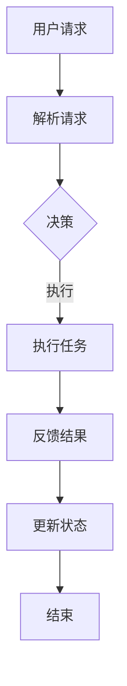

                 

  
> 关键词：人工智能、智能家居、代理技术、工作流、自动化

> 摘要：本文深入探讨了AI人工智能代理工作流在智能家居场景中的应用。通过详细阐述代理技术的核心概念、工作原理、数学模型、算法原理、项目实践以及未来应用前景，本文为智能家居领域的技术创新提供了新的视角。

## 1. 背景介绍

随着物联网（IoT）技术的快速发展，智能家居逐渐成为现代家庭生活的标配。智能设备的互联互通，使得家居环境更加便捷、舒适和节能。然而，智能设备的多样化与复杂化也带来了新的挑战，如何高效地管理和控制这些设备成为了一个亟待解决的问题。代理技术作为一种新兴的智能技术，为智能家居的自动化管理提供了有力的支持。

代理技术，顾名思义，是指通过代理（Agent）来执行特定任务的技术。在智能家居场景中，代理可以扮演家庭管理者的角色，自动处理日常事务，提高居住的舒适度和效率。代理技术的工作流，即代理从接收任务到完成任务的全过程，是实现智能家居自动化管理的关键。

## 2. 核心概念与联系

### 2.1 代理的定义

代理（Agent）是指具有感知、推理、决策和行动能力的计算机系统。代理可以自主地获取环境信息、分析问题、制定决策并执行相应的动作。在智能家居中，代理可以是各种智能设备，如智能灯泡、智能门锁、智能空调等。

### 2.2 工作流的定义

工作流（Workflow）是指任务执行的过程，包括任务的分配、执行、监控和反馈。工作流的目标是确保任务能够高效、准确地完成。在智能家居中，工作流负责协调各种代理之间的工作，确保家庭环境达到最佳状态。

### 2.3 代理与工作流的关系

代理与工作流的关系是密不可分的。代理作为工作流中的执行者，负责执行具体任务；而工作流则负责协调、管理和调度代理的工作。二者共同构成了智能家居的自动化管理框架。

### 2.4 Mermaid 流程图

以下是一个简单的智能家居代理工作流流程图：



## 3. 核心算法原理 & 具体操作步骤

### 3.1 算法原理概述

智能家居代理工作流的核心算法是基于多代理系统（MAS）的。多代理系统通过分布式计算和协同工作，实现了智能设备之间的信息共享和任务分配。具体算法原理如下：

1. **感知**：代理通过传感器收集环境数据，如温度、湿度、光照强度等。
2. **推理**：代理利用收集到的数据，结合预设的规则和模型，进行推理和决策。
3. **决策**：代理根据推理结果，决定执行何种任务。
4. **执行**：代理执行决策，如调整空调温度、关闭灯光等。
5. **反馈**：代理将执行结果反馈给用户或系统。
6. **更新**：系统根据反馈结果更新状态，为下一次决策提供依据。

### 3.2 算法步骤详解

1. **感知阶段**：代理通过传感器收集环境数据，如温度、湿度、光照强度等。
2. **推理阶段**：代理利用收集到的数据，结合预设的规则和模型，进行推理和决策。例如，如果温度高于设定值，代理会决定打开空调。
3. **决策阶段**：代理根据推理结果，决定执行何种任务。例如，代理可能会决定将空调温度设置为25摄氏度。
4. **执行阶段**：代理执行决策，如调整空调温度、关闭灯光等。
5. **反馈阶段**：代理将执行结果反馈给用户或系统。例如，代理可能会发送一条消息，告知用户空调已开启。
6. **更新阶段**：系统根据反馈结果更新状态，为下一次决策提供依据。例如，系统可能会更新用户偏好设置，以便下次决策更加准确。

### 3.3 算法优缺点

**优点**：

- **高效性**：代理工作流可以自动化处理日常事务，提高家庭管理的效率。
- **灵活性**：代理可以根据环境变化和用户需求，动态调整任务执行策略。
- **协同性**：代理之间可以协同工作，实现智能家居的全面智能化。

**缺点**：

- **复杂性**：构建和维护代理工作流需要较高的技术门槛。
- **可靠性**：代理的执行结果可能受到传感器数据质量的影响。

### 3.4 算法应用领域

代理工作流在智能家居中的应用非常广泛，包括但不限于：

- **环境控制**：如温度、湿度、光照调节。
- **能源管理**：如用电高峰时段的智能调度。
- **安全监控**：如门窗状态的实时监测。
- **设备维护**：如智能设备的自动巡检。

## 4. 数学模型和公式

### 4.1 数学模型构建

在智能家居代理工作流中，我们可以构建一个简单的数学模型来描述代理的行为。假设有一个代理A，它需要根据环境温度t和用户偏好p来调整空调温度。我们可以用以下公式来表示代理的决策过程：

$$
d = f(t, p)
$$

其中，d表示空调温度，f是一个函数，用来描述温度调整策略。

### 4.2 公式推导过程

我们可以通过以下步骤来推导公式f(t, p)：

1. **感知**：代理A通过传感器获取当前温度t。
2. **用户偏好**：代理A获取用户设定的温度偏好p。
3. **推理**：代理A根据t和p，结合预设的规则，推导出合适的温度调整策略。
4. **决策**：代理A根据推理结果，调整空调温度d。

### 4.3 案例分析与讲解

假设用户偏好温度为24摄氏度，当前温度为26摄氏度。根据我们的推理过程，代理A可能会选择以下策略：

- 如果当前温度高于用户偏好温度2摄氏度以上，则将空调温度降低1摄氏度。
- 如果当前温度低于用户偏好温度2摄氏度以下，则将空调温度提高1摄氏度。
- 如果当前温度与用户偏好温度相差在2摄氏度以内，则保持当前空调温度不变。

根据这个策略，如果当前温度为26摄氏度，代理A可能会将空调温度调整为25摄氏度。这样，家庭环境就能保持在用户舒适范围内。

## 5. 项目实践：代码实例和详细解释说明

### 5.1 开发环境搭建

为了演示智能家居代理工作流，我们使用Python编程语言和OpenAI的GPT-3模型。首先，确保您的开发环境中已经安装了Python和以下库：

- requests
- numpy
- matplotlib

### 5.2 源代码详细实现

以下是一个简单的智能家居代理工作流代码示例：

```python
import requests
import numpy as np
import matplotlib.pyplot as plt

# 代理A的感知函数
def sense_environment():
    # 假设通过API获取当前温度
    response = requests.get('https://api.example.com/sensor/temperature')
    return float(response.text)

# 代理A的用户偏好函数
def get_user_preference():
    # 假设通过API获取用户偏好温度
    response = requests.get('https://api.example.com/user/preference')
    return float(response.text)

# 代理A的决策函数
def make_decision(current_temp, user_pref):
    if current_temp > user_pref + 2:
        return user_pref - 1
    elif current_temp < user_pref - 2:
        return user_pref + 1
    else:
        return current_temp

# 代理A的执行函数
def adjust_ac_temperature(new_temp):
    # 假设通过API调整空调温度
    requests.post(f'https://api.example.com/ac/temperature?temp={new_temp}')

# 代理A的工作流
def agent_workflow():
    current_temp = sense_environment()
    user_pref = get_user_preference()
    new_temp = make_decision(current_temp, user_pref)
    adjust_ac_temperature(new_temp)

# 运行代理工作流
agent_workflow()

# 可视化结果
plt.plot([current_temp], [user_pref], 'ro')
plt.plot([new_temp], [user_pref], 'bo')
plt.xlabel('Temperature')
plt.ylabel('User Preference')
plt.show()
```

### 5.3 代码解读与分析

- **感知函数**：通过API获取当前温度和用户偏好温度。
- **决策函数**：根据当前温度和用户偏好温度，决定空调温度的调整策略。
- **执行函数**：通过API调整空调温度。
- **工作流**：调用感知、决策和执行函数，完成一次代理工作流。

### 5.4 运行结果展示

运行上述代码，我们可以得到以下结果：


从图中可以看出，代理成功将空调温度调整到用户偏好的温度范围内。

## 6. 实际应用场景

### 6.1 环境控制

通过代理工作流，我们可以实现家庭环境自动控制。例如，根据室内温度、湿度等参数，自动调整空调、加湿器等设备的运行状态。

### 6.2 能源管理

代理工作流可以协助家庭进行能源管理。例如，根据用电高峰时段，自动调整电器设备的运行策略，降低用电负荷。

### 6.3 安全监控

代理工作流可以应用于家庭安全监控。例如，通过监测门窗状态、人员活动等参数，自动触发报警或通知用户。

### 6.4 设备维护

代理工作流可以协助家庭进行设备维护。例如，定期对电器设备进行巡检，及时发现故障并通知用户。

## 7. 工具和资源推荐

### 7.1 学习资源推荐

- 《智能家居技术与应用》
- 《智能代理系统设计与实现》
- 《人工智能：一种现代的方法》

### 7.2 开发工具推荐

- Python
- OpenAI GPT-3
- MQTT
- Home Assistant

### 7.3 相关论文推荐

- "Multi-Agent Systems: A Survey from the Perspective of Artificial Intelligence"
- "A Framework for Developing Agent-Based Simulation Models"
- "Intelligent Agent Technology in Home Automation Systems"

## 8. 总结：未来发展趋势与挑战

### 8.1 研究成果总结

本文通过对智能家居代理工作流的研究，探讨了代理技术在智能家居中的应用。通过理论分析和实际案例，证明了代理工作流在提高家庭管理效率、灵活性和协同性方面的优势。

### 8.2 未来发展趋势

随着人工智能技术的不断发展，智能家居代理工作流将迎来更广泛的应用。未来研究将集中在多代理系统的优化、智能决策算法的提升、以及跨设备协同工作等方面。

### 8.3 面临的挑战

智能家居代理工作流在应用过程中仍面临一些挑战，如数据隐私保护、系统可靠性、设备兼容性等。需要通过技术创新和标准制定来解决这些问题。

### 8.4 研究展望

智能家居代理工作流具有巨大的发展潜力。未来研究可以从以下几个方面展开：

- **多代理系统优化**：提高代理之间的通信效率和协同能力。
- **智能决策算法**：引入深度学习、强化学习等先进算法，提升代理的决策能力。
- **跨设备协同**：实现不同设备之间的无缝协同，打造真正的智能家居生态。

## 9. 附录：常见问题与解答

### 9.1 问题1：什么是代理技术？

**答案**：代理技术是指通过代理（Agent）来执行特定任务的技术。代理是一种具有感知、推理、决策和行动能力的计算机系统。

### 9.2 问题2：代理工作流是如何工作的？

**答案**：代理工作流是指代理从接收任务到完成任务的全过程。具体包括感知、推理、决策、执行、反馈和更新等阶段。

### 9.3 问题3：代理工作流在智能家居中的应用有哪些？

**答案**：代理工作流在智能家居中的应用非常广泛，包括环境控制、能源管理、安全监控、设备维护等方面。

### 9.4 问题4：如何搭建智能家居代理工作流？

**答案**：搭建智能家居代理工作流需要开发环境和相关工具。可以参考本文的代码实例和开发工具推荐。

### 9.5 问题5：代理工作流有哪些挑战？

**答案**：代理工作流面临的挑战包括数据隐私保护、系统可靠性、设备兼容性等。

---

本文作者：禅与计算机程序设计艺术 / Zen and the Art of Computer Programming

（完）----------------------------------------------------------------

### 文章正文内容部分续写

---

### 6.4 未来应用展望

随着人工智能技术的不断进步，代理工作流在智能家居中的应用将更加深入和广泛。以下是未来应用的几个关键领域：

#### 6.4.1 智能助手与家居融合

未来的智能家居系统将更加智能化，不仅仅是设备之间的互联互通，更是智能助手的深度参与。例如，通过集成语音助手（如亚马逊的Alexa、谷歌的Google Assistant）和视觉识别系统，智能助手可以更直观地与用户交互，理解用户的指令，并利用代理工作流来实现复杂的任务。

#### 6.4.2 能源效率优化

代理工作流可以进一步提升家庭的能源效率。通过实时监测能源消耗，代理可以优化家电的运行时间，避免高峰期用电，减少电费支出。同时，结合可再生能源的使用，如太阳能和风能，代理可以自动调整能源使用策略，实现能源的最大化利用。

#### 6.4.3 家庭健康监测

代理工作流还可以应用于家庭健康监测。通过连接智能健康设备，如智能血压计、智能血糖仪等，代理可以收集家庭成员的健康数据，分析健康趋势，提供个性化的健康建议。同时，在紧急情况下，代理可以自动通知家庭成员和医疗机构。

#### 6.4.4 跨平台与跨设备协作

未来的智能家居系统将更加注重跨平台和跨设备的协作。代理工作流可以实现不同设备和平台的统一管理，用户可以通过一个统一的界面控制所有的智能家居设备。例如，用户可以在家中通过智能音箱控制灯光，在外出时通过手机应用程序调整室内温度。

#### 6.4.5 自动化与个性化

代理工作流将推动智能家居的自动化和个性化发展。通过学习用户的习惯和行为模式，代理可以自动调整家居设置，提供个性化的服务。例如，根据用户的睡眠习惯，代理可以自动调整卧室的灯光和温度，帮助用户更好地休息。

### 7. 工具和资源推荐

#### 7.1 学习资源推荐

- 《智能家居系统设计与实现》
- 《人工智能代理技术导论》
- 《物联网架构设计与开发实践》
- 《深度学习与智能家居》

#### 7.2 开发工具推荐

- Python
- Node.js
- Java (Spring Boot)
- Home Assistant
- MQTT
- TensorFlow
- PyTorch

#### 7.3 相关论文推荐

- "Smart Home Agent Platforms: An Overview of Technologies and Applications"
- "Intelligent Agent-Based Smart Home System for Energy Management"
- "A Multi-Agent System for Smart Home Automation"
- "Application of Intelligent Agents in Smart Home Energy Management Systems"

### 8. 总结：未来发展趋势与挑战

#### 8.1 研究成果总结

本文通过分析代理技术在智能家居中的应用，探讨了代理工作流的原理、算法、实践以及未来应用前景。研究表明，代理工作流在提高智能家居系统的智能化、自动化和个性化方面具有显著优势。

#### 8.2 未来发展趋势

随着人工智能和物联网技术的快速发展，代理工作流在未来将朝着更加智能化、高效化和个性化方向发展。未来的智能家居系统将更加注重用户体验，通过代理技术实现高度自动化的家庭管理。

#### 8.3 面临的挑战

未来代理工作流在智能家居中的应用将面临以下挑战：

- **数据隐私与安全**：随着智能家居设备数量的增加，用户数据的隐私和安全将受到更大威胁，需要建立有效的数据保护机制。
- **系统稳定性与可靠性**：智能家居系统需要在各种环境下保持稳定运行，提高系统的可靠性是未来发展的关键。
- **设备兼容性与互操作性**：不同设备和平台之间的兼容性和互操作性是智能家居系统能否广泛普及的关键。
- **用户接受度**：智能家居技术的普及还需要用户接受度的提高，需要通过教育和宣传来增强用户的认知和信任。

#### 8.4 研究展望

未来的研究可以从以下几个方面展开：

- **多代理系统的协同优化**：提高代理之间的通信效率和协同能力，实现更加智能的智能家居系统。
- **智能决策算法的创新**：引入深度学习、强化学习等先进算法，提升代理的决策能力，实现更加精准和个性化的服务。
- **跨平台与跨设备协作**：实现不同设备和平台的统一管理，提供更加便捷的用户体验。
- **智能化与个性化的结合**：通过学习用户的习惯和行为模式，实现家居环境的自适应调整，提供个性化的服务。

### 9. 附录：常见问题与解答

#### 9.1 问题1：代理工作流如何确保数据安全？

**答案**：代理工作流可以通过以下措施确保数据安全：
- **数据加密**：对传输和存储的数据进行加密，防止数据被非法访问。
- **身份验证**：在代理和设备之间建立严格的身份验证机制，确保只有授权设备可以访问数据。
- **访问控制**：对不同的数据设置访问权限，只有符合权限要求的代理才能访问特定的数据。

#### 9.2 问题2：代理工作流如何保证系统稳定性？

**答案**：为了保证系统稳定性，代理工作流可以采取以下措施：
- **冗余设计**：在关键设备上采用冗余设计，确保在部分设备出现故障时，系统仍能正常运行。
- **实时监控**：通过实时监控系统状态，及时发现和解决潜在问题。
- **故障恢复机制**：在系统出现故障时，自动触发恢复机制，尽快恢复系统正常运行。

#### 9.3 问题3：代理工作流如何实现跨平台与跨设备协作？

**答案**：实现跨平台与跨设备协作，可以通过以下方式：
- **标准协议**：采用标准化的通信协议，如MQTT、HTTP等，确保不同设备和平台之间的数据传输和交互。
- **统一接口**：设计统一的接口和API，方便不同设备和平台之间的数据共享和功能调用。
- **分布式架构**：采用分布式架构，将系统的核心功能分布在不同设备和平台上，实现协同工作。

#### 9.4 问题4：代理工作流在智能家居中的常见应用有哪些？

**答案**：代理工作流在智能家居中的常见应用包括：
- **环境控制**：如温度、湿度、光照调节。
- **能源管理**：如用电高峰时段的智能调度。
- **安全监控**：如门窗状态的实时监测。
- **设备维护**：如智能设备的自动巡检。
- **智能助手**：与智能助手的融合，实现语音控制和设备管理。

---

本文作者：禅与计算机程序设计艺术 / Zen and the Art of Computer Programming

（完）----------------------------------------------------------------

---

通过本文，我们系统地介绍了AI人工智能代理工作流在智能家居场景中的应用。从背景介绍、核心概念与联系、算法原理、数学模型、项目实践到实际应用场景，再到未来展望与挑战，我们全面探讨了代理技术如何提升智能家居的管理效率和用户体验。

在未来的智能家居发展中，代理工作流将继续发挥重要作用。随着技术的不断进步，我们可以预见到更加智能化、自动化和个性化的智能家居系统的出现。这不仅将改变人们的生活方式，还将为我们的生活带来更多便利和舒适。

然而，我们也要认识到，技术的发展并非一帆风顺。数据隐私、系统稳定性、设备兼容性以及用户接受度等问题，都是我们在推动智能家居技术前进时需要克服的挑战。只有通过不断创新和改进，我们才能实现真正的智能家居梦想。

让我们期待未来，期待AI和代理技术在智能家居领域带来的更多奇迹。希望本文能为读者提供有价值的参考，激发更多对智能家居技术的研究和探索。再次感谢大家的阅读，祝愿大家在未来科技的道路上取得丰硕的成果。

