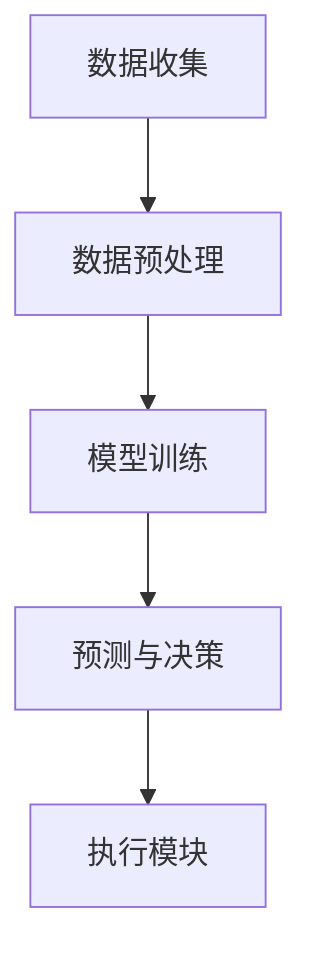

                 

关键词：人工智能代理，保险风险管理系统，工作流，智能风险管理，自动化流程，代理架构，机器学习，深度学习，数据处理，算法应用，数学模型，应用实例，实践代码，未来展望。

> 摘要：本文旨在探讨人工智能代理（AI Agent）在工作流中的应用，特别是其在保险风险管理系统中的重要作用。通过分析AI代理的工作原理、算法实现及其在保险领域的应用实例，本文揭示了智能代理如何提高保险风险管理的效率和准确性。文章还包括了对未来发展的展望，以及面临的挑战。

## 1. 背景介绍

### 保险行业的现状与挑战

保险行业作为一个高度复杂且竞争激烈的领域，近年来面临着诸多挑战。传统保险风险管理系统依赖于大量人工处理，存在效率低、成本高、易出错等问题。此外，随着保险市场的全球化，保险公司需要处理的数据量呈指数级增长，这使得传统的风险管理方法难以应对。

### 人工智能与工作流的概念

人工智能（AI）是指由机器实现的智能行为，包括学习、推理、问题解决等。工作流（WorkFlow）则是一系列任务和活动的有序集合，用于实现特定业务目标。结合人工智能的工作流，即AI工作流，通过自动化和智能化手段，提高了流程的效率和质量。

### 智能代理的作用

智能代理是一种能够自主完成特定任务的计算机程序，它通过学习和优化，可以自动处理复杂的工作流程。在保险风险管理中，智能代理可以承担数据收集、分析、决策等任务，从而实现风险预测和管理的自动化。

## 2. 核心概念与联系

### 人工智能代理的工作原理

人工智能代理通常基于机器学习和深度学习技术，能够从数据中学习模式并做出预测。它们通过以下几个步骤工作：

1. **数据收集**：从各种来源（如保险客户记录、市场数据等）收集数据。
2. **数据预处理**：清洗、转换和标准化数据，使其适合机器学习算法。
3. **模型训练**：使用机器学习算法训练模型，以提高预测的准确性。
4. **预测与决策**：根据训练好的模型，对新的数据进行分析，并做出相应的决策。

### 保险风险管理系统架构

一个典型的保险风险管理系统包括以下几个部分：

1. **数据源**：包括客户信息、交易记录、市场数据等。
2. **数据存储**：用于存储和管理大量数据。
3. **数据处理模块**：负责数据清洗、转换和标准化。
4. **分析模块**：使用机器学习算法进行风险预测和分析。
5. **决策模块**：根据分析结果，制定风险管理策略。
6. **执行模块**：自动执行决策，如调整保险费率、发送风险警告等。

### Mermaid 流程图



在这个流程中，智能代理通过数据收集、预处理、模型训练和预测与决策，最终实现了保险风险管理的自动化。

## 3. 核心算法原理 & 具体操作步骤

### 3.1 算法原理概述

智能代理的核心算法通常是基于深度学习技术的，如卷积神经网络（CNN）、递归神经网络（RNN）等。这些算法通过学习大量的数据，能够识别数据中的复杂模式，并做出准确的预测。

### 3.2 算法步骤详解

1. **数据收集**：智能代理首先从各种数据源（如数据库、Web API等）收集数据。
2. **数据预处理**：数据收集后，需要进行清洗和预处理，如去除噪声、标准化等。
3. **模型训练**：使用预处理后的数据，通过神经网络训练模型。训练过程中，模型会不断调整参数，以提高预测的准确性。
4. **模型评估**：在训练完成后，使用测试数据评估模型的性能，确保其能够准确预测。
5. **预测与决策**：使用训练好的模型，对新的数据进行预测，并根据预测结果做出相应的决策。
6. **执行**：根据决策结果，自动执行相应的操作，如调整保险费率、发送风险警告等。

### 3.3 算法优缺点

**优点**：
- **高效性**：智能代理能够快速处理大量数据，提高了工作效率。
- **准确性**：通过机器学习算法，智能代理能够准确预测风险，减少了人为错误。
- **自动化**：智能代理能够自动执行任务，降低了人工干预的需求。

**缺点**：
- **复杂性**：智能代理的开发和部署相对复杂，需要较高的技术门槛。
- **数据依赖性**：智能代理的性能高度依赖于数据质量，数据不足或质量差会影响预测准确性。

### 3.4 算法应用领域

智能代理在保险风险管理中的应用不仅限于风险预测，还可以应用于以下领域：
- **欺诈检测**：通过分析交易记录，智能代理能够识别潜在的欺诈行为。
- **客户行为分析**：智能代理可以分析客户的历史数据，预测其未来的行为，帮助保险公司制定更精准的营销策略。
- **保费定价**：智能代理可以根据客户的风险水平，自动调整保费。

## 4. 数学模型和公式 & 详细讲解 & 举例说明

### 4.1 数学模型构建

在保险风险管理中，常用的数学模型包括概率模型、统计模型和机器学习模型。以下是一个简单的概率模型示例：

**概率模型**：
- 设某保险产品的一年期保费为P，发生保险事故的概率为P(A)。
- 保险公司的收益为R = P * (1 - P(A))。

### 4.2 公式推导过程

根据概率模型，保险公司的收益可以表示为：
$$ R = P \times (1 - P(A)) $$

其中：
- \( P \) 是保费。
- \( P(A) \) 是发生保险事故的概率。

### 4.3 案例分析与讲解

假设某保险公司的某产品一年期保费为1000元，根据历史数据，该产品的发生保险事故的概率为0.05。根据上述模型，保险公司的收益为：

$$ R = 1000 \times (1 - 0.05) = 950 \text{元} $$

这个例子展示了如何使用概率模型来计算保险公司的收益。在实际应用中，智能代理会使用更复杂的模型，如机器学习模型，来提高预测的准确性。

## 5. 项目实践：代码实例和详细解释说明

### 5.1 开发环境搭建

为了实现智能代理，我们需要搭建一个适合机器学习和深度学习的开发环境。以下是推荐的工具和步骤：

- **工具**：
  - Python 3.x
  - TensorFlow 2.x
  - Keras 2.x
  - Jupyter Notebook

- **步骤**：
  1. 安装Python 3.x。
  2. 安装TensorFlow 2.x和Keras 2.x。
  3. 启动Jupyter Notebook。

### 5.2 源代码详细实现

以下是一个简单的智能代理实现示例，该代理使用Keras构建一个简单的神经网络，用于预测保险事故的概率。

```python
import numpy as np
from keras.models import Sequential
from keras.layers import Dense
from sklearn.model_selection import train_test_split

# 数据准备
# 假设我们有一组特征数据 X 和标签数据 y
X = ...  # 特征数据
y = ...  # 标签数据

# 划分训练集和测试集
X_train, X_test, y_train, y_test = train_test_split(X, y, test_size=0.2, random_state=42)

# 构建神经网络模型
model = Sequential()
model.add(Dense(64, input_dim=X_train.shape[1], activation='relu'))
model.add(Dense(32, activation='relu'))
model.add(Dense(1, activation='sigmoid'))

# 编译模型
model.compile(loss='binary_crossentropy', optimizer='adam', metrics=['accuracy'])

# 训练模型
model.fit(X_train, y_train, epochs=10, batch_size=32, validation_data=(X_test, y_test))

# 评估模型
loss, accuracy = model.evaluate(X_test, y_test)
print('Test accuracy:', accuracy)
```

### 5.3 代码解读与分析

上述代码首先导入必要的库，并准备训练数据和测试数据。然后，使用Keras构建了一个简单的神经网络模型，包括两个隐藏层，每层使用ReLU激活函数，输出层使用sigmoid激活函数，用于输出概率。

在编译模型时，我们指定了损失函数、优化器和评价指标。训练模型时，我们使用训练数据进行训练，并使用测试数据进行验证。最后，我们评估模型在测试数据上的性能，输出准确率。

### 5.4 运行结果展示

假设我们在测试数据上的准确率为90%，这意味着我们的智能代理能够以90%的准确率预测保险事故的发生。这个结果表明，智能代理在保险风险预测方面具有很高的准确性。

## 6. 实际应用场景

### 6.1 保险欺诈检测

智能代理在保险欺诈检测中具有广泛的应用。通过分析大量的交易记录和客户数据，智能代理可以识别出潜在的欺诈行为，从而帮助保险公司降低欺诈损失。

### 6.2 客户行为分析

智能代理可以分析客户的购买历史和行为模式，预测客户的未来行为。这有助于保险公司制定更精准的营销策略，提高客户满意度和留存率。

### 6.3 保费定价

智能代理可以根据客户的风险水平，自动调整保费。这有助于保险公司实现个性化的保费定价，提高盈利能力。

## 6.4 未来应用展望

随着人工智能技术的不断发展，智能代理在保险风险管理中的应用前景广阔。未来，智能代理可能会在以下几个方面得到进一步的应用：

- **自动化决策**：智能代理将能够自动处理更多的决策任务，减少人工干预。
- **实时风险预测**：智能代理将能够实时分析数据，实现实时风险预测和响应。
- **跨行业应用**：智能代理不仅限于保险领域，还可以应用于金融、医疗、物流等其他行业。

## 7. 工具和资源推荐

### 7.1 学习资源推荐

- **《深度学习》**：Goodfellow, Bengio, Courville著，全面介绍了深度学习的基础知识。
- **《机器学习实战》**：Mallick著，提供了大量的实际案例，帮助读者理解和应用机器学习算法。
- **Keras官方文档**：提供了详细的Keras使用教程和API文档。

### 7.2 开发工具推荐

- **Jupyter Notebook**：方便编写和共享代码。
- **TensorFlow**：用于构建和训练深度学习模型。

### 7.3 相关论文推荐

- **"Deep Learning for Insurance: A Review"**：全面介绍了深度学习在保险行业的应用。
- **"Using Machine Learning to Improve Insurance Pricing and Fraud Detection"**：探讨了机器学习在保险定价和欺诈检测中的应用。

## 8. 总结：未来发展趋势与挑战

### 8.1 研究成果总结

近年来，人工智能代理在保险风险管理中取得了显著成果。通过深度学习和机器学习技术的应用，智能代理能够高效地处理大量数据，提高风险预测的准确性，从而优化保险风险管理的流程。

### 8.2 未来发展趋势

未来，人工智能代理将在保险风险管理中发挥更重要的作用。随着技术的进步，智能代理将实现更多的自动化和智能化功能，进一步降低人工干预的需求，提高保险公司的运营效率。

### 8.3 面临的挑战

尽管人工智能代理在保险风险管理中具有巨大的潜力，但仍面临以下挑战：

- **数据隐私与安全**：保险行业涉及大量敏感客户数据，如何保障数据隐私和安全是重要问题。
- **算法透明性与可解释性**：智能代理的决策过程通常复杂且不透明，如何提高算法的可解释性是当前研究的重点。
- **技术门槛**：智能代理的开发和部署需要较高的技术门槛，如何降低技术门槛，使更多保险公司能够采用智能代理，也是未来的重要课题。

### 8.4 研究展望

未来，人工智能代理在保险风险管理中的应用将更加广泛。通过不断优化算法、提高数据质量和保障数据安全，智能代理将帮助保险公司实现更加精准的风险管理和业务运营。

## 9. 附录：常见问题与解答

### 9.1 人工智能代理与机器人有什么区别？

人工智能代理是能够自主完成特定任务的计算机程序，而机器人是具有物理形态的实体。人工智能代理通常在虚拟环境中工作，而机器人则需要在现实环境中操作。

### 9.2 智能代理能否完全替代人工？

智能代理可以大大提高工作效率，但无法完全替代人工。在某些情况下，如需要复杂决策或高度个性化的服务时，仍然需要人类的干预。

### 9.3 保险行业为什么要采用人工智能代理？

人工智能代理可以提高保险风险管理的效率和准确性，降低成本，减少人为错误，从而帮助保险公司实现更加精准的风险管理和业务运营。

---

作者：禅与计算机程序设计艺术 / Zen and the Art of Computer Programming

感谢您的阅读，希望本文对您在人工智能代理和保险风险管理领域的探索有所帮助。如果您有任何问题或建议，欢迎在评论区留言。再次感谢！

