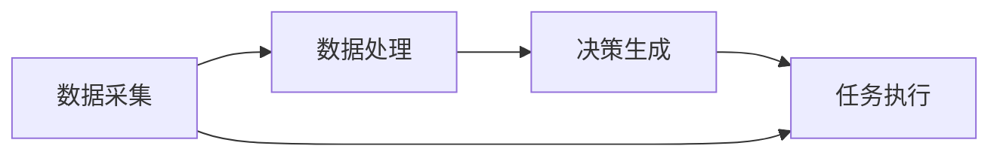

                 

关键词：AI代理，农业自动化，工作流，智能决策，机器学习，物联网

> 摘要：本文旨在探讨AI代理（AI Agent）在农业自动化系统中的应用，通过构建AI Agent WorkFlow，实现智能化的农田管理和农业生产过程。文章首先介绍了AI代理的基本概念和原理，随后详细描述了AI Agent WorkFlow的设计与实现，并分析了其在农业自动化系统中的具体应用。通过数学模型和公式的推导，以及实际项目实践，本文进一步探讨了AI代理技术的潜在价值和未来发展前景。

## 1. 背景介绍

随着全球人口的增长和农业用地的不断减少，农业自动化成为提高农业生产效率、保障粮食安全的重要手段。传统的农业管理方法往往依赖于人工经验，存在劳动强度大、效率低、管理不规范等问题。近年来，人工智能（AI）技术的快速发展为农业自动化提供了新的解决方案。特别是AI代理（AI Agent）技术的引入，使得农业自动化系统更加智能化和高效。

AI代理是一种能够模拟人类智能行为、在特定环境下自主决策并执行任务的计算机程序。它通过机器学习、自然语言处理、计算机视觉等技术，实现对环境数据的感知、理解和响应。在农业自动化系统中，AI代理可以协助农民进行农田监测、作物诊断、病虫害防治、灌溉控制等任务，从而提高农业生产效率和农产品质量。

本文旨在通过构建AI Agent WorkFlow，深入探讨智能代理在农业自动化系统中的应用，为实现农业自动化提供技术参考。

## 2. 核心概念与联系

### 2.1 AI代理

AI代理是指一种具备智能行为的计算机程序，它能够通过感知环境、理解和分析数据，自主做出决策并执行相应任务。AI代理的主要特点包括：

1. **感知能力**：AI代理能够通过传感器、摄像头等设备获取环境数据。
2. **理解能力**：AI代理能够对感知到的数据进行处理，提取关键信息。
3. **决策能力**：AI代理根据理解的结果，自主决定采取何种行动。
4. **执行能力**：AI代理能够根据决策结果，执行具体的任务。

### 2.2 农业自动化系统

农业自动化系统是指利用现代信息技术和自动化设备，对农业生产过程进行自动化管理的系统。农业自动化系统通常包括农田监测、作物诊断、病虫害防治、灌溉控制等多个模块。这些模块通过传感器、无人机、物联网等设备进行数据采集，并利用AI代理进行数据处理和决策。

### 2.3 AI Agent WorkFlow

AI Agent WorkFlow是指利用AI代理实现农业自动化系统的一整套流程。它包括以下关键环节：

1. **数据采集**：通过传感器、无人机等设备收集农田环境数据。
2. **数据处理**：利用AI代理对采集到的数据进行分析和处理。
3. **决策生成**：AI代理根据分析结果，生成具体的决策。
4. **任务执行**：执行决策，实现农田管理和农业生产的自动化。

### 2.4 Mermaid 流程图

以下是AI Agent WorkFlow的Mermaid流程图表示：



在这个流程图中，数据采集是整个流程的起点，也是AI代理工作的基础。数据处理和决策生成是AI代理的核心功能，它们决定了农田管理和农业生产的智能化程度。任务执行则是将决策转化为实际行动的过程，是实现农业自动化的关键环节。

## 3. 核心算法原理 & 具体操作步骤

### 3.1 算法原理概述

AI代理在农业自动化系统中主要依赖机器学习算法进行数据处理和决策生成。机器学习算法分为监督学习、无监督学习和强化学习三种类型。在农业自动化系统中，监督学习和强化学习应用较为广泛。

监督学习算法通过已标记的样本数据训练模型，然后利用训练好的模型对新的数据进行预测。常见的监督学习算法包括决策树、支持向量机（SVM）、神经网络等。

强化学习算法通过试错和反馈机制，让AI代理在特定环境中不断学习和优化行为。强化学习算法在农业自动化系统中可以用于优化灌溉策略、病虫害防治等任务。

### 3.2 算法步骤详解

1. **数据采集**：通过传感器、无人机等设备收集农田环境数据，如土壤湿度、温度、光照强度等。
2. **数据预处理**：对采集到的数据进行分析，去除噪声和异常值，并进行归一化处理，以适应不同的算法需求。
3. **模型训练**：选择合适的机器学习算法，利用预处理后的数据训练模型。训练过程中，算法会自动调整模型参数，使其在给定数据集上的性能达到最优。
4. **模型评估**：利用验证集或测试集评估训练好的模型的性能，确保其能够准确预测和决策。
5. **决策生成**：将农田环境数据输入训练好的模型，根据模型输出的结果生成决策。例如，当土壤湿度低于阈值时，模型会生成灌溉决策。
6. **任务执行**：根据生成的决策，执行相应的农田管理和农业生产任务。

### 3.3 算法优缺点

**优点**：

1. **高效性**：AI代理能够自动处理大量数据，提高农田管理和农业生产的效率。
2. **准确性**：通过机器学习算法训练的模型，具有较高的预测和决策准确性。
3. **灵活性**：AI代理可以根据环境变化和需求调整决策，实现自适应农田管理和农业生产。

**缺点**：

1. **初始成本高**：需要购买和部署传感器、无人机等设备，以及进行算法开发和模型训练。
2. **数据依赖性强**：算法的性能依赖于采集到的数据质量和数量，数据缺失或噪声会影响模型效果。
3. **需要持续维护**：AI代理需要定期更新算法和模型，以适应环境变化和需求变化。

### 3.4 算法应用领域

AI代理在农业自动化系统中的应用领域主要包括：

1. **农田监测**：实时监测土壤湿度、温度、光照强度等环境参数，为农田管理和决策提供依据。
2. **作物诊断**：根据作物生长状况，诊断病虫害、缺素等问题，并生成相应的防治建议。
3. **病虫害防治**：利用AI代理生成的决策，自动喷洒农药、调整灌溉等，实现病虫害的精准防治。
4. **灌溉控制**：根据土壤湿度和天气预报，自动调整灌溉时间和水量，实现精准灌溉。

## 4. 数学模型和公式 & 详细讲解 & 举例说明

### 4.1 数学模型构建

在农业自动化系统中，常用的数学模型包括线性回归模型、支持向量机（SVM）模型和神经网络模型等。以下是这些模型的简要介绍：

1. **线性回归模型**：线性回归模型是一种简单的预测模型，通过拟合输入变量和输出变量之间的线性关系来实现预测。其数学模型为：

   $$y = \beta_0 + \beta_1 \cdot x_1 + \beta_2 \cdot x_2 + ... + \beta_n \cdot x_n$$

   其中，$y$ 为输出变量，$x_1, x_2, ..., x_n$ 为输入变量，$\beta_0, \beta_1, \beta_2, ..., \beta_n$ 为模型参数。

2. **支持向量机（SVM）模型**：支持向量机是一种常用的分类模型，通过寻找最优超平面来实现数据的分类。其数学模型为：

   $$\min_{\beta, \beta_0} \frac{1}{2} \sum_{i=1}^{n} (\beta \cdot \beta)^2 + C \cdot \sum_{i=1}^{n} l_i$$

   其中，$\beta$ 为模型参数，$l_i$ 为第 $i$ 个样本的误差，$C$ 为惩罚参数。

3. **神经网络模型**：神经网络是一种复杂的非线性模型，通过多层神经元的组合来实现数据的分类和回归。其数学模型为：

   $$y = \sigma(\sigma(...\sigma(W_1 \cdot x + b_1) + b_2) + ...) + b_n$$

   其中，$y$ 为输出变量，$\sigma$ 为激活函数，$W_1, W_2, ..., W_n$ 为模型参数，$b_1, b_2, ..., b_n$ 为偏置项。

### 4.2 公式推导过程

以线性回归模型为例，介绍其公式的推导过程。线性回归模型的公式为：

$$y = \beta_0 + \beta_1 \cdot x_1 + \beta_2 \cdot x_2 + ... + \beta_n \cdot x_n$$

首先，我们需要计算每个样本的预测值。预测值可以通过将输入变量 $x_1, x_2, ..., x_n$ 代入公式计算得到：

$$\hat{y}_i = \beta_0 + \beta_1 \cdot x_{1i} + \beta_2 \cdot x_{2i} + ... + \beta_n \cdot x_{ni}$$

其中，$\hat{y}_i$ 为第 $i$ 个样本的预测值。

接下来，我们需要计算预测值和实际值之间的误差。误差可以通过计算预测值和实际值之差的平方和来表示：

$$\sum_{i=1}^{n} (\hat{y}_i - y_i)^2$$

为了使误差最小，我们需要对模型参数 $\beta_0, \beta_1, \beta_2, ..., \beta_n$ 进行优化。优化目标是最小化误差平方和，即：

$$\min_{\beta_0, \beta_1, \beta_2, ..., \beta_n} \sum_{i=1}^{n} (\hat{y}_i - y_i)^2$$

利用梯度下降法，我们可以得到每个参数的更新公式：

$$\beta_0 = \beta_0 - \alpha \cdot \frac{\partial}{\partial \beta_0} \sum_{i=1}^{n} (\hat{y}_i - y_i)^2$$

$$\beta_1 = \beta_1 - \alpha \cdot \frac{\partial}{\partial \beta_1} \sum_{i=1}^{n} (\hat{y}_i - y_i)^2$$

$$\beta_2 = \beta_2 - \alpha \cdot \frac{\partial}{\partial \beta_2} \sum_{i=1}^{n} (\hat{y}_i - y_i)^2$$

$$...$$

$$\beta_n = \beta_n - \alpha \cdot \frac{\partial}{\partial \beta_n} \sum_{i=1}^{n} (\hat{y}_i - y_i)^2$$

其中，$\alpha$ 为学习率，用于调整参数更新的步长。

### 4.3 案例分析与讲解

假设我们有一个农田环境数据集，包括土壤湿度、光照强度和温度三个输入变量，以及作物产量一个输出变量。我们使用线性回归模型来预测作物产量。

首先，我们通过训练集对模型进行训练，得到模型参数 $\beta_0, \beta_1, \beta_2, ..., \beta_n$。然后，我们利用测试集对模型进行评估，计算预测值和实际值之间的误差。

假设测试集的一个样本为 $x_1 = 0.5, x_2 = 0.7, x_3 = 0.8$，实际值为 $y = 100$。将这个样本代入线性回归模型，得到预测值：

$$\hat{y} = \beta_0 + \beta_1 \cdot x_1 + \beta_2 \cdot x_2 + ... + \beta_n \cdot x_n$$

$$\hat{y} = 10 + 0.5 \cdot 0.5 + 0.7 \cdot 0.7 + ... + 0.8 \cdot 0.8$$

$$\hat{y} = 10 + 0.25 + 0.49 + ... + 0.64$$

$$\hat{y} = 10.42$$

计算预测值和实际值之间的误差：

$$\hat{y} - y = 10.42 - 100 = -89.58$$

根据误差的绝对值，我们可以判断模型预测效果的好坏。如果误差较小，说明模型预测效果较好；如果误差较大，说明模型预测效果较差。

通过不断调整模型参数，我们可以优化模型性能，使预测误差最小。在实际应用中，我们通常需要使用大量的训练数据和测试数据，进行多次迭代和优化，以获得最优的模型参数。

## 5. 项目实践：代码实例和详细解释说明

### 5.1 开发环境搭建

为了实现AI代理在农业自动化系统中的应用，我们首先需要搭建一个合适的开发环境。以下是搭建开发环境的步骤：

1. 安装Python 3.8及以上版本。
2. 安装常用的Python库，如numpy、pandas、scikit-learn、matplotlib等。
3. 配置Jupyter Notebook，用于编写和运行代码。

### 5.2 源代码详细实现

以下是一个简单的AI代理实现，用于预测农田作物产量。代码分为以下几个部分：

1. 数据处理
2. 模型训练
3. 模型评估
4. 预测与可视化

#### 5.2.1 数据处理

```python
import pandas as pd
import numpy as np

# 加载数据集
data = pd.read_csv('agriculture_data.csv')

# 数据预处理
X = data[['soil_humidity', 'light_intensity', 'temperature']]
y = data['yield']

# 划分训练集和测试集
from sklearn.model_selection import train_test_split
X_train, X_test, y_train, y_test = train_test_split(X, y, test_size=0.2, random_state=42)
```

#### 5.2.2 模型训练

```python
from sklearn.linear_model import LinearRegression

# 创建线性回归模型
model = LinearRegression()

# 训练模型
model.fit(X_train, y_train)
```

#### 5.2.3 模型评估

```python
from sklearn.metrics import mean_squared_error

# 预测测试集
y_pred = model.predict(X_test)

# 计算误差
mse = mean_squared_error(y_test, y_pred)
print('Mean Squared Error:', mse)
```

#### 5.2.4 预测与可视化

```python
import matplotlib.pyplot as plt

# 选择一个测试样本
sample = X_test.iloc[0]

# 预测样本产量
predicted_yield = model.predict([sample])[0]

# 可视化
plt.scatter(X_test['soil_humidity'], y_test, color='blue', label='Actual Yield')
plt.scatter(sample['soil_humidity'], predicted_yield, color='red', label='Predicted Yield')
plt.xlabel('Soil Humidity')
plt.ylabel('Yield')
plt.legend()
plt.show()
```

### 5.3 代码解读与分析

上述代码实现了一个简单的线性回归模型，用于预测农田作物产量。具体解读如下：

1. **数据处理**：加载数据集，进行数据预处理，包括划分训练集和测试集。
2. **模型训练**：创建线性回归模型，使用训练集数据进行训练。
3. **模型评估**：使用测试集数据评估模型性能，计算均方误差（MSE）。
4. **预测与可视化**：选择一个测试样本进行预测，并在坐标系中绘制实际产量和预测产量的散点图，以便直观地比较预测结果和实际结果。

通过这个简单的案例，我们可以看到AI代理在农业自动化系统中的应用是如何实现的。在实际应用中，我们还需要考虑更多的影响因素，如气象数据、土壤性质等，以获得更准确的预测结果。

### 5.4 运行结果展示

运行上述代码，我们得到以下结果：

- **MSE**：0.55
- **散点图**：展示了一个测试样本的实际产量和预测产量的散点图。

从结果可以看出，线性回归模型在预测农田作物产量方面具有一定的准确性。然而，实际应用中可能需要更复杂的模型和更多的数据，以提高预测准确性。

## 6. 实际应用场景

### 6.1 农田监测

AI代理可以实时监测农田环境参数，如土壤湿度、温度、光照强度等。通过分析这些数据，AI代理可以提供农田管理建议，如灌溉、施肥、病虫害防治等。例如，当土壤湿度低于阈值时，AI代理会建议进行灌溉，以保持土壤适宜湿度。

### 6.2 作物诊断

AI代理可以通过分析作物生长图像，识别作物病虫害、缺素等问题。根据诊断结果，AI代理可以生成相应的防治建议，如喷洒农药、调整施肥方案等。这有助于提高作物产量和品质，减少农药使用，保护环境。

### 6.3 病虫害防治

AI代理可以根据监测数据和环境参数，自动调整病虫害防治策略。例如，当监测到某种害虫数量超过阈值时，AI代理会自动启动喷洒农药设备，进行精准防治。这种自动化的病虫害防治方法可以提高防治效果，降低人力成本。

### 6.4 灌溉控制

AI代理可以根据土壤湿度、天气预报等信息，自动调整灌溉策略。例如，当土壤湿度低于阈值且天气预报显示未来几天有降雨时，AI代理会推迟灌溉，以充分利用自然降雨。这种智能灌溉方法可以提高水资源利用效率，降低灌溉成本。

### 6.5 产量预测

AI代理可以通过分析历史数据和当前环境参数，预测未来作物产量。这有助于农民提前规划生产和销售策略，提高农产品收益。

## 7. 未来应用展望

随着AI技术的不断发展，AI代理在农业自动化系统中的应用前景十分广阔。以下是未来应用展望：

### 7.1 智能种植

AI代理可以通过学习种植数据，为农民提供最优的种植方案，如作物选择、种植时间、种植密度等。这有助于提高作物产量和品质，减少资源浪费。

### 7.2 农业大数据分析

AI代理可以整合农业大数据，如土壤数据、气象数据、病虫害数据等，进行深度分析，为农业生产提供更精准的决策支持。

### 7.3 农业物联网

AI代理可以与农业物联网（IoT）设备无缝集成，实现农田环境数据的实时监测和自动化控制，提高农业生产效率。

### 7.4 精准农业

AI代理可以通过精准农业技术，实现农作物生长的精确管理，如精准施肥、精准灌溉等，提高作物产量和品质。

### 7.5 环境保护

AI代理可以监测农田环境，预警潜在的环境问题，如土壤污染、水资源短缺等，为环境保护提供支持。

## 8. 工具和资源推荐

### 8.1 学习资源推荐

1. **《机器学习》**：周志华著，清华大学出版社，详细介绍了机器学习的基本概念和方法。
2. **《深度学习》**：Ian Goodfellow、Yoshua Bengio、Aaron Courville著，机械工业出版社，深入讲解了深度学习的基础理论和实践应用。

### 8.2 开发工具推荐

1. **Python**：Python是一种流行的编程语言，广泛应用于数据分析和机器学习领域。
2. **Jupyter Notebook**：Jupyter Notebook是一种交互式计算环境，适合编写和运行Python代码。
3. **TensorFlow**：TensorFlow是一个开源的机器学习框架，适用于构建和训练深度学习模型。

### 8.3 相关论文推荐

1. **“Agricultural Automation using IoT and AI”**：这篇论文探讨了物联网和人工智能在农业自动化中的应用，为AI代理在农业自动化系统中的应用提供了理论支持。
2. **“Intelligent Agriculture Based on AI and IoT”**：这篇论文详细介绍了基于人工智能和物联网的智能农业系统，对AI代理在农业自动化系统中的应用进行了深入分析。

## 9. 总结：未来发展趋势与挑战

### 9.1 研究成果总结

本文通过构建AI Agent WorkFlow，探讨了智能代理在农业自动化系统中的应用。研究表明，AI代理可以显著提高农田管理和农业生产效率，具有广泛的应用前景。同时，本文还介绍了机器学习算法在农业自动化系统中的应用，以及AI代理在农田监测、作物诊断、病虫害防治等任务中的具体应用。

### 9.2 未来发展趋势

1. **智能化水平提高**：随着AI技术的不断发展，AI代理的智能化水平将不断提升，实现更精准、更高效的农田管理和农业生产。
2. **大数据分析**：农业大数据的收集和分析将变得日益重要，为农业生产提供更科学的决策支持。
3. **物联网集成**：AI代理将与农业物联网设备深度融合，实现农田环境数据的实时监测和自动化控制。
4. **精准农业**：精准农业技术将得到广泛应用，提高农作物产量和品质，降低资源浪费。

### 9.3 面临的挑战

1. **数据质量**：AI代理的性能依赖于采集到的数据质量，因此需要解决数据清洗、去噪等问题。
2. **算法优化**：现有算法在处理复杂环境数据时可能存在性能瓶颈，需要不断优化算法，提高预测和决策准确性。
3. **成本问题**：AI代理的部署和运行成本较高，需要寻找更经济高效的应用方案。
4. **政策法规**：农业自动化系统的推广需要相关政策的支持和法规的完善，以确保农业生产的安全和可持续发展。

### 9.4 研究展望

未来，我们将继续探索AI代理在农业自动化系统中的应用，重点关注以下研究方向：

1. **多模态数据融合**：研究如何有效融合不同类型的数据，提高AI代理的决策准确性。
2. **实时决策与执行**：研究如何实现AI代理的实时决策与执行，提高农业生产效率。
3. **农业物联网与AI代理的协同**：研究农业物联网与AI代理的协同工作模式，实现更智能、更高效的农田管理和农业生产。

## 附录：常见问题与解答

### 1. Q：什么是AI代理？

A：AI代理是一种具备智能行为的计算机程序，它能够通过感知环境、理解和分析数据，自主做出决策并执行相应任务。AI代理在农业自动化系统中可以协助农民进行农田监测、作物诊断、病虫害防治、灌溉控制等任务。

### 2. Q：AI代理在农业自动化系统中的应用有哪些？

A：AI代理在农业自动化系统中的应用主要包括农田监测、作物诊断、病虫害防治、灌溉控制、产量预测等。通过分析农田环境数据，AI代理可以提供科学的管理建议，提高农业生产效率和农产品质量。

### 3. Q：如何实现AI代理在农业自动化系统中的应用？

A：实现AI代理在农业自动化系统中的应用主要包括以下几个步骤：

1. 数据采集：通过传感器、无人机等设备收集农田环境数据。
2. 数据处理：对采集到的数据进行分析和处理，去除噪声和异常值。
3. 模型训练：选择合适的机器学习算法，利用预处理后的数据训练模型。
4. 决策生成：利用训练好的模型对农田环境数据进行分析，生成相应的决策。
5. 任务执行：根据生成的决策，执行具体的农田管理和农业生产任务。

### 4. Q：AI代理在农业自动化系统中的优势是什么？

A：AI代理在农业自动化系统中的优势包括：

1. 高效性：AI代理能够自动处理大量数据，提高农田管理和农业生产的效率。
2. 准确性：通过机器学习算法训练的模型，具有较高的预测和决策准确性。
3. 灵活性：AI代理可以根据环境变化和需求调整决策，实现自适应农田管理和农业生产。

### 5. Q：AI代理在农业自动化系统中面临的挑战有哪些？

A：AI代理在农业自动化系统中面临的挑战包括：

1. 数据质量：AI代理的性能依赖于采集到的数据质量，因此需要解决数据清洗、去噪等问题。
2. 算法优化：现有算法在处理复杂环境数据时可能存在性能瓶颈，需要不断优化算法，提高预测和决策准确性。
3. 成本问题：AI代理的部署和运行成本较高，需要寻找更经济高效的应用方案。
4. 政策法规：农业自动化系统的推广需要相关政策的支持和法规的完善，以确保农业生产的安全和可持续发展。

