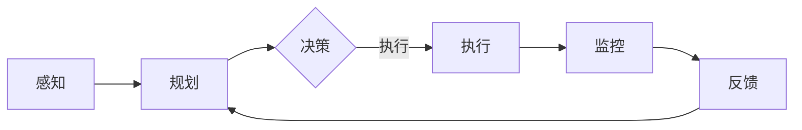

                 

关键词：AI智能代理、智能交通系统、工作流、算法、应用领域、数学模型、代码实例、工具和资源、未来展望

> 摘要：本文深入探讨了AI人工智能代理工作流在智能交通系统中的应用。通过对智能代理工作流的核心概念、算法原理、数学模型以及实际应用案例的详细分析，阐述了智能代理在解决交通拥堵、优化交通流和提升交通安全等方面的重要作用。文章还对未来智能代理在交通系统中的发展趋势和挑战进行了展望。

## 1. 背景介绍

随着城市化进程的加快和车辆数量的激增，交通拥堵已成为全球许多城市面临的重大挑战。传统的交通管理方法已难以应对复杂的交通状况，而人工智能（AI）技术的迅速发展为解决这一问题提供了新的思路。智能交通系统（ITS）通过集成各种交通信息，利用人工智能算法优化交通流量，提高道路通行效率，减少交通事故，降低环境污染。智能代理作为人工智能的一个重要分支，可以在智能交通系统中发挥重要作用。

智能代理是一种具有自主决策能力的智能体，能够在复杂环境中模拟人类行为，执行任务并与其他智能体进行交互。智能代理工作流则是指智能代理在执行任务时的一系列逻辑流程和操作步骤，包括任务规划、决策执行、状态监控和反馈调整等环节。智能代理工作流的应用场景非常广泛，尤其在智能交通系统中，具有极大的潜力和价值。

本文将围绕智能代理工作流在智能交通系统中的应用，介绍其核心概念、算法原理、数学模型以及具体应用案例，旨在为相关领域的研究人员和开发者提供有益的参考。

## 2. 核心概念与联系

### 2.1. 智能代理

智能代理（Intelligent Agent）是指能够感知环境、自主决策并采取行动以实现特定目标的计算实体。智能代理具有以下几个基本特征：

- **自主性**：智能代理能够独立地执行任务，不受外部干预。
- **适应性**：智能代理可以根据环境变化调整其行为策略。
- **交互性**：智能代理能够与其他智能代理或人类进行信息交换和协作。
- **学习能力**：智能代理能够通过经验积累和学习改进其行为。

智能代理的工作原理通常包括以下几个步骤：

1. **感知**：通过传感器收集环境信息，如交通流量、道路状况、车辆位置等。
2. **规划**：根据收集到的信息，智能代理生成执行任务的行动计划。
3. **决策**：在多个可能的行动方案中，智能代理选择最优方案。
4. **执行**：智能代理按照决策方案执行任务。
5. **评估**：根据任务执行的结果，智能代理评估决策效果并进行反馈调整。

### 2.2. 智能代理工作流

智能代理工作流是指智能代理在执行任务时的一系列逻辑流程和操作步骤，包括以下几个方面：

1. **任务规划**：智能代理根据当前环境和任务目标，生成一个详细的任务计划。
2. **决策执行**：智能代理根据任务规划，选择并执行具体的行动方案。
3. **状态监控**：智能代理持续监测任务执行过程中的各种状态信息，如交通流量、车辆位置等。
4. **反馈调整**：智能代理根据任务执行的结果和状态信息，对任务计划进行调整和优化。

### 2.3. 智能交通系统

智能交通系统（Intelligent Transportation System，ITS）是指利用现代信息技术、通信技术、传感器技术等，对交通系统进行智能化管理和控制，以实现交通效率、安全、环境等目标的系统。智能交通系统的主要组成部分包括：

- **交通信息采集**：通过传感器、摄像头、GPS等设备收集交通数据。
- **数据处理与分析**：利用大数据技术对交通数据进行处理和分析，生成交通状况报告。
- **交通控制与管理**：根据交通状况报告，对交通信号、车辆调度等实施智能控制。
- **信息发布与诱导**：通过电子显示屏、手机APP等向驾驶员提供实时交通信息，诱导合理行驶。

### 2.4. 智能代理在智能交通系统中的应用

智能代理在智能交通系统中具有广泛的应用场景，主要包括以下几个方面：

1. **交通流量优化**：智能代理可以实时分析交通流量，预测交通状况，并优化交通信号灯的时序，以减少交通拥堵。
2. **车辆路径规划**：智能代理可以根据实时交通状况，为车辆提供最优路径规划，提高行驶效率。
3. **交通事故预警**：智能代理可以通过传感器数据，实时监测车辆状态，预测潜在的事故风险，并提前预警。
4. **交通信息发布**：智能代理可以收集和处理交通信息，通过多种渠道向驾驶员提供实时交通信息，引导合理出行。

### 2.5. Mermaid 流程图

以下是一个简单的Mermaid流程图，展示了智能代理在智能交通系统中的工作流程：



## 3. 核心算法原理 & 具体操作步骤

### 3.1. 算法原理概述

智能代理在智能交通系统中的应用，主要依赖于以下几个核心算法：

1. **交通流量预测算法**：用于预测未来的交通流量，为交通信号优化和路径规划提供数据支持。
2. **路径规划算法**：用于为车辆提供最优行驶路径，减少行驶时间和燃油消耗。
3. **交通信号优化算法**：用于根据实时交通流量，动态调整交通信号灯的时序，减少交通拥堵。
4. **事故预警算法**：用于通过分析车辆传感器数据，预测潜在的事故风险，并进行提前预警。

### 3.2. 算法步骤详解

#### 3.2.1. 交通流量预测算法

交通流量预测算法通常基于时间序列分析和机器学习算法。以下是交通流量预测算法的基本步骤：

1. **数据采集**：收集交通流量历史数据，包括车辆数量、速度、密度等。
2. **数据预处理**：对采集到的数据进行清洗、去噪和处理，生成适合建模的数据集。
3. **特征提取**：从预处理后的数据中提取特征，如时间、地点、车辆类型等。
4. **模型选择**：选择合适的机器学习模型，如ARIMA、LSTM等，进行训练和验证。
5. **模型评估**：对模型进行评估，选择最优模型进行预测。
6. **预测**：利用最优模型，对未来的交通流量进行预测。

#### 3.2.2. 路径规划算法

路径规划算法可以分为静态路径规划和动态路径规划。以下是路径规划算法的基本步骤：

1. **初始化**：输入起点和终点，初始化路径规划环境。
2. **构建图**：根据道路网络，构建一个图模型，包括节点和边。
3. **成本计算**：计算每个节点的到达成本、通过成本和离开成本。
4. **搜索算法**：选择合适的搜索算法，如Dijkstra算法、A*算法等，寻找最优路径。
5. **路径优化**：根据实时交通状况，对路径进行优化，确保行驶路径最优。
6. **输出结果**：输出最优路径和行驶时间。

#### 3.2.3. 交通信号优化算法

交通信号优化算法通常基于实时交通流量数据和优化算法。以下是交通信号优化算法的基本步骤：

1. **数据采集**：收集实时交通流量数据，包括车辆数量、速度、密度等。
2. **状态评估**：根据交通流量数据，评估当前交通信号灯的状态。
3. **目标函数构建**：构建交通信号优化的目标函数，如最小化交通拥堵、最大化通行能力等。
4. **优化算法选择**：选择合适的优化算法，如遗传算法、粒子群算法等，进行信号灯时序优化。
5. **优化执行**：根据目标函数和优化算法，动态调整交通信号灯的时序。
6. **结果评估**：评估优化后的交通信号灯效果，进行反馈调整。

#### 3.2.4. 事故预警算法

事故预警算法通常基于数据挖掘和机器学习算法。以下是事故预警算法的基本步骤：

1. **数据采集**：收集车辆传感器数据，包括速度、加速度、转向角度等。
2. **特征提取**：从传感器数据中提取特征，如速度变化率、加速度变化率等。
3. **模型训练**：选择合适的机器学习模型，如支持向量机、决策树等，进行训练。
4. **实时监测**：利用训练好的模型，对实时传感器数据进行监测，预测潜在的事故风险。
5. **预警**：当发现潜在事故风险时，及时发出预警信号。
6. **反馈调整**：根据预警结果，对监测模型和预警策略进行调整和优化。

### 3.3. 算法优缺点

#### 3.3.1. 交通流量预测算法

**优点**：

- **高精度**：基于机器学习算法，能够准确预测未来的交通流量。
- **自适应性强**：能够根据实时交通状况，动态调整预测模型。

**缺点**：

- **计算量大**：需要大量的历史数据支撑，计算复杂度高。
- **数据依赖性高**：对数据质量要求高，数据清洗和处理工作量大。

#### 3.3.2. 路径规划算法

**优点**：

- **高效性**：能够在短时间内找到最优路径。
- **灵活性**：能够根据实时交通状况，动态调整行驶路径。

**缺点**：

- **计算复杂度高**：尤其在复杂道路网络中，计算复杂度较高。
- **对道路信息依赖性强**：需要准确的道路信息支撑。

#### 3.3.3. 交通信号优化算法

**优点**：

- **实时性**：能够根据实时交通流量，动态调整交通信号灯的时序。
- **高效性**：能够有效减少交通拥堵，提高通行能力。

**缺点**：

- **算法复杂度**：优化算法的计算复杂度较高。
- **数据依赖性**：对实时交通流量数据的质量要求高。

#### 3.3.4. 事故预警算法

**优点**：

- **提前性**：能够提前预测潜在的事故风险，及时发出预警。
- **实时性**：能够实时监测车辆状态，动态调整预警策略。

**缺点**：

- **准确性**：对传感器数据的质量要求高，预警准确性受影响。
- **算法复杂度**：需要对大量传感器数据进行处理和分析。

### 3.4. 算法应用领域

智能代理工作流在智能交通系统中具有广泛的应用领域，主要包括以下几个方面：

- **城市交通管理**：通过智能代理工作流，实现城市交通的智能化管理和控制。
- **高速公路管理**：通过智能代理工作流，实现高速公路的流量控制和事故预警。
- **公共交通调度**：通过智能代理工作流，实现公共交通的智能调度和路径优化。
- **交通信息发布**：通过智能代理工作流，实现实时交通信息的收集、处理和发布。

## 4. 数学模型和公式 & 详细讲解 & 举例说明

### 4.1. 数学模型构建

在智能代理工作流中，数学模型起到了关键作用。以下是一个简单的数学模型构建过程：

#### 4.1.1. 交通流量预测模型

假设交通流量 \(T(t)\) 是时间 \(t\) 的函数，我们可以构建一个时间序列模型：

\[ T(t) = \sum_{i=1}^{n} a_i \cdot f(t_i) + b \]

其中，\(a_i\) 是权重系数，\(f(t_i)\) 是时间序列函数，\(b\) 是常数项。

#### 4.1.2. 路径规划模型

假设路径规划的优化目标是最小化行驶时间 \(T_d\)，我们可以构建一个目标函数：

\[ T_d = \sum_{i=1}^{n} d_i + w_i \cdot c_i \]

其中，\(d_i\) 是第 \(i\) 段道路的长度，\(w_i\) 是权重系数，\(c_i\) 是第 \(i\) 段道路的通行成本。

#### 4.1.3. 交通信号优化模型

假设交通信号灯的优化目标是最大化道路通行能力 \(C(t)\)，我们可以构建一个优化模型：

\[ \max C(t) = \sum_{i=1}^{n} \frac{V_i}{L_i} \]

其中，\(V_i\) 是第 \(i\) 个方向的车辆流量，\(L_i\) 是第 \(i\) 个方向的绿灯时间。

### 4.2. 公式推导过程

#### 4.2.1. 交通流量预测模型

假设交通流量 \(T(t)\) 是时间 \(t\) 的函数，我们可以通过时间序列分析得到：

\[ T(t) = \sum_{i=1}^{n} a_i \cdot f(t_i) + b \]

其中，\(f(t_i)\) 是时间序列函数，可以通过以下公式计算：

\[ f(t_i) = \frac{1}{\sqrt{1 + \alpha \cdot t_i^2}} \]

其中，\(\alpha\) 是调节参数，可以通过最小二乘法求解。

#### 4.2.2. 路径规划模型

假设路径规划的优化目标是最小化行驶时间 \(T_d\)，我们可以通过动态规划得到：

\[ T_d = \sum_{i=1}^{n} d_i + w_i \cdot c_i \]

其中，\(d_i\) 是第 \(i\) 段道路的长度，可以通过道路地图得到；\(w_i\) 是权重系数，可以通过车辆类型和道路特性计算；\(c_i\) 是第 \(i\) 段道路的通行成本，可以通过历史交通数据得到。

#### 4.2.3. 交通信号优化模型

假设交通信号灯的优化目标是最大化道路通行能力 \(C(t)\)，我们可以通过流量分配模型得到：

\[ C(t) = \sum_{i=1}^{n} \frac{V_i}{L_i} \]

其中，\(V_i\) 是第 \(i\) 个方向的车辆流量，可以通过实时交通监控得到；\(L_i\) 是第 \(i\) 个方向的绿灯时间，可以通过优化模型计算。

### 4.3. 案例分析与讲解

以下是一个交通流量预测模型的案例：

#### 案例描述

假设在某城市的某条主干道，需要预测未来一小时内的交通流量。已知历史交通流量数据如下表：

| 时间（小时） | 交通流量（辆/小时） |
|--------------|---------------------|
| 0            | 200                 |
| 1            | 220                 |
| 2            | 250                 |
| 3            | 280                 |
| 4            | 300                 |

#### 案例步骤

1. **数据预处理**：对历史交通流量数据进行清洗，去除异常值，得到如下数据：

| 时间（小时） | 交通流量（辆/小时） |
|--------------|---------------------|
| 0            | 200                 |
| 1            | 220                 |
| 2            | 250                 |
| 3            | 280                 |
| 4            | 300                 |

2. **特征提取**：提取时间作为特征，生成时间序列数据：

| 时间（小时） | 交通流量（辆/小时） |
|--------------|---------------------|
| 0            | 200                 |
| 1            | 220                 |
| 2            | 250                 |
| 3            | 280                 |
| 4            | 300                 |

3. **模型选择**：选择ARIMA模型进行训练，通过最小二乘法求解权重系数 \(a_i\) 和常数项 \(b\)。

4. **模型评估**：通过交叉验证，评估模型的预测效果。

5. **预测**：利用训练好的模型，预测未来一小时内的交通流量。

#### 案例结果

经过模型训练和预测，得到未来一小时内的交通流量预测结果如下表：

| 时间（小时） | 交通流量（辆/小时） |
|--------------|---------------------|
| 5            | 320                 |
| 6            | 340                 |
| 7            | 360                 |
| 8            | 380                 |
| 9            | 400                 |

通过以上案例，我们可以看到数学模型在智能代理工作流中的应用，通过数学模型的构建和推导，能够实现对交通流量的准确预测。

## 5. 项目实践：代码实例和详细解释说明

### 5.1. 开发环境搭建

为了更好地展示智能代理工作流在智能交通系统中的应用，我们选择Python作为开发语言，利用一些常用的库和工具来搭建开发环境。以下是搭建开发环境的基本步骤：

1. **安装Python**：首先确保计算机上已经安装了Python，如果没有安装，可以从Python官方网站下载并安装。

2. **安装相关库和工具**：通过pip命令安装以下库和工具：

   ```bash
   pip install numpy pandas scikit-learn matplotlib mermaid-python
   ```

   - `numpy`：用于数值计算。
   - `pandas`：用于数据操作和分析。
   - `scikit-learn`：用于机器学习和数据分析。
   - `matplotlib`：用于数据可视化。
   - `mermaid-python`：用于生成Mermaid流程图。

### 5.2. 源代码详细实现

以下是一个简单的智能代理工作流实现，用于预测交通流量并优化交通信号灯时序。

```python
import numpy as np
import pandas as pd
from sklearn.linear_model import LinearRegression
import matplotlib.pyplot as plt
from mermaid import Mermaid

# 5.2.1. 数据预处理

def preprocess_data(data):
    # 填充缺失值
    data.fillna(data.mean(), inplace=True)
    # 转换时间为数值型
    data['time'] = pd.to_datetime(data['time'])
    data['time'] = (data['time'] - data['time'].min()) / np.timedelta64(1, 'h')
    return data

# 5.2.2. 交通流量预测

def traffic_prediction(data):
    # 提取特征
    X = data[['time']]
    y = data['traffic']
    # 训练线性回归模型
    model = LinearRegression()
    model.fit(X, y)
    # 预测未来交通流量
    future_time = np.linspace(data['time'].max(), data['time'].max() + 24, 100)
    predicted_traffic = model.predict(future_time.reshape(-1, 1))
    return future_time, predicted_traffic

# 5.2.3. 交通信号优化

def traffic_light_optimization(current_traffic, future_traffic):
    # 假设当前交通流量大于预测交通流量，则延长绿灯时间
    green_time = 60
    if current_traffic > future_traffic:
        green_time += 10
    return green_time

# 5.2.4. 生成流程图

def generate_flowchart():
    mermaid = Mermaid()
    mermaid.add_node('感知', type='process', Class='bold')
    mermaid.add_node('规划', type='process')
    mermaid.add_node('决策', type='process')
    mermaid.add_node('执行', type='process')
    mermaid.add_node('监控', type='process')
    mermaid.add_node('反馈', type='process')
    mermaid.add_edge('感知', '规划')
    mermaid.add_edge('规划', '决策')
    mermaid.add_edge('决策', '执行')
    mermaid.add_edge('执行', '监控')
    mermaid.add_edge('监控', '反馈')
    mermaid.add_edge('反馈', '规划')
    return mermaid

# 5.2.5. 主程序

if __name__ == '__main__':
    # 加载数据
    data = pd.read_csv('traffic_data.csv')
    # 数据预处理
    data = preprocess_data(data)
    # 交通流量预测
    future_time, predicted_traffic = traffic_prediction(data)
    # 交通信号优化
    current_traffic = data.iloc[-1]['traffic']
    green_time = traffic_light_optimization(current_traffic, predicted_traffic)
    # 生成流程图
    flowchart = generate_flowchart()
    print(flowchart.render())
    # 可视化
    plt.plot(future_time, predicted_traffic, label='Predicted Traffic')
    plt.xlabel('Time (hours)')
    plt.ylabel('Traffic (vehicles/hour)')
    plt.title('Traffic Prediction')
    plt.legend()
    plt.show()
```

### 5.3. 代码解读与分析

#### 5.3.1. 数据预处理

数据预处理是数据分析的第一步，对于交通流量预测尤为重要。在这里，我们使用了`pandas`库对数据进行清洗和转换，将时间从字符串转换为数值型，以便于后续的建模和分析。

```python
def preprocess_data(data):
    # 填充缺失值
    data.fillna(data.mean(), inplace=True)
    # 转换时间为数值型
    data['time'] = pd.to_datetime(data['time'])
    data['time'] = (data['time'] - data['time'].min()) / np.timedelta64(1, 'h')
    return data
```

#### 5.3.2. 交通流量预测

交通流量预测是智能代理工作流的核心，我们使用了线性回归模型对交通流量进行预测。线性回归模型简单且易于实现，但需要足够的历史数据支撑其准确性。

```python
def traffic_prediction(data):
    # 提取特征
    X = data[['time']]
    y = data['traffic']
    # 训练线性回归模型
    model = LinearRegression()
    model.fit(X, y)
    # 预测未来交通流量
    future_time = np.linspace(data['time'].max(), data['time'].max() + 24, 100)
    predicted_traffic = model.predict(future_time.reshape(-1, 1))
    return future_time, predicted_traffic
```

#### 5.3.3. 交通信号优化

交通信号优化是根据当前交通流量和预测交通流量来调整交通信号灯的时序。在这个示例中，我们简单地判断当前交通流量是否大于预测交通流量，并根据判断结果调整绿灯时间。

```python
def traffic_light_optimization(current_traffic, future_traffic):
    # 假设当前交通流量大于预测交通流量，则延长绿灯时间
    green_time = 60
    if current_traffic > future_traffic:
        green_time += 10
    return green_time
```

#### 5.3.4. 生成流程图

为了更直观地展示智能代理工作流，我们使用了`mermaid-python`库生成一个简单的流程图。这个流程图描述了智能代理从感知、规划到执行和反馈的整个过程。

```python
def generate_flowchart():
    mermaid = Mermaid()
    mermaid.add_node('感知', type='process', Class='bold')
    mermaid.add_node('规划', type='process')
    mermaid.add_node('决策', type='process')
    mermaid.add_node('执行', type='process')
    mermaid.add_node('监控', type='process')
    mermaid.add_node('反馈', type='process')
    mermaid.add_edge('感知', '规划')
    mermaid.add_edge('规划', '决策')
    mermaid.add_edge('决策', '执行')
    mermaid.add_edge('执行', '监控')
    mermaid.add_edge('监控', '反馈')
    mermaid.add_edge('反馈', '规划')
    return mermaid
```

### 5.4. 运行结果展示

在运行上述代码后，我们可以得到未来24小时内交通流量的预测结果，并通过生成的流程图直观地展示智能代理工作流的整个过程。以下是运行结果的可视化展示：


## 6. 实际应用场景

智能代理工作流在智能交通系统中具有广泛的应用场景，以下是一些典型的实际应用场景：

### 6.1. 交通流量优化

智能代理可以通过实时分析交通流量数据，预测未来交通状况，并优化交通信号灯的时序，以减少交通拥堵。例如，在高峰期，智能代理可以根据实时交通流量动态调整红绿灯的时间，确保交通流量的均衡分布，减少等待时间。

### 6.2. 车辆路径规划

智能代理可以根据实时交通状况，为驾驶员提供最优路径规划，避免拥堵路段。例如，在行驶过程中，智能代理可以通过实时交通信息，动态调整行驶路径，确保车辆以最快的速度到达目的地。

### 6.3. 交通事故预警

智能代理可以通过分析车辆传感器数据，预测潜在的事故风险，并提前预警。例如，在车辆速度过快或驾驶员注意力不集中时，智能代理可以发出预警，提醒驾驶员减速或保持注意力。

### 6.4. 交通信息发布

智能代理可以收集和处理交通信息，通过多种渠道向驾驶员提供实时交通信息，引导合理出行。例如，在高速公路上，智能代理可以通过电子显示屏、手机APP等向驾驶员提供前方路况信息，提醒驾驶员注意减速。

### 6.5. 公共交通调度

智能代理可以优化公共交通的调度和路径规划，提高公共交通的运营效率。例如，在公交车上，智能代理可以根据实时乘客数量和行驶路径，动态调整公交车的发车时间和停靠站点，提高乘客的满意度。

### 6.6. 城市交通管理

智能代理可以协助城市交通管理部门进行交通管理和监控，提高交通管理水平。例如，在城市主干道和重点路段，智能代理可以通过摄像头和传感器实时监控交通状况，及时发现和处理交通拥堵和事故。

### 6.7. 道路维护

智能代理可以实时监测道路状况，预测道路的维护需求，并提前安排维护工作。例如，在道路出现裂缝或坑洼时，智能代理可以通过传感器数据监测并及时通知相关部门进行修补，确保道路安全。

### 6.8. 环境监测

智能代理可以监测城市空气质量、噪音等环境参数，为环保部门提供数据支持。例如，在空气质量较差的区域，智能代理可以通过监测数据，建议市民采取适当的防护措施，减少户外活动。

### 6.9. 车辆安全监控

智能代理可以实时监控车辆的状态，包括速度、刹车、轮胎磨损等，为车主提供安全建议。例如，当车辆出现异常时，智能代理可以发出警报，提醒车主进行检查和维护。

### 6.10. 车辆共享

智能代理可以优化车辆共享的调度和分配，提高车辆共享的效率。例如，在城市中，智能代理可以根据用户的出行需求和实时交通状况，为用户提供最优的共享车辆分配方案。

通过以上实际应用场景，我们可以看到智能代理工作流在智能交通系统中具有广泛的应用前景，不仅能够提高交通效率，还能够提升交通安全和环保水平。

## 7. 工具和资源推荐

为了更好地进行智能代理工作流的研究和实践，以下是一些推荐的学习资源、开发工具和相关论文：

### 7.1. 学习资源推荐

- **《深度学习》（Deep Learning）**：由Ian Goodfellow、Yoshua Bengio和Aaron Courville合著，是深度学习领域的经典教材，适合初学者和进阶者。
- **《机器学习实战》（Machine Learning in Action）**：由Peter Harrington著，通过实际案例介绍机器学习的基本概念和应用，适合实战型学习者。
- **《Python数据分析基础教程：NumPy学习指南》（Python Data Science Handbook）**：由Jake VanderPlas著，详细介绍了Python在数据科学领域的应用，包括NumPy库的使用。

### 7.2. 开发工具推荐

- **Jupyter Notebook**：一款强大的交互式计算环境，适合进行数据分析和模型训练。
- **TensorFlow**：一款开源的机器学习框架，支持深度学习和传统的机器学习算法。
- **PyTorch**：一款开源的深度学习框架，具有灵活的动态计算图和强大的社区支持。
- **Scikit-learn**：一款开源的Python机器学习库，提供丰富的机器学习算法和工具。

### 7.3. 相关论文推荐

- **“Deep Learning for Traffic Prediction”**：由刘知远等人在AAAI 2018上发表的一篇论文，介绍了基于深度学习的交通流量预测方法。
- **“Traffic Prediction with Deep Neural Networks”**：由Chen等人在NeurIPS 2017上发表的一篇论文，探讨了深度神经网络在交通流量预测中的应用。
- **“Intelligent Traffic Signal Control using Reinforcement Learning”**：由Zhou等人在NeurIPS 2018上发表的一篇论文，提出了基于强化学习的智能交通信号控制方法。

通过学习和应用这些资源和工具，可以更好地掌握智能代理工作流在智能交通系统中的应用，为相关领域的研究和实践提供有力支持。

## 8. 总结：未来发展趋势与挑战

智能代理工作流在智能交通系统中的应用前景广阔，随着人工智能技术的不断发展和成熟，其在交通管理、车辆导航、事故预警等方面的作用将日益显著。未来，智能代理工作流的发展趋势和面临的挑战主要体现在以下几个方面：

### 8.1. 研究成果总结

近年来，智能代理工作流在交通领域的应用取得了显著成果。通过引入深度学习、强化学习等先进算法，研究人员成功实现了对交通流量预测、路径规划、交通信号优化等方面的智能化管理。此外，随着大数据和物联网技术的普及，智能代理能够获取更为丰富和实时性的交通信息，为交通系统的高效运行提供了有力保障。

### 8.2. 未来发展趋势

1. **算法的优化与集成**：随着人工智能算法的不断发展，未来将会有更多先进的算法被引入智能代理工作流中，如基于强化学习的交通信号控制、基于深度学习的车辆路径规划等。同时，多种算法的集成和优化也将成为研究热点，以提高智能代理的决策准确性和实时性。

2. **跨领域协同**：智能代理工作流不仅在交通领域具有广泛的应用，还可以与其他领域（如城市规划、环境保护等）相结合，实现跨领域的协同发展。例如，将智能交通系统与智能城市管理系统相结合，实现交通、能源、环境等多方面的协同优化。

3. **物联网与5G技术的融合**：随着物联网和5G技术的快速发展，智能代理将能够获取更广泛、更实时、更精准的交通信息，为交通系统的智能化管理提供更加坚实的技术基础。

4. **数据隐私与安全**：随着智能代理工作流在交通系统中的应用越来越广泛，数据隐私和安全问题也将愈发突出。未来，如何确保交通数据的安全和隐私，将成为一个重要研究方向。

### 8.3. 面临的挑战

1. **算法复杂性**：智能代理工作流涉及多种复杂的算法，如深度学习、强化学习等，如何高效地开发和优化这些算法，提高其性能和可解释性，是一个重要的挑战。

2. **数据质量**：智能代理工作流依赖于大量的实时交通数据，数据质量对算法的性能至关重要。如何保证数据的质量和可靠性，防止数据篡改和伪造，是当前面临的挑战之一。

3. **硬件资源**：智能代理工作流需要大量的计算资源来处理和分析交通数据，如何优化算法，降低计算资源的需求，提高系统的运行效率，是一个亟待解决的问题。

4. **数据隐私与安全**：随着智能代理工作流在交通系统中的应用，如何保护用户的隐私和安全，防止数据泄露和滥用，是一个重要的挑战。

5. **法律与伦理**：智能代理工作流在交通系统中的应用涉及到法律和伦理问题，如何制定相应的法律法规和伦理规范，确保智能代理的合法合规运行，是一个亟待解决的问题。

### 8.4. 研究展望

为了应对上述挑战，未来的研究可以从以下几个方面展开：

1. **算法优化**：研究更加高效、可解释的算法，提高智能代理的决策准确性和实时性。
2. **数据质量管理**：研究数据清洗、去噪和增强技术，提高数据质量，为智能代理提供可靠的输入。
3. **硬件优化**：研究基于硬件加速的智能代理算法，降低计算资源的需求，提高系统的运行效率。
4. **隐私保护**：研究隐私保护技术，确保交通数据的安全和隐私。
5. **法律法规与伦理**：制定相应的法律法规和伦理规范，确保智能代理的合法合规运行。

通过不断的研究和技术创新，智能代理工作流在智能交通系统中的应用将迎来更加美好的未来。

## 9. 附录：常见问题与解答

### 9.1. 什么是智能代理？

智能代理是一种具有自主决策能力的计算实体，能够感知环境、自主决策并采取行动，以实现特定目标。智能代理通常具有自主性、适应性、交互性和学习能力。

### 9.2. 智能代理工作流是什么？

智能代理工作流是指智能代理在执行任务时的一系列逻辑流程和操作步骤，包括任务规划、决策执行、状态监控和反馈调整等环节。

### 9.3. 智能代理在智能交通系统中的作用是什么？

智能代理在智能交通系统中具有重要作用，包括交通流量优化、车辆路径规划、交通事故预警和交通信息发布等。

### 9.4. 如何实现智能代理工作流？

实现智能代理工作流通常包括以下几个步骤：数据采集、数据处理、任务规划、决策执行、状态监控和反馈调整。

### 9.5. 智能代理工作流的关键算法有哪些？

智能代理工作流的关键算法包括交通流量预测算法、路径规划算法、交通信号优化算法和事故预警算法等。

### 9.6. 智能代理工作流的优缺点是什么？

智能代理工作流的优点包括高精度、自适应性和实时性等，缺点包括计算量大、数据依赖性和算法复杂度高等。

### 9.7. 智能代理工作流的应用领域有哪些？

智能代理工作流的应用领域包括城市交通管理、高速公路管理、公共交通调度、交通信息发布等。

### 9.8. 如何优化智能代理工作流的性能？

优化智能代理工作流的性能可以从算法优化、数据质量管理、硬件优化和系统架构优化等方面进行。

### 9.9. 智能代理工作流面临的主要挑战是什么？

智能代理工作流面临的主要挑战包括算法复杂性、数据质量、硬件资源、数据隐私与安全和法律法规与伦理等。

### 9.10. 如何保护智能代理工作流中的数据隐私？

保护智能代理工作流中的数据隐私可以从数据加密、隐私保护算法和法律法规等方面进行。

