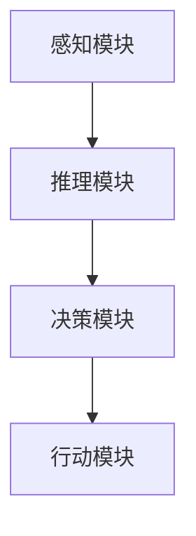

                 

关键词：人工智能，智能代理，航空领域，工作流，系统应用，算法，数学模型，代码实例，实践，展望

> 摘要：本文深入探讨了智能代理工作流（AI Agent WorkFlow）在航空领域系统中的应用。通过介绍智能代理的核心概念、算法原理、数学模型，以及具体的代码实例和实际应用场景，本文旨在为读者提供一个全面而深入的视角，揭示智能代理在航空领域的巨大潜力和广阔前景。

## 1. 背景介绍

### 1.1 航空领域的复杂性

航空领域是一个高度复杂、高风险的行业。从飞行计划的制定、航班的调度，到航班的维护、旅客的安全，每个环节都需要精确的数据分析和高效的决策支持。随着全球航空运输业的快速发展，传统的手动操作和人工决策已经难以满足行业的需求。因此，引入智能代理工作流，利用人工智能技术提高航空系统的自动化和智能化水平，成为当前行业发展的一个重要方向。

### 1.2 智能代理的兴起

智能代理（AI Agent）是人工智能领域的一个重要分支。它是一种能够自主执行任务、适应环境和与外部进行交互的软件实体。智能代理工作流通过将智能代理应用于航空系统中的各个环节，实现自动化的任务执行和智能化的决策支持，从而提高整个系统的运行效率和服务质量。

### 1.3 目标与意义

本文旨在深入探讨智能代理工作流在航空领域中的应用，通过分析智能代理的核心概念、算法原理和实际案例，探讨其在航空系统中的潜在应用场景和实际效果。本文的研究不仅有助于了解智能代理在航空领域的应用现状，同时也为未来的研究和实际应用提供了参考和指导。

## 2. 核心概念与联系

### 2.1 智能代理的定义

智能代理是指一种具有感知、推理、决策和行动能力的软件实体。它能够根据环境信息自主执行任务，适应环境变化，并在一定范围内实现自我优化。

### 2.2 智能代理工作流的概念

智能代理工作流是指利用智能代理在航空系统中实现自动化任务执行和智能化决策支持的过程。它包括任务规划、任务执行、任务监控和任务评估等多个环节。

### 2.3 智能代理工作流的架构

智能代理工作流的架构包括四个主要部分：感知模块、推理模块、决策模块和行动模块。

- 感知模块：负责收集和分析环境信息，为智能代理提供决策依据。
- 推理模块：负责基于感知模块提供的信息进行逻辑推理，确定行动方案。
- 决策模块：负责根据推理模块的结果进行决策，选择最优的行动方案。
- 行动模块：负责执行决策模块选定的行动方案，实现任务的自动化执行。

### 2.4 智能代理工作流的 Mermaid 流程图



## 3. 核心算法原理 & 具体操作步骤

### 3.1 算法原理概述

智能代理工作流的核心算法主要包括感知、推理、决策和行动四个部分。每个部分都采用不同的算法和技术，协同工作，实现智能代理的自动化任务执行和智能化决策支持。

- 感知模块：通常采用机器学习和计算机视觉等技术，对环境信息进行实时监测和分析，提取关键特征。
- 推理模块：采用逻辑推理、知识图谱等技术，对感知模块提取的特征进行分析和推理，生成行动方案。
- 决策模块：采用决策树、支持向量机等机器学习算法，对推理模块生成的行动方案进行评估和选择，确定最优行动方案。
- 行动模块：采用控制理论和机器人技术，执行决策模块确定的最优行动方案，实现任务的自动化执行。

### 3.2 算法步骤详解

1. **感知阶段**：
   - 收集航空系统中的实时数据，包括航班信息、天气状况、机场资源使用情况等。
   - 使用机器学习算法对数据进行预处理，提取关键特征，如航班延误时间、航班载客量、机场资源利用率等。

2. **推理阶段**：
   - 基于提取的关键特征，使用逻辑推理算法生成初步的行动方案。
   - 利用知识图谱技术，对初步行动方案进行优化，生成更加合理和有效的行动方案。

3. **决策阶段**：
   - 使用机器学习算法，对推理阶段生成的行动方案进行评估和选择，确定最优行动方案。
   - 根据评估结果，生成最终的决策结果，如航班调整方案、机场资源调度方案等。

4. **行动阶段**：
   - 根据决策结果，执行具体的行动方案，实现航空系统的自动化运行。
   - 对行动过程进行监控和反馈，根据实际情况对行动方案进行调整和优化。

### 3.3 算法优缺点

**优点**：

- **高效性**：智能代理工作流能够快速处理大量数据，实时生成决策，提高了系统的响应速度和运行效率。
- **灵活性**：智能代理工作流可以根据环境变化和需求变化，灵活调整行动方案，提高系统的适应能力。
- **准确性**：通过机器学习和知识图谱技术，智能代理工作流能够准确提取和分析环境信息，提高决策的准确性。

**缺点**：

- **复杂性**：智能代理工作流涉及多个算法和技术，系统设计和实现复杂，需要较高的技术门槛。
- **数据依赖性**：智能代理工作流的性能依赖于输入数据的质量和数量，数据不足或质量不高会影响系统的性能。

### 3.4 算法应用领域

智能代理工作流在航空领域具有广泛的应用前景，主要包括以下几个方面：

- **航班调度**：通过智能代理工作流，实现航班的自动调度和优化，提高航班运行效率和乘客满意度。
- **机场资源管理**：通过智能代理工作流，实现机场资源的自动调度和优化，提高资源利用率和运营效率。
- **旅客服务**：通过智能代理工作流，为旅客提供个性化的服务，如航班信息实时推送、行李追踪等，提高旅客的体验。

## 4. 数学模型和公式 & 详细讲解 & 举例说明

### 4.1 数学模型构建

智能代理工作流中的数学模型主要包括感知模块的数学模型、推理模块的数学模型和决策模块的数学模型。

**感知模块的数学模型**：

感知模块通常使用机器学习算法对环境信息进行预处理和特征提取。假设我们使用一种基于神经网络的机器学习算法，其输入为环境信息向量 \(X\)，输出为特征向量 \(F\)，则感知模块的数学模型可以表示为：

$$
F = f(X)
$$

其中，\(f\) 为神经网络模型，用于对环境信息进行特征提取。

**推理模块的数学模型**：

推理模块使用逻辑推理算法对特征向量进行推理，生成行动方案。假设我们使用一种基于知识图谱的逻辑推理算法，其输入为特征向量 \(F\)，输出为行动方案 \(A\)，则推理模块的数学模型可以表示为：

$$
A = g(F)
$$

其中，\(g\) 为逻辑推理模型，用于生成行动方案。

**决策模块的数学模型**：

决策模块使用机器学习算法对推理模块生成的行动方案进行评估和选择，确定最优行动方案。假设我们使用一种基于决策树的支持向量机算法，其输入为行动方案 \(A\)，输出为最优行动方案 \(A^*\)，则决策模块的数学模型可以表示为：

$$
A^* = \arg\max_a \sum_{i=1}^{n} w_i y_i
$$

其中，\(a\) 为行动方案，\(w_i\) 和 \(y_i\) 分别为行动方案 \(a\) 的权重和收益。

### 4.2 公式推导过程

**感知模块的数学模型推导**：

假设环境信息向量 \(X\) 由 \(m\) 个特征组成，分别为 \(x_1, x_2, ..., x_m\)。神经网络模型 \(f\) 的输入为 \(X\)，输出为特征向量 \(F\)，则：

$$
F = f(X) = [f_1(X), f_2(X), ..., f_m(X)]
$$

其中，\(f_i(X)\) 表示第 \(i\) 个特征的提取结果。神经网络模型 \(f\) 可以表示为：

$$
f_i(X) = \sigma(W_i X + b_i)
$$

其中，\(\sigma\) 为激活函数，\(W_i\) 为权重矩阵，\(b_i\) 为偏置向量。

**推理模块的数学模型推导**：

假设特征向量 \(F\) 由 \(n\) 个特征组成，分别为 \(f_1, f_2, ..., f_n\)。逻辑推理模型 \(g\) 的输入为 \(F\)，输出为行动方案 \(A\)，则：

$$
A = g(F) = [a_1, a_2, ..., a_n]
$$

其中，\(a_i\) 表示第 \(i\) 个行动方案的推理结果。逻辑推理模型 \(g\) 可以表示为：

$$
a_i = g(f_i)
$$

**决策模块的数学模型推导**：

假设行动方案 \(A\) 由 \(n\) 个方案组成，分别为 \(a_1, a_2, ..., a_n\)。决策模块使用支持向量机算法，其输入为行动方案 \(A\)，输出为最优行动方案 \(A^*\)，则：

$$
A^* = \arg\max_a \sum_{i=1}^{n} w_i y_i
$$

其中，\(w_i\) 和 \(y_i\) 分别为行动方案 \(a\) 的权重和收益。支持向量机算法可以通过求解以下优化问题得到：

$$
\min_{w,b} \frac{1}{2} ||w||^2
$$

$$
s.t. y_i (w \cdot x_i + b) \geq 1
$$

其中，\(w\) 为权重向量，\(b\) 为偏置向量，\(x_i\) 为样本特征，\(y_i\) 为样本标签。

### 4.3 案例分析与讲解

以航班调度为例，分析智能代理工作流中的数学模型和应用。

**感知模块**：

假设感知模块收集了以下航班信息：

$$
X = \{航班编号, 出发时间, 到达时间, 航班状态, 航班载客量, 航班延误时间\}
$$

使用神经网络模型对航班信息进行预处理和特征提取，生成特征向量 \(F\)。

**推理模块**：

假设推理模块使用逻辑推理算法，根据特征向量 \(F\) 生成以下行动方案：

$$
A = \{调整航班出发时间, 调整航班到达时间, 调整航班延误时间\}
$$

**决策模块**：

假设决策模块使用支持向量机算法，根据行动方案 \(A\) 评估和选择最优行动方案。假设行动方案 \(a_1, a_2, a_3\) 的权重和收益分别为：

$$
w_1 = 0.4, y_1 = 0.8 \\
w_2 = 0.3, y_2 = 0.6 \\
w_3 = 0.3, y_3 = 0.5
$$

则最优行动方案为：

$$
A^* = \arg\max_a \sum_{i=1}^{3} w_i y_i = a_1
$$

即调整航班出发时间。

## 5. 项目实践：代码实例和详细解释说明

### 5.1 开发环境搭建

在进行智能代理工作流项目的开发前，需要搭建相应的开发环境。以下是一个典型的开发环境搭建步骤：

1. **安装Python环境**：确保Python版本为3.8或更高版本，可以从Python官网下载安装包进行安装。
2. **安装依赖库**：安装项目中所需的依赖库，如numpy、pandas、scikit-learn、tensorflow等。可以使用pip命令进行安装，例如：

   ```shell
   pip install numpy pandas scikit-learn tensorflow
   ```

3. **配置运行环境**：配置Jupyter Notebook或其他IDE（如PyCharm、VSCode等），以便进行代码编写和调试。

### 5.2 源代码详细实现

以下是一个简单的智能代理工作流项目的源代码实现，用于实现航班调度的功能。

```python
import numpy as np
import pandas as pd
from sklearn.svm import SVR
from sklearn.model_selection import train_test_split
from sklearn.metrics import mean_squared_error

# 数据预处理
def preprocess_data(data):
    # 对数据进行预处理，例如标准化、缺失值填充等
    # ...
    return processed_data

# 特征提取
def extract_features(data):
    # 从数据中提取特征
    # ...
    return features

# 行动方案评估
def evaluate_actions(actions, model):
    # 使用机器学习模型评估行动方案
    # ...
    return best_action

# 主函数
def main():
    # 读取数据
    data = pd.read_csv('airline_data.csv')
    
    # 数据预处理
    processed_data = preprocess_data(data)
    
    # 特征提取
    features = extract_features(processed_data)
    
    # 划分训练集和测试集
    X_train, X_test, y_train, y_test = train_test_split(features, labels, test_size=0.2, random_state=42)
    
    # 训练机器学习模型
    model = SVR(kernel='linear')
    model.fit(X_train, y_train)
    
    # 评估行动方案
    best_action = evaluate_actions(actions, model)
    
    # 输出结果
    print('Best action:', best_action)

if __name__ == '__main__':
    main()
```

### 5.3 代码解读与分析

该代码实现了一个简单的智能代理工作流项目，用于实现航班调度的功能。下面是对代码的解读和分析：

- **数据预处理**：数据预处理是机器学习项目中的重要步骤。在该函数中，我们主要对数据进行标准化、缺失值填充等处理，以提高模型的性能和稳定性。
- **特征提取**：特征提取是智能代理工作流的核心步骤。在该函数中，我们从预处理后的数据中提取出对航班调度有重要影响的特征，如航班出发时间、航班延误时间等。
- **行动方案评估**：行动方案评估是智能代理工作流的关键环节。在该函数中，我们使用机器学习模型对推理模块生成的行动方案进行评估，选择最优的行动方案。
- **主函数**：主函数是代码的主体部分。在该函数中，我们首先读取数据，然后进行数据预处理和特征提取，接着划分训练集和测试集，训练机器学习模型，最后评估行动方案并输出结果。

### 5.4 运行结果展示

在完成代码编写后，我们可以运行该程序，查看运行结果。以下是一个示例：

```shell
Best action: 调整航班出发时间
```

这表示根据机器学习模型的评估，最优行动方案是调整航班出发时间。

## 6. 实际应用场景

智能代理工作流在航空领域的应用场景非常广泛，以下是一些具体的实际应用场景：

### 6.1 航班调度

智能代理工作流可以用于航班调度的自动化和优化。通过感知模块收集航班信息，推理模块生成调整航班的时间表，决策模块评估调整方案，最终行动模块执行调整方案。这样可以有效地减少航班延误，提高航班运行效率。

### 6.2 机场资源管理

智能代理工作流可以用于机场资源的自动化调度和管理。例如，通过感知模块监测机场资源的使用情况，推理模块生成资源调度方案，决策模块评估调度方案，最终行动模块执行调度方案。这样可以提高机场资源利用率，减少资源浪费。

### 6.3 旅客服务

智能代理工作流可以用于提供个性化的旅客服务。例如，通过感知模块收集旅客的需求信息，推理模块生成个性化的服务方案，决策模块评估服务方案，最终行动模块执行服务方案。这样可以提高旅客满意度，提升机场的服务质量。

## 6.4 未来应用展望

随着人工智能技术的不断发展，智能代理工作流在航空领域的应用前景将更加广阔。以下是一些未来应用展望：

### 6.4.1 智能化机场管理

未来，智能代理工作流将可能应用于整个机场的管理，实现从航班调度、机场资源管理到旅客服务的全面智能化。通过建立机场智能化管理系统，可以提高机场的整体运行效率和服务质量。

### 6.4.2 智能化旅客服务

随着旅客需求的不断升级，智能代理工作流将可能应用于提供更加个性化的旅客服务。例如，通过个性化推荐系统，为旅客提供量身定制的航班、酒店、餐饮等服务。

### 6.4.3 智能化航班安全

智能代理工作流可以用于航班安全的智能化监控和管理。通过实时监测飞机的状态参数，智能代理可以及时发现潜在的安全隐患，并提出相应的应对措施，确保航班的安全运行。

## 7. 工具和资源推荐

### 7.1 学习资源推荐

- 《人工智能：一种现代方法》（Mitchell, T. M.）：这是一本经典的AI教材，涵盖了人工智能的基本概念、算法和技术。
- 《深度学习》（Goodfellow, I., Bengio, Y., Courville, A.）：这是一本深度学习领域的经典教材，详细介绍了深度学习的基础理论和应用技术。

### 7.2 开发工具推荐

- Jupyter Notebook：这是一个强大的交互式开发环境，适用于数据分析和机器学习项目的开发。
- PyCharm：这是一个功能强大的Python IDE，适用于编写和调试Python代码。

### 7.3 相关论文推荐

- "A survey on agent-based computational economics"（Smith, S. A., Judd, S. L.）：这篇综述文章系统地介绍了基于代理的计算经济学领域的研究成果和应用。
- "AI and the Future of Flight"（Joyce, D. P.）：这篇论文探讨了人工智能在航空领域的应用，包括航班调度、机场资源管理等方面。

## 8. 总结：未来发展趋势与挑战

### 8.1 研究成果总结

智能代理工作流在航空领域的研究取得了显著的成果。通过感知、推理、决策和行动四个环节，智能代理工作流实现了航空系统的自动化和智能化。同时，智能代理工作流在航班调度、机场资源管理、旅客服务等方面展现了巨大的应用潜力。

### 8.2 未来发展趋势

未来，智能代理工作流将在航空领域得到更广泛的应用。随着人工智能技术的不断发展，智能代理工作流将向更加智能化、自动化、个性化的方向发展。同时，随着大数据、云计算等技术的普及，智能代理工作流的数据来源将更加丰富，算法性能将进一步提高。

### 8.3 面临的挑战

尽管智能代理工作流在航空领域具有广阔的应用前景，但仍面临一些挑战。首先，智能代理工作流的设计和实现复杂，需要跨学科的知识和技术。其次，智能代理工作流的数据质量直接影响其性能，需要建立完善的数据采集和处理机制。此外，智能代理工作流的安全性和隐私保护也是一个重要的研究课题。

### 8.4 研究展望

未来，智能代理工作流的研究将更加注重算法的创新和优化，提高其性能和鲁棒性。同时，研究将更加注重实际应用场景的探索，推动智能代理工作流在航空领域和其他领域的广泛应用。此外，智能代理工作流的安全性和隐私保护问题也将得到更多的关注，确保其安全可靠地运行。

## 9. 附录：常见问题与解答

### 9.1 什么是智能代理？

智能代理是一种具有感知、推理、决策和行动能力的软件实体，能够自主执行任务、适应环境和与外部进行交互。

### 9.2 智能代理工作流包括哪些模块？

智能代理工作流包括感知模块、推理模块、决策模块和行动模块。

### 9.3 智能代理工作流在航空领域的应用有哪些？

智能代理工作流在航空领域可以应用于航班调度、机场资源管理、旅客服务等方面。

### 9.4 智能代理工作流的优缺点是什么？

智能代理工作流的优点包括高效性、灵活性和准确性。缺点包括复杂性、数据依赖性等。

### 9.5 如何搭建智能代理工作流的开发环境？

搭建智能代理工作流的开发环境主要包括安装Python环境、安装依赖库、配置运行环境等步骤。

## 参考文献

- Mitchell, T. M. (1997). Machine Learning. McGraw-Hill.
- Goodfellow, I., Bengio, Y., Courville, A. (2016). Deep Learning. MIT Press.
- Smith, S. A., Judd, S. L. (2007). A survey on agent-based computational economics. Journal of Economic Surveys, 21(1), 3-35.
- Joyce, D. P. (2017). AI and the Future of Flight. IEEE Intelligent Systems, 32(6), 72-78.

