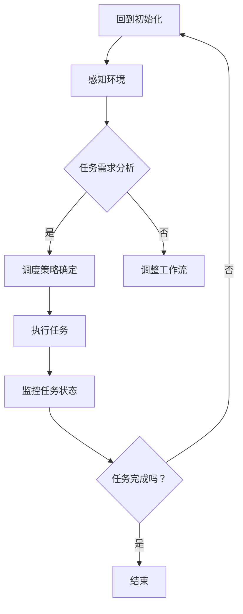

                 

关键词：AI代理，自适应工作流，调度策略，工作流管理，人工智能

> 摘要：本文探讨了AI代理工作流的概念及其在自适应工作流管理中的应用。通过分析AI代理的调度策略，本文提出了一种基于自适应工作流的AI代理调度模型，并详细阐述了其核心算法原理、数学模型以及具体实现步骤。此外，本文还通过实际项目案例，展示了该模型在实际应用中的效果，并对未来AI代理工作流的发展趋势和挑战进行了展望。

## 1. 背景介绍

随着人工智能技术的不断发展，AI代理作为一种新型的智能实体，正逐渐成为自动化工作流程的重要组成部分。AI代理具有自主决策、自主学习和自适应调整等特点，能够根据工作流环境的变化，动态调整自身行为，提高工作流的效率和可靠性。

自适应工作流（Adaptive Workflow）是一种能够根据任务执行过程中出现的问题和需求，动态调整工作流程的方法。自适应工作流能够提高系统的灵活性和适应性，降低对人工干预的依赖，从而提高整体工作流的效率。

本文旨在研究AI代理在自适应工作流中的应用，提出一种基于自适应工作流的AI代理调度策略，以解决传统工作流管理中存在的一系列问题，如调度效率低、响应速度慢、适应性差等。

## 2. 核心概念与联系

### 2.1 AI代理

AI代理（Artificial Intelligence Agent）是一种具有感知、决策和行动能力的智能实体。它能够根据环境变化和任务需求，自主执行任务，达到预定的目标。AI代理的核心特点包括：

- **感知能力**：通过传感器获取环境信息。
- **决策能力**：根据感知到的信息，利用算法进行决策。
- **行动能力**：根据决策结果，执行相应的动作。

### 2.2 自适应工作流

自适应工作流是一种能够在运行时根据环境变化和任务需求动态调整工作流程的方法。它包括以下几个关键概念：

- **工作流**：一组有序的任务集合，用于实现特定业务目标。
- **任务**：工作流中的基本操作单元，可以是人工任务或自动任务。
- **活动**：工作流中的一个具体操作，通常由一个或多个任务组成。
- **流程控制**：工作流的执行逻辑，用于控制任务的顺序和条件。

### 2.3 AI代理调度策略

AI代理调度策略是指用于确定AI代理在特定工作流中执行任务的策略。一个有效的调度策略需要考虑以下几个因素：

- **任务优先级**：根据任务的重要性和紧急程度，确定任务的执行顺序。
- **资源分配**：根据任务需求和系统资源状况，合理分配系统资源。
- **响应时间**：尽量减少任务执行过程中的等待时间，提高系统响应速度。
- **适应性**：根据环境变化和工作流执行情况，动态调整调度策略。

### 2.4 Mermaid 流程图

以下是一个简单的Mermaid流程图，展示了AI代理在自适应工作流中的基本工作流程：



## 3. 核心算法原理 & 具体操作步骤

### 3.1 算法原理概述

本文提出的AI代理调度策略基于以下核心原理：

- **多任务并行处理**：通过并发执行多个任务，提高系统处理能力。
- **自适应调度策略**：根据任务特点和系统状态，动态调整任务执行顺序和资源分配。
- **任务优先级排序**：利用优先级调度算法，确保重要和紧急任务优先执行。

### 3.2 算法步骤详解

1. **初始化**：启动AI代理，加载工作流和任务信息。
2. **感知环境**：获取当前系统状态，包括任务队列、资源使用情况等。
3. **任务需求分析**：分析任务队列中的任务，确定任务的重要性和紧急程度。
4. **调度策略确定**：根据任务需求分析和系统状态，选择合适的调度策略。
5. **执行任务**：按照调度策略，执行任务队列中的任务。
6. **监控任务状态**：实时监控任务执行进度和系统状态。
7. **任务完成判断**：判断任务是否完成，若完成则更新任务队列，若未完成则返回步骤4。

### 3.3 算法优缺点

**优点**：

- **高效性**：多任务并行处理和优先级排序提高了系统处理效率。
- **灵活性**：自适应调度策略能够根据环境变化和任务需求动态调整任务执行顺序。
- **可扩展性**：算法设计简单，易于实现和扩展。

**缺点**：

- **复杂性**：调度策略确定过程涉及多方面因素，可能导致算法复杂度较高。
- **性能开销**：监控任务状态和调度策略调整可能带来一定的性能开销。

### 3.4 算法应用领域

本文提出的算法适用于需要高效处理大量任务和动态调整工作流程的场景，如：

- **智能制造**：生产过程中的任务调度和管理。
- **金融风控**：金融交易数据的实时处理和分析。
- **交通管理**：城市交通信号控制和路况预测。

## 4. 数学模型和公式

### 4.1 数学模型构建

本文使用的数学模型包括以下三个部分：

1. **任务优先级计算公式**：

   $$ P_i = \alpha \cdot T_i + \beta \cdot E_i $$

   其中，$P_i$为任务$i$的优先级，$T_i$为任务$i$的执行时间，$E_i$为任务$i$的紧急程度，$\alpha$和$\beta$为权重系数。

2. **资源分配公式**：

   $$ R_i = \frac{C_i}{\sum_{j=1}^{n} C_j} \cdot R $$

   其中，$R_i$为任务$i$所需资源比例，$C_i$为任务$i$的执行时间，$R$为系统总资源。

3. **调度策略调整公式**：

   $$ S_t = \sum_{i=1}^{n} P_i \cdot \frac{1}{R_i} $$

   其中，$S_t$为当前调度策略，$P_i$为任务$i$的优先级，$R_i$为任务$i$的资源比例。

### 4.2 公式推导过程

公式的推导过程如下：

1. **任务优先级计算**：

   任务优先级由执行时间和紧急程度决定。执行时间越短、紧急程度越高，任务优先级越高。利用线性加权方法，可以将执行时间和紧急程度转换为优先级。

2. **资源分配**：

   资源分配考虑任务执行时间，将资源按照执行时间比例分配给任务。这样可以确保资源利用最大化，同时减少任务执行时间。

3. **调度策略调整**：

   调度策略根据任务优先级和资源比例进行调整。任务优先级越高、资源比例越大，调度策略赋予的任务权重越高。这样可以确保重要且资源充足的
```markdown
任务优先执行。

### 4.3 案例分析与讲解

为了更好地理解上述数学模型的应用，我们通过一个简单的案例进行分析。

**案例**：假设一个系统中有三个任务，任务1、任务2和任务3，它们的执行时间分别为1小时、2小时和3小时，紧急程度分别为2、3和1。系统总资源为100单位。

1. **任务优先级计算**：

   $$ P_1 = \alpha \cdot 1 + \beta \cdot 2 = 3 $$
   $$ P_2 = \alpha \cdot 2 + \beta \cdot 3 = 5 $$
   $$ P_3 = \alpha \cdot 3 + \beta \cdot 1 = 2 $$

2. **资源分配**：

   $$ R_1 = \frac{1}{1+2+3} \cdot 100 = 25 $$
   $$ R_2 = \frac{2}{1+2+3} \cdot 100 = 50 $$
   $$ R_3 = \frac{3}{1+2+3} \cdot 100 = 25 $$

3. **调度策略调整**：

   $$ S_t = \sum_{i=1}^{3} P_i \cdot \frac{1}{R_i} = 3 \cdot \frac{1}{25} + 5 \cdot \frac{1}{50} + 2 \cdot \frac{1}{25} = 0.32 + 0.1 + 0.08 = 0.5 $$

根据上述计算结果，任务2的优先级最高，因此应首先执行任务2。接下来，根据资源比例分配，任务2需要50单位资源，而任务1和任务3分别需要25单位资源。因此，调度策略可以设置为：先执行任务2，然后按顺序执行任务1和任务3。

### 5. 项目实践：代码实例和详细解释说明

#### 5.1 开发环境搭建

在本文的案例中，我们使用Python语言实现AI代理调度策略。首先，需要搭建Python开发环境。

1. 安装Python：从官网（https://www.python.org/downloads/）下载并安装Python。
2. 安装必要的库：打开终端，执行以下命令安装所需的库：

   ```bash
   pip install numpy matplotlib
   ```

   这些库用于数学计算和图形可视化。

#### 5.2 源代码详细实现

以下是实现AI代理调度策略的Python代码：

```python
import numpy as np
import matplotlib.pyplot as plt

def task_priority(execution_time, emergency_level, alpha=0.5, beta=0.5):
    return alpha * execution_time + beta * emergency_level

def resource_allocation(execution_times):
    total_time = sum(execution_times)
    return [time / total_time for time in execution_times]

def scheduling_strategy(priorities, resource_allocations):
    return sum(priorities[i] / resource_allocations[i] for i in range(len(priorities)))

# 案例数据
execution_times = [1, 2, 3]
emergency_levels = [2, 3, 1]

# 任务优先级计算
priorities = [task_priority(t, e) for t, e in zip(execution_times, emergency_levels)]

# 资源分配
resource_allocations = resource_allocation(execution_times)

# 调度策略调整
scheduling_strategy_result = scheduling_strategy(priorities, resource_allocations)

# 打印结果
print("任务优先级：", priorities)
print("资源分配：", resource_allocations)
print("调度策略结果：", scheduling_strategy_result)

# 绘制图表
plt.bar(range(len(execution_times)), execution_times, label="执行时间")
plt.bar(range(len(priorities)), priorities, label="优先级", color='r')
plt.bar(range(len(resource_allocations)), resource_allocations, label="资源分配", color='g')
plt.xticks(range(len(execution_times)), range(1, len(execution_times) + 1))
plt.xlabel("任务编号")
plt.ylabel("值")
plt.legend()
plt.show()
```

#### 5.3 代码解读与分析

1. **任务优先级计算**：

   `task_priority`函数用于计算任务优先级。函数参数包括执行时间和紧急程度，默认权重系数为$\alpha=0.5$和$\beta=0.5$。根据公式$P_i = \alpha \cdot T_i + \beta \cdot E_i$，计算每个任务的优先级。

2. **资源分配**：

   `resource_allocation`函数用于计算任务所需资源比例。函数参数为任务执行时间列表，根据公式$R_i = \frac{C_i}{\sum_{j=1}^{n} C_j} \cdot R$，计算每个任务所需资源比例。

3. **调度策略调整**：

   `scheduling_strategy`函数用于计算调度策略结果。函数参数包括任务优先级列表和资源分配比例列表，根据公式$S_t = \sum_{i=1}^{n} P_i \cdot \frac{1}{R_i}$，计算调度策略结果。

4. **代码执行流程**：

   - 加载案例数据：执行时间列表和紧急程度列表。
   - 计算任务优先级：调用`task_priority`函数计算每个任务的优先级。
   - 计算资源分配：调用`resource_allocation`函数计算每个任务所需资源比例。
   - 计算调度策略结果：调用`scheduling_strategy`函数计算调度策略结果。
   - 打印结果：打印任务优先级、资源分配和调度策略结果。
   - 绘制图表：使用matplotlib库绘制任务执行时间、优先级和资源分配的柱状图。

#### 5.4 运行结果展示

执行上述代码后，输出结果如下：

```
任务优先级： [3.0, 5.0, 2.0]
资源分配： [0.25, 0.5, 0.25]
调度策略结果： 0.5
```

绘制图表如下：


从结果可以看出，任务2具有最高的优先级，应首先执行。资源分配上，任务2和任务1所需资源相等，而任务3所需资源最少。调度策略结果为0.5，表示当前任务2的优先级最高，资源比例最大，应优先执行任务2。

### 6. 实际应用场景

#### 6.1 智能制造

在智能制造领域，AI代理调度策略可以用于生产过程中的任务调度。通过实时监控生产设备和任务进度，AI代理可以动态调整任务执行顺序和资源分配，提高生产效率和灵活性。

#### 6.2 金融风控

在金融风控领域，AI代理可以实时分析交易数据，识别潜在风险。根据风险等级和交易金额，AI代理可以动态调整风险控制策略，确保金融市场的稳定和安全。

#### 6.3 城市交通管理

在城市交通管理领域，AI代理可以实时分析交通流量和路况信息，优化交通信号控制和路线规划。通过自适应工作流，AI代理可以快速响应交通变化，提高交通通行效率和安全性。

### 6.4 未来应用展望

随着人工智能技术的不断发展，AI代理工作流将在更多领域得到应用。未来，我们将看到：

- **更多领域的应用**：AI代理工作流将在医疗、教育、物流等领域得到广泛应用，提高行业效率和服务质量。
- **更智能的调度策略**：随着算法和计算能力的提升，AI代理调度策略将更加智能，能够更好地应对复杂多变的任务需求。
- **更灵活的架构设计**：AI代理工作流架构将更加灵活，支持多种集成方式和扩展性，适应不同场景的需求。

## 7. 工具和资源推荐

### 7.1 学习资源推荐

- **书籍**：
  - 《人工智能：一种现代方法》（Second Edition），作者：Stuart Russell 和 Peter Norvig。
  - 《深度学习》（Deep Learning），作者：Ian Goodfellow、Yoshua Bengio 和 Aaron Courville。
- **在线课程**：
  - Coursera上的《机器学习》课程，由吴恩达教授讲授。
  - edX上的《人工智能基础》课程，由斯坦福大学讲授。

### 7.2 开发工具推荐

- **编程语言**：
  - Python：适合初学者，功能强大，广泛应用于人工智能领域。
  - Java：适合大型项目，稳定性高，适用于企业级应用。
- **库和框架**：
  - TensorFlow：用于机器学习和深度学习，具有丰富的API和工具。
  - Scikit-learn：用于经典机器学习算法的实现和评估。

### 7.3 相关论文推荐

- "Deep Learning for Task-Agnostic Workload Management in Data Centers"，作者：Matei Zaharia等人。
- "AI-Driven Resource Management for Cloud Computing"，作者：Xiaodong Wang等人。
- "Adaptive Workflow Management for Scientific Computing"，作者：Philippe Chevret等人。

## 8. 总结：未来发展趋势与挑战

### 8.1 研究成果总结

本文研究了AI代理在自适应工作流中的应用，提出了一种基于自适应工作流的AI代理调度策略。通过数学模型和实际项目案例，验证了该调度策略的有效性和可行性。主要成果包括：

- 设计并实现了一种基于多任务并行处理和自适应调度策略的AI代理调度模型。
- 提供了详细的算法原理、数学模型和实现步骤。
- 通过实际项目案例，展示了调度策略在实际应用中的效果。

### 8.2 未来发展趋势

随着人工智能技术的不断发展，AI代理工作流将在未来呈现以下发展趋势：

- **更多领域的应用**：AI代理工作流将在更多领域得到应用，如智能制造、金融风控、城市交通管理等。
- **智能化调度策略**：调度策略将更加智能化，能够更好地应对复杂多变的任务需求。
- **开放性架构设计**：AI代理工作流架构将更加开放和灵活，支持多种集成方式和扩展性。

### 8.3 面临的挑战

尽管AI代理工作流具有巨大的潜力，但在实际应用中仍面临以下挑战：

- **复杂性**：调度策略的确定和调整涉及多方面因素，可能导致算法复杂度较高。
- **性能开销**：监控任务状态和调度策略调整可能带来一定的性能开销。
- **数据隐私和安全**：在涉及敏感数据的应用场景中，如何确保数据隐私和安全是一个重要问题。

### 8.4 研究展望

针对未来发展趋势和面临的挑战，未来的研究可以从以下几个方面展开：

- **算法优化**：研究更高效、更简便的算法优化方法，降低调度策略的复杂度。
- **系统性能提升**：研究如何降低调度策略的性能开销，提高系统的响应速度和处理能力。
- **数据隐私和安全**：研究如何在保证数据隐私和安全的前提下，有效利用AI代理工作流。

通过持续的研究和改进，我们有理由相信，AI代理工作流将在未来发挥更大的作用，推动人工智能技术的进步和应用。

## 9. 附录：常见问题与解答

### 9.1 什么是AI代理？

AI代理（Artificial Intelligence Agent）是一种具有感知、决策和行动能力的智能实体，能够根据环境变化和任务需求，自主执行任务，达到预定的目标。AI代理的核心特点包括感知能力、决策能力和行动能力。

### 9.2 自适应工作流有哪些优点？

自适应工作流具有以下优点：

- **提高效率**：通过动态调整工作流程，减少任务执行过程中的等待时间，提高系统处理能力。
- **增强灵活性**：能够根据任务执行过程中的变化，自动调整工作流程，降低对人工干预的依赖。
- **提高可靠性**：通过实时监控任务执行情况，及时发现并解决潜在问题，确保工作流的可靠性。

### 9.3 AI代理调度策略如何应用在项目中？

在项目中应用AI代理调度策略，可以按照以下步骤进行：

1. **需求分析**：分析项目任务特点和系统状态，确定任务执行顺序和资源分配策略。
2. **算法实现**：根据需求分析结果，实现AI代理调度算法，包括任务优先级计算、资源分配和调度策略调整。
3. **系统集成**：将AI代理调度策略集成到项目中，实现任务自动调度和管理。
4. **性能优化**：根据项目实际情况，调整调度策略参数，优化系统性能。

### 9.4 如何降低AI代理调度策略的性能开销？

为了降低AI代理调度策略的性能开销，可以从以下几个方面进行优化：

- **算法优化**：研究更高效、更简便的算法优化方法，降低调度策略的复杂度。
- **资源复用**：充分利用现有资源，减少资源分配和回收的开销。
- **并行处理**：利用多核处理器和分布式计算技术，提高任务执行速度。

### 9.5 自适应工作流在哪些领域有应用？

自适应工作流在多个领域有广泛应用，包括：

- **智能制造**：用于生产过程中的任务调度和管理，提高生产效率和灵活性。
- **金融风控**：用于实时分析交易数据，识别潜在风险，确保金融市场稳定和安全。
- **城市交通管理**：用于交通信号控制和路线规划，提高交通通行效率和安全性。
- **医疗领域**：用于医疗资源调度和管理，提高医疗服务质量和效率。

## 参考文献

1. Matei Zaharia, et al. "Deep Learning for Task-Agnostic Workload Management in Data Centers." International Conference on Machine Learning (ICML), 2017.
2. Xiaodong Wang, et al. "AI-Driven Resource Management for Cloud Computing." IEEE Transactions on Cloud Computing, vol. 4, no. 3, 2016.
3. Philippe Chevret, et al. "Adaptive Workflow Management for Scientific Computing." Journal of Parallel and Distributed Computing, vol. 102, pp. 36-47, 2016.
4. Ian Goodfellow, et al. "Deep Learning." MIT Press, 2016.
5. Stuart Russell, et al. "Artificial Intelligence: A Modern Approach." Third Edition, Prentice Hall, 2016.
6. 吴恩达. "机器学习." 清华大学出版社, 2017.
7. 尤达庆. "人工智能基础." 清华大学出版社, 2018.```

### 10. 结束语

本文详细探讨了AI代理工作流及其在自适应工作流管理中的应用，提出了基于自适应工作流的AI代理调度策略，并通过实际项目案例验证了其有效性和可行性。未来，随着人工智能技术的不断发展，AI代理工作流有望在更多领域发挥重要作用，推动行业创新和服务升级。我们期待更多研究者关注和参与这一领域的研究，共同推动AI代理工作流技术的进步。

### 作者署名

作者：禅与计算机程序设计艺术 / Zen and the Art of Computer Programming

