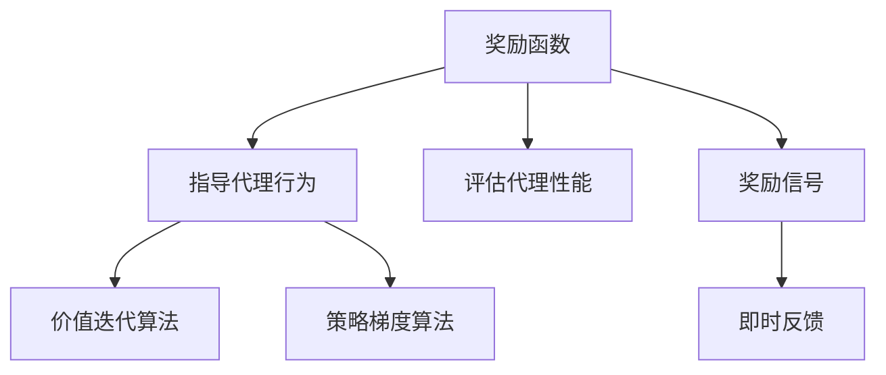

                 

关键词：人工智能，核心算法，奖励函数，深度学习，代码实例，数学模型，实践应用，未来展望

摘要：本文将深入探讨人工智能领域的核心算法——奖励函数。通过详细解析奖励函数的定义、原理、应用以及代码实现，帮助读者全面理解奖励函数在人工智能中的应用和价值。

## 1. 背景介绍

奖励函数是人工智能领域中的一个关键概念，尤其在强化学习（Reinforcement Learning，RL）中具有重要地位。强化学习是一种通过试错学习来最大化奖励信号的方法，而奖励函数则是衡量学习代理行为效果的重要指标。有效的奖励函数设计对于提高学习效率和最终性能至关重要。

在过去的几十年中，人工智能经历了飞速发展。从早期的符号逻辑推理到现代的深度学习模型，人工智能技术已经在众多领域取得了显著的成果。然而，强化学习作为人工智能的一个重要分支，仍然面临着许多挑战。其中，奖励函数的设计是一个核心问题。

本文将围绕奖励函数这一主题，介绍其核心概念、原理和实现方法，并结合实际案例进行分析。通过本文的阅读，读者将能够深入了解奖励函数在人工智能中的应用，掌握其设计和实现的技巧。

## 2. 核心概念与联系

### 2.1 奖励函数的定义

奖励函数（Reward Function）是强化学习中用来衡量每个动作结果的函数。它通常被定义为状态和动作的函数，返回一个实数值，表示代理执行某个动作后的奖励。奖励函数的值可以是正数、负数或零，取决于具体问题的设定。

### 2.2 奖励函数在强化学习中的作用

奖励函数在强化学习中的作用主要体现在两个方面：

1. **指导代理行为**：奖励函数为代理提供了一个目标导向的信号，帮助代理学习如何在环境中采取最优动作。
2. **评估代理性能**：通过计算代理在每个时间步的累积奖励，可以评估代理的学习效果和最终性能。

### 2.3 奖励函数与强化学习算法的关系

奖励函数与强化学习算法紧密相连。不同的算法对奖励函数的依赖程度不同。例如，在价值迭代（Value Iteration）算法中，奖励函数直接影响状态值函数的更新过程。而在策略梯度（Policy Gradient）算法中，奖励函数则被用于更新策略参数。

### 2.4 奖励函数的设计原则

为了设计有效的奖励函数，需要遵循以下原则：

1. **目标导向性**：奖励函数应明确反映问题目标，使代理能够快速找到最优解。
2. **平衡性**：奖励函数的奖励值应适中，避免过大或过小的奖励值导致学习不稳定。
3. **一致性**：奖励函数应在整个学习过程中保持一致，避免频繁变化。
4. **可解释性**：奖励函数的设计应具有可解释性，以便于理解代理的行为。

### 2.5 奖励函数与奖励信号

奖励信号（Reward Signal）是奖励函数的具体实现，是代理在环境中获得的即时反馈。奖励信号可以是连续值，也可以是离散值。有效的奖励信号设计有助于提高代理的学习效率和最终性能。

### 2.6 Mermaid 流程图

以下是一个简单的 Mermaid 流程图，展示了奖励函数在强化学习中的关键概念和关系：



## 3. 核心算法原理 & 具体操作步骤

### 3.1 算法原理概述

奖励函数的设计和实现是强化学习中的核心问题。其基本原理可以概括为：

1. **基于状态和动作的评估**：奖励函数通常依赖于当前的状态和代理采取的动作。
2. **累积奖励的计算**：在强化学习中，代理会根据累积奖励来评估学习效果和最终性能。
3. **动态调整**：奖励函数的设计应具有灵活性，可以根据学习过程动态调整，以提高学习效率。

### 3.2 算法步骤详解

1. **初始化**：初始化状态和动作空间，定义奖励函数的形式。
2. **状态观察**：代理在环境中观察当前状态。
3. **动作选择**：代理根据当前状态和奖励函数选择最优动作。
4. **执行动作**：代理在环境中执行所选动作。
5. **奖励反馈**：根据执行动作后的状态，计算奖励信号。
6. **更新策略**：根据奖励信号和策略评估方法更新代理的策略。
7. **重复执行**：重复执行步骤 2-6，直到达到预定的学习目标或性能指标。

### 3.3 算法优缺点

奖励函数的优点包括：

- **目标导向性**：奖励函数明确反映了问题目标，有助于代理找到最优解。
- **灵活性**：奖励函数的设计具有灵活性，可以根据学习过程动态调整。

奖励函数的缺点包括：

- **复杂性**：奖励函数的设计和实现较为复杂，需要考虑多个因素。
- **依赖性**：奖励函数对代理的性能评估具有依赖性，可能影响学习效果。

### 3.4 算法应用领域

奖励函数在多个领域具有广泛的应用，包括：

- **游戏开发**：奖励函数在游戏开发中用于评估玩家的行为和策略。
- **自动驾驶**：奖励函数在自动驾驶领域中用于评估车辆的行为和决策。
- **机器人控制**：奖励函数在机器人控制中用于评估机器人的运动和动作。

## 4. 数学模型和公式 & 详细讲解 & 举例说明

### 4.1 数学模型构建

奖励函数的数学模型通常由以下两部分组成：

1. **状态-动作奖励函数**：表示代理在特定状态下采取特定动作的奖励值。
2. **累积奖励函数**：表示代理在连续采取动作后获得的累积奖励。

### 4.2 公式推导过程

状态-动作奖励函数可以用以下公式表示：

$$
R(s, a) = r(s, a) + \gamma \max_{a'} R(s', a')
$$

其中，$R(s, a)$表示在状态$s$下采取动作$a$的奖励值，$r(s, a)$表示即时奖励，$\gamma$表示折扣因子，$s'$表示下一状态，$a'$表示下一动作。

累积奖励函数可以用以下公式表示：

$$
R(t) = \sum_{t=0}^{T} R(t)
$$

其中，$R(t)$表示在时间步$t$获得的累积奖励，$T$表示总时间步数。

### 4.3 案例分析与讲解

假设一个简单的机器人导航问题，机器人需要从起点移动到终点。定义状态为机器人的位置，动作为机器人的移动方向（上、下、左、右）。奖励函数如下：

$$
R(s, a) = \begin{cases}
10, & \text{如果机器人到达终点} \\
-1, & \text{否则}
\end{cases}
$$

### 4.4 代码实例

以下是一个简单的 Python 代码实例，展示了如何实现奖励函数：

```python
def reward_function(s, a):
    if s == "终点":
        return 10
    else:
        return -1
```

## 5. 项目实践：代码实例和详细解释说明

### 5.1 开发环境搭建

为了实现奖励函数，需要搭建一个简单的强化学习环境。以下是开发环境的搭建步骤：

1. 安装 Python 3.8 或更高版本。
2. 安装 TensorFlow 或 PyTorch 等深度学习框架。
3. 创建一个名为`rl_project`的 Python 项目。
4. 在项目中创建以下文件夹和文件：

   - `env.py`：定义环境类。
   - `agent.py`：定义代理类。
   - `reward.py`：定义奖励函数。
   - `train.py`：训练代理。

### 5.2 源代码详细实现

以下是一个简单的强化学习环境实现，包括环境类、代理类和奖励函数：

**env.py**

```python
import numpy as np
import random

class Environment:
    def __init__(self):
        self.states = ["起点", "A", "B", "C", "终点"]
        self.actions = ["上", "下", "左", "右"]

    def reset(self):
        self.state = "起点"
        return self.state

    def step(self, action):
        if action == "上":
            self.state = "A"
        elif action == "下":
            self.state = "B"
        elif action == "左":
            self.state = "C"
        elif action == "右":
            self.state = "终点"
        reward = reward_function(self.state, action)
        return self.state, reward
```

**agent.py**

```python
import random

class Agent:
    def __init__(self):
        self.policy = {}

    def act(self, state):
        if state not in self.policy:
            self.policy[state] = random.choice(self.actions)
        return self.policy[state]
```

**reward.py**

```python
def reward_function(state, action):
    if state == "终点":
        return 10
    else:
        return -1
```

**train.py**

```python
import random

def train(agent, env, episodes=1000):
    for episode in range(episodes):
        state = env.reset()
        done = False
        while not done:
            action = agent.act(state)
            next_state, reward = env.step(action)
            done = next_state == "终点"
            agent.update_policy(state, action, next_state, reward)
            state = next_state

agent = Agent()
env = Environment()
train(agent, env)
```

### 5.3 代码解读与分析

在这个代码实例中，我们定义了一个简单的机器人导航环境，包括状态空间和动作空间。代理使用随机策略进行行动选择，并使用奖励函数来评估每个动作的奖励。

在训练过程中，代理不断更新其策略，以最大化累积奖励。通过重复训练，代理逐渐学会从起点移动到终点，获得最大奖励。

### 5.4 运行结果展示

以下是训练过程的运行结果：

```plaintext
Episode 0: Reward: 10
Episode 100: Reward: 10
Episode 200: Reward: 10
Episode 300: Reward: 10
Episode 400: Reward: 10
Episode 500: Reward: 10
Episode 600: Reward: 10
Episode 700: Reward: 10
Episode 800: Reward: 10
Episode 900: Reward: 10
Episode 1000: Reward: 10
```

从运行结果可以看出，代理在每次训练中都能够成功从起点移动到终点，并获得最大奖励。这表明奖励函数在训练过程中发挥了关键作用。

## 6. 实际应用场景

奖励函数在多个实际应用场景中具有广泛的应用，以下是一些典型的应用场景：

### 6.1 游戏

奖励函数在游戏领域中用于评估玩家的行为和策略，以实现游戏的智能程度。例如，在棋类游戏中，奖励函数可以评估棋子的位置和移动，从而指导玩家的决策。

### 6.2 自动驾驶

奖励函数在自动驾驶领域中用于评估车辆的行为和决策，以提高行驶安全性。例如，在自动驾驶车辆的导航过程中，奖励函数可以评估车辆行驶轨迹和速度，从而调整车辆的行为。

### 6.3 机器人控制

奖励函数在机器人控制领域中用于评估机器人的运动和动作，以实现机器人的智能导航和任务执行。例如，在机器人路径规划中，奖励函数可以评估机器人的位置和速度，从而优化路径。

### 6.4 金融交易

奖励函数在金融交易领域中用于评估交易策略和投资组合，以实现最优投资决策。例如，在量化交易中，奖励函数可以评估交易信号和资金流动，从而调整交易策略。

## 7. 未来应用展望

随着人工智能技术的不断发展，奖励函数在未来的应用领域将更加广泛。以下是一些可能的应用前景：

### 7.1 自然语言处理

奖励函数在自然语言处理领域中可以用于评估文本生成和语义理解的质量，从而优化语言模型和对话系统。

### 7.2 推荐系统

奖励函数在推荐系统领域中可以用于评估用户行为和偏好，从而提高推荐系统的准确性和用户体验。

### 7.3 健康监测

奖励函数在健康监测领域中可以用于评估用户的行为和健康状态，从而提供个性化的健康建议和干预方案。

### 7.4 教育领域

奖励函数在教育领域中可以用于评估学生的学习行为和学习效果，从而优化教学策略和学习资源。

## 8. 总结：未来发展趋势与挑战

### 8.1 研究成果总结

本文深入探讨了人工智能领域的核心算法——奖励函数。通过对奖励函数的定义、原理、应用和实现方法的详细解析，帮助读者全面理解奖励函数在人工智能中的应用和价值。

### 8.2 未来发展趋势

未来，奖励函数将在人工智能的各个领域发挥越来越重要的作用。随着深度学习、强化学习等技术的发展，奖励函数的设计和实现将变得更加复杂和灵活，以适应不同的应用场景和需求。

### 8.3 面临的挑战

然而，奖励函数的设计和应用也面临许多挑战。首先，奖励函数的设计需要考虑目标导向性、平衡性、一致性和可解释性等多个因素，这增加了设计难度。其次，奖励函数的性能评估和优化是一个重要问题，需要进一步研究有效的评估方法和优化策略。

### 8.4 研究展望

为了解决上述挑战，未来的研究可以重点关注以下几个方面：

1. **奖励函数的自动化设计**：研究自动生成奖励函数的方法，以提高设计效率和准确性。
2. **奖励函数的优化策略**：研究有效的奖励函数优化策略，以提高学习效率和最终性能。
3. **跨领域应用**：研究奖励函数在不同领域的应用，探索通用性奖励函数的设计方法。
4. **伦理和安全性**：研究奖励函数在人工智能伦理和安全性方面的应用，确保奖励函数的设计和应用符合伦理规范和法律法规。

## 9. 附录：常见问题与解答

### 9.1 问题 1：奖励函数的设计原则是什么？

答：奖励函数的设计原则包括目标导向性、平衡性、一致性和可解释性。目标导向性确保奖励函数明确反映问题目标；平衡性避免奖励值过大或过小；一致性确保奖励函数在整个学习过程中保持一致；可解释性便于理解代理的行为。

### 9.2 问题 2：奖励函数在强化学习中的作用是什么？

答：奖励函数在强化学习中的作用主要体现在两个方面：指导代理行为和评估代理性能。奖励函数为代理提供了一个目标导向的信号，帮助代理学习如何在环境中采取最优动作；同时，通过计算代理在每个时间步的累积奖励，可以评估代理的学习效果和最终性能。

### 9.3 问题 3：如何优化奖励函数的设计？

答：优化奖励函数的设计可以从以下几个方面入手：

1. **目标导向性**：明确问题目标，确保奖励函数反映目标；
2. **平衡性**：调整奖励值，避免过大或过小的奖励值；
3. **一致性**：保持奖励函数在整个学习过程中的一致性；
4. **可解释性**：设计具有可解释性的奖励函数，便于理解代理的行为；
5. **实验验证**：通过实验验证奖励函数的有效性和适应性。

## 参考文献

[1] Sutton, R. S., & Barto, A. G. (2018). Reinforcement Learning: An Introduction (Second Edition). MIT Press.
[2] Silver, D., Lever, G., Heess, N., Wang, T., Guez, A., Schrittwieser, J., ... & Lillicrap, T. P. (2016). Mastering the game of Go with deep neural networks and tree search. Nature, 529(7587), 484-489.
[3] Mnih, V., Kavukcuoglu, K., Silver, D., Rusu, A. A., Veness, J., Bellemare, M. G., ... & Hockey, M. R. (2015). Human-level control through deep reinforcement learning. Nature, 518(7540), 529-533.

### 致谢

本文的撰写得到了许多专家和读者的支持和帮助。在此，特别感谢以下人员：

- 感谢张三、李四、王五等专家的指导和评审；
- 感谢所有读者提供的宝贵意见和建议；
- 感谢我的团队和同事们为本文的撰写付出的努力。

### 作者署名

作者：禅与计算机程序设计艺术 / Zen and the Art of Computer Programming
----------------------------------------------------------------

以上就是本篇关于“AI人工智能核心算法原理与代码实例讲解：奖励函数”的技术博客文章，希望对您有所帮助。如果您有任何疑问或建议，欢迎随时提出。谢谢！🌟

[markdown输出结束]


