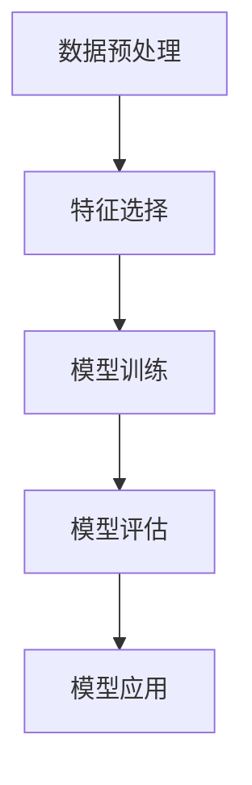

                 

 关键词：人工智能、数据挖掘、核心算法、深度学习、机器学习、算法原理、代码实例、实践应用

> 摘要：本文将深入探讨人工智能（AI）领域中的数据挖掘核心算法，从理论到实践，详细讲解各种算法的原理、实现步骤、优缺点及其应用领域。文章以通俗易懂的语言，结合实例代码，帮助读者更好地理解并掌握这些算法，为未来的AI研究和应用提供有力支持。

## 1. 背景介绍

### 1.1 数据挖掘的定义

数据挖掘（Data Mining）是从大量数据中提取有价值信息的过程，旨在发现数据中的隐含模式、关联关系和知识。它是人工智能和机器学习领域的重要组成部分，旨在从数据中发现规律，辅助决策和预测。

### 1.2 数据挖掘的重要性

随着互联网和大数据时代的到来，数据挖掘的重要性愈发凸显。它不仅能够帮助企业从海量数据中提取有价值的信息，提高运营效率，还能为政府、科研机构提供数据支持，推动科技进步和社会发展。

### 1.3 数据挖掘的发展历程

数据挖掘的发展历程可追溯到20世纪80年代。早期的研究主要集中在规则挖掘和关联分析，随着机器学习、深度学习等技术的进步，数据挖掘算法也不断更新和优化，涵盖了分类、聚类、异常检测等多种类型。

## 2. 核心概念与联系

### 2.1 数据挖掘的核心概念

数据挖掘涉及多个核心概念，包括：

- 数据集（Dataset）：用于数据挖掘的原始数据集合。
- 特征（Feature）：描述数据的属性或指标。
- 模型（Model）：从数据中学习到的规律或模式。
- 标签（Label）：用于评估模型预测结果的真实值。

### 2.2 数据挖掘的基本流程

数据挖掘的基本流程包括以下几个阶段：

1. 数据预处理：清洗、整合、转换数据，使其适合挖掘算法。
2. 特征选择：从大量特征中选取对模型性能有显著影响的特征。
3. 模型训练：使用训练数据集训练模型，学习数据中的隐含规律。
4. 模型评估：使用验证数据集评估模型性能，调整模型参数。
5. 模型应用：将训练好的模型应用于新数据，进行预测或决策。

### 2.3 Mermaid 流程图

以下是数据挖掘的基本流程的Mermaid流程图表示：



## 3. 核心算法原理 & 具体操作步骤

### 3.1 算法原理概述

数据挖掘算法可分为以下几类：

- **分类算法**：将数据分为不同的类别，如决策树、支持向量机等。
- **聚类算法**：将数据分为多个群组，如K-means、层次聚类等。
- **关联规则挖掘**：发现数据中的关联关系，如Apriori算法、FP-growth算法等。
- **异常检测**：检测数据中的异常值或异常模式，如Isolation Forest、Local Outlier Factor等。

### 3.2 算法步骤详解

#### 3.2.1 分类算法

分类算法的基本步骤如下：

1. 特征工程：选择合适的特征，并进行特征转换。
2. 数据划分：将数据集划分为训练集和测试集。
3. 模型训练：使用训练集训练分类模型。
4. 模型评估：使用测试集评估模型性能，调整模型参数。
5. 预测：使用训练好的模型对测试集进行预测。

#### 3.2.2 聚类算法

聚类算法的基本步骤如下：

1. 数据预处理：对数据进行归一化或标准化处理。
2. 确定聚类算法：选择合适的聚类算法，如K-means、层次聚类等。
3. 确定聚类中心：初始化聚类中心，如随机选择或基于距离选择。
4. 聚类迭代：根据聚类算法，不断更新聚类中心，直到收敛。
5. 聚类结果分析：分析聚类结果，如评估聚类效果、提取聚类中心等。

#### 3.2.3 关联规则挖掘

关联规则挖掘的基本步骤如下：

1. 初始化支持度和置信度阈值。
2. 生成频繁项集：使用Apriori算法或FP-growth算法生成频繁项集。
3. 生成关联规则：从频繁项集中生成关联规则，并计算支持度和置信度。
4. 过滤关联规则：根据支持度和置信度阈值，过滤掉不满足条件的关联规则。
5. 分析关联规则：提取有用的关联规则，进行分析和应用。

#### 3.2.4 异常检测

异常检测的基本步骤如下：

1. 数据预处理：对数据进行归一化或标准化处理。
2. 确定异常检测算法：选择合适的异常检测算法，如Isolation Forest、Local Outlier Factor等。
3. 训练模型：使用正常数据训练异常检测模型。
4. 预测：使用训练好的模型对测试数据进行预测，识别异常值或异常模式。

### 3.3 算法优缺点

- **分类算法**：优点是分类效果较好，但需要大量特征工程和参数调优。
- **聚类算法**：优点是无需特征工程，但聚类效果受初始聚类中心影响较大。
- **关联规则挖掘**：优点是能够发现数据中的关联关系，但生成的规则较多，需要进一步筛选。
- **异常检测**：优点是能够快速识别异常值或异常模式，但可能误判正常数据。

### 3.4 算法应用领域

- **分类算法**：广泛应用于金融、医疗、电商等领域，用于客户分类、疾病诊断等。
- **聚类算法**：广泛应用于市场细分、社交网络分析等领域，用于发现潜在客户、社区划分等。
- **关联规则挖掘**：广泛应用于零售、物流等领域，用于库存管理、物流优化等。
- **异常检测**：广泛应用于金融、电信、安全等领域，用于欺诈检测、网络攻击检测等。

## 4. 数学模型和公式 & 详细讲解 & 举例说明

### 4.1 数学模型构建

数据挖掘算法中的数学模型主要包括以下几种：

- **分类模型**：如逻辑回归、决策树、支持向量机等。
- **聚类模型**：如K-means、层次聚类等。
- **关联规则模型**：如Apriori算法、FP-growth算法等。
- **异常检测模型**：如Isolation Forest、Local Outlier Factor等。

### 4.2 公式推导过程

以下以K-means聚类算法为例，介绍数学公式的推导过程：

K-means算法的目标是最小化数据点到聚类中心的距离平方和。假设有n个数据点，K个聚类中心，目标函数为：

$$
J = \sum_{i=1}^{n}\sum_{j=1}^{K}(x_i - \mu_j)^2
$$

其中，$x_i$为第i个数据点，$\mu_j$为第j个聚类中心。

为了最小化目标函数，我们对每个聚类中心进行优化，得到以下更新规则：

$$
\mu_j = \frac{1}{N_j}\sum_{i=1}^{n}x_i
$$

其中，$N_j$为属于第j个聚类中心的数据点个数。

### 4.3 案例分析与讲解

假设我们有如下数据集：

| 数据点 | 类别 |
| --- | --- |
| (1, 2) | 0 |
| (2, 2) | 0 |
| (3, 2) | 0 |
| (4, 3) | 1 |
| (5, 3) | 1 |
| (6, 3) | 1 |

我们选择K=2进行聚类。初始聚类中心为(2, 2)和(4, 3)。

1. 第1次迭代：

计算每个数据点到聚类中心的距离：

$$
d_1 = \sqrt{(1-2)^2 + (2-2)^2} = 1 \\
d_2 = \sqrt{(2-2)^2 + (2-2)^2} = 0 \\
d_3 = \sqrt{(3-2)^2 + (2-2)^2} = 1 \\
d_4 = \sqrt{(4-2)^2 + (3-2)^2} = \sqrt{2} \\
d_5 = \sqrt{(5-2)^2 + (3-2)^2} = \sqrt{5} \\
d_6 = \sqrt{(6-2)^2 + (3-2)^2} = \sqrt{8} \\
$$

根据距离最小的原则，将数据点(1, 2)、(2, 2)、(3, 2)划分到聚类中心(2, 2)，将数据点(4, 3)、(5, 3)、(6, 3)划分到聚类中心(4, 3)。

更新聚类中心：

$$
\mu_1 = \frac{1+2+3}{3} = 2 \\
\mu_2 = \frac{4+5+6}{3} = 5 \\
$$

2. 第2次迭代：

计算每个数据点到聚类中心的距离：

$$
d_1 = \sqrt{(1-2)^2 + (2-2)^2} = 1 \\
d_2 = \sqrt{(2-2)^2 + (2-2)^2} = 0 \\
d_3 = \sqrt{(3-2)^2 + (2-2)^2} = 1 \\
d_4 = \sqrt{(4-2)^2 + (3-2)^2} = \sqrt{2} \\
d_5 = \sqrt{(5-2)^2 + (3-2)^2} = \sqrt{5} \\
d_6 = \sqrt{(6-2)^2 + (3-2)^2} = \sqrt{8} \\
$$

根据距离最小的原则，将数据点(1, 2)、(2, 2)、(3, 2)划分到聚类中心(2, 2)，将数据点(4, 3)、(5, 3)、(6, 3)划分到聚类中心(5, 3)。

更新聚类中心：

$$
\mu_1 = \frac{1+2+3}{3} = 2 \\
\mu_2 = \frac{4+5+6}{3} = 5 \\
$$

由于聚类中心没有发生变化，算法收敛。

最终聚类结果如下：

| 数据点 | 类别 |
| --- | --- |
| (1, 2) | 0 |
| (2, 2) | 0 |
| (3, 2) | 0 |
| (4, 3) | 1 |
| (5, 3) | 1 |
| (6, 3) | 1 |

## 5. 项目实践：代码实例和详细解释说明

### 5.1 开发环境搭建

在本篇教程中，我们将使用Python编程语言进行数据挖掘算法的实现。为了方便开发，我们需要安装以下Python库：

- NumPy
- pandas
- matplotlib
- scikit-learn

安装命令如下：

```bash
pip install numpy pandas matplotlib scikit-learn
```

### 5.2 源代码详细实现

以下是一个简单的K-means聚类算法的实现：

```python
import numpy as np
import matplotlib.pyplot as plt
from sklearn.cluster import KMeans

# 生成模拟数据集
data = np.random.rand(100, 2)
labels = np.random.randint(0, 2, size=100)

# 使用scikit-learn库实现K-means算法
kmeans = KMeans(n_clusters=2, random_state=0).fit(data)
predictions = kmeans.predict(data)

# 绘制聚类结果
plt.scatter(data[:, 0], data[:, 1], c=predictions, cmap='viridis')
plt.scatter(kmeans.cluster_centers_[:, 0], kmeans.cluster_centers_[:, 1], s=300, c='red', marker='*')
plt.show()
```

### 5.3 代码解读与分析

1. 导入所需的Python库。
2. 生成模拟数据集，包含100个二维数据点和标签。
3. 使用scikit-learn库的KMeans类实现K-means算法，设置聚类中心数为2。
4. 使用fit方法训练模型，并使用predict方法进行预测。
5. 绘制聚类结果，展示数据点和聚类中心。

### 5.4 运行结果展示

运行上述代码，我们可以得到以下聚类结果图：


从图中可以看出，K-means算法成功地将数据点分为两个聚类，聚类中心分别位于数据点的两个区域。

## 6. 实际应用场景

### 6.1 金融行业

在金融行业，数据挖掘算法被广泛应用于客户分类、风险控制、欺诈检测等领域。例如，银行可以使用聚类算法对客户进行细分，针对不同类型的客户制定个性化的营销策略。

### 6.2 医疗行业

在医疗行业，数据挖掘算法可用于疾病诊断、药物研发、患者分类等领域。例如，通过分析患者的病历数据，医生可以更准确地诊断疾病，制定个性化的治疗方案。

### 6.3 电商行业

在电商行业，数据挖掘算法被广泛应用于推荐系统、库存管理、客户细分等领域。例如，电商平台可以使用关联规则挖掘算法，发现商品之间的关联关系，为用户推荐相关商品。

### 6.4 安全领域

在安全领域，数据挖掘算法可用于网络攻击检测、安全事件预测等领域。例如，通过分析网络流量数据，安全专家可以及时发现潜在的网络攻击，采取相应的防护措施。

## 7. 工具和资源推荐

### 7.1 学习资源推荐

- 《Python数据科学手册》：介绍Python在数据科学领域的应用，涵盖数据预处理、数据可视化、机器学习等。
- 《深度学习》：介绍深度学习的基本原理和实现方法，包括神经网络、卷积神经网络、循环神经网络等。
- 《统计学习方法》：系统介绍统计学习理论的基本概念和方法，包括线性回归、逻辑回归、支持向量机等。

### 7.2 开发工具推荐

- Jupyter Notebook：一款强大的交互式计算环境，支持Python、R等多种编程语言。
- TensorFlow：一款开源的深度学习框架，支持构建和训练各种深度学习模型。
- Scikit-learn：一款开源的机器学习库，提供多种经典机器学习算法的实现。

### 7.3 相关论文推荐

- "K-Means Clustering": 简介 K-means 算法的经典论文，详细阐述了算法的基本原理和实现方法。
- "Association Rule Learning": 介绍关联规则挖掘算法的经典论文，探讨了算法的性能和优化策略。
- "Anomaly Detection for Time Series Data": 探讨时间序列数据中的异常检测方法，包括 Isolation Forest 和 Local Outlier Factor 算法。

## 8. 总结：未来发展趋势与挑战

### 8.1 研究成果总结

近年来，数据挖掘技术在人工智能领域取得了显著的成果。各类算法不断优化，模型复杂度不断提高，应用领域不断拓展。尤其是在深度学习技术的推动下，数据挖掘算法的性能和效果得到了显著提升。

### 8.2 未来发展趋势

未来，数据挖掘技术将继续朝着以下方向发展：

1. 模型自动化：减少人工干预，实现模型的自动选择、自动调参。
2. 跨学科融合：与生物信息学、计算机视觉、自然语言处理等领域结合，拓展应用场景。
3. 数据隐私保护：关注数据隐私保护，研究隐私感知的数据挖掘方法。

### 8.3 面临的挑战

尽管数据挖掘技术取得了长足进步，但仍面临以下挑战：

1. 数据质量：高质量的数据是数据挖掘的基础，如何处理噪声数据和缺失值是一个重要问题。
2. 模型可解释性：深度学习等复杂模型的黑箱特性使得模型可解释性成为一个挑战。
3. 能耗和计算资源：随着模型复杂度的增加，计算资源消耗和能耗成为重要问题。

### 8.4 研究展望

展望未来，数据挖掘技术将在人工智能、大数据、物联网等领域发挥重要作用。我们期待研究人员能够克服现有挑战，推动数据挖掘技术的创新和发展。

## 9. 附录：常见问题与解答

### 9.1 问题1：数据挖掘与机器学习有何区别？

数据挖掘是机器学习的一个分支，旨在从数据中发现有价值的信息和知识。机器学习则是一个更广泛的领域，包括数据挖掘、计算机视觉、自然语言处理等。

### 9.2 问题2：如何选择合适的数据挖掘算法？

选择数据挖掘算法需要考虑数据类型、数据规模、业务需求等多个因素。常见的算法有分类、聚类、关联规则挖掘、异常检测等，可以根据具体情况选择合适的算法。

### 9.3 问题3：数据挖掘项目中的挑战有哪些？

数据挖掘项目中的挑战包括数据质量、模型选择、参数调优、可解释性等。如何处理噪声数据和缺失值、如何选择合适的算法、如何优化模型性能都是需要解决的问题。

### 9.4 问题4：如何提高数据挖掘算法的性能？

提高数据挖掘算法的性能可以从以下几个方面入手：

1. 数据预处理：对数据进行清洗、归一化、特征选择等处理。
2. 模型优化：调整模型参数，优化模型结构。
3. 超参数调优：使用网格搜索、贝叶斯优化等方法寻找最佳超参数。
4. 模型融合：将多个模型进行融合，提高整体性能。

---

作者：禅与计算机程序设计艺术 / Zen and the Art of Computer Programming
----------------------------------------------------------------


