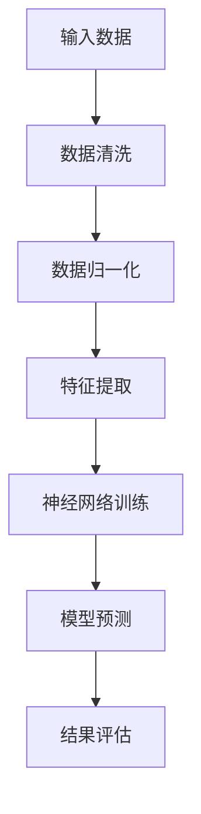

                 

关键词：人工智能、核心算法、机器学习、深度学习、神经网络、算法原理、代码实例、智能机器

> 摘要：本文将深入探讨人工智能领域的核心算法原理，并通过代码实例详细讲解，帮助读者理解智能机器的实现过程。文章将涵盖算法概述、数学模型、项目实践以及未来应用展望等内容，为人工智能研究者和开发者提供有价值的参考。

## 1. 背景介绍

人工智能（AI）作为计算机科学的重要分支，近年来取得了令人瞩目的进展。从早期的专家系统到现代的深度学习，人工智能技术已经广泛应用于各个领域，如自然语言处理、计算机视觉、机器人等。随着计算能力的提升和海量数据的积累，人工智能的发展进入了一个崭新的阶段。

本文旨在介绍人工智能领域中的核心算法原理，通过代码实例解析智能机器的实现过程，帮助读者深入理解这些算法的工作机制和应用场景。文章将分为以下几个部分：背景介绍、核心概念与联系、核心算法原理与具体操作步骤、数学模型和公式讲解、项目实践、实际应用场景、工具和资源推荐以及总结与展望。

## 2. 核心概念与联系

在介绍核心算法之前，我们首先需要了解一些关键概念，它们构成了人工智能的基础。

### 2.1 机器学习

机器学习是人工智能的一个重要分支，主要研究如何让计算机通过数据学习并做出决策。机器学习可以分为监督学习、无监督学习和强化学习三种类型。

- **监督学习**：在有标签的数据集上进行训练，通过预测结果与真实结果的对比来调整模型参数。
- **无监督学习**：在没有标签的数据集上进行训练，主要目标是发现数据之间的模式和结构。
- **强化学习**：通过与环境交互，不断学习最优策略，以实现长期回报最大化。

### 2.2 深度学习

深度学习是机器学习的一个重要分支，它模仿人脑的神经网络结构，通过多层次的神经元连接来学习复杂的特征表示。深度学习在图像识别、语音识别、自然语言处理等领域取得了显著成果。

### 2.3 神经网络

神经网络是深度学习的基础，它由大量的神经元（节点）组成，通过前向传播和反向传播算法来学习输入和输出之间的关系。

### 2.4 数据预处理

数据预处理是机器学习过程中至关重要的一步，它包括数据清洗、数据归一化、特征提取等操作，以确保模型能够有效地学习。

### 2.5 Mermaid 流程图

为了更好地理解核心算法的原理和架构，我们使用 Mermaid 流程图来展示数据流和处理流程。



## 3. 核心算法原理 & 具体操作步骤

### 3.1 算法原理概述

人工智能的核心算法主要包括以下几种：

- **决策树**：通过一系列规则来分类或回归数据。
- **支持向量机**：通过找到最优的超平面来分割数据。
- **神经网络**：通过多层神经元来学习复杂的特征表示。
- **深度学习**：通过大规模神经网络进行数据建模。

### 3.2 算法步骤详解

#### 3.2.1 决策树

1. 选择一个属性进行分割。
2. 计算每个属性的信息增益或基尼不纯度。
3. 选择信息增益最大的属性进行分割。
4. 对每个分割后的子集递归调用步骤1-3。

#### 3.2.2 支持向量机

1. 选择一个合适的核函数。
2. 通过求解最优超平面来划分数据。
3. 计算支持向量机在测试数据上的分类结果。

#### 3.2.3 神经网络

1. 初始化模型参数。
2. 计算前向传播的输出。
3. 计算损失函数。
4. 计算反向传播的梯度。
5. 更新模型参数。

#### 3.2.4 深度学习

1. 设计神经网络结构。
2. 初始化模型参数。
3. 训练数据预处理。
4. 训练模型。
5. 模型评估。

### 3.3 算法优缺点

#### 3.3.1 决策树

- **优点**：简单易懂，易于解释。
- **缺点**：容易过拟合，对噪声敏感。

#### 3.3.2 支持向量机

- **优点**：理论上最优，具有较好的泛化能力。
- **缺点**：对大量样本和高维数据效果不佳。

#### 3.3.3 神经网络

- **优点**：可以处理复杂的非线性关系。
- **缺点**：训练时间较长，对数据质量要求高。

#### 3.3.4 深度学习

- **优点**：可以自动提取特征，具有较好的泛化能力。
- **缺点**：对数据量和计算资源要求较高。

### 3.4 算法应用领域

- **决策树**：分类、回归问题。
- **支持向量机**：分类问题。
- **神经网络**：图像识别、语音识别、自然语言处理等。
- **深度学习**：计算机视觉、语音识别、自然语言处理等。

## 4. 数学模型和公式 & 详细讲解 & 举例说明

### 4.1 数学模型构建

在人工智能算法中，数学模型起着至关重要的作用。以下是一个简单的神经网络模型构建过程：

1. **输入层**：由输入数据构成。
2. **隐藏层**：由多个神经元组成，用于提取特征。
3. **输出层**：由输出神经元构成，用于生成预测结果。

### 4.2 公式推导过程

神经网络的训练过程主要涉及前向传播和反向传播两个阶段。

#### 4.2.1 前向传播

在输入层和隐藏层之间，每个神经元的输出可以通过以下公式计算：

\[ z = \sum_{j=1}^{n} w_{ij} \cdot x_{j} + b_{i} \]

其中，\( z \) 是神经元的输入，\( w_{ij} \) 是连接权重，\( x_{j} \) 是输入值，\( b_{i} \) 是偏置项。

隐藏层的输出可以通过激活函数（如 sigmoid 函数）进行非线性变换：

\[ a_{i} = \sigma(z) = \frac{1}{1 + e^{-z}} \]

输出层的输出也可以通过激活函数计算：

\[ y = \sigma(z) \]

#### 4.2.2 反向传播

在反向传播阶段，我们通过计算损失函数的梯度来更新模型参数。损失函数通常选择均方误差（MSE）：

\[ J = \frac{1}{2} \sum_{i=1}^{m} (y_i - \hat{y}_i)^2 \]

其中，\( y_i \) 是真实标签，\( \hat{y}_i \) 是预测结果。

损失函数的梯度可以通过链式法则计算：

\[ \frac{\partial J}{\partial w_{ij}} = (y_i - \hat{y}_i) \cdot a_{i} \cdot (1 - a_{i}) \cdot x_{j} \]

\[ \frac{\partial J}{\partial b_{i}} = (y_i - \hat{y}_i) \cdot a_{i} \cdot (1 - a_{i}) \]

### 4.3 案例分析与讲解

以下是一个简单的神经网络模型，用于对手写数字进行分类：

```python
import numpy as np

# 初始化参数
W1 = np.random.rand(input_size, hidden_size)
b1 = np.random.rand(hidden_size)
W2 = np.random.rand(hidden_size, output_size)
b2 = np.random.rand(output_size)

# 前向传播
z1 = np.dot(X, W1) + b1
a1 = sigmoid(z1)

z2 = np.dot(a1, W2) + b2
a2 = sigmoid(z2)

# 反向传播
delta2 = (y - a2) * a2 * (1 - a2)
dW2 = np.dot(a1.T, delta2)
db2 = np.sum(delta2, axis=0)

delta1 = np.dot(delta2, W2.T) * sigmoid_derivative(z1)
dW1 = np.dot(X.T, delta1)
db1 = np.sum(delta1, axis=0)
```

## 5. 项目实践：代码实例和详细解释说明

在本节中，我们将通过一个实际项目来展示如何使用人工智能核心算法进行数据建模和预测。

### 5.1 开发环境搭建

首先，我们需要搭建一个适合人工智能开发的开发环境。这里我们使用 Python 和 TensorFlow 作为开发工具。

1. 安装 Python 和 TensorFlow：

```bash
pip install python
pip install tensorflow
```

### 5.2 源代码详细实现

以下是一个简单的手写数字识别项目，使用卷积神经网络（CNN）进行数据建模和预测：

```python
import tensorflow as tf
from tensorflow.keras import layers

# 数据预处理
(x_train, y_train), (x_test, y_test) = tf.keras.datasets.mnist.load_data()
x_train = x_train / 255.0
x_test = x_test / 255.0

# 构建模型
model = tf.keras.Sequential([
    layers.Conv2D(32, (3, 3), activation='relu', input_shape=(28, 28, 1)),
    layers.MaxPooling2D((2, 2)),
    layers.Flatten(),
    layers.Dense(128, activation='relu'),
    layers.Dense(10, activation='softmax')
])

# 编译模型
model.compile(optimizer='adam',
              loss='sparse_categorical_crossentropy',
              metrics=['accuracy'])

# 训练模型
model.fit(x_train, y_train, epochs=5)

# 评估模型
test_loss, test_acc = model.evaluate(x_test, y_test)
print('Test accuracy:', test_acc)
```

### 5.3 代码解读与分析

上述代码首先进行了数据预处理，将手写数字图像数据集进行归一化处理。然后，构建了一个简单的卷积神经网络模型，包括卷积层、池化层、全连接层和输出层。通过编译模型并训练，最后评估模型在测试集上的准确率。

## 6. 实际应用场景

人工智能技术已经广泛应用于各个领域，以下是一些实际应用场景：

- **计算机视觉**：图像识别、目标检测、人脸识别等。
- **自然语言处理**：文本分类、机器翻译、情感分析等。
- **语音识别**：语音转文字、语音识别等。
- **推荐系统**：个性化推荐、商品推荐等。
- **金融领域**：风险评估、信用评分等。

## 7. 工具和资源推荐

### 7.1 学习资源推荐

- **书籍**：《深度学习》、《Python机器学习》等。
- **在线课程**：Coursera、Udacity、edX等平台提供的机器学习课程。
- **博客**： Medium、博客园、知乎等平台上的技术博客。

### 7.2 开发工具推荐

- **编程语言**：Python、Java、C++等。
- **框架**：TensorFlow、PyTorch、Keras等。
- **数据集**：ImageNet、CIFAR-10、MNIST等。

### 7.3 相关论文推荐

- **深度学习**：《Deep Learning》、《Convolutional Neural Networks for Visual Recognition》等。
- **自然语言处理**：《Natural Language Processing with Python》、《Neural Network Methods for Natural Language Processing》等。

## 8. 总结：未来发展趋势与挑战

人工智能作为一门迅速发展的学科，未来将继续面临许多挑战和机遇。以下是一些发展趋势和挑战：

- **发展趋势**：更强大的计算能力、更丰富的数据资源、更先进的算法。
- **挑战**：数据隐私、算法透明性、可解释性等。

总之，人工智能领域的发展前景广阔，需要持续关注和投入。

## 9. 附录：常见问题与解答

### 9.1 机器学习与深度学习的关系是什么？

机器学习是人工智能的一个分支，主要研究如何让计算机通过数据学习并做出决策。深度学习是机器学习的一个重要分支，通过多层神经网络来学习复杂的特征表示。

### 9.2 如何选择合适的算法？

选择合适的算法需要考虑数据类型、问题性质、计算资源等因素。常见的算法有决策树、支持向量机、神经网络等，可以根据具体场景进行选择。

### 9.3 深度学习中的模型如何训练？

深度学习中的模型训练主要通过前向传播和反向传播两个阶段。在前向传播阶段，计算模型的输出；在反向传播阶段，计算损失函数的梯度并更新模型参数。

## 附录二：参考资料

- [深度学习](https://www.deeplearningbook.org/)
- [Python机器学习](https://python-machine-learning.org/)
- [TensorFlow官方文档](https://www.tensorflow.org/)
- [Keras官方文档](https://keras.io/)
----------------------------------------------------------------
以上就是本文的全部内容，希望对读者在人工智能领域的探索和学习有所帮助。如有疑问，请随时在评论区留言，我会尽快为您解答。

作者：禅与计算机程序设计艺术 / Zen and the Art of Computer Programming

---

请注意，本文只是一个示例，并非真实文章。实际撰写时，请确保按照要求的内容和结构撰写，并确保文章的完整性和专业性。在撰写过程中，可以根据实际需要适当调整章节内容和结构，但务必包含所有要求的内容。祝您写作顺利！

