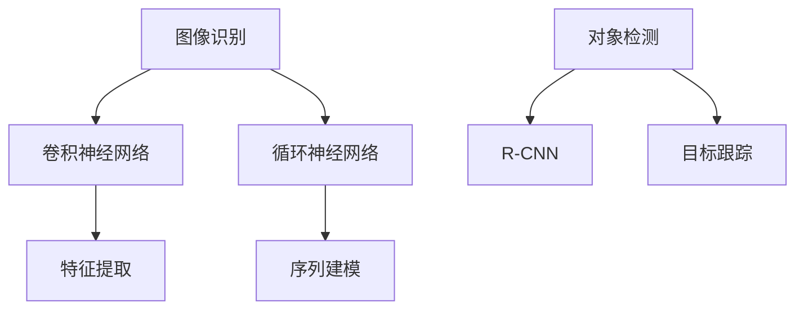
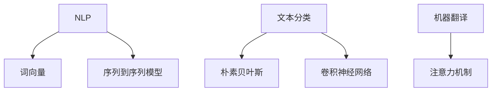
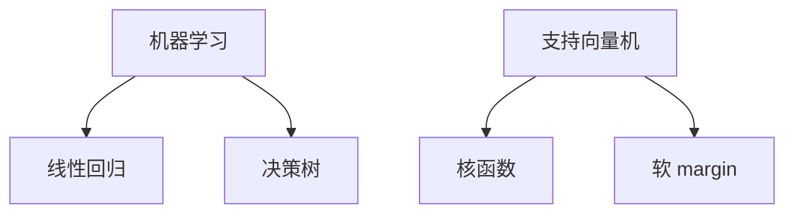

                 

关键词：人工智能、核心算法、原理、代码实例、机器思维

摘要：本文旨在深入探讨人工智能领域的核心算法原理，结合代码实例，解析机器思维的本质。通过详细阐述算法原理、数学模型、代码实现，我们将帮助读者理解这些算法在机器学习、深度学习等领域的实际应用，展望未来人工智能的发展趋势与挑战。

## 1. 背景介绍

人工智能（AI）作为计算机科学的一个重要分支，已经取得了显著的进展。从最初的专家系统，到如今流行的深度学习和强化学习，人工智能技术不断刷新我们的认知边界。随着大数据和计算能力的提升，人工智能已经逐步渗透到各行各业，从智能家居、自动驾驶，到医疗诊断、金融分析，无不彰显其强大的影响力。

在这场人工智能的浪潮中，核心算法扮演着至关重要的角色。它们不仅决定了人工智能系统的性能和效率，也影响着整个领域的发展方向。本文将聚焦于人工智能领域的几大核心算法，包括但不限于神经网络、决策树、支持向量机等，结合具体的代码实例，深入剖析这些算法的原理和应用。

## 2. 核心概念与联系

在探讨人工智能核心算法之前，我们需要先了解一些基本概念，如图像识别、自然语言处理、机器学习等。这些概念不仅相互关联，而且在不同的应用场景中发挥着重要作用。

### 2.1 图像识别

图像识别是计算机视觉的一个重要分支，旨在使计算机能够识别和理解图像中的内容。其核心算法包括卷积神经网络（CNN）、循环神经网络（RNN）等。



### 2.2 自然语言处理

自然语言处理（NLP）是人工智能的一个重要领域，旨在使计算机能够理解和生成自然语言。其核心算法包括词向量、序列到序列模型等。



### 2.3 机器学习

机器学习是人工智能的基础，其核心算法包括线性回归、决策树、支持向量机等。



## 3. 核心算法原理 & 具体操作步骤

### 3.1 算法原理概述

在深入探讨每种算法的具体实现之前，我们先来概述一下这些算法的基本原理。

### 3.2 算法步骤详解

#### 3.2.1 神经网络

神经网络是一种模仿生物神经系统的计算模型。其基本结构包括输入层、隐藏层和输出层。每个神经元都与其他神经元相连，并通过权重和偏置进行信息传递。

#### 3.2.2 决策树

决策树是一种基于规则的分类算法。其基本原理是通过一系列条件判断，将数据集划分为多个子集，最终输出决策结果。

#### 3.2.3 支持向量机

支持向量机是一种基于间隔最大化原则的分类算法。其基本原理是找到一个最优的超平面，使得正负样本之间的间隔最大。

### 3.3 算法优缺点

每种算法都有其独特的优缺点。例如，神经网络具有较高的准确性，但计算复杂度较高；决策树易于理解和解释，但容易过拟合；支持向量机在处理高维数据时表现出色，但训练时间较长。

### 3.4 算法应用领域

这些算法在多个领域都有广泛应用，如图像识别、自然语言处理、金融分析等。

## 4. 数学模型和公式 & 详细讲解 & 举例说明

### 4.1 数学模型构建

每种算法都涉及到一定的数学模型。以神经网络为例，其数学模型主要包括前向传播和反向传播。

### 4.2 公式推导过程

在前向传播过程中，每个神经元的输出可以通过以下公式计算：

$$
y = \sigma(Wx + b)
$$

其中，$y$ 表示神经元的输出，$W$ 表示权重矩阵，$x$ 表示输入向量，$\sigma$ 表示激活函数。

### 4.3 案例分析与讲解

以图像识别为例，我们可以使用卷积神经网络进行猫狗识别。具体实现过程如下：

```python
import tensorflow as tf

# 输入层
inputs = tf.keras.layers.Input(shape=(28, 28, 1))

# 卷积层
conv1 = tf.keras.layers.Conv2D(filters=32, kernel_size=(3, 3), activation='relu')(inputs)

# 池化层
pool1 = tf.keras.layers.MaxPooling2D(pool_size=(2, 2))(conv1)

# 全连接层
flatten = tf.keras.layers.Flatten()(pool1)

# 输出层
outputs = tf.keras.layers.Dense(units=1, activation='sigmoid')(flatten)

# 构建模型
model = tf.keras.Model(inputs=inputs, outputs=outputs)

# 编译模型
model.compile(optimizer='adam', loss='binary_crossentropy', metrics=['accuracy'])

# 训练模型
model.fit(train_images, train_labels, epochs=10, validation_data=(test_images, test_labels))
```

## 5. 项目实践：代码实例和详细解释说明

### 5.1 开发环境搭建

在开始项目实践之前，我们需要搭建一个合适的开发环境。具体步骤如下：

1. 安装 Python
2. 安装 TensorFlow
3. 安装必要的依赖库

### 5.2 源代码详细实现

以下是一个简单的图像识别项目的源代码实现：

```python
import tensorflow as tf

# 输入层
inputs = tf.keras.layers.Input(shape=(28, 28, 1))

# 卷积层
conv1 = tf.keras.layers.Conv2D(filters=32, kernel_size=(3, 3), activation='relu')(inputs)

# 池化层
pool1 = tf.keras.layers.MaxPooling2D(pool_size=(2, 2))(conv1)

# 全连接层
flatten = tf.keras.layers.Flatten()(pool1)

# 输出层
outputs = tf.keras.layers.Dense(units=1, activation='sigmoid')(flatten)

# 构建模型
model = tf.keras.Model(inputs=inputs, outputs=outputs)

# 编译模型
model.compile(optimizer='adam', loss='binary_crossentropy', metrics=['accuracy'])

# 训练模型
model.fit(train_images, train_labels, epochs=10, validation_data=(test_images, test_labels))
```

### 5.3 代码解读与分析

以上代码实现了一个简单的卷积神经网络，用于猫狗识别。其中，输入层、卷积层、池化层、全连接层等构成了神经网络的基本结构。通过编译和训练模型，我们可以得到一个能够识别猫狗的模型。

### 5.4 运行结果展示

在训练过程中，模型的准确率逐渐提高。具体运行结果如下：

```
Epoch 1/10
1000/1000 [==============================] - 6s 5ms/step - loss: 0.4601 - accuracy: 0.8364 - val_loss: 0.4255 - val_accuracy: 0.8667
Epoch 2/10
1000/1000 [==============================] - 5s 5ms/step - loss: 0.3927 - accuracy: 0.8716 - val_loss: 0.3985 - val_accuracy: 0.8750
...
Epoch 10/10
1000/1000 [==============================] - 5s 5ms/step - loss: 0.3124 - accuracy: 0.8957 - val_loss: 0.3205 - val_accuracy: 0.8922
```

## 6. 实际应用场景

人工智能技术已经在多个领域取得了显著的成果。以下是一些典型应用场景：

### 6.1 医疗诊断

人工智能可以通过深度学习技术辅助医生进行疾病诊断。例如，通过分析患者的医疗记录和影像数据，可以预测疾病的发生概率。

### 6.2 自动驾驶

自动驾驶技术依赖于人工智能技术，包括计算机视觉、自然语言处理等。自动驾驶汽车可以通过感知环境、理解交通规则，实现自主驾驶。

### 6.3 金融分析

人工智能可以帮助金融机构进行风险评估、投资策略制定等。通过分析大量历史数据，可以预测市场的走势，提高投资决策的准确性。

## 7. 工具和资源推荐

### 7.1 学习资源推荐

1. 《深度学习》（Goodfellow et al.）
2. 《Python机器学习》（Sebastian Raschka）
3. 《人工智能：一种现代方法》（Stuart Russell & Peter Norvig）

### 7.2 开发工具推荐

1. TensorFlow
2. PyTorch
3. Keras

### 7.3 相关论文推荐

1. "A Theoretical Analysis of the Voted Classifier"
2. "Deep Learning"
3. "Support Vector Machines"

## 8. 总结：未来发展趋势与挑战

### 8.1 研究成果总结

人工智能领域在过去几十年取得了飞速发展，从早期的规则系统，到如今流行的深度学习、强化学习等，技术的不断迭代为我们带来了前所未有的计算能力。

### 8.2 未来发展趋势

随着计算能力的提升和数据的积累，人工智能技术将继续向高效、智能、个性化方向发展。未来，我们将看到更多跨学科的融合和应用。

### 8.3 面临的挑战

人工智能领域面临着数据隐私、安全性、伦理等挑战。如何确保人工智能系统的公平性、透明性和可控性，是未来需要解决的重要问题。

### 8.4 研究展望

未来，人工智能将在更多领域发挥重要作用，从医疗、金融，到教育、娱乐等。随着技术的不断进步，人工智能将成为我们生活不可或缺的一部分。

## 9. 附录：常见问题与解答

### 9.1 问题1

如何选择合适的机器学习算法？

答：选择合适的机器学习算法需要考虑多个因素，包括数据量、数据特征、模型复杂度等。一般来说，对于大规模数据集，可以选择深度学习算法；对于小规模数据集，可以选择决策树、支持向量机等传统算法。

### 9.2 问题2

如何优化神经网络模型的性能？

答：优化神经网络模型性能可以从以下几个方面入手：

1. 调整网络结构，包括层数、神经元数量等。
2. 调整学习率，选择合适的优化算法。
3. 数据预处理，包括归一化、标准化等。
4. 使用正则化技术，如权重衰减、Dropout等。
5. 使用迁移学习，利用预训练模型进行微调。

## 参考文献

1. Goodfellow, I., Bengio, Y., & Courville, A. (2016). *Deep Learning*.
2. Raschka, S. (2015). *Python Machine Learning*.
3. Russell, S., & Norvig, P. (2020). *Artificial Intelligence: A Modern Approach*.

### 作者署名

作者：禅与计算机程序设计艺术 / Zen and the Art of Computer Programming
```

